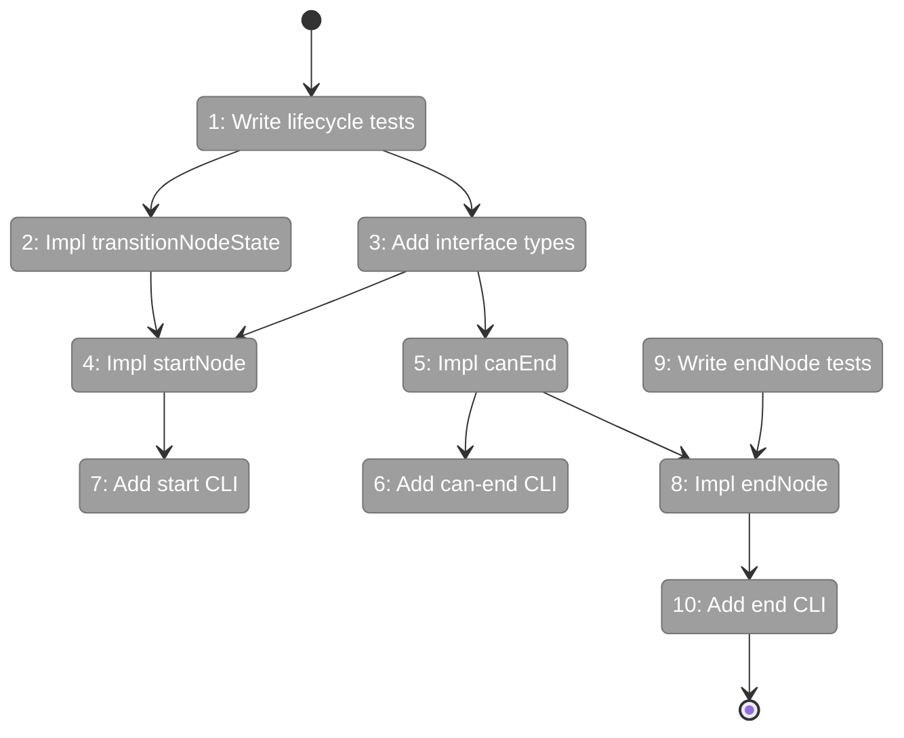
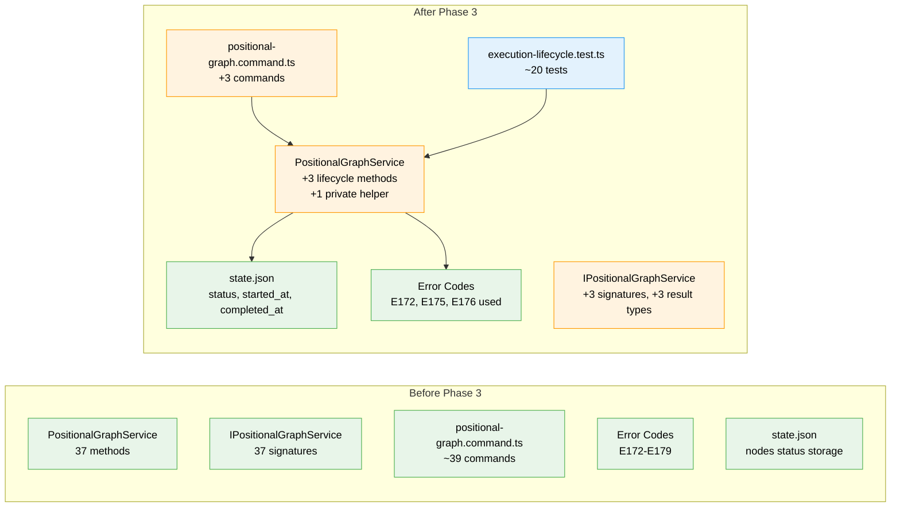

# Flight Plan: Phase 3 — Node Lifecycle

**Plan**: [../../pos-agentic-cli-plan.md](../../pos-agentic-cli-plan.md)
**Phase**: Phase 3: Node Lifecycle
**Generated**: 2026-02-03
**Status**: Ready for takeoff

---

## Departure → Destination

**Where we are**: Phases 1-2 established the foundation — 7 error codes (E172-E179), Question schema, NodeStateEntry extensions, test helpers, and output storage (4 service methods, 4 CLI commands). Agents can now save and retrieve outputs, but they cannot signal when they start or finish work — there are no lifecycle transition commands.

**Where we're going**: By the end of this phase, agents can signal their execution state via three new CLI commands. Running `cg wf node start sample-e2e node-1` transitions the node to `running`. Running `cg wf node can-end sample-e2e node-1` checks if all required outputs are saved. Running `cg wf node end sample-e2e node-1` transitions the node to `complete`. The direct output pattern also works: data-only nodes can skip `start` entirely and go straight to `save-output-data` + `end`.

---

## Flight Status

<!-- Updated by /plan-6: pending → active → done. Use blocked for problems/input needed. -->

**Legend**: grey = pending | yellow = active | red = blocked/needs input | green = done

---

## Stages

<!-- Updated by /plan-6 during implementation: [ ] → [~] → [x] -->

- [ ] **Stage 1: Write lifecycle tests (TDD RED)** — Tests for transitionNodeState, startNode, canEnd (`execution-lifecycle.test.ts` — new file)
- [ ] **Stage 2: Implement transitionNodeState helper** — Private method for atomic state mutations (`positional-graph.service.ts`)
- [ ] **Stage 3: Add interface types and signatures** — StartNodeResult, CanEndResult, EndNodeResult (`positional-graph-service.interface.ts`)
- [ ] **Stage 4: Implement startNode** — Transitions pending/ready → running with timestamp (`positional-graph.service.ts`)
- [ ] **Stage 5: Implement canEnd** — Check required outputs against WorkUnit declarations (`positional-graph.service.ts`)
- [ ] **Stage 6: Add can-end CLI** — Command handler with JSON output (`positional-graph.command.ts`)
- [ ] **Stage 7: Add start CLI** — Command handler with JSON output (`positional-graph.command.ts`)
- [ ] **Stage 8: Implement endNode** — Supports normal and direct output patterns (`positional-graph.service.ts`)
- [ ] **Stage 9: Write endNode tests (TDD RED)** — Tests including direct output pattern (`execution-lifecycle.test.ts`)
- [ ] **Stage 10: Add end CLI** — Command handler with JSON output (`positional-graph.command.ts`)

---

## Acceptance Criteria

- [ ] AC-1: `cg wf node start <slug> <nodeId>` transitions ready node to `running` with `started_at` timestamp
- [ ] AC-2: `cg wf node end <slug> <nodeId>` transitions running node to `complete` with `completed_at` timestamp
- [ ] AC-3: `cg wf node can-end <slug> <nodeId>` returns `canEnd: true` only when all required outputs saved
- [ ] AC-4: Direct output pattern works: `save-output-data` + `end` without `start`
- [ ] AC-16: Invalid state transitions return E172
- [ ] AC-17: Missing outputs on `end` returns E175 with list of missing output names

---

## Goals & Non-Goals

**Goals**:
- Create `transitionNodeState()` private helper for atomic state mutations
- Implement `canEnd` service method with output validation
- Implement `startNode` service method with state machine validation
- Implement `endNode` service method supporting both normal and direct output patterns
- Add 3 CLI commands (`start`, `end`, `can-end`) with JSON output
- Full TDD coverage for all methods including error paths

**Non-Goals**:
- Question/answer protocol (Phase 4)
- Input retrieval (Phase 5)
- E2E test script (Phase 6)
- Fail command to set `blocked-error` status (documented gap)
- WorkUnit output declaration validation warnings (graceful degradation)

---

## Architecture: Before & After

**Legend**: existing (green, unchanged) | changed (orange, modified) | new (blue, created)

---

## Checklist

- [ ] T001: Write tests for transitionNodeState, startNode, canEnd (CS-3)
- [ ] T002: Implement private transitionNodeState helper (CS-3)
- [ ] T003: Add interface signatures and result types (CS-2)
- [ ] T004: Implement startNode in service (CS-2)
- [ ] T005: Implement canEnd in service (CS-2)
- [ ] T006: Add CLI command `cg wf node can-end` (CS-2)
- [ ] T007: Add CLI command `cg wf node start` (CS-2)
- [ ] T008: Implement endNode in service (CS-3)
- [ ] T009: Write tests for endNode including direct output pattern (CS-3)
- [ ] T010: Add CLI command `cg wf node end` (CS-2)

---

## PlanPak

Active — files organized under `packages/positional-graph/src/features/028-pos-agentic-cli/`
