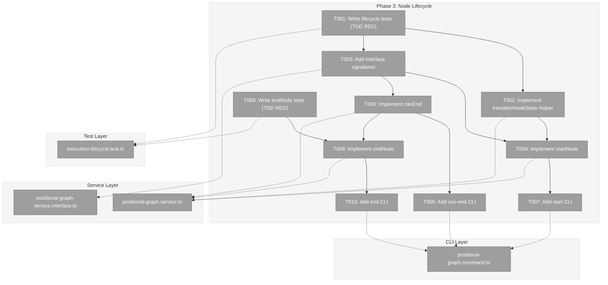
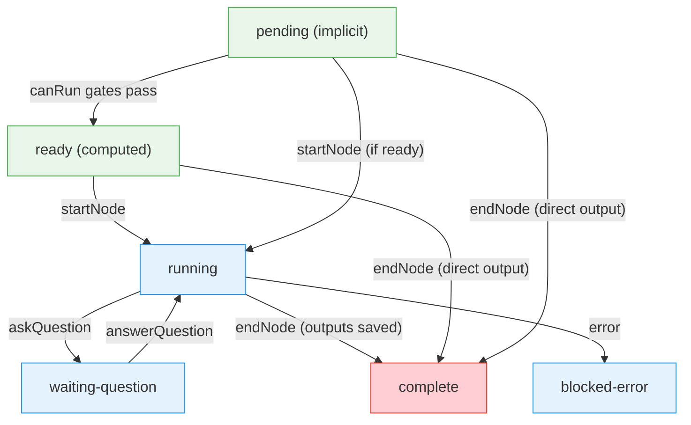
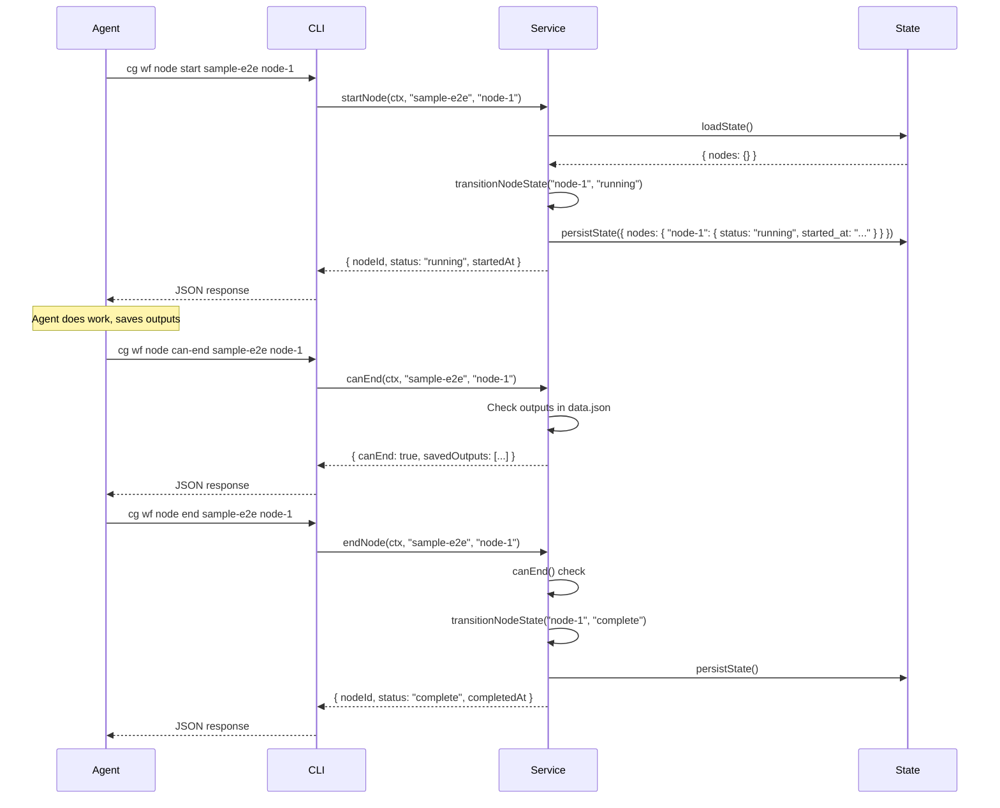
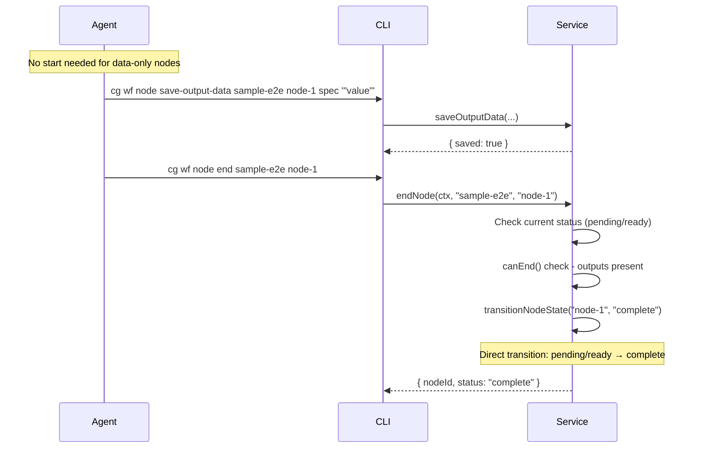

# Phase 3: Node Lifecycle – Tasks & Alignment Brief

**Spec**: [../../pos-agentic-cli-spec.md](../../pos-agentic-cli-spec.md)
**Plan**: [../../pos-agentic-cli-plan.md](../../pos-agentic-cli-plan.md)
**Date**: 2026-02-03

---

## Executive Briefing

### Purpose
This phase implements the state transition methods that allow agents to signal lifecycle events (start, end) and query completion eligibility (`canEnd`). Without this, agents have no way to communicate their execution progress to the orchestrator.

### What We're Building
Three service methods with corresponding CLI commands:
- **`startNode`** — Transitions node from `pending`/`ready` to `running`, records `started_at` timestamp
- **`endNode`** — Transitions node to `complete`, records `completed_at` timestamp (requires all outputs saved)
- **`canEnd`** — Query-only check: returns list of saved/missing required outputs

Plus a centralized `transitionNodeState()` private helper for atomic state mutations.

### User Value
Agents can now signal their execution state to the orchestrator:
- Call `cg wf node start` when beginning work
- Call `cg wf node can-end` to verify all outputs are saved
- Call `cg wf node end` when work is complete

The orchestrator can monitor progress via `cg wf status` which reflects these transitions.

### Example
**Start a node:**
```bash
$ cg wf node start sample-e2e sample-coder-a7b --json
{"nodeId": "sample-coder-a7b", "status": "running", "startedAt": "2026-02-03T10:30:00.000Z", "errors": []}
```

**Direct output pattern (skip start):**
```bash
$ cg wf node save-output-data sample-e2e sample-input-a1b spec '"Write add(a,b)"'
$ cg wf node end sample-e2e sample-input-a1b --json
{"nodeId": "sample-input-a1b", "status": "complete", "completedAt": "2026-02-03T10:30:05.000Z", "errors": []}
```

---

## Objectives & Scope

### Objective
Implement the node lifecycle methods as specified in the plan, enabling agents to signal state transitions via CLI commands (AC-1 through AC-4, AC-16, AC-17).

### Goals

- ✅ Create `transitionNodeState()` private helper for atomic state mutations
- ✅ Implement `canEnd` service method with output validation
- ✅ Implement `startNode` service method with state machine validation
- ✅ Implement `endNode` service method supporting both normal and direct output patterns
- ✅ Add 3 CLI commands (`start`, `end`, `can-end`) with JSON output
- ✅ Full TDD coverage for all methods including error paths

### Non-Goals

- ❌ Question/answer protocol (Phase 4)
- ❌ Input retrieval (Phase 5)
- ❌ E2E test script (Phase 6)
- ❌ Fail command to set `blocked-error` status (documented gap, not this plan)
- ❌ WorkUnit output declaration validation warnings (canEnd gracefully degrades if WorkUnit missing)

---

## Pre-Implementation Audit

### Summary
| File | Action | Origin | Modified By | Recommendation |
|------|--------|--------|-------------|----------------|
| `/home/jak/substrate/028-pos-agentic-cli/packages/positional-graph/src/services/positional-graph.service.ts` | Modified | Plan 026 | Plans 026, 028 Phase 2 | keep-as-is |
| `/home/jak/substrate/028-pos-agentic-cli/packages/positional-graph/src/interfaces/positional-graph-service.interface.ts` | Modified | Plan 026 | Plans 026, 028 Phase 2 | keep-as-is |
| `/home/jak/substrate/028-pos-agentic-cli/apps/cli/src/commands/positional-graph.command.ts` | Modified | Plan 026 | Plans 026, 028 Phase 2 | keep-as-is |
| `/home/jak/substrate/028-pos-agentic-cli/test/unit/positional-graph/execution-lifecycle.test.ts` | Created | N/A | N/A | keep-as-is |

### Compliance Check
No violations found. All files comply with:
- **ADR-0006**: CLI-Based Workflow Agent Orchestration — lifecycle commands enable agent signaling
- **ADR-0008**: Workspace Split Storage — state persisted to `.chainglass/data/workflows/{slug}/state.json`
- **R-TEST-007**: Fake-only policy — existing test patterns use `FakeFileSystem`, `FakePathResolver`

---

## Requirements Traceability

### Coverage Matrix
| AC | Description | Flow Summary | Files in Flow | Tasks | Status |
|----|-------------|--------------|---------------|-------|--------|
| AC-1 | start: ready → running + started_at | CLI → service.startNode → loadState → transitionNodeState → persistState | interface, service, CLI, test | T001-T004 | ✅ Complete |
| AC-2 | end: running → complete + completed_at | CLI → service.endNode → canEnd → transitionNodeState → persistState | interface, service, CLI, test | T001, T008-T011 | ✅ Complete |
| AC-3 | can-end returns true only when outputs saved | CLI → service.canEnd → loadNodeConfig → workUnitLoader → getOutputData | interface, service, CLI, test | T001, T005-T007 | ✅ Complete |
| AC-4 | Direct output pattern (end without start) | saveOutputData (Phase 2) + endNode accepting ready/pending → complete | service | T008 | ✅ Complete |
| AC-16 | Invalid state transitions return E172 | transitionNodeState validates from-state, returns E172 | service, errors | T001-T002, T004, T009 | ✅ Complete |
| AC-17 | Missing outputs on end returns E175 | endNode calls canEnd → returns E175 with missing list | service, errors | T008-T009 | ✅ Complete |

### Gaps Found
None — all acceptance criteria have complete file coverage. Interface exports handled implicitly by TypeScript compilation (re-exporting from interface file).

### Orphan Files
| File | Tasks | Assessment |
|------|-------|------------|
| `execution-lifecycle.test.ts` | T001, T004, T005, T008-T009 | Test infrastructure — validates AC-1 through AC-4, AC-16, AC-17 |

---

## Architecture Map

### Component Diagram
<!-- Status: grey=pending, orange=in-progress, green=completed, red=blocked -->
<!-- Updated by plan-6 during implementation -->



### Task-to-Component Mapping

<!-- Status: ⬜ Pending | 🟧 In Progress | ✅ Complete | 🔴 Blocked -->

| Task | Component(s) | Files | Status | Comment |
|------|-------------|-------|--------|---------|
| T001 | Test Suite | execution-lifecycle.test.ts | ⬜ Pending | TDD RED: transitionNodeState, startNode, canEnd tests |
| T002 | Service | positional-graph.service.ts | ⬜ Pending | Private helper for atomic state transitions |
| T003 | Interface | positional-graph-service.interface.ts | ⬜ Pending | StartNodeResult, CanEndResult, EndNodeResult types + signatures |
| T004 | Service | positional-graph.service.ts | ⬜ Pending | startNode implementation using transitionNodeState |
| T005 | Service | positional-graph.service.ts | ⬜ Pending | canEnd implementation with WorkUnit output checking |
| T006 | CLI | positional-graph.command.ts | ⬜ Pending | cg wf node can-end command |
| T007 | CLI | positional-graph.command.ts | ⬜ Pending | cg wf node start command |
| T008 | Service | positional-graph.service.ts | ⬜ Pending | endNode implementation with direct output pattern |
| T009 | Test Suite | execution-lifecycle.test.ts | ⬜ Pending | TDD RED: endNode tests including direct output pattern |
| T010 | CLI | positional-graph.command.ts | ⬜ Pending | cg wf node end command |

---

## Tasks

| Status | ID | Task | CS | Type | Dependencies | Absolute Path(s) | Validation | Subtasks | Notes |
|--------|------|------|-----|------|--------------|------------------|------------|----------|-------|
| [ ] | T001 | Write tests for transitionNodeState helper, startNode, and canEnd | 3 | Test | – | `/home/jak/substrate/028-pos-agentic-cli/test/unit/positional-graph/execution-lifecycle.test.ts` | Tests fail with "method not defined" (TDD RED) | – | Per Critical Finding 04 |
| [ ] | T002 | Implement private `transitionNodeState()` helper | 3 | Core | T001 | `/home/jak/substrate/028-pos-agentic-cli/packages/positional-graph/src/services/positional-graph.service.ts` | Tests from T001 for helper pass; atomic write pattern used | – | Per Critical Finding 04, 08 |
| [ ] | T003 | Add interface signatures and result types | 2 | Setup | – | `/home/jak/substrate/028-pos-agentic-cli/packages/positional-graph/src/interfaces/positional-graph-service.interface.ts` | TypeScript compiles; StartNodeResult, CanEndResult, EndNodeResult exported | – | – |
| [ ] | T004 | Implement `startNode` in service | 2 | Core | T002, T003 | `/home/jak/substrate/028-pos-agentic-cli/packages/positional-graph/src/services/positional-graph.service.ts` | startNode tests pass; E172 for invalid transitions | – | – |
| [ ] | T005 | Implement `canEnd` in service | 2 | Core | T003 | `/home/jak/substrate/028-pos-agentic-cli/packages/positional-graph/src/services/positional-graph.service.ts` | canEnd tests pass; graceful degradation if WorkUnit missing | – | Per Critical Finding 10 |
| [ ] | T006 | Add CLI command `cg wf node can-end` | 2 | CLI | T005 | `/home/jak/substrate/028-pos-agentic-cli/apps/cli/src/commands/positional-graph.command.ts` | CLI builds; JSON output per workshop | – | – |
| [ ] | T007 | Add CLI command `cg wf node start` | 2 | CLI | T004 | `/home/jak/substrate/028-pos-agentic-cli/apps/cli/src/commands/positional-graph.command.ts` | CLI builds; JSON output per workshop | – | – |
| [ ] | T008 | Implement `endNode` in service | 3 | Core | T005 | `/home/jak/substrate/028-pos-agentic-cli/packages/positional-graph/src/services/positional-graph.service.ts` | endNode tests pass; direct output pattern works | – | Per Critical Finding 11 |
| [ ] | T009 | Write tests for `endNode` including direct output pattern | 3 | Test | T001 | `/home/jak/substrate/028-pos-agentic-cli/test/unit/positional-graph/execution-lifecycle.test.ts` | Tests fail with "endNode not defined" (TDD RED) | – | AC-4 direct output |
| [ ] | T010 | Add CLI command `cg wf node end` | 2 | CLI | T008 | `/home/jak/substrate/028-pos-agentic-cli/apps/cli/src/commands/positional-graph.command.ts` | CLI builds; JSON output per workshop | – | – |

---

## Alignment Brief

### Prior Phases Review

#### Phase 1: Foundation - Error Codes and Schemas (Complete)

**Deliverables Created:**
- **Error factories** (`positional-graph-errors.ts:209-260`): E172 `invalidStateTransitionError`, E175 `outputNotFoundError`, E176 `nodeNotRunningError` — all needed for Phase 3
- **State schema** (`state.schema.ts`): `NodeStateEntrySchema` with `status`, `started_at`, `completed_at`, `pending_question_id`, `error` fields
- **Test helpers** (`test-helpers.ts`): `stubWorkUnitLoader()` with configurable outputs — used for `canEnd` testing

**Dependencies Exported for Phase 3:**
- `E172 invalidStateTransitionError(nodeId, fromState, toState)` — for state machine violations
- `E176 nodeNotRunningError(nodeId)` — for operations requiring running state
- `NodeStateEntrySchema` with all required fields for lifecycle transitions
- `stubWorkUnitLoader()` for mocking WorkUnit declarations in tests

**Key Learnings:**
- All schema extensions use optional fields for backward compatibility
- Error factories include `action` field with CLI command hints for recovery

#### Phase 2: Output Storage (Complete)

**Deliverables Created:**
- **Service methods** (`positional-graph.service.ts:1414-1635`): `saveOutputData`, `saveOutputFile`, `getOutputData`, `getOutputFile`
- **Result types** (`positional-graph-service.interface.ts:346-375`): `SaveOutputDataResult`, `SaveOutputFileResult`, `GetOutputDataResult`, `GetOutputFileResult`
- **CLI commands** (`positional-graph.command.ts:1289-1374`): 4 output storage commands
- **Test file** (`output-storage.test.ts`): 21 tests covering all methods

**Dependencies Exported for Phase 3:**
- `getOutputData(ctx, graphSlug, nodeId, outputName)` — called by `canEnd` to check if outputs are saved
- Data storage format: `nodes/{nodeId}/data/data.json` with `{ "outputs": {...} }` structure
- Test patterns: `createTestContext()`, `createTestService()` helpers

**Key Learnings:**
- TDD approach with all tests upfront works well for consolidated implementation
- Reusing existing infrastructure (`loadNodeConfig`, `atomicWriteFile`) reduces code

---

### Critical Findings Affecting This Phase

| Finding | Constraint | Tasks Addressing |
|---------|------------|------------------|
| #04: Double-start state machine violation | Strict state validation before every mutation; return E172 for invalid transitions | T001, T002, T004 |
| #08: State transition logic needs centralized helper | Create private `transitionNodeState()` for atomic mutations | T002 |
| #10: WorkUnit loader may be unavailable | Graceful degradation in `canEnd` if WorkUnit missing | T005 |
| #11: Direct output pattern allows `end` without `start` | Accept both `running` and `ready`/`pending` as valid states for `endNode` | T008, T009 |

---

### ADR Decision Constraints

**ADR-0006**: CLI-Based Workflow Agent Orchestration
- CLI commands are the orchestration interface
- Agents invoke `cg wf node` commands to signal state
- Constrains: All lifecycle operations via CLI commands
- Addressed by: T006, T007, T010

**ADR-0008**: Workspace Split Storage
- State persisted to `.chainglass/data/workflows/{slug}/state.json`
- Uses atomic write pattern
- Constrains: All state mutations via `persistState()`
- Addressed by: T002

---

### Invariants & Guardrails

1. **State machine integrity**: No transition from `complete` (terminal state)
2. **Atomic writes**: All state.json mutations use `atomicWriteFile`
3. **Error code consistency**: E172 for invalid transitions, E175 for missing outputs
4. **Node existence validation**: All methods verify node exists via `loadNodeConfig` before mutations

---

### Inputs to Read

| File | Purpose |
|------|---------|
| `packages/positional-graph/src/services/positional-graph.service.ts` | Understand existing patterns, private helpers |
| `packages/positional-graph/src/schemas/state.schema.ts` | NodeStateEntrySchema structure |
| `test/unit/positional-graph/output-storage.test.ts` | Test patterns to follow |
| `test/unit/positional-graph/test-helpers.ts` | Existing test helpers |

---

### Visual Alignment Aids

#### State Machine Flow



#### Sequence: Normal Execution



#### Sequence: Direct Output Pattern



---

### Test Plan (Full TDD)

#### Test File: `execution-lifecycle.test.ts`

**Setup:**
- Use `FakeFileSystem`, `FakePathResolver` from `@chainglass/shared`
- Use `stubWorkUnitLoader()` from `test-helpers.ts`
- Create graph and node in `beforeEach` using service methods

**Tests for `transitionNodeState` helper (T001):**

| Test | Purpose | Expected |
|------|---------|----------|
| `validates from-state before mutation` | Proves E172 error for invalid from-state | E172 returned, state unchanged |
| `writes atomically to state.json` | Proves atomic write pattern used | State file updated correctly |
| `handles all valid transitions` | Proves state machine correctness | Transitions succeed |

**Tests for `startNode` (T001):**

| Test | Purpose | Expected |
|------|---------|----------|
| `transitions from ready to running` | Core happy path | status: 'running', startedAt set |
| `transitions from pending to running` | Pending node can start | status: 'running' |
| `rejects double start with E172` | Prevents state corruption | E172, state unchanged |
| `rejects start on complete node with E172` | Terminal state protection | E172 |
| `records started_at timestamp` | AC-1 timestamp requirement | ISO timestamp present |
| `returns E153 for unknown node` | Node validation | E153 |

**Tests for `canEnd` (T001):**

| Test | Purpose | Expected |
|------|---------|----------|
| `returns true when all outputs saved` | Happy path | canEnd: true, missingOutputs: [] |
| `returns false with missing outputs` | AC-3 requirement | canEnd: false, missingOutputs: ['name'] |
| `gracefully degrades if WorkUnit not found` | Finding #10 | canEnd: true with warning |
| `returns E153 for unknown node` | Node validation | E153 |

**Tests for `endNode` (T009):**

| Test | Purpose | Expected |
|------|---------|----------|
| `transitions from running to complete` | Normal end | status: 'complete', completedAt set |
| `allows end without start when outputs saved` | AC-4 direct output | status: 'complete' |
| `returns E175 when outputs missing` | AC-17 | E175 with missing list |
| `rejects end on waiting-question with E172` | State machine | E172 |
| `records completed_at timestamp` | AC-2 timestamp | ISO timestamp |

---

### Step-by-Step Implementation Outline

1. **T001**: Create `execution-lifecycle.test.ts` with all tests (expect failures)
2. **T003**: Add result types and method signatures to interface
3. **T002**: Implement `transitionNodeState()` private helper
4. **T004**: Implement `startNode()` using helper
5. **T005**: Implement `canEnd()` with WorkUnit loader
6. **T006**: Add `cg wf node can-end` CLI command
7. **T007**: Add `cg wf node start` CLI command
8. **T009**: Add endNode tests to test file
9. **T008**: Implement `endNode()` with direct output support
10. **T010**: Add `cg wf node end` CLI command

---

### Commands to Run

```bash
# Run phase tests only
pnpm test -- --run test/unit/positional-graph/execution-lifecycle.test.ts

# Run all positional-graph tests
pnpm test -- --run test/unit/positional-graph/

# Build CLI to verify compilation
pnpm --filter @chainglass/cli build

# Test CLI commands manually
node apps/cli/dist/cli.cjs wf node start --help
node apps/cli/dist/cli.cjs wf node end --help
node apps/cli/dist/cli.cjs wf node can-end --help

# Full quality check
just fft
```

---

### Risks & Unknowns

| Risk | Likelihood | Impact | Mitigation |
|------|------------|--------|------------|
| WorkUnit loader unavailable during canEnd | Low | Medium | Graceful degradation with warning (per Finding #10) |
| State machine edge cases | Medium | High | Comprehensive test coverage in T001, T009 |
| Concurrent access to state.json | Low | Medium | Atomic write pattern (existing) |

---

### Ready Check

- [ ] Prior phases complete (Phase 1 ✅, Phase 2 ✅)
- [ ] Error codes exist (E172, E175, E176 from Phase 1)
- [ ] Output storage works (Phase 2 provides getOutputData for canEnd)
- [ ] Test helpers available (stubWorkUnitLoader from Phase 1)
- [ ] ADR constraints understood and mapped to tasks

---

## Phase Footnote Stubs

_To be populated by plan-6 during implementation._

| Footnote | Description | Files Changed |
|----------|-------------|---------------|
| [^5] | Phase 3 - Node lifecycle implementation | _pending_ |

---

## Evidence Artifacts

- **Execution Log**: `./execution.log.md` — created by plan-6 during implementation
- **Test Results**: Output from `pnpm test` runs captured in execution log
- **CLI Verification**: Help text and sample outputs captured in execution log

---

## Discoveries & Learnings

_Populated during implementation by plan-6. Log anything of interest to your future self._

| Date | Task | Type | Discovery | Resolution | References |
|------|------|------|-----------|------------|------------|
| | | | | | |

**Types**: `gotcha` | `research-needed` | `unexpected-behavior` | `workaround` | `decision` | `debt` | `insight`

**What to log**:
- Things that didn't work as expected
- External research that was required
- Implementation troubles and how they were resolved
- Gotchas and edge cases discovered
- Decisions made during implementation
- Technical debt introduced (and why)
- Insights that future phases should know about

_See also: `execution.log.md` for detailed narrative._

---

## Directory Layout

```
docs/plans/028-pos-agentic-cli/
  ├── pos-agentic-cli-plan.md
  ├── pos-agentic-cli-spec.md
  └── tasks/
      ├── phase-1-foundation-error-codes-and-schemas/
      │   ├── tasks.md
      │   ├── tasks.fltplan.md
      │   └── execution.log.md
      ├── phase-2-output-storage/
      │   ├── tasks.md
      │   ├── tasks.fltplan.md
      │   └── execution.log.md
      └── phase-3-node-lifecycle/
          ├── tasks.md           # This file
          ├── tasks.fltplan.md   # Generated by /plan-5b
          └── execution.log.md   # Created by /plan-6
```
