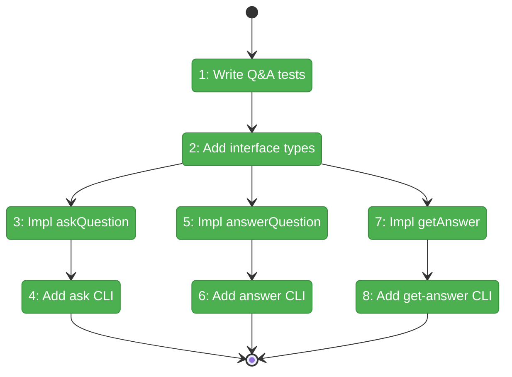

# Flight Plan: Phase 4 — Question/Answer Protocol

**Plan**: [../../pos-agentic-cli-plan.md](../../pos-agentic-cli-plan.md)
**Phase**: Phase 4: Question/Answer Protocol
**Generated**: 2026-02-03
**Status**: Landed

---

## Departure → Destination

**Where we are**: Phases 1-3 established the foundation — 7 error codes (E172-E179), Question schema, NodeStateEntry extensions, output storage (4 methods, 4 CLI commands), and node lifecycle (3 methods, 3 CLI commands). Agents can now start work, save outputs, and complete execution. However, they cannot pause to request human input — there is no question/answer protocol.

**Where we're going**: By the end of this phase, agents can ask questions and wait for orchestrator answers. Running `cg wf node ask sample-e2e node-1 --type single --text "?" --options a b` transitions the node to `waiting-question` and returns a question ID. The orchestrator answers with `cg wf node answer sample-e2e node-1 <qId> '"a"'`, which stores the answer and resumes the node to `running`. The agent retrieves the answer with `cg wf node get-answer sample-e2e node-1 <qId>`.

---

## Flight Status

<!-- Updated by /plan-6: pending → active → done. Use blocked for problems/input needed. -->



**Legend**: grey = pending | yellow = active | red = blocked/needs input | green = done

---

## Stages

<!-- Updated by /plan-6 during implementation: [ ] → [~] → [x] -->

- [x] **Stage 1: Write Q&A tests (TDD RED)** — Tests for askQuestion, answerQuestion, getAnswer (`question-answer.test.ts` — new file)
- [x] **Stage 2: Add interface signatures** — AskQuestionResult, AnswerQuestionResult, GetAnswerResult types + 3 method signatures (`positional-graph-service.interface.ts`)
- [x] **Stage 3: Implement askQuestion** — Generate timestamp ID, transition to waiting-question, store question (`positional-graph.service.ts`)
- [x] **Stage 4: Add ask CLI** — Command with --type, --text, --options flags (`positional-graph.command.ts`)
- [x] **Stage 5: Implement answerQuestion** — Store answer, transition to running, clear pending_question_id (`positional-graph.service.ts`)
- [x] **Stage 6: Add answer CLI** — Command handler with JSON output (`positional-graph.command.ts`)
- [x] **Stage 7: Implement getAnswer** — Read question from state.questions[], return answer status (`positional-graph.service.ts`)
- [x] **Stage 8: Add get-answer CLI** — Command handler with JSON output (`positional-graph.command.ts`)

---

## Acceptance Criteria

- [x] AC-5: `cg wf node ask <slug> <nodeId> --type single --text "?" --options a b` transitions node to `waiting-question` and returns question ID
- [x] AC-6: `cg wf node answer <slug> <nodeId> <qId> <answer>` stores the answer and transitions node back to `running`
- [x] AC-7: `cg wf node get-answer <slug> <nodeId> <qId>` returns the stored answer
- [x] AC-18: Invalid question ID returns E173

---

## Goals & Non-Goals

**Goals**:
- Implement `askQuestion` service method with timestamp-based question ID generation
- Implement `answerQuestion` service method with state transition `waiting-question` → `running`
- Implement `getAnswer` service method for answer retrieval
- Add 3 CLI commands (`ask`, `answer`, `get-answer`) under `cg wf node`
- Questions stored atomically in `state.json.questions[]` array
- Full TDD coverage including error paths (E173, E176, E177)

**Non-Goals**:
- Question UI/display (orchestrator responsibility)
- Answer validation against options (orchestrator responsibility)
- Question timeout/expiration (not in scope)
- Multiple concurrent questions per node (single pending question per node)
- Input retrieval (Phase 5)
- E2E test (Phase 6)

---

## Architecture: Before & After

```mermaid
flowchart LR
    classDef existing fill:#E8F5E9,stroke:#4CAF50,color:#000
    classDef changed fill:#FFF3E0,stroke:#FF9800,color:#000
    classDef new fill:#E3F2FD,stroke:#2196F3,color:#000

    subgraph Before["Before Phase 4"]
        PS1[PositionalGraphService<br/>40 methods]:::existing
        INT1[IPositionalGraphService<br/>40 signatures]:::existing
        CLI1[positional-graph.command.ts<br/>~42 commands]:::existing
        ERR1[Error Codes<br/>E172-E179]:::existing
        SCH1[Question Schema]:::existing
        STATE1[state.json<br/>nodes + transitions]:::existing
    end

    subgraph After["After Phase 4"]
        PS2[PositionalGraphService<br/>+3 Q&A methods]:::changed
        INT2[IPositionalGraphService<br/>+3 signatures, +3 result types]:::changed
        CLI2[positional-graph.command.ts<br/>+3 commands]:::changed
        ERR2[Error Codes<br/>E173, E176, E177 used]:::existing
        SCH2[Question Schema]:::existing
        STATE2[state.json<br/>nodes + transitions + questions[]]:::changed
        TST2[question-answer.test.ts<br/>~15 tests]:::new

        PS2 --> STATE2
        CLI2 --> PS2
        PS2 --> ERR2
        TST2 --> PS2
    end
```

**Legend**: existing (green, unchanged) | changed (orange, modified) | new (blue, created)

---

## Checklist

- [x] T001: Write tests for askQuestion, answerQuestion, getAnswer (CS-3)
- [x] T002: Add interface signatures and result types (CS-2)
- [x] T003: Implement askQuestion in service (CS-3)
- [x] T004: Add CLI command `cg wf node ask` (CS-2)
- [x] T005: Implement answerQuestion in service (CS-3)
- [x] T006: Add CLI command `cg wf node answer` (CS-2)
- [x] T007: Implement getAnswer in service (CS-2)
- [x] T008: Add CLI command `cg wf node get-answer` (CS-2)

---

## PlanPak

Active — files organized under `packages/positional-graph/src/features/028-pos-agentic-cli/`
