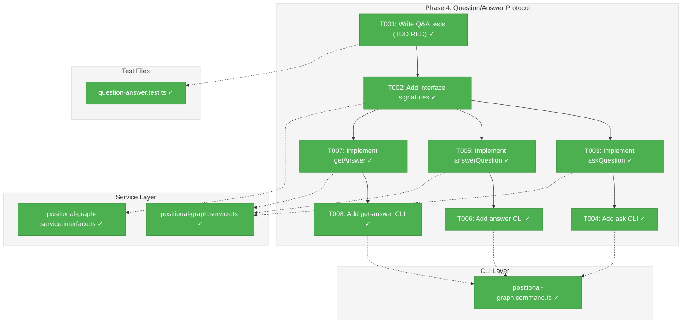
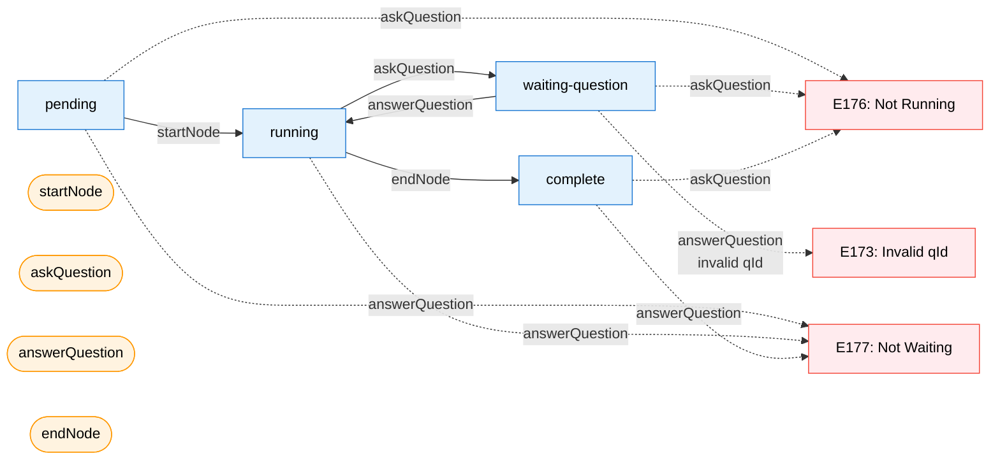
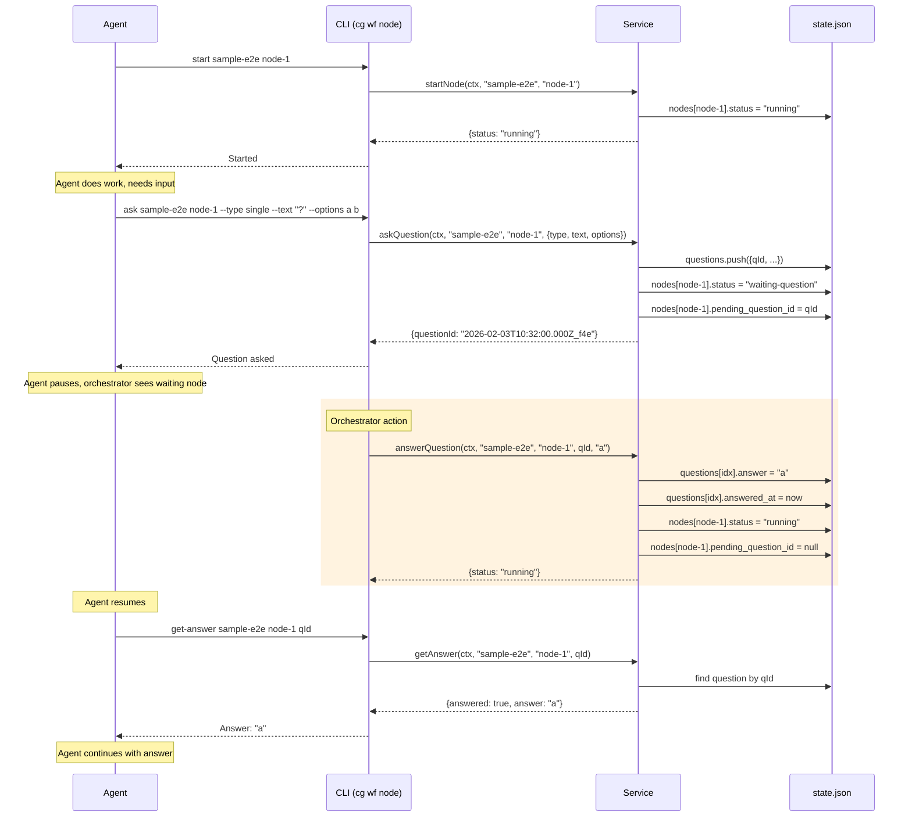

# Phase 4: Question/Answer Protocol – Tasks & Alignment Brief

**Spec**: [../../pos-agentic-cli-spec.md](../../pos-agentic-cli-spec.md)
**Plan**: [../../pos-agentic-cli-plan.md](../../pos-agentic-cli-plan.md)
**Date**: 2026-02-03

---

## Executive Briefing

### Purpose
This phase implements the question/answer protocol that enables agent-orchestrator handoff. When an agent needs human input during execution, it asks a question, transitions to `waiting-question`, and pauses. The orchestrator answers, the node resumes to `running`, and the agent retrieves the answer to continue work.

### What We're Building
Three service methods and three CLI commands for question/answer workflow:
- `askQuestion` / `cg wf node ask` — Agent asks a question, node transitions to `waiting-question`
- `answerQuestion` / `cg wf node answer` — Orchestrator provides answer, node resumes to `running`
- `getAnswer` / `cg wf node get-answer` — Agent retrieves the stored answer after resume

### User Value
Agents can pause work to request human decisions without losing state. The orchestrator sees pending questions and provides answers. This enables human-in-the-loop workflows where agents handle routine work while humans make key decisions.

### Example
**Agent asks**: `cg wf node ask sample-e2e sample-coder-a7b --type single --text "Which language?" --options bash python`
**Orchestrator answers**: `cg wf node answer sample-e2e sample-coder-a7b 2026-02-03T10:32:00.000Z_f4e '"bash"'`
**Agent retrieves**: `cg wf node get-answer sample-e2e sample-coder-a7b 2026-02-03T10:32:00.000Z_f4e` → `{"answered": true, "answer": "bash"}`

---

## Objectives & Scope

### Objective
Implement the question/answer protocol as specified in the plan, enabling agents to pause for orchestrator input and resume execution with the provided answer.

### Goals

- ✅ Implement `askQuestion` service method with timestamp-based question ID generation
- ✅ Implement `answerQuestion` service method with state transition `waiting-question` → `running`
- ✅ Implement `getAnswer` service method for answer retrieval
- ✅ Add 3 CLI commands (`ask`, `answer`, `get-answer`) under `cg wf node`
- ✅ Questions stored atomically in `state.json.questions[]` array
- ✅ Full TDD coverage including error paths (E173, E176, E177)

### Non-Goals

- ❌ Question UI/display (orchestrator responsibility)
- ❌ Answer validation against options (orchestrator responsibility)
- ❌ Question timeout/expiration (not in scope)
- ❌ Multiple concurrent questions per node (single pending question per node)
- ❌ Question editing or deletion after creation
- ❌ Input retrieval (Phase 5)
- ❌ E2E test (Phase 6)

---

## Pre-Implementation Audit

### Summary
| File | Action | Origin | Modified By | Recommendation |
|------|--------|--------|-------------|----------------|
| `/home/jak/substrate/028-pos-agentic-cli/test/unit/positional-graph/question-answer.test.ts` | Create | Phase 4 (Plan 028) | N/A | keep-as-is |
| `/home/jak/substrate/028-pos-agentic-cli/packages/positional-graph/src/services/positional-graph.service.ts` | Modify | Plan 026 (Phase 1) | Plan 028 (Phase 2, 3) | keep-as-is |
| `/home/jak/substrate/028-pos-agentic-cli/packages/positional-graph/src/interfaces/positional-graph-service.interface.ts` | Modify | Plan 026 (Phase 1) | Plan 028 (Phase 2, 3) | keep-as-is |
| `/home/jak/substrate/028-pos-agentic-cli/apps/cli/src/commands/positional-graph.command.ts` | Modify | Plan 026 (Phase 6) | Plan 028 (Phase 2, 3) | keep-as-is |

### Compliance Check
No violations found. All files comply with:
- R-CODE-001 (TypeScript Strict Mode)
- R-CODE-002 (Naming Conventions)
- R-ARCH-002 (Interface-First)
- ADR-0006 (CLI-Based Orchestration)
- ADR-0008 (Workspace Split Storage)

### Foundation Ready
- ✅ Error codes E173, E176, E177 exist (Phase 1)
- ✅ Question schema exists in state.schema.ts (Phase 1)
- ✅ NodeStateEntry.pending_question_id field exists (Phase 1)
- ✅ transitionNodeState() helper exists (Phase 3)

---

## Requirements Traceability

### Coverage Matrix
| AC | Description | Flow Summary | Files in Flow | Tasks | Status |
|----|-------------|--------------|---------------|-------|--------|
| AC-5 | `ask` transitions to waiting-question | CLI → handler → service.askQuestion → state mutation | 4 files | T001, T002, T003, T004 | ✅ Complete |
| AC-6 | `answer` stores answer, transitions to running | CLI → handler → service.answerQuestion → state mutation | 4 files | T001, T002, T005, T006 | ✅ Complete |
| AC-7 | `get-answer` returns stored answer | CLI → handler → service.getAnswer → read state | 4 files | T001, T002, T007, T008 | ✅ Complete |
| AC-18 | Invalid question ID returns E173 | answerQuestion/getAnswer validate qId | 2 files | T001, T005, T007 | ✅ Complete |

### Verified Foundation Files
| Foundation File | Required Elements | Status |
|-----------------|-------------------|--------|
| `packages/positional-graph/src/errors/positional-graph-errors.ts` | E173, E176, E177 error factories | ✅ Present |
| `packages/positional-graph/src/errors/index.ts` | Exports for error factories | ✅ Present |
| `packages/positional-graph/src/schemas/state.schema.ts` | QuestionSchema, QuestionTypeSchema, pending_question_id | ✅ Present |
| `packages/positional-graph/src/schemas/index.ts` | Exports for Question types | ✅ Present |
| `packages/positional-graph/src/services/positional-graph.service.ts` | transitionNodeState(), loadState(), persistState() | ✅ Present |

### Gaps Found
No gaps — all acceptance criteria have complete file coverage. Foundation work (schemas, error codes) was completed in Phase 1.

---

## Architecture Map

### Component Diagram
<!-- Status: grey=pending, orange=in-progress, green=completed, red=blocked -->
<!-- Updated by plan-6 during implementation -->



### Task-to-Component Mapping

<!-- Status: ⬜ Pending | 🟧 In Progress | ✅ Complete | 🔴 Blocked -->

| Task | Component(s) | Files | Status | Comment |
|------|-------------|-------|--------|---------|
| T001 | Test Suite | question-answer.test.ts | ✅ Complete | TDD RED: all 17 tests written, all fail |
| T002 | Interface | positional-graph-service.interface.ts | ✅ Complete | 4 types (AskQuestionOptions + 3 result) + 3 signatures |
| T003 | Service | positional-graph.service.ts | ✅ Complete | askQuestion method implementation |
| T004 | CLI | positional-graph.command.ts | ✅ Complete | handleNodeAsk handler + command registration |
| T005 | Service | positional-graph.service.ts | ✅ Complete | answerQuestion method implementation |
| T006 | CLI | positional-graph.command.ts | ✅ Complete | handleNodeAnswer handler + command registration |
| T007 | Service | positional-graph.service.ts | ✅ Complete | getAnswer method implementation |
| T008 | CLI | positional-graph.command.ts | ✅ Complete | handleNodeGetAnswer handler + command registration |

---

## Tasks

| Status | ID | Task | CS | Type | Dependencies | Absolute Path(s) | Validation | Subtasks | Notes |
|--------|------|------|-----|------|--------------|------------------|------------|----------|-------|
| [x] | T001 | Write tests for askQuestion, answerQuestion, getAnswer (TDD RED) | 3 | Test | – | `/home/jak/substrate/028-pos-agentic-cli/test/unit/positional-graph/question-answer.test.ts` | All tests fail with "method not defined" | – | New test file |
| [x] | T002 | Add interface signatures and result types | 2 | Setup | T001 | `/home/jak/substrate/028-pos-agentic-cli/packages/positional-graph/src/interfaces/positional-graph-service.interface.ts` | Package builds; types exported | – | AskQuestionResult, AnswerQuestionResult, GetAnswerResult |
| [x] | T003 | Implement askQuestion service method | 3 | Core | T002 | `/home/jak/substrate/028-pos-agentic-cli/packages/positional-graph/src/services/positional-graph.service.ts` | askQuestion tests pass; atomic write verified | – | Per Critical Finding 05 |
| [x] | T004 | Add CLI command `cg wf node ask` | 2 | CLI | T003 | `/home/jak/substrate/028-pos-agentic-cli/apps/cli/src/commands/positional-graph.command.ts` | CLI invokes service; JSON output per workshop | – | --type, --text, --options flags |
| [x] | T005 | Implement answerQuestion service method | 3 | Core | T002 | `/home/jak/substrate/028-pos-agentic-cli/packages/positional-graph/src/services/positional-graph.service.ts` | answerQuestion tests pass; E173/E177 validated | – | Per Critical Finding 05 |
| [x] | T006 | Add CLI command `cg wf node answer` | 2 | CLI | T005 | `/home/jak/substrate/028-pos-agentic-cli/apps/cli/src/commands/positional-graph.command.ts` | CLI invokes service; JSON output per workshop | – | |
| [x] | T007 | Implement getAnswer service method | 2 | Core | T002 | `/home/jak/substrate/028-pos-agentic-cli/packages/positional-graph/src/services/positional-graph.service.ts` | getAnswer tests pass; E173 validated | – | |
| [x] | T008 | Add CLI command `cg wf node get-answer` | 2 | CLI | T007 | `/home/jak/substrate/028-pos-agentic-cli/apps/cli/src/commands/positional-graph.command.ts` | CLI invokes service; JSON output per workshop | – | |

---

## Alignment Brief

### Prior Phases Review

#### Phase 1: Foundation - Error Codes and Schemas (Complete)
**Deliverables**: 7 error codes (E172-E179), Question schema, NodeStateEntry extensions, test helpers
**Dependencies for Phase 4**:
- `questionNotFoundError(qId)` — E173 error factory
- `nodeNotRunningError(nodeId)` — E176 error factory
- `nodeNotWaitingError(nodeId)` — E177 error factory
- `QuestionSchema` with `question_id`, `node_id`, `type`, `text`, `options?`, `default?`, `asked_at`, `answer?`, `answered_at?`
- `NodeStateEntry.pending_question_id` field for tracking active question
- `stubWorkUnitLoader()` test helper

**Key Learning**: Schema foundation must exist before service methods (Critical Finding 01).

#### Phase 2: Output Storage (Complete)
**Deliverables**: 4 service methods, 4 CLI commands, 21 tests
**Dependencies for Phase 4**:
- `{ "outputs": {...} }` wrapper pattern in data.json — demonstrates atomic data structure approach
- CLI handler pattern: `createOutputAdapter` → `resolveOrOverrideContext` → service call → format output
- Test patterns: `createTestContext()`, `createFakeUnitLoader()`, `createTestService()`

**Key Learning**: Path containment security (Critical Finding 03) and atomic write patterns.

#### Phase 3: Node Lifecycle (Complete)
**Deliverables**: 3 service methods (`startNode`, `canEnd`, `endNode`), 3 CLI commands, 22 tests
**Dependencies for Phase 4**:
- `transitionNodeState(ctx, graphSlug, nodeId, toStatus, validFromStates)` — private helper for atomic state transitions
- `getNodeExecutionStatus(state, nodeId)` — helper returning current node status ('pending' for missing entries)
- State machine pattern: `pending` → `running` → `waiting-question` → `running` → `complete`
- E172 InvalidStateTransition error pattern for state machine violations

**Key Learning**: State validation before mutation; centralized transition helper (Critical Finding 08).

### Critical Findings Affecting This Phase

| # | Finding | Constraint | Tasks Addressing |
|---|---------|------------|------------------|
| 05 | Q/A state desync risk | All Q&A state changes in single atomic write — must update `questions[]`, `nodes[nodeId].pending_question_id`, and `nodes[nodeId].status` together | T003, T005 |
| 08 | State transition logic needs centralized helper | Reuse `transitionNodeState()` for `running` ↔ `waiting-question` transitions | T003, T005 |

### ADR Decision Constraints

**ADR-0006: CLI-Based Workflow Agent Orchestration**
- CLI commands are the orchestration interface
- Agents invoke `cg wf node` commands to signal state
- Constrains: Question protocol must work via CLI
- Addressed by: T004, T006, T008

**ADR-0008: Workspace Split Storage**
- Data lives in `.chainglass/data/workflows/{slug}/`
- State and outputs are git-committed
- Constrains: Questions stored in state.json, not separate file
- Addressed by: T003, T005, T007

### Invariants & Guardrails

1. **Single pending question per node**: A node can have at most one `pending_question_id` at a time
2. **Running state required for ask**: `askQuestion` returns E176 if node not in `running` state
3. **Waiting state required for answer**: `answerQuestion` returns E177 if node not in `waiting-question` state
4. **Question ID uniqueness**: Timestamp-based IDs (`2026-02-03T10:32:00.000Z_xxxxx`) guarantee uniqueness
5. **Atomic state mutations**: All state changes via single `persistState()` call

### Visual Alignment Aids

#### State Machine Flow


#### Sequence Diagram: Agent-Orchestrator Handoff


### Test Plan (Full TDD)

**Test File**: `test/unit/positional-graph/question-answer.test.ts`

| Test Name | Purpose | Fixtures | Expected Output |
|-----------|---------|----------|-----------------|
| `askQuestion — generates timestamp-based question ID` | Validates ID format per PL-08 | Running node | ID matches pattern `\d{4}-\d{2}-\d{2}T.*_[a-f0-9]+` |
| `askQuestion — transitions to waiting-question` | Core state transition | Running node | `status: "waiting-question"` |
| `askQuestion — stores question in state.questions[]` | Data persistence | Running node | `state.questions.length === 1` |
| `askQuestion — sets pending_question_id on node` | Links question to node | Running node | `nodes[nodeId].pending_question_id === qId` |
| `askQuestion — requires running state (E176)` | State machine enforcement | Pending node | E176 error |
| `answerQuestion — stores answer in question` | Data persistence | Waiting node with question | `question.answer === value` |
| `answerQuestion — sets answered_at timestamp` | Audit trail | Waiting node with question | ISO timestamp present |
| `answerQuestion — transitions to running` | Core state transition | Waiting node with question | `status: "running"` |
| `answerQuestion — clears pending_question_id` | State cleanup | Waiting node with question | `pending_question_id === undefined` |
| `answerQuestion — returns E173 for invalid questionId` | Error handling | Waiting node | E173 error |
| `answerQuestion — returns E177 if not waiting` | State machine enforcement | Running node | E177 error |
| `getAnswer — returns answered: true with answer` | Happy path | Answered question | `{answered: true, answer: value}` |
| `getAnswer — returns answered: false if unanswered` | Edge case | Unanswered question | `{answered: false}` |
| `getAnswer — returns E173 for invalid questionId` | Error handling | Any state | E173 error |
| `multiple questions from same node — all stored` | Array storage | Node asks 2 questions | `state.questions.length === 2` |

**Fixtures from Phase 1 test-helpers.ts**:
- `stubWorkUnitLoader()` — mock WorkUnit loader
- `createWorkUnit()` — build NarrowWorkUnit fixtures
- `testFixtures.sampleCoder` — coder unit with script/language outputs

### Step-by-Step Implementation Outline

| Step | Task | Actions | Validation |
|------|------|---------|------------|
| 1 | T001 | Create `question-answer.test.ts` with 15 test cases following TDD pattern | All tests fail with "method not defined" |
| 2 | T002 | Add `AskQuestionResult`, `AnswerQuestionResult`, `GetAnswerResult` types; add 3 method signatures to interface | Package builds successfully |
| 3 | T003 | Implement `askQuestion()`: validate running state → generate qId → create Question → append to questions[] → transitionNodeState → persist | askQuestion tests pass |
| 4 | T004 | Add `handleNodeAsk()` handler; register `node ask` command with `--type`, `--text`, `--options` flags | CLI invokes service correctly |
| 5 | T005 | Implement `answerQuestion()`: find question by qId → validate waiting state → store answer → transitionNodeState → clear pending_question_id → persist | answerQuestion tests pass |
| 6 | T006 | Add `handleNodeAnswer()` handler; register `node answer` command | CLI invokes service correctly |
| 7 | T007 | Implement `getAnswer()`: find question by qId → return answer/answered status | getAnswer tests pass |
| 8 | T008 | Add `handleNodeGetAnswer()` handler; register `node get-answer` command | CLI invokes service correctly |

### Commands to Run

```bash
# Environment setup (already configured)
cd /home/jak/substrate/028-pos-agentic-cli

# Run Phase 4 tests only (during development)
pnpm test question-answer

# Run all positional-graph tests
pnpm test positional-graph

# Full quality check before completion
just fft

# Build package to verify types
pnpm --filter @chainglass/positional-graph build
```

### Risks & Unknowns

| Risk | Likelihood | Impact | Mitigation |
|------|------------|--------|------------|
| Q/A state desync | Medium | High | Single atomic write pattern per Critical Finding 05 |
| Orphaned questions (node deleted with pending question) | Low | Low | Not addressed — out of scope; document as known limitation |
| Question ID collision | Very Low | Medium | Timestamp + random suffix; collision probability negligible |

### Ready Check

- [x] Error codes E173, E176, E177 verified present in positional-graph-errors.ts (lines 221-250)
- [x] Question schema verified in state.schema.ts (lines 27-45, 69-77)
- [x] transitionNodeState helper verified in positional-graph.service.ts (lines 1688-1742)
- [ ] Prior phase tests pass (`pnpm test positional-graph` — 322 tests)
- [x] ADR constraints understood (ADR-0006, ADR-0008)

---

## Phase Footnote Stubs

<!-- Populated by plan-6 after implementation -->

| Footnote | Files | Description |
|----------|-------|-------------|
| [^6] | *(pending)* | Phase 4 Q&A protocol implementation |

---

## Evidence Artifacts

**Execution Log**: `./execution.log.md` (created by plan-6)
**Test Results**: Console output from `pnpm test question-answer`
**Build Verification**: Console output from `pnpm --filter @chainglass/positional-graph build`

---

## Discoveries & Learnings

_Populated during implementation by plan-6. Log anything of interest to your future self._

| Date | Task | Type | Discovery | Resolution | References |
|------|------|------|-----------|------------|------------|
| | | | | | |

**Types**: `gotcha` | `research-needed` | `unexpected-behavior` | `workaround` | `decision` | `debt` | `insight`

---

## Critical Insights (2026-02-03)

| # | Insight | Decision |
|---|---------|----------|
| 1 | Timestamp-based question IDs include random suffix, breaking exact test assertions | Inject deterministic ID generator for tests |
| 2 | CLI `--options` with spaces needs shell quoting; schema has `default` field but no CLI flag | Shell quotes handle spaces; no `--default` flag (KISS) |
| 3 | `answerQuestion` accepts any string even if not in options list | Orchestrator's job to validate; fix later if problem |
| 4 | Critical Finding 05 says atomic writes but sequence diagram shows 4 separate writes | Multiple writes fine; KISS over atomic |
| 5 | `getAnswer` on unanswered question returns `{answered: false}` not E173 error | Correct — helpful actionable response; E173 only for invalid IDs |

Action items: T001 tests should use injected ID generator or mock Date.now()/random for determinism.

---

**What to log**:
- Things that didn't work as expected
- External research that was required
- Implementation troubles and how they were resolved
- Gotchas and edge cases discovered
- Decisions made during implementation
- Technical debt introduced (and why)
- Insights that future phases should know about

_See also: `execution.log.md` for detailed narrative._

---

## Directory Layout

```
docs/plans/028-pos-agentic-cli/
  ├── pos-agentic-cli-plan.md
  ├── pos-agentic-cli-spec.md
  └── tasks/
      ├── phase-1-foundation-error-codes-and-schemas/
      │   ├── tasks.md
      │   ├── tasks.fltplan.md
      │   └── execution.log.md
      ├── phase-2-output-storage/
      │   ├── tasks.md
      │   ├── tasks.fltplan.md
      │   └── execution.log.md
      ├── phase-3-node-lifecycle/
      │   ├── tasks.md
      │   ├── tasks.fltplan.md
      │   └── execution.log.md
      └── phase-4-question-answer-protocol/   ← YOU ARE HERE
          ├── tasks.md                        ← This file
          ├── tasks.fltplan.md                ← Generated by /plan-5b
          └── execution.log.md                ← Created by /plan-6
```
