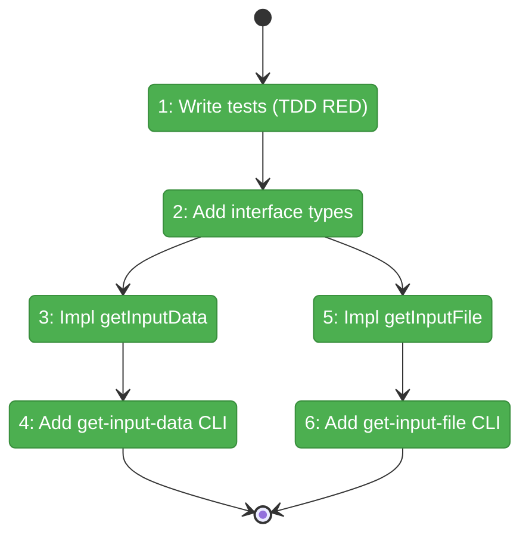
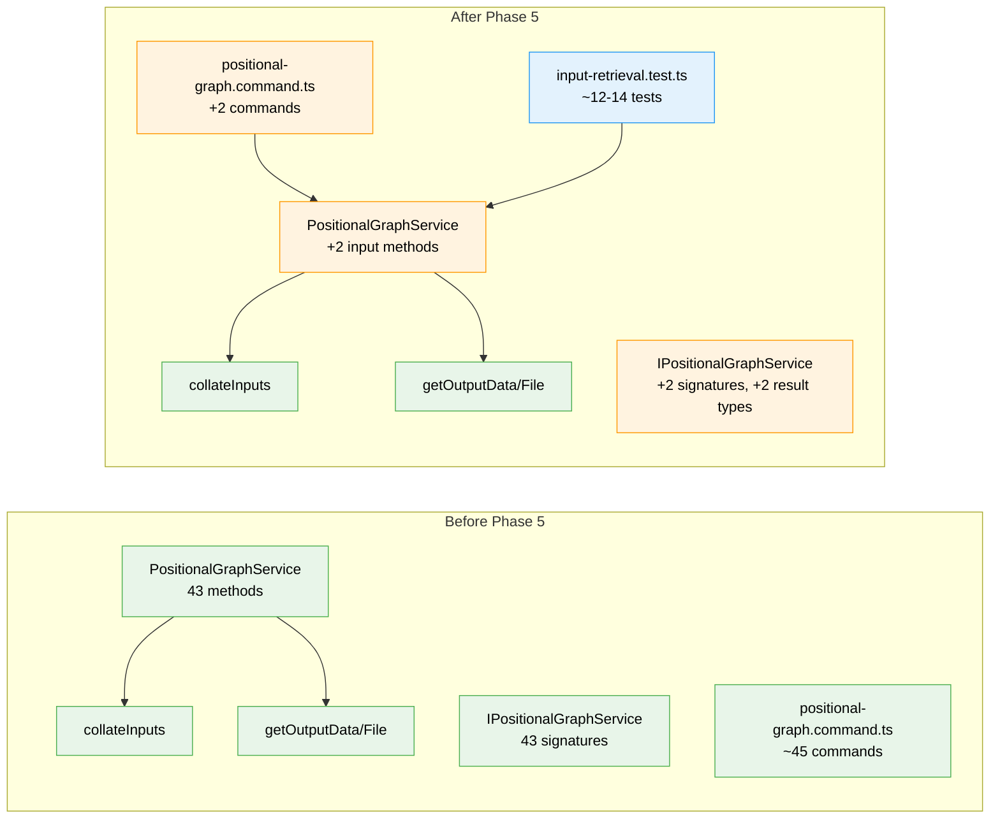

# Flight Plan: Phase 5 — Input Retrieval

**Plan**: [../../pos-agentic-cli-plan.md](../../pos-agentic-cli-plan.md)
**Phase**: Phase 5: Input Retrieval
**Generated**: 2026-02-04
**Status**: Landed

---

## Departure → Destination

**Where we are**: Phases 1-4 established the foundation — 7 error codes (E172-E179), Question schema, NodeStateEntry extensions, output storage (4 methods, 4 CLI commands), node lifecycle (3 methods, 3 CLI commands), and question/answer protocol (3 methods, 3 CLI commands). Agents can now start work, save outputs, ask questions, and complete execution. The existing `collateInputs` algorithm (Plan 026) resolves inputs from upstream nodes, but there are no commands to retrieve those resolved inputs.

**Where we're going**: By the end of this phase, agents can retrieve inputs from completed upstream nodes. Running `cg wf node get-input-data sample-e2e node-B language` returns the value saved by an upstream node that node-B's input wires to. Similarly, `cg wf node get-input-file` returns the file path. A developer can complete a 3-node pipeline where node-3 retrieves inputs from node-2, which retrieved inputs from node-1.

---

## Flight Status

<!-- Updated by /plan-6: pending → active → done. Use blocked for problems/input needed. -->

**Legend**: grey = pending | yellow = active | red = blocked/needs input | green = done

---

## Stages

<!-- Updated by /plan-6 during implementation: [ ] → [~] → [x] -->

- [x] **Stage 1: Write input retrieval tests (TDD RED)** — Tests for getInputData, getInputFile (13 tests) (`test/unit/positional-graph/input-retrieval.test.ts` — new file)
- [x] **Stage 2: Add interface signatures** — GetInputDataResult, GetInputFileResult types + 2 method signatures (`positional-graph-service.interface.ts`)
- [x] **Stage 3: Implement getInputData** — Thin wrapper around collateInputs, calls getOutputData on source (`positional-graph.service.ts`)
- [x] **Stage 4: Add get-input-data CLI** — Command handler with JSON output (`positional-graph.command.ts`)
- [x] **Stage 5: Implement getInputFile** — Thin wrapper around collateInputs, calls getOutputFile on source (`positional-graph.service.ts`)
- [x] **Stage 6: Add get-input-file CLI** — Command handler with JSON output (`positional-graph.command.ts`)

---

## Acceptance Criteria

- [x] AC-12: `cg wf node get-input-data <slug> <nodeId> <name>` resolves the input wiring and returns the value from the source node
- [x] AC-13: `cg wf node get-input-file <slug> <nodeId> <name>` resolves the input wiring and returns the file path from the source node

---

## Goals & Non-Goals

**Goals**:
- Implement `getInputData` service method using `collateInputs` for resolution
- Implement `getInputFile` service method using `collateInputs` for resolution
- Add 2 CLI commands (`get-input-data`, `get-input-file`) under `cg wf node`
- Return E178 (InputNotAvailable) when source node is incomplete
- Return E175 (OutputNotFound) when source node complete but output missing
- Full TDD coverage including error paths

**Non-Goals**:
- New resolution algorithm (reuse `collateInputs`, per CF-07)
- Caching of resolved inputs (not needed for MVP)
- Input validation against WorkUnit declarations (collateInputs handles this)
- Multi-source aggregation (return first available source)
- E2E test (Phase 6)

---

## Architecture: Before & After

**Legend**: existing (green, unchanged) | changed (orange, modified) | new (blue, created)

---

## Checklist

- [x] T001: Write tests for getInputData and getInputFile (CS-3)
- [x] T002: Add interface signatures and result types (CS-2)
- [x] T003: Implement getInputData in service (CS-2)
- [x] T004: Add CLI command `cg wf node get-input-data` (CS-2)
- [x] T005: Implement getInputFile in service (CS-2)
- [x] T006: Add CLI command `cg wf node get-input-file` (CS-2)

---

## PlanPak

Active — files organized under `packages/positional-graph/src/features/028-pos-agentic-cli/`
