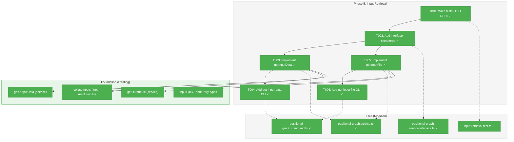
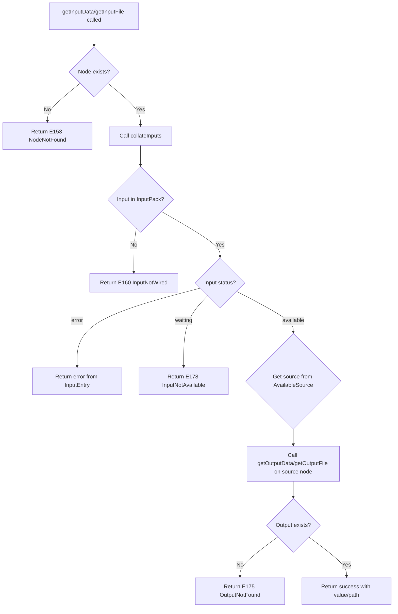
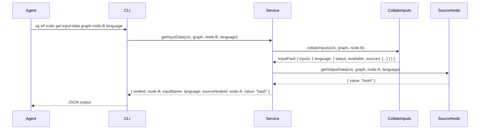

# Phase 5: Input Retrieval – Tasks & Alignment Brief

**Spec**: [../../pos-agentic-cli-spec.md](../../pos-agentic-cli-spec.md)
**Plan**: [../../pos-agentic-cli-plan.md](../../pos-agentic-cli-plan.md)
**Date**: 2026-02-04

---

## Executive Briefing

### Purpose
This phase implements input retrieval methods that enable agents to access data from completed upstream nodes. When node B depends on node A's output, node B's agent can call `get-input-data` or `get-input-file` to retrieve that data after node A completes.

### What We're Building
Two service methods and two CLI commands that wrap the existing `collateInputs` algorithm:
- `getInputData` / `cg wf node get-input-data` — Retrieves a data value from a wired upstream source
- `getInputFile` / `cg wf node get-input-file` — Retrieves the file path from a wired upstream source

### User Value
Agents can programmatically access their inputs from upstream nodes, enabling pipeline data flow. Without this, agents would have to manually navigate the graph structure and output directories.

### Example
**Upstream node (sample-coder) completed with outputs:**
```json
{ "language": "bash", "script": "data/outputs/script.sh" }
```

**Downstream node (sample-tester) retrieves inputs:**
```bash
cg wf node get-input-data sample-e2e sample-tester-abc language
# → {"nodeId":"sample-tester-abc","inputName":"language","sourceNodeId":"sample-coder-xyz","value":"bash"}

cg wf node get-input-file sample-e2e sample-tester-abc script
# → {"nodeId":"sample-tester-abc","inputName":"script","sourceNodeId":"sample-coder-xyz","filePath":"/abs/path/to/script.sh"}
```

---

## Objectives & Scope

### Objective
Implement input retrieval as thin wrappers around the existing `collateInputs` algorithm (per Critical Finding #07), enabling agents to access data from completed upstream nodes.

### Goals

- ✅ Implement `getInputData` service method using `collateInputs` for resolution
- ✅ Implement `getInputFile` service method using `collateInputs` for resolution
- ✅ Add 2 CLI commands (`get-input-data`, `get-input-file`) under `cg wf node`
- ✅ Return E178 (InputNotAvailable) when source node is incomplete
- ✅ Return E175 (OutputNotFound) when source node complete but output missing
- ✅ Full TDD coverage including error paths

### Non-Goals

- ❌ New resolution algorithm (reuse `collateInputs`, per Critical Finding #07 and PL-02)
- ❌ Caching of resolved inputs (not needed for MVP)
- ❌ Input validation against WorkUnit declarations (collateInputs already handles this)
- ❌ Multi-source aggregation in return value (return first available source per collateInputs order)
- ❌ E2E test (Phase 6)

---

## Pre-Implementation Audit

### Summary
| File | Action | Origin | Modified By | Recommendation |
|------|--------|--------|-------------|----------------|
| `/home/jak/substrate/028-pos-agentic-cli/test/unit/positional-graph/input-retrieval.test.ts` | Create | Phase 5 (Plan 028) | N/A | keep-as-is |
| `/home/jak/substrate/028-pos-agentic-cli/packages/positional-graph/src/services/positional-graph.service.ts` | Modify | Plan 026 (Phase 1) | Plan 028 (Phase 2, 3, 4) | keep-as-is |
| `/home/jak/substrate/028-pos-agentic-cli/packages/positional-graph/src/interfaces/positional-graph-service.interface.ts` | Modify | Plan 026 (Phase 1) | Plan 028 (Phase 2, 3, 4) | keep-as-is |
| `/home/jak/substrate/028-pos-agentic-cli/apps/cli/src/commands/positional-graph.command.ts` | Modify | Plan 026 (Phase 6) | Plan 028 (Phase 2, 3, 4) | keep-as-is |

### Compliance Check
No violations found. All files comply with:
- R-CODE-001 (TypeScript Strict Mode)
- R-CODE-002 (Naming Conventions)
- R-ARCH-002 (Interface-First)
- ADR-0006 (CLI-Based Orchestration)
- ADR-0008 (Workspace Split Storage)

### Foundation Ready
- ✅ Error codes E175, E178 exist (Phase 1)
- ✅ `collateInputs` algorithm exists (Plan 026)
- ✅ `InputPack`, `InputEntry`, `AvailableSource` types exist
- ✅ `getOutputData`, `getOutputFile` provide model for implementation

---

## Requirements Traceability

### Coverage Matrix
| AC | Description | Flow Summary | Files in Flow | Tasks | Status |
|----|-------------|--------------|---------------|-------|--------|
| AC-12 | `get-input-data` resolves input wiring, returns value from source | CLI → handler → service.getInputData → collateInputs → getOutputData | 4 files | T001, T002, T003, T004 | ⬜ Pending |
| AC-13 | `get-input-file` resolves input wiring, returns file path from source | CLI → handler → service.getInputFile → collateInputs → getOutputFile | 4 files | T001, T002, T005, T006 | ⬜ Pending |

### Verified Foundation Files
| Foundation File | Required Elements | Status |
|-----------------|-------------------|--------|
| `packages/positional-graph/src/errors/positional-graph-errors.ts` | E175, E178 error factories | ✅ Present |
| `packages/positional-graph/src/services/input-resolution.ts` | collateInputs function | ✅ Present |
| `packages/positional-graph/src/interfaces/positional-graph-service.interface.ts` | InputPack, InputEntry, AvailableSource | ✅ Present |

---

## Architecture Map

### Component Diagram
<!-- Status: grey=pending, orange=in-progress, green=completed, red=blocked -->
<!-- Updated by plan-6 during implementation -->



### Task-to-Component Mapping

<!-- Status: ⬜ Pending | 🟧 In Progress | ✅ Complete | 🔴 Blocked -->

| Task | Component(s) | Files | Status | Comment |
|------|-------------|-------|--------|---------|
| T001 | Test Suite | `/test/unit/positional-graph/input-retrieval.test.ts` | ✅ Complete | 13 tests, TDD RED verified |
| T002 | Interface | `/packages/positional-graph/src/interfaces/positional-graph-service.interface.ts` | ✅ Complete | 4 types + 2 signatures |
| T003 | Service | `/packages/positional-graph/src/services/positional-graph.service.ts` | ✅ Complete | Thin wrapper around collateInputs |
| T004 | CLI | `/apps/cli/src/commands/positional-graph.command.ts` | ✅ Complete | CLI handler for get-input-data |
| T005 | Service | `/packages/positional-graph/src/services/positional-graph.service.ts` | ✅ Complete | Thin wrapper around collateInputs |
| T006 | CLI | `/apps/cli/src/commands/positional-graph.command.ts` | ✅ Complete | CLI handler for get-input-file |

---

## Tasks

| Status | ID | Task | CS | Type | Dependencies | Absolute Path(s) | Validation | Subtasks | Notes |
|--------|------|------|----|------|--------------|------------------|------------|----------|-------|
| [x] | T001 | Write tests for getInputData and getInputFile (TDD RED) | 3 | Test | – | `/home/jak/substrate/028-pos-agentic-cli/test/unit/positional-graph/input-retrieval.test.ts` | Tests fail with "service.getInputData is not a function" | – | 13 tests covering happy paths + E178 + E175 |
| [x] | T002 | Add interface signatures and result types | 2 | Setup | T001 | `/home/jak/substrate/028-pos-agentic-cli/packages/positional-graph/src/interfaces/positional-graph-service.interface.ts`, `/home/jak/substrate/028-pos-agentic-cli/packages/positional-graph/src/interfaces/index.ts` | Build fails with TS2420 (missing implementation) | – | GetInputDataResult, GetInputFileResult + InputDataSource, InputFileSource |
| [x] | T003 | Implement getInputData in service | 2 | Core | T002 | `/home/jak/substrate/028-pos-agentic-cli/packages/positional-graph/src/services/positional-graph.service.ts` | getInputData tests pass; wrapper around collateInputs | – | Per CF-07, thin wrapper only |
| [x] | T004 | Add CLI command `cg wf node get-input-data` | 2 | Core | T003 | `/home/jak/substrate/028-pos-agentic-cli/apps/cli/src/commands/positional-graph.command.ts` | CLI invokes service; JSON output | – | Per CF-12, CLI follows service |
| [x] | T005 | Implement getInputFile in service | 2 | Core | T002 | `/home/jak/substrate/028-pos-agentic-cli/packages/positional-graph/src/services/positional-graph.service.ts` | getInputFile tests pass; wrapper around collateInputs | – | Per CF-07, thin wrapper only |
| [x] | T006 | Add CLI command `cg wf node get-input-file` | 2 | Core | T005 | `/home/jak/substrate/028-pos-agentic-cli/apps/cli/src/commands/positional-graph.command.ts` | CLI invokes service; JSON output | – | Per CF-12, CLI follows service |

---

## Alignment Brief

### Prior Phases Review

#### Phase-by-Phase Summary

**Phase 1: Foundation - Error Codes and Schemas** (Complete)
- Delivered 7 error codes (E172-E179, excluding E174) with factory functions
- Extended StateSchema with Question type and NodeStateEntry fields
- Created test helpers: `stubWorkUnitLoader`, `createWorkUnit`, `testFixtures`
- Critical for Phase 5: E175 (OutputNotFound), E178 (InputNotAvailable) error factories

**Phase 2: Output Storage** (Complete)
- Delivered 4 service methods: `saveOutputData`, `saveOutputFile`, `getOutputData`, `getOutputFile`
- Established data.json structure: `{ "outputs": {...} }` wrapper
- Path convention: file outputs stored as relative paths, returned as absolute
- Critical for Phase 5: `getOutputData` and `getOutputFile` are called by input retrieval methods

**Phase 3: Node Lifecycle** (Complete)
- Delivered 3 service methods: `startNode`, `canEnd`, `endNode`
- Centralized `transitionNodeState()` helper for atomic state mutations
- State machine: `pending` → `running` → `complete`
- Critical for Phase 5: Input retrieval requires source nodes to be `complete`

**Phase 4: Question/Answer Protocol** (Complete)
- Delivered 3 service methods: `askQuestion`, `answerQuestion`, `getAnswer`
- Timestamp-based question IDs: `YYYY-MM-DDTHH:mm:ss.sssZ_xxxxxx`
- State transitions: `running` ↔ `waiting-question`
- Not directly relevant to Phase 5 (Q&A is orthogonal to input retrieval)

#### Cumulative Deliverables Available

**Error Codes** (from Phase 1):
- E175: `outputNotFoundError(outputName, nodeId)` — source node complete but output missing
- E178: `inputNotAvailableError(inputName, reason)` — source node not complete

**Service Methods** (from Phases 2-4):
- `getOutputData(ctx, graphSlug, nodeId, outputName)` — retrieves data value
- `getOutputFile(ctx, graphSlug, nodeId, outputName)` — retrieves file path
- `collateInputs(ctx, graphSlug, nodeId)` — resolves all inputs to InputPack

**Types** (from Phase 2 + Plan 026):
- `InputPack`: `{ inputs: Record<string, InputEntry>, ok: boolean }`
- `InputEntry`: available | waiting | error
- `AvailableSource`: `{ sourceNodeId, sourceOutput, data }`

**Test Helpers** (from Phase 1):
- `stubWorkUnitLoader({ units?, slugs? })` — configurable mock IWorkUnitLoader
- `testFixtures.sampleCoder` — unit with `script` (file) + `language` (data) outputs
- `testFixtures.sampleTester` — unit with `script`, `language` inputs

### Critical Findings Affecting This Phase

| Finding | Constraint | Addressed By |
|---------|------------|--------------|
| **#07**: Input retrieval reuses `collateInputs` | Implement as thin wrappers, not new resolution logic | T003, T005 |
| **#14**: Source node incomplete for `getInputData` | Return E178 InputNotAvailable; reuse `collateInputs` waiting status | T003, T005 |
| **#12**: CLI commands follow service method order | Add CLI handler immediately after each service method | T004, T006 |

### ADR Decision Constraints

| ADR | Decision | Constrains |
|-----|----------|------------|
| ADR-0006 | CLI-based orchestration | Commands must return JSON; agents use CLI |
| ADR-0008 | Workspace split storage | Paths resolved via `ctx.worktreePath` |

### Invariants & Guardrails

1. **Input resolution is read-only**: Never modify state during input retrieval
2. **Single source returned**: Even if multiple sources match, return first available per collateInputs order
3. **Source must be complete**: Only complete nodes can provide inputs (E178 for incomplete)
4. **Output must exist**: Even if source complete, output must be saved (E175 for missing)

### Visual Alignment Aids

#### Flow Diagram: Input Retrieval



#### Sequence Diagram: Successful Input Retrieval



### Test Plan (Full TDD Approach)

#### Test File: `input-retrieval.test.ts`

**getInputData tests** (~6-7 tests):
1. `should resolve input from complete upstream node` — Happy path
2. `should return E178 when source node is incomplete` — Waiting status
3. `should return E175 when source complete but output missing` — Output not saved
4. `should return E160 when input not wired` — Unwired input error
5. `should return E153 for unknown node` — Node existence
6. `should resolve input with from_unit wiring` — Unit-based resolution
7. `should return first available source when multiple match` — Multi-source handling

**getInputFile tests** (~6-7 tests):
1. `should resolve file input from complete upstream node` — Happy path with absolute path
2. `should return E178 when source node is incomplete`
3. `should return E175 when source complete but file output missing`
4. `should return E160 when file input not wired`
5. `should return E153 for unknown node`
6. `should resolve file input with from_unit wiring`
7. `should convert relative path to absolute` — Path resolution

### Step-by-Step Implementation Outline

| Step | Task | Actions |
|------|------|---------|
| 1 | T001 | Create `input-retrieval.test.ts` with 12-14 tests; all fail (RED) |
| 2 | T002 | Add `GetInputDataResult`, `GetInputFileResult` types; add 2 method signatures; build fails |
| 3 | T003 | Implement `getInputData`: call collateInputs, extract available source, call getOutputData |
| 4 | T004 | Add CLI handler `handleNodeGetInputData`, register command |
| 5 | T005 | Implement `getInputFile`: call collateInputs, extract available source, call getOutputFile |
| 6 | T006 | Add CLI handler `handleNodeGetInputFile`, register command |
| 7 | Verify | All 12-14 tests pass; `just fft` passes |

### Commands to Run

```bash
# Environment setup (if needed)
pnpm install

# Run tests during development
pnpm test test/unit/positional-graph/input-retrieval.test.ts

# Run all positional-graph tests
pnpm test test/unit/positional-graph/

# Build package to verify types
pnpm --filter @chainglass/positional-graph build

# Full quality check (lint, format, test)
just fft
```

### Risks/Unknowns

| Risk | Severity | Mitigation |
|------|----------|------------|
| collateInputs may have edge cases | Low | Reuse existing tests; collateInputs well-tested in Plan 026 |
| Multi-source handling unclear | Low | Per CF-07, return first available source (collateInputs order is deterministic) |
| File path resolution complexity | Low | Reuse getOutputFile pattern (relative → absolute) |

### Ready Check

- [ ] All prior phases complete (Phases 1-4 ✅)
- [ ] ADR constraints mapped: ADR-0006 (JSON output), ADR-0008 (workspace paths)
- [ ] Foundation ready: E175, E178 errors; collateInputs; getOutputData/getOutputFile
- [ ] Test helpers available: stubWorkUnitLoader, testFixtures
- [ ] CF-07 understood: thin wrappers only, no new resolution logic

---

## Phase Footnote Stubs

_Populated during implementation by plan-6. Footnote entries added here._

| Footnote | Task | Description |
|----------|------|-------------|
| | | |

---

## Evidence Artifacts

**Execution Log**: `/home/jak/substrate/028-pos-agentic-cli/docs/plans/028-pos-agentic-cli/tasks/phase-5-input-retrieval/execution.log.md`

**Test Results**: Captured in execution log after each TDD phase

**Build Output**: TypeScript compilation verification

---

## Discoveries & Learnings

_Populated during implementation by plan-6. Log anything of interest to your future self._

| Date | Task | Type | Discovery | Resolution | References |
|------|------|------|-----------|------------|------------|
| | | | | | |

**Types**: `gotcha` | `research-needed` | `unexpected-behavior` | `workaround` | `decision` | `debt` | `insight`

**What to log**:
- Things that didn't work as expected
- External research that was required
- Implementation troubles and how they were resolved
- Gotchas and edge cases discovered
- Decisions made during implementation
- Technical debt introduced (and why)
- Insights that future phases should know about

_See also: `execution.log.md` for detailed narrative._

---

## Directory Structure

```
docs/plans/028-pos-agentic-cli/
  ├── pos-agentic-cli-plan.md
  ├── pos-agentic-cli-spec.md
  └── tasks/
      ├── phase-1-foundation-error-codes-and-schemas/
      │   ├── tasks.md
      │   ├── tasks.fltplan.md
      │   └── execution.log.md
      ├── phase-2-output-storage/
      │   ├── tasks.md
      │   ├── tasks.fltplan.md
      │   └── execution.log.md
      ├── phase-3-node-lifecycle/
      │   ├── tasks.md
      │   ├── tasks.fltplan.md
      │   └── execution.log.md
      ├── phase-4-question-answer-protocol/
      │   ├── tasks.md
      │   ├── tasks.fltplan.md
      │   └── execution.log.md
      └── phase-5-input-retrieval/
          ├── tasks.md              # This file
          ├── tasks.fltplan.md      # Generated by /plan-5b
          └── execution.log.md      # Created by /plan-6
```

---

## Critical Insights (2026-02-04)

| # | Insight | Decision |
|---|---------|----------|
| 1 | `collateInputs` already loads output data into `AvailableSource.data` — no need to call `getOutputData` separately | Use `AvailableSource.data` directly; simplifies implementation |
| 2 | `loadNodeData` reads `data.json` as flat object but `saveOutputData` stores in `{ outputs: {...} }` wrapper — bug | Fix `loadNodeData` to read `data.outputs[name]`; add regression test in T001 |
| 3 | File inputs store relative paths; `getInputFile` must resolve to absolute per source node | Call `getOutputFile` on each source node to handle path resolution |
| 4 | `from_unit` uses collect-all semantics (Plan 026) — multiple sources return array | Result types expose full `sources[]` array preserving deterministic traversal order |
| 5 | `WaitingInput` contains partial data (`available[]` + `waiting[]`) — can return incomplete results | Best-effort: return available sources with `complete: boolean` flag |

**Action items**:
- T001: Add test case verifying `loadNodeData` correctly unwraps `outputs` property
- T002: Design `GetInputDataResult` and `GetInputFileResult` with `sources[]` array and `complete` flag
