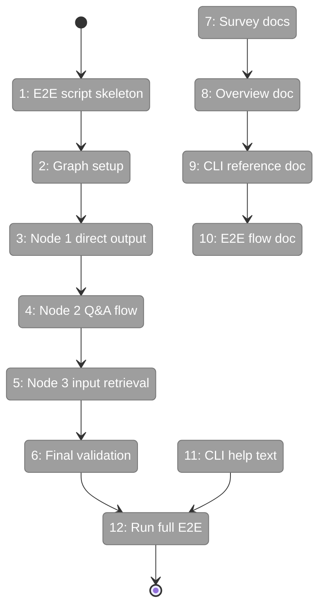
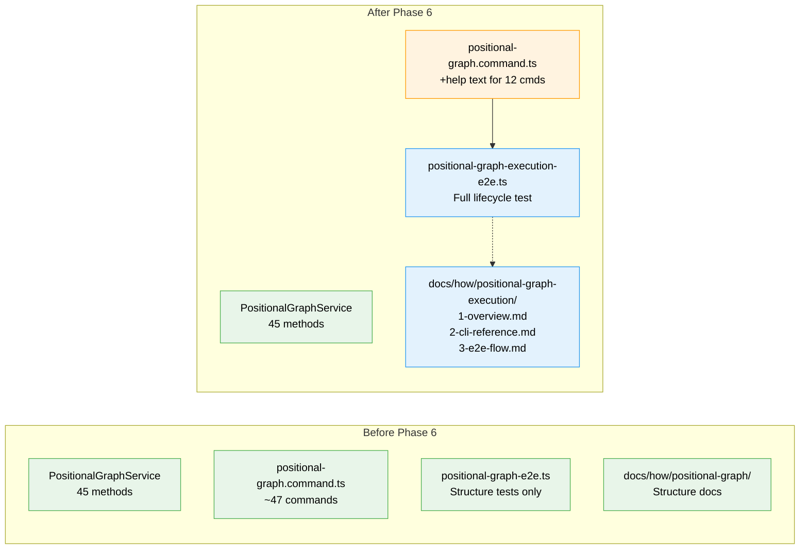

# Flight Plan: Phase 6 — E2E Test and Documentation

**Plan**: [../../pos-agentic-cli-plan.md](../../pos-agentic-cli-plan.md)
**Phase**: Phase 6: E2E Test and Documentation
**Generated**: 2026-02-04
**Status**: Ready for takeoff

---

## Departure → Destination

**Where we are**: Phases 1-5 delivered the complete execution lifecycle infrastructure: 7 error codes (E172-E179), 12 service methods, 12 CLI commands, and 86 unit tests. Agents can now start work, save outputs, ask questions, and retrieve inputs. But there's no end-to-end validation that the entire 3-node pipeline works, and no documentation for developers.

**Where we're going**: By the end of this phase, an E2E test script will execute a complete 3-node pipeline (input → coder → tester) using only `cg wf` CLI commands. Documentation in `docs/how/positional-graph-execution/` will provide a state machine overview, CLI reference for all 12 commands, and step-by-step E2E walkthrough. A developer can run `npx tsx test/e2e/positional-graph-execution-e2e.ts` and watch the complete workflow lifecycle execute successfully.

---

## Flight Status

<!-- Updated by /plan-6: pending → active → done. Use blocked for problems/input needed. -->

**Legend**: grey = pending | yellow = active | red = blocked/needs input | green = done

---

## Stages

<!-- Updated by /plan-6 during implementation: [ ] → [~] → [x] -->

- [ ] **Stage 1: Create E2E test script skeleton** — Set up CLI runner helper for spawning `cg` commands (`test/e2e/positional-graph-execution-e2e.ts` — new file)
- [ ] **Stage 2: Implement cleanup and graph creation** — Delete existing, create graph, add nodes, wire inputs
- [ ] **Stage 3: Implement node 1 direct output execution** — save-output-data → end (no start needed)
- [ ] **Stage 4: Implement node 2 agent with question** — start → ask → answer → save outputs → end
- [ ] **Stage 5: Implement node 3 input retrieval** — start → get-input-data/file → save outputs → end
- [ ] **Stage 6: Implement final validation** — Assert all nodes complete, graph complete
- [ ] **Stage 7: Survey existing docs/how/ structure** — Understand patterns before writing
- [ ] **Stage 8: Create overview documentation** — State machine, architecture diagram (`docs/how/positional-graph-execution/1-overview.md` — new file)
- [ ] **Stage 9: Create CLI reference documentation** — All 12 commands with examples (`docs/how/positional-graph-execution/2-cli-reference.md` — new file)
- [ ] **Stage 10: Create E2E flow documentation** — Step-by-step walkthrough (`docs/how/positional-graph-execution/3-e2e-flow.md` — new file)
- [ ] **Stage 11: Add CLI --help text** — Descriptive help for all 12 execution commands (`apps/cli/src/commands/positional-graph.command.ts`)
- [ ] **Stage 12: Run full E2E test** — Verify E2E passes with real filesystem

---

## Acceptance Criteria

- [ ] AC-14: The E2E test script successfully executes a 3-node pipeline using only `cg wf` commands
- [ ] AC-15: All commands return valid JSON when `--json` flag is used

---

## Goals & Non-Goals

**Goals**:
- Create E2E test script exercising full 3-node pipeline via CLI
- E2E demonstrates: direct output pattern, agent with Q&A, input retrieval
- Create documentation in `docs/how/positional-graph-execution/`
- Add CLI `--help` text for all 12 new commands
- Document error codes E172-E179

**Non-Goals**:
- Real agent invocation (E2E uses mock/scripted behavior)
- Web UI integration (out of scope per spec)
- Modifying Phase 1-5 implementations (documentation only)
- Performance testing or benchmarking
- WorkGraph documentation updates (legacy system)

---

## Architecture: Before & After

**Legend**: existing (green, unchanged) | changed (orange, modified) | new (blue, created)

---

## Checklist

- [ ] T001: Create E2E test script skeleton (CS-2)
- [ ] T002: Implement cleanup and graph creation (CS-2)
- [ ] T003: Implement node 1 direct output execution (CS-2)
- [ ] T004: Implement node 2 agent with question (CS-3)
- [ ] T005: Implement node 3 input retrieval and execution (CS-2)
- [ ] T006: Implement final validation (CS-2)
- [ ] T007: Survey existing docs/how/ structure (CS-1)
- [ ] T008: Create 1-overview.md (CS-2)
- [ ] T009: Create 2-cli-reference.md (CS-2)
- [ ] T010: Create 3-e2e-flow.md (CS-2)
- [ ] T011: Add CLI --help text for all 12 commands (CS-2)
- [ ] T012: Run full E2E test (CS-2)

---

## PlanPak

Active — files organized under `packages/positional-graph/src/features/028-pos-agentic-cli/`
