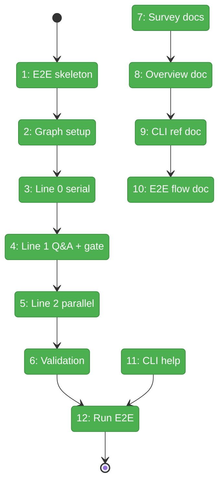
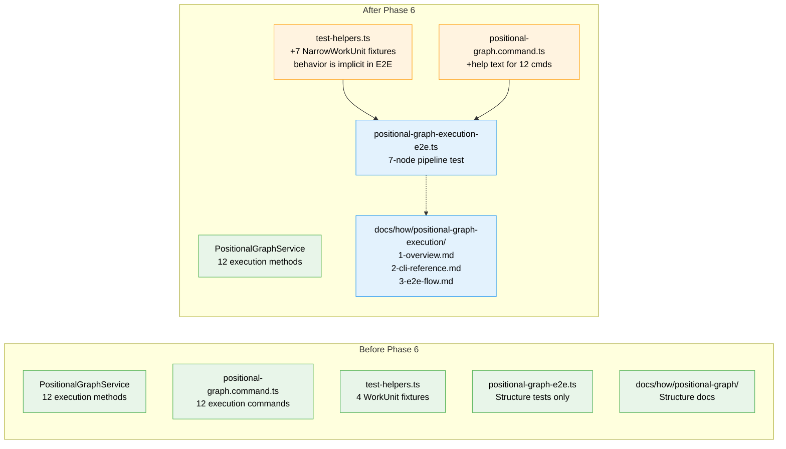

# Flight Plan: Phase 6 — E2E Test and Documentation

**Plan**: [../../pos-agentic-cli-plan.md](../../pos-agentic-cli-plan.md)
**Phase**: Phase 6: E2E Test and Documentation
**Generated**: 2026-02-04
**Status**: Landed

---

## Departure → Destination

**Where we are**: Phases 1-5 delivered the complete execution lifecycle infrastructure: 7 error codes (E172-E179), 12 service methods, 12 CLI commands, and 86 unit tests. Agents can now start work, save outputs, ask questions, and retrieve inputs. But there's no end-to-end validation that the data system works across a real multi-line pipeline, and no documentation for developers.

**Where we're going**: By the end of this phase, an E2E test validates the **execution lifecycle infrastructure** — the data plumbing that makes workflows work. The 7-node pipeline exercises serial execution, parallel execution, manual transition gates, Q&A protocol, and cross-line input resolution. This creates a **solid foundation for more advanced WorkUnit types later** (full prompts, execution configs, etc.). A developer can run `npx tsx test/e2e/positional-graph-execution-e2e.ts` and watch the infrastructure handle a complete workflow lifecycle.

---

## Flight Status

<!-- Updated by /plan-6: pending → active → done. Use blocked for problems/input needed. -->

**Legend**: grey = pending | yellow = active | red = blocked/needs input | green = done

---

## Stages

<!-- Updated by /plan-6 during implementation: [ ] → [~] → [x] -->

- [x] **Stage 1: Create E2E script skeleton** — Set up CLI runner helper for spawning `cg` commands (`test/e2e/positional-graph-execution-e2e.ts` — new file)
- [x] **Stage 2: Implement graph setup** — Define 7 `NarrowWorkUnit` fixtures in `test-helpers.ts` (same structure for all — agentic vs code-unit behavior is implicit in E2E script), then create 3-line, 7-node graph with input wirings
- [x] **Stage 3: Implement Line 0 serial execution** — spec-builder → spec-reviewer complete
- [x] **Stage 4: Implement Line 1 with Q&A and manual gate** — coder (Q&A) → tester → trigger gate
- [x] **Stage 5: Implement Line 2 parallel and code-unit** — parallel alignment-tester/pr-preparer → PR-creator
- [x] **Stage 6: Implement final validation** — Assert 7 nodes complete, 3 lines complete, graph complete
- [x] **Stage 7: Survey docs/how/ structure** — Understand patterns before writing
- [x] **Stage 8: Create overview documentation** — State machine, architecture (`docs/how/positional-graph-execution/1-overview.md` — new file)
- [x] **Stage 9: Create CLI reference documentation** — All 12 commands with examples (`docs/how/positional-graph-execution/2-cli-reference.md` — new file)
- [x] **Stage 10: Create E2E flow documentation** — Step-by-step walkthrough (`docs/how/positional-graph-execution/3-e2e-flow.md` — new file)
- [x] **Stage 11: Add CLI --help text** — Descriptive help for all 12 execution commands (`apps/cli/src/commands/positional-graph.command.ts`)
- [x] **Stage 12: Run full E2E test** — Verify E2E passes with real filesystem

---

## Acceptance Criteria

- [x] AC-14: The E2E test script successfully executes a 3-line, 7-node pipeline using only `cg wf` commands
- [x] AC-15: All commands return valid JSON when `--json` flag is used

---

## Goals & Non-Goals

**Goals**:
- Create E2E test script exercising full 3-line, 7-node pipeline
- E2E demonstrates: serial execution, parallel execution, manual transition gate, Q&A protocol, code-unit pattern
- Create documentation in `docs/how/positional-graph-execution/`
- Add CLI `--help` text for all 12 new commands
- Document error codes E172-E179

**Non-Goals**:
- Real agent invocation (E2E uses mock/scripted behavior)
- Web UI integration (out of scope per spec)
- Modifying Phase 1-5 implementations (documentation only)
- Performance testing or benchmarking
- WorkGraph documentation updates (legacy system)

---

## Architecture: Before & After

**Legend**: existing (green, unchanged) | changed (orange, modified) | new (blue, created)

---

## Checklist

- [x] T001: Create E2E test script skeleton (CS-2)
- [x] T002: Define 7 WorkUnit fixtures + implement graph creation (CS-2)
- [x] T003: Implement Line 0 serial execution (CS-2)
- [x] T004: Implement Line 1 with Q&A and manual gate (CS-3)
- [x] T005: Implement Line 2 parallel and code-unit (CS-3)
- [x] T006: Implement final validation (CS-2)
- [x] T007: Survey existing docs/how/ structure (CS-1)
- [x] T008: Create 1-overview.md (CS-2)
- [x] T009: Create 2-cli-reference.md (CS-2)
- [x] T010: Create 3-e2e-flow.md (CS-2)
- [x] T011: Add CLI --help text for all 12 commands (CS-2)
- [x] T012: Run full E2E test (CS-2)

---

## PlanPak

Active — files organized under `packages/positional-graph/src/features/028-pos-agentic-cli/`
