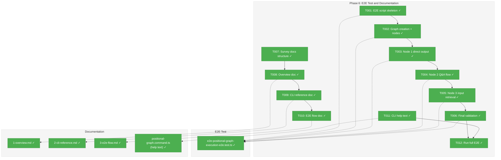
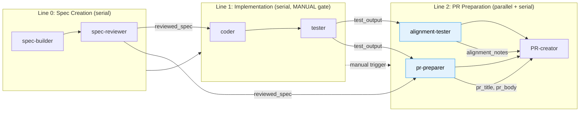
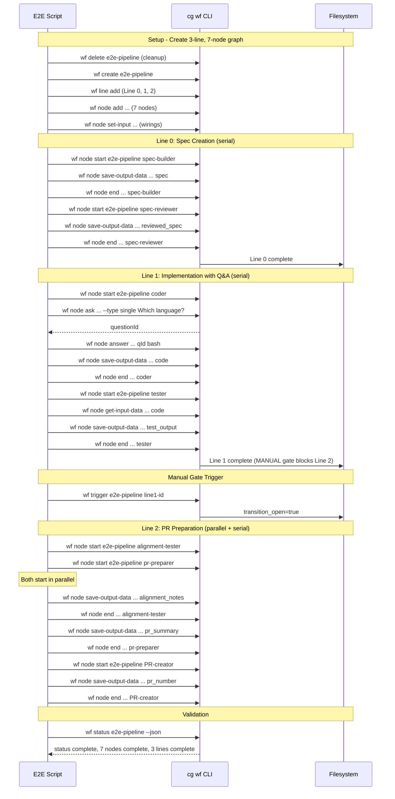

# Phase 6: E2E Test and Documentation – Tasks & Alignment Brief

**Spec**: [../../pos-agentic-cli-spec.md](../../pos-agentic-cli-spec.md)
**Plan**: [../../pos-agentic-cli-plan.md](../../pos-agentic-cli-plan.md)
**Date**: 2026-02-04

---

## Executive Briefing

### Purpose
This phase validates the **execution lifecycle infrastructure** — the data system that lets nodes start, save outputs, ask questions, retrieve inputs, and complete. The 7-node E2E test exercises this infrastructure comprehensively (serial, parallel, manual gates, Q&A, cross-line inputs), creating a **solid foundation for more advanced WorkUnit types later**.

The WorkUnits in this test are vehicles to exercise the plumbing, not the focus themselves. By proving the infrastructure works end-to-end, we enable future plans to add richer unit types (full `AgentUnit` with prompts, `CodeUnit` with execution config, etc.) on top of this validated base.

This phase also documents all 12 CLI commands for agent developers.

### What We're Building
- An E2E test script (`e2e-positional-graph-execution-e2e.test.ts`) that executes a **3-line, 7-node** pipeline using only `cg wf` CLI commands:
  - **Line 0** (Spec Creation): `spec-builder` → `spec-reviewer` (serial execution)
  - **Line 1** (Implementation): `coder` (Q&A: "Which language?") → `tester` (serial, MANUAL gate to Line 2)
  - **Line 2** (PR Preparation): `alignment-tester` + `pr-preparer` (PARALLEL) → `PR-creator` (serial code-unit)
- Documentation in `docs/how/positional-graph-execution/`:
  - Overview with state machine diagram
  - CLI reference for all 12 commands
  - E2E flow walkthrough
- CLI `--help` text for all 12 execution lifecycle commands

> **Reference**: See [e2e-test-comprehensive.md](../../workshops/e2e-test-comprehensive.md) and [e2e-workunits.md](../../workshops/e2e-workunits.md) for full test design and WorkUnit definitions.

### User Value
Agent developers can follow a working example to understand the complete workflow lifecycle. The documentation provides quick reference for command syntax, error codes, and expected behavior patterns.

### Example
**E2E Test Flow**:
```
create graph → add 3 lines → add 7 nodes → wire inputs
  → Line 0: spec-builder: start → save spec → end
            spec-reviewer: start → save reviewed_spec → end
  → Line 1: coder: start → ask "Which language?" → answer → save outputs → end
            tester: start → get-input-data → save outputs → end
  → Manual gate: cg wf trigger <slug> <line1Id>
  → Line 2: alignment-tester + pr-preparer: start BOTH (parallel)
            → complete both → PR-creator: start → save → end (code-unit)
  → validate 7 nodes complete, 3 lines complete, graph complete
```

---

## Objectives & Scope

### Objective
Create the E2E test script and documentation that proves and documents the execution lifecycle system implemented in Phases 1-5.

### Goals

- ✅ Create E2E test script exercising full **3-line, 7-node** pipeline
- ✅ E2E test uses CLI commands (spawns `cg` process), not direct service API
- ✅ E2E test demonstrates: serial execution, **parallel execution**, **manual transition gate**, Q&A protocol, **code-unit pattern**, **composite inputs**
- ✅ Create documentation in `docs/how/positional-graph-execution/`
- ✅ Add CLI `--help` text for all 12 new commands
- ✅ Document error codes E172-E179
- ✅ Achieve AC-14 (E2E passes) and AC-15 (valid JSON output)

### Non-Goals

- ❌ Real agent invocation (E2E uses mock/scripted behavior)
- ❌ Web UI integration (out of scope per spec)
- ❌ Modifying Phase 1-5 implementations (documentation only)
- ❌ Performance testing or benchmarking
- ❌ CLI parsing tests (Commander.js handles this)
- ❌ WorkGraph documentation updates (legacy system)

---

## Pre-Implementation Audit

### Summary
| File | Action | Origin | Modified By | Recommendation |
|------|--------|--------|-------------|----------------|
| `/home/jak/substrate/028-pos-agentic-cli/test/unit/positional-graph/test-helpers.ts` | Modify | Plan 028 Phase 1 | — | keep-as-is (add 7 WorkUnit fixtures) |
| `/home/jak/substrate/028-pos-agentic-cli/test/e2e/positional-graph-execution-e2e.test.ts` | Create | New | — | keep-as-is |
| `/home/jak/substrate/028-pos-agentic-cli/docs/how/positional-graph-execution/1-overview.md` | Create | New | — | keep-as-is |
| `/home/jak/substrate/028-pos-agentic-cli/docs/how/positional-graph-execution/2-cli-reference.md` | Create | New | — | keep-as-is |
| `/home/jak/substrate/028-pos-agentic-cli/docs/how/positional-graph-execution/3-e2e-flow.md` | Create | New | — | keep-as-is |
| `/home/jak/substrate/028-pos-agentic-cli/apps/cli/src/commands/positional-graph.command.ts` | Modify | Plan 026 | Plan 028 Phases 2-5 | keep-as-is |

### Compliance Check
No violations found.

### Notes
- Existing `test/e2e/positional-graph-e2e.ts` tests structure operations via service API; new E2E tests execution lifecycle via CLI
- Existing `docs/how/positional-graph/` documents structure commands (Plan 026); new docs document execution commands (Plan 028)

---

## Requirements Traceability

### Coverage Matrix
| AC | Description | Flow Summary | Files in Flow | Tasks | Status |
|----|-------------|-------------|---------------|-------|--------|
| AC-14 | E2E test executes **3-line, 7-node** pipeline using only `cg wf` commands | Script → CLI → service → filesystem | e2e script, CLI commands | T001-T006 | ✅ Complete |
| AC-15 | All commands return valid JSON when `--json` flag is used | CLI handlers → output adapter | CLI commands, E2E validation | T006, T011 | ✅ Complete |

### Gaps Found
No gaps — Phase 6 is documentation and E2E validation, not new functionality.

---

## Architecture Map

### Component Diagram
<!-- Status: grey=pending, orange=in-progress, green=completed, red=blocked -->
<!-- Updated by plan-6 during implementation -->



### Task-to-Component Mapping

<!-- Status: ⬜ Pending | 🟧 In Progress | ✅ Complete | 🔴 Blocked -->

| Task | Component(s) | Files | Status | Comment |
|------|-------------|-------|--------|---------|
| T001 | E2E Test | e2e-positional-graph-execution-e2e.test.ts | ✅ Complete | Script skeleton with CLI runner |
| T002 | E2E Test + WorkUnits | test-helpers.ts, e2e-positional-graph-execution-e2e.test.ts | ✅ Complete | 7 WorkUnit fixtures + 3-line, 7-node graph creation |
| T003 | E2E Test | same | ✅ Complete | Line 0: spec-builder + spec-reviewer (serial) |
| T004 | E2E Test | same | ✅ Complete | Line 1: coder (Q&A) + tester + manual gate |
| T005 | E2E Test | same | ✅ Complete | Line 2: parallel nodes + PR-creator (code-unit) |
| T006 | E2E Test | same | ✅ Complete | Final validation: 7 nodes, 3 lines, graph complete |
| T007 | Documentation | docs/how/ survey | ✅ Complete | Understand existing structure |
| T008 | Documentation | 1-overview.md | ✅ Complete | State machine, architecture |
| T009 | Documentation | 2-cli-reference.md | ✅ Complete | All 12 commands with examples |
| T010 | Documentation | 3-e2e-flow.md | ✅ Complete | Step-by-step walkthrough |
| T011 | CLI Help | positional-graph.command.ts | ✅ Complete | --help descriptions |
| T012 | Validation | E2E script | ✅ Complete | Run and verify E2E passes |

---

## Tasks

| Status | ID | Task | CS | Type | Dependencies | Absolute Path(s) | Validation | Subtasks | Notes |
|--------|------|--------------------------------------|-----|------|--------------|------------------|------------|----------|-------|
| [x] | T001 | Create E2E test script skeleton | 2 | Setup | – | /home/jak/substrate/028-pos-agentic-cli/test/e2e/positional-graph-execution-e2e.test.ts | Script compiles, CLI runner helper works | – | Per workshop §E2E |
| [x] | T002 | Define WorkUnits and create graph | 2 | Core | T001 | /home/jak/substrate/028-pos-agentic-cli/test/unit/positional-graph/test-helpers.ts, /home/jak/substrate/028-pos-agentic-cli/test/e2e/positional-graph-execution-e2e.test.ts | 7 WorkUnit fixtures defined, 3 lines, 7 nodes, 6 inputs wired | – | WorkUnits: spec-builder, spec-reviewer, coder, tester, alignment-tester, pr-preparer, PR-creator |
| [x] | T003 | Implement Line 0 serial execution | 2 | Core | T002 | /home/jak/substrate/028-pos-agentic-cli/test/e2e/positional-graph-execution-e2e.test.ts | spec-builder → spec-reviewer complete | – | Serial execution pattern |
| [x] | T004 | Implement Line 1 with Q&A and manual gate | 3 | Core | T003 | /home/jak/substrate/028-pos-agentic-cli/test/e2e/positional-graph-execution-e2e.test.ts | coder (Q&A) → tester → trigger gate | – | Q&A protocol, manual transition |
| [x] | T005 | Implement Line 2 parallel and code-unit | 3 | Core | T004 | /home/jak/substrate/028-pos-agentic-cli/test/e2e/positional-graph-execution-e2e.test.ts | parallel start → both complete → PR-creator | – | Parallel execution, code-unit pattern |
| [x] | T006 | Implement final validation | 2 | Core | T005 | /home/jak/substrate/028-pos-agentic-cli/test/e2e/positional-graph-execution-e2e.test.ts | 7 nodes complete, 3 lines complete, graph complete | – | AC-14, AC-15 |
| [x] | T007 | Survey existing docs/how/ structure | 1 | Setup | – | /home/jak/substrate/028-pos-agentic-cli/docs/how/ | Documented patterns for new docs | – | Discovery step |
| [x] | T008 | Create 1-overview.md | 2 | Doc | T007 | /home/jak/substrate/028-pos-agentic-cli/docs/how/positional-graph-execution/1-overview.md | State machine diagram, CLI overview, architecture | – | Links to CLI ref |
| [x] | T009 | Create 2-cli-reference.md | 2 | Doc | T008 | /home/jak/substrate/028-pos-agentic-cli/docs/how/positional-graph-execution/2-cli-reference.md | All 12 commands documented with examples | – | Per workshop specs |
| [x] | T010 | Create 3-e2e-flow.md | 2 | Doc | T009 | /home/jak/substrate/028-pos-agentic-cli/docs/how/positional-graph-execution/3-e2e-flow.md | Step-by-step E2E flow walkthrough | – | Matches E2E script |
| [x] | T011 | Add CLI --help text for all 12 commands | 2 | Doc | – | /home/jak/substrate/028-pos-agentic-cli/apps/cli/src/commands/positional-graph.command.ts | Help text per workshop specs | – | Update command descriptions |
| [x] | T012 | Run full E2E test | 2 | Integration | T006, T011 | /home/jak/substrate/028-pos-agentic-cli/test/e2e/positional-graph-execution-e2e.test.ts | E2E passes with real filesystem | – | Final validation |

---

## Alignment Brief

### Prior Phases Review

**Phase 1: Foundation - Error Codes and Schemas** (Complete)
- Delivered: 7 error codes (E172-E179, excluding E174), Question schema, NodeStateEntry extensions, test helper `stubWorkUnitLoader`
- Files: `positional-graph-errors.ts`, `state.schema.ts`, `test-helpers.ts`
- Key pattern: Optional schema fields for backward compatibility
- Error factories: `invalidStateTransitionError`, `questionNotFoundError`, `outputNotFoundError`, `nodeNotRunningError`, `nodeNotWaitingError`, `inputNotAvailableError`, `fileNotFoundError`

**Phase 2: Output Storage** (Complete)
- Delivered: 4 service methods (`saveOutputData`, `saveOutputFile`, `getOutputData`, `getOutputFile`), 4 CLI commands, 21 tests
- Files: `positional-graph.service.ts`, `positional-graph.command.ts`
- Key patterns: `{ "outputs": {...} }` wrapper in data.json, relative storage with absolute return, multi-layer path traversal prevention
- Storage: `nodes/<nodeId>/data/data.json` and `nodes/<nodeId>/data/outputs/`

**Phase 3: Node Lifecycle** (Complete)
- Delivered: 3 service methods (`startNode`, `canEnd`, `endNode`), 3 CLI commands, 22 tests
- Helper: `transitionNodeState()` for atomic state mutations
- Key patterns: Implicit pending status, state validation before outputs check, graph status auto-update on first completion
- Running state required for output operations (E176)

**Phase 4: Question/Answer Protocol** (Complete)
- Delivered: 3 service methods (`askQuestion`, `answerQuestion`, `getAnswer`), 3 CLI commands, 17 tests
- Question ID format: `YYYY-MM-DDTHH:mm:ss.sssZ_xxxxxx`
- Key patterns: Single pending question per node, questions stored in `state.questions[]`, node tracks `pending_question_id`
- State transitions: `running` ↔ `waiting-question`

**Phase 5: Input Retrieval** (Complete)
- Delivered: 2 service methods (`getInputData`, `getInputFile`), 2 CLI commands, 13 tests
- Key patterns: Thin wrappers around `collateInputs`, `sources[]` array for multi-source fan-in, `complete` flag
- Error propagation: E160 (not wired), E178 (source incomplete), E175 (output missing)

**Cumulative Deliverables from All Phases**:
- **Error codes**: E172-E179 (7 codes) in `positional-graph-errors.ts`
- **Schema extensions**: QuestionSchema, NodeStateEntryErrorSchema in `state.schema.ts`
- **Service methods**: 12 total (output: 4, lifecycle: 3, Q&A: 3, input: 2) in `positional-graph.service.ts`
- **CLI commands**: 12 total in `positional-graph.command.ts`
- **Unit tests**: 73 new tests across 4 test files (execution-errors: 16, output-storage: 21, execution-lifecycle: 22, question-answer: 17, input-retrieval: 13)
- **Test helpers**: `stubWorkUnitLoader`, `createWorkUnit`, `testFixtures` in `test-helpers.ts`

**Reusable Infrastructure from Prior Phases**:
- `FakeFileSystem`, `FakePathResolver` for filesystem tests
- `stubWorkUnitLoader()` for configurable WorkUnit mocking
- `testFixtures.sampleInput`, `testFixtures.sampleCoder`, `testFixtures.sampleTester` for pipeline units

**Architectural Continuity**:
- All service methods follow `Result<T>` pattern with `errors` array
- All CLI handlers use `createOutputAdapter(options.json)` for JSON/text output
- State mutations use `atomicWriteFile` / `persistState`
- Error precedence: state errors (E172) before validation errors (E175)

### Critical Findings Affecting This Phase

| # | Finding | Impact on Phase 6 |
|---|---------|-------------------|
| CF-12 | CLI commands follow service method order | E2E test should call commands in logical order per workshop |
| CF-13 | No explicit fail command | Document this gap in overview.md |

### ADR Decision Constraints

| ADR | Constraint | Impact |
|-----|-----------|--------|
| ADR-0006 | CLI-based orchestration | E2E must spawn actual `cg` CLI process, not call service directly |
| ADR-0008 | Workspace split storage | E2E uses `.chainglass/data/workflows/{slug}/` paths |

### Invariants & Guardrails
- E2E test must use temp directory for isolation
- E2E test must clean up after itself
- Documentation must match actual implementation (no drift from workshop)

### Visual Alignment Aids

#### E2E Flow Diagram



#### Execution Sequence Diagram



### Test Plan

**Approach**: Lightweight (E2E integration, no new unit tests)

**E2E Test Coverage**:
| Step | Commands Exercised | Validation |
|------|-------------------|------------|
| Cleanup | `wf delete` | No error on missing |
| Create graph | `wf create` | Graph exists |
| Add lines | `wf line add` (x2 after initial) | Line IDs returned |
| Add nodes | `wf node add` (x7) | Node IDs returned |
| Wire inputs | `wf node set-input` (x6) | Inputs wired |
| Line 0: spec-builder | `start`, `save-output-data`, `end` | Node complete |
| Line 0: spec-reviewer | `start`, `get-input-data`, `save-output-data`, `end` | Node complete, Line 0 complete |
| Line 1: coder (Q&A) | `start`, `ask`, `answer`, `save-output-data`, `end` | Full Q&A protocol |
| Line 1: tester | `start`, `get-input-data`, `save-output-data`, `end` | Line 1 complete (gated) |
| Manual gate | `wf trigger` | Transition opens Line 2 |
| Line 2: parallel nodes | `start` (x2 parallel), `save-output-data`, `end` (x2) | Both complete |
| Line 2: PR-creator | `start`, `get-input-data`, `save-output-data`, `end` | Code-unit pattern |
| Final validation | `wf status --json` | Graph complete, 7 nodes, 3 lines |

**JSON Output Validation**:
- All commands with `--json` flag return parseable JSON
- Response envelope includes `errors: []` for success
- Error responses include structured error objects

### Implementation Outline

1. **T001**: Create script skeleton with CLI runner helper
   - Import child_process for spawning `cg` commands
   - Create `runCli()` helper that spawns process and parses JSON output
   - Set up temp directory for workspace isolation

2. **T002**: Define WorkUnit fixtures + implement graph setup
   - Add 7 `NarrowWorkUnit` fixtures to `test-helpers.ts` (all same structure — behavior is implicit in E2E script):
     - `sampleSpecBuilder`: outputs `spec`
     - `sampleSpecReviewer`: inputs `spec`, outputs `reviewed_spec`
     - `sampleCoder`: inputs `spec`, outputs `language`, `code` (file) — **agentic behavior: Q&A**
     - `sampleTester`: inputs `language`, `code`, outputs `test_passed`, `test_output`
     - `sampleAlignmentTester`: inputs `spec`, `code`, `test_output`, outputs `alignment_score`, `alignment_notes`
     - `samplePrPreparer`: inputs `spec`, `test_output`, outputs `pr_title`, `pr_body`
     - `samplePRCreator`: inputs `pr_title`, `pr_body`, outputs `pr_url`, `pr_number` — **code-unit behavior: no Q&A**
   - Delete existing graph (ignore errors)
   - Create graph with initial Line 0
   - Add Line 1 (serial, manual transition), Line 2 (parallel + serial)
   - Add 7 nodes using the defined WorkUnit slugs
   - Wire 6 inputs using `set-input`

3. **T003**: Implement Line 0 (serial execution)
   - spec-builder: start → save spec → end
   - spec-reviewer: start → get-input reviewed_spec → save reviewed_spec → end
   - Validate Line 0 complete

4. **T004**: Implement Line 1 (Q&A + manual gate)
   - coder: start → ask "Which language?" → answer → save code → end
   - tester: start → get-input code → save test_output → end
   - Line 1 complete but gated (transition_open=false)
   - Call `wf trigger` to open manual gate

5. **T005**: Implement Line 2 (parallel + code-unit)
   - alignment-tester + pr-preparer: start BOTH (parallel)
   - Complete both nodes
   - PR-creator: start → get-input → save pr_number → end (code-unit: no Q&A)
   - Validate Line 2 complete

6. **T006**: Final validation
   - Get graph status
   - Assert 7 nodes complete
   - Assert 3 lines complete
   - Assert graph status is complete
   - Clean up graph

7. **T007-T010**: Documentation
   - Survey existing docs/how/ structure
   - Create overview with state machine
   - Create CLI reference
   - Create E2E walkthrough

8. **T011**: CLI help text
   - Add descriptive help for all 12 commands

9. **T012**: Run and verify E2E

### Commands to Run

```bash
# Build before testing
pnpm build

# Run E2E test
npx tsx test/e2e/positional-graph-execution-e2e.test.ts

# Full quality check
just fft

# Verify CLI help
cg wf node --help
cg wf node start --help
```

### Risks & Unknowns

| Risk | Severity | Mitigation |
|------|----------|------------|
| CLI runner subprocess issues | Medium | Use existing pattern from `how/dev/workgraph-run/lib/cli-runner.ts` |
| Temp directory cleanup | Low | Use `finally` block for cleanup |
| Documentation drift | Low | Cross-reference with workshop specs |

### Ready Check

- [x] Prior phases all complete (Phases 1-5) ✅
- [x] Workshop spec available for E2E script design ✅
- [x] Existing E2E test pattern available for reference ✅
- [x] docs/how/ structure understood ✅
- [x] ADR constraints understood (CLI-based orchestration) ✅

**Phase Complete** — All tasks completed successfully.

---

## Phase Footnote Stubs

| Footnote | Reference | Description |
|----------|-----------|-------------|
| [^7] | Tasks 6.1-6.6 | E2E test implementation - 53-step test, 7 WorkUnit fixtures, unit YAML fixes |
| [^8] | Tasks 6.7-6.10 | Documentation - overview, CLI reference, E2E flow walkthrough |
| [^9] | Tasks 6.11-6.12 | CLI help text, final E2E validation, JsonOutputAdapter fix |

---

## Evidence Artifacts

**Execution Log**: `./execution.log.md`

Plan-6 will create this file to document:
- Task completion timestamps
- Evidence of test passing
- Any discoveries or deviations
- Final test output

---

## Discoveries & Learnings

_Populated during implementation by plan-6. Log anything of interest to your future self._

| Date | Task | Type | Discovery | Resolution | References |
|------|------|------|-----------|------------|------------|
| 2026-02-04 | T012 | gotcha | `JsonOutputAdapter.format()` expects `result.errors` array but status result types don't have it | Wrapped status results with `{ ...result, errors: [] }` in CLI handlers | `positional-graph.command.ts` |
| 2026-02-04 | T012 | gotcha | Unit YAML naming mismatch: `sample-coder` output was `script` but E2E expected `code` | Updated `sample-coder/unit.yaml` to use `code` output name | `.chainglass/data/units/sample-coder/unit.yaml` |
| 2026-02-04 | T012 | gotcha | Unit YAML naming mismatch: `sample-tester` outputs were `success`/`output` but E2E expected `test_passed`/`test_output` | Updated `sample-tester/unit.yaml` to use correct output names | `.chainglass/data/units/sample-tester/unit.yaml` |

**Types**: `gotcha` | `research-needed` | `unexpected-behavior` | `workaround` | `decision` | `debt` | `insight`

**What to log**:
- Things that didn't work as expected
- External research that was required
- Implementation troubles and how they were resolved
- Gotchas and edge cases discovered
- Decisions made during implementation
- Technical debt introduced (and why)
- Insights that future phases should know about

_See also: `execution.log.md` for detailed narrative._

---

## Directory Layout

```
docs/plans/028-pos-agentic-cli/
├── pos-agentic-cli-plan.md
├── pos-agentic-cli-spec.md
└── tasks/
    ├── phase-1-foundation-error-codes-and-schemas/
    │   ├── tasks.md
    │   ├── tasks.fltplan.md
    │   └── execution.log.md
    ├── phase-2-output-storage/
    │   ├── tasks.md
    │   ├── tasks.fltplan.md
    │   └── execution.log.md
    ├── phase-3-node-lifecycle/
    │   ├── tasks.md
    │   ├── tasks.fltplan.md
    │   └── execution.log.md
    ├── phase-4-question-answer-protocol/
    │   ├── tasks.md
    │   ├── tasks.fltplan.md
    │   └── execution.log.md
    ├── phase-5-input-retrieval/
    │   ├── tasks.md
    │   ├── tasks.fltplan.md
    │   └── execution.log.md
    └── phase-6-e2e-test-and-documentation/
        ├── tasks.md               # This file
        ├── tasks.fltplan.md       # Generated by /plan-5b
        └── execution.log.md       # Created by /plan-6
```
