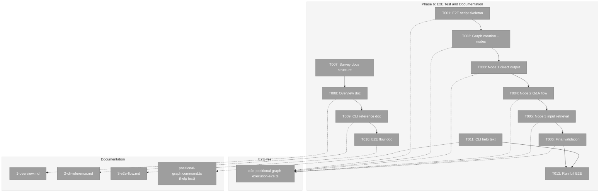
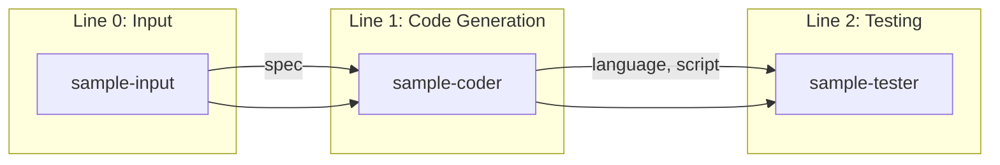
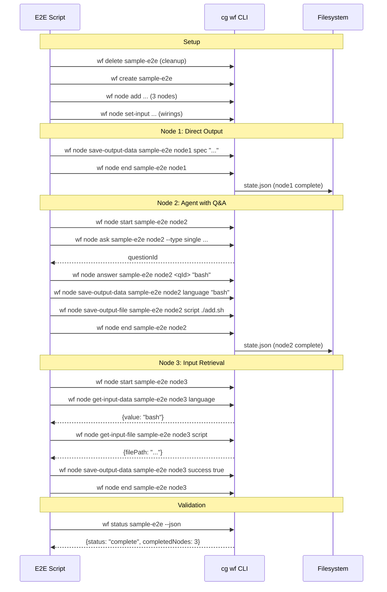

# Phase 6: E2E Test and Documentation – Tasks & Alignment Brief

**Spec**: [../../pos-agentic-cli-spec.md](../../pos-agentic-cli-spec.md)
**Plan**: [../../pos-agentic-cli-plan.md](../../pos-agentic-cli-plan.md)
**Date**: 2026-02-04

---

## Executive Briefing

### Purpose
This phase creates an end-to-end test demonstrating the complete positional graph execution lifecycle and documents all 12 new CLI commands for agent developers. This is the capstone phase that proves the system works as a whole and provides the reference materials developers need.

### What We're Building
- An E2E test script (`e2e-positional-graph-execution-e2e.ts`) that executes a 3-node pipeline using only `cg wf` CLI commands:
  - Node 1 (sample-input): Direct output pattern — save data and complete
  - Node 2 (sample-coder): Agent with question/answer protocol
  - Node 3 (sample-tester): Input retrieval and script execution
- Documentation in `docs/how/positional-graph-execution/`:
  - Overview with state machine diagram
  - CLI reference for all 12 commands
  - E2E flow walkthrough
- CLI `--help` text for all 12 execution lifecycle commands

### User Value
Agent developers can follow a working example to understand the complete workflow lifecycle. The documentation provides quick reference for command syntax, error codes, and expected behavior patterns.

### Example
**E2E Test Flow**:
```
create graph → add nodes → wire inputs
  → Node 1: save-output-data "spec" → end
  → Node 2: start → ask question → answer → save-output-data/file → end
  → Node 3: start → get-input-data/file → save-output-data → end
  → validate all nodes complete, graph complete
```

---

## Objectives & Scope

### Objective
Create the E2E test script and documentation that proves and documents the execution lifecycle system implemented in Phases 1-5.

### Goals

- ✅ Create E2E test script exercising full 3-node pipeline
- ✅ E2E test uses CLI commands (spawns `cg` process), not direct service API
- ✅ E2E test demonstrates: direct output pattern, agent with Q&A, input retrieval
- ✅ Create documentation in `docs/how/positional-graph-execution/`
- ✅ Add CLI `--help` text for all 12 new commands
- ✅ Document error codes E172-E179
- ✅ Achieve AC-14 (E2E passes) and AC-15 (valid JSON output)

### Non-Goals

- ❌ Real agent invocation (E2E uses mock/scripted behavior)
- ❌ Web UI integration (out of scope per spec)
- ❌ Modifying Phase 1-5 implementations (documentation only)
- ❌ Performance testing or benchmarking
- ❌ CLI parsing tests (Commander.js handles this)
- ❌ WorkGraph documentation updates (legacy system)

---

## Pre-Implementation Audit

### Summary
| File | Action | Origin | Modified By | Recommendation |
|------|--------|--------|-------------|----------------|
| `/home/jak/substrate/028-pos-agentic-cli/test/e2e/positional-graph-execution-e2e.ts` | Create | New | — | keep-as-is |
| `/home/jak/substrate/028-pos-agentic-cli/docs/how/positional-graph-execution/1-overview.md` | Create | New | — | keep-as-is |
| `/home/jak/substrate/028-pos-agentic-cli/docs/how/positional-graph-execution/2-cli-reference.md` | Create | New | — | keep-as-is |
| `/home/jak/substrate/028-pos-agentic-cli/docs/how/positional-graph-execution/3-e2e-flow.md` | Create | New | — | keep-as-is |
| `/home/jak/substrate/028-pos-agentic-cli/apps/cli/src/commands/positional-graph.command.ts` | Modify | Plan 026 | Plan 028 Phases 2-5 | keep-as-is |

### Compliance Check
No violations found.

### Notes
- Existing `test/e2e/positional-graph-e2e.ts` tests structure operations via service API; new E2E tests execution lifecycle via CLI
- Existing `docs/how/positional-graph/` documents structure commands (Plan 026); new docs document execution commands (Plan 028)

---

## Requirements Traceability

### Coverage Matrix
| AC | Description | Flow Summary | Files in Flow | Tasks | Status |
|----|-------------|-------------|---------------|-------|--------|
| AC-14 | E2E test executes 3-node pipeline using only `cg wf` commands | Script → CLI → service → filesystem | e2e script, CLI commands | T001-T006 | ⬜ Pending |
| AC-15 | All commands return valid JSON when `--json` flag is used | CLI handlers → output adapter | CLI commands, E2E validation | T006, T011 | ⬜ Pending |

### Gaps Found
No gaps — Phase 6 is documentation and E2E validation, not new functionality.

---

## Architecture Map

### Component Diagram
<!-- Status: grey=pending, orange=in-progress, green=completed, red=blocked -->
<!-- Updated by plan-6 during implementation -->



### Task-to-Component Mapping

<!-- Status: ⬜ Pending | 🟧 In Progress | ✅ Complete | 🔴 Blocked -->

| Task | Component(s) | Files | Status | Comment |
|------|-------------|-------|--------|---------|
| T001 | E2E Test | e2e-positional-graph-execution-e2e.ts | ⬜ Pending | Script skeleton with CLI runner |
| T002 | E2E Test | same | ⬜ Pending | Graph creation, node addition, input wiring |
| T003 | E2E Test | same | ⬜ Pending | Node 1 direct output pattern |
| T004 | E2E Test | same | ⬜ Pending | Node 2 agent with Q&A |
| T005 | E2E Test | same | ⬜ Pending | Node 3 input retrieval |
| T006 | E2E Test | same | ⬜ Pending | Final validation + cleanup |
| T007 | Documentation | docs/how/ survey | ⬜ Pending | Understand existing structure |
| T008 | Documentation | 1-overview.md | ⬜ Pending | State machine, architecture |
| T009 | Documentation | 2-cli-reference.md | ⬜ Pending | All 12 commands with examples |
| T010 | Documentation | 3-e2e-flow.md | ⬜ Pending | Step-by-step walkthrough |
| T011 | CLI Help | positional-graph.command.ts | ⬜ Pending | --help descriptions |
| T012 | Validation | E2E script | ⬜ Pending | Run and verify E2E passes |

---

## Tasks

| Status | ID | Task | CS | Type | Dependencies | Absolute Path(s) | Validation | Subtasks | Notes |
|--------|------|--------------------------------------|-----|------|--------------|------------------|------------|----------|-------|
| [ ] | T001 | Create E2E test script skeleton | 2 | Setup | – | /home/jak/substrate/028-pos-agentic-cli/test/e2e/positional-graph-execution-e2e.ts | Script compiles, CLI runner helper works | – | Per workshop §E2E |
| [ ] | T002 | Implement cleanup and graph creation | 2 | Core | T001 | /home/jak/substrate/028-pos-agentic-cli/test/e2e/positional-graph-execution-e2e.ts | Creates graph, adds lines and nodes, wires inputs | – | Uses `cg wf create`, `node add`, `set-input` |
| [ ] | T003 | Implement node 1 direct output execution | 2 | Core | T002 | /home/jak/substrate/028-pos-agentic-cli/test/e2e/positional-graph-execution-e2e.ts | save-output-data → end; node complete | – | Direct output pattern per workshop |
| [ ] | T004 | Implement node 2 agent with question | 3 | Core | T003 | /home/jak/substrate/028-pos-agentic-cli/test/e2e/positional-graph-execution-e2e.ts | start → ask → answer → save outputs → end | – | Full Q&A protocol |
| [ ] | T005 | Implement node 3 input retrieval and execution | 2 | Core | T004 | /home/jak/substrate/028-pos-agentic-cli/test/e2e/positional-graph-execution-e2e.ts | get-input-data/file → save outputs → end | – | Validates input resolution |
| [ ] | T006 | Implement final validation | 2 | Core | T005 | /home/jak/substrate/028-pos-agentic-cli/test/e2e/positional-graph-execution-e2e.ts | All nodes complete, graph complete, JSON output valid | – | AC-14, AC-15 |
| [ ] | T007 | Survey existing docs/how/ structure | 1 | Setup | – | /home/jak/substrate/028-pos-agentic-cli/docs/how/ | Documented patterns for new docs | – | Discovery step |
| [ ] | T008 | Create 1-overview.md | 2 | Doc | T007 | /home/jak/substrate/028-pos-agentic-cli/docs/how/positional-graph-execution/1-overview.md | State machine diagram, CLI overview, architecture | – | Links to CLI ref |
| [ ] | T009 | Create 2-cli-reference.md | 2 | Doc | T008 | /home/jak/substrate/028-pos-agentic-cli/docs/how/positional-graph-execution/2-cli-reference.md | All 12 commands documented with examples | – | Per workshop specs |
| [ ] | T010 | Create 3-e2e-flow.md | 2 | Doc | T009 | /home/jak/substrate/028-pos-agentic-cli/docs/how/positional-graph-execution/3-e2e-flow.md | Step-by-step E2E flow walkthrough | – | Matches E2E script |
| [ ] | T011 | Add CLI --help text for all 12 commands | 2 | Doc | – | /home/jak/substrate/028-pos-agentic-cli/apps/cli/src/commands/positional-graph.command.ts | Help text per workshop specs | – | Update command descriptions |
| [ ] | T012 | Run full E2E test | 2 | Integration | T006, T011 | /home/jak/substrate/028-pos-agentic-cli/test/e2e/positional-graph-execution-e2e.ts | E2E passes with real filesystem | – | Final validation |

---

## Alignment Brief

### Prior Phases Review

**Phase 1: Foundation - Error Codes and Schemas** (Complete)
- Delivered: 7 error codes (E172-E179, excluding E174), Question schema, NodeStateEntry extensions, test helper `stubWorkUnitLoader`
- Files: `positional-graph-errors.ts`, `state.schema.ts`, `test-helpers.ts`
- Key pattern: Optional schema fields for backward compatibility
- Error factories: `invalidStateTransitionError`, `questionNotFoundError`, `outputNotFoundError`, `nodeNotRunningError`, `nodeNotWaitingError`, `inputNotAvailableError`, `fileNotFoundError`

**Phase 2: Output Storage** (Complete)
- Delivered: 4 service methods (`saveOutputData`, `saveOutputFile`, `getOutputData`, `getOutputFile`), 4 CLI commands, 21 tests
- Files: `positional-graph.service.ts`, `positional-graph.command.ts`
- Key patterns: `{ "outputs": {...} }` wrapper in data.json, relative storage with absolute return, multi-layer path traversal prevention
- Storage: `nodes/<nodeId>/data/data.json` and `nodes/<nodeId>/data/outputs/`

**Phase 3: Node Lifecycle** (Complete)
- Delivered: 3 service methods (`startNode`, `canEnd`, `endNode`), 3 CLI commands, 22 tests
- Helper: `transitionNodeState()` for atomic state mutations
- Key patterns: Implicit pending status, state validation before outputs check, graph status auto-update on first completion
- Running state required for output operations (E176)

**Phase 4: Question/Answer Protocol** (Complete)
- Delivered: 3 service methods (`askQuestion`, `answerQuestion`, `getAnswer`), 3 CLI commands, 17 tests
- Question ID format: `YYYY-MM-DDTHH:mm:ss.sssZ_xxxxxx`
- Key patterns: Single pending question per node, questions stored in `state.questions[]`, node tracks `pending_question_id`
- State transitions: `running` ↔ `waiting-question`

**Phase 5: Input Retrieval** (Complete)
- Delivered: 2 service methods (`getInputData`, `getInputFile`), 2 CLI commands, 13 tests
- Key patterns: Thin wrappers around `collateInputs`, `sources[]` array for multi-source fan-in, `complete` flag
- Error propagation: E160 (not wired), E178 (source incomplete), E175 (output missing)

**Cumulative Deliverables from All Phases**:
- **Error codes**: E172-E179 (7 codes) in `positional-graph-errors.ts`
- **Schema extensions**: QuestionSchema, NodeStateEntryErrorSchema in `state.schema.ts`
- **Service methods**: 12 total (output: 4, lifecycle: 3, Q&A: 3, input: 2) in `positional-graph.service.ts`
- **CLI commands**: 12 total in `positional-graph.command.ts`
- **Unit tests**: 73 new tests across 4 test files (execution-errors: 16, output-storage: 21, execution-lifecycle: 22, question-answer: 17, input-retrieval: 13)
- **Test helpers**: `stubWorkUnitLoader`, `createWorkUnit`, `testFixtures` in `test-helpers.ts`

**Reusable Infrastructure from Prior Phases**:
- `FakeFileSystem`, `FakePathResolver` for filesystem tests
- `stubWorkUnitLoader()` for configurable WorkUnit mocking
- `testFixtures.sampleInput`, `testFixtures.sampleCoder`, `testFixtures.sampleTester` for pipeline units

**Architectural Continuity**:
- All service methods follow `Result<T>` pattern with `errors` array
- All CLI handlers use `createOutputAdapter(options.json)` for JSON/text output
- State mutations use `atomicWriteFile` / `persistState`
- Error precedence: state errors (E172) before validation errors (E175)

### Critical Findings Affecting This Phase

| # | Finding | Impact on Phase 6 |
|---|---------|-------------------|
| CF-12 | CLI commands follow service method order | E2E test should call commands in logical order per workshop |
| CF-13 | No explicit fail command | Document this gap in overview.md |

### ADR Decision Constraints

| ADR | Constraint | Impact |
|-----|-----------|--------|
| ADR-0006 | CLI-based orchestration | E2E must spawn actual `cg` CLI process, not call service directly |
| ADR-0008 | Workspace split storage | E2E uses `.chainglass/data/workflows/{slug}/` paths |

### Invariants & Guardrails
- E2E test must use temp directory for isolation
- E2E test must clean up after itself
- Documentation must match actual implementation (no drift from workshop)

### Visual Alignment Aids

#### E2E Flow Diagram



#### Execution Sequence Diagram



### Test Plan

**Approach**: Lightweight (E2E integration, no new unit tests)

**E2E Test Coverage**:
| Step | Commands Exercised | Validation |
|------|-------------------|------------|
| Cleanup | `wf delete` | No error on missing |
| Create graph | `wf create` | Graph exists |
| Add nodes | `wf node add` (x3) | Node IDs returned |
| Wire inputs | `wf node set-input` (x3) | Inputs wired |
| Node 1 execute | `save-output-data`, `end` | Node complete |
| Node 2 execute | `start`, `ask`, `answer`, `save-output-data`, `save-output-file`, `end` | Node complete |
| Node 3 execute | `start`, `get-input-data`, `get-input-file`, `save-output-data`, `end` | Node complete |
| Final validation | `wf status --json` | Graph complete, all 3 nodes complete |

**JSON Output Validation**:
- All commands with `--json` flag return parseable JSON
- Response envelope includes `errors: []` for success
- Error responses include structured error objects

### Implementation Outline

1. **T001**: Create script skeleton with CLI runner helper
   - Import child_process for spawning `cg` commands
   - Create `runCli()` helper that spawns process and parses JSON output
   - Set up temp directory for workspace isolation

2. **T002**: Implement graph setup
   - Delete existing graph (ignore errors)
   - Create graph, capture initial line ID
   - Add nodes to lines
   - Wire inputs using `set-input`

3. **T003**: Implement Node 1 (direct output pattern)
   - Save spec output directly (no start)
   - Call end (ready → complete)
   - Validate node status

4. **T004**: Implement Node 2 (agent with Q&A)
   - Start node
   - Ask question, capture question ID
   - Answer question
   - Save language (data) and script (file) outputs
   - End node

5. **T005**: Implement Node 3 (input retrieval)
   - Start node
   - Get language input data
   - Get script input file
   - Execute mock script
   - Save success and output
   - End node

6. **T006**: Final validation
   - Get graph status
   - Assert all nodes complete
   - Assert graph status is complete
   - Clean up graph

7. **T007-T010**: Documentation
   - Survey existing docs/how/ structure
   - Create overview with state machine
   - Create CLI reference
   - Create E2E walkthrough

8. **T011**: CLI help text
   - Add descriptive help for all 12 commands

9. **T012**: Run and verify E2E

### Commands to Run

```bash
# Build before testing
pnpm build

# Run E2E test
npx tsx test/e2e/positional-graph-execution-e2e.ts

# Full quality check
just fft

# Verify CLI help
cg wf node --help
cg wf node start --help
```

### Risks & Unknowns

| Risk | Severity | Mitigation |
|------|----------|------------|
| CLI runner subprocess issues | Medium | Use existing pattern from `how/dev/workgraph-run/lib/cli-runner.ts` |
| Temp directory cleanup | Low | Use `finally` block for cleanup |
| Documentation drift | Low | Cross-reference with workshop specs |

### Ready Check

- [ ] Prior phases all complete (Phases 1-5) ✅
- [ ] Workshop spec available for E2E script design ✅
- [ ] Existing E2E test pattern available for reference ✅
- [ ] docs/how/ structure understood ✅
- [ ] ADR constraints understood (CLI-based orchestration) ✅

**Awaiting GO** — Do not proceed until human approves.

---

## Phase Footnote Stubs

_To be populated by plan-6 during implementation._

| Footnote | Reference | Description |
|----------|-----------|-------------|
| | | |

---

## Evidence Artifacts

**Execution Log**: `./execution.log.md`

Plan-6 will create this file to document:
- Task completion timestamps
- Evidence of test passing
- Any discoveries or deviations
- Final test output

---

## Discoveries & Learnings

_Populated during implementation by plan-6. Log anything of interest to your future self._

| Date | Task | Type | Discovery | Resolution | References |
|------|------|------|-----------|------------|------------|
| | | | | | |

**Types**: `gotcha` | `research-needed` | `unexpected-behavior` | `workaround` | `decision` | `debt` | `insight`

**What to log**:
- Things that didn't work as expected
- External research that was required
- Implementation troubles and how they were resolved
- Gotchas and edge cases discovered
- Decisions made during implementation
- Technical debt introduced (and why)
- Insights that future phases should know about

_See also: `execution.log.md` for detailed narrative._

---

## Directory Layout

```
docs/plans/028-pos-agentic-cli/
├── pos-agentic-cli-plan.md
├── pos-agentic-cli-spec.md
└── tasks/
    ├── phase-1-foundation-error-codes-and-schemas/
    │   ├── tasks.md
    │   ├── tasks.fltplan.md
    │   └── execution.log.md
    ├── phase-2-output-storage/
    │   ├── tasks.md
    │   ├── tasks.fltplan.md
    │   └── execution.log.md
    ├── phase-3-node-lifecycle/
    │   ├── tasks.md
    │   ├── tasks.fltplan.md
    │   └── execution.log.md
    ├── phase-4-question-answer-protocol/
    │   ├── tasks.md
    │   ├── tasks.fltplan.md
    │   └── execution.log.md
    ├── phase-5-input-retrieval/
    │   ├── tasks.md
    │   ├── tasks.fltplan.md
    │   └── execution.log.md
    └── phase-6-e2e-test-and-documentation/
        ├── tasks.md               # This file
        ├── tasks.fltplan.md       # Generated by /plan-5b
        └── execution.log.md       # Created by /plan-6
```
