# Workshop: Comprehensive E2E Test Design

**Type**: Test Design
**Plan**: 028-pos-agentic-cli
**Spec**: [pos-agentic-cli-spec.md](../pos-agentic-cli-spec.md)
**Created**: 2026-02-04
**Status**: Draft

**Related Documents**:
- [E2E WorkUnits Workshop](./e2e-workunits.md) — WorkUnit definitions and wiring
- [CLI and E2E Flow Workshop](./cli-and-e2e-flow.md) — original E2E flow design (OUTDATED re: start requirement)
- [Phase 6 Flight Plan](../tasks/phase-6-e2e-test-and-documentation/tasks.fltplan.md) — implementation tasks

---

## Purpose

Design a comprehensive E2E test that validates the complete positional graph execution lifecycle beyond happy-path scenarios. This workshop addresses:

1. Multi-line graph structure with proper line gating
2. Input resolution across multiple lines and nodes
3. Readiness detection for lines and nodes
4. Error code validation (E172-E179)
5. Question/answer protocol complete lifecycle

## Key Questions Addressed

- How do we test line start/finish detection?
- How do we validate the four-gate readiness algorithm?
- How do we ensure inputs resolve correctly across multiple lines?
- What error paths must the E2E cover?
- How do we test the complete question lifecycle?

---

## Critical Implementation Facts

> **IMPORTANT**: These facts were discovered during DYK session analysis of actual implementation. The original workshop document contains outdated information.

### Start Requirement (E176 Guard)

The original workshop states "no start needed" for direct output pattern. **This is INCORRECT**.

**Actual implementation** (`positional-graph.service.ts` lines 1437-1448, 1516-1519):
```typescript
// In saveOutputData:
if (status !== 'running') {
  return { ok: false, errors: [nodeNotRunningError(nodeId)] }; // E176
}

// In saveOutputFile:
if (status !== 'running') {
  return { ok: false, errors: [nodeNotRunningError(nodeId)] }; // E176
}
```

**Correct pattern**: ALL nodes must call `start` before saving outputs:
```bash
cg wf node start <slug> <nodeId>          # REQUIRED - transitions to running
cg wf node save-output-data ...           # Only works in running state
cg wf node end <slug> <nodeId>            # Transitions to complete
```

### State Machine

**Stored statuses** (persisted in `state.json`):
- `running` — node has started work
- `waiting-question` — paused for orchestrator answer
- `blocked-error` — encountered unrecoverable error
- `complete` — node finished successfully

**Implicit status**: `pending` (no entry in `state.json`)

**Computed status**: `ready` (when `canRun()` returns `true` on pending node)

### Valid State Transitions

```
pending → running           (startNode)
running → waiting-question  (askQuestion)
waiting-question → running  (answerQuestion)
running → complete          (endNode)
```

Invalid transitions return **E172** (InvalidStateTransition).

---

## Graph Structure: Multi-Line Test Design

### Requirements

1. **3 lines** with proper gating between them
2. **Multiple nodes per line** to test serial execution
3. **Mixed parallel/serial on same line** (parallel nodes + serial node waiting for parallel)
4. **Cross-line input resolution** from multiple sources
5. **Manual transition gate** (human approval before PR work)
6. **Composite input packs** (node receives inputs from multiple upstream nodes)
7. **Real WorkUnits** that will be used with actual agents later

### Test Graph (3 Lines, 7 Nodes)

```
┌─────────────────────────────────────────────────────────────────────────────┐
│ LINE 0: Spec Creation (serial, auto transition)                             │
│                                                                             │
│ ┌──────────────────────────────┐    ┌──────────────────────────────┐        │
│ │ spec-builder (pos 0)         │    │ spec-reviewer (pos 1)        │        │
│ │ unit: sample-spec-builder    │───►│ unit: sample-spec-reviewer   │        │
│ │ execution: serial            │    │ execution: serial            │        │
│ │ in: (none - entry point)     │    │ in: spec                     │        │
│ │ out: spec                    │    │ out: reviewed_spec           │        │
│ └──────────────────────────────┘    └──────────────────────────────┘        │
└─────────────────────────────────────────────────────────────────────────────┘
                              │ auto transition (default)
                              ▼
┌─────────────────────────────────────────────────────────────────────────────┐
│ LINE 1: Implementation (serial, MANUAL transition to Line 2)                │
│                                                                             │
│ ┌──────────────────────────────┐    ┌──────────────────────────────┐        │
│ │ coder (pos 0)                │    │ tester (pos 1)               │        │
│ │ unit: sample-coder           │───►│ unit: sample-tester          │        │
│ │ execution: serial            │    │ execution: serial            │        │
│ │ in: spec (from reviewer)     │    │ in: language, code           │        │
│ │ out: language, code          │    │ out: test_passed, test_output│        │
│ │ Q&A: "Which language?"       │    │                              │        │
│ └──────────────────────────────┘    └──────────────────────────────┘        │
└─────────────────────────────────────────────────────────────────────────────┘
                              │
                              ▼ MANUAL TRANSITION GATE (cg wf trigger)
                              │
┌─────────────────────────────────────────────────────────────────────────────┐
│ LINE 2: PR Preparation (PARALLEL + serial, manual transition)               │
│                                                                             │
│ ┌────────────────────────────┐    ┌────────────────────────────┐            │
│ │ alignment-tester (pos 0)   │    │ pr-preparer (pos 1)        │            │
│ │ unit: sample-spec-         │    │ unit: sample-pr-preparer   │            │
│ │       alignment-tester     │    │ execution: PARALLEL        │            │
│ │ execution: PARALLEL        │    │ in: spec, test_output      │            │
│ │ in: spec, code, test_output│    │ out: pr_title, pr_body     │──┐         │
│ │ out: alignment_score/notes │    │                            │  │         │
│ └────────────────────────────┘    └────────────────────────────┘  │         │
│        ▲                                ▲                         │         │
│        │  BOTH READY SIMULTANEOUSLY     │                         │         │
│        │  (no dependency on each other) │                         │         │
│        └────────────────────────────────┘                         ▼         │
│                                                    ┌────────────────────────┐│
│                                                    │ PR-creator (pos 2)     ││
│                                                    │ unit: sample-PR-creator││
│                                                    │ execution: SERIAL      ││
│                                                    │ (waits for pr-preparer)││
│                                                    │ TYPE: code-unit        ││
│                                                    │ in: pr_title, pr_body  ││
│                                                    │ out: pr_url, pr_number ││
│                                                    └────────────────────────┘│
└─────────────────────────────────────────────────────────────────────────────┘
```

### What This Tests

| Aspect | Coverage |
|--------|----------|
| **Serial execution** | `spec-reviewer` waits for `spec-builder`; `tester` waits for `coder` |
| **Line completion** | Line 0 must complete before Line 1 can start |
| **Manual transition gate** | Line 2 requires `cg wf trigger` before any node can start |
| **Parallel execution** | `alignment-tester` AND `pr-preparer` BOTH ready when gate opens |
| **Mixed parallel/serial** | `PR-creator` (serial) waits for `pr-preparer` (parallel) |
| **True parallel** | Parallel nodes have NO dependency on each other (pull from upstream only) |
| **from_unit resolution** | `coder` gets spec from `sample-spec-reviewer` unit |
| **from_node resolution** | `tester` gets language/code from specific `coder` node |
| **Composite inputs** | `alignment-tester` gets 3 inputs from 3 different upstream nodes |
| **Code-unit type** | `PR-creator` is non-agentic: simple start→save→end |
| **Question/Answer** | `coder` asks "Which language?" and gets answer |

### Node ID Reference

| Variable | Unit | Line | Pos | Execution |
|----------|------|------|-----|-----------|
| `specBuilder` | sample-spec-builder | 0 | 0 | serial |
| `specReviewer` | sample-spec-reviewer | 0 | 1 | serial |
| `coder` | sample-coder | 1 | 0 | serial |
| `tester` | sample-tester | 1 | 1 | serial |
| `alignmentTester` | sample-spec-alignment-tester | 2 | 0 | **PARALLEL** |
| `prPreparer` | sample-pr-preparer | 2 | 1 | **PARALLEL** |
| `prCreator` | sample-PR-creator | 2 | 2 | serial |

---

## E2E Test Flow State Diagram

This diagram shows the complete test execution flow. Follow it step-by-step during implementation.

```mermaid
stateDiagram-v2
    classDef setup fill:#E3F2FD,stroke:#2196F3,color:#000
    classDef serial fill:#E8F5E9,stroke:#4CAF50,color:#000
    classDef parallel fill:#FFF3E0,stroke:#FF9800,color:#000
    classDef gate fill:#FCE4EC,stroke:#E91E63,color:#000
    classDef complete fill:#F3E5F5,stroke:#9C27B0,color:#000

    [*] --> Setup: Section 1

    state "SETUP (Section 1)" as Setup {
        S1: Create graph
        S2: Add 3 lines (0, 1, 2)
        S3: Add 7 nodes
        S4: Set Line 1 transition=manual
        S5: Set Line 2 parallel nodes execution=parallel
        S6: Wire all inputs (see e2e-workunits.md)
        S1 --> S2
        S2 --> S3
        S3 --> S4
        S4 --> S5
        S5 --> S6
    }

    Setup --> Readiness: Section 2

    state "READINESS TESTS (Section 2-3)" as Readiness {
        R1: spec-builder ready
        R2: spec-reviewer blocked by serial
        R3: coder blocked by preceding
        R4: E176 save on pending
        R5: E172 end on pending
        R1 --> R2
        R2 --> R3
        R3 --> R4
        R4 --> R5
    }

    Readiness --> Line0: Section 4

    state "LINE 0: Spec Creation (Section 4)" as Line0 {
        L01: start spec-builder
        L02: save spec, end spec-builder
        L03: spec-reviewer now ready
        L04: start spec-reviewer
        L05: save reviewed spec, end
        L06: LINE 0 COMPLETE
        L01 --> L02
        L02 --> L03
        L03 --> L04
        L04 --> L05
        L05 --> L06
    }

    Line0 --> Line1: Section 5-8 (auto transition)

    state "LINE 1: Implementation + QA (Sections 5-8)" as Line1 {
        L11: start coder
        L12: ASK Which language
        L13: E176 save while waiting
        L14: ANSWER question
        L15: get-answer, save, end coder
        L16: tester now ready
        L17: start, get-input, save, end tester
        L18: LINE 1 COMPLETE
        L11 --> L12
        L12 --> L13
        L13 --> L14
        L14 --> L15
        L15 --> L16
        L16 --> L17
        L17 --> L18
    }

    Line1 --> ManualGate: Section 9

    state "MANUAL TRANSITION (Section 9)" as ManualGate {
        M1: Line 2 blocked by gate
        M2: trigger transition
        M3: Line 2 now runnable
        M1 --> M2
        M2 --> M3
    }

    ManualGate --> Line2Parallel: Section 10

    state "LINE 2: PARALLEL + SERIAL (Section 10)" as Line2Parallel {
        L21: BOTH parallel nodes ready
        L22: start BOTH simultaneously
        L23: BOTH running at same time
        L24: end alignment-tester
        L25: Line 2 NOT complete yet
        L26: PR-creator NOT ready
        L27: end pr-preparer
        L28: PR-creator now ready
        L21 --> L22
        L22 --> L23
        L23 --> L24
        L24 --> L25
        L25 --> L26
        L26 --> L27
        L27 --> L28
    }

    Line2Parallel --> Line2Serial: Section 11

    state "LINE 2: PR-creator (Section 11)" as Line2Serial {
        L2S1: start PR-creator
        L2S2: get inputs from pr-preparer
        L2S3: save outputs, no QA
        L2S4: end PR-creator
        L2S5: LINE 2 COMPLETE
        L2S1 --> L2S2
        L2S2 --> L2S3
        L2S3 --> L2S4
        L2S4 --> L2S5
    }

    Line2Serial --> Final: Section 12

    state "FINAL VALIDATION (Section 12)" as Final {
        F1: graph status = complete
        F2: 7 nodes complete
        F3: 3 lines complete
        F4: verify PR-creator output
        F1 --> F2
        F2 --> F3
        F3 --> F4
    }

    Final --> [*]: ALL TESTS PASSED

    class Setup setup
    class Line0,Line1,Line2Serial serial
    class Line2Parallel parallel
    class ManualGate gate
    class Final complete
```



### Quick Reference: Test Flow Summary

| Section | Line | Nodes | Key Tests |
|---------|------|-------|-----------|
| 1 | - | - | Setup: create graph, lines, nodes, wire inputs |
| 2-3 | - | - | Readiness gates, error codes E172/E176 |
| 4 | 0 | spec-builder, spec-reviewer | Serial execution, line completion |
| 5-8 | 1 | coder, tester | Q&A protocol ("Which language?"), from_unit, from_node |
| **9** | - | - | **Manual transition gate (Line 1 → Line 2)** |
| **10** | **2** | **alignment-tester, pr-preparer** | **PARALLEL: both ready/start simultaneously** |
| 11 | 2 | PR-creator | Serial after parallel (code-unit, no Q&A) |
| 12 | - | - | Final validation: 7 nodes, 3 lines complete |

---

## Four-Gate Readiness Algorithm Testing

The `canRun()` function checks four gates in order:

### Gate 1: Preceding Lines Complete

**Test scenarios:**
```
Setup: Line 0 has spec-builder, spec-reviewer; Line 1 has coder, tester

Test 1.1: Line 0 incomplete
  - spec-builder status: pending
  - coder.canRun() → false
  - coder.readyDetail.precedingLinesComplete → false
  - coder.readyDetail.reason → "Preceding line not complete"

Test 1.2: Line 0 complete
  - spec-builder, spec-reviewer status: complete
  - coder.canRun() → depends on other gates
  - coder.readyDetail.precedingLinesComplete → true
```

### Gate 2: Transition Gate (Manual Lines)

**Test scenarios:**
```
Setup: Line 1 has orchestratorSettings.transition = 'manual' (gates Line 2)

Test 2.1: Manual transition not triggered
  - Line 1 complete, Line 1 transition NOT triggered
  - alignment-tester.canRun() → false
  - alignment-tester.readyDetail.transitionOpen → false

Test 2.2: Manual transition triggered
  - Call: cg wf trigger <slug> <line1Id>
  - alignment-tester.canRun() → depends on other gates
  - alignment-tester.readyDetail.transitionOpen → true
```

### Gate 3: Serial Left Neighbor Complete

**Test scenarios:**
```
Setup: Line 0 has two serial nodes (spec-builder at pos 0, spec-reviewer at pos 1)

Test 3.1: Left neighbor incomplete
  - spec-builder status: pending
  - spec-reviewer.canRun() → false
  - spec-reviewer.readyDetail.serialNeighborComplete → false
  - spec-reviewer.readyDetail.waitingForSerial → "spec-builder"

Test 3.2: Left neighbor complete
  - spec-builder status: complete
  - spec-reviewer.canRun() → depends on other gates
  - spec-reviewer.readyDetail.serialNeighborComplete → true
```

### Gate 3 (Parallel Bypass): Parallel Nodes Skip Serial Gate

**Test scenarios:**
```
Setup: Line 2 has two PARALLEL nodes (alignment-tester at pos 0, pr-preparer at pos 1)
       Both have orchestratorSettings.execution = 'parallel'

Test 3.3: Both parallel nodes ready simultaneously
  - Line 1 complete, transition triggered
  - alignment-tester.canRun() → true
  - pr-preparer.canRun() → true (does NOT wait for alignment-tester)
  - pr-preparer.readyDetail.serialNeighborComplete → true (gate skipped for parallel)

Test 3.4: Parallel nodes are both "starter nodes"
  - Line 2 status check
  - line2.starterNodes includes BOTH alignment-tester and pr-preparer
  - line2.canRun → true (multiple starter nodes ready)
```

### Gate 3 (Serial After Parallel): Serial Node Waits for Parallel Left Neighbor

**Test scenarios:**
```
Setup: Line 2 has pr-preparer (parallel, pos 1) and PR-creator (serial, pos 2)

Test 3.5: Serial node waits for parallel left neighbor
  - pr-preparer status: running
  - PR-creator.canRun() → false
  - PR-creator.readyDetail.serialNeighborComplete → false
  - PR-creator.readyDetail.waitingForSerial → "pr-preparer"

Test 3.6: Serial node ready after parallel left neighbor completes
  - pr-preparer status: complete
  - PR-creator.canRun() → true (if other gates pass)
  - PR-creator.readyDetail.serialNeighborComplete → true
```

### Gate 4: All Required Inputs Available

**Test scenarios:**
```
Setup: tester requires inputs "language" and "code" from coder

Test 4.1: Input source not complete
  - coder status: pending
  - tester.canRun() → false
  - tester.readyDetail.inputsAvailable → false
  - inputPack.ok → false
  - inputPack.inputs.language.status → "waiting"

Test 4.2: Input source complete
  - coder status: complete (saved language and code outputs)
  - tester.canRun() → true (if other gates pass)
  - inputPack.inputs.language.status → "available"
  - inputPack.inputs.code.status → "available"
```

---

## Line Status Detection Testing

### Line Readiness (`getLineStatus`)

**Test scenarios:**
```
Test L1: Line can run
  - All preceding lines complete
  - Transition open (or auto)
  - At least one starter node (pos 0 or parallel) ready
  - Result: line.canRun → true

Test L2: Line complete
  - All nodes in line have status "complete"
  - Result: line.complete → true

Test L3: Line has ready nodes
  - Some nodes ready, some pending
  - Result: line.readyNodes.length > 0

Test L4: Empty line
  - Line has no nodes
  - Result: line.empty → true, line.complete → true
```

### Line Start Detection

**How to detect "line started":**
- At least one node has stored state (running, waiting-question, complete)
- Not all nodes are pending
- `status --line <lineId>` shows `runningNodes.length > 0` or `completedNodes.length > 0`

**Test scenario:**
```bash
# Before any node starts
cg wf status <slug> --line <lineId> --json
# {"lineId": "line-000", "canRun": true, "runningNodes": [], "completedNodes": []}

# After first node starts
cg wf node start <slug> <specBuilderId>
cg wf status <slug> --line <lineId> --json
# {"lineId": "line-000", "runningNodes": ["spec-builder"], "completedNodes": []}
```

### Line Completion Detection

**How to detect "line finished":**
- All nodes have status "complete"
- `status --line <lineId>` shows `complete: true`

**Test scenario:**
```bash
# Complete all nodes in line
cg wf node end <slug> <specBuilderId>
cg wf node end <slug> <specReviewerId>

cg wf status <slug> --line <lineId> --json
# {"lineId": "line-000", "complete": true, "completedNodes": ["spec-builder", "spec-reviewer"]}
```

### Parallel Line Testing (Line 2)

**Key behaviors to test:**

1. **Both parallel nodes ready simultaneously** when preceding line completes and manual gate triggered:
```bash
# After Line 1 completes and transition is triggered
cg wf status <slug> --line <line2Id> --json
# {
#   "lineId": "line-002",
#   "canRun": true,
#   "starterNodes": ["alignment-tester", "pr-preparer"],  # BOTH are starters
#   "readyNodes": ["alignment-tester", "pr-preparer"],    # BOTH are ready
#   "runningNodes": [],
#   "completedNodes": []
# }
```

2. **Both parallel nodes can start without waiting for each other:**
```bash
# Start both nodes (simulating parallel agent execution)
cg wf node start <slug> alignment-tester
cg wf node start <slug> pr-preparer

cg wf status <slug> --line <line2Id> --json
# {
#   "runningNodes": ["alignment-tester", "pr-preparer"],  # BOTH running
#   "complete": false
# }
```

3. **Serial node (PR-creator) waits for parallel left neighbor:**
```bash
# Both parallel nodes running, but PR-creator cannot start
cg wf status <slug> --node PR-creator --json
# {"ready": false, "readyDetail": {"serialNeighborComplete": false}}

# Complete pr-preparer
cg wf node end <slug> pr-preparer

# PR-creator now ready
cg wf status <slug> --node PR-creator --json
# {"ready": true, "readyDetail": {"serialNeighborComplete": true}}
```

4. **Line 2 not complete until ALL nodes (parallel AND serial) complete:**
```bash
# After parallel nodes complete but PR-creator still running
cg wf status <slug> --line <line2Id> --json
# {"complete": false, "completedNodes": ["alignment-tester", "pr-preparer"], "runningNodes": ["PR-creator"]}

# After PR-creator completes
cg wf status <slug> --line <line2Id> --json
# {"complete": true, "completedNodes": ["alignment-tester", "pr-preparer", "PR-creator"]}
```

---

## Input Resolution Testing

### from_unit Pattern (Backward Search)

**Algorithm**: Searches backward from current node position, collecting ALL nodes with matching unit slug.

**Test scenario:**
```yaml
# Wiring: coder.spec wired with from_unit: "sample-spec-reviewer"
# Line 0 has: spec-reviewer (unit: sample-spec-reviewer)

# When coder calls get-input-data:
cg wf node get-input-data <slug> coder spec --json
# {
#   "inputName": "spec",
#   "sources": [
#     {"nodeId": "spec-reviewer", "value": "reviewed spec content"}
#   ],
#   "errors": []
# }
```

**Order guarantee**: Backward search visits:
1. Same line, positions 0 to N-1 (left-to-right)
2. Preceding lines, nearest first, each left-to-right

### from_node Pattern (Direct Reference)

**Algorithm**: Resolves to exactly one specific node.

**Test scenario:**
```yaml
# Wiring: tester.language wired with from_node: "coder", output: "language"
# Wiring: tester.code wired with from_node: "coder", output: "code"

cg wf node get-input-data <slug> tester language --json
# {
#   "inputName": "language",
#   "sourceNodeId": "coder",
#   "sourceOutput": "language",
#   "value": "TypeScript",
#   "errors": []
# }

cg wf node get-input-data <slug> tester code --json
# {
#   "inputName": "code",
#   "sourceNodeId": "coder",
#   "sourceOutput": "code",
#   "value": "function isPrime...",
#   "errors": []
# }
```

### Composite Input Pack

**Test**: `alignment-tester` node receives inputs from multiple distinct source nodes across lines:

```yaml
# alignment-tester wiring:
#   spec: from_unit: sample-spec-reviewer, output: reviewed_spec
#   code: from_node: coder, output: code
#   test_output: from_node: tester, output: test_output

# Call get-input-data for each:
cg wf node get-input-data <slug> alignment-tester spec --json
# {"sourceNodeId": "spec-reviewer", "value": "reviewed spec content"}

cg wf node get-input-data <slug> alignment-tester code --json
# {"sourceNodeId": "coder", "value": "function isPrime..."}

cg wf node get-input-data <slug> alignment-tester test_output --json
# {"sourceNodeId": "tester", "value": "All tests passed"}
```

### PR-creator Input Pack (from_node to parallel node)

**Test**: `PR-creator` (serial) gets inputs from `pr-preparer` (parallel):

```yaml
# PR-creator wiring:
#   pr_title: from_node: pr-preparer, output: pr_title
#   pr_body: from_node: pr-preparer, output: pr_body

cg wf node get-input-data <slug> PR-creator pr_title --json
# {"sourceNodeId": "pr-preparer", "value": "Add isPrime function"}

cg wf node get-input-data <slug> PR-creator pr_body --json
# {"sourceNodeId": "pr-preparer", "value": "Implements primality check..."}
```

---

## Error Code Testing

### E172: Invalid State Transition

**Test scenarios:**
```bash
# Test E172-1: Start on already running node
cg wf node start <slug> <nodeId>
cg wf node start <slug> <nodeId>  # Should fail E172

# Test E172-2: Start on complete node
# (after node completes)
cg wf node start <slug> <nodeId>  # Should fail E172

# Test E172-3: End on pending node
cg wf node end <slug> <nodeId>    # Should fail E172 (not running)

# Test E172-4: End on waiting-question node
cg wf node ask <slug> <nodeId> --type text --text "?"
cg wf node end <slug> <nodeId>    # Should fail E172
```

**Expected output:**
```json
{
  "ok": false,
  "errors": [{
    "code": "E172",
    "message": "Invalid state transition for node 'nodeId': pending -> complete"
  }]
}
```

### E173: Question Not Found

**Test scenarios:**
```bash
# Test E173-1: Answer with non-existent question ID
cg wf node answer <slug> <nodeId> "fake-question-id" '"answer"'
# Should fail E173

# Test E173-2: Get answer for non-existent question
cg wf node get-answer <slug> <nodeId> "fake-question-id"
# Should fail E173
```

### E175: Output Not Found

**Test scenarios:**
```bash
# Test E175-1: Get output that was never saved
cg wf node get-output-data <slug> <nodeId> "nonexistent-output"
# Should fail E175

# Test E175-2: End node with missing required outputs
cg wf node start <slug> <nodeId>
# (don't save required outputs)
cg wf node end <slug> <nodeId>    # Should fail E175

# Test E175-3: Get input when source node complete but output missing
# (Source node marked complete but never saved the output)
cg wf node get-input-data <slug> <downstreamNodeId> <inputName>
# Should fail E175
```

### E176: Node Not Running

**Test scenarios:**
```bash
# Test E176-1: Save output on pending node
cg wf node save-output-data <slug> <nodeId> name '"value"'
# Should fail E176

# Test E176-2: Save output on complete node
cg wf node end <slug> <nodeId>
cg wf node save-output-data <slug> <nodeId> name '"value"'
# Should fail E176

# Test E176-3: Save output on waiting-question node
cg wf node ask <slug> <nodeId> --type text --text "?"
cg wf node save-output-data <slug> <nodeId> name '"value"'
# Should fail E176

# Test E176-4: Ask question on pending node
cg wf node ask <slug> <nodeId> --type text --text "?"
# Should fail E176 (must start first)
```

### E177: Node Not Waiting

**Test scenarios:**
```bash
# Test E177-1: Answer on running node (no question asked)
cg wf node start <slug> <nodeId>
cg wf node answer <slug> <nodeId> "any-id" '"answer"'
# Should fail E177

# Test E177-2: Answer after already answered (node back to running)
cg wf node ask <slug> <nodeId> --type text --text "?"
cg wf node answer <slug> <nodeId> <questionId> '"answer"'
cg wf node answer <slug> <nodeId> <questionId> '"another"'
# Should fail E177
```

### E178: Input Not Available

**Test scenarios:**
```bash
# Test E178-1: Get input when source not complete
# (processor-a tries to get input while source-a is still pending)
cg wf node get-input-data <slug> processor-a source
# Should fail E178

# Test E178-2: Get input when some sources not complete (from_unit)
# (source-a complete, source-b pending)
cg wf node get-input-data <slug> processor-a source
# Should fail E178 with list of waiting nodes
```

### E179: File Not Found

**Test scenarios:**
```bash
# Test E179-1: Path traversal in output name
cg wf node save-output-file <slug> <nodeId> "../escape" /tmp/file.txt
# Should fail E179

# Test E179-2: Path traversal in source path
cg wf node save-output-file <slug> <nodeId> output "../../etc/passwd"
# Should fail E179

# Test E179-3: Source file doesn't exist
cg wf node save-output-file <slug> <nodeId> output /nonexistent/file.txt
# Should fail E179
```

---

## Question/Answer Protocol Testing

### Complete Lifecycle (coder asks "Which language?")

```bash
# Step 1: Node must be running to ask
cg wf node start <slug> coder

# Step 2: Ask question (coder asks orchestrator which language to use)
cg wf node ask <slug> coder \
    --type single \
    --text "Which programming language should I use?" \
    --options "TypeScript" "Python" "Go" "Rust"
# Returns: {"questionId": "2026-02-04T..._abc", "status": "waiting-question"}

# Step 3: Verify coder is in waiting-question state
cg wf status <slug> --node coder --json
# {"status": "waiting-question", "pendingQuestion": {...}}

# Step 4: Node cannot save outputs while waiting
cg wf node save-output-data <slug> coder language '"TypeScript"'
# Should fail E176

# Step 5: Orchestrator answers the question
cg wf node answer <slug> coder <questionId> '"TypeScript"'
# Returns: {"status": "running"}

# Step 6: Verify coder is back to running
cg wf status <slug> --node coder --json
# {"status": "running"}

# Step 7: Get answer (agent retrieves after resume)
cg wf node get-answer <slug> coder <questionId>
# {"answered": true, "answer": "TypeScript", "answeredAt": "..."}

# Step 8: Now can save outputs and end
cg wf node save-output-data <slug> coder language '"TypeScript"'
cg wf node save-output-data <slug> coder code '"function isPrime(n: number): boolean { ... }"'
cg wf node end <slug> coder
```

### Question Types

| Type | Required Fields | Answer Format |
|------|-----------------|---------------|
| `text` | `--text` | Free string: `'"any text"'` |
| `single` | `--text --options` | One of options: `'"opt-a"'` |
| `multi` | `--text --options` | Array: `'["opt-a","opt-b"]'` |
| `confirm` | `--text` | Boolean: `true` or `false` |

---

## Complete E2E Test Script Outline

> **Reference**: See [e2e-workunits.md](./e2e-workunits.md) for full WorkUnit definitions and wiring CLI commands.

```typescript
#!/usr/bin/env npx tsx
/**
 * Comprehensive E2E Test - Positional Graph Execution Lifecycle
 *
 * Test coverage:
 * - Multi-line graph (3 lines, 7 nodes)
 * - Serial execution (Lines 0, 1)
 * - PARALLEL execution (Line 2 - alignment-tester and pr-preparer ready simultaneously)
 * - Serial after parallel (Line 2 - PR-creator waits for pr-preparer)
 * - Manual transition gates (Line 1 gates Line 2)
 * - from_unit and from_node input resolution
 * - Composite input packs (alignment-tester gets 3 inputs from 3 upstream nodes)
 * - All error codes (E172-E179)
 * - Complete question/answer lifecycle (coder asks "Which language?")
 * - Code-unit (non-agentic) execution (PR-creator)
 */

const GRAPH_SLUG = 'comprehensive-e2e';

const nodeIds = {
  specBuilder: '',     // Line 0, pos 0, serial
  specReviewer: '',    // Line 0, pos 1, serial
  coder: '',           // Line 1, pos 0, serial (Q&A: "Which language?")
  tester: '',          // Line 1, pos 1, serial
  alignmentTester: '', // Line 2, pos 0, PARALLEL
  prPreparer: '',      // Line 2, pos 1, PARALLEL
  prCreator: '',       // Line 2, pos 2, serial (code-unit, no Q&A)
};

const lineIds = {
  line0: '',  // Spec Creation (serial, auto transition to Line 1)
  line1: '',  // Implementation (serial, MANUAL transition to Line 2)
  line2: '',  // PR Preparation (PARALLEL + serial)
};

// === SECTION 1: Setup ===
// See e2e-workunits.md for complete wiring CLI commands

async function setup() {
  step('1.1: Cleanup existing graph');
  await runCli(['wf', 'delete', GRAPH_SLUG]).catch(() => {});

  step('1.2: Create graph (Line 0 created automatically)');
  const graph = await runCli<GraphCreateData>(['wf', 'create', GRAPH_SLUG]);
  lineIds.line0 = graph.data.lineId;

  step('1.3: Add Line 1 with MANUAL transition (gates Line 2)');
  const line1 = await runCli<AddLineData>(['wf', 'line', 'add', GRAPH_SLUG]);
  lineIds.line1 = line1.data.lineId;
  await runCli([
    'wf', 'line', 'set', GRAPH_SLUG, lineIds.line1,
    '--orch', 'transition=manual'
  ]);

  step('1.4: Add Line 2 (parallel + serial)');
  const line2 = await runCli<AddLineData>(['wf', 'line', 'add', GRAPH_SLUG]);
  lineIds.line2 = line2.data.lineId;

  step('1.5: Add serial nodes to Line 0 (Spec Creation)');
  nodeIds.specBuilder = (await runCli<AddNodeData>([
    'wf', 'node', 'add', GRAPH_SLUG, lineIds.line0, 'sample-spec-builder'
  ])).data.nodeId;
  nodeIds.specReviewer = (await runCli<AddNodeData>([
    'wf', 'node', 'add', GRAPH_SLUG, lineIds.line0, 'sample-spec-reviewer'
  ])).data.nodeId;

  step('1.6: Add serial nodes to Line 1 (Implementation)');
  nodeIds.coder = (await runCli<AddNodeData>([
    'wf', 'node', 'add', GRAPH_SLUG, lineIds.line1, 'sample-coder'
  ])).data.nodeId;
  nodeIds.tester = (await runCli<AddNodeData>([
    'wf', 'node', 'add', GRAPH_SLUG, lineIds.line1, 'sample-tester'
  ])).data.nodeId;

  step('1.7: Add PARALLEL nodes to Line 2');
  nodeIds.alignmentTester = (await runCli<AddNodeData>([
    'wf', 'node', 'add', GRAPH_SLUG, lineIds.line2, 'sample-spec-alignment-tester'
  ])).data.nodeId;
  nodeIds.prPreparer = (await runCli<AddNodeData>([
    'wf', 'node', 'add', GRAPH_SLUG, lineIds.line2, 'sample-pr-preparer'
  ])).data.nodeId;

  // Set BOTH nodes to parallel execution
  await runCli([
    'wf', 'node', 'set', GRAPH_SLUG, nodeIds.alignmentTester,
    '--orch', 'execution=parallel'
  ]);
  await runCli([
    'wf', 'node', 'set', GRAPH_SLUG, nodeIds.prPreparer,
    '--orch', 'execution=parallel'
  ]);

  step('1.8: Add serial PR-creator to Line 2 (code-unit, waits for pr-preparer)');
  nodeIds.prCreator = (await runCli<AddNodeData>([
    'wf', 'node', 'add', GRAPH_SLUG, lineIds.line2, 'sample-PR-creator'
  ])).data.nodeId;
  // PR-creator stays serial (default) - waits for parallel pr-preparer

  step('1.9: Wire inputs (see e2e-workunits.md for full commands)');
  // Line 0: spec-reviewer gets spec from spec-builder
  await runCli([
    'wf', 'node', 'set-input', GRAPH_SLUG, nodeIds.specReviewer, 'spec',
    '--from-node', nodeIds.specBuilder, '--output', 'spec'
  ]);
  // Line 1: coder gets spec from spec-reviewer
  await runCli([
    'wf', 'node', 'set-input', GRAPH_SLUG, nodeIds.coder, 'spec',
    '--from-unit', 'sample-spec-reviewer', '--output', 'reviewed_spec'
  ]);
  // Line 1: tester gets language and code from coder
  await runCli([
    'wf', 'node', 'set-input', GRAPH_SLUG, nodeIds.tester, 'language',
    '--from-node', nodeIds.coder, '--output', 'language'
  ]);
  await runCli([
    'wf', 'node', 'set-input', GRAPH_SLUG, nodeIds.tester, 'code',
    '--from-node', nodeIds.coder, '--output', 'code'
  ]);
  // Line 2: alignment-tester gets spec, code, test_output (composite input pack)
  await runCli([
    'wf', 'node', 'set-input', GRAPH_SLUG, nodeIds.alignmentTester, 'spec',
    '--from-unit', 'sample-spec-reviewer', '--output', 'reviewed_spec'
  ]);
  await runCli([
    'wf', 'node', 'set-input', GRAPH_SLUG, nodeIds.alignmentTester, 'code',
    '--from-node', nodeIds.coder, '--output', 'code'
  ]);
  await runCli([
    'wf', 'node', 'set-input', GRAPH_SLUG, nodeIds.alignmentTester, 'test_output',
    '--from-node', nodeIds.tester, '--output', 'test_output'
  ]);
  // Line 2: pr-preparer gets spec and test_output (NO dependency on alignment-tester!)
  await runCli([
    'wf', 'node', 'set-input', GRAPH_SLUG, nodeIds.prPreparer, 'spec',
    '--from-unit', 'sample-spec-reviewer', '--output', 'reviewed_spec'
  ]);
  await runCli([
    'wf', 'node', 'set-input', GRAPH_SLUG, nodeIds.prPreparer, 'test_output',
    '--from-node', nodeIds.tester, '--output', 'test_output'
  ]);
  // Line 2: PR-creator gets pr_title and pr_body from pr-preparer
  await runCli([
    'wf', 'node', 'set-input', GRAPH_SLUG, nodeIds.prCreator, 'pr_title',
    '--from-node', nodeIds.prPreparer, '--output', 'pr_title'
  ]);
  await runCli([
    'wf', 'node', 'set-input', GRAPH_SLUG, nodeIds.prCreator, 'pr_body',
    '--from-node', nodeIds.prPreparer, '--output', 'pr_body'
  ]);
}

// === SECTION 2: Readiness Detection Tests ===

async function testReadinessDetection() {
  step('2.1: Verify initial readiness (spec-builder ready, spec-reviewer blocked by serial)');
  const statusBuilder = await runCli<NodeStatusData>([
    'wf', 'status', GRAPH_SLUG, '--node', nodeIds.specBuilder
  ]);
  assert(statusBuilder.data.ready === true, 'spec-builder should be ready');

  const statusReviewer = await runCli<NodeStatusData>([
    'wf', 'status', GRAPH_SLUG, '--node', nodeIds.specReviewer
  ]);
  assert(statusReviewer.data.ready === false, 'spec-reviewer should NOT be ready');
  assert(
    statusReviewer.data.readyDetail.serialNeighborComplete === false,
    'spec-reviewer blocked by serial gate'
  );

  step('2.2: Verify Line 1 not ready (preceding line incomplete)');
  const coderStatus = await runCli<NodeStatusData>([
    'wf', 'status', GRAPH_SLUG, '--node', nodeIds.coder
  ]);
  assert(coderStatus.data.ready === false, 'coder should NOT be ready');
  assert(
    coderStatus.data.readyDetail.precedingLinesComplete === false,
    'coder blocked by preceding lines gate'
  );

  step('2.3: Verify Line 2 blocked by manual transition (on Line 1)');
  const line2Status = await runCli<LineStatusData>([
    'wf', 'status', GRAPH_SLUG, '--line', lineIds.line2
  ]);
  assert(line2Status.data.canRun === false, 'Line 2 should not be runnable yet');
}

// === SECTION 3: Error Code Tests ===

async function testErrorCodes() {
  step('3.1: E176 - Save output on pending node');
  const e176Result = await runCliExpectError([
    'wf', 'node', 'save-output-data', GRAPH_SLUG, nodeIds.specBuilder,
    'spec', '"test"'
  ]);
  assert(e176Result.errors[0].code === 'E176', 'Should be E176');

  step('3.2: E172 - End on pending node');
  const e172Result = await runCliExpectError([
    'wf', 'node', 'end', GRAPH_SLUG, nodeIds.specBuilder
  ]);
  assert(e172Result.errors[0].code === 'E172', 'Should be E172');

  step('3.3: E176 - Ask question on pending node');
  const e176AskResult = await runCliExpectError([
    'wf', 'node', 'ask', GRAPH_SLUG, nodeIds.specBuilder,
    '--type', 'text', '--text', 'Question?'
  ]);
  assert(e176AskResult.errors[0].code === 'E176', 'Should be E176');
}

// === SECTION 4: Execute Line 0 (Spec Creation - Serial) ===

async function executeLine0() {
  step('4.1: Start spec-builder');
  await runCli(['wf', 'node', 'start', GRAPH_SLUG, nodeIds.specBuilder]);

  step('4.2: Verify spec-reviewer still blocked');
  const statusReviewer = await runCli<NodeStatusData>([
    'wf', 'status', GRAPH_SLUG, '--node', nodeIds.specReviewer
  ]);
  assert(statusReviewer.data.ready === false, 'spec-reviewer still blocked by serial');

  step('4.3: Save output and complete spec-builder');
  await runCli([
    'wf', 'node', 'save-output-data', GRAPH_SLUG, nodeIds.specBuilder,
    'spec', '"Create a function that checks if a number is prime"'
  ]);
  await runCli(['wf', 'node', 'end', GRAPH_SLUG, nodeIds.specBuilder]);

  step('4.4: Verify spec-reviewer now ready');
  const statusReviewer2 = await runCli<NodeStatusData>([
    'wf', 'status', GRAPH_SLUG, '--node', nodeIds.specReviewer
  ]);
  assert(statusReviewer2.data.ready === true, 'spec-reviewer should be ready now');

  step('4.5: Complete spec-reviewer');
  await runCli(['wf', 'node', 'start', GRAPH_SLUG, nodeIds.specReviewer]);
  await runCli([
    'wf', 'node', 'save-output-data', GRAPH_SLUG, nodeIds.specReviewer,
    'reviewed_spec', '"APPROVED: Create isPrime function with edge cases"'
  ]);
  await runCli(['wf', 'node', 'end', GRAPH_SLUG, nodeIds.specReviewer]);

  step('4.6: Verify Line 0 complete');
  const line0Status = await runCli<LineStatusData>([
    'wf', 'status', GRAPH_SLUG, '--line', lineIds.line0
  ]);
  assert(line0Status.data.complete === true, 'Line 0 should be complete');
}

// === SECTION 5: Execute Line 1 (Implementation - Serial + Q&A) ===

async function executeLine1() {
  step('5.1: Verify coder is ready (Line 0 complete, auto transition)');
  const coderStatus = await runCli<NodeStatusData>([
    'wf', 'status', GRAPH_SLUG, '--node', nodeIds.coder
  ]);
  assert(coderStatus.data.ready === true, 'coder should be ready');
}

// === SECTION 6: Question/Answer Protocol (coder asks "Which language?") ===

async function testQuestionProtocol() {
  step('6.1: Start coder');
  await runCli(['wf', 'node', 'start', GRAPH_SLUG, nodeIds.coder]);

  step('6.2: Coder asks "Which language?"');
  const askResult = await runCli<AskData>([
    'wf', 'node', 'ask', GRAPH_SLUG, nodeIds.coder,
    '--type', 'single',
    '--text', 'Which programming language should I use?',
    '--options', 'TypeScript', 'Python', 'Go', 'Rust'
  ]);
  const questionId = askResult.data.questionId;
  assert(askResult.data.status === 'waiting-question', 'Should be waiting');

  step('6.3: E176 - Cannot save output while waiting');
  const e176Wait = await runCliExpectError([
    'wf', 'node', 'save-output-data', GRAPH_SLUG, nodeIds.coder,
    'language', '"TypeScript"'
  ]);
  assert(e176Wait.errors[0].code === 'E176', 'Should be E176');

  step('6.4: E177 - Answer on wrong node');
  const e177Result = await runCliExpectError([
    'wf', 'node', 'answer', GRAPH_SLUG, nodeIds.specBuilder,
    questionId, '"TypeScript"'
  ]);
  assert(e177Result.errors[0].code === 'E177', 'Should be E177');

  step('6.5: Orchestrator answers question');
  await runCli([
    'wf', 'node', 'answer', GRAPH_SLUG, nodeIds.coder,
    questionId, '"TypeScript"'
  ]);

  step('6.6: Verify coder back to running');
  const statusAfter = await runCli<NodeStatusData>([
    'wf', 'status', GRAPH_SLUG, '--node', nodeIds.coder
  ]);
  assert(statusAfter.data.status === 'running', 'Should be back to running');

  step('6.7: Get answer');
  const answerResult = await runCli<GetAnswerData>([
    'wf', 'node', 'get-answer', GRAPH_SLUG, nodeIds.coder, questionId
  ]);
  assert(answerResult.data.answered === true, 'Should be answered');
  assert(answerResult.data.answer === 'TypeScript', 'Answer should match');

  step('6.8: E173 - Get answer for fake question');
  const e173Result = await runCliExpectError([
    'wf', 'node', 'get-answer', GRAPH_SLUG, nodeIds.coder,
    'fake-question-id'
  ]);
  assert(e173Result.errors[0].code === 'E173', 'Should be E173');
}

// === SECTION 7: Complete coder and start tester (from_unit and from_node) ===

async function completeCoderAndStartTester() {
  step('7.1: Coder gets spec input with from_unit');
  const specInput = await runCli<GetInputDataData>([
    'wf', 'node', 'get-input-data', GRAPH_SLUG, nodeIds.coder, 'spec'
  ]);
  // from_unit finds spec-reviewer
  assert(specInput.data.value.includes('APPROVED'), 'Should get reviewed spec');

  step('7.2: Complete coder (save language and code)');
  await runCli([
    'wf', 'node', 'save-output-data', GRAPH_SLUG, nodeIds.coder,
    'language', '"TypeScript"'
  ]);
  await runCli([
    'wf', 'node', 'save-output-data', GRAPH_SLUG, nodeIds.coder,
    'code', '"function isPrime(n: number): boolean { if (n <= 1) return false; for (let i = 2; i * i <= n; i++) { if (n % i === 0) return false; } return true; }"'
  ]);
  await runCli(['wf', 'node', 'end', GRAPH_SLUG, nodeIds.coder]);

  step('7.3: Verify tester now ready');
  const testerStatus = await runCli<NodeStatusData>([
    'wf', 'status', GRAPH_SLUG, '--node', nodeIds.tester
  ]);
  assert(testerStatus.data.ready === true, 'tester should be ready');
}

// === SECTION 8: Complete tester (from_node input resolution) ===

async function completeTester() {
  step('8.1: Start tester');
  await runCli(['wf', 'node', 'start', GRAPH_SLUG, nodeIds.tester]);

  step('8.2: Get inputs with from_node (specific node)');
  const languageInput = await runCli<GetInputDataData>([
    'wf', 'node', 'get-input-data', GRAPH_SLUG, nodeIds.tester, 'language'
  ]);
  assert(
    languageInput.data.sourceNodeId === nodeIds.coder,
    'Should be from coder specifically'
  );
  assert(languageInput.data.value === 'TypeScript', 'Language should match');

  const codeInput = await runCli<GetInputDataData>([
    'wf', 'node', 'get-input-data', GRAPH_SLUG, nodeIds.tester, 'code'
  ]);
  assert(codeInput.data.value.includes('isPrime'), 'Code should contain function');

  step('8.3: Complete tester');
  await runCli([
    'wf', 'node', 'save-output-data', GRAPH_SLUG, nodeIds.tester,
    'test_passed', 'true'
  ]);
  await runCli([
    'wf', 'node', 'save-output-data', GRAPH_SLUG, nodeIds.tester,
    'test_output', '"All 5 test cases passed: isPrime(2)=true, isPrime(4)=false, isPrime(17)=true, isPrime(1)=false, isPrime(0)=false"'
  ]);
  await runCli(['wf', 'node', 'end', GRAPH_SLUG, nodeIds.tester]);

  step('8.4: Verify Line 1 complete');
  const line1Status = await runCli<LineStatusData>([
    'wf', 'status', GRAPH_SLUG, '--line', lineIds.line1
  ]);
  assert(line1Status.data.complete === true, 'Line 1 should be complete');
}

// === SECTION 9: Manual Transition Test (Line 1 gates Line 2) ===

async function testManualTransition() {
  step('9.1: Line 2 blocked (manual transition on Line 1 not triggered)');
  const line2Status = await runCli<LineStatusData>([
    'wf', 'status', GRAPH_SLUG, '--line', lineIds.line2
  ]);
  assert(line2Status.data.canRun === false, 'Line 2 blocked by transition');

  const alignmentStatus = await runCli<NodeStatusData>([
    'wf', 'status', GRAPH_SLUG, '--node', nodeIds.alignmentTester
  ]);
  assert(
    alignmentStatus.data.readyDetail.transitionOpen === false,
    'Transition gate should be closed'
  );

  step('9.2: Trigger transition on Line 1');
  await runCli(['wf', 'trigger', GRAPH_SLUG, lineIds.line1]);

  step('9.3: Line 2 now runnable');
  const line2Status2 = await runCli<LineStatusData>([
    'wf', 'status', GRAPH_SLUG, '--line', lineIds.line2
  ]);
  assert(line2Status2.data.canRun === true, 'Line 2 should be runnable');
}

// === SECTION 10: PARALLEL Execution (Line 2: alignment-tester and pr-preparer) ===

async function testParallelExecution() {
  step('10.1: Verify BOTH parallel nodes are starter nodes');
  const line2Status = await runCli<LineStatusData>([
    'wf', 'status', GRAPH_SLUG, '--line', lineIds.line2
  ]);
  assert(
    line2Status.data.starterNodes.includes(nodeIds.alignmentTester),
    'alignment-tester should be a starter node'
  );
  assert(
    line2Status.data.starterNodes.includes(nodeIds.prPreparer),
    'pr-preparer should be a starter node'
  );

  step('10.2: Verify BOTH parallel nodes are ready simultaneously');
  const statusAlignment = await runCli<NodeStatusData>([
    'wf', 'status', GRAPH_SLUG, '--node', nodeIds.alignmentTester
  ]);
  const statusPreparer = await runCli<NodeStatusData>([
    'wf', 'status', GRAPH_SLUG, '--node', nodeIds.prPreparer
  ]);
  assert(statusAlignment.data.ready === true, 'alignment-tester should be ready');
  assert(statusPreparer.data.ready === true, 'pr-preparer should be ready');
  assert(
    statusPreparer.data.readyDetail.serialNeighborComplete === true,
    'Parallel node should skip serial gate'
  );

  step('10.3: Verify PR-creator NOT ready yet (serial, waits for pr-preparer)');
  const statusCreator = await runCli<NodeStatusData>([
    'wf', 'status', GRAPH_SLUG, '--node', nodeIds.prCreator
  ]);
  assert(statusCreator.data.ready === false, 'PR-creator NOT ready');
  assert(
    statusCreator.data.readyDetail.serialNeighborComplete === false,
    'PR-creator waiting for parallel pr-preparer'
  );

  step('10.4: Start BOTH parallel nodes simultaneously');
  await runCli(['wf', 'node', 'start', GRAPH_SLUG, nodeIds.alignmentTester]);
  await runCli(['wf', 'node', 'start', GRAPH_SLUG, nodeIds.prPreparer]);

  step('10.5: Verify both running simultaneously');
  const line2Running = await runCli<LineStatusData>([
    'wf', 'status', GRAPH_SLUG, '--line', lineIds.line2
  ]);
  assert(line2Running.data.runningNodes.length === 2, 'Both parallel nodes running');

  step('10.6: Complete alignment-tester (composite input pack)');
  // Get composite inputs from 3 upstream nodes
  const specInput = await runCli<GetInputDataData>([
    'wf', 'node', 'get-input-data', GRAPH_SLUG, nodeIds.alignmentTester, 'spec'
  ]);
  const codeInput = await runCli<GetInputDataData>([
    'wf', 'node', 'get-input-data', GRAPH_SLUG, nodeIds.alignmentTester, 'code'
  ]);
  const testInput = await runCli<GetInputDataData>([
    'wf', 'node', 'get-input-data', GRAPH_SLUG, nodeIds.alignmentTester, 'test_output'
  ]);
  assert(specInput.data.value.includes('APPROVED'), 'Got spec from reviewer');
  assert(codeInput.data.value.includes('isPrime'), 'Got code from coder');
  assert(testInput.data.value.includes('passed'), 'Got test_output from tester');

  await runCli([
    'wf', 'node', 'save-output-data', GRAPH_SLUG, nodeIds.alignmentTester,
    'alignment_score', '"95"'
  ]);
  await runCli([
    'wf', 'node', 'save-output-data', GRAPH_SLUG, nodeIds.alignmentTester,
    'alignment_notes', '"Code fully implements the spec requirements"'
  ]);
  await runCli(['wf', 'node', 'end', GRAPH_SLUG, nodeIds.alignmentTester]);

  step('10.7: Complete pr-preparer');
  await runCli([
    'wf', 'node', 'save-output-data', GRAPH_SLUG, nodeIds.prPreparer,
    'pr_title', '"Add isPrime function implementation"'
  ]);
  await runCli([
    'wf', 'node', 'save-output-data', GRAPH_SLUG, nodeIds.prPreparer,
    'pr_body', '"## Summary\\nImplements isPrime function with edge case handling.\\n\\nTests: All 5 cases pass."'
  ]);
  await runCli(['wf', 'node', 'end', GRAPH_SLUG, nodeIds.prPreparer]);

  step('10.8: Verify PR-creator now ready (serial gate cleared)');
  const statusCreator2 = await runCli<NodeStatusData>([
    'wf', 'status', GRAPH_SLUG, '--node', nodeIds.prCreator
  ]);
  assert(statusCreator2.data.ready === true, 'PR-creator should be ready now');
  assert(
    statusCreator2.data.readyDetail.serialNeighborComplete === true,
    'Serial gate cleared after pr-preparer complete'
  );
}

// === SECTION 11: PR-creator (code-unit, serial after parallel) ===

async function completePRCreator() {
  step('11.1: Start PR-creator (code-unit: no Q&A, simple start->save->end)');
  await runCli(['wf', 'node', 'start', GRAPH_SLUG, nodeIds.prCreator]);

  step('11.2: Get inputs from pr-preparer');
  const titleInput = await runCli<GetInputDataData>([
    'wf', 'node', 'get-input-data', GRAPH_SLUG, nodeIds.prCreator, 'pr_title'
  ]);
  const bodyInput = await runCli<GetInputDataData>([
    'wf', 'node', 'get-input-data', GRAPH_SLUG, nodeIds.prCreator, 'pr_body'
  ]);
  assert(titleInput.data.sourceNodeId === nodeIds.prPreparer, 'Title from pr-preparer');
  assert(bodyInput.data.sourceNodeId === nodeIds.prPreparer, 'Body from pr-preparer');
  assert(titleInput.data.value.includes('isPrime'), 'Got PR title');

  step('11.3: Save outputs and end (code-unit pattern)');
  await runCli([
    'wf', 'node', 'save-output-data', GRAPH_SLUG, nodeIds.prCreator,
    'pr_url', '"https://github.com/example/repo/pull/42"'
  ]);
  await runCli([
    'wf', 'node', 'save-output-data', GRAPH_SLUG, nodeIds.prCreator,
    'pr_number', '"42"'
  ]);
  await runCli(['wf', 'node', 'end', GRAPH_SLUG, nodeIds.prCreator]);

  step('11.4: Verify Line 2 complete (all 3 nodes: parallel + serial)');
  const line2Status = await runCli<LineStatusData>([
    'wf', 'status', GRAPH_SLUG, '--line', lineIds.line2
  ]);
  assert(line2Status.data.complete === true, 'Line 2 should be complete');
  assert(
    line2Status.data.completedNodes.length === 3,
    'All 3 nodes complete (alignment-tester, pr-preparer, PR-creator)'
  );
}

// === SECTION 12: Final Validation ===

async function validateFinalState() {
  step('12.1: Verify graph complete');
  const graphStatus = await runCli<GraphStatusData>([
    'wf', 'status', GRAPH_SLUG
  ]);
  assert(graphStatus.data.status === 'complete', 'Graph should be complete');
  assert(graphStatus.data.completedNodes.length === 7, 'All 7 nodes complete');
  assert(graphStatus.data.readyNodes.length === 0, 'No ready nodes');
  assert(graphStatus.data.runningNodes.length === 0, 'No running nodes');

  step('12.2: Verify PR-creator final output');
  const prUrl = await runCli<GetOutputDataData>([
    'wf', 'node', 'get-output-data', GRAPH_SLUG, nodeIds.prCreator, 'pr_url'
  ]);
  assert(prUrl.data.value.includes('github.com'), 'PR URL correct');

  step('12.3: Verify all 3 lines complete');
  for (const [name, lineId] of Object.entries(lineIds)) {
    const status = await runCli<LineStatusData>([
      'wf', 'status', GRAPH_SLUG, '--line', lineId
    ]);
    assert(status.data.complete === true, `${name} should be complete`);
  }
}

// === Main ===

async function main() {
  console.log('=== Comprehensive E2E Test: Positional Graph Execution ===\n');
  console.log('Graph: 3 lines, 7 nodes');
  console.log('  Line 0: spec-builder, spec-reviewer (serial)');
  console.log('  Line 1: coder (Q&A), tester (serial, MANUAL gate to Line 2)');
  console.log('  Line 2: alignment-tester, pr-preparer (PARALLEL) + PR-creator (serial)\n');

  await setup();                    // Section 1: Create graph and wire inputs
  await testReadinessDetection();   // Section 2: Gate checks
  await testErrorCodes();           // Section 3: E172, E176 error codes
  await executeLine0();             // Section 4: Spec creation (serial)
  await executeLine1();             // Section 5: Line 1 auto-starts after Line 0
  await testQuestionProtocol();     // Section 6: Coder asks "Which language?"
  await completeCoderAndStartTester(); // Section 7: from_unit input, complete coder
  await completeTester();           // Section 8: from_node input, complete Line 1
  await testManualTransition();     // Section 9: Trigger manual gate for Line 2
  await testParallelExecution();    // Section 10: PARALLEL execution + composite inputs
  await completePRCreator();        // Section 11: Serial after parallel (code-unit)
  await validateFinalState();       // Section 12: Graph complete

  console.log('\n=== ALL TESTS PASSED ===');
  console.log('7 nodes complete across 3 lines:');
  console.log('  - spec-builder, spec-reviewer');
  console.log('  - coder (with Q&A), tester');
  console.log('  - alignment-tester, pr-preparer (parallel), PR-creator (serial)');
  process.exit(0);
}

main().catch((err) => {
  console.error('\n=== TEST FAILED ===');
  console.error(err);
  process.exit(1);
});
```

---

## Test Matrix Summary

| Category | Test Case | Error Code | Section |
|----------|-----------|------------|---------|
| **Readiness** | Serial gate blocks spec-reviewer | - | 2.1 |
| **Readiness** | Preceding lines gate (coder waits for Line 0) | - | 2.2 |
| **Readiness** | Manual transition gate (Line 2 waits for trigger) | - | 2.3, 9.1 |
| **Readiness** | Inputs gate | - | implicit |
| **Parallel** | Both parallel nodes ready simultaneously | - | 10.2 |
| **Parallel** | Parallel nodes are starter nodes | - | 10.1 |
| **Parallel** | Both can start without waiting | - | 10.4-10.5 |
| **Parallel** | Serial after parallel (PR-creator waits for pr-preparer) | - | 10.3, 10.8 |
| **Parallel** | Line waits for ALL nodes (parallel + serial) | - | 11.4 |
| **Error** | Save output on pending | E176 | 3.1 |
| **Error** | End on pending | E172 | 3.2 |
| **Error** | Ask on pending | E176 | 3.3 |
| **Error** | Save while waiting-question | E176 | 6.3 |
| **Error** | Answer wrong node | E177 | 6.4 |
| **Error** | Get fake question | E173 | 6.8 |
| **Lifecycle** | Start → save → end (spec-builder, spec-reviewer) | - | 4.x |
| **Lifecycle** | Ask → answer → save → end (coder Q&A) | - | 6.x |
| **Lifecycle** | Code-unit pattern (PR-creator: start → save → end, no Q&A) | - | 11.x |
| **Transition** | Manual trigger (Line 1 gates Line 2) | - | 9.2 |
| **Input** | from_unit (coder gets spec from sample-spec-reviewer) | - | 7.1 |
| **Input** | from_node (tester gets language/code from coder) | - | 8.2 |
| **Input** | Composite pack (alignment-tester: 3 inputs from 3 nodes) | - | 10.6 |
| **Input** | PR-creator gets from parallel pr-preparer | - | 11.2 |
| **Line** | Line 0 completion (serial spec creation) | - | 4.6 |
| **Line** | Line 1 completion (serial implementation + Q&A) | - | 8.4 |
| **Line** | Line 2 completion (parallel + serial) | - | 11.4 |
| **Graph** | Graph completion (7 nodes, 3 lines) | - | 12.1 |

---

## Missing Error Tests (To Add)

The following should be added for complete coverage:

| Error | Test Case |
|-------|-----------|
| E175 | End without required outputs |
| E175 | Get output that doesn't exist |
| E178 | Get input when source incomplete |
| E179 | Path traversal in output name |
| E179 | Source file doesn't exist |

---

## WorkUnit Definitions

> **See [e2e-workunits.md](./e2e-workunits.md)** for complete WorkUnit definitions, input/output specifications, and wiring CLI commands.

The E2E test uses 7 real WorkUnits that will be used with actual agents later:

| Unit Slug | Type | Line | Inputs | Outputs |
|-----------|------|------|--------|---------|
| `sample-spec-builder` | agentic | 0 | (none) | spec |
| `sample-spec-reviewer` | agentic | 0 | spec | reviewed_spec |
| `sample-coder` | agentic | 1 | spec | language, code (Q&A) |
| `sample-tester` | agentic | 1 | language, code | test_passed, test_output |
| `sample-spec-alignment-tester` | agentic | 2 | spec, code, test_output | alignment_score, alignment_notes |
| `sample-pr-preparer` | agentic | 2 | spec, test_output | pr_title, pr_body |
| `sample-PR-creator` | **code-unit** | 2 | pr_title, pr_body | pr_url, pr_number |

---

## CLI Runner Requirements

The test requires a fresh CLI runner for `cg wf` commands (not the legacy `cg wg` runner):

```typescript
// lib/cli-runner-wf.ts
import { spawn } from 'child_process';

export async function runCli<T>(args: string[]): Promise<CliResult<T>> {
  // Always prepend 'wf' args get 'cg wf ...'
  // Always append --json for machine-readable output
  // Parse NDJSON, extract result from last line
  // Return typed result
}

export async function runCliExpectError(args: string[]): Promise<ErrorResult> {
  // Same as runCli but expects failure
  // Returns error structure
}
```

---

## Open Questions

### Q1: Should from_unit return array or single value?

**Context**: When `from_unit` matches multiple nodes, how should `get-input-data` return the values?

**Options**:
- A) Return array of all values: `{"sources": [{"nodeId": "a", "value": "..."}, ...]}`
- B) Return only the nearest match (most recent in backward search)
- C) Error if multiple matches (require from_node for specificity)

**OPEN**: Implementation currently follows (A). Test should validate this behavior.

### Q2: What happens if required output declared but node ends without it?

**RESOLVED**: E175 is returned. Test case added in Section 3.2.

### Q3: How to test file output operations?

**OPEN**: Need to create temp files for `save-output-file` and `get-output-file` tests. Consider adding dedicated file I/O section.

---

## Summary

This comprehensive E2E test validates:

1. **Multi-line execution** with 3 lines and 7 nodes using real WorkUnits
2. **All four readiness gates** (preceding, transition, serial, inputs)
3. **Manual transition** gating between lines (Line 1 gates Line 2)
4. **Both input resolution patterns** (from_unit, from_node)
5. **Composite input packs** (alignment-tester: 3 inputs from 3 different upstream nodes)
6. **Error codes** E172, E173, E176, E177 (E175, E178, E179 noted for future)
7. **Complete question/answer lifecycle** (coder asks "Which language?")
8. **Serial execution** within lines (spec-builder → spec-reviewer, coder → tester)
9. **PARALLEL execution** (alignment-tester and pr-preparer run simultaneously)
10. **Serial after parallel** (PR-creator waits for parallel pr-preparer)
11. **Code-unit (non-agentic) execution** (PR-creator: start → save → end, no Q&A)
12. **Line and graph completion detection** (7 nodes, 3 lines complete)

### Nodes by Line

| Line | Nodes | Execution Pattern |
|------|-------|-------------------|
| 0 | spec-builder → spec-reviewer | Serial |
| 1 | coder (Q&A) → tester | Serial, MANUAL gate to Line 2 |
| 2 | alignment-tester ∥ pr-preparer → PR-creator | Parallel + Serial |

---

**Workshop Status**: Ready for review
