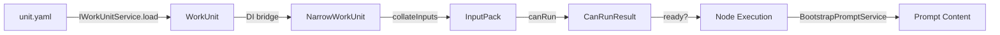

# Research Report: Expanding Work Units (Agentic, Code, UserInput)

**Generated**: 2026-02-04T14:30:00Z
**Research Query**: "Expanding work units with AgenticWorkUnit, CodeUnit, UserInputUnit types, reserved parameter routing, Row 0 concept, and E2E test upgrades"
**Mode**: Pre-Plan (research for upcoming specification)
**Location**: docs/plans/029-agentic-work-units/research-dossier.md
**FlowSpace**: Available
**Findings**: 55+ from 7 parallel subagents

---

## CRITICAL SCOPE CLARIFICATION

**This is a GREENFIELD implementation within `packages/positional-graph/`.**

- **Positional-graph is the NEW system** — self-contained, no workgraph dependencies
- **Workgraph (`packages/workgraph/`) is LEGACY** — will be removed, DO NOT import from it
- **Create NEW work unit types** within positional-graph — influenced by old concepts but independent
- **Current `NarrowWorkUnit`** is the starting point — needs expansion to full work unit types

**DO NOT:**
- Import from `@chainglass/workgraph`
- Use `IWorkUnitService` from workgraph
- Use `BootstrapPromptService` from workgraph
- Bridge to workgraph via DI

**DO:**
- Create new types in `packages/positional-graph/`
- Create new services in `packages/positional-graph/`
- Define new schemas in `packages/positional-graph/`
- Keep positional-graph fully self-contained

---

## Executive Summary

### What It Does
The positional-graph system currently has only `NarrowWorkUnit` (slug, inputs, outputs). This plan expands it with proper work unit types that include type discrimination, configuration, and template content access — all within the positional-graph package.

### Business Purpose
Enable agentic workflows where:
1. **AgenticWorkUnits** expose prompt templates through a reserved `main-prompt` input
2. **CodeUnits** expose scripts through a reserved `main-script` input
3. **UserInputUnits** provide a "Row 0" entry point for workflow data initialization
4. Running agents can access their templates programmatically (not just by file path)

### Key Insights
1. **NarrowWorkUnit must be expanded** — current type lacks `type` field and configs
2. **Reserved parameter routing** requires new infrastructure within positional-graph (IA-10)
3. **Row 0 concept** aligns with existing "Line 0 is entry point" semantics from Plan 026 (DE-04)
4. **Template/script resolution** needs new service in positional-graph (not workgraph's BootstrapPromptService)

### Quick Stats
- **Components**: New types/services in `packages/positional-graph/` + CLI updates
- **Dependencies**: Self-contained in positional-graph (NO workgraph imports)
- **Test Coverage**: 2900+ tests, E2E script with 53 steps, 7-node pipeline fixtures
- **Complexity**: Medium — greenfield types, leverages existing positional-graph patterns
- **Prior Learnings**: 15 relevant discoveries (concepts to replicate, not code to import)

---

## How It Currently Works

### Entry Points

| Entry Point | Type | Location | Purpose |
|------------|------|----------|---------|
| `cg unit list` | CLI | `apps/cli/src/commands/unit.command.ts:109` | List all WorkUnits |
| `cg unit info <slug>` | CLI | `apps/cli/src/commands/unit.command.ts:145` | Load full WorkUnit with configs |
| `IWorkUnitService.load()` | Service | `packages/workgraph/src/services/workunit.service.ts:134` | Load and validate WorkUnit |
| `IWorkUnitLoader.load()` | Interface | `packages/positional-graph/src/interfaces/positional-graph-service.interface.ts:59` | Narrow loader for positional-graph |
| `collateInputs()` | Algorithm | `packages/positional-graph/src/services/input-resolution.ts:30` | Resolve inputs for a node |

### Core Execution Flow

1. **WorkUnit Definition**: Unit defined in `.chainglass/units/<slug>/unit.yaml` with type-specific config
   - `type: 'agent'` → `agent.promptTemplate` points to `commands/main.md`
   - `type: 'code'` → Convention: `run.sh`, `run.py`, etc. in unit folder
   - `type: 'user-input'` → `userInput.prompt`, `userInput.questionType`

2. **Node Creation**: `cg wf node add <graphSlug> <lineId> <unitSlug>` → stores `unit_slug` in node.yaml

3. **Unit Loading**: `IWorkUnitLoader.load(ctx, slug)` returns `NarrowWorkUnit` with inputs/outputs
   - Full `WorkUnit` available via `IWorkUnitService.load()` with type-specific configs

4. **Input Resolution**: `collateInputs()` algorithm resolves wired inputs
   - `from_unit: <slug>` → backward search for matching nodes
   - `from_node: <nodeId>` → direct reference

5. **Template Access** (current gap):
   - **AgentUnit**: `BootstrapPromptService.generate()` reads file at `<unitDir>/commands/main.md`
   - **CodeUnit**: Script detected by convention (`run.*`), executed directly
   - **UserInputUnit**: `userInput.prompt` stored in unit.yaml, no content injection

### Data Flow


### State Management
- **Graph definition**: `.chainglass/data/workflows/<slug>/graph.yaml`
- **Node config**: `.chainglass/data/workflows/<slug>/nodes/<nodeId>/node.yaml`
- **Runtime state**: `.chainglass/data/workflows/<slug>/state.json`
- **Unit definitions**: `.chainglass/units/<unitSlug>/unit.yaml`
- **Prompt templates**: `.chainglass/units/<unitSlug>/commands/main.md`
- **Scripts**: `.chainglass/units/<unitSlug>/run.*`

---

## Architecture & Design

### Component Map

#### Target Package (Greenfield)
- **@chainglass/positional-graph** (`packages/positional-graph/`)
  - **Current**: `NarrowWorkUnit` — minimal type (slug, inputs, outputs only)
  - **Current**: `IWorkUnitLoader` — narrow interface for unit loading
  - **Current**: `collateInputs()`, `canRun()` — input resolution algorithm
  - **TO ADD**: `AgenticWorkUnit`, `CodeUnit`, `UserInputUnit` — enriched types
  - **TO ADD**: `WorkUnitSchema` — Zod discriminated union for validation
  - **TO ADD**: `IWorkUnitService` — full CRUD operations (new, not from workgraph)
  - **TO ADD**: Template/script resolution service

#### CLI Updates
- **apps/cli** (`apps/cli/src/commands/`)
  - `positional-graph.command.ts` — Graph + unit operations (expanded)
  - `container.ts` — DI wiring (positional-graph only, remove workgraph bridge)

#### LEGACY (Do Not Use)
- ~~@chainglass/workgraph~~ — Will be removed, do not import
- ~~@chainglass/workflow workunit.types.ts~~ — Old types, replicate concepts in positional-graph

### Design Patterns Identified

| Pattern | Location | Purpose |
|---------|----------|---------|
| **Discriminated Union** | `workunit.schema.ts:188` | Type-safe `'agent' \| 'code' \| 'user-input'` |
| **Structural Subtyping** | `container.ts:211-215` | `WorkUnit ⊇ NarrowWorkUnit` bridge |
| **Conditional Refinement** | `workunit.schema.ts:40` | `dataType` required when `type='data'` |
| **Reserved Placeholders** | `workunit.types.ts:96` | `{{config.X}}` in UserInputConfig |
| **Property Bags** | `properties.schema.ts:1-13` | `.catchall(z.unknown())` extensibility |
| **Atomic Writes** | `atomic-file.ts` | temp-then-rename persistence |

### System Boundaries

- **Internal**: WorkUnit type system, input resolution, state management
- **External**: CLI subprocess orchestration (ADR-0006), filesystem layout (ADR-0008)
- **Integration**: `IWorkUnitLoader` bridge connects workgraph → positional-graph

---

## Dependencies & Integration

### What This Depends On (Positional-Graph Only)

#### Internal Dependencies (from @chainglass/shared)
| Dependency | Type | Purpose | Risk if Changed |
|------------|------|---------|-----------------|
| `IFileSystem` | Required | Reads unit.yaml, prompt files | High — all persistence |
| `IPathResolver` | Required | Joins paths for unit lookup | Medium |
| `IYamlParser` | Required | Parses unit.yaml | High — parsing |
| `WorkspaceContext` | Required | Workspace-scoped paths | High — context boundary |
| `BaseResult` | Required | Error tuple pattern | Low — stable |

#### External Dependencies
| Library | Version | Purpose | Criticality |
|---------|---------|---------|-------------|
| `zod` | ^3.x | Schema validation | High |
| `js-yaml` | ^4.x | YAML parsing (via IYamlParser) | High |
| `fast-glob` | ^3.x | Unit discovery in `list()` | Medium |

### What Depends on This (After Implementation)

#### Direct Consumers
- **PositionalGraphService**: Will use new `IWorkUnitService` for full unit loading
- **CLI commands**: `cg wf` commands will use positional-graph services only
- **collateInputs**: Will use enriched unit types for input resolution

#### REMOVED Dependencies (Greenfield)
- ~~BootstrapPromptService from workgraph~~ — replicate in positional-graph
- ~~IWorkUnitService bridge from workgraph~~ — create new in positional-graph
- ~~WorkGraph UI~~ — will be updated to use positional-graph only

---

## Quality & Testing

### Current Test Coverage
- **Unit Tests**: `test/unit/workgraph/*.test.ts`, `test/unit/positional-graph/*.test.ts`
- **Contract Tests**: `test/contracts/workunit-service.contract.ts` — fake/real parity
- **Integration Tests**: `test/integration/positional-graph/` — lifecycle flows
- **E2E Tests**: `test/e2e/positional-graph-execution-e2e.test.ts` — 53 steps, 7 nodes

### Test Strategy Analysis

| Pattern | Location | Purpose |
|---------|----------|---------|
| **createWorkUnit()** | `test-helpers.ts:58` | Build NarrowWorkUnit fixtures |
| **stubWorkUnitLoader()** | `test-helpers.ts:149` | Configurable IWorkUnitLoader stub |
| **testFixtures** | `test-helpers.ts:205` | Standard 3-node pipeline |
| **e2eExecutionFixtures** | `test-helpers.ts:287` | 7-node lifecycle pipeline |
| **Contract tests** | `workunit-service.contract.ts` | Fake drift prevention |

### Known Issues & Technical Debt
| Issue | Severity | Location | Impact |
|-------|----------|----------|--------|
| No reserved parameter routing | Medium | IWorkUnitService | Can't inject template content |
| NarrowWorkUnit lacks `type` field | Low | positional-graph | Can't distinguish unit type at runtime |
| BootstrapPromptService path-only | Medium | workgraph | No content API for agents |

---

## Modification Considerations

### Safe to Modify
1. **test-helpers.ts**: Add enriched unit fixtures
2. **workunit.types.ts**: Add optional fields to configs (backward compatible)
3. **E2E test script**: Upgrade fixtures to use enriched types

### Modify with Caution
1. **IWorkUnitLoader interface**: Widening is safe, narrowing breaks consumers
2. **workunit.schema.ts**: New optional fields OK, required fields break existing units
3. **collateInputs()**: Algorithm changes affect all input resolution

### Danger Zones
1. **NarrowWorkUnit → WorkUnit bridge**: Breaking structural compatibility breaks DI
2. **unit.yaml format**: Schema changes require migration logic
3. **Error code allocation**: E120-E149 (workgraph), E150-E179 (positional-graph)

### Extension Points
1. **Reserved parameter names**: Define namespace (`_prompt`, `_script`, `_config`)
2. **IWorkUnitService.load()**: Can return template content alongside paths
3. **NodeConfig.inputs**: Can wire reserved parameters like any other input

---

## Prior Learnings (From Previous Implementations)

### PL-01: WorkUnit Type Extraction Architecture
**Source**: Plan 026, Phase 1
**Type**: decision
**Insight**: `InputDeclaration` name collision required renaming to `WorkUnitInput/WorkUnitOutput` with backward-compat aliases.
**Action**: Verify new types don't collide with existing names.

### PL-02: Unit Slug Parsing Ambiguity
**Source**: Plan 016 Phase 4, Plan 026 Phase 1
**Type**: gotcha
**Insight**: Slugs ending in `-[a-f0-9]{3}` create node ID ambiguity. Store `unit_slug` explicitly.
**Action**: Include explicit references, don't derive from parsing.

### PL-03: Strict Name Matching for Input/Output Wiring
**Source**: Plan 016 Phase 4
**Type**: decision
**Insight**: v1 uses exact name matching. Output `text` wires only to input `text`.
**Action**: Keep strict matching; reserved params follow same pattern.

### PL-04: Configuration vs Data Separation
**Source**: Plans 016 Phase 2, Phase 4
**Type**: insight
**Insight**: Config (AgentConfig, CodeConfig) is definition-time; input/output data is execution-time.
**Action**: Reserved params are config access, not data flow.

### PL-05: IFileSystem.rename() for Atomic Writes
**Source**: Plan 016 Phase 3
**Type**: decision
**Insight**: Atomic write pattern requires rename(). Added when discovered missing.
**Action**: Use existing atomicWriteFile/Json utilities.

### PL-06: Special Nodes vs Unit Nodes
**Source**: Plan 016 Phase 4
**Type**: insight
**Insight**: START is special-cased. Better abstraction: control nodes vs unit nodes.
**Action**: UserInputUnit on Row 0 is a unit node, not control node.

### PL-07: WorkUnitService Dependency for Validation
**Source**: Plan 016 Phase 4
**Type**: decision
**Insight**: addNode validation requires loading unit. WorkGraphService injects IWorkUnitService.
**Action**: Enriched validation can leverage existing IWorkUnitService.load().

### PL-10: Zod Schema with JSON Schema Export
**Source**: Plans 016 Phase 1 & 2
**Type**: decision
**Insight**: Single source of truth: Zod schemas with auto-generated JSON Schema.
**Action**: Define enriched types in Zod first, export JSON Schema.

### PL-15: Schema Backward Compatibility
**Source**: Plan 028 Phase 1
**Type**: constraint
**Insight**: All new fields must be optional. Existing documents must parse successfully.
**Action**: All enriched type additions use optional fields.

---

## Critical Discoveries

### CD-01: Reserved Parameter Routing Pattern Needed
**Impact**: Critical
**Source**: IA-10, IC-10
**What**: No existing infrastructure for reserved parameter routing. Current system:
- AgentUnit: `BootstrapPromptService` reads file, returns path
- CodeUnit: Convention detects `run.*`, executes directly
- UserInputUnit: `{{config.X}}` placeholders exist but no substitution handler

**Required Design**:
1. Define reserved parameter namespace (e.g., `_prompt`, `_script`)
2. Extend `IWorkUnitService.load()` or add new `resolveTemplate()` method
3. CLI routes reserved input names to WorkUnit template content
4. Running agents receive template content, not just paths

### CD-02: NarrowWorkUnit Must Be Expanded (Greenfield)
**Impact**: High
**Source**: IC-03, DC-01, User clarification
**What**: `NarrowWorkUnit` has only `slug`, `inputs`, `outputs`. Missing:
- `type: 'agent' | 'code' | 'user-input'`
- Type-specific configs (prompt templates, scripts, question types)

**Implication**: Since this is a greenfield implementation in positional-graph:
1. Create NEW `WorkUnit` type with full discriminated union
2. Create NEW `IWorkUnitService` in positional-graph (not from workgraph)
3. `NarrowWorkUnit` may become deprecated or renamed to `WorkUnitSummary`

**Recommendation**: Create full `AgenticWorkUnit`, `CodeUnit`, `UserInputUnit` types in positional-graph with proper Zod schemas.

### CD-03: Row 0 Semantics Already Exist
**Impact**: Low (validates design)
**Source**: DE-04, Plan 026
**What**: Line 0 is already the entry point — first line nodes have no preceding lines, so they're naturally "ready" (4-gate algorithm passes).

**Implication**: "Reserved Row 0 concept" aligns with existing semantics. UserInputUnit on Line 0 provides workflow entry data. No new infrastructure needed — just convention.

### CD-04: Shared Base Class Opportunity
**Impact**: Medium
**Source**: User request, PS-01
**What**: User notes AgenticWorkUnit and CodeUnit share a pattern:
- Both have templates (prompts vs scripts)
- Both need reserved parameter routing (`main-prompt` vs `main-script`)
- Both extend from unit concept with I/O declarations

**Name Workshop**: Base class for units with template content access:
- `TemplatedWorkUnit`
- `ExecutableUnit`
- `RunnableUnit`
- `ContentBackedUnit`

**Recommendation**: `TemplatedWorkUnit` — clearest semantic meaning.

### CD-05: E2E Test Fixtures Use NarrowWorkUnit
**Impact**: Medium
**Source**: QT-01, QT-02
**What**: Current E2E fixtures in `test-helpers.ts` create `NarrowWorkUnit` objects with only `slug`, `inputs`, `outputs`. They lack `type` and config fields.

**Required Changes**:
1. Add enriched fixtures with `type` and config fields
2. Update `stubWorkUnitLoader` to optionally return full `WorkUnit`
3. Add fixtures for UserInputUnit on Row 0
4. Test reserved parameter routing in E2E flow

---

## Supporting Documentation

### Related Documentation
- `docs/plans/016-agent-units/workunit-data-model.md` — WorkUnit foundation
- `docs/plans/026-positional-graph/positional-graph-plan.md` — Positional graph architecture
- `docs/plans/028-pos-agentic-cli/pos-agentic-cli-plan.md` — Execution lifecycle
- `docs/how/positional-graph-execution/` — How-to guides

### Key Code Comments
- `positional-graph-service.interface.ts:23-24` — "Per DYK-P4-I2: local to positional-graph"
- `container.ts:211-215` — "WorkUnit ⊇ NarrowWorkUnit structural compatibility"
- `workunit.types.ts:9-14` — Naming collision resolution

### ADRs
- **ADR-0006**: CLI-based workflow agent orchestration
- **ADR-0008**: Workspace split storage data model

---

## Recommendations

### Greenfield Implementation Strategy

1. **Create new types in positional-graph** (not imports):
   ```typescript
   // packages/positional-graph/src/interfaces/workunit.types.ts (NEW FILE)
   export interface AgenticWorkUnit { ... }
   export interface CodeUnit { ... }
   export interface UserInputUnit { ... }
   export type WorkUnit = AgenticWorkUnit | CodeUnit | UserInputUnit;
   ```

2. **Create new Zod schemas in positional-graph**:
   ```typescript
   // packages/positional-graph/src/schemas/workunit.schema.ts (NEW FILE)
   export const WorkUnitSchema = z.discriminatedUnion('type', [...]);
   ```

3. **Create new IWorkUnitService in positional-graph**:
   - `list()`, `load()`, `create()`, `validate()` — replicate concepts
   - Add `getTemplateContent(ctx, slug)` for reserved parameter routing
   - Self-contained, no workgraph dependencies

4. **Reserved parameter routing**:
   - `main-prompt` for AgenticWorkUnit template content
   - `main-script` for CodeUnit script path
   - CLI detects reserved names, routes to WorkUnit template resolution

5. **Row 0 convention**:
   - Document that Line 0 should contain setup/input nodes
   - UserInputUnit provides human-supplied data
   - No special handling needed — existing 4-gate algorithm works

6. **TemplatedWorkUnit base abstraction**:
   - Shared interface for units with template content (AgenticWorkUnit, CodeUnit)
   - Enables unified template resolution API

### Implementation Order

1. Define new types/interfaces in positional-graph
2. Create Zod schemas with discriminated union
3. Implement IWorkUnitService in positional-graph
4. Add reserved parameter routing to CLI
5. Update E2E tests with enriched fixtures
6. Remove workgraph bridge from DI container

### Error Codes
- Use E180-E189 range for new work unit errors in positional-graph

---

## External Research Opportunities

No external research gaps identified during codebase exploration. The system is well-documented and patterns are clear.

---

## Appendix: File Inventory

### Core Files
| File | Purpose | Lines |
|------|---------|-------|
| `packages/workflow/src/interfaces/workunit.types.ts` | Domain types | 131 |
| `packages/workgraph/src/schemas/workunit.schema.ts` | Zod validation | 200+ |
| `packages/workgraph/src/services/workunit.service.ts` | Service impl | 473 |
| `packages/positional-graph/src/interfaces/positional-graph-service.interface.ts` | Narrow types | 675 |
| `packages/positional-graph/src/services/input-resolution.ts` | collateInputs | 498 |

### Test Files
| File | Purpose |
|------|---------|
| `test/unit/positional-graph/test-helpers.ts` | Fixtures and stubs |
| `test/e2e/positional-graph-execution-e2e.test.ts` | E2E 7-node pipeline |
| `test/contracts/workunit-service.contract.ts` | Contract tests |

### Configuration Files
| File | Purpose |
|------|---------|
| `.chainglass/units/<slug>/unit.yaml` | Unit definition |
| `.chainglass/units/<slug>/commands/main.md` | Agent prompt template |

---

## Next Steps

1. Run `/plan-1b-specify` to create feature specification
2. Define new work unit types in `packages/positional-graph/src/interfaces/`
3. Create Zod schemas in `packages/positional-graph/src/schemas/`
4. Implement new `IWorkUnitService` in `packages/positional-graph/src/services/`
5. Add reserved parameter routing (`main-prompt`, `main-script`) to CLI
6. Update E2E tests with enriched fixtures (AgenticWorkUnit, CodeUnit, UserInputUnit)
7. Remove workgraph bridge from DI container
8. Document Row 0 convention for UserInputUnit entry points

---

**Research Complete**: 2026-02-04T14:30:00Z
**Report Location**: docs/plans/029-agentic-work-units/research-dossier.md
**Scope**: Greenfield implementation in `packages/positional-graph/` (no workgraph imports)
