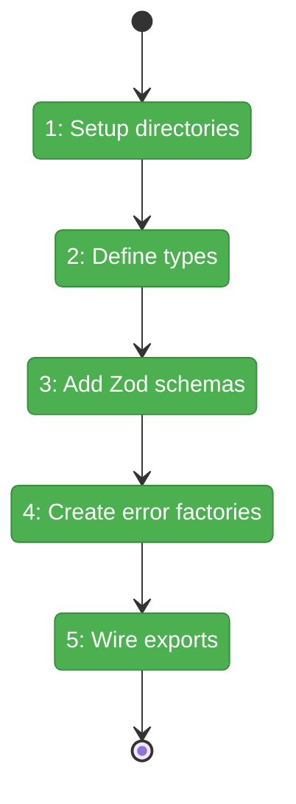
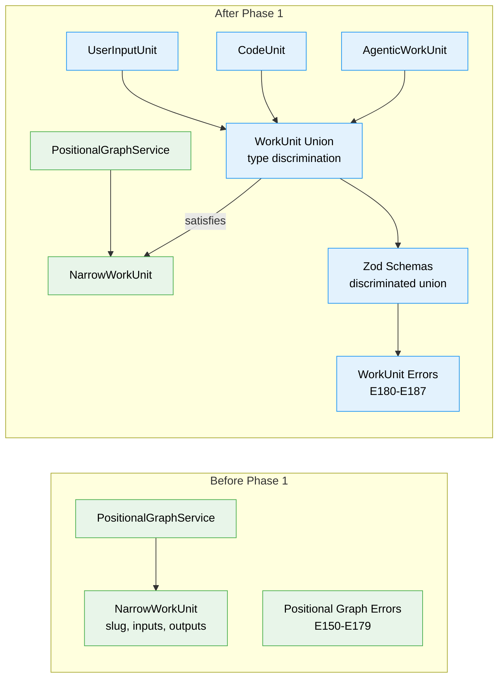

# Flight Plan: Phase 1 — Types and Schemas

**Plan**: [../../agentic-work-units-plan.md](../../agentic-work-units-plan.md)
**Phase**: Phase 1: Types and Schemas
**Generated**: 2026-02-04
**Status**: Landed

---

## Departure → Destination

**Where we are**: The positional-graph system currently only has `NarrowWorkUnit` — a minimal type containing just `slug`, `inputs`, and `outputs`. There's no way to distinguish between agent, code, and user-input units at runtime. No Zod validation exists for unit definitions, and error codes E180-E187 are not yet defined.

**Where we're going**: By the end of this phase, a developer can import discriminated `WorkUnit` types (`AgenticWorkUnit`, `CodeUnit`, `UserInputUnit`) from `@chainglass/positional-graph`. TypeScript will narrow types based on the `type` field, enabling type-safe access like `unit.agent.prompt_template`. Zod schemas will validate unit definitions with actionable error messages (E182 for schema violations). All new types will structurally satisfy `NarrowWorkUnit` for backward compatibility.

---

## Flight Status

<!-- Updated by /plan-6: pending → active → done. Use blocked for problems/input needed. -->

**Legend**: grey = pending | yellow = active | red = blocked/needs input | green = done

---

## Stages

<!-- Updated by /plan-6 during implementation: [ ] → [~] → [x] -->

- [x] **Stage 1: Create directory structure** — set up PlanPak feature folders for source and test files (`features/029-agentic-work-units/` — new directories)
- [x] **Stage 2: Define discriminated union types** — create WorkUnitBase, AgenticWorkUnit, CodeUnit, UserInputUnit interfaces with type narrowing (`workunit.types.ts` — new file)
- [x] **Stage 3: Implement Zod validation schemas** — create discriminated union schema with refine checks for type-specific validations (`workunit.schema.ts` — new file)
- [x] **Stage 4: Create error factory functions** — implement E180-E187 error factories following existing positional-graph pattern (`workunit-errors.ts` — new file)
- [x] **Stage 5: Wire up exports** — create feature barrel and update package exports for public API (`index.ts` — new file, `src/index.ts` — modified)

---

## Acceptance Criteria

- [x] AC-6: WorkUnit structurally satisfies NarrowWorkUnit (backward compatibility)
- [x] AC-7: Malformed unit.yaml returns E182 with descriptive message via Zod validation

---

## Goals & Non-Goals

**Goals**:
- Create AgenticWorkUnit, CodeUnit, UserInputUnit interfaces with type-specific configs
- Create WorkUnit discriminated union with compile-time type narrowing
- Implement Zod schemas with discriminated union validation
- Implement error factory functions for E180-E187
- Ensure WorkUnit structurally extends NarrowWorkUnit (compile-time assertion)
- Create feature barrel exports and update package exports

**Non-Goals**:
- WorkUnitService implementation (Phase 2)
- WorkUnitAdapter implementation (Phase 2)
- CLI integration or reserved parameter routing (Phase 3)
- Template content access (Phase 2)
- DI container registration (Phase 3)
- Importing from legacy @chainglass/workgraph (GREENFIELD constraint)

---

## Architecture: Before & After

**Legend**: existing (green, unchanged) | changed (orange, modified) | new (blue, created)

---

## Checklist

- [x] T001: Create feature directory structure (CS-1)
- [x] T002: Write tests for WorkUnit type compatibility - RED (CS-2)
- [x] T003: Create workunit.types.ts with discriminated union - GREEN (CS-2)
- [x] T004: Write tests for Zod schema validation - RED (CS-2)
- [x] T005: Create workunit.schema.ts with Zod schemas - GREEN (CS-2)
- [x] T006: Write tests for error factory functions - RED (CS-1)
- [x] T007: Create workunit-errors.ts with error factories - GREEN (CS-1)
- [x] T008: Create feature barrel index.ts and update package exports (CS-1)
- [x] T009: Refactor and verify structural compatibility (CS-2)

---

## PlanPak

Active — files organized under `features/029-agentic-work-units/`
