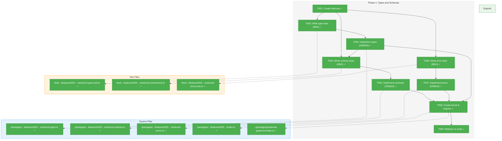
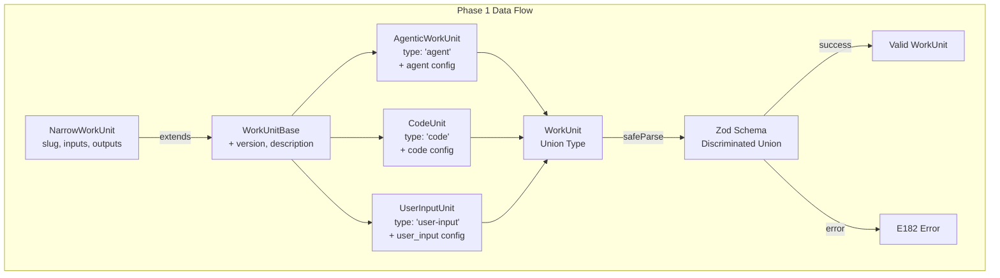
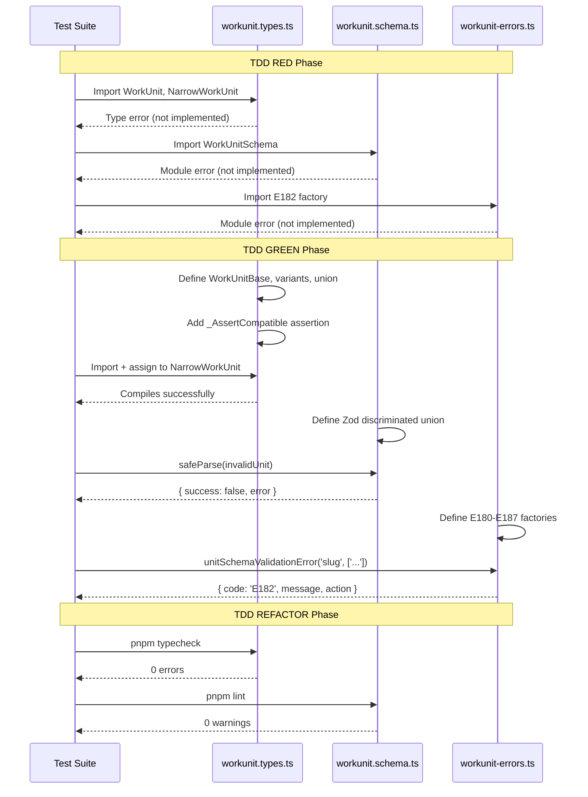

# Phase 1: Types and Schemas – Tasks & Alignment Brief

**Spec**: [../../agentic-work-units-spec.md](../../agentic-work-units-spec.md)
**Plan**: [../../agentic-work-units-plan.md](../../agentic-work-units-plan.md)
**Date**: 2026-02-04

---

## Executive Briefing

### Purpose

This phase creates the foundational type definitions, Zod schemas, and error factories for the discriminated `WorkUnit` union. These types enable runtime type discrimination (`'agent' | 'code' | 'user-input'`), compile-time type safety, and schema-based validation that subsequent phases will use for service implementation and CLI routing.

### What We're Building

A discriminated union type system consisting of:
- `AgenticWorkUnit`: Units that use prompts for agent execution (prompt_template)
- `CodeUnit`: Units that execute scripts (script path, timeout)
- `UserInputUnit`: Units that collect user input (question_type, prompt)
- `WorkUnit`: Union type with compile-time type narrowing via `type` field
- Zod schemas for runtime validation with descriptive error messages
- Error factory functions (E180-E187) for WorkUnit operations

### User Value

Agents and tooling can programmatically distinguish between unit types at runtime, enabling type-safe execution paths. Schema validation catches malformed unit definitions early with actionable error messages. The type system provides IDE autocomplete and compile-time safety.

### Example

**Before**: `NarrowWorkUnit` only has `{ slug, inputs, outputs }` — no type discrimination
**After**: `WorkUnit` discriminates on `type` field, enabling:
```typescript
if (unit.type === 'agent') {
  // TypeScript narrows: unit is AgenticWorkUnit
  console.log(unit.agent.prompt_template); // Type-safe access
}
```

---

## Objectives & Scope

### Objective

Create discriminated union types, Zod schemas, and error factories as specified in the plan Phase 1 acceptance criteria. All types must structurally satisfy `NarrowWorkUnit` for backward compatibility.

### Goals

- ✅ Create `AgenticWorkUnit`, `CodeUnit`, `UserInputUnit` interfaces with type-specific configs
- ✅ Create `WorkUnit` discriminated union with compile-time type narrowing
- ✅ Implement Zod schemas with discriminated union validation
- ✅ Implement error factory functions for E180-E187
- ✅ Ensure `WorkUnit` structurally extends `NarrowWorkUnit` (compile-time assertion)
- ✅ Create feature barrel exports and update package exports

### Non-Goals

- ❌ WorkUnitService implementation (Phase 2)
- ❌ WorkUnitAdapter implementation (Phase 2)
- ❌ CLI integration or reserved parameter routing (Phase 3)
- ❌ Template content access (Phase 2)
- ❌ DI container registration (Phase 3)
- ❌ Importing from legacy `@chainglass/workgraph` (GREENFIELD constraint)

---

## Pre-Implementation Audit

### Summary

| File | Action | Origin | Modified By | Recommendation |
|------|--------|--------|-------------|----------------|
| `packages/positional-graph/src/features/029-agentic-work-units/` | Created | Plan 029 | – | keep-as-is |
| `packages/positional-graph/src/features/029-agentic-work-units/workunit.types.ts` | Created | Plan 029 | – | keep-as-is |
| `packages/positional-graph/src/features/029-agentic-work-units/workunit.schema.ts` | Created | Plan 029 | – | keep-as-is |
| `packages/positional-graph/src/features/029-agentic-work-units/workunit-errors.ts` | Created | Plan 029 | – | keep-as-is |
| `packages/positional-graph/src/features/029-agentic-work-units/index.ts` | Created | Plan 029 | – | keep-as-is |
| `packages/positional-graph/src/index.ts` | Modified | Plan 026 | Plan 029 | cross-plan-edit |
| `test/unit/positional-graph/features/029-agentic-work-units/*.test.ts` | Created | Plan 029 | – | keep-as-is |

### Compliance Check

| Severity | File | Rule/ADR | Finding | Resolution |
|----------|------|----------|---------|------------|
| **INFO** | workunit.schema.ts | ADR-0003 | Zod schema follows Configuration System pattern | Aligned - use `z.infer<>` for type derivation |
| **INFO** | All feature files | PlanPak | Files in `features/029-agentic-work-units/` | Compliant with plan File Management |
| **INFO** | workunit-errors.ts | Error Codes | E180-E187 allocated, E150-E179 already used | No collision - range verified |

### Key Findings

1. **GREENFIELD Constraint**: No imports from `@chainglass/workgraph`. Types and schemas are implemented fresh in positional-graph.

2. **Structural Compatibility**: New `WorkUnit` types must include `slug`, `inputs`, `outputs` fields to satisfy existing `NarrowWorkUnit` interface. A compile-time assertion will verify this.

3. **Error Code Range**: E180-E187 are available (positional-graph uses E150-E179 per existing error file).

---

## Requirements Traceability

### Coverage Matrix

| AC | Description | Flow Summary | Files in Flow | Tasks | Status |
|----|-------------|--------------|---------------|-------|--------|
| AC-6 | Backward Compatibility: WorkUnit satisfies NarrowWorkUnit | Type definition → Assertion → Compile check | `workunit.types.ts`, `workunit.types.test.ts`, `index.ts` | T002, T003, T008, T009 | ✅ Complete |
| AC-7 | Zod Schema Validation: Returns E182 for malformed units | Schema definition → Validation test → Error factory | `workunit.schema.ts`, `workunit.schema.test.ts`, `workunit-errors.ts`, `workunit-errors.test.ts` | T004, T005, T006, T007 | ✅ Complete |

### Gaps Found

No gaps — all Phase 1 acceptance criteria have complete file coverage.

### Orphan Files

| File | Tasks | Assessment |
|------|-------|------------|
| `packages/positional-graph/src/index.ts` | T008 | Cross-plan edit — adds feature exports |

---

## Architecture Map

### Component Diagram

<!-- Status: grey=pending, orange=in-progress, green=completed, red=blocked -->
<!-- Updated by plan-6 during implementation -->



### Task-to-Component Mapping

<!-- Status: ⬜ Pending | 🟧 In Progress | ✅ Complete | 🔴 Blocked -->

| Task | Component(s) | Files | Status | Comment |
|------|-------------|-------|--------|---------|
| T001 | Directory Setup | `features/029-agentic-work-units/` | ✅ Complete | PlanPak structure |
| T002 | Type Tests | `workunit.types.test.ts` | ✅ Complete | TDD RED: 3+ cases |
| T003 | Type Definitions | `workunit.types.ts` | ✅ Complete | TDD GREEN: discriminated union |
| T004 | Schema Tests | `workunit.schema.test.ts` | ✅ Complete | TDD RED: 10+ cases |
| T005 | Zod Schemas | `workunit.schema.ts` | ✅ Complete | TDD GREEN: discriminated union |
| T006 | Error Tests | `workunit-errors.test.ts` | ✅ Complete | TDD RED: E180-E187 |
| T007 | Error Factories | `workunit-errors.ts` | ✅ Complete | TDD GREEN: 8 factories |
| T008 | Barrel Exports | `index.ts` (feature + package) | ✅ Complete | Public API |
| T009 | Compatibility | All Phase 1 files | ✅ Complete | TDD REFACTOR + assertion |

---

## Tasks

| Status | ID | Task | CS | Type | Dependencies | Absolute Path(s) | Validation | Subtasks | Notes |
|--------|------|------|----|------|--------------|------------------|------------|----------|-------|
| [x] | T001 | Create feature directory structure | 1 | Setup | – | `/home/jak/substrate/029-agentic-work-units/packages/positional-graph/src/features/029-agentic-work-units/`, `/home/jak/substrate/029-agentic-work-units/test/unit/positional-graph/features/029-agentic-work-units/` | Directories exist | – | PlanPak setup |
| [x] | T002 | Write tests for WorkUnit type compatibility (RED) | 2 | Test | T001 | `/home/jak/substrate/029-agentic-work-units/test/unit/positional-graph/features/029-agentic-work-units/workunit.types.test.ts` | Tests fail with expected messages; test doc format per plan | – | TDD RED; Per Critical Discovery 01 |
| [x] | T003 | Create `workunit.types.ts` with discriminated union (GREEN) | 2 | Core | T002 | `/home/jak/substrate/029-agentic-work-units/packages/positional-graph/src/features/029-agentic-work-units/workunit.types.ts` | Type tests pass; compile-time assertion present | – | TDD GREEN; Per Critical Discovery 01 |
| [x] | T004 | Write tests for Zod schema validation (RED) | 2 | Test | T001, T003 | `/home/jak/substrate/029-agentic-work-units/test/unit/positional-graph/features/029-agentic-work-units/workunit.schema.test.ts` | Tests fail; covers valid units, missing type, type mismatch, invalid configs | – | TDD RED; Per Critical Discovery 07 |
| [x] | T005 | Create `workunit.schema.ts` with Zod schemas (GREEN) | 2 | Core | T004 | `/home/jak/substrate/029-agentic-work-units/packages/positional-graph/src/features/029-agentic-work-units/workunit.schema.ts` | All schema tests pass | – | TDD GREEN; ADR-0003 |
| [x] | T006 | Write tests for error factory functions (RED) | 1 | Test | T001 | `/home/jak/substrate/029-agentic-work-units/test/unit/positional-graph/features/029-agentic-work-units/workunit-errors.test.ts` | Tests verify code, message, action for E180-E187 | – | TDD RED; Per Discovery 06 |
| [x] | T007 | Create `workunit-errors.ts` with error factories (GREEN) | 1 | Core | T006 | `/home/jak/substrate/029-agentic-work-units/packages/positional-graph/src/features/029-agentic-work-units/workunit-errors.ts` | All error tests pass | – | TDD GREEN |
| [x] | T008 | Create feature barrel `index.ts` and update package exports | 1 | Core | T003, T005, T007 | `/home/jak/substrate/029-agentic-work-units/packages/positional-graph/src/features/029-agentic-work-units/index.ts`, `/home/jak/substrate/029-agentic-work-units/packages/positional-graph/src/index.ts` | Types/schemas/errors importable from `@chainglass/positional-graph` | – | cross-plan-edit for src/index.ts |
| [x] | T009 | Refactor and verify structural compatibility | 2 | Core | T008 | All Phase 1 files | Type tests pass; no lint errors; `pnpm typecheck` passes | – | TDD REFACTOR |

---

## Alignment Brief

### Critical Findings Affecting This Phase

| Finding | Impact | Constraint | Tasks Affected |
|---------|--------|------------|----------------|
| **Critical Discovery 01**: Structural Compatibility | Critical | `WorkUnit extends NarrowWorkUnit` assertion required | T002, T003, T009 |
| **Medium Discovery 06**: Error Code Allocation | Medium | Use E180-E187 range; add `WORKUNIT_ERROR_CODES` constant | T006, T007 |
| **Medium Discovery 07**: Zod Error Transformation | Medium | Create `formatZodErrors()` for actionable E182 messages | T005 |
| **Medium Discovery 08**: PlanPak Organization | Medium | Files in `features/029-agentic-work-units/` directories | T001, T008 |
| **DYK #1**: Input/Output Type Mismatch | Critical | `data_type` optional at type level, Zod refine enforces contextually | T005 |
| **DYK #2**: Schema-First Ordering | Critical | Zod schemas in T005 are source of truth; T003 re-exports via `z.infer<>` | T003, T005 |
| **DYK #3**: Compile-Time Assertion | Medium | Use explicit assignment test, not just conditional type | T002 |
| **DYK #4**: E182 Actionability | Medium | Add `formatZodErrors()` helper for human-readable messages | T005 |

### ADR Decision Constraints

| ADR | Decision | Constraint | Tasks Affected |
|-----|----------|------------|----------------|
| ADR-0003 | Configuration System | Use Zod schema-first with `z.infer<>` type derivation (per DYK #2: T005 is source of truth, T003 re-exports) | T003, T005 |
| ADR-0004 | DI Container Architecture | N/A for Phase 1 (service registration is Phase 3) | – |

### PlanPak Placement Rules

Per plan File Management (PlanPak):
- **Plan-scoped files** → `features/029-agentic-work-units/` (workunit.types.ts, workunit.schema.ts, workunit-errors.ts, index.ts)
- **Cross-cutting files** → Traditional location (`packages/positional-graph/src/index.ts` — add export only)
- **Test files** → `test/unit/positional-graph/features/029-agentic-work-units/`

### Invariants & Guardrails

1. **GREENFIELD**: No imports from `@chainglass/workgraph`
2. **Structural Subtyping**: `WorkUnit` must satisfy `NarrowWorkUnit` — verified by explicit assignment test `const narrow: NarrowWorkUnit = unit;` (per DYK #3)
3. **Fakes Only**: Use `FakeFileSystem`, `FakeYamlParser` from `@chainglass/shared` in tests
4. **Error Code Range**: E180-E187 only; E150-E179 already allocated
5. **No unit.yaml Backward Compat**: Existing `unit.yaml` files will be updated in Phase 5; `version` field is required (per DYK #5)

### Inputs to Read

- `/home/jak/substrate/029-agentic-work-units/packages/positional-graph/src/interfaces/positional-graph-service.interface.ts` (NarrowWorkUnit definition, lines 45-49)
- `/home/jak/substrate/029-agentic-work-units/packages/positional-graph/src/errors/positional-graph-errors.ts` (error pattern)
- `/home/jak/substrate/029-agentic-work-units/docs/plans/029-agentic-work-units/workshops/workunit-loading.md` (type/schema definitions)
- `/home/jak/substrate/029-agentic-work-units/test/unit/positional-graph/test-helpers.ts` (test fixture patterns)

### Visual Alignment: Flow Diagram



### Visual Alignment: Sequence Diagram



### Test Plan (Full TDD with Fakes Only)

#### workunit.types.test.ts

Per DYK #3: Use explicit assignment to exercise structural compatibility (not just conditional types).

| Test Name | Purpose | Fixture | Expected Output |
|-----------|---------|---------|-----------------|
| `AgenticWorkUnit should satisfy NarrowWorkUnit` | AC-6 compatibility | `agenticUnitFixture` | `const narrow: NarrowWorkUnit = unit;` compiles; `narrow.slug` accessible |
| `CodeUnit should satisfy NarrowWorkUnit` | AC-6 compatibility | `codeUnitFixture` | `const narrow: NarrowWorkUnit = unit;` compiles; `narrow.slug` accessible |
| `UserInputUnit should satisfy NarrowWorkUnit` | AC-6 compatibility | `userInputUnitFixture` | `const narrow: NarrowWorkUnit = unit;` compiles; `narrow.slug` accessible |
| `WorkUnit union should satisfy NarrowWorkUnit` | AC-6 compatibility | Union of all 3 | `const narrow: NarrowWorkUnit = unit;` compiles |

#### workunit.schema.test.ts

| Test Name | Purpose | Input | Expected Output |
|-----------|---------|-------|-----------------|
| `should validate AgenticWorkUnit` | Happy path | Valid agent unit | `success: true` |
| `should validate CodeUnit` | Happy path | Valid code unit | `success: true` |
| `should validate UserInputUnit` | Happy path | Valid user-input unit | `success: true` |
| `should reject unit with missing type field` | AC-7 | `{ slug, version, inputs, outputs }` | `success: false` |
| `should reject unit with invalid type value` | AC-7 | `type: 'invalid'` | `success: false` |
| `should reject agent type without agent config` | AC-7 | `type: 'agent'` without `agent:` | `success: false` |
| `should reject agent type with code config` | AC-7 | `type: 'agent'` with `code:` | `success: false` |
| `should reject invalid slug format` | Validation | `slug: '123-bad'` | `success: false` |
| `should require data_type when type=data` | Refine | Input with `type: 'data'`, no data_type | `success: false` |
| `should require options for single/multi question` | Refine | `question_type: 'single'`, no options | `success: false` |

#### workunit-errors.test.ts

| Test Name | Error Code | Verified Fields |
|-----------|------------|-----------------|
| `unitNotFoundError returns E180` | E180 | code, message contains slug, action |
| `unitYamlParseError returns E181` | E181 | code, message, action |
| `unitSchemaValidationError returns E182` | E182 | code, message contains issues, action |
| `unitNoTemplateError returns E183` | E183 | code, message, action |
| `unitPathEscapeError returns E184` | E184 | code, message contains path, action |
| `unitTemplateNotFoundError returns E185` | E185 | code, message, action |
| `unitTypeMismatchError returns E186` | E186 | code, message contains types, action |
| `unitSlugInvalidError returns E187` | E187 | code, message, action |

### Step-by-Step Implementation Outline

1. **T001**: `mkdir -p packages/positional-graph/src/features/029-agentic-work-units && mkdir -p test/unit/positional-graph/features/029-agentic-work-units`

2. **T002**: Create `workunit.types.test.ts` with 4 test cases (import non-existent types → RED)

3. **T003**: Create `workunit.types.ts` (per DYK #2: types derived from schemas):
   - Re-export types from schema: `export type { WorkUnit, AgenticWorkUnit, CodeUnit, UserInputUnit } from './workunit.schema.js'`
   - Define any additional type aliases needed for consumers
   - NOTE: Actual type definitions live in `workunit.schema.ts` via `z.infer<>`

4. **T004**: Create `workunit.schema.test.ts` with 10 test cases (import non-existent schema → RED)

5. **T005**: Create `workunit.schema.ts` (per DYK #2: this is source of truth):
   - Define `SlugSchema`, `IOTypeSchema`, `DataTypeSchema`
   - Define `WorkUnitInputSchema`, `WorkUnitOutputSchema` with refine (per DYK #1: `data_type` optional at schema level, refine enforces when `type='data'`)
   - Define `AgentConfigSchema`, `CodeConfigSchema`, `UserInputConfigSchema` with refines
   - Define `WorkUnitBaseSchema`
   - Define `AgenticWorkUnitSchema`, `CodeUnitSchema`, `UserInputUnitSchema`
   - Define `WorkUnitSchema = z.discriminatedUnion('type', [...])`
   - Export inferred types via `z.infer<typeof ...>`
   - Create `formatZodErrors(error: ZodError, slug: string): string[]` helper (per DYK #4: transform Zod issues to actionable messages)

6. **T006**: Create `workunit-errors.test.ts` with 8 test cases (import non-existent errors → RED)

7. **T007**: Create `workunit-errors.ts`:
   - Define `WORKUNIT_ERROR_CODES` constant
   - Implement 8 factory functions following existing pattern

8. **T008**: Create `index.ts` barrel and update `packages/positional-graph/src/index.ts`

9. **T009**: Run `pnpm typecheck`, `pnpm lint`, all tests; refactor if needed

### Commands to Run

```bash
# Create directories (T001)
mkdir -p packages/positional-graph/src/features/029-agentic-work-units
mkdir -p test/unit/positional-graph/features/029-agentic-work-units

# Run type tests (T002, T003)
pnpm test test/unit/positional-graph/features/029-agentic-work-units/workunit.types.test.ts

# Run schema tests (T004, T005)
pnpm test test/unit/positional-graph/features/029-agentic-work-units/workunit.schema.test.ts

# Run error tests (T006, T007)
pnpm test test/unit/positional-graph/features/029-agentic-work-units/workunit-errors.test.ts

# Run all Phase 1 tests
pnpm test test/unit/positional-graph/features/029-agentic-work-units/

# TypeScript compile check (T009)
pnpm typecheck

# Lint check (T009)
pnpm lint

# Full validation
just fft
```

### Risks & Unknowns

| Risk | Severity | Mitigation |
|------|----------|------------|
| Type assertion fails at compile time | Medium | Start with assertion test; fix types before proceeding |
| Zod refine conditions conflict | Low | Test each refine independently before combining |
| Error code collision with other packages | Low | Already verified E180-E187 available |
| Import path changes break consumers | Low | Use barrel export pattern; single public API |

### Ready Check

- [ ] Directory structure created (T001)
- [ ] `NarrowWorkUnit` interface located and understood
- [ ] Error code range E180-E187 verified available
- [ ] Test documentation format from plan understood
- [ ] ADR constraints mapped to tasks (ADR-0003 → T005)
- [ ] Fakes-only policy understood (no mocks/stubs)
- [ ] GREENFIELD constraint understood (no workgraph imports)

---

## Phase Footnote Stubs

<!-- Reserved for plan-6a-update-progress to add entries during implementation -->

| ID | Ref | Description |
|----|-----|-------------|
| [^1] | T001-T003 | WorkUnit type definitions and compile-time assertions |
| [^2] | T004-T005 | Zod schemas with discriminated union validation |
| [^3] | T006-T007 | Error factory functions E180-E187 |
| [^4] | T008-T009 | Feature barrel exports and package integration |

---

## Evidence Artifacts

**Execution Log**: `./execution.log.md` (created by plan-6 during implementation)

**Supporting Files**:
- Test output logs
- TypeScript compilation output
- Lint/format results

---

## Discoveries & Learnings

_Populated during implementation by plan-6. Log anything of interest to your future self._

| Date | Task | Type | Discovery | Resolution | References |
|------|------|------|-----------|------------|------------|
| | | | | | |

**Types**: `gotcha` | `research-needed` | `unexpected-behavior` | `workaround` | `decision` | `debt` | `insight`

**What to log**:
- Things that didn't work as expected
- External research that was required
- Implementation troubles and how they were resolved
- Gotchas and edge cases discovered
- Decisions made during implementation
- Technical debt introduced (and why)
- Insights that future phases should know about

_See also: `execution.log.md` for detailed narrative._

---

## Directory Layout

```
docs/plans/029-agentic-work-units/
├── agentic-work-units-plan.md
├── agentic-work-units-spec.md
├── workshops/
│   ├── workunit-loading.md
│   └── e2e-test-enrichment.md
└── tasks/
    └── phase-1-types-and-schemas/
        ├── tasks.md                    # This file
        ├── tasks.fltplan.md            # Generated by /plan-5b-flightplan
        └── execution.log.md            # Created by /plan-6

packages/positional-graph/src/features/029-agentic-work-units/
├── workunit.types.ts                   # T003
├── workunit.schema.ts                  # T005
├── workunit-errors.ts                  # T007
└── index.ts                            # T008

test/unit/positional-graph/features/029-agentic-work-units/
├── workunit.types.test.ts              # T002
├── workunit.schema.test.ts             # T004
└── workunit-errors.test.ts             # T006
```

---

*Tasks dossier generated: 2026-02-04*
*Next step: `/plan-6-implement-phase --phase "Phase 1: Types and Schemas" --plan "/home/jak/substrate/029-agentic-work-units/docs/plans/029-agentic-work-units/agentic-work-units-plan.md"`*

---

## Critical Insights (2026-02-04)

| # | Insight | Decision |
|---|---------|----------|
| 1 | `NarrowWorkUnitInput` lacks `data_type` but new `WorkUnitInput` requires it — structural mismatch risk | `data_type` optional at type level, Zod refine enforces when `type='data'` |
| 2 | ADR-0003 mandates schema-first but task order writes types before schemas | Zod schemas are source of truth; types derived via `z.infer<>` |
| 3 | Compile-time assertion `WorkUnit extends NarrowWorkUnit` won't fail unless exercised | Explicit assignment test: `const narrow: NarrowWorkUnit = unit;` must compile |
| 4 | Zod default errors are developer-hostile, AC-7 requires actionable messages | Add `formatZodErrors()` helper to transform Zod issues before E182 |
| 5 | `version` field is required but existing `unit.yaml` files lack it | No backward compat needed; existing units updated in Phase 5 |

Action items: None — all decisions captured in task implementation approach.
