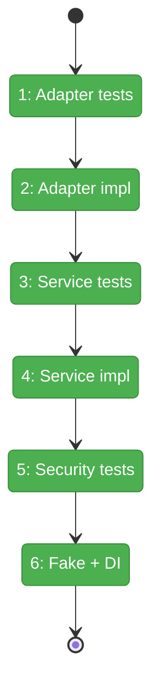
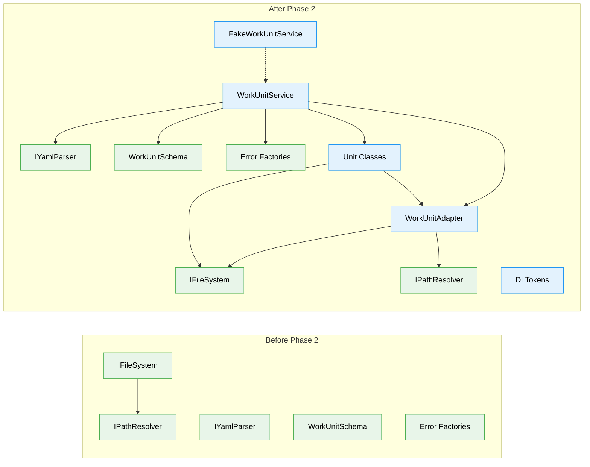

# Flight Plan: Phase 2 — Service and Adapter

**Plan**: [../../agentic-work-units-plan.md](../../agentic-work-units-plan.md)
**Phase**: Phase 2: Service and Adapter
**Generated**: 2026-02-04
**Status**: Landed

---

## Departure → Destination

**Where we are**: Phase 1 completed the type system foundation. We have discriminated union types (`AgenticWorkUnit`, `CodeUnit`, `UserInputUnit`), Zod schemas for validation, and error factory functions (E180-E187). Types compile, schemas validate, but there's no way to actually load units from disk or access their template content.

**Where we're going**: By the end of this phase, a developer can call `workUnitService.load(ctx, 'my-agent')` to get a rich `AgenticWorkUnit` instance, then `unit.getPrompt(ctx)` to retrieve prompt content. Each unit type has its own methods (`CodeUnit.getScript()`, etc). Path traversal attacks will be blocked with E184 errors. The `FakeWorkUnitService` will be ready for CLI integration tests in Phase 3.

---

## Flight Status

<!-- Updated by /plan-6: pending → active → done. Use blocked for problems/input needed. -->

**Legend**: grey = pending | yellow = active | red = blocked/needs input | green = done

---

## Stages

<!-- Updated by /plan-6 during implementation: [ ] → [~] → [x] -->

- [x] **Stage 1: Write adapter path resolution tests** — TDD RED for `getUnitDir()`, `getUnitYamlPath()`, `getTemplatePath()` (`workunit.adapter.test.ts` — new file)
- [x] **Stage 2: Implement WorkUnitAdapter** — extend `WorkspaceDataAdapterBase` with domain='units' (`workunit.adapter.ts` — new file)
- [x] **Stage 3: Write all service + unit class tests** — TDD RED for `list()`, `load()`, `validate()`, plus `AgenticWorkUnit.getPrompt()`, `CodeUnit.getScript()` including error cases E180-E185 (`workunit.service.test.ts` — new file)
- [x] **Stage 4: Implement WorkUnitService + unit classes** — load units via YAML, validate with Zod, return rich domain objects with type-specific methods (`workunit.service.ts`, `workunit-service.interface.ts`, `workunit.classes.ts` — new files)
- [x] **Stage 5: Write security tests** — verify E184 for `../` paths, absolute paths, slug-prefix attacks (`workunit.service.test.ts`)
- [x] **Stage 6: Create FakeWorkUnitService and DI tokens** — test fake for Phase 3/4, add tokens to shared package (`fake-workunit.service.ts` — new file, `di-tokens.ts` — modify)

---

## Acceptance Criteria

- [ ] AC-1: `load()` returns rich `AgenticWorkUnit` instance for `type: 'agent'` units
- [ ] AC-5: `UserInputUnit` has no template methods (compile-time safety, no E183 needed)
- [ ] AC-6: `WorkUnit` returned by `load()` satisfies `NarrowWorkUnit` structurally
- [ ] AC-7: Malformed unit.yaml returns E182 with descriptive Zod error message

---

## Goals & Non-Goals

**Goals**:
- Create `WorkUnitAdapter` extending `WorkspaceDataAdapterBase` (override `getDomainPath()` for `.chainglass/units/`)
- Implement `IWorkUnitService` with `list()`, `load()`, `validate()`
- Implement rich domain classes: `AgenticWorkUnit.getPrompt()/setPrompt()`, `CodeUnit.getScript()/setScript()`
- Path escape security: prevent template paths from escaping unit folder (E184)
- Create `FakeWorkUnitService` for Phase 3/4 testing
- Add DI tokens (`WORKUNIT_ADAPTER`, `WORKUNIT_SERVICE`) to shared package

**Non-Goals**:
- DI container registration (Phase 3)
- CLI integration or reserved parameter routing (Phase 3)
- E2E tests (Phase 4)
- On-disk unit files for E2E (Phase 5)
- Template variable substitution (agents handle this themselves)
- Caching of unit definitions or templates

---

## Architecture: Before & After

**Legend**: existing (green, unchanged) | changed (orange, modified) | new (blue, created)

---

## Checklist

- [x] T001: Write tests for WorkUnitAdapter path resolution (CS-2)
- [x] T002: Implement WorkUnitAdapter extending WorkspaceDataAdapterBase (CS-2)
- [x] T003: Write tests for WorkUnitService.list() (CS-2)
- [x] T004: Write tests for WorkUnitService.load() (CS-2)
- [x] T005: Write tests for WorkUnitService.validate() (CS-1)
- [x] T006: Write tests for unit class template methods (CS-2)
- [x] T007: Implement WorkUnitService + unit classes (CS-3)
- [x] T008: Write security tests for path escape prevention (CS-2)
- [x] T009: Create FakeWorkUnitService (CS-2)
- [x] T010: Add DI tokens to positional-graph-tokens (CS-1)
- [x] T011: Refactor and verify coverage (CS-2)

---

## PlanPak

Active — files organized under `features/029-agentic-work-units/`
