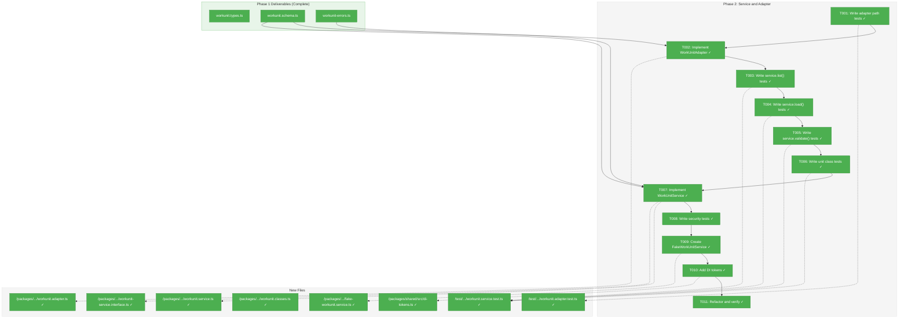
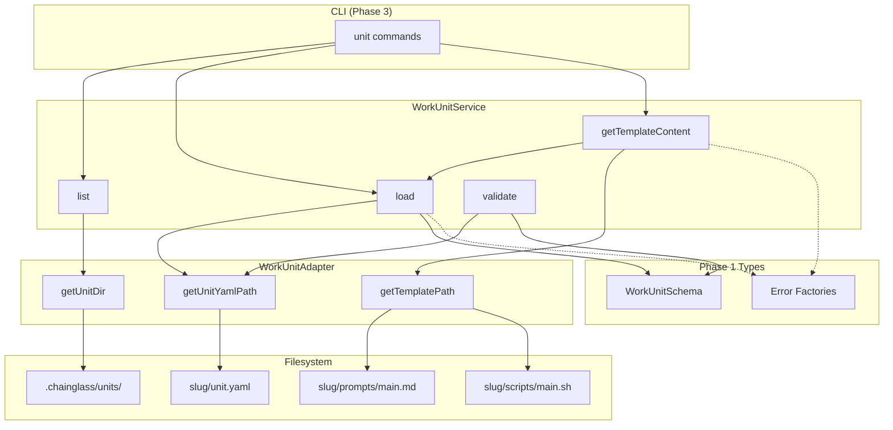
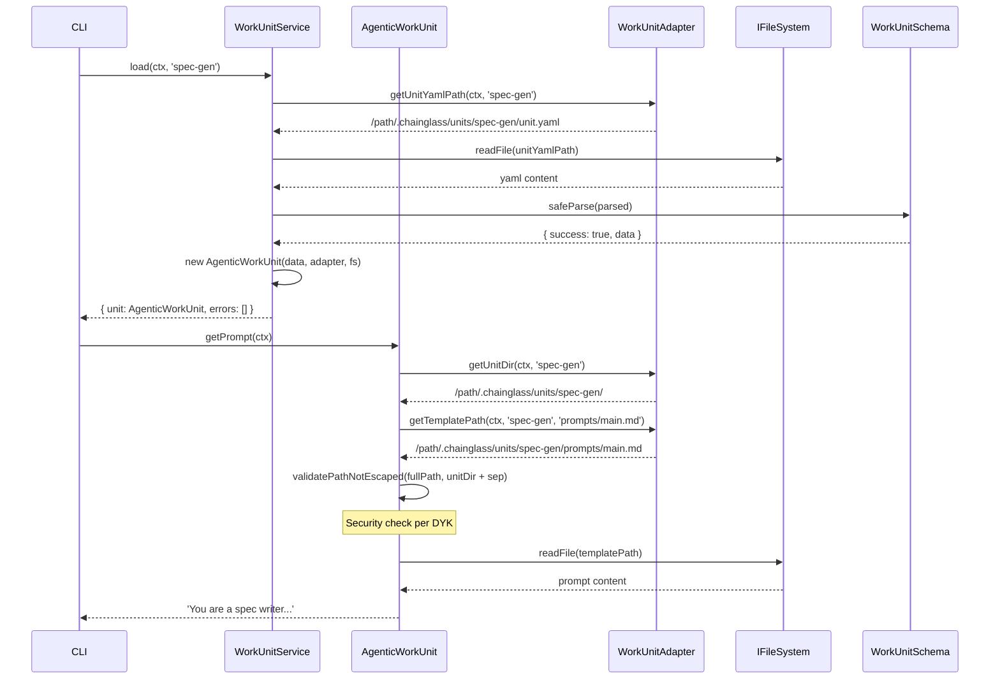

# Phase 2: Service and Adapter – Tasks & Alignment Brief

**Spec**: [../../agentic-work-units-spec.md](../../agentic-work-units-spec.md)
**Plan**: [../../agentic-work-units-plan.md](../../agentic-work-units-plan.md)
**Date**: 2026-02-04

---

## Executive Briefing

### Purpose
This phase implements the core WorkUnit loading infrastructure: a filesystem adapter for path resolution and a service that loads, validates, and provides template content access. This enables agents and code units to programmatically retrieve their prompt templates and scripts through a unified API.

### What We're Building
A `WorkUnitAdapter` and `WorkUnitService` that:
- Resolves paths to unit.yaml files and template content within `.chainglass/units/<slug>/`
- Loads and validates unit definitions against Zod schemas (from Phase 1)
- Provides template content access via `getTemplateContent()` with path escape security
- Creates a `FakeWorkUnitService` for testing downstream phases

### User Value
Agents can retrieve their prompt templates via a consistent API, enabling:
- Self-contained agent execution (agents access their own prompts)
- Type-safe unit loading with clear error messages
- Security against malicious path traversal in template references

### Example
**Load unit**: `workUnitService.load(ctx, 'spec-generator')` → `{ unit: AgenticWorkUnit, errors: [] }`
**Get prompt**: `unit.getPrompt(ctx)` → `'You are a spec writer...'` (type-specific method per DYK #6)
**Set prompt**: `unit.setPrompt(ctx, 'Updated prompt...')` → writes to `prompts/main.md`

---

## Objectives & Scope

### Objective
Implement `WorkUnitAdapter` and `WorkUnitService` as specified in the plan and workunit-loading workshop, with comprehensive security validation and test coverage.

### Goals

- ✅ Create `WorkUnitAdapter` extending `WorkspaceDataAdapterBase` with domain='units' (override `getDomainPath()` per DYK #1)
- ✅ Implement `IWorkUnitService` interface with `list()`, `load()`, `validate()`
- ✅ Implement rich domain classes: `AgenticWorkUnit.getPrompt()/setPrompt()`, `CodeUnit.getScript()/setScript()` (DYK #6)
- ✅ Path escape security: prevent template paths from escaping unit folder (E184) with trailing separator (DYK #3)
- ✅ Create `FakeWorkUnitService` for Phase 3/4 testing (returns fakes of real unit classes)
- ✅ Add DI tokens to shared package (`WORKUNIT_ADAPTER`, `WORKUNIT_SERVICE`)
- ✅ All error codes (E180-E185) exercised in tests

### Non-Goals

- ❌ DI container registration in positional-graph (Phase 3)
- ❌ CLI integration (Phase 3)
- ❌ Reserved parameter routing (Phase 3)
- ❌ E2E tests (Phase 4)
- ❌ On-disk unit files for E2E (Phase 5)
- ❌ Template variable substitution (agents handle this themselves)
- ❌ Caching of unit definitions or templates

---

## Pre-Implementation Audit

### Summary
| File | Action | Origin | Modified By | Recommendation |
|------|--------|--------|-------------|----------------|
| `/home/jak/substrate/029-agentic-work-units/packages/positional-graph/src/features/029-agentic-work-units/workunit.adapter.ts` | Create | New | — | keep-as-is |
| `/home/jak/substrate/029-agentic-work-units/packages/positional-graph/src/features/029-agentic-work-units/workunit.service.ts` | Create | New | — | keep-as-is |
| `/home/jak/substrate/029-agentic-work-units/packages/positional-graph/src/features/029-agentic-work-units/workunit-service.interface.ts` | Create | New | — | keep-as-is |
| `/home/jak/substrate/029-agentic-work-units/packages/positional-graph/src/features/029-agentic-work-units/fake-workunit.service.ts` | Create | New | — | keep-as-is |
| `/home/jak/substrate/029-agentic-work-units/packages/positional-graph/src/features/029-agentic-work-units/index.ts` | Modify | Phase 1 | Plan 029 | keep-as-is |
| `/home/jak/substrate/029-agentic-work-units/packages/shared/src/di-tokens.ts` | Modify | Pre-plan | Multiple plans | keep-as-is |
| `/home/jak/substrate/029-agentic-work-units/test/unit/positional-graph/features/029-agentic-work-units/workunit.adapter.test.ts` | Create | New | — | keep-as-is |
| `/home/jak/substrate/029-agentic-work-units/test/unit/positional-graph/features/029-agentic-work-units/workunit.service.test.ts` | Create | New | — | keep-as-is |

### Compliance Check
No violations found. Files follow PlanPak pattern (plan-scoped in `features/029-agentic-work-units/`).

---

## Requirements Traceability

### Coverage Matrix
| AC | Description | Flow Summary | Files in Flow | Tasks | Status |
|----|-------------|-------------|---------------|-------|--------|
| AC-1 | Discriminated union load | `load()` → schema parse → typed return | adapter.ts, service.ts, schema.ts | T001-T007 | ⬜ Pending |
| AC-6 | Backward compatibility | `load()` returns WorkUnit satisfying NarrowWorkUnit | service.ts, types.ts | T007 | ⬜ Pending |
| AC-7 | Zod schema validation | `load()` → `safeParse()` → E182 on failure | service.ts, schema.ts, errors.ts | T004 | ⬜ Pending |
| AC-5 | UserInputUnit no template | `getTemplateContent()` → E183 | service.ts, errors.ts | T006 | ⬜ Pending |

### Gaps Found
No gaps — all Phase 2 acceptance criteria have complete file coverage.

### Orphan Files
| File | Tasks | Assessment |
|------|-------|------------|
| `fake-workunit.service.ts` | T009 | Test infrastructure — enables Phase 3/4 testing |

---

## Architecture Map

### Component Diagram
<!-- Status: grey=pending, orange=in-progress, green=completed, red=blocked -->
<!-- Updated by plan-6 during implementation -->



### Task-to-Component Mapping

<!-- Status: ⬜ Pending | 🟧 In Progress | ✅ Complete | 🔴 Blocked -->

| Task | Component(s) | Files | Status | Comment |
|------|-------------|-------|--------|---------|
| T001 | Adapter Path Tests | workunit.adapter.test.ts | ✅ Complete | TDD RED: tests for getUnitDir, getUnitYamlPath, getTemplatePath |
| T002 | WorkUnitAdapter | workunit.adapter.ts | ✅ Complete | TDD GREEN: implement adapter extending WorkspaceDataAdapterBase |
| T003 | Service List Tests | workunit.service.test.ts | ✅ Complete | TDD RED: empty list, multiple units, error cases |
| T004 | Service Load Tests | workunit.service.test.ts | ✅ Complete | TDD RED: valid load, E180, E181, E182 |
| T005 | Service Validate Tests | workunit.service.test.ts | ✅ Complete | TDD RED: validation without full load |
| T006 | Unit Class Tests | workunit.service.test.ts | ✅ Complete | TDD RED: getPrompt, getScript, E184, E185 |
| T007 | WorkUnitService | workunit.service.ts, interface, classes | ✅ Complete | TDD GREEN: IWorkUnitService + rich domain classes implemented |
| T008 | Security Tests | workunit.service.test.ts | ✅ Complete | Path escape prevention: ../, absolute, slug-prefix attacks |
| T009 | FakeWorkUnitService | fake-workunit.service.ts | ✅ Complete | Test fake for Phase 3/4 with 20 tests |
| T010 | DI Tokens | di-tokens.ts | ✅ Complete | WORKUNIT_ADAPTER, WORKUNIT_SERVICE tokens |
| T011 | Refactor | All files | ✅ Complete | All 103 tests pass, just fft clean |

---

## Tasks

| Status | ID | Task | CS | Type | Dependencies | Absolute Path(s) | Validation | Subtasks | Notes |
|--------|------|--------------------------------------|-----|------|--------------|------------------|------------|----------|-------|
| [x] | T001 | Write tests for WorkUnitAdapter path resolution | 2 | Test | – | `/home/jak/substrate/029-agentic-work-units/test/unit/positional-graph/features/029-agentic-work-units/workunit.adapter.test.ts` | Tests cover: getUnitDir, getUnitYamlPath, getTemplatePath | – | TDD RED ✓ |
| [x] | T002 | Implement WorkUnitAdapter extending WorkspaceDataAdapterBase | 2 | Core | T001 | `/home/jak/substrate/029-agentic-work-units/packages/positional-graph/src/features/029-agentic-work-units/workunit.adapter.ts` | All adapter tests pass | – | TDD GREEN ✓, **Override getDomainPath()** per DYK #1 |
| [x] | T003 | Write tests for WorkUnitService.list() | 2 | Test | T002 | `/home/jak/substrate/029-agentic-work-units/test/unit/positional-graph/features/029-agentic-work-units/workunit.service.test.ts` | Tests cover: empty list, multiple units, **partial failure (skip invalid + report errors)** | – | TDD RED ✓, skip-and-warn per DYK #5 |
| [x] | T004 | Write tests for WorkUnitService.load() | 2 | Test | T002 | `/home/jak/substrate/029-agentic-work-units/test/unit/positional-graph/features/029-agentic-work-units/workunit.service.test.ts` | Tests cover: valid load (all 3 types), E180 (not found), E181 (parse error), E182 (schema error) | – | TDD RED ✓ |
| [x] | T005 | Write tests for WorkUnitService.validate() | 1 | Test | T002 | `/home/jak/substrate/029-agentic-work-units/test/unit/positional-graph/features/029-agentic-work-units/workunit.service.test.ts` | Tests verify validation without loading | – | TDD RED ✓ |
| [x] | T006 | Write tests for unit class template methods | 2 | Test | T002 | `/home/jak/substrate/029-agentic-work-units/test/unit/positional-graph/features/029-agentic-work-units/workunit.service.test.ts` | Tests cover: `AgenticWorkUnit.getPrompt()`, `CodeUnit.getScript()`, path escape (E184), not found (E185) | – | TDD RED ✓, Per Critical Discovery 02 + DYK #6 |
| [x] | T007 | Implement WorkUnitService + unit classes | 3 | Core | T003, T004, T005, T006 | `/home/jak/substrate/029-agentic-work-units/packages/positional-graph/src/features/029-agentic-work-units/workunit.service.ts`, `/home/jak/substrate/029-agentic-work-units/packages/positional-graph/src/features/029-agentic-work-units/workunit-service.interface.ts`, `/home/jak/substrate/029-agentic-work-units/packages/positional-graph/src/features/029-agentic-work-units/workunit.classes.ts` | All service + unit class tests pass | – | TDD GREEN ✓, rich domain objects per DYK #6 |
| [x] | T008 | Write security tests for path escape prevention | 2 | Test | T007 | `/home/jak/substrate/029-agentic-work-units/test/unit/positional-graph/features/029-agentic-work-units/workunit.service.test.ts` | Tests verify E184 for: `../` paths, absolute paths, symlinks, **slug-prefix attacks** | – | Security ✓, Per Critical Discovery 02 + DYK #3 |
| [x] | T009 | Create FakeWorkUnitService | 2 | Test | T007 | `/home/jak/substrate/029-agentic-work-units/packages/positional-graph/src/features/029-agentic-work-units/fake-workunit.service.ts` | Fake returns fake unit class instances with controllable state | – | Test infrastructure ✓, returns fakes of real unit classes per DYK #6 |
| [x] | T010 | Add DI tokens to positional-graph-tokens | 1 | Core | – | `/home/jak/substrate/029-agentic-work-units/packages/shared/src/di-tokens.ts` | `WORKUNIT_ADAPTER`, `WORKUNIT_SERVICE` tokens exported | – | Cross-cutting ✓ |
| [x] | T011 | Refactor and verify coverage | 2 | Refactor | T008, T009, T010 | All Phase 2 files | All tests pass, exports clean | – | TDD REFACTOR ✓ |

---

## Alignment Brief

### Prior Phases Review

#### Phase 1: Types and Schemas — Summary

**Deliverables Created**:
- `workunit.types.ts` — Compile-time assertions for NarrowWorkUnit structural compatibility
- `workunit.schema.ts` — Zod schemas (discriminated union on `type` field), `formatZodErrors()` helper
- `workunit-errors.ts` — Error factories E180-E187 following `ResultError` pattern
- `index.ts` — Feature barrel re-exporting all public symbols
- Cross-plan edit: `packages/positional-graph/src/index.ts` re-exports feature

**Dependencies Exported for Phase 2**:
- **Types**: `WorkUnit`, `AgenticWorkUnit`, `CodeUnit`, `UserInputUnit`, `WorkUnitInput`, `WorkUnitOutput`
- **Schemas**: `WorkUnitSchema`, `AgenticWorkUnitSchema`, `CodeUnitSchema`, `UserInputUnitSchema`
- **Errors**: `workunitNotFoundError`, `workunitYamlParseError`, `workunitSchemaValidationError`, `workunitNoTemplateError`, `workunitPathEscapeError`, `workunitTemplateNotFoundError`
- **Utilities**: `formatZodErrors(error: ZodError, slug: string): string[]`

**Key Architectural Patterns**:
1. **Schema-First**: Types derived via `z.infer<>`, not manually defined (ADR-0003)
2. **Discriminated Union**: `WorkUnitSchema = z.discriminatedUnion('type', [...])`
3. **Error Factory Pattern**: Each error code has dedicated factory returning `{ code, message, action }`
4. **Conditional Refine**: `data_type` optional at schema level, enforced via `.refine()` for `type='data'`

**Technical Discoveries**:
- Input names use underscores (`/^[a-z][a-z0-9_]*$/`), slugs use hyphens — critical for reserved param detection
- `NarrowWorkUnitInput` lacks `data_type` field — Phase 1 maintains compatibility via optional + refine

**Key Log References**:
- [T005](../phase-1-types-and-schemas/execution.log.md#T005): Zod schema design decisions
- [T007](../phase-1-types-and-schemas/execution.log.md#T007): Error factory pattern

### Critical Findings Affecting This Phase

**🚨 Critical Discovery 02: Path Escape Security Vulnerability**
- **Constraint**: Template paths like `../../../.env` could leak sensitive data
- **Requirement**: Implement path containment check in `getTemplateContent()`
- **Solution**: Verify `fullPath.startsWith(unitDir + pathResolver.sep)`
- **Addressed by**: T006, T007, T008

**🚨 Critical Discovery 01: Structural Compatibility**
- **Constraint**: `WorkUnit` must structurally satisfy `NarrowWorkUnit`
- **Requirement**: Service's `load()` return type compatible with `IWorkUnitLoader`
- **Addressed by**: T007 (interface design)

### ADR Decision Constraints

**ADR-0003: Configuration System (Zod)**
- Constraint: Use Zod for all schema validation
- Addressed by: T004, T007 — `WorkUnitSchema.safeParse()` in `load()`

**ADR-0004: Dependency Injection Container Architecture**
- Constraint: DI tokens in shared package, `useFactory` pattern
- Addressed by: T010 — tokens in `di-tokens.ts`

**ADR-0008: Workspace Split Storage Data Model**
- Constraint: Unit files in `.chainglass/units/<slug>/`
- Addressed by: T001, T002 — adapter domain path

**ADR-0009: Module Registration Function Pattern**
- Constraint: Services registered via module function
- Addressed by: Phase 3 (container registration) — tokens prepared in T010

### PlanPak Placement Rules

- **Plan-scoped files**: `packages/positional-graph/src/features/029-agentic-work-units/` — adapter, service, interface, fake
- **Cross-cutting files**: `packages/shared/src/di-tokens.ts` — DI tokens
- **Test location**: `test/unit/positional-graph/features/029-agentic-work-units/` — per project conventions

### Invariants & Guardrails

- **Path Security**: All template paths MUST be validated to not escape unit folder
- **Error Consistency**: All errors MUST use factories from `workunit-errors.ts`
- **Structural Compatibility**: Service return types MUST satisfy `IWorkUnitLoader` interface
- **Storage Path (DYK #1)**: WorkUnits live at `.chainglass/units/<slug>/`, NOT `.chainglass/data/units/`. Override `getDomainPath()` in WorkUnitAdapter to return `pathResolver.join(ctx.worktreePath, '.chainglass', 'units')`
- **Path Escape Check (DYK #3)**: Use `fullPath.startsWith(unitDir + pathResolver.sep)` NOT just `fullPath.startsWith(unitDir)`. The latter is vulnerable to prefix attacks (e.g., `my-agent-evil/../../secrets` passes if unitDir is `my-agent`)
- **list() Partial Failure (DYK #5)**: `list()` must read every unit.yaml to get type/version. Use skip-and-warn: return valid units + errors array for malformed ones. Don't fail entirely on one bad unit.
- **Rich Domain Objects (DYK #6)**: `load()` returns unit classes (not plain data). `AgenticWorkUnit.getPrompt(ctx)`, `CodeUnit.getScript(ctx)` — no generic `getTemplateContent()` on service. `UserInputUnit` has no template methods.

### Inputs to Read

| File | Purpose |
|------|---------|
| `packages/workflow/src/adapters/workspace-data-adapter-base.ts` | Base class pattern |
| `packages/positional-graph/src/adapter/positional-graph.adapter.ts` | Adapter example |
| `packages/positional-graph/src/features/029-agentic-work-units/workunit.schema.ts` | Zod schemas |
| `packages/positional-graph/src/features/029-agentic-work-units/workunit-errors.ts` | Error factories |
| `packages/shared/src/fakes/fake-filesystem.ts` | FakeFileSystem usage |
| `docs/plans/029-agentic-work-units/workshops/workunit-loading.md` | Detailed design |

### Visual Alignment Aids

#### System Flow Diagram



#### Sequence Diagram: AgenticWorkUnit.getPrompt() (DYK #6)



### Test Plan (Full TDD — Fakes Only)

| Test File | Test | Rationale | Fixtures | Expected Output |
|-----------|------|-----------|----------|-----------------|
| workunit.adapter.test.ts | getUnitDir returns correct path | Verify domain='units' resolution | FakePathResolver | `.chainglass/units/<slug>/` |
| workunit.adapter.test.ts | getUnitYamlPath appends unit.yaml | Verify file path construction | FakePathResolver | `<unitDir>/unit.yaml` |
| workunit.adapter.test.ts | getTemplatePath joins relative path | Verify template path construction | FakePathResolver | `<unitDir>/<relativePath>` |
| workunit.service.test.ts | list returns empty array when no units | Handle empty domain directory | FakeFileSystem (empty) | `{ units: [], errors: [] }` |
| workunit.service.test.ts | list returns all unit slugs with types | Enumerate all units | FakeFileSystem (3 units) | `{ units: [...], errors: [] }` |
| workunit.service.test.ts | list skips invalid units and reports errors | Partial failure (DYK #5) | FakeFileSystem (2 valid + 1 malformed) | `{ units: [2 valid], errors: [E182 for bad one] }` |
| workunit.service.test.ts | load returns AgenticWorkUnit for type=agent | Type discrimination works | FakeFileSystem, FakeYamlParser | `{ unit: AgenticWorkUnit, errors: [] }` |
| workunit.service.test.ts | load returns CodeUnit for type=code | Type discrimination works | FakeFileSystem, FakeYamlParser | `{ unit: CodeUnit, errors: [] }` |
| workunit.service.test.ts | load returns UserInputUnit for type=user-input | Type discrimination works | FakeFileSystem, FakeYamlParser | `{ unit: UserInputUnit, errors: [] }` |
| workunit.service.test.ts | load returns E180 for missing unit | Error handling: not found | FakeFileSystem (no file) | `{ errors: [E180] }` |
| workunit.service.test.ts | load returns E181 for YAML parse error | Error handling: parse error | FakeFileSystem (bad yaml) | `{ errors: [E181] }` |
| workunit.service.test.ts | load returns E182 for schema validation error | Error handling: schema error | FakeFileSystem, FakeYamlParser | `{ errors: [E182] }` |
| workunit.service.test.ts | validate returns valid=true for good unit | Validation without full load | FakeFileSystem, FakeYamlParser | `{ valid: true, errors: [] }` |
| workunit.service.test.ts | validate returns valid=false for bad unit | Validation catches errors | FakeFileSystem (invalid) | `{ valid: false, errors: [E182] }` |
| workunit.service.test.ts | AgenticWorkUnit.getPrompt() returns prompt content | Type-specific template access (DYK #6) | FakeFileSystem (agent + template) | `'You are a spec writer...'` |
| workunit.service.test.ts | AgenticWorkUnit.setPrompt() writes prompt content | Type-specific template write (DYK #6) | FakeFileSystem | File written successfully |
| workunit.service.test.ts | CodeUnit.getScript() returns script content | Type-specific template access (DYK #6) | FakeFileSystem (code + script) | `'#!/bin/bash\n...'` |
| workunit.service.test.ts | CodeUnit.setScript() writes script content | Type-specific template write (DYK #6) | FakeFileSystem | File written successfully |
| workunit.service.test.ts | UserInputUnit has no template methods | No template for user-input (DYK #6) | — | Compile-time: no getPrompt/getScript methods |
| workunit.service.test.ts | getPrompt() returns E184 for path escape | Security: ../ blocked | FakeFileSystem (malicious path) | throws E184 |
| workunit.service.test.ts | getPrompt() returns E185 for missing template | Template file not found | FakeFileSystem (no template file) | throws E185 |
| workunit.service.test.ts | getPrompt() returns E184 for absolute path | Security: absolute blocked | FakeFileSystem (abs path in unit) | throws E184 |
| workunit.service.test.ts | getPrompt() returns E184 for slug-prefix attack | Security: `my-agent-evil/../` blocked (DYK #3) | FakeFileSystem (prefix attack path) | throws E184 |

### Implementation Outline

1. **T001**: Create `workunit.adapter.test.ts` with tests for path methods
2. **T002**: Implement `WorkUnitAdapter` — `domain='units'`, path methods
3. **T003**: Add `list()` tests to `workunit.service.test.ts`
4. **T004**: Add `load()` tests covering all 3 types + error cases
5. **T005**: Add `validate()` tests
6. **T006**: Add `getTemplateContent()` tests including security cases
7. **T007**: Create `workunit-service.interface.ts` and implement `workunit.service.ts`
8. **T008**: Add dedicated security tests for path escape prevention
9. **T009**: Create `fake-workunit.service.ts` implementing `IWorkUnitService`
10. **T010**: Add `WORKUNIT_ADAPTER`, `WORKUNIT_SERVICE` to `POSITIONAL_GRAPH_DI_TOKENS`
11. **T011**: Update feature barrel, verify all exports, check coverage

### Commands to Run

```bash
# Run Phase 2 adapter tests
pnpm test test/unit/positional-graph/features/029-agentic-work-units/workunit.adapter.test.ts

# Run Phase 2 service tests
pnpm test test/unit/positional-graph/features/029-agentic-work-units/workunit.service.test.ts

# Run all Phase 2 tests
pnpm test test/unit/positional-graph/features/029-agentic-work-units/

# Verify TypeScript compiles
pnpm typecheck

# Run lint
pnpm lint

# Full quality check
just fft

# Check test coverage (optional)
pnpm test test/unit/positional-graph/features/029-agentic-work-units/ --coverage
```

### Risks & Unknowns

| Risk | Likelihood | Impact | Mitigation |
|------|------------|--------|------------|
| Path escape vulnerability | Medium | High | Comprehensive security tests, explicit validation |
| Template file not found | Low | Medium | E185 error with actionable message |
| FakeYamlParser behavior mismatch | Low | Low | Use existing FakeYamlParser from @chainglass/workflow |

### Ready Check

- [ ] Phase 1 deliverables confirmed available (types, schemas, errors)
- [ ] FakeFileSystem and FakeYamlParser understood
- [ ] WorkspaceDataAdapterBase pattern understood
- [ ] Path escape security strategy defined (Critical Discovery 02)
- [ ] DI token naming convention verified (ADR-0004)
- [ ] ADR constraints mapped to tasks (ADR-0003, ADR-0004, ADR-0008 noted)

---

## Phase Footnote Stubs

[^5]: Phase 2 T001-T002 - WorkUnitAdapter implementation
  - `class:packages/positional-graph/src/features/029-agentic-work-units/workunit.adapter.ts:WorkUnitAdapter`
  - `method:packages/positional-graph/src/features/029-agentic-work-units/workunit.adapter.ts:WorkUnitAdapter.getUnitDir`
  - `method:packages/positional-graph/src/features/029-agentic-work-units/workunit.adapter.ts:WorkUnitAdapter.getUnitYamlPath`
  - `method:packages/positional-graph/src/features/029-agentic-work-units/workunit.adapter.ts:WorkUnitAdapter.getTemplatePath`
  - `method:packages/positional-graph/src/features/029-agentic-work-units/workunit.adapter.ts:WorkUnitAdapter.listUnitSlugs`
  - `method:packages/positional-graph/src/features/029-agentic-work-units/workunit.adapter.ts:WorkUnitAdapter.unitExists`
  - `method:packages/positional-graph/src/features/029-agentic-work-units/workunit.adapter.ts:WorkUnitAdapter.validateSlug`
  - `file:test/unit/positional-graph/features/029-agentic-work-units/workunit.adapter.test.ts`

[^6]: Phase 2 T003-T007 - WorkUnitService and domain classes
  - `class:packages/positional-graph/src/features/029-agentic-work-units/workunit.service.ts:WorkUnitService`
  - `method:packages/positional-graph/src/features/029-agentic-work-units/workunit.service.ts:WorkUnitService.list`
  - `method:packages/positional-graph/src/features/029-agentic-work-units/workunit.service.ts:WorkUnitService.load`
  - `method:packages/positional-graph/src/features/029-agentic-work-units/workunit.service.ts:WorkUnitService.validate`
  - `file:packages/positional-graph/src/features/029-agentic-work-units/workunit-service.interface.ts`
  - `file:packages/positional-graph/src/features/029-agentic-work-units/workunit.classes.ts`
  - `function:packages/positional-graph/src/features/029-agentic-work-units/workunit.classes.ts:createAgenticWorkUnitInstance`
  - `function:packages/positional-graph/src/features/029-agentic-work-units/workunit.classes.ts:createCodeUnitInstance`
  - `function:packages/positional-graph/src/features/029-agentic-work-units/workunit.classes.ts:createUserInputUnitInstance`
  - `function:packages/positional-graph/src/features/029-agentic-work-units/workunit.classes.ts:validatePathContainment`
  - `file:test/unit/positional-graph/features/029-agentic-work-units/workunit.service.test.ts`

[^7]: Phase 2 T008-T009 - Security tests and FakeWorkUnitService
  - `class:packages/positional-graph/src/features/029-agentic-work-units/fake-workunit.service.ts:FakeWorkUnitService`
  - `file:test/unit/positional-graph/features/029-agentic-work-units/fake-workunit.service.test.ts`

[^8]: Phase 2 T010-T011 - DI tokens and integration
  - `file:packages/shared/src/di-tokens.ts` (added WORKUNIT_ADAPTER, WORKUNIT_SERVICE)
  - `file:packages/positional-graph/src/features/029-agentic-work-units/index.ts` (updated exports)

---

## Evidence Artifacts

**Execution Log**: `./execution.log.md`
**Test Output**: Captured in execution log during implementation

---

## Discoveries & Learnings

_Populated during implementation by plan-6. Log anything of interest to your future self._

| Date | Task | Type | Discovery | Resolution | References |
|------|------|------|-----------|------------|------------|
| 2026-02-04 | T002 | gotcha | WorkspaceDataAdapterBase uses `.chainglass/data/<domain>/` but spec requires `.chainglass/units/` | Override `getDomainPath()` to return `.chainglass/units/` instead | DYK #1, workshop:workunit-loading.md |
| 2026-02-04 | T008 | gotcha | `startsWith(unitDir)` vulnerable to prefix attacks (`my-agent-evil/../`) | Use `startsWith(unitDir + sep)` with trailing separator | DYK #3, security |
| 2026-02-04 | T009 | decision | FakeWorkUnitService needs controllable template content for Phase 3/4 tests | Add `addUnit(unit)` and `setTemplateContent(slug, content)` methods | DYK #4 |
| 2026-02-04 | T003 | decision | `list()` reads every unit.yaml; what if one is malformed? | Skip-and-warn: return valid units + errors for invalid ones | DYK #5 |
| 2026-02-04 | T006/T007 | decision | `getTemplateContent()` is leaky abstraction — callers know the type | Remove from service; add `getPrompt()`/`setPrompt()` to AgenticWorkUnit, `getScript()`/`setScript()` to CodeUnit | DYK #6 |

**Types**: `gotcha` | `research-needed` | `unexpected-behavior` | `workaround` | `decision` | `debt` | `insight`

**What to log**:
- Things that didn't work as expected
- External research that was required
- Implementation troubles and how they were resolved
- Gotchas and edge cases discovered
- Decisions made during implementation
- Technical debt introduced (and why)
- Insights that future phases should know about

_See also: `execution.log.md` for detailed narrative._

---

## Directory Layout

```
docs/plans/029-agentic-work-units/
├── agentic-work-units-plan.md
├── agentic-work-units-spec.md
├── workshops/
│   ├── workunit-loading.md
│   └── e2e-test-enrichment.md
└── tasks/
    ├── phase-1-types-and-schemas/
    │   ├── tasks.md
    │   └── execution.log.md
    └── phase-2-service-and-adapter/
        ├── tasks.md              # This file
        ├── tasks.fltplan.md      # Generated by /plan-5b
        └── execution.log.md      # Created by /plan-6
```
