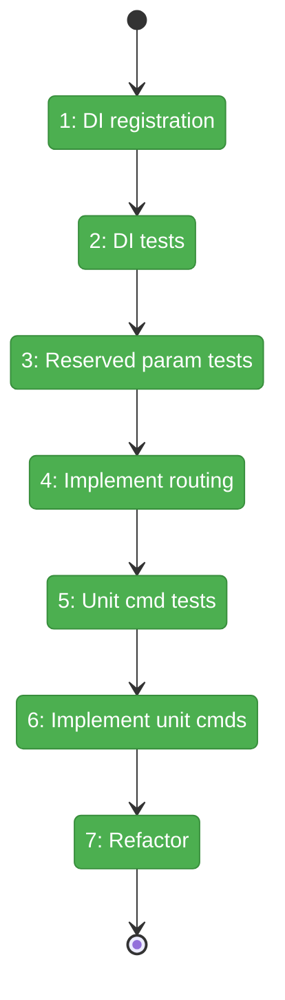
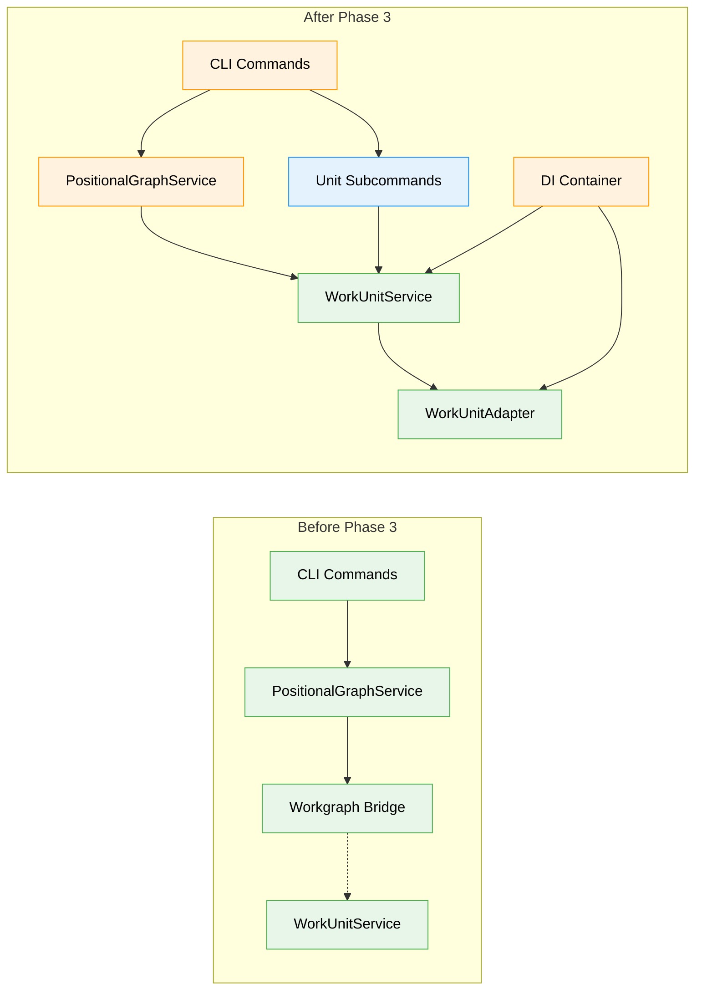

# Flight Plan: Phase 3 — CLI Integration

**Plan**: [../../agentic-work-units-plan.md](../../agentic-work-units-plan.md)
**Phase**: Phase 3: CLI Integration
**Generated**: 2026-02-04
**Status**: Landed

---

## Departure → Destination

**Where we are**: Phases 1-2 completed the type system foundation and service layer. We have discriminated union types (`AgenticWorkUnit`, `CodeUnit`, `UserInputUnit`), Zod schemas, error factories (E180-E187), `WorkUnitService` with `list()`, `load()`, `validate()`, and rich domain objects with `getPrompt()` and `getScript()` methods. The infrastructure exists but has no user-facing access point — the CLI doesn't know about reserved parameters yet.

**Where we're going**: By the end of this phase, a running agent can call `cg wf node get-input-data <graph> <node> main-prompt` to retrieve its prompt template content. The CLI will detect reserved parameters (`main-prompt`, `main-script`), route them to `IWorkUnitService`, and return template content. Type mismatches (e.g., `main-prompt` on CodeUnit) will return E186 errors. The DI container will wire `IWorkUnitLoader` to the new `WorkUnitService`, and new `cg wf unit` subcommands will enable unit inspection.

---

## Flight Status

<!-- Updated by /plan-6: pending → active → done. Use blocked for problems/input needed. -->

**Legend**: grey = pending | yellow = active | red = blocked/needs input | green = done

---

## Stages

<!-- Updated by /plan-6 during implementation: [ ] → [~] → [x] -->

- [x] **Stage 1: Register WorkUnit services in DI container** — add WorkUnitAdapter and WorkUnitService to positional-graph container, wire IWorkUnitLoader to WorkUnitService (`packages/positional-graph/src/container.ts`, `apps/cli/src/lib/container.ts`)
- [x] **Stage 2: Write DI resolution tests** — verify IWorkUnitService and IWorkUnitLoader resolve correctly (`test/unit/positional-graph/container.test.ts` — new file)
- [x] **Stage 3: Write reserved parameter tests** — TDD RED for main-prompt routing, main-script routing, E186 type mismatch (`test/unit/cli/positional-graph-command.test.ts` — new file)
- [x] **Stage 4: Implement reserved parameter routing** — add detection and routing logic to handleNodeGetInputData (`apps/cli/src/commands/positional-graph.command.ts`)
- [x] **Stage 5: Write unit subcommand tests** — TDD RED for list, info, get-template commands (`test/unit/cli/positional-graph-command.test.ts`)
- [x] **Stage 6: Implement unit subcommands** — add cg wf unit list/info/get-template commands (`apps/cli/src/commands/positional-graph.command.ts`)
- [x] **Stage 7: Refactor CLI structure** — clean up, verify all tests pass

---

## Acceptance Criteria

- [x] AC-2: `cg wf node get-input-data <graph> <node> main-prompt` returns prompt template content for AgenticWorkUnit
- [x] AC-3: `cg wf node get-input-data <graph> <node> main-script` returns script file content for CodeUnit
- [x] AC-4: `cg wf node get-input-data <graph> <code-node> main-prompt` returns E186 (UnitTypeMismatch) error

---

## Goals & Non-Goals

**Goals**:
- Add reserved parameter detection (`main-prompt`, `main-script`) in `get-input-data` command
- Route reserved parameters to `IWorkUnitService` template content methods
- Return E186 error for type mismatch (e.g., `main-prompt` on CodeUnit)
- Register `WorkUnitService` and `WorkUnitAdapter` in DI container
- Wire `IWorkUnitLoader` to new `WorkUnitService` (replacing workgraph bridge internally)
- Add `cg wf unit list`, `cg wf unit info`, `cg wf unit get-template` subcommands

**Non-Goals**:
- Remove workgraph bridge completely (Phase 5)
- Create on-disk unit YAML files (Phase 5)
- E2E test sections 13-15 (Phase 4)
- Template variable substitution (agents handle this themselves)
- Caching of unit definitions or templates

---

## Architecture: Before & After

**Legend**: existing (green, unchanged) | changed (orange, modified) | new (blue, created)

---

## Checklist

- [x] T001: Write tests for reserved parameter detection (CS-2)
- [x] T002: Write tests for type mismatch error E186 (CS-1)
- [x] T003: Implement reserved parameter routing (CS-2)
- [x] T004: Write tests for `cg wf unit list` command (CS-1)
- [x] T005: Write tests for `cg wf unit info` command (CS-1)
- [x] T006: Write tests for `cg wf unit get-template` command (CS-1)
- [x] T007: Implement unit subcommands (CS-2)
- [x] T008: Add DI registration to positional-graph container.ts (CS-1)
- [x] T009: Write DI resolution tests (CS-1)
- [x] T010: Refactor CLI command structure (CS-1)

---

## PlanPak

Active — files organized under `features/029-agentic-work-units/`
