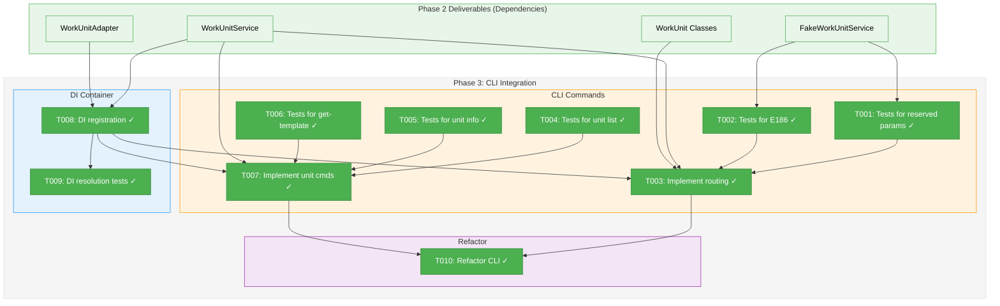
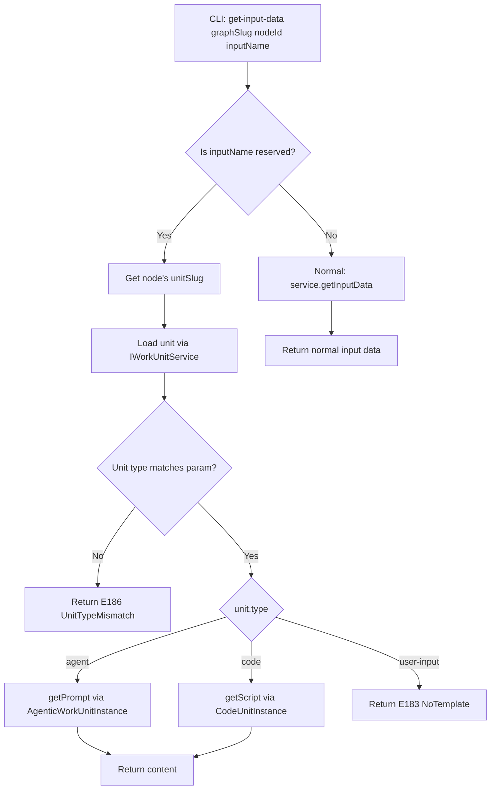
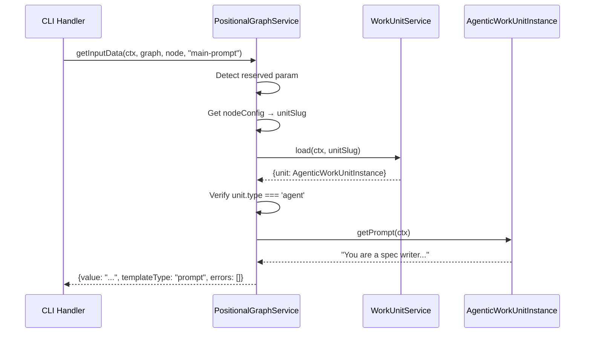

# Phase 3: CLI Integration — Tasks & Alignment Brief

**Spec**: [../../agentic-work-units-spec.md](../../agentic-work-units-spec.md)
**Plan**: [../../agentic-work-units-plan.md](../../agentic-work-units-plan.md)
**Date**: 2026-02-04

---

## Executive Briefing

### Purpose

This phase integrates the WorkUnit infrastructure (built in Phases 1-2) into the CLI, enabling agents to programmatically access their prompt templates via reserved parameters. Without this integration, the type system and service layer exist but have no user-facing access point.

### What We're Building

Reserved parameter routing in the `cg wf node get-input-data` command that:
- Detects `main-prompt` and `main-script` as special input names
- Routes these to `IWorkUnitService` instead of normal input resolution
- Returns template file content (prompt text or script code)
- Returns E186 error on type mismatch (e.g., `main-prompt` on CodeUnit)

Additionally:
- DI container registration for `WorkUnitService` and `WorkUnitAdapter`
- Transition from workgraph bridge to positional-graph's native `IWorkUnitService`
- New `cg wf unit` subcommands for unit inspection

### User Value

Running agents can retrieve their prompt templates via CLI:
```bash
cg wf node get-input-data my-graph agent-node main-prompt
# Returns: "You are a specification writer..."
```

This enables agentic workflows where agents fetch their own prompts programmatically.

### Example

**Request**: `cg wf node get-input-data sample-graph spec-node main-prompt`

**Response** (console):
```
You are a specification writer.

Given the following requirements:
{{requirements}}

Generate a detailed specification...
```

**Response** (JSON with `--json`):
```json
{
  "value": "You are a specification writer...",
  "path": "/home/user/project/.chainglass/units/spec-generator/prompts/main.md",
  "templateType": "prompt",
  "errors": []
}
```

---

## Objectives & Scope

### Objective

Implement reserved parameter routing and DI container integration per plan acceptance criteria AC-2 through AC-4.

### Goals

- ✅ Add reserved parameter detection (`main-prompt`, `main-script`) in `get-input-data` command
- ✅ Route reserved parameters to `IWorkUnitService.getTemplateContent()`
- ✅ Return E186 error for type mismatch (e.g., `main-prompt` on CodeUnit)
- ✅ Register `WorkUnitService` and `WorkUnitAdapter` in DI container
- ✅ Wire `IWorkUnitLoader` to new `WorkUnitService` (replacing workgraph bridge)
- ✅ Add `cg wf unit list`, `cg wf unit info`, `cg wf unit get-template` subcommands

### Non-Goals

- ❌ Remove workgraph bridge completely (Phase 5)
- ❌ Create on-disk unit YAML files (Phase 5)
- ❌ E2E test sections 13-15 (Phase 4)
- ❌ Template variable substitution (agents handle this)
- ❌ Caching of unit definitions or templates

---

## Pre-Implementation Audit

### Summary

| File | Action | Origin | Modified By | Recommendation |
|------|--------|--------|-------------|----------------|
| `/home/jak/substrate/029-agentic-work-units/apps/cli/src/commands/positional-graph.command.ts` | Modify | Plan 026 | Plan 028, 029 | cross-plan-edit |
| `/home/jak/substrate/029-agentic-work-units/apps/cli/src/lib/container.ts` | Modify | Plan 014 | Plan 029 | update DI |
| `/home/jak/substrate/029-agentic-work-units/packages/positional-graph/src/container.ts` | Modify | Plan 026 | Plan 029 | add registrations |
| `/home/jak/substrate/029-agentic-work-units/test/unit/cli/positional-graph-command.test.ts` | Create | — | Phase 3 | new file |
| `/home/jak/substrate/029-agentic-work-units/test/unit/positional-graph/container.test.ts` | Create | — | Phase 3 | new file |

### Compliance Check

No violations found. All files follow ADR-0004 (DI container), ADR-0006 (CLI commands), ADR-0009 (Module registration).

### Critical Finding: DI Bridge Update Required

The CLI container (`apps/cli/src/lib/container.ts` lines 213-215) currently bridges `IWorkUnitLoader` to the legacy workgraph service:
```typescript
childContainer.register<IWorkUnitLoader>(POSITIONAL_GRAPH_DI_TOKENS.WORK_UNIT_LOADER, {
  useFactory: (c) => c.resolve<IWorkUnitLoader>(WORKGRAPH_DI_TOKENS.WORKUNIT_SERVICE),
});
```

**Action**: Update to resolve from positional-graph's `WorkUnitService` instead. This is the key integration point for Phase 3.

---

## Requirements Traceability

### Coverage Matrix

| AC | Description | Flow Summary | Files in Flow | Tasks | Status |
|----|-------------|--------------|---------------|-------|--------|
| AC-2 | Reserved Parameter Routing (Agent) | CLI → getInputData → detect main-prompt → getTemplateContent → return prompt | 5 | T001-T003, T008 | ⬜ Pending |
| AC-3 | Reserved Parameter Routing (Code) | CLI → getInputData → detect main-script → getTemplateContent → return script | 5 | T001-T003, T008 | ⬜ Pending |
| AC-4 | Reserved Parameter Type Mismatch | CLI → detect reserved → load unit → check type → return E186 | 5 | T002, T003 | ⬜ Pending |

### Gaps Found

None — all acceptance criteria have complete file coverage after task table expansion.

### Orphan Files

| File | Tasks | Assessment |
|------|-------|------------|
| `test/unit/positional-graph/container.test.ts` | T009 | Test infrastructure — verifies DI wiring |

---

## Architecture Map

### Component Diagram

<!-- Status: grey=pending, orange=in-progress, green=completed, red=blocked -->
<!-- Updated by plan-6 during implementation -->



### Task-to-Component Mapping

<!-- Status: ⬜ Pending | 🟧 In Progress | ✅ Complete | 🔴 Blocked -->

| Task | Component(s) | Files | Status | Comment |
|------|-------------|-------|--------|---------|
| T001 | CLI Tests | `test/unit/cli/positional-graph-command.test.ts` | ✅ Complete | TDD RED: reserved param detection tests |
| T002 | CLI Tests | `test/unit/cli/positional-graph-command.test.ts` | ✅ Complete | TDD RED: E186 type mismatch tests |
| T003 | CLI Command | `apps/cli/src/commands/positional-graph.command.ts` | ✅ Complete | TDD GREEN: implement routing |
| T004 | CLI Tests | `test/unit/cli/positional-graph-command.test.ts` | ✅ Complete | TDD RED: unit list tests |
| T005 | CLI Tests | `test/unit/cli/positional-graph-command.test.ts` | ✅ Complete | TDD RED: unit info tests |
| T006 | CLI Tests | `test/unit/cli/positional-graph-command.test.ts` | ✅ Complete | TDD RED: get-template tests |
| T007 | CLI Commands | `apps/cli/src/commands/positional-graph.command.ts` | ✅ Complete | TDD GREEN: unit subcommands |
| T008 | DI Container | `packages/positional-graph/src/container.ts`, `apps/cli/src/lib/container.ts` | ✅ Complete | Register WorkUnit services |
| T009 | DI Tests | `test/unit/positional-graph/container.test.ts` | ✅ Complete | Verify DI resolution |
| T010 | CLI Refactor | `apps/cli/src/commands/positional-graph.command.ts` | ✅ Complete | TDD REFACTOR |

---

## Tasks

| Status | ID | Task | CS | Type | Dependencies | Absolute Path(s) | Validation | Subtasks | Notes |
|--------|-----|------|----|------|--------------|------------------|------------|----------|-------|
| [x] | T001 | Write tests for reserved parameter detection | 2 | Test | – | `/home/jak/substrate/029-agentic-work-units/test/unit/cli/positional-graph-command.test.ts` | Tests cover main-prompt routing, main-script routing, non-reserved passthrough | – | TDD RED [^9] |
| [x] | T002 | Write tests for type mismatch error (E186) | 1 | Test | T001 | `/home/jak/substrate/029-agentic-work-units/test/unit/cli/positional-graph-command.test.ts` | Tests verify E186 when main-prompt used on CodeUnit, main-script on AgenticWorkUnit | – | TDD RED [^9] |
| [x] | T003 | Implement reserved parameter routing | 2 | Core | T001, T002, T008 | `/home/jak/substrate/029-agentic-work-units/apps/cli/src/commands/positional-graph.command.ts` | Reserved param tests pass; main-prompt returns prompt content, main-script returns script | – | TDD GREEN, per Critical Disc 04 [^9] |
| [x] | T004 | Write tests for `cg wf unit list` command | 1 | Test | – | `/home/jak/substrate/029-agentic-work-units/test/unit/cli/positional-graph-command.test.ts` | Tests verify unit listing output format | – | TDD RED [^10] |
| [x] | T005 | Write tests for `cg wf unit info` command | 1 | Test | T004 | `/home/jak/substrate/029-agentic-work-units/test/unit/cli/positional-graph-command.test.ts` | Tests verify full unit info with type field | – | TDD RED [^10] |
| [x] | T006 | Write tests for `cg wf unit get-template` command | 1 | Test | T005 | `/home/jak/substrate/029-agentic-work-units/test/unit/cli/positional-graph-command.test.ts` | Tests verify template content output, E183 for user-input | – | TDD RED [^10] |
| [x] | T007 | Implement unit subcommands (list, info, get-template) | 2 | Core | T004, T005, T006, T008 | `/home/jak/substrate/029-agentic-work-units/apps/cli/src/commands/positional-graph.command.ts` | All unit command tests pass | – | TDD GREEN [^10] |
| [x] | T008 | Add DI registration to positional-graph container.ts | 1 | Setup | – | `/home/jak/substrate/029-agentic-work-units/packages/positional-graph/src/container.ts`, `/home/jak/substrate/029-agentic-work-units/apps/cli/src/lib/container.ts` | WorkUnitAdapter, WorkUnitService registered; IWorkUnitLoader wired to WorkUnitService | – | cross-cutting, per Critical Disc 03 |
| [x] | T009 | Write DI resolution tests | 1 | Test | T008 | `/home/jak/substrate/029-agentic-work-units/test/unit/positional-graph/container.test.ts` | Both IWorkUnitService and IWorkUnitLoader resolve correctly | – | Integration |
| [x] | T010 | Refactor CLI command structure | 1 | Refactor | T003, T007 | `/home/jak/substrate/029-agentic-work-units/apps/cli/src/commands/positional-graph.command.ts` | Commands follow existing patterns, all tests pass | – | TDD REFACTOR [^11] |

---

## Alignment Brief

### Prior Phases Review

#### Phase 1: Types and Schemas (Complete)

**Deliverables Created**:
- `/home/jak/substrate/029-agentic-work-units/packages/positional-graph/src/features/029-agentic-work-units/workunit.types.ts` — Compile-time compatibility assertions
- `/home/jak/substrate/029-agentic-work-units/packages/positional-graph/src/features/029-agentic-work-units/workunit.schema.ts` — Zod schemas, source of truth for types via `z.infer<>`
- `/home/jak/substrate/029-agentic-work-units/packages/positional-graph/src/features/029-agentic-work-units/workunit-errors.ts` — Error factories E180-E187
- `/home/jak/substrate/029-agentic-work-units/packages/positional-graph/src/features/029-agentic-work-units/index.ts` — Feature barrel

**Key Learnings**:
- Schema-first pattern (ADR-0003): Zod schemas are source of truth, types derived via `z.infer<>`
- `formatZodErrors()` transforms cryptic Zod messages to actionable E182 errors
- Slug pattern `/^[a-z][a-z0-9-]*$/` uses hyphens; input name pattern uses underscores — this distinction enables reserved parameter detection

**Dependencies for Phase 3**:
- `workunitTypeMismatchError(paramName, expected, actual)` — E186 error factory
- `isAgenticWorkUnit()`, `isCodeUnit()`, `isUserInputUnit()` — Type guards for routing

#### Phase 2: Service and Adapter (Complete)

**Deliverables Created**:
- `/home/jak/substrate/029-agentic-work-units/packages/positional-graph/src/features/029-agentic-work-units/workunit.adapter.ts` — WorkUnitAdapter with path resolution
- `/home/jak/substrate/029-agentic-work-units/packages/positional-graph/src/features/029-agentic-work-units/workunit.service.ts` — WorkUnitService with list/load/validate
- `/home/jak/substrate/029-agentic-work-units/packages/positional-graph/src/features/029-agentic-work-units/workunit-service.interface.ts` — IWorkUnitService interface + type guards
- `/home/jak/substrate/029-agentic-work-units/packages/positional-graph/src/features/029-agentic-work-units/workunit.classes.ts` — Rich domain classes with `getPrompt()`, `getScript()` methods
- `/home/jak/substrate/029-agentic-work-units/packages/positional-graph/src/features/029-agentic-work-units/fake-workunit.service.ts` — FakeWorkUnitService for testing
- DI tokens: `WORKUNIT_ADAPTER`, `WORKUNIT_SERVICE` in shared package

**Key Learnings**:
- DYK #1: Storage at `.chainglass/units/` NOT `.chainglass/data/units/` — override `getDomainPath()`
- DYK #3: Path escape check uses `startsWith(unitDir + path.sep)` to prevent prefix attacks like `my-agent-evil/../secrets`
- DYK #5: Skip-and-warn pattern in `list()` — returns valid units + errors array
- DYK #6: Rich domain objects with `getPrompt()`, `getScript()`, not `getTemplateContent()` on service
- `path.join('/base', '/etc/passwd')` neutralizes absolute paths (produces `/base/etc/passwd`), so explicit `isAbsolute()` check added

**Dependencies for Phase 3**:
- `WorkUnitService` — Must be registered in DI container
- `WorkUnitAdapter` — Must be registered in DI container
- `FakeWorkUnitService` — Use in CLI command tests
- `AgenticWorkUnitInstance.getPrompt()`, `CodeUnitInstance.getScript()` — Template content access

**Test Infrastructure Available**:
- 103 tests across 6 test files (types, schema, errors, adapter, service, fake)
- `FakeFileSystem`, `FakePathResolver`, `FakeYamlParser` from shared package

### Critical Findings Affecting This Phase

| Finding | Impact | Resolution |
|---------|--------|------------|
| **Critical Discovery 03**: DI Container Transition Strategy | High | Register `IWorkUnitService`, wire `IWorkUnitLoader` to it, remove workgraph bridge in Phase 5 |
| **Critical Discovery 04**: Reserved Parameter Detection | High | Exact string match on `main-prompt` and `main-script` — no collision possible because user inputs use underscores |

### Invariants & Guardrails

- **Reserved params are hyphenated**: `main-prompt`, `main-script` (user inputs use underscores per schema)
- **Template content is static**: Accessible regardless of node execution state (pending/running/completed)
- **No template substitution**: Service returns raw content; agents handle their own variable replacement
- **E186 on type mismatch**: Clear error rather than silent failure when reserved param used on wrong unit type

### Visual Alignment Aids

#### Flow Diagram: Reserved Parameter Routing



#### Sequence Diagram: main-prompt Routing



### Test Plan (Full TDD)

**Test Documentation Pattern**: Every test includes Test Doc block per plan conventions.

#### Reserved Parameter Tests (T001-T002)

| Test | Purpose | Fixture | Expected |
|------|---------|---------|----------|
| `should route main-prompt to template content for AgenticWorkUnit` | AC-2 | FakeWorkUnitService with agent unit | `result.value` contains prompt, no errors |
| `should route main-script to template content for CodeUnit` | AC-3 | FakeWorkUnitService with code unit | `result.value` contains script, no errors |
| `should return E186 for main-prompt on CodeUnit` | AC-4 | FakeWorkUnitService with code unit | `result.errors[0].code === 'E186'` |
| `should return E186 for main-script on AgenticWorkUnit` | AC-4 | FakeWorkUnitService with agent unit | `result.errors[0].code === 'E186'` |
| `should passthrough non-reserved inputs to normal resolution` | Regression | Any unit | Normal `getInputData` called |

#### Unit Subcommand Tests (T004-T006)

| Test | Purpose | Expected |
|------|---------|----------|
| `cg wf unit list` returns JSON array | Unit listing | Array of `{slug, type, version}` |
| `cg wf unit info <slug>` returns full unit | Unit inspection | Full WorkUnit with `type: 'agent'|'code'|'user-input'` |
| `cg wf unit get-template <slug>` returns content | Template access | Content string for agent/code, E183 for user-input |

#### DI Resolution Tests (T009)

| Test | Purpose | Expected |
|------|---------|----------|
| `IWorkUnitService resolves from container` | DI wiring | Instance of WorkUnitService |
| `IWorkUnitLoader resolves to WorkUnitService` | Bridge wiring | Same instance, structural compatibility |
| `Container isolation` | Test isolation | Fresh instances per child container |

### Implementation Outline

| Step | Task | Action |
|------|------|--------|
| 1 | T008 | Register WorkUnitAdapter and WorkUnitService in `registerPositionalGraphServices()` |
| 2 | T008 | Update CLI container to wire IWorkUnitLoader to WorkUnitService |
| 3 | T009 | Write DI resolution tests verifying both tokens resolve |
| 4 | T001 | Write RED tests for reserved parameter detection |
| 5 | T002 | Write RED tests for E186 type mismatch |
| 6 | T003 | Implement reserved param routing in `handleNodeGetInputData()` |
| 7 | T004-T006 | Write RED tests for unit subcommands |
| 8 | T007 | Implement unit list, info, get-template commands |
| 9 | T010 | Refactor CLI structure, verify all tests pass |

### Commands to Run

```bash
# Run Phase 3 tests
pnpm test test/unit/cli/positional-graph-command.test.ts
pnpm test test/unit/positional-graph/container.test.ts

# Verify CLI commands work (manual verification during implementation)
cg wf unit list
cg wf unit info sample-coder
cg wf node get-input-data <graph> <node> main-prompt

# DI resolution tests
pnpm test test/unit/positional-graph/container.test.ts

# TypeScript and lint
pnpm typecheck
pnpm lint

# Full quality check
just fft
```

### Risks & Unknowns

| Risk | Likelihood | Impact | Mitigation |
|------|------------|--------|------------|
| Reserved param collision with user inputs | Low | Medium | Schema prevents hyphens in user input names; reserved params use hyphens |
| DI resolution failure after bridge change | Medium | High | Add container resolution tests (T009) before CLI changes |
| Workgraph bridge removal breaks existing functionality | Low | High | Keep bridge in Phase 3, full removal in Phase 5 after E2E verification |

### Ready Check

- [ ] Phase 2 complete (103 tests passing)
- [ ] DI tokens defined in shared package (`WORKUNIT_ADAPTER`, `WORKUNIT_SERVICE`)
- [ ] FakeWorkUnitService available for testing
- [ ] Error factory E186 (UnitTypeMismatch) available
- [ ] Type guards available (`isAgenticWorkUnit`, `isCodeUnit`, `isUserInputUnit`)
- [ ] ADR constraints understood (ADR-0004 DI, ADR-0009 module registration)

---

## Phase Footnote Stubs

<!-- Populated during implementation by plan-6a-update-progress -->

[^9]: Phase 3 T001-T003 - Reserved parameter routing
  - `function:packages/positional-graph/src/features/029-agentic-work-units/reserved-params.ts:isReservedInputParam`
  - `file:packages/positional-graph/src/features/029-agentic-work-units/reserved-params.ts`
  - `function:apps/cli/src/commands/positional-graph.command.ts:handleNodeGetInputData`
  - `function:apps/cli/src/commands/positional-graph.command.ts:getWorkUnitService`

[^10]: Phase 3 T004-T007 - Unit subcommands
  - `function:apps/cli/src/commands/positional-graph.command.ts:handleUnitList`
  - `function:apps/cli/src/commands/positional-graph.command.ts:handleUnitInfo`
  - `function:apps/cli/src/commands/positional-graph.command.ts:handleUnitGetTemplate`

[^11]: Phase 3 T010 - CLI refactoring
  - `file:apps/cli/src/commands/positional-graph.command.ts`
  - `file:test/unit/cli/positional-graph-command.test.ts`
  - `file:test/unit/positional-graph/container.test.ts`

---

## Evidence Artifacts

**Execution Log**: `./execution.log.md`
**Test Results**: Captured in execution log after each task

---

## Discoveries & Learnings

_Populated during implementation by plan-6. Log anything of interest to your future self._

| Date | Task | Type | Discovery | Resolution | References |
|------|------|------|-----------|------------|------------|
| | | | | | |

---

## Critical Insights (2026-02-04)

| # | Insight | Decision |
|---|---------|----------|
| 1 | DI bridge swap has circular dependency risk — CLI registers IWorkUnitLoader before `registerPositionalGraphServices()` is called | Register WorkUnitService in `registerPositionalGraphServices()`, then update CLI bridge *after* that call |
| 2 | Reserved param routing happens in wrong layer — CLI calls `getInputData()` but reserved params need unit load + template method | Fork before `getInputData()`, load unit directly via IWorkUnitService, call `getPrompt()`/`getScript()` |
| 3 | Node's unit slug isn't directly available in `handleNodeGetInputData()` | Load full graph/node data and extract unitSlug — no special helper needed |
| 4 | T008 (DI registration) listed eighth but T001-T003 depend on it | Execute T008/T009 first, before T001-T003 — follow Implementation Outline order |
| 5 | IWorkUnitService vs IWorkUnitLoader are different interfaces with different return types | Register WorkUnitService once, alias both `WORKUNIT_SERVICE` and `WORK_UNIT_LOADER` tokens to same instance |

Action items: None — decisions captured for implementation guidance

**Types**: `gotcha` | `research-needed` | `unexpected-behavior` | `workaround` | `decision` | `debt` | `insight`

**What to log**:
- Things that didn't work as expected
- External research that was required
- Implementation troubles and how they were resolved
- Gotchas and edge cases discovered
- Decisions made during implementation
- Technical debt introduced (and why)
- Insights that future phases should know about

_See also: `execution.log.md` for detailed narrative._

---

## Directory Layout

```
docs/plans/029-agentic-work-units/
├── agentic-work-units-plan.md
├── agentic-work-units-spec.md
└── tasks/
    ├── phase-1-types-and-schemas/
    │   ├── tasks.md
    │   ├── tasks.fltplan.md
    │   └── execution.log.md
    ├── phase-2-service-and-adapter/
    │   ├── tasks.md
    │   ├── tasks.fltplan.md
    │   └── execution.log.md
    └── phase-3-cli-integration/
        ├── tasks.md              ← You are here
        ├── tasks.fltplan.md      ← Generated by /plan-5b
        └── execution.log.md      ← Created by /plan-6
```
