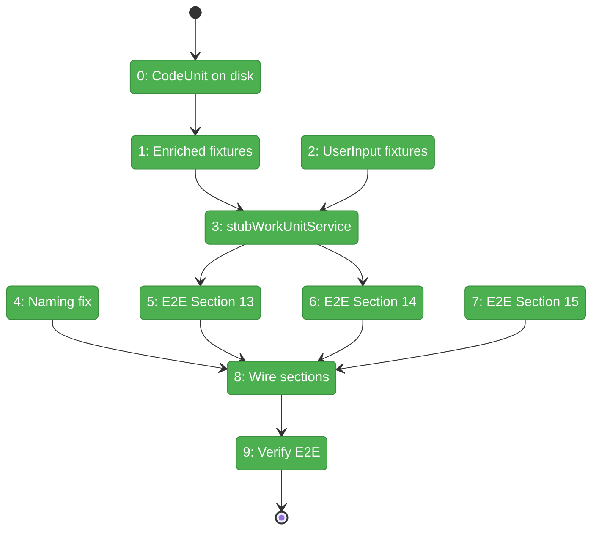
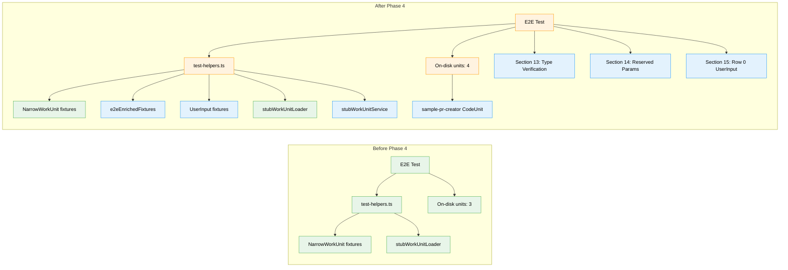

# Flight Plan: Phase 4 — Test Enrichment

**Plan**: [../../agentic-work-units-plan.md](../../agentic-work-units-plan.md)
**Phase**: Phase 4: Test Enrichment
**Generated**: 2026-02-04
**Status**: Landed

---

## Departure → Destination

**Where we are**: Phases 1-3 established the complete WorkUnit infrastructure — discriminated types (`AgenticWorkUnit`, `CodeUnit`, `UserInputUnit`), Zod schemas, `WorkUnitService` with template access, and CLI integration with reserved parameter routing (`main-prompt`, `main-script`). The infrastructure exists and passes 137+ unit tests, but the E2E test suite from Plan 028 still uses the narrow `NarrowWorkUnit` fixtures and doesn't exercise the new type discrimination or reserved parameter features.

**Where we're going**: By the end of this phase, the E2E test suite will verify the complete agentic work unit infrastructure end-to-end. A developer running `pnpm test test/e2e/positional-graph-execution-e2e.test.ts` will see 15 sections pass, including: Section 13 verifying unit types via CLI, Section 14 verifying reserved parameter routing works on both completed and pending nodes, and Section 15 verifying UserInputUnit on Line 0 is immediately ready as a workflow entry point.

---

## Flight Status

<!-- Updated by /plan-6: pending → active → done. Use blocked for problems/input needed. -->

**Legend**: grey = pending | yellow = active | red = blocked/needs input | green = done

---

## Stages

<!-- Updated by /plan-6 during implementation: [ ] → [~] → [x] -->

- [x] **Stage 0: Create CodeUnit on disk** — create `sample-pr-creator` with `type: code` and script file (`.chainglass/units/sample-pr-creator/` — new files)
- [x] **Stage 1: Add enriched fixtures** — define all 7 pipeline units with full `AgenticWorkUnit`/`CodeUnit` types using `satisfies` pattern (`test/unit/positional-graph/test-helpers.ts`)
- [x] **Stage 2: Add UserInput fixtures** — add `sampleUserRequirements` and `sampleLanguageSelector` UserInputUnit fixtures (`test-helpers.ts`)
- [x] **Stage 3: Implement stubWorkUnitService** — create test helper supporting template content map, strict mode, proper error types (`test-helpers.ts`)
- [x] **Stage 4: Fix naming inconsistency** — rename `samplePRCreator` → `samplePrCreator` for consistent camelCase (`test-helpers.ts`)
- [x] **Stage 5: Write E2E Section 13** — unit type verification tests verifying CLI returns correct type for agent/code/user-input units (`e2e test`)
- [x] **Stage 6: Write E2E Section 14** — reserved parameter routing tests for main-prompt/main-script and E186 type mismatch (`e2e test`)
- [x] **Stage 7: Write E2E Section 15** — Row 0 UserInputUnit tests verifying entry point is immediately ready (`e2e test`)
- [x] **Stage 8: Wire sections into main** — integrate sections 13-15 into E2E test orchestration (`e2e test`)
- [x] **Stage 9: Verify full E2E** — run complete test suite, all 15 sections pass

---

## Acceptance Criteria

- [x] AC-8: E2E Section 13 (Unit Type Verification) verifies: `sample-coder` is `type='agent'`, `sample-pr-creator` is `type='code'`, `sample-input` is `type='user-input'`
- [x] AC-9: E2E Section 14 (Reserved Parameter Routing) verifies: `main-prompt` returns content, `main-script` returns content, type mismatch returns E186
- [x] AC-10: E2E Section 15 (Row 0 UserInputUnit) verifies: UserInputUnit on Line 0 is immediately ready

---

## Goals & Non-Goals

**Goals**:
- Create `sample-pr-creator` CodeUnit on disk (minimal unit for E2E type verification)
- Add `e2eEnrichedFixtures` to test-helpers.ts with full WorkUnit types
- Add `sampleUserRequirements` and `sampleLanguageSelector` UserInputUnit fixtures
- Implement `stubWorkUnitService()` helper with controllable template content
- Fix naming inconsistency: `samplePRCreator` → `samplePrCreator`
- Add E2E Sections 13-15 per workshop specification
- All 15 E2E sections pass

**Non-Goals**:
- Full on-disk unit YAML file suite (Phase 5) — only `sample-pr-creator` created here
- Workgraph bridge removal (Phase 5)
- Documentation (Phase 5)
- Migration of existing unit files (Phase 5)

---

## Architecture: Before & After

**Legend**: existing (green, unchanged) | changed (orange, modified) | new (blue, created)

---

## Checklist

- [x] T000: Create `sample-pr-creator` CodeUnit on disk (CS-1)
- [x] T001: Add `e2eEnrichedFixtures` to test-helpers.ts (CS-2)
- [x] T002: Add `sampleUserRequirements` and `sampleLanguageSelector` fixtures (CS-1)
- [x] T003: Implement `stubWorkUnitService()` helper (CS-2)
- [x] T004: Fix naming inconsistency: samplePRCreator → samplePrCreator (CS-1)
- [x] T005: Write E2E Section 13: Unit Type Verification (CS-2)
- [x] T006: Write E2E Section 14: Reserved Parameter Routing (CS-2)
- [x] T007: Write E2E Section 15: Row 0 UserInputUnit (CS-2)
- [x] T008: Update E2E main flow to include new sections (CS-1)
- [x] T009: Run full E2E test and verify (CS-1)

---

## PlanPak

Active — files organized under `features/029-agentic-work-units/`
