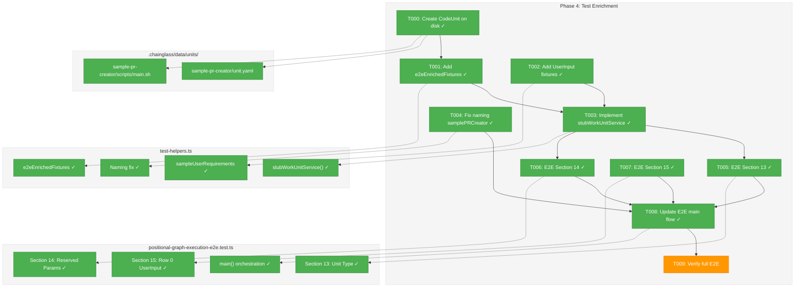
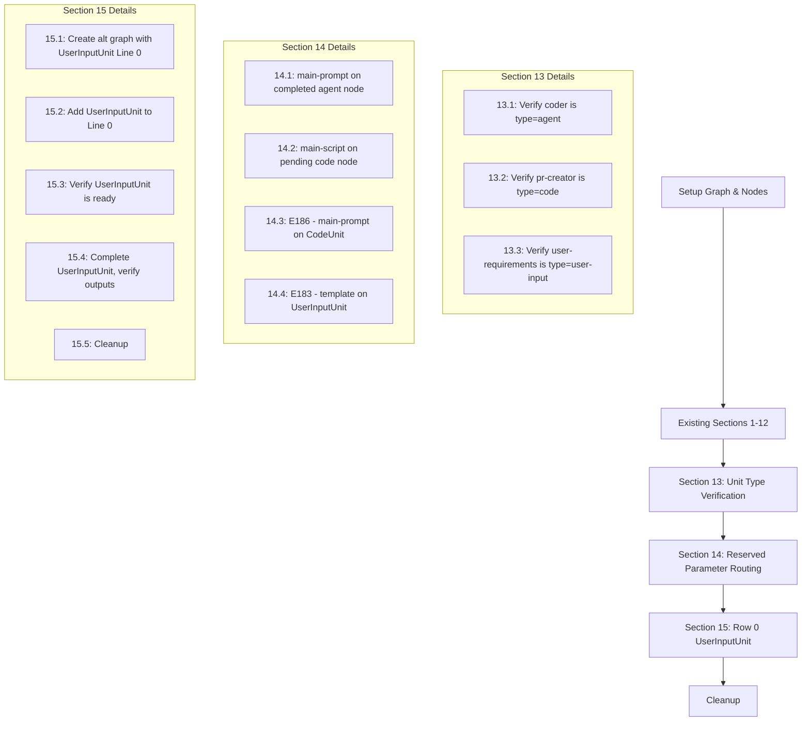
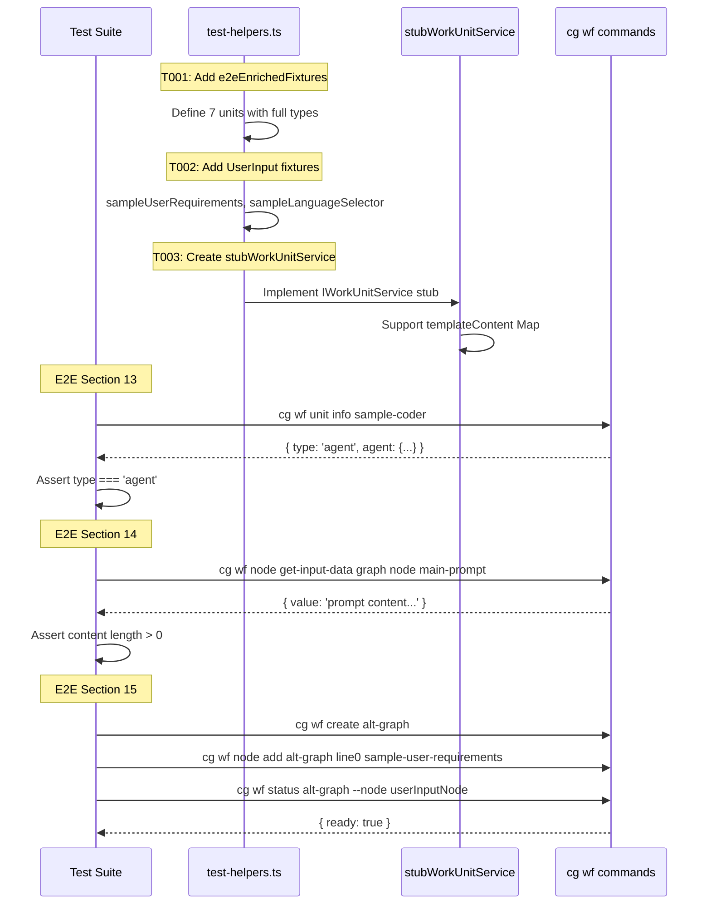

# Phase 4: Test Enrichment – Tasks & Alignment Brief

**Spec**: [../../agentic-work-units-spec.md](../../agentic-work-units-spec.md)
**Plan**: [../../agentic-work-units-plan.md](../../agentic-work-units-plan.md)
**Date**: 2026-02-04

---

## Executive Briefing

### Purpose
This phase enriches the E2E test infrastructure from Plan 028 to use the full discriminated `WorkUnit` types implemented in Phases 1-3. Without this, we cannot verify that the type system, service layer, and CLI integration work together in a realistic scenario.

### What We're Building
- Enriched test fixtures (`e2eEnrichedFixtures`) with full `AgenticWorkUnit`, `CodeUnit`, and `UserInputUnit` types
- A `stubWorkUnitService()` helper for E2E tests that provides controllable template content
- Three new E2E test sections (13-15) verifying unit type discrimination, reserved parameter routing, and Row 0 UserInputUnit behavior

### User Value
After this phase, the test suite comprehensively validates that:
- Agents can retrieve their prompt templates via `main-prompt`
- Code units can retrieve their scripts via `main-script`
- Type mismatches return appropriate errors (E186)
- UserInputUnits on Line 0 are immediately ready as workflow entry points

### Example
**E2E Section 14 (Reserved Parameter Routing)**:
```bash
# Step 14.1: On completed agent node
cg wf node get-input-data e2e-graph coder-node main-prompt
# Returns: "You are a code generation agent..."

# Step 14.3: Type mismatch (main-prompt on code unit)
cg wf node get-input-data e2e-graph pr-creator-node main-prompt
# Returns: E186 UnitTypeMismatch
```

---

## Objectives & Scope

### Objective
Upgrade E2E test fixtures to full WorkUnit types and add E2E sections 13-15 as specified in the plan acceptance criteria AC-8, AC-9, and AC-10.

### Goals

- ✅ Add `e2eEnrichedFixtures` with all 7 units typed as `AgenticWorkUnit`, `CodeUnit`, or `UserInputUnit`
- ✅ Add `sampleUserRequirements` and `sampleLanguageSelector` UserInputUnit fixtures
- ✅ Implement `stubWorkUnitService()` helper with controllable template content
- ✅ Fix naming inconsistency: `samplePRCreator` → `samplePrCreator`
- ✅ Add E2E Section 13: Unit Type Verification (verifies type discrimination via CLI)
- ✅ Add E2E Section 14: Reserved Parameter Routing (verifies `main-prompt`/`main-script` work)
- ✅ Add E2E Section 15: Row 0 UserInputUnit (verifies entry point semantics)

### Non-Goals

- ❌ Full on-disk unit YAML file suite (Phase 5) — only `sample-pr-creator` CodeUnit created here for E2E
- ❌ Workgraph bridge removal (Phase 5)
- ❌ Documentation (Phase 5)
- ❌ Migration of existing unit files (Phase 5)
- ❌ Performance optimization of test suite
- ❌ Caching in test helpers (by design)

---

## Pre-Implementation Audit

### Summary

| File | Action | Origin | Modified By | Recommendation |
|------|--------|--------|-------------|----------------|
| `/home/jak/substrate/029-agentic-work-units/.chainglass/data/units/sample-pr-creator/unit.yaml` | Create | — | — | new file |
| `/home/jak/substrate/029-agentic-work-units/.chainglass/data/units/sample-pr-creator/scripts/main.sh` | Create | — | — | new file |
| `/home/jak/substrate/029-agentic-work-units/test/unit/positional-graph/test-helpers.ts` | Modify | Plan 028 | — | keep-as-is |
| `/home/jak/substrate/029-agentic-work-units/test/e2e/positional-graph-execution-e2e.test.ts` | Modify | Plan 028 | — | keep-as-is |

### Compliance Check

No violations found. Files follow existing patterns:
- On-disk unit files follow structure from existing `sample-coder`, `sample-tester`, `sample-input`
- Test files follow existing patterns from Plan 028

---

## Requirements Traceability

### Coverage Matrix

| AC | Description | Flow Summary | Files in Flow | Tasks | Status |
|----|-------------|--------------|---------------|-------|--------|
| AC-8 | E2E Unit Type Verification | CLI → WorkUnitService → E2E test assertions | sample-pr-creator on disk, test-helpers.ts, e2e test | T000,T001,T005 | ⬜ Pending |
| AC-9 | E2E Reserved Parameter Tests | CLI → reserved param routing → template content | sample-pr-creator on disk, test-helpers.ts, e2e test | T000,T002,T003,T006 | ⬜ Pending |
| AC-10 | E2E Row 0 UserInputUnit | Graph creation → UserInputUnit → ready check | test-helpers.ts, e2e test | T002,T007 | ⬜ Pending |

### Gaps Found

**Gap 1: No CodeUnit exists on disk for E2E tests**

The E2E tests copy units from `.chainglass/data/units/` to the temp workspace (line 368-374 of E2E test). Currently only 3 units exist:
- `sample-coder` (type=agent) ✓
- `sample-tester` (type=agent) ✓
- `sample-input` (type=user-input) ✓

**Missing for AC-8 and AC-9**:
- Need at least one `type: code` unit to verify CodeUnit type discrimination and `main-script` reserved parameter routing

**Resolution**: Add task T000 to create `sample-pr-creator` CodeUnit on disk (minimal unit needed for E2E). This pulls forward a subset of Phase 5 task 5.2, keeping the scope minimal.

### Orphan Files

None.

---

## Architecture Map

### Component Diagram

<!-- Status: grey=pending, orange=in-progress, green=completed, red=blocked -->
<!-- Updated by plan-6 during implementation -->



### Task-to-Component Mapping

<!-- Status: ⬜ Pending | 🟧 In Progress | ✅ Complete | 🔴 Blocked -->

| Task | Component(s) | Files | Status | Comment |
|------|-------------|-------|--------|---------|
| T000 | On-disk CodeUnit | .chainglass/units/sample-pr-creator/ | ✅ Complete | Minimal CodeUnit for E2E type verification |
| T001 | Enriched Fixtures | test-helpers.ts | ✅ Complete | All 7 units with full types + satisfies assertions |
| T002 | UserInput Fixtures | test-helpers.ts | ✅ Complete | sampleUserRequirements + sampleLanguageSelector |
| T003 | Stub Service | test-helpers.ts | ✅ Complete | stubWorkUnitService() with template map |
| T004 | Naming Fix | test-helpers.ts | ✅ Complete | samplePRCreator → samplePrCreator |
| T005 | E2E Section 13 | e2e test | ✅ Complete | Unit type verification via CLI |
| T006 | E2E Section 14 | e2e test | ✅ Complete | Reserved parameter routing tests |
| T007 | E2E Section 15 | e2e test | ✅ Complete | Row 0 UserInputUnit tests |
| T008 | E2E Integration | e2e test | ✅ Complete | Wire sections + fix unit path |
| T009 | Verification | — | ✅ Complete | 65 E2E steps pass, 3233 unit tests pass [^14] |

---

## Tasks

| Status | ID | Task | CS | Type | Dependencies | Absolute Path(s) | Validation | Subtasks | Notes |
|--------|------|--------------------------------------|-----|------|--------------|------------------|------------|----------|-------|
| [x] | T000 | Create `sample-pr-creator` CodeUnit on disk | 1 | Setup | – | /home/jak/substrate/029-agentic-work-units/.chainglass/units/sample-pr-creator/unit.yaml, /home/jak/substrate/029-agentic-work-units/.chainglass/units/sample-pr-creator/scripts/main.sh | `cg wf unit info sample-pr-creator` returns `type: 'code'` | – | Pulled from Phase 5 task 5.2; minimal CodeUnit for E2E |
| [x] | T001 | Add `e2eEnrichedFixtures` to test-helpers.ts | 2 | Core | T000 | /home/jak/substrate/029-agentic-work-units/test/unit/positional-graph/test-helpers.ts | All 7 units have full WorkUnit types with `satisfies` assertions | – | Per workshop e2e-test-enrichment.md |
| [x] | T002 | Add `sampleUserRequirements` and `sampleLanguageSelector` fixtures | 1 | Core | – | /home/jak/substrate/029-agentic-work-units/test/unit/positional-graph/test-helpers.ts | UserInputUnit fixtures available with question_type | – | |
| [x] | T003 | Implement `stubWorkUnitService()` helper | 2 | Core | T001, T002 | /home/jak/substrate/029-agentic-work-units/test/unit/positional-graph/test-helpers.ts | Helper supports template content, strict mode, returns proper result types | – | Per workshop stubWorkUnitService design |
| [x] | T004 | Fix naming inconsistency: samplePRCreator → samplePrCreator | 1 | Refactor | – | /home/jak/substrate/029-agentic-work-units/test/unit/positional-graph/test-helpers.ts, /home/jak/substrate/029-agentic-work-units/test/e2e/positional-graph-execution-e2e.test.ts | Consistent camelCase naming across all references | – | Per workshop naming convention |
| [x] | T005 | Write E2E Section 13: Unit Type Verification | 2 | Test | T003 | /home/jak/substrate/029-agentic-work-units/test/e2e/positional-graph-execution-e2e.test.ts | Tests verify type discrimination via CLI unit info | – | Per spec AC-8 |
| [x] | T006 | Write E2E Section 14: Reserved Parameter Routing | 2 | Test | T003 | /home/jak/substrate/029-agentic-work-units/test/e2e/positional-graph-execution-e2e.test.ts | Tests verify main-prompt/main-script routing, E186 on mismatch | – | Per spec AC-9, workshop §14 |
| [x] | T007 | Write E2E Section 15: Row 0 UserInputUnit | 2 | Test | T002, T003 | /home/jak/substrate/029-agentic-work-units/test/e2e/positional-graph-execution-e2e.test.ts | Tests verify UserInputUnit on Line 0 is immediately ready | – | Per spec AC-10, workshop §15 |
| [x] | T008 | Update E2E main flow to include new sections | 1 | Integration | T005, T006, T007 | /home/jak/substrate/029-agentic-work-units/test/e2e/positional-graph-execution-e2e.test.ts | Sections 13-15 run in correct order | – | |
| [x] | T009 | Run full E2E test and verify | 1 | Verification | T008 | – | All 15 sections pass | – | `npx tsx test/e2e/positional-graph-execution-e2e.test.ts` |

---

## Alignment Brief

### Prior Phases Review

#### Phase 1: Types and Schemas (2026-02-04)

**Deliverables Created**:
- `packages/positional-graph/src/features/029-agentic-work-units/workunit.types.ts` — Compile-time assertions
- `packages/positional-graph/src/features/029-agentic-work-units/workunit.schema.ts` — Zod schemas (262 lines)
- `packages/positional-graph/src/features/029-agentic-work-units/workunit-errors.ts` — E180-E187 error factories
- `packages/positional-graph/src/features/029-agentic-work-units/index.ts` — Feature barrel
- 34 tests across 3 test files

**Key Types for Phase 4**:
- `AgenticWorkUnit`, `CodeUnit`, `UserInputUnit` — for enriched fixtures
- `WorkUnit` discriminated union — for type assertions
- `WorkUnitSchema` — for potential fixture validation

**Lessons Learned**:
- Schema-first approach per ADR-0003: types derived from Zod via `z.infer<>`
- Slugs use hyphens, input names use underscores (prevents reserved param collision)
- `formatZodErrors()` transforms Zod issues to actionable messages

#### Phase 2: Service and Adapter (2026-02-04)

**Deliverables Created**:
- `WorkUnitAdapter` class with `getUnitDir()`, `getTemplatePath()`, etc.
- `WorkUnitService` implementing `IWorkUnitService`
- `FakeWorkUnitService` test double with `addUnit()`, `setTemplateContent()`, call tracking
- Rich domain classes: `AgenticWorkUnitInstance`, `CodeUnitInstance`, `UserInputUnitInstance`
- 103 tests passing

**Key APIs for Phase 4**:
- `IWorkUnitService.list()` → `ListUnitsResult`
- `IWorkUnitService.load()` → `LoadUnitResult` with `WorkUnitInstance`
- `AgenticWorkUnitInstance.getPrompt()` / `CodeUnitInstance.getScript()`
- `FakeWorkUnitService` — can be reused or adapted for E2E stub

**Lessons Learned**:
- Rich domain objects: type-specific methods on instances, not generic service
- Path escape security: use `startsWith(unitDir + sep)` pattern
- Skip-and-warn pattern for `list()` partial failures

#### Phase 3: CLI Integration (2026-02-04)

**Deliverables Created**:
- `reserved-params.ts` with `RESERVED_INPUT_PARAMS`, `isReservedInputParam()`
- Reserved parameter routing in `handleNodeGetInputData()`
- Unit subcommands: `cg wf unit list`, `cg wf unit info`, `cg wf unit get-template`
- DI registration for WorkUnitAdapter and WorkUnitService
- 34 tests (9 DI + 25 CLI)

**Key CLI Commands for E2E**:
- `cg wf unit info <slug>` — returns full unit info including `type`
- `cg wf unit get-template <slug>` — returns template content (E183 for user-input)
- `cg wf node get-input-data <graph> <node> main-prompt` — reserved param routing
- `cg wf node get-input-data <graph> <node> main-script` — reserved param routing

**Lessons Learned**:
- DI registration order matters: `registerPositionalGraphServices()` before `WORK_UNIT_LOADER` bridge
- Type guards prevent wrong methods at compile time (no `getPrompt()` on CodeUnit)
- Transient DI lifetime verified in tests

### Cross-Phase Dependencies

| From Phase | Export | Used In Phase 4 |
|------------|--------|-----------------|
| Phase 1 | `AgenticWorkUnit`, `CodeUnit`, `UserInputUnit` | Enriched fixtures typing |
| Phase 1 | `WorkUnit` union | `satisfies` assertions |
| Phase 2 | `FakeWorkUnitService` | Reference for stubWorkUnitService design |
| Phase 2 | `IWorkUnitService` interface | stubWorkUnitService return type |
| Phase 3 | `cg wf unit info` | E2E Section 13 type verification |
| Phase 3 | `cg wf unit get-template` | E2E Section 14 reserved params |
| Phase 3 | Reserved param routing | E2E Section 14 tests |

### Critical Findings Affecting This Phase

**None directly applicable.** Critical discoveries from plan § 3 were addressed in Phases 1-3. Phase 4 focuses on test verification of completed infrastructure.

### ADR Decision Constraints

**ADR-0003: Configuration System**:
- Zod validation pattern applies to fixture definitions
- Use `satisfies AgenticWorkUnit` pattern for type safety

**ADR-0004: DI Container Architecture**:
- `stubWorkUnitService()` should follow DI patterns (factory function, interface return)

### Visual Alignment Aids

#### E2E Test Flow (Sections 13-15)



#### Test Helpers Enhancement Sequence



### Test Plan

**Testing Approach**: Full TDD (per spec) with fakes only

**Named Tests**:

| Test | Rationale | Fixture | Expected Output |
|------|-----------|---------|-----------------|
| Section 13.1: Agent type | Verify CLI returns type='agent' | sampleCoderE2E | `type === 'agent'` |
| Section 13.2: Code type | Verify CLI returns type='code' | samplePrCreator | `type === 'code'` |
| Section 13.3: UserInput type | Verify CLI returns type='user-input' | sampleUserRequirements | `type === 'user-input'` |
| Section 14.1: main-prompt | Reserved param on completed agent | coder node | String content > 0 chars |
| Section 14.2: main-script | Reserved param on pending code | pr-creator node | String content > 0 chars |
| Section 14.3: E186 mismatch | main-prompt on CodeUnit | pr-creator node | Error code E186 |
| Section 14.4: E183 no template | Template on UserInputUnit | sample-user-requirements | Error code E183 |
| Section 15.1-4: Row 0 | UserInputUnit entry point | sampleUserRequirements | `ready === true` on Line 0 |

### Implementation Outline

0. **T000**: Create `sample-pr-creator` CodeUnit on disk
   - Create `.chainglass/data/units/sample-pr-creator/unit.yaml` with `type: code`
   - Create `.chainglass/data/units/sample-pr-creator/scripts/main.sh` (mock script)
   - Verify with `cg wf unit info sample-pr-creator` returns `type: 'code'`

1. **T001**: Add `e2eEnrichedFixtures` constant to test-helpers.ts
   - Import `AgenticWorkUnit`, `CodeUnit`, `UserInputUnit` from `@chainglass/positional-graph`
   - Define all 7 pipeline units with full types using `satisfies` pattern
   - Keep existing `e2eExecutionFixtures` for backward compatibility

2. **T002**: Add UserInputUnit fixtures
   - `sampleUserRequirements` (text question type)
   - `sampleLanguageSelector` (single choice question type)

3. **T003**: Implement `stubWorkUnitService()`
   - Accept `units: WorkUnit[]` and `templateContent: Map<string, string>`
   - Implement `list()`, `load()`, `validate()` methods
   - Support `strictMode` for unknown slug handling
   - Return proper error types (E180, E183, E185)

4. **T004**: Fix naming inconsistency
   - Rename `samplePRCreator` → `samplePrCreator` in both files
   - Update all references in `createE2EExecutionTestLoader()`

5. **T005**: Write E2E Section 13 (Unit Type Verification)
   - Add `testUnitTypeVerification()` function
   - Steps 13.1-13.3 per workshop specification

6. **T006**: Write E2E Section 14 (Reserved Parameter Routing)
   - Add `testReservedParameterRouting()` function
   - Steps 14.1-14.4 per workshop specification
   - Note: Reserved params work regardless of node state

7. **T007**: Write E2E Section 15 (Row 0 UserInputUnit)
   - Add `testRow0UserInput()` function
   - Steps 15.1-15.5 per workshop specification
   - Creates separate test graph for isolation

8. **T008**: Update E2E main flow
   - Add calls to new section functions in `main()`
   - Section 13 after setup, before Line 0 execution
   - Section 14 after Line 1 completes
   - Section 15 at the end (uses separate graph)

9. **T009**: Run full verification
   - `pnpm test test/e2e/positional-graph-execution-e2e.test.ts`
   - Verify all 15 sections pass

### Commands to Run

```bash
# During development - run E2E tests
pnpm test test/e2e/positional-graph-execution-e2e.test.ts

# Verbose output to see section names
pnpm test test/e2e/positional-graph-execution-e2e.test.ts -- --reporter=verbose

# TypeScript check
pnpm typecheck

# Lint
pnpm lint

# Full quality check before commit
just fft
```

### Risks & Unknowns

| Risk | Likelihood | Impact | Mitigation |
|------|------------|--------|------------|
| E2E test timing issues | Low | Medium | Reserved params are static, work regardless of state |
| Backward compatibility | Low | Low | Keep `e2eExecutionFixtures` alongside enriched |
| On-disk CodeUnit missing | **Resolved** | — | T000 creates `sample-pr-creator` CodeUnit on disk |

**Resolved**: The E2E tests need real on-disk unit files for Sections 13-14 to exercise the CLI's `cg wf unit info` and reserved parameter routing. Task T000 creates the minimal `sample-pr-creator` CodeUnit. Existing units (`sample-coder`, `sample-tester`, `sample-input`) already have `type` fields and provide the AgenticWorkUnit and UserInputUnit coverage.

### Ready Check

- [ ] ADR constraints mapped to tasks (IDs noted in Notes column) - N/A (no ADR-specific constraints for test phase)
- [ ] Prior phase deliverables reviewed and understood
- [ ] Workshop specifications read (e2e-test-enrichment.md)
- [ ] Existing test-helpers.ts structure understood
- [ ] E2E test patterns understood (runCli, section functions)

---

## Phase Footnote Stubs

[^12]: Phase 4 T001-T004 - Test fixtures and helpers
  - `function:test/unit/positional-graph/test-helpers.ts:e2eEnrichedFixtures`
  - `function:test/unit/positional-graph/test-helpers.ts:sampleUserRequirements`
  - `function:test/unit/positional-graph/test-helpers.ts:sampleLanguageSelector`
  - `function:test/unit/positional-graph/test-helpers.ts:stubWorkUnitService`
  - Naming fix: samplePRCreator → samplePrCreator

[^13]: Phase 4 T005-T008 - E2E Sections 13-15
  - `function:test/e2e/positional-graph-execution-e2e.test.ts:testUnitTypeVerification`
  - `function:test/e2e/positional-graph-execution-e2e.test.ts:testReservedParameterRouting`
  - `function:test/e2e/positional-graph-execution-e2e.test.ts:testRow0UserInput`
  - Fixed CLI --json flag placement
  - Fixed E2E setup() to copy units to WorkUnitAdapter path

[^14]: Phase 4 T009 - E2E verification and unit files
  - `file:.chainglass/data/units/sample-spec-builder/unit.yaml`
  - `file:.chainglass/data/units/sample-spec-reviewer/unit.yaml`
  - `file:.chainglass/data/units/sample-spec-alignment-tester/unit.yaml`
  - `file:.chainglass/data/units/sample-pr-preparer/unit.yaml`
  - `file:.chainglass/units/sample-pr-creator/unit.yaml`
  - `file:.chainglass/units/sample-pr-creator/scripts/main.sh`
  - 65 E2E steps pass, 3233 unit tests pass

---

## Evidence Artifacts

**Execution Log**: `./execution.log.md`
**Supporting Files**: None (test-only phase)

---

## Discoveries & Learnings

_Populated during implementation by plan-6. Log anything of interest to your future self._

| Date | Task | Type | Discovery | Resolution | References |
|------|------|------|-----------|------------|------------|
| 2026-02-04 | T000 | gotcha | E2E test copies units from `.chainglass/data/units/` but WorkUnitAdapter expects `.chainglass/units/` (Phase 2 DYK #1) | Fix E2E test path in T008 when wiring sections | log#task-t000 |

**Types**: `gotcha` | `research-needed` | `unexpected-behavior` | `workaround` | `decision` | `debt` | `insight`

**What to log**:
- Things that didn't work as expected
- External research that was required
- Implementation troubles and how they were resolved
- Gotchas and edge cases discovered
- Decisions made during implementation
- Technical debt introduced (and why)
- Insights that future phases should know about

_See also: `execution.log.md` for detailed narrative._

---

## Directory Layout

```
docs/plans/029-agentic-work-units/
  ├── agentic-work-units-plan.md
  ├── agentic-work-units-spec.md
  ├── workshops/
  │   ├── workunit-loading.md
  │   └── e2e-test-enrichment.md
  └── tasks/
      ├── phase-1-types-and-schemas/
      ├── phase-2-service-and-adapter/
      ├── phase-3-cli-integration/
      └── phase-4-test-enrichment/
          ├── tasks.md              (this file)
          ├── tasks.fltplan.md      (generated by /plan-5b)
          └── execution.log.md      (created by /plan-6)
```
