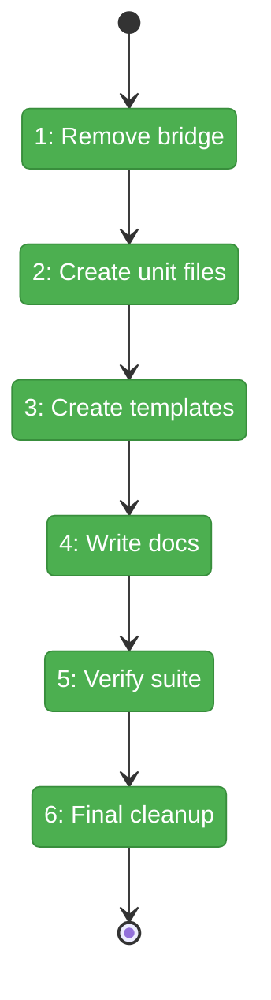
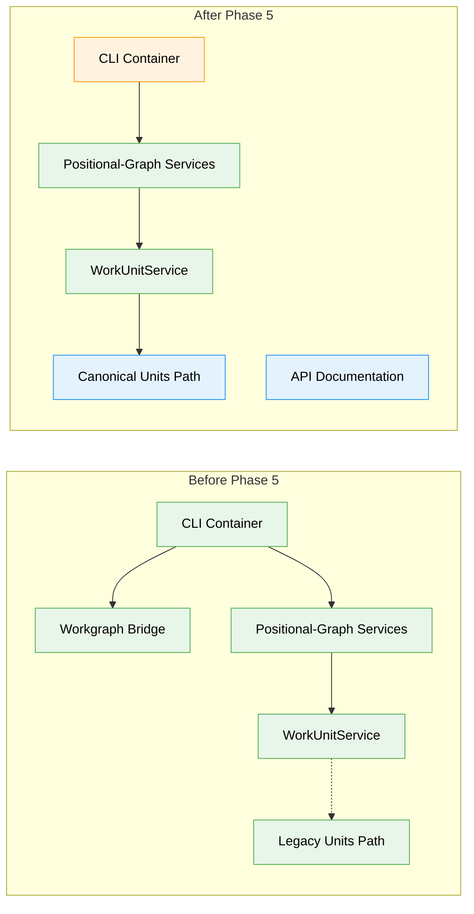

# Flight Plan: Phase 5 — Cleanup and Documentation

**Plan**: [../../agentic-work-units-plan.md](../../agentic-work-units-plan.md)
**Phase**: Phase 5: Cleanup and Documentation
**Generated**: 2026-02-04
**Status**: Landed

---

## Departure → Destination

**Where we are**: The agentic work units feature is functionally complete. Phases 1-4 delivered discriminated union types, a full service layer with path-escape security, CLI integration with reserved parameter routing, and E2E test enrichment with 65 passing steps. The CLI container still imports from the legacy `@chainglass/workgraph` package for backward compatibility, and on-disk unit files exist in the legacy `.chainglass/data/units/` path rather than the canonical `.chainglass/units/` path that `WorkUnitAdapter` expects.

**Where we're going**: By the end of this phase, the legacy workgraph bridge will be removed from the CLI container, all 8 sample units will exist in the canonical `.chainglass/units/` directory with proper prompts/scripts, and comprehensive API documentation will guide developers on using work unit types and CLI commands. A developer running `cg wf unit list` will see all sample units loaded directly from positional-graph's `WorkUnitService` with no workgraph dependency.

---

## Flight Status

<!-- Updated by /plan-6: pending → active → done. Use blocked for problems/input needed. -->

**Legend**: grey = pending | yellow = active | red = blocked/needs input | green = done

---

## Stages

<!-- Updated by /plan-6 during implementation: [ ] → [~] → [x] -->

- [x] **Stage 1: ~~Remove workgraph bridge~~** — SKIPPED: `cg wg` commands depend on workgraph services (per DYK #2)
- [x] **Stage 2: Create on-disk unit YAML files** — write `unit.yaml` for all 8 sample units in canonical path (`.chainglass/units/*/unit.yaml` — 7 new files)
- [x] **Stage 3: Create prompt/script templates** — add `prompts/main.md` for 6 agent units (`.chainglass/units/*/prompts/main.md` — new files)
- [x] **Stage 4: Write API documentation** — comprehensive guide covering types, CLI, errors (`docs/how/positional-graph/workunit-api.md` — new file)
- [x] **Stage 5: Run full test suite** — verify all tests pass including 15 E2E sections
- [x] **Stage 6: Final cleanup** — confirm no workgraph imports in positional-graph package
- [x] **Stage 7: Remove legacy units** — delete `.chainglass/data/units/` (per DYK #3: single source of truth)

---

## Acceptance Criteria

- [x] AC-8: E2E Section 13 (Unit Type Verification) verifies unit types correctly
- [x] AC-9: E2E Section 14 (Reserved Parameter Routing) works on completed and pending nodes
- [x] AC-10: E2E Section 15 (Row 0 UserInputUnit) is immediately ready
- [x] `cg wf unit list` returns all 8 sample units from canonical path
- [x] No `@chainglass/workgraph` imports remain in positional-graph package
- [x] Documentation at `docs/how/positional-graph/workunit-api.md` covers types, CLI, and errors

---

## Goals & Non-Goals

**Goals**:
- ~~Remove `registerWorkgraphServices()` from CLI container~~ — DEFERRED (cg wg commands need it)
- ~~Remove `@chainglass/workgraph` import from CLI container~~ — DEFERRED
- ✅ Create 7 unit YAML files in `.chainglass/units/` (pr-creator already exists)
- ✅ Create 6 prompt template files for agent units
- ✅ Create comprehensive `workunit-api.md` documentation
- ✅ Verify full test suite passes including all 15 E2E sections

**Non-Goals**:
- ❌ Removing `@chainglass/workgraph` package entirely (other commands depend on it)
- ❌ Migrating workgraph.command.ts or unit.command.ts (separate effort)
- ❌ Deleting legacy `.chainglass/data/units/` files (backward compatibility)
- ❌ Automated migration tooling for external users

---

## Architecture: Before & After

**Legend**: existing (green, unchanged) | changed (orange, modified) | new (blue, created)

---

## Checklist

- [x] T001: Remove workgraph bridge from CLI container (SKIPPED per DYK #2)
- [x] T002: Create sample-spec-builder unit.yaml (CS-1)
- [x] T003: Create sample-spec-reviewer unit.yaml (CS-1)
- [x] T004: Create sample-coder unit.yaml (CS-1)
- [x] T005: Create sample-tester unit.yaml (CS-1)
- [x] T006: Create sample-spec-alignment-tester unit.yaml (CS-1)
- [x] T007: Create sample-pr-preparer unit.yaml (CS-1)
- [x] T008: Create prompts/main.md for all 6 agent units (CS-2)
- [x] T009: Create sample-input unit.yaml (CS-1)
- [x] T010: Create workunit-api.md documentation (CS-2)
- [x] T010a: Update E2E test setup to use canonical path only (CS-1)
- [x] T011: Run full test suite (CS-1)
- [x] T012: Final refactor and cleanup (CS-1)
- [x] T013: Remove legacy unit files (CS-1)

---

## PlanPak

Not active for this plan — unit files are project-level resources in `.chainglass/units/`, not feature-scoped.
