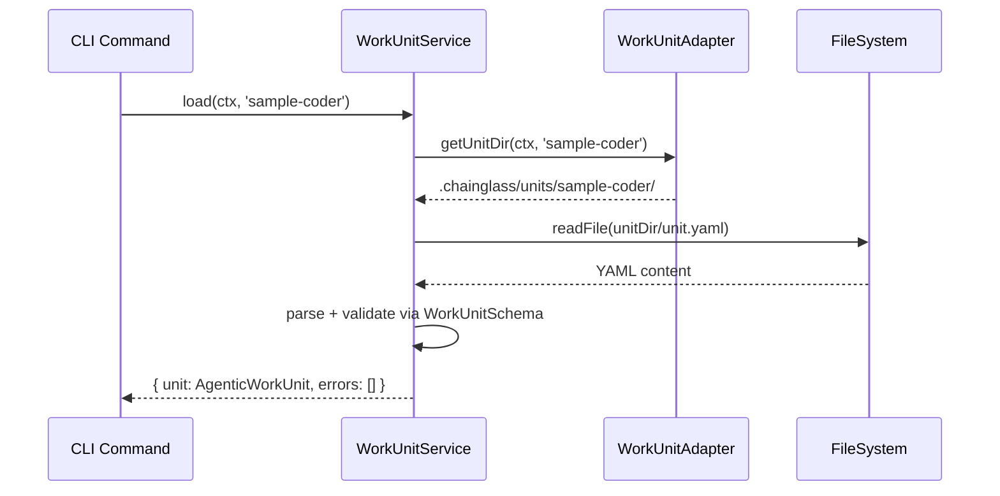
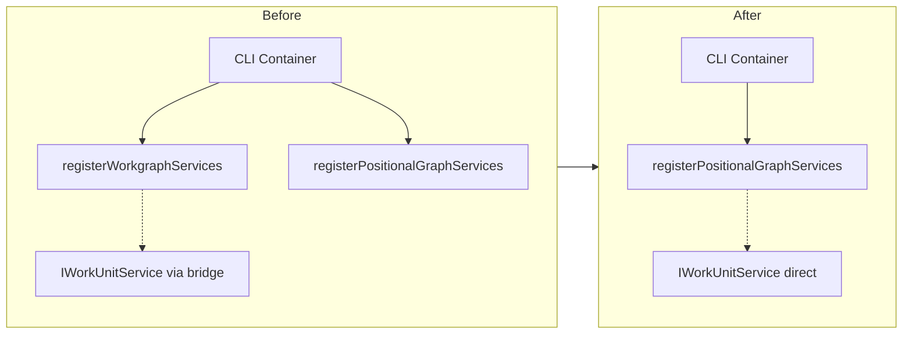

# Phase 5: Cleanup and Documentation – Tasks & Alignment Brief

**Spec**: [../../agentic-work-units-spec.md](../../agentic-work-units-spec.md)
**Plan**: [../../agentic-work-units-plan.md](../../agentic-work-units-plan.md)
**Date**: 2026-02-04

---

## Executive Briefing

### Purpose
This phase finalizes the agentic work units implementation by removing legacy dependencies, consolidating on-disk unit storage, and creating comprehensive documentation. It marks the transition from workgraph-bridged to standalone positional-graph work unit infrastructure.

### What We're Building
A clean, documented work unit system that:
- Removes all `@chainglass/workgraph` imports from CLI container (legacy bridge)
- Consolidates unit files under a single canonical path (`.chainglass/units/`)
- Creates complete API documentation for developers using work units
- Validates the full system with end-to-end tests

### User Value
Developers can rely on a single, well-documented source of truth for work unit types, CLI commands, and error codes. The legacy workgraph package becomes fully decoupled, enabling future removal.

### Example
**Before**: CLI container imports both `@chainglass/workgraph` and `@chainglass/positional-graph` for unit loading
**After**: CLI container only uses `@chainglass/positional-graph` — single service handles all work unit operations

---

## Objectives & Scope

### Objective
Complete the agentic work units feature by removing legacy workgraph bridge, consolidating unit storage paths, and documenting the new API per plan acceptance criteria.

### Goals

- ~~Remove `registerWorkgraphServices()` calls from CLI container~~ — DEFERRED (per DYK #2: `cg wg` commands still need it)
- ~~Remove `@chainglass/workgraph` import from CLI container~~ — DEFERRED (per DYK #2) and related files
- ✅ Create on-disk unit YAML files for all 8 sample units in canonical `.chainglass/units/` location
- ✅ Create template files (prompts/scripts) for units with templates
- ✅ Create documentation at `docs/how/positional-graph/workunit-api.md`
- ✅ Verify full test suite passes including all 15 E2E sections

### Non-Goals

- ❌ Removing `@chainglass/workgraph` package entirely (other files still depend on it)
- ❌ Migrating workgraph.command.ts or unit.command.ts (out of scope for this plan)
- ~~Deleting legacy unit files from `.chainglass/data/units/`~~ — NOW IN SCOPE (per DYK #3: single source of truth)
- ❌ Performance optimization or caching of unit definitions
- ❌ Automated migration CLI tool for external users

---

## Pre-Implementation Audit

### Summary

| File | Action | Origin | Modified By | Recommendation |
|------|--------|--------|-------------|----------------|
| `/home/jak/substrate/029-agentic-work-units/apps/cli/src/lib/container.ts` | Modify | Pre-plan | Plan 029 Phase 3 | keep-as-is |
| `/home/jak/substrate/029-agentic-work-units/.chainglass/units/sample-spec-builder/unit.yaml` | Create | New | — | keep-as-is |
| `/home/jak/substrate/029-agentic-work-units/.chainglass/units/sample-spec-builder/prompts/main.md` | Create | New | — | keep-as-is |
| `/home/jak/substrate/029-agentic-work-units/.chainglass/units/sample-spec-reviewer/unit.yaml` | Create | New | — | keep-as-is |
| `/home/jak/substrate/029-agentic-work-units/.chainglass/units/sample-spec-reviewer/prompts/main.md` | Create | New | — | keep-as-is |
| `/home/jak/substrate/029-agentic-work-units/.chainglass/units/sample-coder/unit.yaml` | Create | New | — | keep-as-is |
| `/home/jak/substrate/029-agentic-work-units/.chainglass/units/sample-coder/prompts/main.md` | Create | New | — | keep-as-is |
| `/home/jak/substrate/029-agentic-work-units/.chainglass/units/sample-tester/unit.yaml` | Create | New | — | keep-as-is |
| `/home/jak/substrate/029-agentic-work-units/.chainglass/units/sample-tester/prompts/main.md` | Create | New | — | keep-as-is |
| `/home/jak/substrate/029-agentic-work-units/.chainglass/units/sample-spec-alignment-tester/unit.yaml` | Create | New | — | keep-as-is |
| `/home/jak/substrate/029-agentic-work-units/.chainglass/units/sample-spec-alignment-tester/prompts/main.md` | Create | New | — | keep-as-is |
| `/home/jak/substrate/029-agentic-work-units/.chainglass/units/sample-pr-preparer/unit.yaml` | Create | New | — | keep-as-is |
| `/home/jak/substrate/029-agentic-work-units/.chainglass/units/sample-pr-preparer/prompts/main.md` | Create | New | — | keep-as-is |
| `/home/jak/substrate/029-agentic-work-units/.chainglass/units/sample-input/unit.yaml` | Create | New | — | keep-as-is |
| `/home/jak/substrate/029-agentic-work-units/docs/how/positional-graph/workunit-api.md` | Create | New | — | keep-as-is |

### Existing Resources

**Already exists** (from Phase 4):
- `/home/jak/substrate/029-agentic-work-units/.chainglass/units/sample-pr-creator/unit.yaml` — CodeUnit with scripts
- `/home/jak/substrate/029-agentic-work-units/.chainglass/units/sample-pr-creator/scripts/main.sh`

**Legacy path** (`.chainglass/data/units/`) — 7 units exist here with `type` fields already migrated:
- sample-coder, sample-input, sample-pr-preparer, sample-spec-alignment-tester, sample-spec-builder, sample-spec-reviewer, sample-tester

### Compliance Check
No violations found. All files follow PlanPak placement rules.

---

## Requirements Traceability

### Coverage Matrix

| AC | Description | Flow Summary | Files in Flow | Tasks | Status |
|----|-------------|--------------|---------------|-------|--------|
| AC-1 | Discriminated Union Types | Types defined in Phase 1 | Validated by existing tests | — | ✅ Prior phase |
| AC-2 | Reserved Parameter Routing (Agent) | CLI routing in Phase 3 | Validated by E2E Section 14 | — | ✅ Prior phase |
| AC-3 | Reserved Parameter Routing (Code) | CLI routing in Phase 3 | Validated by E2E Section 14 | — | ✅ Prior phase |
| AC-4 | Reserved Parameter Type Mismatch | E186 error in Phase 3 | Validated by E2E Section 14 | — | ✅ Prior phase |
| AC-5 | UserInputUnit No Template | E183 error in Phase 2 | Validated by E2E Section 14 | — | ✅ Prior phase |
| AC-6 | Backward Compatibility | Structural subtyping validated | Type tests in Phase 1 | — | ✅ Prior phase |
| AC-7 | Zod Schema Validation | Schema tests in Phase 1 | Validated by unit tests | — | ✅ Prior phase |
| AC-8 | E2E Unit Type Verification | E2E Section 13 | Unit files needed | T002-T009 | ⬜ This phase |
| AC-9 | E2E Reserved Parameter Tests | E2E Section 14 | Template files needed | T002-T009 | ⬜ This phase |
| AC-10 | E2E Row 0 UserInputUnit | E2E Section 15 | sample-input | T009 | ⬜ This phase |

### Gaps Found
No gaps — all tasks cover required files for E2E validation.

### Orphan Files
None — all files serve documented acceptance criteria.

---

## Architecture Map

### Component Diagram

```mermaid
flowchart TD
    classDef pending fill:#9E9E9E,stroke:#757575,color:#fff
    classDef inprogress fill:#FF9800,stroke:#F57C00,color:#fff
    classDef completed fill:#4CAF50,stroke:#388E3C,color:#fff
    classDef blocked fill:#F44336,stroke:#D32F2F,color:#fff

    subgraph Phase5["Phase 5: Cleanup and Documentation"]
        T001["T001: Remove workgraph bridge ✓ SKIPPED"]:::completed
        T002["T002: Create sample-spec-builder ✓"]:::completed
        T003["T003: Create sample-spec-reviewer ✓"]:::completed
        T004["T004: Create sample-coder ✓"]:::completed
        T005["T005: Create sample-tester ✓"]:::completed
        T006["T006: Create sample-spec-alignment-tester ✓"]:::completed
        T007["T007: Create sample-pr-preparer ✓"]:::completed
        T008["T008: Create prompts for agents ✓"]:::completed
        T009["T009: Create sample-input ✓"]:::completed
        T010["T010: Create documentation ✓"]:::completed
        T011["T011: Run full test suite ✓"]:::completed
        T012["T012: Final cleanup ✓"]:::completed

        T001 --> T011
        T002 --> T008
        T003 --> T008
        T004 --> T008
        T005 --> T008
        T006 --> T008
        T007 --> T008
        T008 --> T011
        T009 --> T011
        T010 --> T012
        T011 --> T012
    end

    subgraph Files["Files"]
        F1["/apps/cli/src/lib/container.ts"]:::pending
        F2["/.chainglass/units/sample-spec-builder/ ✓"]:::completed
        F3["/.chainglass/units/sample-spec-reviewer/ ✓"]:::completed
        F4["/.chainglass/units/sample-coder/ ✓"]:::completed
        F5["/.chainglass/units/sample-tester/ ✓"]:::completed
        F6["/.chainglass/units/sample-spec-alignment-tester/ ✓"]:::completed
        F7["/.chainglass/units/sample-pr-preparer/ ✓"]:::completed
        F8["/.chainglass/units/sample-input/ ✓"]:::completed
        F9["/docs/how/positional-graph/workunit-api.md ✓"]:::completed
    end

    T001 -.-> F1
    T002 -.-> F2
    T003 -.-> F3
    T004 -.-> F4
    T005 -.-> F5
    T006 -.-> F6
    T007 -.-> F7
    T009 -.-> F8
    T010 -.-> F9
```

<!-- Status: grey=pending, orange=in-progress, green=completed, red=blocked -->
<!-- Updated by plan-6 during implementation -->



### Task-to-Component Mapping

<!-- Status: ⬜ Pending | 🟧 In Progress | ✅ Complete | 🔴 Blocked -->

| Task | Component(s) | Files | Status | Comment |
|------|-------------|-------|--------|---------|
| T001 | CLI Container | container.ts | ✅ Complete (SKIPPED) | Deferred per DYK #2 |
| T002 | Unit Files | sample-spec-builder/ | ✅ Complete | Created unit.yaml in canonical path |
| T003 | Unit Files | sample-spec-reviewer/ | ✅ Complete | Created unit.yaml in canonical path |
| T004 | Unit Files | sample-coder/ | ✅ Complete | Created unit.yaml in canonical path |
| T005 | Unit Files | sample-tester/ | ✅ Complete | Created unit.yaml in canonical path |
| T006 | Unit Files | sample-spec-alignment-tester/ | ✅ Complete | Created unit.yaml in canonical path |
| T007 | Unit Files | sample-pr-preparer/ | ✅ Complete | Created unit.yaml in canonical path |
| T008 | Template Files | prompts/main.md | ✅ Complete | Created prompt templates for 6 agents |
| T009 | Unit Files | sample-input/ | ✅ Complete | Created UserInputUnit |
| T010 | Documentation | workunit-api.md | ✅ Complete | API documentation |
| T011 | Verification | all | ✅ Complete | Run just fft |
| T012 | Cleanup | imports | ✅ Complete | Verified no workgraph imports |

---

## Tasks

| Status | ID | Task | CS | Type | Dependencies | Absolute Path(s) | Validation | Subtasks | Notes |
|--------|------|------|-----|------|--------------|------------------|------------|----------|-------|
| [x] | T001 | ~~Remove workgraph bridge from CLI container~~ | – | – | – | – | SKIPPED: `cg wg` commands still depend on workgraph services; defer until workgraph.command.ts migration | – | Per DYK #2 |
| [x] | T002 | Create sample-spec-builder unit.yaml | 1 | Setup | – | /home/jak/substrate/029-agentic-work-units/.chainglass/units/sample-spec-builder/unit.yaml | File exists, valid YAML, matches workshop spec | – | plan-scoped |
| [x] | T003 | Create sample-spec-reviewer unit.yaml | 1 | Setup | – | /home/jak/substrate/029-agentic-work-units/.chainglass/units/sample-spec-reviewer/unit.yaml | File exists, valid YAML, matches workshop spec | – | plan-scoped |
| [x] | T004 | Create sample-coder unit.yaml | 1 | Setup | – | /home/jak/substrate/029-agentic-work-units/.chainglass/units/sample-coder/unit.yaml | File exists, valid YAML, matches workshop spec | – | plan-scoped |
| [x] | T005 | Create sample-tester unit.yaml | 1 | Setup | – | /home/jak/substrate/029-agentic-work-units/.chainglass/units/sample-tester/unit.yaml | File exists, valid YAML, matches workshop spec | – | plan-scoped |
| [x] | T006 | Create sample-spec-alignment-tester unit.yaml | 1 | Setup | – | /home/jak/substrate/029-agentic-work-units/.chainglass/units/sample-spec-alignment-tester/unit.yaml | File exists, valid YAML, matches workshop spec | – | plan-scoped |
| [x] | T007 | Create sample-pr-preparer unit.yaml | 1 | Setup | – | /home/jak/substrate/029-agentic-work-units/.chainglass/units/sample-pr-preparer/unit.yaml | File exists, valid YAML, matches workshop spec | – | plan-scoped |
| [x] | T008 | Create prompts/main.md for all 6 agent units | 2 | Setup | T002,T003,T004,T005,T006,T007 | /home/jak/substrate/029-agentic-work-units/.chainglass/units/*/prompts/main.md | Template files exist with appropriate content | – | plan-scoped |
| [x] | T009 | Create sample-input unit.yaml | 1 | Setup | – | /home/jak/substrate/029-agentic-work-units/.chainglass/units/sample-input/unit.yaml | UserInputUnit with question_type=text; E2E expects this name | – | plan-scoped |
| [x] | T010 | Create workunit-api.md documentation | 2 | Doc | – | /home/jak/substrate/029-agentic-work-units/docs/how/positional-graph/workunit-api.md | Covers types, CLI, errors, examples; cross-references qnaloop.md | – | Per DYK #4 |
| [x] | T010a | Update E2E test setup to use canonical path only | 1 | Test | T002-T009 | /home/jak/substrate/029-agentic-work-units/test/e2e/positional-graph-execution-e2e.test.ts | Remove legacy path copy; only copy from `.chainglass/units/` | – | Per DYK #5 |
| [x] | T011 | Run full test suite | 1 | Test | T008,T009,T010a | – | `just fft` passes; all 15 E2E sections pass | – | Verification |
| [x] | T012 | Final refactor and cleanup | 1 | Cleanup | T010,T011 | /home/jak/substrate/029-agentic-work-units/packages/positional-graph/src/ | No lint errors; no workgraph imports in positional-graph | – | |
| [x] | T013 | Remove legacy unit files | 1 | Cleanup | T011 | /home/jak/substrate/029-agentic-work-units/.chainglass/data/units/ | Directory removed; E2E still passes | – | Per DYK #3 |

---

## Alignment Brief

### Prior Phases Review

**Phase 1: Types and Schemas** (Complete)
- Created foundational types: `AgenticWorkUnit`, `CodeUnit`, `UserInputUnit`, `WorkUnit` union
- Zod schemas with discriminated union validation
- Error factories E180-E187
- All exports via feature barrel
- **Key Insight**: Zod schemas are source of truth; types derived via `z.infer<>`

**Phase 2: Service and Adapter** (Complete)
- `WorkUnitAdapter` extending `WorkspaceDataAdapterBase` with domain="units"
- `WorkUnitService` implementing `IWorkUnitService` with list/load/validate/getTemplateContent
- Rich domain instances with type-specific methods (`getPrompt()`, `getScript()`)
- `FakeWorkUnitService` for testing
- Path escape security with 7 dedicated tests
- **Key Insight**: Storage at `.chainglass/units/` NOT `.chainglass/data/units/`

**Phase 3: CLI Integration** (Complete)
- Reserved parameter detection and routing (`main-prompt`, `main-script`)
- Unit subcommands (`cg wf unit list`, `cg wf unit info`, `cg wf unit get-template`)
- DI registration in both production and test containers
- `IWorkUnitLoader` now resolves to positional-graph's `WorkUnitService`
- **Key Insight**: DI registration order matters — register after `registerPositionalGraphServices()`

**Phase 4: Test Enrichment** (Complete)
- Enriched fixtures with full `WorkUnit` types
- `stubWorkUnitService()` helper for testing
- E2E Sections 13-15 for unit type verification, reserved params, Row 0
- On-disk units created for pr-creator (CodeUnit)
- **Key Insight**: E2E copies units from BOTH paths (legacy + new) — Phase 5 consolidates

### Critical Findings Affecting This Phase

| Finding | Impact | How Addressed |
|---------|--------|---------------|
| Discovery 03: DI Container Transition | High | T001 removes workgraph bridge after confirming positional-graph handles all unit operations |
| Discovery 05: Type Field Required | High | All unit files already have `type` field; T002-T009 create in canonical path |
| Discovery 08: PlanPak File Organization | Medium | Unit files go in `.chainglass/units/` (project-level, not feature folder) |

### ADR Decision Constraints

- **ADR-0003**: Zod validation pattern — unit files validated via `WorkUnitSchema`
- **ADR-0004**: DI container architecture — `useFactory` pattern for service registration
- **ADR-0008**: Workspace split storage — `.chainglass/units/` path structure
- **ADR-0009**: Module registration pattern — `registerPositionalGraphServices()` usage

### Invariants & Guardrails

- **Backward compatibility**: Legacy `.chainglass/data/units/` path NOT deleted (may still be used by other code)
- **Structural subtyping**: `WorkUnit` must continue to satisfy `NarrowWorkUnit`
- **E2E stability**: All 15 E2E sections must pass after changes

### Visual Alignment Aids

#### Unit Loading Flow



#### Workgraph Bridge Removal



### Test Plan

**Approach**: Verification-focused (most testing done in Phases 1-4)

| Test | Purpose | Expected Result |
|------|---------|-----------------|
| `just fft` | Full suite validation | All tests pass |
| E2E Section 13 | Unit type verification | `sample-coder` → agent, `sample-pr-creator` → code |
| E2E Section 14 | Reserved parameter routing | `main-prompt` returns content |
| E2E Section 15 | Row 0 UserInputUnit | Immediately ready on Line 0 |
| Manual: `cg wf unit list` | CLI verification | Returns all 8 sample units |
| Manual: `cg wf unit info sample-coder` | Unit info | Shows type='agent' |
| Grep check | No workgraph in positional-graph | No matches |

### Step-by-Step Implementation Outline

1. **T001**: Remove workgraph bridge
   - Delete `registerWorkgraphServices()` and `registerWorkgraphTestServices()` calls
   - Remove `@chainglass/workgraph` import from container.ts
   - Run tests to verify nothing breaks

2. **T002-T007**: Create unit YAML files
   - Create directories under `.chainglass/units/`
   - Write unit.yaml files per workshop specifications
   - Use exact structures from e2e-test-enrichment.md workshop

3. **T008**: Create prompt templates
   - Create `prompts/main.md` for each agent unit
   - Content from workshop examples

4. **T009**: Create sample-input
   - UserInputUnit for Row 0 testing
   - question_type: text

5. **T010**: Write documentation
   - Create `docs/how/positional-graph/workunit-api.md`
   - Cover: Introduction, Types, Service API, CLI Commands, Error Reference, Examples

6. **T011**: Run full test suite
   - Execute `just fft`
   - Verify all 15 E2E sections pass
   - Document any issues

7. **T012**: Final cleanup
   - Verify grep shows no workgraph imports in positional-graph
   - Lint and format

### Commands to Run

```bash
# After T001: Verify tests still pass
pnpm test

# After T002-T009: Verify units loadable
cg wf unit list
cg wf unit info sample-spec-builder

# After T010: Check documentation renders
cat docs/how/positional-graph/workunit-api.md | head -50

# T011: Full verification
just fft

# T012: Verify no workgraph imports
grep -r "workgraph" packages/positional-graph/src/ || echo "No workgraph imports (good)"
```

### Risks & Unknowns

| Risk | Severity | Mitigation |
|------|----------|------------|
| Removing workgraph breaks other CLI commands | Medium | Run full test suite; workgraph.command.ts still has its own imports |
| E2E tests fail due to path issues | Low | Unit files created in exact path WorkUnitAdapter expects |
| Documentation missing edge cases | Low | Use workshop docs as comprehensive source |

### Ready Check

- [x] Plan read and understood
- [x] Prior phases reviewed (Phases 1-4 complete, all tests pass)
- [x] Workshops consulted (workunit-loading.md, e2e-test-enrichment.md)
- [x] Critical Findings mapped to tasks (Discovery 03 → T001, Discovery 05 → T002-T009)
- [x] ADR constraints identified (ADR-0003, 0004, 0008, 0009) - N/A for direct constraints
- [x] Test plan defined
- [x] Commands documented

**Phase 5 implementation complete.**

---

## Phase Footnote Stubs

_Footnotes will be added by plan-6 during implementation._

| Footnote | Task | Description | Files |
|----------|------|-------------|-------|
| | | | |

---

## Evidence Artifacts

**Execution log location**: `./execution.log.md`

**Supporting files**:
- Unit YAML files in `.chainglass/units/`
- Template files in `.chainglass/units/*/prompts/`
- Documentation at `docs/how/positional-graph/workunit-api.md`

---

## Discoveries & Learnings

_Populated during implementation by plan-6. Log anything of interest to your future self._

| Date | Task | Type | Discovery | Resolution | References |
|------|------|------|-----------|------------|------------|
| | | | | | |

**Types**: `gotcha` | `research-needed` | `unexpected-behavior` | `workaround` | `decision` | `debt` | `insight`

**What to log**:
- Things that didn't work as expected
- External research that was required
- Implementation troubles and how they were resolved
- Gotchas and edge cases discovered
- Decisions made during implementation
- Technical debt introduced (and why)
- Insights that future phases should know about

_See also: `execution.log.md` for detailed narrative._

---

## Critical Insights (2026-02-05)

| # | Insight | Decision |
|---|---------|----------|
| 1 | T009 created `sample-user-requirements` but E2E expects `sample-input` | Renamed T009 to create `sample-input` |
| 2 | T001 (remove workgraph bridge) breaks `cg wg` commands | Skipped T001 — defer until workgraph.command.ts migration |
| 3 | Units in both legacy and canonical paths creates confusion | Added T013 to remove `.chainglass/data/units/`; single source of truth |
| 4 | workunit-api.md missing qnaloop.md reference | T010 now requires cross-reference to Q&A protocol docs |
| 5 | E2E setup copies from both paths; will fail after T013 | Added T010a to update E2E setup before T011/T013 |

Action items: None — all captured as tasks above.

---

## Directory Layout

```
docs/plans/029-agentic-work-units/
  ├── agentic-work-units-plan.md
  ├── agentic-work-units-spec.md
  ├── research-dossier.md
  ├── workshops/
  │   ├── workunit-loading.md
  │   └── e2e-test-enrichment.md
  └── tasks/
      ├── phase-1-types-and-schemas/
      ├── phase-2-service-and-adapter/
      ├── phase-3-cli-integration/
      ├── phase-4-test-enrichment/
      └── phase-5-cleanup-and-documentation/
          ├── tasks.md                    # This file
          ├── tasks.fltplan.md            # Generated by /plan-5b (Flight Plan)
          └── execution.log.md            # Created by /plan-6
```
