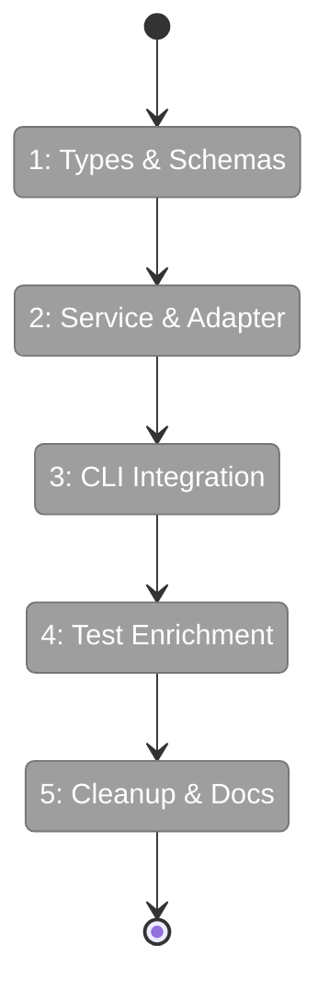
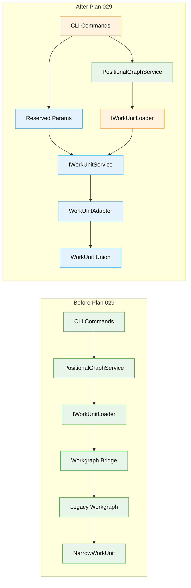

# Flight Plan: Plan 029 — Agentic Work Units

**Plan**: [../agentic-work-units-plan.md](../agentic-work-units-plan.md)
**Spec**: [../agentic-work-units-spec.md](../agentic-work-units-spec.md)
**Generated**: 2026-02-04
**Status**: Ready for takeoff

---

## Departure → Destination

**Where we are**: The positional-graph system has only `NarrowWorkUnit` — a minimal type with `slug`, `inputs`, and `outputs`. There's no way to distinguish between agent, code, and user-input units at runtime. Running agents cannot programmatically access their prompt templates. The system depends on a DI bridge to the legacy `@chainglass/workgraph` package for unit loading.

**Where we're going**: By the end of this plan, the positional-graph system will have full work unit type discrimination (`AgenticWorkUnit`, `CodeUnit`, `UserInputUnit`) with Zod validation. Agents will be able to retrieve their prompt templates by calling `cg wf node get-input-data <graph> <node> main-prompt`. Code units will access their scripts via `main-script`. The E2E test will verify all three unit types with sections 13-15. The legacy workgraph bridge will be removed — positional-graph will be fully self-contained.

---

## Flight Status

<!-- Updated during implementation: pending → active → done. Use blocked for problems/input needed. -->



**Legend**: grey = pending | yellow = active | red = blocked/needs input | green = done

---

## Phases Overview

<!-- Updated during implementation: [ ] → [~] → [x] -->

- [ ] **Phase 1: Types & Schemas** — Define discriminated union types, Zod schemas, and error factories E180-E187 (`features/029-agentic-work-units/` — new files)
- [ ] **Phase 2: Service & Adapter** — Implement WorkUnitAdapter and WorkUnitService with template content access and path escape security (`features/029-agentic-work-units/` — new files)
- [ ] **Phase 3: CLI Integration** — Add reserved parameter routing (`main-prompt`, `main-script`) and unit subcommands (`positional-graph.command.ts`, `container.ts` — modified)
- [ ] **Phase 4: Test Enrichment** — Add enriched fixtures, stubWorkUnitService, E2E sections 13-15 (`test-helpers.ts`, E2E test — modified)
- [ ] **Phase 5: Cleanup & Docs** — Remove workgraph bridge, migrate unit files, create documentation (`container.ts`, `.chainglass/units/`, `docs/how/` — modified/new)

---

## Architecture: Before & After



**Legend**: existing (green, unchanged) | changed (orange, modified) | new (blue, created)

---

## Key Deliverables

| Phase | Primary Output | Files |
|-------|---------------|-------|
| 1 | Discriminated union types + Zod schemas | `workunit.types.ts`, `workunit.schema.ts`, `workunit-errors.ts` |
| 2 | WorkUnit loading service with security | `workunit.adapter.ts`, `workunit.service.ts`, `fake-workunit.service.ts` |
| 3 | Reserved parameter routing in CLI | `positional-graph.command.ts`, `container.ts` |
| 4 | E2E test coverage for all unit types | `test-helpers.ts`, `positional-graph-execution-e2e.test.ts` |
| 5 | Self-contained positional-graph | `container.ts` (bridge removal), `docs/how/`, unit YAML files |

---

## Acceptance Criteria

From spec — all must pass for plan completion:

- [ ] AC-1: Discriminated union types load correctly via `IWorkUnitService.load()`
- [ ] AC-2: `main-prompt` returns prompt template content for AgenticWorkUnit
- [ ] AC-3: `main-script` returns script content for CodeUnit
- [ ] AC-4: `main-prompt` on CodeUnit returns E186 (UnitTypeMismatch)
- [ ] AC-5: `get-template` on UserInputUnit returns E183 (NoTemplate)
- [ ] AC-6: Backward compatibility — `WorkUnit` satisfies `NarrowWorkUnit`
- [ ] AC-7: Zod schema validation with descriptive E182 errors
- [ ] AC-8: E2E Section 13 verifies unit types
- [ ] AC-9: E2E Section 14 verifies reserved parameter routing
- [ ] AC-10: E2E Section 15 verifies Row 0 UserInputUnit

---

## Goals & Non-Goals

**Goals**:
- Create discriminated union types (`AgenticWorkUnit`, `CodeUnit`, `UserInputUnit`)
- Implement `IWorkUnitService` with `load()`, `list()`, `validate()`, `getTemplateContent()`
- Add reserved parameter routing (`main-prompt`, `main-script`) to CLI
- Maintain backward compatibility with `NarrowWorkUnit` consumers
- Add E2E test sections 13-15 for full coverage
- Remove legacy workgraph bridge from DI

**Non-Goals**:
- Agent orchestration/execution (building data infrastructure only)
- Template variable substitution (agents handle their own)
- Caching (always read from disk)
- Migration tooling (manual update of existing units)
- New top-level CLI commands (uses existing `get-input-data`)

---

## Critical Constraints

| Constraint | Reason | Enforcement |
|------------|--------|-------------|
| GREENFIELD | Legacy workgraph is being removed | No imports from `@chainglass/workgraph` |
| Structural compatibility | Existing consumers use NarrowWorkUnit | Type assertion + integration test |
| Path escape security | Template paths are user-specified | Containment check in `getTemplateContent()` |
| Type field required | Strict validation per spec | Zod schema rejects missing type |
| Fakes only | Per testing strategy | No `vi.mock()` or `jest.mock()` |

---

## Error Codes (E180-E187)

| Code | Name | When |
|------|------|------|
| E180 | unitNotFoundError | Unit folder or unit.yaml doesn't exist |
| E181 | unitYamlParseError | YAML syntax error |
| E182 | unitSchemaValidationError | Doesn't match WorkUnitSchema |
| E183 | unitNoTemplateError | getTemplateContent on UserInputUnit |
| E184 | unitPathEscapeError | Template path escapes unit folder |
| E185 | unitTemplateNotFoundError | Template file doesn't exist |
| E186 | unitTypeMismatchError | Reserved param on wrong unit type |
| E187 | unitSlugInvalidError | Invalid slug format |

---

## Phase Task Counts

| Phase | Tasks | Focus |
|-------|-------|-------|
| 1 | 9 | Types, schemas, errors |
| 2 | 11 | Service implementation, security |
| 3 | 10 | CLI routing, DI wiring |
| 4 | 9 | Test fixtures, E2E sections |
| 5 | 7 | Cleanup, migration, docs |
| **Total** | **46** | |

---

## PlanPak

Active — files organized under:
- `packages/positional-graph/src/features/029-agentic-work-units/` (plan-scoped code)
- `test/unit/positional-graph/features/029-agentic-work-units/` (plan-scoped tests)

Cross-cutting modifications in existing locations (DI, CLI, E2E test).

---

## Dependencies Graph

```
Phase 1: Types & Schemas
    │
    ▼
Phase 2: Service & Adapter
    │
    ├───────────────────┐
    ▼                   ▼
Phase 3: CLI        Phase 4: Test
    │                   │
    └───────┬───────────┘
            ▼
    Phase 5: Cleanup
```

---

## Quick Reference

**Reserved Parameters**:
- `main-prompt` → AgenticWorkUnit prompt template
- `main-script` → CodeUnit script content

**Unit Types**:
- `type: 'agent'` → requires `agent.prompt_template`
- `type: 'code'` → requires `code.script`
- `type: 'user-input'` → requires `user_input.question_type`

**Storage Layout**:
```
.chainglass/units/<slug>/
├── unit.yaml           # Unit definition
├── prompts/main.md     # AgenticWorkUnit template
└── scripts/main.sh     # CodeUnit script
```

---

*Flight Plan generated: 2026-02-04*
*Next step: `/plan-4-complete-the-plan` to validate readiness*
