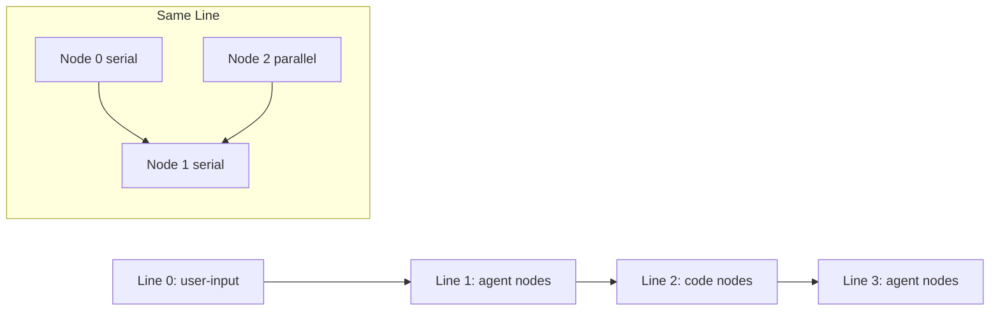

# Research Report: Positional Graph Orchestration System

**Generated**: 2026-02-05T10:30:00Z
**Research Query**: "Orchestrator system for positional graph with ONBAS, ODS, WorkUnitPods, AgentContextService"
**Mode**: Plan-Associated (branch 030-positional-orchestrator)
**Location**: docs/plans/030-positional-orchestrator/research-dossier.md
**FlowSpace**: Available
**Findings**: 55+ findings across 7 research domains

## Executive Summary

### What It Does
The positional graph orchestration system manages the execution of workflow graphs where nodes are organized in ordered lines. It determines what to do next (ONBAS), executes those actions (ODS), manages agent/code execution contexts (WorkUnitPods), and handles session continuity across nodes (AgentContextService).

### Business Purpose
Enable fully automated, TDD-testable workflow execution where agents and code units run in a deterministic, observable manner. The system must support parallel execution, question/answer protocols, and session resumption while remaining injectable for testing with fake agents.

### Key Insights
1. **Positional topology is semantic** — line ordering defines data flow, not visual layout. This eliminates DAG complexity (no cycle detection, no edge management).
2. **Four-gate readiness algorithm exists** — `canRun()` already implements precedingLinesComplete, transitionOpen, serialNeighborComplete, inputsAvailable gates.
3. **Discriminated union pattern established** — WorkUnits use `type: 'agent' | 'code' | 'user-input'` with type guards. Apply same pattern to OrchestrationRequest.

### Quick Stats
- **Components**: 25+ source files in `packages/positional-graph/`
- **Dependencies**: Zod schemas, domain events (Plan 027), property bags (Plan 022)
- **Test Coverage**: 25 unit test files, 2 integration suites, comprehensive fakes
- **Complexity**: HIGH — orchestration layer requires new state machines, pod management, context propagation
- **Prior Learnings**: 15 relevant discoveries from Plans 019, 022, 026, 027, 029

---

## How It Currently Works

### Entry Points

| Entry Point | Type | Location | Purpose |
|-------------|------|----------|---------|
| `PositionalGraphService` | Service | `packages/positional-graph/src/services/positional-graph.service.ts:88` | Core CRUD, status, lifecycle operations |
| `cg wf` commands | CLI | `apps/cli/src/commands/positional-graph.command.ts` | 30+ commands for graph manipulation |
| `IWorkUnitService` | Service | `packages/positional-graph/src/features/029-agentic-work-units/workunit.service.ts` | Load/validate work unit definitions |

### Core Execution Flow

1. **Graph Creation**: `create(ctx, slug)` generates lineId, initializes `graph.yaml` + `state.json`
2. **Node Addition**: `addNode(ctx, graphSlug, lineId, unitSlug)` validates WorkUnit, assigns nodeId
3. **Input Wiring**: `setInput(ctx, graphSlug, nodeId, inputName, resolution)` links node inputs to predecessor outputs
4. **Status Query**: `getNodeStatus(ctx, graphSlug, nodeId)` computes readiness via 4-gate algorithm
5. **Lifecycle**: `startNode()` → node runs → `askQuestion()` if needed → `answerQuestion()` → `endNode()`
6. **Output Storage**: `saveOutputData()`/`saveOutputFile()` persists results
7. **Line Transition**: When all nodes complete, auto/manual transition to next line

### Node Execution Status State Machine

```
pending (implicit) ──startNode()──> running
running ──endNode()──> complete
running ──askQuestion()──> waiting-question
waiting-question ──answerQuestion()──> running
any ──error──> blocked-error
```

**Critical**: Status stored in `state.json` takes precedence over computed status. Nodes without entries are implicitly `pending`.

### Four-Gate Readiness Algorithm (canRun)

```typescript
interface ReadinessDetail {
  precedingLinesComplete: boolean;  // Gate 1: All prior lines have complete nodes
  transitionOpen: boolean;           // Gate 2: Manual transition triggered (if applicable)
  serialNeighborComplete: boolean;   // Gate 3: Left neighbor complete (serial nodes only)
  inputsAvailable: boolean;          // Gate 4: collateInputs.ok is true
  unitFound: boolean;                // WorkUnit loads successfully
}
```

**Parallel nodes skip Gate 3** — they can start independently of left neighbor.

### Data Flow



Data flows from line N to line N+1 only. Within a line, serial nodes wait for left neighbor; parallel nodes execute independently.

### State Management

**Stored in `state.json`**:
```typescript
type State = {
  graph_status: 'pending' | 'in_progress' | 'complete' | 'failed';
  updated_at: string; // ISO 8601
  nodes?: Record<nodeId, NodeStateEntry>;
  transitions?: Record<lineId, { triggered: boolean }>;
  questions?: Question[];
};

type NodeStateEntry = {
  status: 'running' | 'waiting-question' | 'blocked-error' | 'complete';
  started_at?: string;
  completed_at?: string;
  pending_question_id?: string;
  error?: { code: string; message: string; details?: unknown };
};
```

**Atomic writes** via temp-then-rename pattern ensure consistency.

---

## Architecture & Design

### Component Map

```
packages/positional-graph/
├── src/
│   ├── services/
│   │   ├── positional-graph.service.ts    # Core service (2200+ lines)
│   │   └── input-resolution.ts            # collateInputs algorithm
│   ├── features/029-agentic-work-units/
│   │   ├── workunit.service.ts            # WorkUnit loading
│   │   ├── workunit.classes.ts            # Rich domain objects
│   │   ├── workunit.schema.ts             # Zod discriminated union
│   │   └── fake-workunit.service.ts       # Test double
│   ├── schemas/
│   │   ├── graph.schema.ts                # Graph definition
│   │   ├── state.schema.ts                # Runtime state
│   │   ├── orchestrator-settings.schema.ts
│   │   └── properties.schema.ts           # Extensible property bags
│   ├── interfaces/
│   │   └── positional-graph-service.interface.ts
│   ├── adapter/
│   │   └── positional-graph.adapter.ts    # Filesystem I/O
│   ├── errors/
│   │   └── positional-graph-errors.ts     # 28+ error factories
│   └── container.ts                       # DI registration
```

### Design Patterns Identified

#### 1. Discriminated Union Pattern
**Location**: `workunit.schema.ts`, `workunit.classes.ts`
```typescript
export type WorkUnitInstance =
  | AgenticWorkUnitInstance   // type: 'agent'
  | CodeUnitInstance          // type: 'code'
  | UserInputUnitInstance;    // type: 'user-input'

// Type guards for safe narrowing
export function isAgenticWorkUnit(unit: WorkUnitInstance): unit is AgenticWorkUnitInstance {
  return unit.type === 'agent';
}
```
**Apply to**: `OrchestrationRequest` with types like `'start-node' | 'continue-agent' | 'answer-question'`

#### 2. Result Types with Error Handling
**Location**: All service methods
```typescript
interface BaseResult {
  errors: ResultError[];
}

interface StartNodeResult extends BaseResult {
  status?: ExecutionStatus;
}
// Check: result.errors.length === 0 for success
```

#### 3. Snapshot/Memento Pattern
**Location**: `state.schema.ts`, `persistState()`
- State serialized to `state.json` with atomic writes
- Full graph state can be captured and restored
- **Extend for**: `PositionalGraphReality` snapshot

#### 4. Fake Test Doubles
**Location**: `fake-workunit.service.ts`, `fake-agent-adapter.ts`
```typescript
export class FakeWorkUnitService implements IWorkUnitService {
  private units = new Map<string, FakeUnitConfig>();
  addUnit(config): void { ... }
  setErrors(slug, errors): void { ... }
  reset(): void { ... }
}
```
**Apply to**: `FakeOrchestrator`, `FakePodManager`

### System Boundaries

- **Internal**: PositionalGraphService owns graph CRUD, status, lifecycle
- **External**: Agents via `IAgentAdapter`, filesystem via `IFileSystem`
- **Integration**: Domain events via `ICentralEventNotifier` (Plan 027)

---

## Dependencies & Integration

### What Positional Graph Depends On

| Dependency | Type | Purpose | DI Token |
|------------|------|---------|----------|
| `IFileSystem` | Required | File operations | `SHARED_DI_TOKENS.FILESYSTEM` |
| `IPathResolver` | Required | Path construction | `SHARED_DI_TOKENS.PATH_RESOLVER` |
| `IYamlParser` | Required | YAML parsing | `SHARED_DI_TOKENS.YAML_PARSER` |
| `IWorkUnitLoader` | Required | Load work unit definitions | `POSITIONAL_GRAPH_DI_TOKENS.WORK_UNIT_LOADER` |
| Zod | Library | Schema validation | N/A |

### What Depends on Positional Graph

| Consumer | How It Uses Graph | Contract |
|----------|-------------------|----------|
| CLI commands | `cg wf *` operations | Full service interface |
| Future Orchestrator | Status queries, lifecycle | `getNodeStatus`, `startNode`, `endNode` |
| Future Pods | Input resolution, output storage | `collateInputs`, `saveOutputData` |

### Domain Events Integration (Plan 027)

```typescript
// Central event notifier pattern
interface ICentralEventNotifier {
  emit(domain: WorkspaceDomainType, eventType: string, data: Record<string, unknown>): void;
}

// Usage for orchestration
notifier.emit('workgraphs', 'node-started', { graphSlug, nodeId });
notifier.emit('workgraphs', 'node-completed', { graphSlug, nodeId });
notifier.emit('workgraphs', 'question-asked', { graphSlug, nodeId, questionId });
```

### Agent Adapter Integration (Plan 019)

```typescript
interface IAgentAdapter {
  run(options: AgentRunOptions): Promise<AgentResult>;
  compact(sessionId: string): Promise<AgentResult>;
  terminate(sessionId: string): Promise<AgentResult>;
}

interface AgentResult {
  output: string;
  sessionId: string;  // For resumption
  status: 'completed' | 'failed' | 'killed';
  exitCode: number;
  tokens: { total: number; input: number; output: number };
}
```

---

## Quality & Testing

### Current Test Coverage

| Category | Files | Lines | Focus |
|----------|-------|-------|-------|
| Unit Tests | 25 | ~5,400 | Schema validation, canRun gates, input resolution |
| Integration | 2 | ~840 | Full lifecycle, input wiring |
| Fakes | 3 | ~800 | FakeWorkUnitService, FakeAgentAdapter |

### Fake Agent Infrastructure

**FakeAgentAdapter** (`packages/shared/src/fakes/fake-agent-adapter.ts`):
- Configurable responses (sessionId, output, status, exitCode)
- Call history tracking for assertions
- Event emission simulation
- Deterministic behavior for TDD

**FakeWorkUnitService** (`packages/positional-graph/.../fake-workunit.service.ts`):
- In-memory unit storage
- Template content stubbing
- Error injection capability
- Call tracking (getListCalls, getLoadCalls)

### Test Fixture: E2E Pipeline

```typescript
// 7-node, 3-line pipeline from test-helpers.ts
const e2eExecutionFixtures = {
  lines: [
    { nodes: ['spec-builder', 'spec-reviewer'] },      // Line 0
    { nodes: ['coder', 'tester'] },                    // Line 1
    { nodes: ['alignment-tester', 'pr-preparer', 'pr-creator'] }  // Line 2
  ]
};
```

### Testing Gaps for Orchestration

| Gap | Description | Recommendation |
|-----|-------------|----------------|
| Orchestrator Integration | No tests for agent execution against real state transitions | Create `/test/orchestrator/` suite |
| Parallel Execution | Only gate-skipping tested, not concurrent startup | Add parallel coordination tests |
| Question/Answer Flow | Mentioned in fixtures but no formal tests | Create `question-answer-lifecycle.test.ts` |
| Pod Lifecycle | No tests for pod provision/terminate | Add `pod-lifecycle.test.ts` |

---

## Modification Considerations

### ✅ Safe to Modify

1. **Orchestrator Settings Schema** (`orchestrator-settings.schema.ts`)
   - Currently minimal, reserved for extension
   - Add timeout, retry, resource settings

2. **Property Bags** (`properties.schema.ts`)
   - Open `.catchall(z.unknown())` design
   - Add pod-specific properties

3. **New Service Layer** (proposed orchestration services)
   - Greenfield implementation
   - Follows established DI patterns

### ⚠️ Modify with Caution

1. **State Schema** (`state.schema.ts`)
   - Adding `pod_status?: Record<string, PodState>` needs migration
   - Risk: Existing state.json files
   - Mitigation: Use optional field with backfill

2. **Node Status Computation** (`getNodeStatus`)
   - Core readiness logic
   - Risk: Breaking canRun gates
   - Mitigation: Add gates, don't modify existing

3. **Input Resolution** (`collateInputs`, `resolveInput`)
   - Critical algorithm with deterministic ordering
   - Risk: Breaking multi-source collection
   - Mitigation: Extensive test coverage before changes

### 🚫 Danger Zones

1. **Positional Semantics**
   - Line ordering IS topology
   - Changing this breaks fundamental invariant

2. **Atomic Write Pattern**
   - `atomicWriteFile()` prevents corruption
   - Never bypass for "performance"

3. **WorkUnit Discriminated Union**
   - Breaking schema breaks all unit loading
   - Add new types, don't modify existing

### Extension Points

1. **New WorkUnit Types**: Add to discriminated union in `workunit.schema.ts`
2. **New Orchestrator Settings**: Extend per-entity schemas
3. **New Status Values**: Add to `NodeExecutionStatus` enum
4. **New Domain Events**: Use `ICentralEventNotifier.emit()`

---

## Prior Learnings (From Previous Implementations)

### 📚 PL-01: Position IS Topology
**Source**: Plan 026, Phase 1-2
**Type**: decision
**Impact**: CRITICAL

**What They Found**: Line ordering in `graph.yaml` defines execution order and data flow direction. This is fundamentally different from DAG where position is visual.

**Action for Current Work**: Orchestration must respect positional invariants. Nodes cannot be reordered arbitrarily. Any movement must atomically update both graph definition and state files.

---

### 📚 PL-02: collateInputs Three-State Resolution
**Source**: Plan 026, Phase 5
**Type**: insight
**Impact**: CRITICAL

**What They Found**: Input resolution returns `InputPack` with three states: `available`, `waiting`, `error`. Multi-source inputs collect from ALL matching nodes deterministically.

**Action for Current Work**: Pods must request inputs via collateInputs before execution. Implement input caching with TTL for frequently-checked predecessors.

---

### 📚 PL-03: Four-Gate canRun Algorithm
**Source**: Plan 026, Phase 5
**Type**: insight
**Impact**: HIGH

**What They Found**: Node readiness uses 4 gates: precedingLinesComplete, transitionOpen, serialNeighborComplete, inputsAvailable. Execution mode is per-node, not per-line.

**Action for Current Work**: ONBAS should call `getNodeStatus()` to get readiness detail including which gates are blocking. Implement per-gate blocking reasons in OrchestrationRequest.

---

### 📚 PL-05: Stored Status Takes Precedence
**Source**: Plan 026, Phase 5
**Type**: gotcha
**Impact**: HIGH

**What They Found**: If `state.json` has stored status, use it. Only compute `pending`/`ready` for nodes without stored status.

**Action for Current Work**: Use state.json as event log for status transitions. Never overwrite stored status with computed — only clear on explicit reset.

---

### 📚 PL-08: Atomic File Writes Required
**Source**: Plan 026, Phase 2
**Type**: gotcha
**Impact**: HIGH

**What They Found**: Concurrent writes or crashes can corrupt files. Solution: temp-then-rename atomic pattern.

**Action for Current Work**: All orchestrator state updates must use `atomicWriteFile()`. Multi-process execution (CLI + web + pods) requires atomic guarantees.

---

### 📚 PL-09: DI Container Registration Order
**Source**: Plans 026, 027
**Type**: gotcha
**Impact**: MEDIUM

**What They Found**: Token definition in shared package BEFORE services can be registered. Circular dependency risk if not ordered.

**Action for Current Work**: Register `ORCHESTRATOR_DI_TOKENS` before any service using them. Follow: shared types → interfaces → tokens → services.

---

### 📚 PL-11: Workspace Context Throughout
**Source**: All Plans
**Type**: insight
**Impact**: CRITICAL

**What They Found**: All adapters accept `WorkspaceContext`. Data paths resolve via `worktreePath`, not hardcoded.

**Action for Current Work**: Pass workspace context through entire orchestration stack. Pods run within workspace context for storage isolation.

---

### 📚 PL-12: SSE Notification-Fetch Pattern
**Source**: Plans 022, 027
**Type**: insight
**Impact**: HIGH

**What They Found**: SSE sends lightweight notifications only. Client fetches full state via REST.

**Action for Current Work**: Pod completion notifications are fire-and-forget. Orchestrator polls state regularly, not just on SSE. UI refresh triggered by notification but data fetched from source of truth.

---

### 📚 PL-13: Contract Tests on Both Fake and Real
**Source**: Plan 027
**Type**: insight
**Impact**: HIGH

**What They Found**: Contract tests run against BOTH fake and real implementations.

**Action for Current Work**: Create `orchestratorContractTests()` factory. Run against `FakeOrchestrator` and `OrchestrationService`. Both must pass identical tests.

---

### 📚 PL-15: Register Event Handlers BEFORE Execute
**Source**: Plan 006 (Copilot SDK)
**Type**: gotcha
**Impact**: MEDIUM

**What They Found**: SDK event handlers must be registered BEFORE sending requests, or events are missed.

**Action for Current Work**: Pod context must register event handlers before `pod.execute()`. Document in AgentContextService.

---

### Prior Learnings Summary

| ID | Type | Source | Key Insight | Action |
|----|------|--------|-------------|--------|
| PL-01 | decision | 026 | Position IS topology | Respect ordering invariants |
| PL-02 | insight | 026 | Three-state input resolution | Use collateInputs for readiness |
| PL-03 | insight | 026 | Four-gate readiness | Call getNodeStatus for blocking reasons |
| PL-05 | gotcha | 026 | Stored status precedence | Never overwrite with computed |
| PL-08 | gotcha | 026 | Atomic writes required | Use atomicWriteFile always |
| PL-09 | gotcha | 027 | DI registration order | Define tokens before services |
| PL-11 | insight | all | Workspace context | Pass through entire stack |
| PL-12 | insight | 027 | Notification-fetch pattern | Poll after SSE, fetch full state |
| PL-13 | insight | 027 | Contract tests both | Factory for fake and real |
| PL-15 | gotcha | 006 | Register handlers first | Before execute, not after |

---

## Critical Discoveries

### 🚨 Critical Finding 01: Existing Infrastructure Supports Orchestration

**Impact**: Critical
**Source**: IA-01 through IA-10

The positional graph already has comprehensive infrastructure:
- **Status computation** with 4-gate readiness
- **State persistence** with atomic writes
- **Question/answer protocol** with `askQuestion`/`answerQuestion`
- **Input resolution** with deterministic backward search
- **Orchestrator settings** for execution mode and transitions

**Required Action**: ONBAS should wrap existing `getNodeStatus()` and `getLineStatus()` rather than reimplementing readiness logic.

---

### 🚨 Critical Finding 02: WorkUnitPods Need New Abstraction Layer

**Impact**: Critical
**Source**: IA-03, DC-05, PS-05

WorkUnits define behavior but don't execute. Pods are the execution containers. Current architecture has:
- `WorkUnitInstance` — rich domain objects with `getPrompt()`, `getScript()`
- `IAgentAdapter` — runs agents with session management
- No glue layer connecting them

**Required Action**: Create `WorkUnitPod` abstraction that:
1. Wraps a node + its WorkUnit
2. Manages agent/code execution lifecycle
3. Stores session ID for resumption
4. Handles question/answer protocol

---

### 🚨 Critical Finding 03: Session Context Rules Need Implementation

**Impact**: Critical
**Source**: User requirements (AgentContextService)

The user defined clear rules for context continuity:
- First node in line gets context from first AGENT node on previous line
- Serial→serial inherits from left neighbor
- Parallel→serial inherits from direct left
- Standalone parallel gets new context

**Required Action**: Implement `AgentContextService` with lookup algorithm based on these rules. Service returns "context from node X" or "new" for any given node.

---

### 🚨 Critical Finding 04: PositionalGraphReality Enables TDD

**Impact**: Critical
**Source**: User requirements, PS-02

The user explicitly wants a snapshot object (`PositionalGraphReality`) that captures entire graph state for testing:
- Easy to fake
- Easy to store and mutate
- Easy to use real snapshots in tests

**Required Action**: Extend `getStatus()` to return comprehensive `PositionalGraphReality` with all nodes, their statuses, their readiness details, and current line completion state.

---

## Proposed Contracts

### OrchestrationRequest (Discriminated Union)

```typescript
// Following established pattern from WorkUnit
export type OrchestrationRequest =
  | StartNodeRequest
  | ContinueAgentRequest
  | AnswerQuestionRequest
  | WaitingRequest
  | CompleteRequest;

interface StartNodeRequest {
  type: 'start-node';
  graphSlug: string;
  nodeId: string;
  inputs: InputPack;
  contextNodeId?: string; // For session resumption
}

interface ContinueAgentRequest {
  type: 'continue-agent';
  graphSlug: string;
  nodeId: string;
  sessionId: string;
}

interface AnswerQuestionRequest {
  type: 'answer-question';
  graphSlug: string;
  nodeId: string;
  questionId: string;
  answer: unknown;
}

interface WaitingRequest {
  type: 'waiting';
  reason: 'question-pending' | 'inputs-waiting' | 'transition-blocked';
  graphSlug: string;
  nodeId: string;
}

interface CompleteRequest {
  type: 'complete';
  graphSlug: string;
  allNodesComplete: true;
}
```

### PositionalGraphReality (Snapshot)

```typescript
interface PositionalGraphReality {
  graphSlug: string;
  graphStatus: 'pending' | 'in_progress' | 'complete' | 'failed';
  snapshotAt: string; // ISO 8601

  lines: LineReality[];
  nodes: Record<string, NodeReality>;

  // Convenience accessors
  currentLine: number; // First incomplete line
  readyNodes: string[];
  runningNodes: string[];
  waitingQuestionNodes: string[];
  completeNodes: string[];
}

interface LineReality {
  lineId: string;
  index: number;
  label?: string;
  transition: 'auto' | 'manual';
  transitionTriggered: boolean;
  isComplete: boolean;
  nodeIds: string[];
}

interface NodeReality {
  nodeId: string;
  lineIndex: number;
  positionInLine: number;
  unitSlug: string;
  unitType: 'agent' | 'code' | 'user-input';

  status: ExecutionStatus;
  ready: boolean;
  readyDetail: ReadinessDetail;

  execution: 'serial' | 'parallel';

  // Pod state (if running/completed)
  podSessionId?: string;
  podStartedAt?: string;
  podCompletedAt?: string;

  // Question state
  pendingQuestionId?: string;

  // Inputs
  inputPack?: InputPack;
}
```

### IOrchestrationNextBestActionService (ONBAS)

```typescript
interface IOrchestrationNextBestActionService {
  /**
   * Analyze graph and determine next action.
   * Walks graph until finding actionable item, then stops.
   */
  getNextAction(
    ctx: WorkspaceContext,
    graphSlug: string
  ): Promise<OrchestrationRequestResult>;
}

interface OrchestrationRequestResult extends BaseResult {
  request?: OrchestrationRequest;
  reality?: PositionalGraphReality; // For debugging/testing
}
```

### IOrchestrationDoerService (ODS)

```typescript
interface IOrchestrationDoerService {
  /**
   * Execute an orchestration request.
   * Works with WorkUnitPods to run agents/code.
   */
  execute(
    ctx: WorkspaceContext,
    request: OrchestrationRequest
  ): Promise<OrchestrationExecuteResult>;
}

interface OrchestrationExecuteResult extends BaseResult {
  nodeId?: string;
  newStatus?: ExecutionStatus;
  sessionId?: string;
}
```

### IAgentContextService

```typescript
interface IAgentContextService {
  /**
   * Determine context source for a node.
   * Returns node ID to get session from, or 'new' for fresh context.
   */
  getContextSource(
    reality: PositionalGraphReality,
    nodeId: string
  ): ContextSourceResult;
}

interface ContextSourceResult {
  source: 'inherit' | 'new';
  fromNodeId?: string; // When source === 'inherit'
  reason: string; // Human-readable explanation
}
```

### IWorkUnitPodManager

```typescript
interface IWorkUnitPodManager {
  /**
   * Create or retrieve pod for a node.
   */
  getPod(
    ctx: WorkspaceContext,
    graphSlug: string,
    nodeId: string
  ): Promise<IWorkUnitPod>;

  /**
   * List all active pods.
   */
  listPods(ctx: WorkspaceContext): Promise<PodSummary[]>;

  /**
   * Rehydrate pods from persisted state.
   */
  rehydrate(ctx: WorkspaceContext, graphSlug: string): Promise<void>;
}

interface IWorkUnitPod {
  readonly nodeId: string;
  readonly unitType: 'agent' | 'code' | 'user-input';
  readonly status: PodStatus;
  readonly sessionId?: string;

  execute(inputs: InputPack, contextSessionId?: string): Promise<PodExecuteResult>;
  pause(): Promise<void>;
  resume(): Promise<void>;
  terminate(): Promise<void>;

  answerQuestion(questionId: string, answer: unknown): Promise<void>;
}

type PodStatus = 'idle' | 'running' | 'paused' | 'waiting-question' | 'completed' | 'error';
```

---

## Recommendations

### If Implementing ONBAS
1. **Use existing `getStatus()`** — it already aggregates line and node status
2. **Build PositionalGraphReality** by extending status response with pod info
3. **Walk rules simply** — check currentLine, find first actionable node, return request
4. **Support parallel** — when multiple nodes ready, return request for first; subsequent calls return next

### If Implementing ODS
1. **Create PodManager** — track active pods in memory, persist sessions
2. **Map request types to actions** — `start-node` creates pod, `answer-question` continues pod
3. **Use atomic state updates** — all status changes via `atomicWriteFile()`
4. **Emit domain events** — notify UI of status changes

### If Implementing AgentContextService
1. **Pure function on reality** — no side effects, just lookup
2. **Implement context rules** — first-in-line from prev line, serial from left, parallel new
3. **Cache nothing** — reality already snapshot, compute on demand

### If Implementing WorkUnitPods
1. **Extend FakeAgentAdapter pattern** — deterministic for tests
2. **Manage lifecycle explicitly** — idle→running→paused→completed
3. **Serialize session ID** — for server restart rehydration
4. **Handle question protocol** — via pod.answerQuestion()

---

## External Research Opportunities

### Research Opportunity 1: State Machine Libraries for TypeScript

**Why Needed**: Pod lifecycle and node execution are state machines. Consider XState or similar for formal modeling.
**Impact on Plan**: Could simplify Pod implementation and enable visualization.
**Source Findings**: PS-03 (State Machine Pattern)

**Ready-to-use prompt:**
```
/deepresearch "Compare TypeScript state machine libraries (XState, Robot, etc.) for workflow orchestration:
- Pod lifecycle states: idle → running → paused → waiting-question → completed → error
- Node execution states: pending → ready → running → complete
- Requirements: serializable, testable, TypeScript-first
- Context: Positional graph orchestration with ~100 concurrent pods
Evaluate: bundle size, learning curve, testing patterns, persistence support"
```

### Research Opportunity 2: Distributed Locking for Multi-Process Graph Access

**Why Needed**: CLI, web server, and agents may modify graph state concurrently.
**Impact on Plan**: May need file locking or coordination service.
**Source Findings**: IA-10 (no locking visible), PL-08 (atomic writes exist)

**Ready-to-use prompt:**
```
/deepresearch "Strategies for coordinating file-based state access across processes in Node.js:
- Scenario: CLI tool, web server, agent subprocesses all access state.json
- Current: Atomic writes (temp-then-rename) prevent corruption
- Need: Coordination to prevent lost updates (read-modify-write races)
- Constraints: No external services (Redis, etc.), must work on macOS/Linux
Evaluate: proper-lockfile, lockfile, advisory locks, optimistic concurrency with version field"
```

---

## Appendix: File Inventory

### Core Service Files
| File | Purpose | Lines |
|------|---------|-------|
| `packages/positional-graph/src/services/positional-graph.service.ts` | Core CRUD, status, lifecycle | 2336 |
| `packages/positional-graph/src/services/input-resolution.ts` | collateInputs algorithm | 381 |
| `packages/positional-graph/src/container.ts` | DI registration | 68 |

### Schema Files
| File | Purpose | Lines |
|------|---------|-------|
| `packages/positional-graph/src/schemas/graph.schema.ts` | Graph definition | ~100 |
| `packages/positional-graph/src/schemas/state.schema.ts` | Runtime state | 102 |
| `packages/positional-graph/src/schemas/orchestrator-settings.schema.ts` | Execution settings | 25 |

### WorkUnit Files
| File | Purpose | Lines |
|------|---------|-------|
| `packages/positional-graph/src/features/029-agentic-work-units/workunit.schema.ts` | Zod schemas | ~211 |
| `packages/positional-graph/src/features/029-agentic-work-units/workunit.classes.ts` | Rich domain objects | 113 |
| `packages/positional-graph/src/features/029-agentic-work-units/workunit.service.ts` | Loading service | ~200 |
| `packages/positional-graph/src/features/029-agentic-work-units/fake-workunit.service.ts` | Test double | 342 |

### Test Files
| File | Purpose | Lines |
|------|---------|-------|
| `test/unit/positional-graph/can-run.test.ts` | 4-gate algorithm | 337 |
| `test/unit/positional-graph/collate-inputs.test.ts` | Input resolution | 622 |
| `test/unit/positional-graph/execution-lifecycle.test.ts` | State transitions | 596 |
| `test/integration/positional-graph/graph-lifecycle.test.ts` | Full lifecycle | 385 |
| `test/unit/positional-graph/test-helpers.ts` | Factories | 820 |

---

## Next Steps

1. Run `/deepresearch` prompts above for external research (optional)
2. Save results to `external-research/` folder if conducted
3. Run `/plan-1b-specify "Positional Graph Orchestration System"` to create specification

---

**Research Complete**: 2026-02-05T10:30:00Z
**Report Location**: docs/plans/030-positional-orchestrator/research-dossier.md
