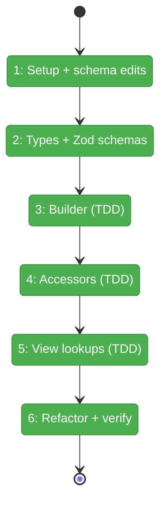
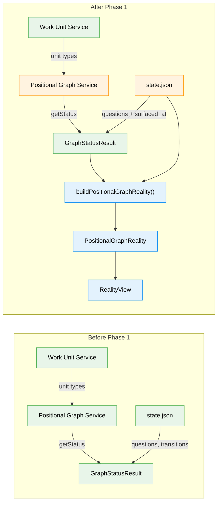

# Flight Plan: Phase 1 — PositionalGraphReality Snapshot

**Plan**: [../../positional-orchestrator-plan.md](../../positional-orchestrator-plan.md)
**Phase**: Phase 1: PositionalGraphReality Snapshot
**Generated**: 2026-02-05
**Status**: Complete

---

## Departure → Destination

**Where we are**: The positional graph system (Plan 026) can create graphs with ordered lines, serial/parallel nodes, and 4-gate readiness. Plan 029 added agentic work units (agent, code, user-input types) with execution lifecycle commands. The graph has structure and state — but no engine to drive it. There is no unified snapshot of graph state, no way for a decision engine to see everything at once.

**Where we're going**: By the end of this phase, a `buildPositionalGraphReality()` function will produce a complete, read-only snapshot of any graph — lines, nodes, questions, pod sessions, and pre-computed accessors — from existing service outputs. A test can construct a snapshot directly (no filesystem) and verify that `reality.readyNodeIds` returns the right nodes, `reality.isComplete` is correct, and `reality.podSessions` maps sessions to nodes. Every downstream phase (ONBAS, ODS, orchestration loop) will build on this snapshot.

---

## Flight Status

<!-- Updated by /plan-6: pending → active → done. Use blocked for problems/input needed. -->

**Legend**: grey = pending | yellow = active | red = blocked/needs input | green = done

---

## Stages

<!-- Updated by /plan-6 during implementation: [ ] → [~] → [x] -->

- [x] **Stage 1: Setup and schema edits** — create PlanPak folder `030-orchestration/` with barrel index; add `unitType` to `NarrowWorkUnit` and `NodeStatusResult` (cross-plan edit to `positional-graph-service.interface.ts`); add `surfaced_at` to `QuestionSchema` (cross-plan edit to `state.schema.ts`); verify existing tests still pass
- [x] **Stage 2: Define types and schemas** — create `reality.types.ts` with `PositionalGraphReality`, `NodeReality`, `LineReality`, `QuestionReality` interfaces; create `reality.schema.ts` with matching Zod schemas (`reality.types.ts`, `reality.schema.ts` — new files)
- [x] **Stage 3: Builder via TDD** — write failing tests for `buildPositionalGraphReality()` covering empty graph, multi-line, mixed statuses, questions, pod sessions, InputPack; implement builder to make tests pass (`reality.test.ts` — new file, `reality.builder.ts` — new file)
- [x] **Stage 4: Convenience accessors via TDD** — write failing tests for `currentLineIndex`, `readyNodeIds`, `isComplete`, `isFailed`, and 7 other accessors; implement computation in builder (`reality.test.ts`, `reality.builder.ts`)
- [x] **Stage 5: View lookups via TDD** — write failing tests for `PositionalGraphRealityView` methods (`getNode`, `getLeftNeighbor`, `getFirstAgentOnPreviousLine`, etc.); implement view class (`reality.test.ts`, `reality.view.ts` — new file)
- [x] **Stage 6: Refactor and verify** — update barrel index exports, clean up code, run `just fft` to confirm lint + format + all tests pass

---

## Acceptance Criteria

- [x] Snapshot captures all lines with completion status, transition state, and node membership (AC-1)
- [x] Snapshot captures all nodes with execution status, 4-gate readiness, unit type, and position (AC-1)
- [x] Snapshot captures all questions with lifecycle state: asked, surfaced, answered (AC-1)
- [x] Snapshot captures pod session IDs mapped to nodes (AC-1)
- [x] Pre-computed accessors return correct values: `currentLineIndex`, `readyNodeIds`, `runningNodeIds`, `waitingQuestionNodeIds`, `completedNodeIds`, `isComplete`, `isFailed` (AC-1)
- [x] Snapshot includes resolved InputPack for each node (AC-14, Phase 1 portion)
- [x] Schema accepts existing state.json without error — backward compatible (Finding #14)
- [x] All tests passing, `just fft` clean

---

## Goals & Non-Goals

**Goals**:
- Create PlanPak feature folder `030-orchestration/` with barrel index
- Define PositionalGraphReality, NodeReality, LineReality, QuestionReality types and Zod schemas
- Implement `buildPositionalGraphReality()` builder function
- Implement `PositionalGraphRealityView` with lookup methods
- Add `unitType` to `NarrowWorkUnit` and `NodeStatusResult` (cross-plan edit)
- Add `surfaced_at` to `QuestionSchema` (cross-plan edit)
- Full TDD with 5-field Test Doc on every test

**Non-Goals**:
- DI registration (Phase 7)
- Pod session persistence (Phase 4 — just a `Map` parameter here)
- Serialization/deserialization of the snapshot
- Performance optimization / lazy accessors
- Fake/contract test pattern (builder is a pure function, not an interface)

---

## Architecture: Before & After

**Legend**: existing (green, unchanged) | changed (orange, modified) | new (blue, created)

---

## Checklist

- [x] T001: Create feature folder with barrel index (CS-1)
- [x] T002: Add unitType to NarrowWorkUnit and NodeStatusResult (CS-2)
- [x] T003: Add surfaced_at to QuestionSchema (CS-1)
- [x] T004: Define Reality TypeScript interfaces (CS-2)
- [x] T005: Define Reality Zod schemas (CS-2)
- [x] T006: Write builder tests — RED (CS-2)
- [x] T007: Implement builder — GREEN (CS-3)
- [x] T008: Write accessor tests — RED (CS-2)
- [x] T009: Implement accessors — GREEN (CS-2)
- [x] T010: Write view lookup tests — RED (CS-2)
- [x] T011: Implement PositionalGraphRealityView — GREEN (CS-2)
- [x] T012: Refactor and verify `just fft` (CS-1)

---

## PlanPak

Active — files organized under `features/030-orchestration/`
