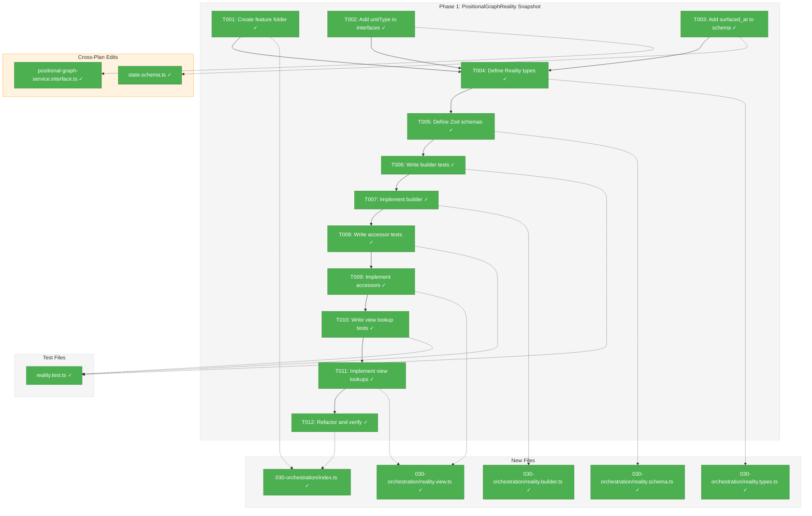
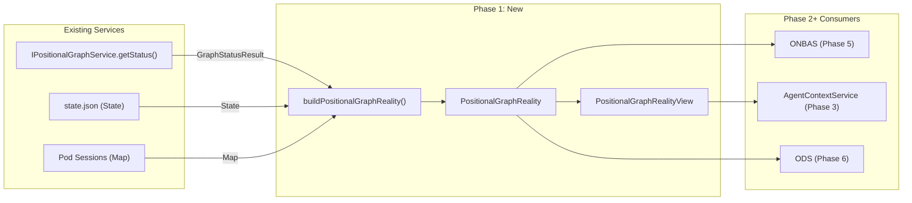
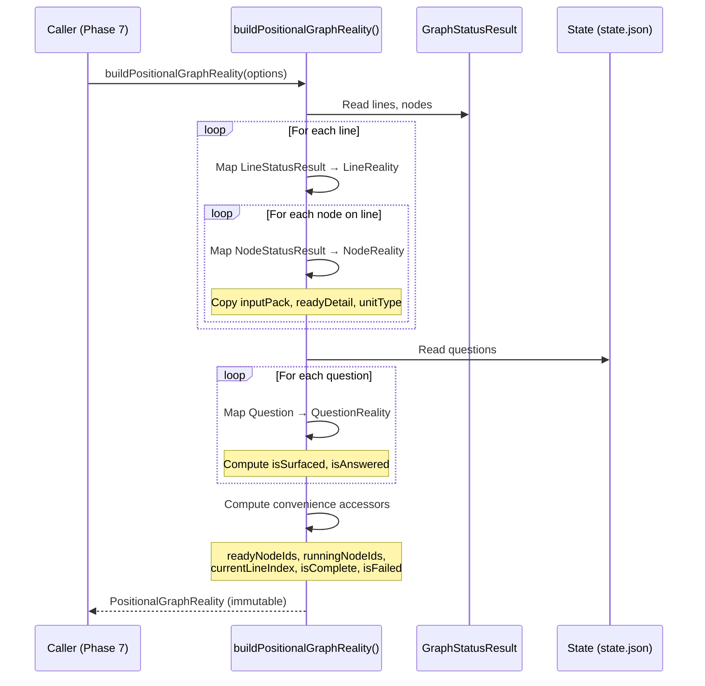

# Phase 1: PositionalGraphReality Snapshot — Tasks & Alignment Brief

**Spec**: [../../positional-orchestrator-spec.md](../../positional-orchestrator-spec.md)
**Plan**: [../../positional-orchestrator-plan.md](../../positional-orchestrator-plan.md)
**Workshop**: [../../workshops/01-positional-graph-reality.md](../../workshops/01-positional-graph-reality.md)
**Date**: 2026-02-05

---

## Executive Briefing

### Purpose

This phase creates the foundational data model for the entire orchestration system. PositionalGraphReality is an immutable snapshot object that captures the complete state of a positional graph at a moment in time — every line, every node, every question, every pod session — enabling pure-function decision logic (ONBAS) and deterministic testing without filesystem access.

### What We're Building

A `buildPositionalGraphReality()` function that composes existing service outputs (`GraphStatusResult` from `getStatus()` and `State` from `state.json`) with pod session data into a single, read-only snapshot. The snapshot includes:
- All lines with completion status, transition state, and node membership
- All nodes with execution status, 4-gate readiness, work unit type, and resolved inputs
- All questions with their 3-state lifecycle (asked → surfaced → answered)
- Pod session IDs mapped to nodes
- Pre-computed convenience accessors for common queries
- A `PositionalGraphRealityView` class for ergonomic lookups (left neighbor, previous line agents, etc.)

### User Value

Every downstream phase (2-8) depends on this snapshot. ONBAS receives it to decide the next action. ODS reads it to execute actions. Tests construct snapshots directly without touching the filesystem, enabling fast, deterministic orchestration testing.

### Example

**Input**: `GraphStatusResult` with 2 lines (line-0: complete user-input node, line-1: ready agent node) + empty `State` + no pod sessions.

**Output**:
```typescript
{
  graphSlug: 'my-graph',
  graphStatus: 'in_progress',
  lines: [{ lineId: 'line-0', isComplete: true, ... }, { lineId: 'line-1', isComplete: false, ... }],
  nodes: Map { 'node-001' => { status: 'complete', unitType: 'user-input', ... }, 'node-002' => { status: 'ready', unitType: 'agent', ... } },
  readyNodeIds: ['node-002'],
  currentLineIndex: 1,
  isComplete: false,
  ...
}
```

---

## Objectives & Scope

### Objective

Implement the PositionalGraphReality snapshot model as specified in the plan Phase 1 (plan tasks 1.1-1.7) and Workshop #1. The snapshot must satisfy AC-1 (full graph state capture) and AC-14 (InputPack inclusion for input wiring).

**Behavior checklist**:
- [ ] Snapshot wraps `GraphStatusResult` via composition (not inheritance)
- [ ] All new schema fields are optional for backward compatibility (Finding #14)
- [ ] Builder composes existing service output — never re-implements gate logic (Finding #01)
- [ ] Convenience accessors are computed from mapped data, not re-queried
- [ ] `ReadonlyMap` used for nodes and podSessions for immutability

### Goals

- ✅ Create PlanPak feature folder `030-orchestration/` with barrel index
- ✅ Define PositionalGraphReality, NodeReality, LineReality, QuestionReality types and Zod schemas
- ✅ Implement `buildPositionalGraphReality()` builder function
- ✅ Implement `PositionalGraphRealityView` with lookup methods
- ✅ Add `unitType` to `NarrowWorkUnit` and `NodeStatusResult` (cross-plan edit)
- ✅ Add `surfaced_at` to `QuestionSchema` in state.schema.ts (cross-plan edit)
- ✅ Full TDD: tests written before implementation, covering all edge cases
- ✅ All tests passing, `just fft` clean

### Non-Goals

- ❌ DI registration (defer to Phase 7 — no DI token needed for Phase 1)
- ❌ Fake/contract test pattern for the builder (it's a pure function, not an interface-backed service)
- ❌ Pod session persistence (Phase 4 — podSessions is just a `Map<string, string>` parameter here)
- ❌ Modifying `PositionalGraphService.getNodeStatus()` implementation (we add the interface field; implementation update is a cross-plan edit scoped to this phase)
- ❌ Serialization/deserialization of PositionalGraphReality to JSON (only needed if snapshot persistence is required; ONBAS consumes in-memory)
- ❌ Performance optimization (lazy accessors) — defer unless profiling shows need
- ❌ Updating existing tests that mock `NodeStatusResult` — the new `unitType` field is optional

---

## Pre-Implementation Audit

### Summary

| File | Action | Origin | Modified By | Recommendation |
|------|--------|--------|-------------|----------------|
| `.../features/030-orchestration/` | Created | Plan 030 | — | keep-as-is |
| `.../features/030-orchestration/index.ts` | Created | Plan 030 | — | keep-as-is |
| `.../features/030-orchestration/reality.types.ts` | Created | Plan 030 | — | keep-as-is |
| `.../features/030-orchestration/reality.schema.ts` | Created | Plan 030 | — | keep-as-is |
| `.../features/030-orchestration/reality.builder.ts` | Created | Plan 030 | — | keep-as-is |
| `.../features/030-orchestration/reality.view.ts` | Created | Plan 030 | — | keep-as-is |
| `test/.../030-orchestration/reality.test.ts` | Created | Plan 030 | — | keep-as-is |
| `.../interfaces/positional-graph-service.interface.ts` | Modified | Plan 026 | Plan 029 | cross-plan-edit |
| `.../schemas/state.schema.ts` | Modified | Plan 028 | — | cross-plan-edit |

### Cross-Plan Edits

**1. `NodeStatusResult` + `unitType` field** (`positional-graph-service.interface.ts`)
- **Origin**: Plan 026 (commit `1e1d632`), modified by Plan 029 (commit `9725d2d`)
- **Change**: Add `unitType?: 'agent' | 'code' | 'user-input'` to `NodeStatusResult`
- **Also**: Add `type: 'agent' | 'code' | 'user-input'` to `NarrowWorkUnit`
- **Rationale**: Workshop #1 Q3 (Option 1); needed by `NodeReality.unitType` for ONBAS/ODS discrimination
- **Risk**: LOW — optional field, backward compatible
- **Also requires**: Update `PositionalGraphService.getNodeStatus()` to populate the field from `IWorkUnitLoader.load()` result

**2. `QuestionSchema` + `surfaced_at` field** (`state.schema.ts`)
- **Origin**: Plan 028 (commit `acf5e9c`)
- **Change**: Add `surfaced_at: z.string().datetime().optional()` to `QuestionSchema`
- **Rationale**: Workshop #1 Q4; AC-9 question lifecycle needs 3 states
- **Risk**: LOW — optional field, backward compatible per Finding #14

### Compliance Check

No violations found. All files comply with:
- R-CODE-003 (kebab-case naming)
- R-TEST-006 (centralized test placement)
- R-ARCH-002/003 (interface-first, Zod-first)
- PlanPak classification (plan-scoped in `features/030-orchestration/`, cross-cutting in interfaces/schemas)
- ADR-0004 (no DI needed yet)

---

## Requirements Traceability

### Coverage Matrix

| AC | Description | Flow Summary | Files in Flow | Tasks | Status |
|----|-------------|--------------|---------------|-------|--------|
| AC-1 | Snapshot captures full graph state | `getStatus()` → `GraphStatusResult` + `state.json` → `State` + pod sessions → `buildPositionalGraphReality()` → `PositionalGraphReality` with all lines, nodes, questions, pod sessions, convenience accessors | interface.ts, state.schema.ts, reality.types.ts, reality.schema.ts, reality.builder.ts, reality.view.ts, reality.test.ts | T001-T012 | ✅ Complete |
| AC-14 (P1) | InputPack included in snapshot | `NodeStatusResult.inputPack` → copied to `NodeReality.inputPack` by builder | interface.ts, reality.builder.ts, reality.test.ts | T005, T006, T007 | ✅ Complete |

### Gaps Found

Two blocking schema changes were identified and are included as tasks T002-T003:
1. `NarrowWorkUnit` missing `type` field → Added as T002
2. `QuestionSchema` missing `surfaced_at` → Added as T003

Both are resolved by tasks in this phase. No remaining gaps.

### Orphan Files

None. All files map to AC-1 or AC-14.

---

## Architecture Map

### Component Diagram

<!-- Status: grey=pending, orange=in-progress, green=completed, red=blocked -->
<!-- Updated by plan-6 during implementation -->



### Task-to-Component Mapping

<!-- Status: ⬜ Pending | 🟧 In Progress | ✅ Complete | 🔴 Blocked -->

| Task | Component(s) | Files | Status | Comment |
|------|-------------|-------|--------|---------|
| T001 | Feature folder setup | index.ts | ✅ Complete | PlanPak directory + empty barrel |
| T002 | NarrowWorkUnit + NodeStatusResult | interface.ts, service.ts | ✅ Complete | Cross-plan: add unitType |
| T003 | QuestionSchema | state.schema.ts | ✅ Complete | Cross-plan: add surfaced_at |
| T004 | Reality types | reality.types.ts | ✅ Complete | TS interfaces per Workshop #1 |
| T005 | Reality schemas | reality.schema.ts | ✅ Complete | Zod schemas per Workshop #1 |
| T006 | Builder tests | reality.test.ts | ✅ Complete | RED: tests for builder |
| T007 | Builder impl | reality.builder.ts | ✅ Complete | GREEN: make tests pass |
| T008 | Accessor tests | reality.test.ts | ✅ Complete | RED: tests for convenience accessors |
| T009 | Accessor impl | reality.builder.ts | ✅ Complete | GREEN: compute accessors in builder |
| T010 | View tests | reality.test.ts | ✅ Complete | RED: tests for view lookups |
| T011 | View impl | reality.view.ts | ✅ Complete | GREEN: PositionalGraphRealityView |
| T012 | Refactor + verify | all files | ✅ Complete | REFACTOR: `just fft` clean |

---

## Tasks

| Status | ID | Task | CS | Type | Dependencies | Absolute Path(s) | Validation | Subtasks | Notes |
|--------|------|------|-----|------|-------------|-------------------|------------|----------|-------|
| [x] | T001 | Create feature folder `030-orchestration/` with `index.ts` barrel stub | 1 | Setup | – | `/home/jak/substrate/030-positional-orchestrator/packages/positional-graph/src/features/030-orchestration/index.ts` | Directory exists, empty `index.ts` compiles with `pnpm build` | – | plan-scoped; plan task 1.1 |
| [x] | T002 | Add `type` field to `NarrowWorkUnit` and `unitType` to `NodeStatusResult`; populate `unitType` in `getNodeStatus()` | 2 | Core | T001 | `/home/jak/substrate/030-positional-orchestrator/packages/positional-graph/src/interfaces/positional-graph-service.interface.ts`, `/home/jak/substrate/030-positional-orchestrator/packages/positional-graph/src/services/positional-graph.service.ts` | **DYK-I5**: `NodeStatusResult.unitType` is **required** (not optional) — `unitType: 'agent' \| 'code' \| 'user-input'`. `NarrowWorkUnit` has `type: 'agent' \| 'code' \| 'user-input'` (also required). `getNodeStatus()` populates from `unitResult.unit.type` via loader. `IWorkUnitLoader` adapter must copy `type` from full `WorkUnit` into `NarrowWorkUnit`. Existing tests must be updated to include `unitType`. Compiler enforces no silent `undefined`. | – | cross-plan-edit; Workshop #1 Q3 Option 1 |
| [x] | T003 | Add `surfaced_at` optional field to `QuestionSchema` in state.schema.ts | 1 | Core | – | `/home/jak/substrate/030-positional-orchestrator/packages/positional-graph/src/schemas/state.schema.ts` | Schema parses existing question data without error; new field is optional; existing tests pass | – | cross-plan-edit; Workshop #1 Q4; Finding #14 |
| [x] | T004 | Define `PositionalGraphReality`, `NodeReality`, `LineReality`, `QuestionReality`, `ExecutionStatus`, `ReadinessDetail`, `NodeError` TypeScript interfaces | 2 | Core | T001, T002, T003 | `/home/jak/substrate/030-positional-orchestrator/packages/positional-graph/src/features/030-orchestration/reality.types.ts` | Types compile, exported from index.ts; match Workshop #1 schema lines 88-267. **DYK-I2**: `QuestionReality.options` uses `{ key: string; label: string }[]` (not `string[]` as in Workshop #1 line 293) to align with `NodeStatusResult.pendingQuestion.options` format. | – | plan-scoped; plan task 1.2 |
| [x] | T005 | Define Zod schemas for leaf types: `NodeRealitySchema`, `LineRealitySchema`, `QuestionRealitySchema`, `ExecutionStatusSchema`, `ReadinessDetailSchema`, `NodeErrorSchema` | 2 | Core | T004 | `/home/jak/substrate/030-positional-orchestrator/packages/positional-graph/src/features/030-orchestration/reality.schema.ts` | Schemas validate sample data; types derive via `z.infer`; exported from index.ts. `QuestionRealitySchema.options` uses `z.array(z.object({ key: z.string(), label: z.string() }))` per DYK-I2. **DYK-I4**: Skip top-level `PositionalGraphRealitySchema` — the runtime object uses `ReadonlyMap` (not JSON-serializable arrays), and serialization is a non-goal. Validate at leaf level only. | – | plan-scoped; plan task 1.2 |
| [x] | T006 | Write tests for `buildPositionalGraphReality()` (RED phase) | 2 | Test | T004, T005 | `/home/jak/substrate/030-positional-orchestrator/test/unit/positional-graph/features/030-orchestration/reality.test.ts` | Tests cover: empty graph, single-line, multi-line, mixed statuses (pending/ready/running/waiting-question/blocked-error/complete), questions (3 states), pod sessions map, InputPack inclusion. All tests FAIL (no implementation yet). 5-field Test Doc on each `it()`. | – | plan-scoped; plan task 1.3 |
| [x] | T007 | Implement `buildPositionalGraphReality()` (GREEN phase) | 3 | Core | T006 | `/home/jak/substrate/030-positional-orchestrator/packages/positional-graph/src/features/030-orchestration/reality.builder.ts` | All tests from T006 pass. Builder composes `GraphStatusResult` + `State` + pod sessions. Never re-implements gate logic (Finding #01). Builder reads `NodeStatusResult.unitType` directly (added by T002) — do NOT implement `inferUnitType()` from Workshop #1 line 484; that is pseudocode for a problem T002 solves. **DYK-I2**: Builder normalizes `State.questions[].options` (plain `string[]`) to `{ key, label }[]` format for `QuestionReality.options` — map each string `s` to `{ key: s, label: s }`. | – | plan-scoped; plan task 1.4 |
| [x] | T008 | Write tests for convenience accessors: `currentLineIndex`, `readyNodeIds`, `runningNodeIds`, `waitingQuestionNodeIds`, `blockedNodeIds`, `completedNodeIds`, `pendingQuestions`, `isComplete`, `isFailed`, `totalNodes`, `completedCount` (RED phase) | 2 | Test | T007 | `/home/jak/substrate/030-positional-orchestrator/test/unit/positional-graph/features/030-orchestration/reality.test.ts` | Tests cover all accessor edge cases: all-complete → `isComplete=true`, has-failure → `isFailed=true`, mixed statuses → correct ID lists, empty graph → sensible defaults. **DYK-I3**: Test that `currentLineIndex === lines.length` when all lines complete (past-the-end sentinel, not 0). 5-field Test Doc. | – | plan-scoped; plan task 1.5 |
| [x] | T009 | Implement convenience accessors in builder (GREEN phase) | 2 | Core | T008 | `/home/jak/substrate/030-positional-orchestrator/packages/positional-graph/src/features/030-orchestration/reality.builder.ts` | All tests from T008 pass. Accessors computed from mapped line/node data. **DYK-I3**: `currentLineIndex` returns `lines.length` (past-the-end) when all lines complete — deviates from Workshop #1 line 549 which returns 0. | – | plan-scoped; plan task 1.6 |
| [x] | T010 | Write tests for `PositionalGraphRealityView` lookups: `getNode`, `getLine`, `getLineByIndex`, `getNodesByLine`, `getLeftNeighbor`, `getFirstAgentOnPreviousLine`, `getQuestion`, `getPodSession`, `isFirstInLine`, `getCurrentLine` (RED phase) | 2 | Test | T009 | `/home/jak/substrate/030-positional-orchestrator/test/unit/positional-graph/features/030-orchestration/reality.test.ts` | Tests cover: valid lookups, missing IDs return undefined, edge cases (first node has no left neighbor, line 0 has no previous line, no agent on previous line). 5-field Test Doc. | – | plan-scoped; plan task 1.5 (view portion) |
| [x] | T011 | Implement `PositionalGraphRealityView` class (GREEN phase) | 2 | Core | T010 | `/home/jak/substrate/030-positional-orchestrator/packages/positional-graph/src/features/030-orchestration/reality.view.ts` | All tests from T010 pass. View wraps `PositionalGraphReality` with lookup methods per Workshop #1 lines 571-644. | – | plan-scoped; plan task 1.6 (view portion) |
| [x] | T012 | Refactor, update barrel index exports, verify `just fft` clean | 1 | Setup | T011 | `/home/jak/substrate/030-positional-orchestrator/packages/positional-graph/src/features/030-orchestration/index.ts` | `just fft` passes. All types, schemas, builder, and view exported from index.ts. No lint warnings. | – | plan-scoped; plan task 1.7 |

---

## Alignment Brief

### Critical Findings Affecting This Phase

| Finding | What It Constrains | Addressed By |
|---------|-------------------|-------------|
| #01: Snapshot must compose existing services | Builder calls `getStatus()` and composes — never re-implements gate logic | T007 (builder impl) |
| #08: Existing `canRun` gates must not be replaced | `readyNodeIds` derived from existing `GraphStatusResult.readyNodes`, not re-computed | T007, T009 |
| #14: State schema extensions must be optional | `surfaced_at` added as `z.optional()`, `unitType` added as optional field | T002, T003 |

### ADR Decision Constraints

- **ADR-0004** (DI): No DI registration needed in Phase 1. Internal builder/view are plain functions and classes.
- **ADR-0009** (Module Registration): `registerOrchestrationServices()` deferred to Phase 7.

### PlanPak Placement Rules

- Plan-scoped files → `packages/positional-graph/src/features/030-orchestration/` (T001, T004-T012)
- Cross-cutting edits → original plan's files (T002: interface.ts from Plan 026, T003: state.schema.ts from Plan 028)
- Test files → `test/unit/positional-graph/features/030-orchestration/` (T006, T008, T010)

### Invariants & Guardrails

- All `PositionalGraphReality` fields are `readonly` — immutability enforced at type level
- `nodes` and `podSessions` use `ReadonlyMap` — no mutation after construction
- Builder is a pure function — no side effects, no I/O
- Backward compatibility: existing `state.json` and `getStatus()` consumers unaffected by optional field additions

### Inputs to Read

| File | Purpose |
|------|---------|
| `packages/positional-graph/src/interfaces/positional-graph-service.interface.ts` | GraphStatusResult, NodeStatusResult, InputPack, NarrowWorkUnit types |
| `packages/positional-graph/src/schemas/state.schema.ts` | State, QuestionSchema — to add `surfaced_at` |
| `packages/positional-graph/src/services/positional-graph.service.ts` | `getNodeStatus()` — to add `unitType` population |
| `docs/plans/030-positional-orchestrator/workshops/01-positional-graph-reality.md` | Complete schema definitions and builder algorithm |
| `packages/positional-graph/src/features/029-agentic-work-units/index.ts` | PlanPak barrel pattern to follow |

### Visual Alignment Aids

#### System State Flow



#### Builder Sequence



### Test Plan (TDD — Fakes Over Mocks)

Tests construct `GraphStatusResult` and `State` directly as plain objects — no service fakes needed since the builder is a pure function.

| Test Group | Tests | Fixture | Expected |
|------------|-------|---------|----------|
| **Empty graph** | T006-1 | `GraphStatusResult` with 0 lines, 0 nodes | `isComplete: false`, `totalNodes: 0`, empty arrays |
| **Single line, single node** | T006-2..7 | One node in each of 6 statuses | Correct `readyNodeIds`/`runningNodeIds`/etc. for each |
| **Multi-line graph** | T006-8 | 3 lines, 5 nodes, mixed | `currentLineIndex` points to first incomplete line |
| **Questions (3 states)** | T006-9..11 | Question with `surfaced_at: null`, `surfaced_at: set`, `answer: set` | `isSurfaced`/`isAnswered` booleans correct |
| **Pod sessions** | T006-12 | `podSessions: Map { 'node-1' => 'session-abc' }` | `reality.podSessions.get('node-1') === 'session-abc'` |
| **InputPack** | T006-13 | Node with `inputPack: { ok: true, inputs: { spec: { status: 'available', ... } } }` | NodeReality preserves full InputPack |
| **Accessors: isComplete** | T008-1 | All nodes complete, `graphStatus: 'complete'` | `isComplete: true` |
| **Accessors: isFailed** | T008-2 | One node `blocked-error`, `graphStatus: 'failed'` | `isFailed: true` |
| **Accessors: mixed** | T008-3 | 2 ready, 1 running, 1 complete | `readyNodeIds.length === 2`, etc. |
| **View: getNode** | T010-1 | Multi-node graph | Returns correct NodeReality or undefined |
| **View: getLeftNeighbor** | T010-2 | Serial nodes on same line | Returns left node; undefined for first |
| **View: getFirstAgentOnPreviousLine** | T010-3 | Line 0 agent, line 1 agent | Returns line 0 agent; undefined for line 0 nodes |

### Step-by-Step Implementation Outline

1. **T001**: `mkdir -p features/030-orchestration/`, create `index.ts` with `// Phase 1 exports added below`
2. **T002**: Add `type: 'agent' | 'code' | 'user-input'` to `NarrowWorkUnit`; add `unitType?: 'agent' | 'code' | 'user-input'` to `NodeStatusResult`; update `getNodeStatus()` to resolve type from `IWorkUnitLoader`; run existing tests
3. **T003**: Add `surfaced_at: z.string().datetime().optional()` to `QuestionSchema`; derive updated `Question` type; run existing tests
4. **T004**: Create `reality.types.ts` with all interfaces from Workshop #1 (lines 88-267)
5. **T005**: Create `reality.schema.ts` with Zod schemas from Workshop #1 (lines 319-423)
6. **T006**: Create `reality.test.ts` with builder tests — all RED (no builder yet)
7. **T007**: Create `reality.builder.ts` implementing `buildPositionalGraphReality()` — make tests GREEN
8. **T008**: Add accessor tests to `reality.test.ts` — RED
9. **T009**: Add accessor computation to builder — make tests GREEN
10. **T010**: Add view tests to `reality.test.ts` — RED
11. **T011**: Create `reality.view.ts` with `PositionalGraphRealityView` — make tests GREEN
12. **T012**: Update `index.ts` exports, refactor, run `just fft`

### Commands to Run

```bash
# Run tests for this feature
pnpm test -- --reporter=verbose test/unit/positional-graph/features/030-orchestration/

# Run all tests (verify no regressions from cross-plan edits)
pnpm test

# Full quality gate
just fft

# Type check
just typecheck
```

### Risks & Unknowns

| Risk | Severity | Mitigation |
|------|----------|-----------|
| `NarrowWorkUnit.type` addition requires `IWorkUnitLoader` adapter updates | MEDIUM | The loader already calls `IWorkUnitService.load()` which returns typed instances; pass through the `type` field |
| `getNodeStatus()` already loads the unit via `this.workUnitLoader.load()` — may need to extract `type` from response | LOW | `NarrowWorkUnit` gain is small; the loader result already has the unit metadata |
| Question options type mismatch: `QuestionSchema.options` is `string[]` but `NodeStatusResult.pendingQuestion.options` is `{ key, label }[]` | MEDIUM | RESOLVED (DYK-I2): State stays `string[]`; `QuestionReality.options` uses `{ key, label }[]`; builder normalizes by mapping `s → { key: s, label: s }` |
| Existing tests may assert exact shape of `NodeStatusResult` | LOW | `unitType` is optional; existing tests that don't include it still pass |

### Ready Check

- [ ] ADR constraints mapped to tasks (IDs noted in Notes column) — N/A, no ADRs directly constrain Phase 1
- [ ] Cross-plan edits identified and scoped (T002, T003)
- [ ] Workshop #1 schemas verified against current codebase types
- [ ] Test plan covers all AC-1 requirements
- [ ] `NarrowWorkUnit` + `NodeStatusResult` modification strategy confirmed
- [ ] `QuestionSchema.surfaced_at` backward compatibility verified

---

## Phase Footnote Stubs

| Footnote | Phase | Description |
|----------|-------|-------------|
| | | |

_Populated by plan-6 during implementation._

---

## Evidence Artifacts

- **Execution log**: `docs/plans/030-positional-orchestrator/tasks/phase-1-positionalgraphreality-snapshot/execution.log.md`
- **Test output**: Captured in execution log during `just fft` runs

---

## Discoveries & Learnings

_Populated during implementation by plan-6. Log anything of interest to your future self._

| Date | Task | Type | Discovery | Resolution | References |
|------|------|------|-----------|------------|------------|
| | | | | | |

**Types**: `gotcha` | `research-needed` | `unexpected-behavior` | `workaround` | `decision` | `debt` | `insight`

**What to log**:
- Things that didn't work as expected
- External research that was required
- Implementation troubles and how they were resolved
- Gotchas and edge cases discovered
- Decisions made during implementation
- Technical debt introduced (and why)
- Insights that future phases should know about

_See also: `execution.log.md` for detailed narrative._

---

## Critical Insights (2026-02-06)

| # | Insight | Decision |
|---|---------|----------|
| DYK-I1 | Workshop #1 `inferUnitType(ns.unitSlug)` is phantom pseudocode — function doesn't exist and slug-based inference is impossible | Builder reads `NodeStatusResult.unitType` directly (T002 adds the field) |
| DYK-I2 | `QuestionSchema.options` is `string[]` but `NodeStatusResult.pendingQuestion.options` is `{ key, label }[]` — type mismatch | State stays `string[]`; `QuestionReality.options` uses `{ key, label }[]`; builder normalizes `s → { key: s, label: s }` |
| DYK-I3 | `currentLineIndex` returns 0 for both "first line" and "all complete" — ambiguous | Return `lines.length` (past-the-end sentinel) when all lines complete |
| DYK-I4 | Top-level `PositionalGraphRealitySchema` uses arrays but runtime uses `ReadonlyMap` — impedance mismatch, serialization is non-goal | Skip top-level Zod schema; validate leaf types only (`NodeReality`, `LineReality`, `QuestionReality`) |
| DYK-I5 | `unitType` as optional on `NodeStatusResult` hides adapter bugs silently | Make `unitType` required — compiler catches missing population in `IWorkUnitLoader` adapter |

Action items: None — all decisions captured in task table annotations above.

---

## Directory Layout

```
docs/plans/030-positional-orchestrator/
  ├── positional-orchestrator-plan.md
  ├── positional-orchestrator-spec.md
  ├── workshops/
  │   └── 01-positional-graph-reality.md
  └── tasks/phase-1-positionalgraphreality-snapshot/
      ├── tasks.md                  # This file
      ├── tasks.fltplan.md          # Generated by /plan-5b (Flight Plan summary)
      └── execution.log.md          # Created by /plan-6
```
