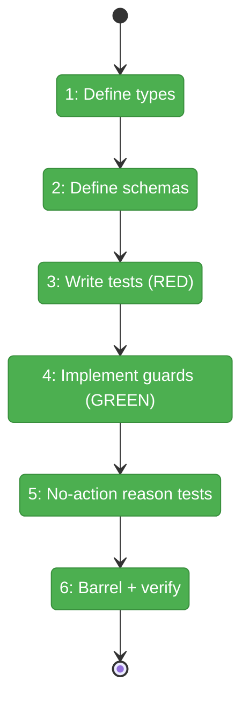
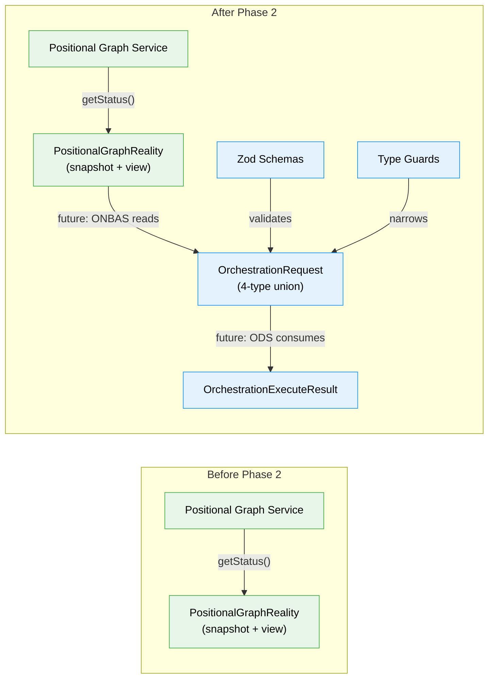

# Flight Plan: Phase 2 — OrchestrationRequest Discriminated Union

**Plan**: [../../positional-orchestrator-plan.md](../../positional-orchestrator-plan.md)
**Phase**: Phase 2: OrchestrationRequest Discriminated Union
**Generated**: 2026-02-06
**Status**: Landed

---

## Departure → Destination

**Where we are**: Phase 1 delivered `PositionalGraphReality` — an immutable snapshot of the entire graph state (lines, nodes, questions, pod sessions) with convenience accessors and a view class. The orchestration system can now read the graph's full state at a point in time. But there is no way to express what should happen next. The decision engine (ONBAS) has no output type, and the execution engine (ODS) has no input type.

**Where we're going**: By the end of this phase, a `OrchestrationRequest` discriminated union will define every possible action the orchestrator can take — start a node, resume after a question, surface a question, or do nothing. Each request carries all the data ODS needs to execute without looking anything up. Zod schemas validate at runtime, type guards narrow safely, and TypeScript's exhaustive `never` check proves the set is closed. A test can construct any request variant, parse it through the schema, and narrow it through a type guard — all with full type safety.

---

## Flight Status

<!-- Updated by /plan-6: pending → active → done. Use blocked for problems/input needed. -->

**Legend**: grey = pending | yellow = active | red = blocked/needs input | green = done

---

## Stages

<!-- Updated by /plan-6 during implementation: [ ] → [~] → [x] -->

- [x] **Stage 1: Define Zod schemas + derived types** — create Zod schemas for each variant with `z.discriminatedUnion('type', [...])` and `.strict()`, derive types via `z.infer<>` (`orchestration-request.schema.ts` — new file)
- [x] **Stage 2: Define non-schema types** — create `NodeLevelRequest` utility union (`orchestration-request.types.ts` — new file)
- [x] **Stage 3: Write guard and schema tests** — TDD RED phase: type guard tests (will fail), schema parse/reject tests (will pass), exhaustive `never` switch test (`orchestration-request.test.ts` — new file)
- [x] **Stage 4: Implement type guards** — TDD GREEN phase: 4 type guards + `isNodeLevelRequest()` + `getNodeId()` utilities (`orchestration-request.guards.ts` — new file)
- [x] **Stage 5: No-action reason tests** — validate all 4 `NoActionReason` values parse, invalid values rejected (`orchestration-request.test.ts`)
- [x] **Stage 6: Update barrel and verify** — add Phase 2 exports to `index.ts`, run `just fft` to confirm everything passes (`index.ts`)

---

## Architecture: Before & After

**Legend**: existing (green, unchanged) | changed (orange, modified) | new (blue, created)

---

## Acceptance Criteria

- [x] 4-type discriminated union compiles with exhaustive checking (AC-2)
- [x] Each variant carries all data ODS needs to execute without additional lookups (AC-2)
- [x] Type guards work correctly for all variants (AC-2)
- [x] `StartNodeRequest` carries `InputPack` for input wiring (AC-14, partial)
- [x] `just fft` clean

---

## Goals & Non-Goals

**Goals**:
- Define `OrchestrationRequest` with 4 variants: `start-node`, `resume-node`, `question-pending`, `no-action`
- Define matching Zod schemas with `z.discriminatedUnion('type', [...])`
- Implement type guards for safe narrowing
- Define `NoActionReason`: `graph-complete`, `transition-blocked`, `all-waiting`, `graph-failed`
- Define `OrchestrationExecuteResult` type for ODS responses
- Prove exhaustiveness via TypeScript `never` check in tests

**Non-Goals**:
- ONBAS implementation (Phase 5)
- ODS implementation (Phase 6)
- DI registration (Phase 7)
- Fake implementations (pure data types, no fakes needed)
- Runtime schema validation middleware

---

## Checklist

- [x] T001: Define OrchestrationRequest Zod schemas + derived types (CS-2)
- [x] T002: Define non-schema TypeScript types (CS-1)
- [x] T003: Write type guard + schema validation tests — RED (CS-2)
- [x] T004: Implement type guards — GREEN (CS-1)
- [x] T005: Write no-action reason tests (CS-1)
- [x] T006: Define OrchestrationExecuteResult type (CS-1)
- [x] T007: Update barrel index + `just fft` (CS-1)

---

## PlanPak

Active — files organized under `features/030-orchestration/`
