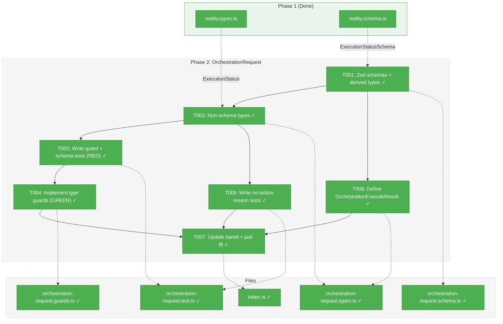
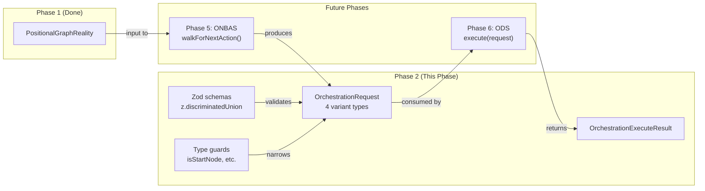
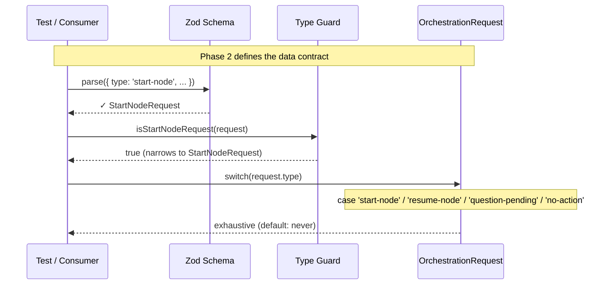

# Phase 2: OrchestrationRequest Discriminated Union — Tasks & Alignment Brief

**Spec**: [../../positional-orchestrator-spec.md](../../positional-orchestrator-spec.md)
**Plan**: [../../positional-orchestrator-plan.md](../../positional-orchestrator-plan.md)
**Workshop**: [../../workshops/02-orchestration-request.md](../../workshops/02-orchestration-request.md)
**Date**: 2026-02-06

---

## Executive Briefing

### Purpose
This phase defines the contract between the orchestrator's decision engine (ONBAS) and its execution engine (ODS). The `OrchestrationRequest` discriminated union is the single type that flows between them — every possible orchestrator action is represented by one of four variants, and the set is closed.

### What We're Building
A discriminated union type `OrchestrationRequest` with exactly 4 variants:
- `start-node` — Begin executing a ready node (carries `InputPack`)
- `resume-node` — Continue a node after a question was answered (carries `answer`)
- `question-pending` — Surface an unsurfaced question to the user
- `no-action` — Nothing actionable found (loop exits)

Plus Zod schemas for runtime validation, type guard functions for safe narrowing, a utility `OrchestrationExecuteResult` type for ODS responses, and exhaustive `never` checking to prove the union is closed.

### User Value
Downstream phases (ONBAS, ODS, orchestration loop) depend on this contract. Without it, the decision engine has no output type and the executor has no input type. This phase unblocks Phases 5, 6, and 7.

### Example
```typescript
// ONBAS produces:
const request: OrchestrationRequest = {
  type: 'start-node',
  graphSlug: 'my-pipeline',
  nodeId: 'node-001',
  inputs: { ok: true, inputs: { 'user-prompt': { status: 'available', detail: { ... } } } },
};

// ODS consumes via type guard:
if (isStartNodeRequest(request)) {
  // request.inputs is safely narrowed to InputPack
  await pod.execute(request.inputs, contextSessionId);
}
```

---

## Objectives & Scope

### Objective
Define the exhaustive discriminated union `OrchestrationRequest` per Workshop #2 and plan AC-2. Every variant must be self-contained — ODS should never need a secondary lookup to execute a request.

### Goals

- Define `OrchestrationRequest` with 4 variants: `start-node`, `resume-node`, `question-pending`, `no-action`
- Define matching Zod schemas with `z.discriminatedUnion('type', [...])` for runtime validation
- Implement type guard functions: `isStartNodeRequest()`, `isResumeNodeRequest()`, `isQuestionPendingRequest()`, `isNoActionRequest()`
- Implement utility guards: `isNodeLevelRequest()`, `getNodeId()`
- Define `NoActionReason` enum: `graph-complete`, `transition-blocked`, `all-waiting`, `graph-failed`
- Define `OrchestrationExecuteResult` type for ODS handler responses
- Prove exhaustiveness via TypeScript `never` check in tests
- Full TDD with 5-field Test Doc

### Non-Goals

- ONBAS implementation (Phase 5 — ONBAS produces these requests)
- ODS implementation (Phase 6 — ODS consumes these requests)
- DI registration (Phase 7)
- Fake implementations (not needed — these are pure data types)
- Schema validation of InputPack internals (InputPack comes from existing service; validated at source)
- Runtime schema validation middleware (schemas exist for testing and documentation, not for production gating)

---

## Pre-Implementation Audit

### Summary
| File | Action | Origin | Modified By | Recommendation |
|------|--------|--------|-------------|----------------|
| `orchestration-request.schema.ts` | Created | Phase 2 | — | keep-as-is (Zod-first source of truth, DYK-I6) |
| `orchestration-request.types.ts` | Created | Phase 2 | — | keep-as-is (non-schema types only) |
| `orchestration-request.guards.ts` | Created | Phase 2 | — | keep-as-is |
| `index.ts` | Modified | Phase 1 (030) | — | cross-plan-edit |
| `orchestration-request.test.ts` | Created | Phase 2 | — | keep-as-is |

### Per-File Detail

#### `index.ts` (Modified)
- **Provenance**: Created by Phase 1 (T001), commit `bedb67a` (2026-02-06). Currently exports Reality types, schemas, builder, and view.
- **Modification**: Add exports for OrchestrationRequest types, schemas, and guards.
- **Compliance**: No violations. Barrel pattern established in Phase 1.

### Compliance Check
No violations found. All new files follow:
- Kebab-case naming per constitution
- `features/030-orchestration/` placement per PlanPak
- Zod-first schema pattern per ADR-0003 (Zod schemas are source of truth, types derived via `z.infer<>`)
- Discriminated union pattern matches `workunit.schema.ts` precedent from Plan 029

---

## Requirements Traceability

### Coverage Matrix
| AC | Description | Flow Summary | Files in Flow | Tasks | Status |
|----|-------------|-------------|---------------|-------|--------|
| AC-2 | Closed, self-contained discriminated union | schema.ts (Zod schemas + z.infer types, DYK-I6) → types.ts (NodeLevelRequest utility) → guards.ts (type guards) → test.ts (exhaustive never check) → index.ts (exports) | 5 | T001-T007 | ✅ Complete |
| AC-3 (partial) | ONBAS returns deterministic next action | schema.ts defines `OrchestrationRequest` return type of `walkForNextAction()` | 1 | T001 | ⏭️ Deferred (Phase 5 implements ONBAS; Phase 2 defines the contract type) |
| AC-6 (partial) | ODS executes each request type correctly | types.ts defines OrchestrationExecuteResult for ODS response | 1 | T006 | ✅ Covered (type only; ODS implementation Phase 6) |
| AC-9 (partial) | Question lifecycle flows through system | schema.ts defines QuestionPendingRequest (surfacing) + ResumeNodeRequest (resumption) via z.infer | 1 | T001 | ✅ Covered (types only; behavior in Phases 5-6) |
| AC-14 (partial) | Input wiring flows through orchestration | schema.ts: StartNodeRequestSchema.inputs validates InputPack shape; z.infer derives StartNodeRequest.inputs as InputPack | 1 | T001 | ✅ Covered |

### Workshop #2 Alignment Verification

Detailed field-by-field comparison of tasks.md planned types against Workshop #2 authoritative design.

#### StartNodeRequest (Workshop lines 124-135)
| Field | Workshop #2 | Task Plan | Aligned? |
|-------|------------|-----------|----------|
| `type` | `readonly type: 'start-node'` | T001: literal `'start-node'` | ✅ |
| `graphSlug` | `readonly graphSlug: string` | T001: string; T002: `z.string().regex(/^[a-z][a-z0-9-]*$/)` | ✅ |
| `nodeId` | `readonly nodeId: string` | T001: string; T002: `z.string().min(1)` | ✅ |
| `inputs` | `readonly inputs: InputPack` | T001: imports `InputPack` from interface; T002: inline Zod per `reality.schema.ts:107-110` precedent | ✅ (Workshop imports `InputPackSchema` from `./input.schema.js` which doesn't exist; inline schema is the pragmatic resolution) |

#### ResumeNodeRequest (Workshop lines 152-166)
| Field | Workshop #2 | Task Plan | Aligned? |
|-------|------------|-----------|----------|
| `type` | `readonly type: 'resume-node'` | T001 | ✅ |
| `graphSlug` | `readonly graphSlug: string` | T001 | ✅ |
| `nodeId` | `readonly nodeId: string` | T001 | ✅ |
| `questionId` | `readonly questionId: string` | T001 | ✅ |
| `answer` | `readonly answer: unknown` | T001: `unknown`; T002: `z.unknown()` | ✅ |

#### QuestionPendingRequest (Workshop lines 187-210)
| Field | Workshop #2 | Task Plan | Aligned? |
|-------|------------|-----------|----------|
| `type` | `readonly type: 'question-pending'` | T001 | ✅ |
| `graphSlug` | `readonly graphSlug: string` | T001 | ✅ |
| `nodeId` | `readonly nodeId: string` | T001 | ✅ |
| `questionId` | `readonly questionId: string` | T001 | ✅ |
| `questionText` | `readonly questionText: string` | T001; T002: `z.string().min(1)` | ✅ |
| `questionType` | `readonly questionType: 'text' \| 'single' \| 'multi' \| 'confirm'` | T001; T002: `z.enum([...])` | ✅ |
| `options` | `readonly options?: readonly string[]` | T001; T002: `z.array(z.string()).optional()` | ✅ (Note: options here are plain `string[]`, NOT the `{ key, label }[]` from Phase 1's QuestionOption. This is correct per DYK-I2 — request carries display strings, reality normalizes internally.) |
| `defaultValue` | `readonly defaultValue?: string \| boolean` | T001; T002: `z.union([z.string(), z.boolean()]).optional()` | ✅ |

#### NoActionRequest (Workshop lines 231-242)
| Field | Workshop #2 | Task Plan | Aligned? |
|-------|------------|-----------|----------|
| `type` | `readonly type: 'no-action'` | T001 | ✅ |
| `graphSlug` | `readonly graphSlug: string` | T001 | ✅ |
| `reason` | `readonly reason?: NoActionReason` | T001 (optional); T002: `NoActionReasonSchema.optional()` | ✅ |
| `lineId` | `readonly lineId?: string` | T001 (optional); T002: `z.string().optional()` | ✅ |

#### NoActionReason (Workshop lines 247-251)
| Value | Workshop #2 | Task Plan | Aligned? |
|-------|------------|-----------|----------|
| `'graph-complete'` | ✅ | T001, T005 | ✅ |
| `'transition-blocked'` | ✅ | T001, T005 | ✅ |
| `'all-waiting'` | ✅ | T001, T005 | ✅ |
| `'graph-failed'` | ✅ | T001, T005 | ✅ |
| `'all-running'` | ❌ Not in workshop | Plan 2.5 mentions it but workshop omits | ✅ Correctly excluded (workshop is authoritative) |
| `'empty-graph'` | ❌ Not in workshop | Plan 2.5 mentions it but workshop omits | ✅ Correctly excluded (workshop is authoritative) |

#### Type Guards (Workshop lines 257-295)
| Guard | Workshop #2 | Task Plan | Aligned? |
|-------|------------|-----------|----------|
| `isStartNodeRequest()` | Line 257-259 | T003 (test), T004 (impl) | ✅ |
| `isResumeNodeRequest()` | Line 261-263 | T003, T004 | ✅ |
| `isQuestionPendingRequest()` | Line 265-267 | T003, T004 | ✅ |
| `isNoActionRequest()` | Line 269-271 | T003, T004 | ✅ |
| `NodeLevelRequest` type | Line 281 | T001 (type), T003 (test), T004 (guard) | ✅ |
| `isNodeLevelRequest()` | Line 283-285 | T003, T004 | ✅ |
| `getNodeId()` | Line 290-295 | T003, T004 | ✅ |

#### OrchestrationResult / ExecuteResult (Workshop lines 391-413)
| Field | Workshop #2 (`OrchestrationResult`) | Task Plan (`OrchestrationExecuteResult`) | Aligned? |
|-------|-------------------------------------|------------------------------------------|----------|
| `ok` | `readonly ok: boolean` | T006 | ✅ |
| `error` | `readonly error?: OrchestrationError` | T006 | ✅ |
| `request` | `readonly request: OrchestrationRequest` | T006 | ✅ |
| `sessionId` | `readonly sessionId?: string` | T006 | ✅ |
| `newStatus` | `readonly newStatus?: ExecutionStatus` | T006 (imports `ExecutionStatus` from Phase 1) | ✅ |

#### OrchestrationError (Workshop lines 408-412)
| Field | Workshop #2 | Task Plan | Aligned? |
|-------|------------|-----------|----------|
| `code` | `readonly code: string` | T006 | ✅ |
| `message` | `readonly message: string` | T006 | ✅ |
| `nodeId` | `readonly nodeId?: string` | T006 | ✅ |

#### File Location (Workshop lines 877-885)
| File | Workshop #2 | Task Plan | Aligned? |
|------|------------|-----------|----------|
| `orchestration-request.schema.ts` | Zod schemas + z.infer types (DYK-I6) | T001 | ✅ |
| `orchestration-request.types.ts` | Non-schema types (NodeLevelRequest, ExecuteResult) | T002, T006 | ✅ |
| `orchestration-request.guards.ts` | Type guard functions | T004 | ✅ |
| `index.ts` | Re-exports | T007 | ✅ |

### Discrepancies Found and Resolved

1. **`InputPackSchema` import (Workshop line 302)**: Workshop imports from `'./input.schema.js'` which doesn't exist. **Resolution**: Use inline InputPack Zod schema per `reality.schema.ts:107-110` precedent (`z.object({ inputs: z.record(z.unknown()), ok: z.boolean() })`). This is correct — InputPack comes from existing service output and is already validated at source.

2. **NoActionReason values (Plan 2.5 vs Workshop #2)**: Plan task 2.5 lists 5 values including `all-running` and `empty-graph`. Workshop #2 specifies exactly 4 values. **Resolution**: Workshop is authoritative. Using 4 values only. If ONBAS (Phase 5) needs additional reasons, they can be added via a plan change.

3. **Type naming: `OrchestrationResult` vs `OrchestrationExecuteResult`**: Workshop uses `OrchestrationResult`; task plan uses `OrchestrationExecuteResult` to avoid name collision with the overall orchestration run result (Phase 7's `OrchestrationRunResult`). **Resolution**: This is a deliberate naming refinement. Both refer to the same structure. The `ExecuteResult` suffix clarifies this is specifically the ODS handler's return type.

4. **Workshop Example 1 InputPack shape**: Workshop Example 1 (line 595-605) shows `{ ok: true, inputs: { 'user-prompt': { name, value, sourceNodeId, outputName } } }` which doesn't match the real `InputPack` interface (`{ ok: boolean, inputs: Record<string, InputEntry> }` where `InputEntry` is `{ status, detail }`). **Resolution**: The example is illustrative pseudocode. The real `InputPack` interface is the contract. T001 imports the real `InputPack` from `positional-graph-service.interface.ts`.

### Gaps Found
No gaps — all Phase 2 acceptance criteria have complete file coverage in the task table. All Workshop #2 types, guards, schemas, and utility functions are accounted for in T001-T007.

### Orphan Files
All task table files map to at least one acceptance criterion.

---

## Architecture Map

### Component Diagram
<!-- Status: grey=pending, orange=in-progress, green=completed, red=blocked -->
<!-- Updated by plan-6 during implementation -->



### Task-to-Component Mapping

<!-- Status: ⬜ Pending | 🟧 In Progress | ✅ Complete | 🔴 Blocked -->

| Task | Component(s) | Files | Status | Comment |
|------|-------------|-------|--------|---------|
| T001 | Zod schemas + derived types | orchestration-request.schema.ts | ✅ Complete | 4 variant schemas + discriminated union + NoActionReason + `z.infer<>` types (DYK-I6) |
| T002 | Non-schema types | orchestration-request.types.ts | ✅ Complete | `NodeLevelRequest` utility union |
| T003 | Test: guards + validation | orchestration-request.test.ts | ✅ Complete | RED: type guard tests, schema parse/reject tests, exhaustive check |
| T004 | Type guard functions | orchestration-request.guards.ts | ✅ Complete | GREEN: 4 guards + isNodeLevelRequest + getNodeId |
| T005 | Test: no-action reasons | orchestration-request.test.ts | ✅ Complete | RED+GREEN: all NoActionReason values parse, invalid rejected |
| T006 | Execute result type | orchestration-request.types.ts | ✅ Complete | OrchestrationExecuteResult + OrchestrationError |
| T007 | Barrel + verify | index.ts | ✅ Complete | Export new types, schemas, guards; run just fft |

---

## Tasks

| Status | ID | Task | CS | Type | Dependencies | Absolute Path(s) | Validation | Subtasks | Notes |
|--------|------|------|-----|------|-------------|-------------------|------------|----------|-------|
| [x] | T001 | Define `OrchestrationRequest` Zod schemas with derived types: `StartNodeRequestSchema`, `ResumeNodeRequestSchema`, `QuestionPendingRequestSchema`, `NoActionRequestSchema`, `NoActionReasonSchema`, `OrchestrationRequestSchema` (discriminated union); export `z.infer<>` types for all variants + union + `NoActionReason` | 2 | Core | – | `/home/jak/substrate/030-positional-orchestrator/packages/positional-graph/src/features/030-orchestration/orchestration-request.schema.ts` | All schemas parse valid data; discriminated union rejects unknown types; derived types compile | – | Plan task 2.1; Zod-first per ADR-0003 (DYK-I6); InputPack uses inline Zod per reality.schema.ts precedent; plan-scoped |
| [x] | T002 | Define non-schema TypeScript types: `NodeLevelRequest` (utility union referencing schema-derived types) | 1 | Core | T001 | `/home/jak/substrate/030-positional-orchestrator/packages/positional-graph/src/features/030-orchestration/orchestration-request.types.ts` | All types compile; `NodeLevelRequest` narrows to 3 node-level variants | – | Plan task 2.1 (non-Zod types only); DYK-I6 Zod-first split; plan-scoped |
| [x] | T003 | Write type guard + schema validation tests (RED): 4 type guard tests, schema parse/reject for each variant, exhaustive `never` switch test, `isNodeLevelRequest` + `getNodeId` utility tests | 2 | Test | T001, T002 | `/home/jak/substrate/030-positional-orchestrator/test/unit/positional-graph/features/030-orchestration/orchestration-request.test.ts` | Tests compile but fail (guards not yet implemented); schema tests pass (schemas exist) | – | Plan task 2.2; TDD RED phase; plan-scoped |
| [x] | T004 | Implement type guards: `isStartNodeRequest()`, `isResumeNodeRequest()`, `isQuestionPendingRequest()`, `isNoActionRequest()`, `isNodeLevelRequest()`, `getNodeId()` | 1 | Core | T003 | `/home/jak/substrate/030-positional-orchestrator/packages/positional-graph/src/features/030-orchestration/orchestration-request.guards.ts` | All guard tests from T003 pass | – | Plan task 2.3; TDD GREEN phase; `getNodeId()` JSDoc must note: returns `string \| undefined` for unnarrowed requests — after type guard narrowing, prefer `request.nodeId` directly (DYK-I7); plan-scoped |
| [x] | T005 | Write + implement `no-action` reason tests: all 4 `NoActionReason` values parse correctly, invalid reasons rejected, `NoActionRequest` with each reason validates | 1 | Test | T002 | `/home/jak/substrate/030-positional-orchestrator/test/unit/positional-graph/features/030-orchestration/orchestration-request.test.ts` | All reason tests pass | – | Plan task 2.5; plan-scoped |
| [x] | T006 | Define `OrchestrationExecuteResult` and `OrchestrationError` types: result includes `ok`, `error?`, `request`, `sessionId?`, `newStatus?` | 1 | Core | T001 | `/home/jak/substrate/030-positional-orchestrator/packages/positional-graph/src/features/030-orchestration/orchestration-request.types.ts` | Types compile; compatible with ODS handler signatures from Workshop #2 | – | Plan task 2.4; plan-scoped |
| [x] | T007 | Update barrel index with all Phase 2 exports; run `just fft` to verify lint + format + all tests pass | 1 | Setup | T004, T005, T006 | `/home/jak/substrate/030-positional-orchestrator/packages/positional-graph/src/features/030-orchestration/index.ts` | `just fft` clean; all new types/schemas/guards importable from barrel | – | Plan task 2.6; cross-plan-edit (modifies Phase 1 barrel) |

---

## Alignment Brief

### Prior Phases Review

#### Phase 1: PositionalGraphReality Snapshot (Complete)

**Deliverables Created**:
- `reality.types.ts` — 8 interfaces/types: `ExecutionStatus`, `ReadinessDetail`, `NodeError`, `NodeReality`, `LineReality`, `QuestionOption`, `QuestionReality`, `PositionalGraphReality`
- `reality.schema.ts` — 7 Zod schemas for leaf types (no top-level schema due to ReadonlyMap — DYK-I4)
- `reality.builder.ts` — `buildPositionalGraphReality(options: BuildRealityOptions): PositionalGraphReality` pure function
- `reality.view.ts` — `PositionalGraphRealityView` class with 11 lookup methods
- `index.ts` — Barrel export for all Phase 1 deliverables
- `reality.test.ts` — 47 tests (12 builder + 10 accessor + 25 view)

**Dependencies Exported to Phase 2**:
- `PositionalGraphReality` type — ONBAS receives this and returns `OrchestrationRequest`
- `NodeReality` type — carries `inputPack: InputPack`, `pendingQuestionId`, `status: ExecutionStatus`
- `ExecutionStatus` type — status values used in request type discrimination
- `ExecutionStatusSchema` — can be reused for schema validation if needed
- `InputPack` type (from `positional-graph-service.interface.ts`) — imported by `reality.types.ts`, carried on `NodeReality.inputPack`
- `QuestionReality` type — carries `isSurfaced`, `isAnswered`, `answer` fields needed by ONBAS for question state logic

**Lessons Learned**:
- DYK-I2: Question options normalized from `string[]` to `{ key, label }[]` — `QuestionPendingRequest.options` in Workshop #2 still uses `string[]` (plain option strings). This is correct: options in the request are display strings, not the structured internal format.
- DYK-I4: No top-level Zod schema for `PositionalGraphReality` (uses ReadonlyMap). OrchestrationRequest schemas don't have this problem — all fields are JSON-serializable.
- Biome lint rejects `!` non-null assertions in tests — use `?.` + `toBeDefined()` instead.
- T009 was a no-op (accessors built into builder). Plan task sizing can be optimistic.

**Test Infrastructure**:
- `makeNodeStatus()`, `makeLineStatus()`, `makeGraphStatus()`, `makeState()` fixture helpers
- `buildMultiLineView()` shared multi-line fixture
- `SNAPSHOT_AT` deterministic timestamp constant
- 5-field Test Doc comment block pattern

**Architectural Decisions**:
- Pure function builder pattern (no DI, no async, no side effects)
- Leaf-level Zod validation only
- ReadonlyMap for identity-indexed collections
- Required fields over optional with silent defaults (DYK-I5)

**Key Log References**:
- Execution log: `tasks/phase-1-positionalgraphreality-snapshot/execution.log.md`
- All 12 tasks (T001-T012) completed, `just fft` clean at 3280 tests

### Critical Findings Affecting This Phase

| Finding | Impact | How Addressed |
|---------|--------|---------------|
| **#02**: Four-type discriminated union is exhaustive | Critical — defines the exact 4 types | T001: implement exactly `start-node`, `resume-node`, `question-pending`, `no-action`. T003: exhaustive `never` switch test |
| **#01**: Snapshot composes, not duplicates | Informs InputPack handling | T001/T002: `StartNodeRequest.inputs` carries `InputPack` from Phase 1 snapshot — no re-computation |
| **#07**: Question lifecycle has three states | Informs question-related request variants | T001: `QuestionPendingRequest` for unsurfaced, `ResumeNodeRequest` for answered. Surfaced-but-unanswered is a skip (no request type) |
| **#14**: State schema extensions must be optional | Informs backward compatibility | T002: `NoActionRequest.reason` and `.lineId` are optional fields |

### Plan Task Reconciliation

The plan (lines 389-396) defines tasks 2.1-2.6. Workshop #2 refines the design. Key reconciliation:

| Plan Task | Plan Description | Workshop Refinement | Phase 2 Task(s) |
|-----------|-----------------|---------------------|-----------------|
| 2.1 | Define Zod schema with 4 variants | Workshop specifies separate `.types.ts` and `.schema.ts` files | T001 (types), T002 (schemas) |
| 2.2 | Write tests for guards + exhaustive checking | Workshop adds `isNodeLevelRequest()` and `getNodeId()` utilities | T003 |
| 2.3 | Implement type guards | Exactly per workshop | T004 |
| 2.4 | Define `OrchestrationExecuteResult` type | Workshop specifies `OrchestrationResult` with `ok`, `error?`, `request`, `sessionId?`, `newStatus?` | T006 |
| 2.5 | Write tests for no-action reasons | **Plan says 5 reasons** (`graph-complete`, `graph-failed`, `all-running`, `all-waiting`, `empty-graph`); **Workshop #2 says 4** (`graph-complete`, `transition-blocked`, `all-waiting`, `graph-failed`). Workshop is authoritative — using 4 reasons. | T005 |
| 2.6 | Refactor and verify | Per established pattern | T007 |

### ADR Decision Constraints

No ADRs directly constrain Phase 2 data model definitions. ADR-0003 (schema-driven design) informs the Zod-first approach but does not impose specific constraints beyond "Zod schemas are source of truth."

### PlanPak Placement Rules

- All new source files → `packages/positional-graph/src/features/030-orchestration/` (plan-scoped)
- Test file → `test/unit/positional-graph/features/030-orchestration/` (plan-scoped)
- `index.ts` modification → cross-plan-edit (same plan, different phase)

### Invariants & Guardrails

- `OrchestrationRequest` union MUST be closed to exactly 4 types — no extensibility
- Each variant MUST carry `readonly type` as the discriminator
- Each variant MUST carry `readonly graphSlug: string`
- `StartNodeRequest` MUST carry `InputPack` for ODS to execute without secondary lookup
- `ResumeNodeRequest` MUST carry `answer: unknown` for pod resumption. Schema uses `z.unknown()` which accepts `undefined` — ONBAS invariant #5 (`answer !== undefined`) is the enforcement point, not the schema (DYK-I8)
- `QuestionPendingRequest` MUST carry question details for ODS to surface
- `NoActionRequest.reason` is optional (for debugging), not required
- All Zod schemas use `.strict()` to reject extra properties

### Visual Alignment: System Flow



### Visual Alignment: Interaction Sequence



### Test Plan (Full TDD)

| Test | Rationale | Expected Outcome |
|------|-----------|------------------|
| **Schema: StartNodeRequest parses valid data** | Prove schema accepts well-formed start-node with InputPack | Parse succeeds |
| **Schema: ResumeNodeRequest parses valid data** | Prove answer field accepts unknown types | Parse succeeds |
| **Schema: QuestionPendingRequest parses valid data** | Prove all question fields present | Parse succeeds |
| **Schema: NoActionRequest parses valid data** | Prove optional reason/lineId accepted | Parse succeeds |
| **Schema: discriminated union rejects unknown type** | Prove closed set — `{ type: 'unknown' }` fails | Parse throws ZodError |
| **Schema: strict mode rejects extra properties** | Prove `.strict()` on each variant | Parse throws ZodError |
| **Guard: isStartNodeRequest returns true for start-node** | Prove type narrowing works | Returns true, type narrows |
| **Guard: isStartNodeRequest returns false for other types** | Prove no false positives | Returns false for 3 other types |
| **Guard: (repeat for all 4 guards)** | Complete guard coverage | Each guard discriminates correctly |
| **Guard: isNodeLevelRequest identifies node-level types** | Prove utility correctly classifies 3 node-level + 1 non | Returns true for start/resume/question, false for no-action |
| **Guard: getNodeId extracts nodeId from node-level** | Prove extraction works | Returns nodeId for 3 types, undefined for no-action |
| **Exhaustive: switch covers all 4 types** | Prove TypeScript `never` in default case compiles | No type error; all cases handled |
| **NoActionReason: all 4 values parse** | Prove enum accepts all valid reasons | Parse succeeds for each |
| **NoActionReason: invalid value rejected** | Prove closed enum | Parse throws for invalid string |
| **NoActionRequest: each reason variant validates** | Prove reason field integration | Full request with each reason parses |

### Step-by-Step Implementation Outline

1. **T001**: Create `orchestration-request.schema.ts` with Zod schemas per Workshop #2 lines 300-362. Use inline InputPack schema (same pattern as `reality.schema.ts:107-110`). Use `z.discriminatedUnion('type', [...])`. Export `z.infer<>` types for all variants, the union, and `NoActionReason`. This file is the single source of truth per ADR-0003 (DYK-I6).
2. **T002**: Create `orchestration-request.types.ts` with non-schema types only: `NodeLevelRequest` utility union (imports schema-derived types from `./orchestration-request.schema.js`). Import `ExecutionStatus` from `./reality.types.js` if needed by T006.
3. **T003**: Create `orchestration-request.test.ts` with RED tests for type guards (import from not-yet-created guards file) and GREEN tests for schema validation. Include exhaustive switch test. 5-field Test Doc.
4. **T004**: Create `orchestration-request.guards.ts` with 4 type guards + 2 utilities. Make T003 guard tests GREEN.
5. **T005**: Add no-action reason tests to `orchestration-request.test.ts`. All 4 values, invalid rejected.
6. **T006**: Add `OrchestrationExecuteResult` and `OrchestrationError` to `orchestration-request.types.ts`.
7. **T007**: Update `index.ts` barrel. Run `just fft`.

### Commands to Run

```bash
# During development — run just the orchestration tests
pnpm vitest run test/unit/positional-graph/features/030-orchestration/orchestration-request.test.ts

# Before commit — full suite
just fft
```

### Risks/Unknowns

| Risk | Severity | Mitigation |
|------|----------|------------|
| Plan task 2.5 lists 5 NoActionReasons, Workshop #2 lists 4 | Low | Workshop is authoritative. Using 4 reasons. ONBAS (Phase 5) may add more if needed via a plan change. |
| InputPack Zod schema is minimal (inline) | Low | InputPack comes from existing service, validated at source. Minimal schema sufficient. |

### Ready Check

- [x] ADR constraints mapped to tasks — N/A (no ADRs directly constrain Phase 2 data models)
- [ ] Phase 1 deliverables reviewed and understood
- [ ] Workshop #2 design fully read
- [ ] Plan reconciliation complete (4 vs 5 NoActionReasons resolved)
- [ ] Pre-implementation audit clean (no duplicates, no compliance issues)
- [ ] Requirements traceability complete (AC-2 fully covered)

---

## Phase Footnote Stubs

| Footnote | Phase | Description |
|----------|-------|-------------|
| [^1] | Phase 2 | T001+T002: Zod schemas + derived types + non-schema types (`orchestration-request.schema.ts`, `orchestration-request.types.ts`) |
| [^2] | Phase 2 | T003+T005: Type guard + schema validation + no-action reason tests (`orchestration-request.test.ts`) |
| [^3] | Phase 2 | T004: Type guard implementations — 6 functions (`orchestration-request.guards.ts`) |
| [^4] | Phase 2 | T006: OrchestrationExecuteResult + OrchestrationError types (`orchestration-request.types.ts`) |
| [^5] | Phase 2 | T007: Barrel index update with Phase 2 exports (`index.ts`) |

---

## Evidence Artifacts

Implementation evidence written to:
- `docs/plans/030-positional-orchestrator/tasks/phase-2-orchestrationrequest-discriminated-union/execution.log.md`
- 37 tests passing (schema validation, type guards, exhaustive switch, NoActionReason)
- `just fft` clean: 3317 tests, 0 failures

---

## Discoveries & Learnings

_Populated during implementation by plan-6. Log anything of interest to your future self._

| Date | Task | Type | Discovery | Resolution | References |
|------|------|------|-----------|------------|------------|
| | | | | | |

**Types**: `gotcha` | `research-needed` | `unexpected-behavior` | `workaround` | `decision` | `debt` | `insight`

**What to log**:
- Things that didn't work as expected
- External research that was required
- Implementation troubles and how they were resolved
- Gotchas and edge cases discovered
- Decisions made during implementation
- Technical debt introduced (and why)
- Insights that future phases should know about

_See also: `execution.log.md` for detailed narrative._

---

## Directory Layout

```
docs/plans/030-positional-orchestrator/
  ├── positional-orchestrator-plan.md
  ├── positional-orchestrator-spec.md
  └── tasks/
      ├── phase-1-positionalgraphreality-snapshot/
      │   ├── tasks.md
      │   ├── tasks.fltplan.md
      │   └── execution.log.md
      └── phase-2-orchestrationrequest-discriminated-union/
          ├── tasks.md              # This file
          ├── tasks.fltplan.md      # Generated by /plan-5b
          └── execution.log.md      # Created by /plan-6
```
