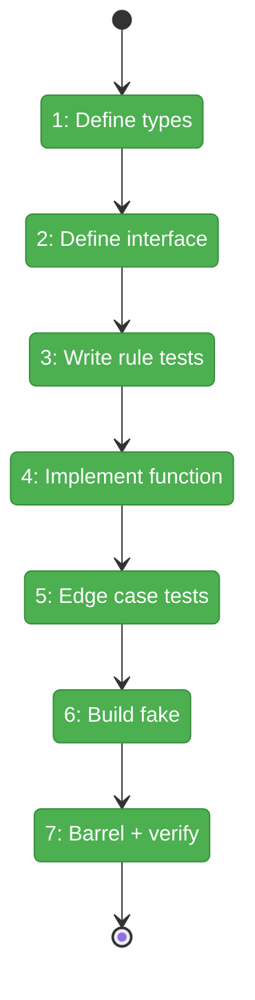
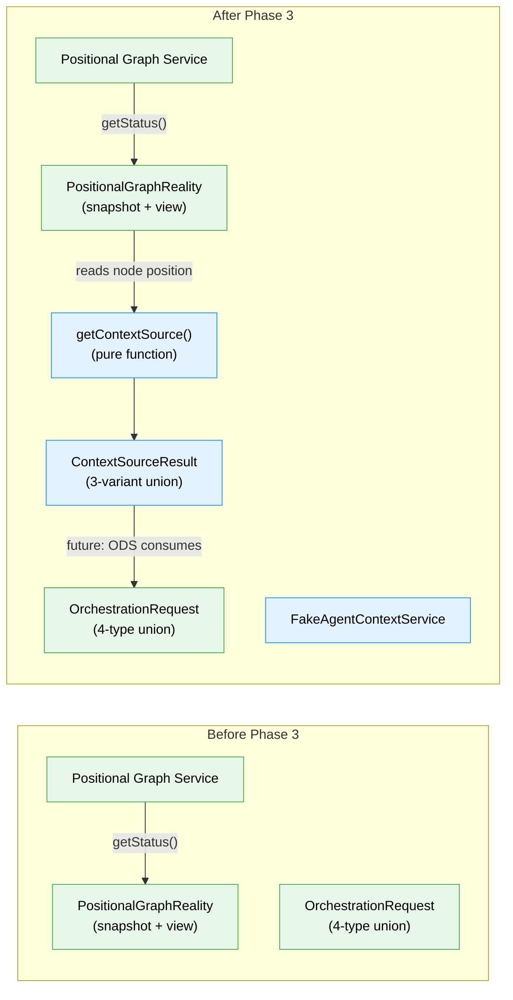

# Flight Plan: Phase 3 — AgentContextService

**Plan**: [../../positional-orchestrator-plan.md](../../positional-orchestrator-plan.md)
**Phase**: Phase 3: AgentContextService
**Generated**: 2026-02-06
**Status**: Landed

---

## Departure → Destination

**Where we are**: Phase 1 delivered `PositionalGraphReality` — an immutable snapshot of the entire graph state with a `PositionalGraphRealityView` class that provides navigation helpers like "get left neighbor" and "find first agent on previous line." Phase 2 delivered `OrchestrationRequest` — a 4-type discriminated union defining every possible orchestrator action. The system can now read graph state and express what to do next, but it has no way to determine *how* an agent should start — specifically, whether it should inherit a conversation session from a prior agent or begin fresh.

**Where we're going**: By the end of this phase, `getContextSource(reality, nodeId)` will return a deterministic answer for any node in the graph: "inherit session from node X", "start fresh", or "not applicable (not an agent)." The function walks backward across ALL previous lines to find an agent for cross-line inheritance, and walks left past non-agent nodes in serial chains to find the nearest agent (stopping at parallel boundaries). Every result includes a human-readable `reason` string explaining the decision. A test can call `getContextSource()` with a graph snapshot and immediately verify the context inheritance rule for any node position. ODS (Phase 6) will use this to decide whether to pass a session ID when starting agent pods.

---

## Flight Status

<!-- Updated by /plan-6: pending → active → done. Use blocked for problems/input needed. -->

**Legend**: grey = pending | yellow = active | red = blocked/needs input | green = done

---

## Stages

<!-- Updated by /plan-6 during implementation: [ ] → [~] → [x] -->

- [x] **Stage 1: Define context result types and Zod schemas** — create 3-variant `ContextSourceResult` discriminated union with type guards (`agent-context.schema.ts`, `agent-context.types.ts` — new files)
- [x] **Stage 2: Define the service interface** — add `IAgentContextService` with `getContextSource()` signature (`agent-context.types.ts`)
- [x] **Stage 3: Write tests for all 5 context rules** — TDD RED phase: non-agent, first-on-line-0, cross-line inherit, serial inherit, parallel new (`agent-context.test.ts` — new file)
- [x] **Stage 4: Implement the pure function** — TDD GREEN: bare exported `getContextSource()` function + thin `AgentContextService` class wrapper. Cross-line walks ALL previous lines to find an agent (DYK-I10). Serial walks left past non-agents to find nearest agent regardless of execution mode (DYK-I13). Uses `PositionalGraphRealityView` for basic lookups, own loops for walk-back (`agent-context.ts` — new file)
- [x] **Stage 5: Write edge case tests** — cross-line skips non-agent lines, serial walks past code/user-input nodes, serial inherits from parallel agent to its left, no agent on any previous line, node not found, reason strings (`agent-context.test.ts`)
- [x] **Stage 6: Build the fake for downstream testing** — `FakeAgentContextService` with `setContextSource()` override and call history. Escape hatch only — ODS tests should prefer the real pure function (DYK-I12) (`fake-agent-context.ts` — new file)
- [x] **Stage 7: Update barrel and verify** — add Phase 3 exports, run `just fft` to confirm everything passes (`index.ts`)

---

## Architecture: Before & After

**Legend**: existing (green, unchanged) | changed (orange, modified) | new (blue, created)

---

## Acceptance Criteria

- [ ] All 5 context rules produce correct results (AC-5)
- [ ] Cross-line lookback walks ALL previous lines to find agent, not just N-1 (DYK-I10)
- [ ] Serial left-neighbor walks past non-agent nodes to find nearest agent regardless of execution mode — parallel mode only affects the parallel node itself (DYK-I13)
- [ ] Every result includes a human-readable `reason` string
- [ ] `getContextSource` exported as bare function; `AgentContextService` is thin wrapper (DYK-I9)
- [ ] Pure function: no side effects, no I/O
- [ ] `just fft` clean

---

## Goals & Non-Goals

**Goals**:
- Define `ContextSourceResult` types with Zod schemas and type guards
- Define `IAgentContextService` interface with `getContextSource()` signature
- Implement `getContextSource()` as a bare exported pure function with walk-back for cross-line and serial-left rules
- Implement thin `AgentContextService` class wrapper for interface injection
- Implement `FakeAgentContextService` as escape hatch for downstream testing (real function preferred)
- Cover all 5 context rules + walk-back edge cases with unit tests (TDD)

**Non-Goals**:
- DI registration (internal collaborator, not in DI)
- `noContext` flag on orchestratorSettings (deferred)
- ODS integration (Phase 6)
- Session ID lookup (PodManager's responsibility)
- Contract tests (fake overrides, not behavioral parity)

---

## Checklist

- [x] T001: Define `ContextSourceResult` Zod schemas + derived types + type guards (CS-2)
- [x] T002: Define `IAgentContextService` interface (CS-1)
- [x] T003: Write tests for all 5 context rules — RED (CS-2)
- [x] T004: Implement `getContextSource()` bare function + class wrapper, with walk-back loops — GREEN (CS-2)
- [x] T005: Write walk-back edge case tests + implement (CS-2)
- [x] T006: Implement `FakeAgentContextService` escape hatch (CS-1)
- [x] T007: Update barrel index + `just fft` (CS-1)

---

## PlanPak

Active — files organized under `features/030-orchestration/`
