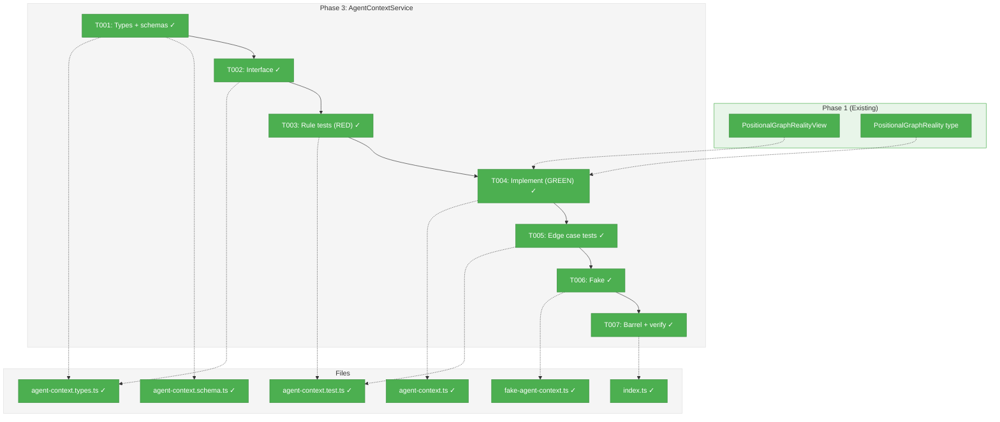
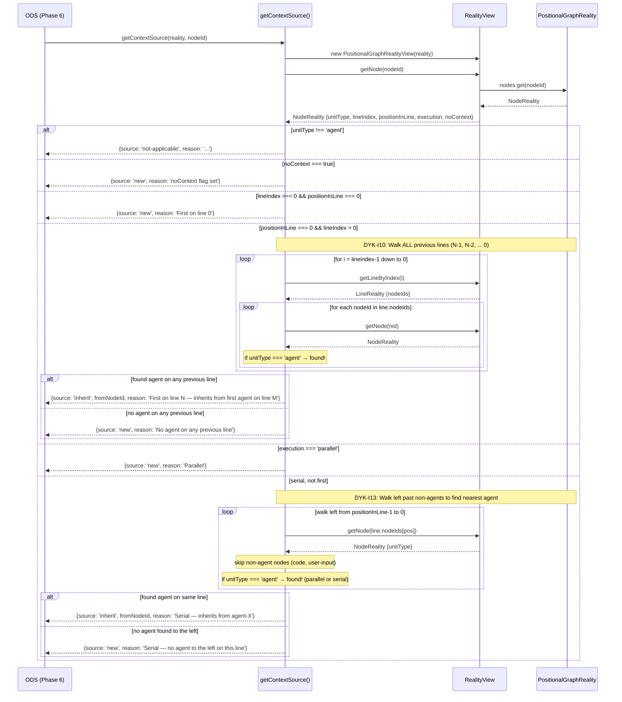

# Phase 3: AgentContextService — Tasks & Alignment Brief

**Spec**: [../../positional-orchestrator-spec.md](../../positional-orchestrator-spec.md)
**Plan**: [../../positional-orchestrator-plan.md](../../positional-orchestrator-plan.md)
**Date**: 2026-02-06

---

## Executive Briefing

### Purpose

This phase delivers the context continuity rules that determine whether an agent node should inherit a session from a prior node or start with a fresh context. Without this, ODS (Phase 6) cannot correctly start agent nodes — it would not know whether to pass a `sessionId` to the pod or let it start clean.

### What We're Building

A `getContextSource()` bare exported pure function that takes a `PositionalGraphReality` snapshot and a `nodeId`, and returns one of three results: `inherit` (with a source node ID), `new`, or `not-applicable`. The function encodes 5 positional rules with walk-back behavior: cross-line lookback walks ALL previous lines (not just N-1) to find an agent, and serial left-neighbor walks backward past non-agent nodes to find the nearest agent in the serial group (stopping at parallel boundaries). A thin `AgentContextService` class wraps the function for interface injection. A `FakeAgentContextService` class provides test override escapes for downstream consumers (ODS in Phase 6), though ODS tests should prefer the real pure function by default.

### User Value

Agents automatically inherit conversation context from prior agents in the workflow. When a spec-builder finishes and a spec-reviewer starts, the reviewer picks up where the builder left off. Parallel agents start fresh. The rules are deterministic, position-based, and transparent via `reason` strings on every result.

### Example

**Input**: A 3-line graph where `spec-builder` (agent, line 0) completed, and `spec-reviewer` (agent, first on line 1) is about to start.

**Output**: `{ source: 'inherit', fromNodeId: 'spec-builder', reason: 'First on line 1 — inherits from first agent on line 0' }`

---

## Objectives & Scope

### Objective

Implement AC-5 (AgentContextService determines context source from position) as a pure function utility with comprehensive test coverage for all 5 context rules and their edge cases.

### Goals

- Define `ContextSourceResult` types with Zod schemas and type guards (3-variant discriminated union)
- Define `IAgentContextService` interface with `getContextSource()` signature
- Implement `getContextSource()` as a pure function (no side effects, no I/O, no DI)
- Implement `FakeAgentContextService` for downstream consumer testing (ODS, Phase 6)
- Cover all 5 context rules + edge cases with unit tests (TDD)
- Leverage existing `PositionalGraphRealityView` navigation helpers (no duplication)

### Non-Goals

- DI registration (AgentContextService is internal — not in DI per plan constraint)
- Adding `noContext` to `NodeOrchestratorSettingsSchema` or `NodeReality` type (cross-phase schema change — see note below)
- ODS integration (Phase 6 wires this; Phase 3 only provides the function)
- Session ID lookup (PodManager's responsibility, not context service's)
- Contract tests (pure function has no real/fake parity concern — the fake is for overriding, not for behavioral parity)

---

## Pre-Implementation Audit

### Summary

| File | Action | Origin | Modified By | Recommendation |
|------|--------|--------|-------------|----------------|
| `agent-context.schema.ts` | Create | Plan 030, Phase 3 | — | keep-as-is |
| `agent-context.types.ts` | Create | Plan 030, Phase 3 | — | keep-as-is |
| `agent-context.ts` | Create | Plan 030, Phase 3 | — | reuse-existing (View) |
| `fake-agent-context.ts` | Create | Plan 030, Phase 3 | — | keep-as-is |
| `index.ts` | Modify | Plan 030, Phase 1 | Phase 2 | keep-as-is |
| `agent-context.test.ts` | Create | Plan 030, Phase 3 | — | keep-as-is |

All source paths under: `packages/positional-graph/src/features/030-orchestration/`
Test path under: `test/unit/positional-graph/features/030-orchestration/`

### Per-File Detail

#### `agent-context.ts` — Reuse Existing Navigation (with Walk-Back Extensions)

**Finding**: `PositionalGraphRealityView` (Phase 1) provides useful navigation primitives:

| Phase 3 Need | View Method (reality.view.ts) | Sufficient? |
|---|---|---|
| Get node by ID | `getNode(nodeId)` | Yes |
| Check if first in line | `isFirstInLine(nodeId)` | Yes |
| Get line by index | `getLineByIndex(index)` | Yes |
| Get left neighbor on same line | `getLeftNeighbor(nodeId)` | **Partial** — single-hop only |
| Find first agent on previous line | `getFirstAgentOnPreviousLine(nodeId)` | **Partial** — checks only line N-1 |

**DYK-I10/I13 Walk-Back Changes**: The View's single-hop methods are insufficient for the updated rules:
- **Cross-line (Rule 2)**: Must walk ALL previous lines (N-1, N-2, ... 0) to find an agent. The View's `getFirstAgentOnPreviousLine()` only checks N-1. Phase 3 must implement its own backward loop using `getLineByIndex()` + `getNode()`.
- **Serial left-neighbor (Rule 4)**: Must walk left past non-agent nodes to find nearest agent on the same line. Does NOT stop at parallel agents — a serial node can inherit from a parallel agent to its left. The View's `getLeftNeighbor()` returns only the immediate neighbor. Phase 3 must implement its own leftward loop.

**Action**: `getContextSource()` should construct a `PositionalGraphRealityView` internally for basic lookups (`getNode`, `isFirstInLine`, `getLineByIndex`), but implement its own walk-back loops for cross-line and serial-left-neighbor rules. Do NOT modify the Phase 1 View class.

#### File Naming: Plan vs Workshop

Workshop #3 uses `context.types.ts` / `context.schema.ts` / `context.service.ts`. Plan and project structure use `agent-context.*` prefix. **Plan naming takes precedence** — it is more specific and avoids collision.

### Compliance Check

No violations. All files are plan-scoped under PlanPak `features/030-orchestration/`.

---

## Requirements Traceability

### Coverage Matrix

| AC | Description | Flow Summary | Files in Flow | Tasks | Status |
|----|-------------|-------------|---------------|-------|--------|
| AC-5 | AgentContextService determines context source from position | `getContextSource(reality, nodeId)` reads `NodeReality` fields (`unitType`, `lineIndex`, `positionInLine`, `execution`), applies 5 positional rules, returns `ContextSourceResult` discriminated union | `agent-context.schema.ts`, `agent-context.types.ts`, `agent-context.ts`, `agent-context.test.ts`, `fake-agent-context.ts`, `index.ts` | T001–T007 | Covered |

### Gaps Found

No gaps — all acceptance criteria have complete file coverage. Phase 1 upstream files (`reality.types.ts`, `reality.view.ts`) require no modification.

### Orphan Files

None. Every file serves a role in AC-5.

---

## Architecture Map

### Component Diagram

<!-- Status: grey=pending, orange=in-progress, green=completed, red=blocked -->
<!-- Updated by plan-6 during implementation -->



### Task-to-Component Mapping

<!-- Status: Pending | In Progress | Complete | Blocked -->

| Task | Component(s) | Files | Status | Comment |
|------|-------------|-------|--------|---------|
| T001 | Context Result Types + Schemas | `agent-context.schema.ts`, `agent-context.types.ts` | ✅ Complete | Zod-first: schemas own types via `z.infer<>` |
| T002 | IAgentContextService Interface | `agent-context.types.ts` | ✅ Complete | Interface for `getContextSource()` |
| T003 | Rule Tests | `agent-context.test.ts` | ✅ Complete | TDD RED: all 5 rules |
| T004 | getContextSource() bare function + AgentContextService wrapper | `agent-context.ts` | ✅ Complete | TDD GREEN: bare function (DYK-I9), walk-back loops for cross-line (DYK-I10) and serial-left (DYK-I13) |
| T005 | Edge Case Tests (walk-back) | `agent-context.test.ts` | ✅ Complete | Multi-line walkback, serial walk-left past non-agents, serial inherits from parallel agent |
| T006 | FakeAgentContextService | `fake-agent-context.ts` | ✅ Complete | Escape hatch for forcing outputs; real function preferred (DYK-I12) |
| T007 | Barrel Export + Verification | `index.ts` | ✅ Complete | `just fft` clean |

---

## Tasks

| Status | ID | Task | CS | Type | Dependencies | Absolute Path(s) | Validation | Subtasks | Notes |
|--------|------|------|-----|------|-------------|-------------------|------------|----------|-------|
| [x] | T001 | Define `ContextSourceResult` Zod schemas + derived types + type guards | 2 | Core | – | `/home/jak/substrate/030-positional-orchestrator/packages/positional-graph/src/features/030-orchestration/agent-context.schema.ts`, `/home/jak/substrate/030-positional-orchestrator/packages/positional-graph/src/features/030-orchestration/agent-context.types.ts` | Schemas parse all 3 variants; types derive via `z.infer<>`; 3 type guards compile | – | Supports plan task 3.1 · log#task-t001 [^6] |
| [x] | T002 | Define `IAgentContextService` interface with `getContextSource()` signature | 1 | Core | T001 | `/home/jak/substrate/030-positional-orchestrator/packages/positional-graph/src/features/030-orchestration/agent-context.types.ts` | Interface compiles; accepts `PositionalGraphReality` + `nodeId`, returns `ContextSourceResult` | – | Supports plan task 3.1 · log#task-t002 [^6] |
| [x] | T003 | Write tests for all 5 context rules (RED) | 2 | Test | T001, T002 | `/home/jak/substrate/030-positional-orchestrator/test/unit/positional-graph/features/030-orchestration/agent-context.test.ts` | Tests cover: non-agent→not-applicable, first-on-line-0→new, cross-line→inherit, serial-left-neighbor→inherit, parallel→new. RED: tests fail (module not found) | – | Supports plan task 3.2 · log#task-t003 [^7] |
| [x] | T004 | Implement `getContextSource()` as bare exported function + thin `AgentContextService` class wrapper (GREEN) | 2 | Core | T003 | `/home/jak/substrate/030-positional-orchestrator/packages/positional-graph/src/features/030-orchestration/agent-context.ts` | All 5 rule tests from T003 pass. Bare function exported directly (DYK-I9). Cross-line walks ALL previous lines (DYK-I10). Serial walks left past non-agents to find nearest agent regardless of execution mode (DYK-I13). Uses `PositionalGraphRealityView` for basic lookups, own loops for walk-back | – | Supports plan task 3.3 · log#task-t004 [^8] |
| [x] | T005 | Write edge case tests + implement (additional RED-GREEN) | 2 | Test | T004 | `/home/jak/substrate/030-positional-orchestrator/test/unit/positional-graph/features/030-orchestration/agent-context.test.ts` | Tests cover: cross-line skips non-agent lines→inherit from further back (DYK-I10), no agent on ANY previous line→new, serial walks past code→inherit from earlier agent (DYK-I13), serial walks past user-input→inherit, serial inherits from parallel agent to its left→inherit, code-only left with no further agent→new, node not found→not-applicable, reason strings present on all results | – | Supports plan task 3.4 · log#task-t005 [^7] |
| [x] | T006 | Implement `FakeAgentContextService` with test helpers | 1 | Core | T002 | `/home/jak/substrate/030-positional-orchestrator/packages/positional-graph/src/features/030-orchestration/fake-agent-context.ts` | Fake implements `IAgentContextService`; supports `setContextSource(nodeId, result)`, `getHistory()`, `reset()` | – | Supports plan task 3.5 · log#task-t006 [^9] |
| [x] | T007 | Update barrel index + `just fft` | 1 | Integration | T001–T006 | `/home/jak/substrate/030-positional-orchestrator/packages/positional-graph/src/features/030-orchestration/index.ts` | Phase 3 exports added; `just fft` clean (all tests pass, lint clean) | – | Supports plan task 3.6 · log#task-t007 [^10] |

---

## Alignment Brief

### Prior Phases Review

#### Phase 1: PositionalGraphReality Snapshot (COMPLETE)

**Deliverables**: 5 source files in `features/030-orchestration/`: `reality.types.ts`, `reality.schema.ts`, `reality.builder.ts`, `reality.view.ts`, `index.ts`. Plus 2 cross-plan edits (`positional-graph-service.interface.ts` — added `unitType`; `state.schema.ts` — added `surfaced_at`). 47 tests.

**Dependencies exported for Phase 3**:
- `PositionalGraphReality` type — the input to `getContextSource()`
- `NodeReality` type — fields: `nodeId`, `unitType`, `lineIndex`, `positionInLine`, `execution`, `status`
- `LineReality` type — fields: `nodeIds`, `index`, `isComplete`
- `PositionalGraphRealityView` class — navigation helpers: `getNode()`, `getLeftNeighbor()`, `getFirstAgentOnPreviousLine()`, `isFirstInLine()`
- Test helpers: `makeNodeStatus()`, `makeLineStatus()`, `makeGraphStatus()`, `makeState()` factories

**Key discoveries**:
- DYK-I1: `inferUnitType()` is phantom pseudocode — use `NodeStatusResult.unitType` directly
- DYK-I3: `currentLineIndex` returns `lines.length` (sentinel) when all complete
- DYK-I4: No top-level Zod schema for `PositionalGraphReality` (`ReadonlyMap` not JSON-friendly)
- DYK-I5: `unitType` is required on `NodeStatusResult` (compiler enforcement)
- Builder composes existing services, never re-implements gate logic (Finding #01, #08)

**Architectural patterns to maintain**:
- Pure function builder (no state, no I/O)
- Leaf-level Zod validation only
- Factory functions for test fixtures with `overrides` spread pattern

#### Phase 2: OrchestrationRequest Discriminated Union (COMPLETE)

**Deliverables**: 3 source files: `orchestration-request.schema.ts`, `orchestration-request.types.ts`, `orchestration-request.guards.ts`. 37 tests.

**Dependencies exported for Phase 3**: None directly consumed. Phase 3 does not use `OrchestrationRequest` types — it operates independently on `PositionalGraphReality`. However, the `ContextSourceResult` produced by Phase 3 feeds into Phase 6 (ODS), which also consumes Phase 2's `OrchestrationExecuteResult`.

**Key discoveries**:
- DYK-I6: Zod-first source of truth — schema file owns types via `z.infer<>`; types file only holds non-Zod types
- DYK-I7: `getNodeId()` returns `string | undefined` — prefer direct field access after narrowing
- DYK-I8: `z.unknown()` accepts `undefined` — enforcement at consumer, not schema
- NoActionReason has exactly 4 values per Workshop #2 (authoritative over plan's 5)
- `OrchestrationExecuteResult` named to avoid collision with Phase 7's `OrchestrationRunResult`

**Architectural patterns to maintain**:
- Zod-first derivation (`z.infer<>` for all schema-derivable types)
- `.strict()` on all variant schemas
- Separate `.schema.ts` (Zod + derived types) and `.types.ts` (non-schema types, interface)
- Type guards as standalone exported functions

### Critical Findings Affecting This Phase

| Finding | Title | Constraint/Requirement | Addressed By |
|---------|-------|----------------------|--------------|
| #06 | Context Inheritance is Positional, Not Temporal | Rules based on line index / position / execution mode, not execution time | T003, T004, T005 (all rules + edge cases) |
| #04 | ONBAS is Pure and Synchronous | AgentContextService must also be pure — zero side effects | T004 (pure function implementation) |
| #08 | Existing `canRun` Gates Must Not Be Replaced | Context rules read graph state; they don't evaluate readiness | T004 (reads `unitType`/position, not gate logic) |

### ADR Decision Constraints

| ADR | Decision | Constraint for Phase 3 |
|-----|----------|----------------------|
| ADR-0004 | DI with `useFactory` | AgentContextService is NOT registered in DI — it's an internal collaborator |
| ADR-0006 | CLI-based agent orchestration | Session continuity is the concern AgentContextService serves. The `inherit` result directs ODS to reuse a session ID |

### PlanPak Placement Rules

- All Phase 3 files → `features/030-orchestration/` (plan-scoped)
- No cross-cutting files in this phase
- No cross-plan edits needed

### Invariants & Guardrails

- `getContextSource()` is pure: same input → same output, no side effects
- Every `ContextSourceResult` includes a non-empty `reason` string
- Non-agent nodes always return `not-applicable` (never `inherit` or `new`)
- If `NodeReality.noContext` is `true`, return `new` immediately — overrides all positional rules (Workshop #3 Q2). See **noContext field dependency** below.
- The function does NOT validate whether the source node has a session — that's PodManager's job (Workshop #3 Q3)
- Cross-line lookback walks ALL previous lines (N-1, N-2, ... 0) to find an agent — does NOT stop at the first empty line (DYK-I10)
- Serial left-neighbor walks backward past non-agent nodes to find nearest agent on the same line — does NOT stop at parallel nodes (a serial node can inherit from a parallel agent to its left). Only stops at start of line (DYK-I13, updated)
- `getContextSource` is exported as a bare function; `AgentContextService` class is a thin wrapper for interface injection (DYK-I9)
- `FakeAgentContextService` is an escape hatch for forcing outputs — ODS tests should prefer the real pure function (DYK-I12)

#### noContext Field Dependency

The algorithm must obey `noContext: true` on a node — if set, return `{ source: 'new', reason: 'noContext flag set' }` before evaluating any positional rules. However, the field does not yet exist on `NodeReality` (Phase 1 type). The dependency chain:

1. `NodeOrchestratorSettingsSchema` (`schemas/orchestrator-settings.schema.ts`) — add `noContext: z.boolean().default(false)`
2. `NodeReality` (`reality.types.ts`) — add `readonly noContext: boolean`
3. `buildPositionalGraphReality()` (`reality.builder.ts`) — surface the field from node config

**Phase 3 approach**: Implement the check in `getContextSource()` — if `(node as any).noContext === true`, return `new`. The field is optional/absent today, so the check is a no-op until the schema is extended. The schema extension is a small cross-phase edit that can be done in Phase 3 (T004) or deferred. Either way, the algorithm is ready.

### Inputs to Read

- `packages/positional-graph/src/features/030-orchestration/reality.types.ts` — `PositionalGraphReality`, `NodeReality`, `LineReality`
- `packages/positional-graph/src/features/030-orchestration/reality.view.ts` — `PositionalGraphRealityView`
- `docs/plans/030-positional-orchestrator/workshops/03-agent-context-service.md` — Rule matrix, algorithm, examples

### Visual Alignment Aids

#### System State Flow

```mermaid
flowchart LR
    classDef phase1 fill:#E8F5E9,stroke:#4CAF50,color:#000
    classDef phase3 fill:#E3F2FD,stroke:#2196F3,color:#000
    classDef future fill:#F5F5F5,stroke:#9E9E9E,color:#666

    R["PositionalGraphReality<br/>(Phase 1)"]:::phase1
    V["PositionalGraphRealityView<br/>(Phase 1)"]:::phase1
    GCS["getContextSource()<br/>(Phase 3)"]:::phase3
    CSR["ContextSourceResult<br/>(Phase 3)"]:::phase3
    ODS["ODS.handleStartNode()<br/>(Phase 6)"]:::future
    PM["PodManager.getSessionId()<br/>(Phase 4)"]:::future

    R --> V
    V --> GCS
    GCS --> CSR
    CSR --> ODS
    ODS -->|"inherit: fromNodeId"| PM
    PM -->|"sessionId"| ODS
```



#### Actor Interaction Sequence



### Test Plan (Full TDD)

#### T003: Core Rule Tests (RED)

| Test | Rule | Input | Expected |
|------|------|-------|----------|
| non-agent code node | Rule 0 | `unitType: 'code'` | `not-applicable` |
| non-agent user-input | Rule 0 | `unitType: 'user-input'` | `not-applicable` |
| first agent on line 0 | Rule 1 | `lineIndex: 0, positionInLine: 0, unitType: 'agent'` | `new` |
| first agent on line 1, prev line has agent | Rule 2 | `lineIndex: 1, positionInLine: 0` + prev line first agent | `inherit` from prev agent |
| serial agent, left neighbor is agent | Rule 4 | `positionInLine: 1, execution: 'serial'` + left agent | `inherit` from left |
| parallel agent | Rule 3 | `execution: 'parallel'` | `new` |

Fixture approach: Build minimal `PositionalGraphReality` objects with `ReadonlyMap` entries. Reuse Phase 1 test patterns. Do NOT use `buildPositionalGraphReality()` (that requires service output shapes). Instead, construct `PositionalGraphReality` objects directly as plain data.

#### T005: Edge Case Tests

| Test | Case | Input | Expected |
|------|------|-------|----------|
| no agent on any previous line | Rule 2 walk-back | Lines 0-1 have only code nodes, agent on line 2 | `new` |
| cross-line skips non-agent lines | Rule 2 walk-back | Agent on line 0, code on line 1, agent on line 2 | `inherit` from line 0 agent |
| serial walks left past code nodes | Rule 4 walk-back | `[agent-A] → [code-B] → [agent-C]` all serial | `inherit` from agent-A |
| serial walks left past user-input | Rule 4 walk-back | `[agent-A] → [user-input-B] → [agent-C]` serial | `inherit` from agent-A |
| serial inherits from parallel agent | Rule 4 walk-back | `[agent-A (parallel)] → [agent-B (serial)]` | `inherit` from agent-A (parallel mode only affects the parallel node itself) |
| code node as immediate left, no agent further left | Rule 4 walk-back | `[code-A] → [agent-B]` serial | `new` |
| node not found | Guard | Invalid nodeId | `not-applicable` |
| reason strings non-empty | All rules | All variants | `reason.length > 0` |

### Implementation Outline

1. **T001**: Create `agent-context.schema.ts` with 3 Zod schemas (`InheritContextResultSchema`, `NewContextResultSchema`, `NotApplicableResultSchema`, `ContextSourceResultSchema` discriminated union). Create `agent-context.types.ts` with non-schema types: type guards (`isInheritContext`, `isNewContext`, `isNotApplicable`).
2. **T002**: Add `IAgentContextService` interface to `agent-context.types.ts` with `getContextSource(reality, nodeId): ContextSourceResult`.
3. **T003**: Write `agent-context.test.ts` with 5-field Test Doc. Tests for all 5 rules using minimal reality fixtures. Expect RED (module not found).
4. **T004**: Implement `getContextSource()` as a bare exported function in `agent-context.ts` (DYK-I9). `AgentContextService` class is a thin wrapper that delegates to it. Use `PositionalGraphRealityView` internally for navigation. Algorithm: check unitType → check `noContext` flag (Workshop #3 Q2) → check line 0 first → check position 0 cross-line (walk ALL previous lines, DYK-I10) → check parallel → check serial left neighbor (walk left past non-agents to find nearest agent regardless of execution mode, DYK-I13). Expect GREEN.
5. **T005**: Add edge case tests to `agent-context.test.ts`. Includes multi-line walkback, serial walk-left past non-agents, serial inherits from parallel agent. Run GREEN immediately if implementation handles them.
6. **T006**: Create `fake-agent-context.ts` with `FakeAgentContextService` implementing `IAgentContextService`. Supports `setContextSource(nodeId, result)` override map, `getHistory()` call log, `reset()`. Note: fake is an escape hatch — ODS tests should prefer the real pure function by default (DYK-I12).
7. **T007**: Add Phase 3 exports to `index.ts`. Run `just fft`.

### Commands to Run

```bash
# Run unit tests (during development)
pnpm vitest run test/unit/positional-graph/features/030-orchestration/agent-context.test.ts

# Build check
pnpm build

# Full verification (before commit)
just fft
```

### Risks & Unknowns

| Risk | Severity | Mitigation |
|------|----------|------------|
| View API is single-hop but Phase 3 needs walk-back | Medium | Use View for basic lookups (`getNode`, `getLineByIndex`, `isFirstInLine`); implement own walk-back loops for cross-line and serial-left. Do NOT modify Phase 1 View class (DYK-I10/I13) |
| Reality fixture construction complexity | Low | Use plain object construction (not builder), keep fixtures minimal. Multi-line walk-back tests need 3+ line fixtures |
| Edge case: line 0 with positionInLine > 0 | Low | Test covers this; rules handle it via serial/parallel branch |
| Serial walk-back with mixed execution modes | Low | T005 includes explicit test: `[agent-A (parallel)] → [agent-B (serial)]` → B inherits from A (parallel mode only affects the parallel node itself) |

### Ready Check

- [ ] ADR constraints mapped to tasks — N/A (no ADRs directly constrain Phase 3 tasks)
- [ ] Prior phase deliverables reviewed — Phase 1 View methods confirmed, Phase 2 patterns noted
- [ ] Workshop #3 rules mapped to tests — 5 rules + 5 edge cases in T003/T005
- [ ] View reuse strategy confirmed — `getContextSource()` constructs View internally
- [ ] Await explicit GO/NO-GO

---

## Phase Footnote Stubs

_Populated by plan-6 during implementation._

| Footnote | Task | Description |
|----------|------|-------------|
| [^6] | T001+T002 (Plan 3.1) | ContextSourceResult schemas + types + IAgentContextService interface |
| [^7] | T003+T005 (Plan 3.2+3.4) | Context rule tests + edge case tests |
| [^8] | T004 (Plan 3.3) | getContextSource() bare function + AgentContextService class |
| [^9] | T006 (Plan 3.5) | FakeAgentContextService escape hatch |
| [^10] | T007 (Plan 3.6) | Barrel index update with Phase 3 exports |

---

## Evidence Artifacts

- **Execution log**: `docs/plans/030-positional-orchestrator/tasks/phase-3-agentcontextservice/execution.log.md` — created by plan-6 during implementation
- **Test evidence**: Vitest output showing all Phase 3 tests passing
- **Build evidence**: `pnpm build` output showing clean compilation
- **Verification**: `just fft` output showing full suite passes

---

## Discoveries & Learnings

_Populated during implementation by plan-6. Log anything of interest to your future self._

| Date | Task | Type | Discovery | Resolution | References |
|------|------|------|-----------|------------|------------|
| 2026-02-06 | T004 | gotcha | `(node as Record<string, unknown>).noContext` fails TS strict — NodeReality doesn't overlap with Record | Use `'noContext' in node` guard + narrowed cast `(node as { noContext: unknown }).noContext` | log#task-t004 |

**Types**: `gotcha` | `research-needed` | `unexpected-behavior` | `workaround` | `decision` | `debt` | `insight`

**What to log**:
- Things that didn't work as expected
- External research that was required
- Implementation troubles and how they were resolved
- Gotchas and edge cases discovered
- Decisions made during implementation
- Technical debt introduced (and why)
- Insights that future phases should know about

_See also: `execution.log.md` for detailed narrative._

---

## Directory Layout

```
docs/plans/030-positional-orchestrator/
  ├── positional-orchestrator-plan.md
  ├── positional-orchestrator-spec.md
  └── tasks/
      ├── phase-1-positionalgraphreality-snapshot/
      │   ├── tasks.md
      │   ├── tasks.fltplan.md
      │   └── execution.log.md
      ├── phase-2-orchestrationrequest-discriminated-union/
      │   ├── tasks.md
      │   ├── tasks.fltplan.md
      │   └── execution.log.md
      └── phase-3-agentcontextservice/
          ├── tasks.md              ← this file
          ├── tasks.fltplan.md      ← generated by /plan-5b-flightplan
          └── execution.log.md      ← created by /plan-6
```

---

## Critical Insights (2026-02-06)

| # | Insight | Decision |
|---|---------|----------|
| DYK-I9 | Logic as bare function vs class-only — pure function doesn't need a class to be testable | Bare exported function + thin `AgentContextService` class wrapper for interface injection |
| DYK-I10 | Cross-line lookback only searched N-1, not further back | Walk ALL previous lines (N-1, N-2, ... 0) to find first agent; return `new` only if no agent on any line |
| DYK-I11 | View constructed internally is cheap and immutable | Confirmed: construct View per call, accept Reality in signature |
| DYK-I12 | Fake returns canned values that may mask real rule bugs | Fake is escape hatch only; ODS tests should use real pure function by default |
| DYK-I13 | Serial left-neighbor only checked immediate left, same single-hop issue as cross-line | Walk left past non-agent nodes to find nearest agent; do NOT stop at parallel agents (serial can inherit from parallel). Only stop at start of line |

Action items:
- T004 algorithm must implement walk-back for both cross-line (Rule 2) and serial left-neighbor (Rule 4)
- T005 must include multi-line walkback and serial walk-left test cases
- T006 docs must note fake is convenience, not default
