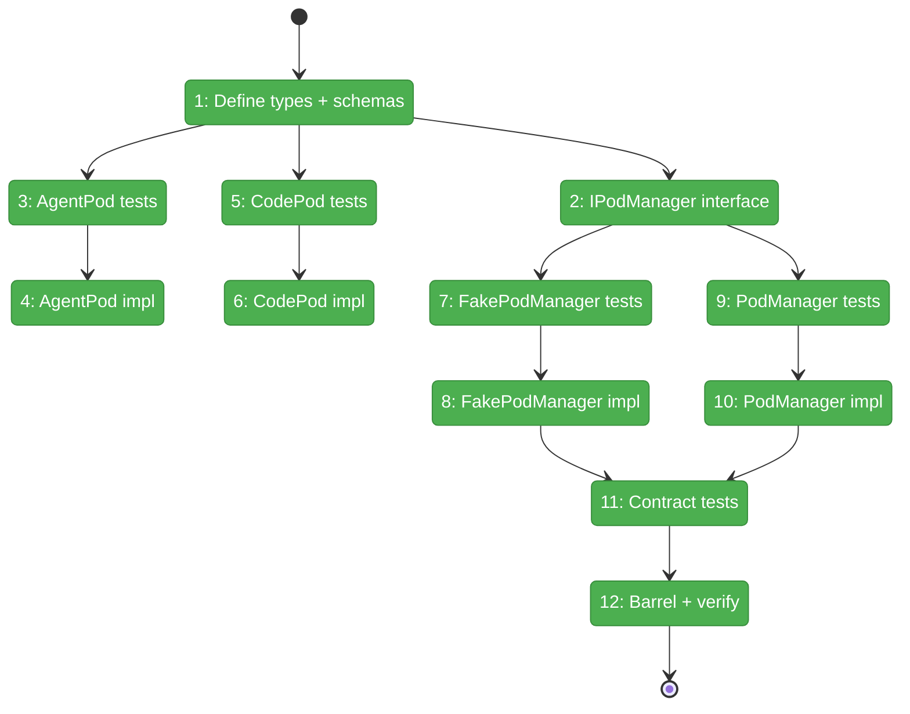
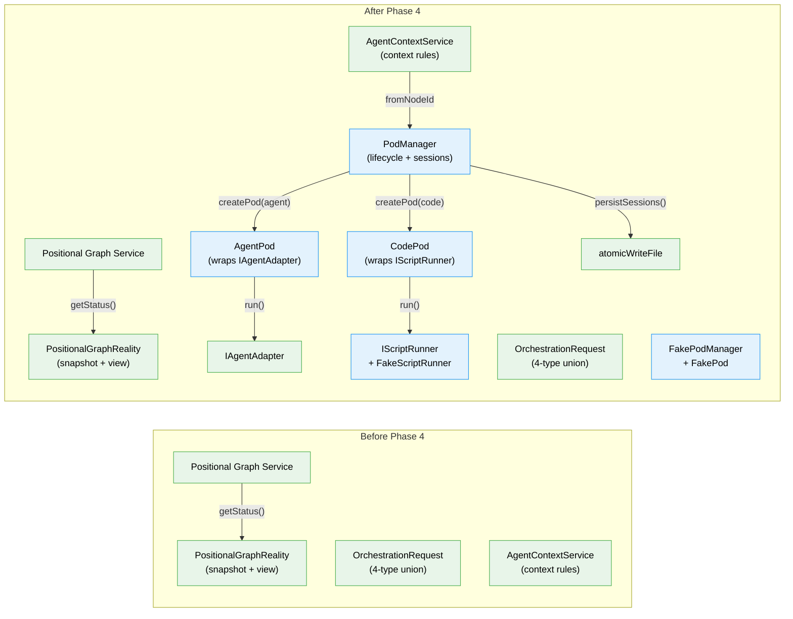

# Flight Plan: Phase 4 — WorkUnitPods and PodManager

**Plan**: [../../positional-orchestrator-plan.md](../../positional-orchestrator-plan.md)
**Phase**: Phase 4: WorkUnitPods and PodManager
**Generated**: 2026-02-06
**Status**: Landed

---

## Departure → Destination

**Where we are**: Phases 1-3 delivered three foundational pieces: an immutable `PositionalGraphReality` snapshot that captures the entire graph state with navigation helpers, a 4-type `OrchestrationRequest` discriminated union defining every possible action the orchestrator can take, and a pure `getContextSource()` function that determines whether an agent should inherit a prior session or start fresh based on its position in the graph. The system can now read graph state, express what to do next, and determine context inheritance rules — but it has no way to actually *execute* anything. There are no containers to run agents or code, no session tracking, and no persistence for agent conversations across restarts.

**Where we're going**: By the end of this phase, the system will have execution containers (pods) for both agent and code nodes. An `AgentPod` wraps `IAgentAdapter.run()` with prompt construction and session tracking. A `CodePod` wraps `IScriptRunner` for script execution. A `PodManager` creates pods by node type, tracks their sessions in memory, and atomically persists sessions to `pod-sessions.json` so they survive server restarts. A test can create a PodManager, create an AgentPod for a node, call `pod.execute()` with inputs and a context session, and verify the result — all using `FakeAgentAdapter` and `FakePodManager` without any real agent processes.

---

## Flight Status

<!-- Updated by /plan-6: pending → active → done. Use blocked for problems/input needed. -->

**Legend**: grey = pending | yellow = active | red = blocked/needs input | green = done

---

## Stages

<!-- Updated by /plan-6 during implementation: [ ] → [~] → [x] -->

- [x] **Stage 1: Define pod types, Zod schemas, and script runner interface** — `IWorkUnitPod`, `PodExecuteResult` (4-outcome discriminated type), `PodExecuteOptions`, `IScriptRunner` + `FakeScriptRunner`, plus Zod schemas for serializable types (`pod.types.ts`, `pod.schema.ts`, `script-runner.types.ts` — new files)
- [x] **Stage 2: Define the PodManager interface** — `IPodManager` with `createPod()`, `getPod()`, `getSessionId()`, `setSessionId()`, `destroyPod()`, `loadSessions()`, `persistSessions()` (`pod-manager.types.ts` — new file)
- [x] **Stage 3: Write AgentPod tests** — TDD RED: execute with completion/question/error/terminated outcomes, session capture, context session passthrough, prompt construction, resume with answer, adapter exceptions (`pod.test.ts` — new file)
- [x] **Stage 4: Implement AgentPod** — TDD GREEN: wraps `IAgentAdapter.run()`, builds prompt from template + inputs, maps adapter result to `PodExecuteResult`, captures session ID (`pod.agent.ts` — new file)
- [x] **Stage 5: Write CodePod tests** — TDD RED: successful script, failure, no session tracking, resume returns error, inputs as env vars (`pod.test.ts`)
- [x] **Stage 6: Implement CodePod** — TDD GREEN: wraps `IScriptRunner.run()`, no session tracking (`pod.code.ts` — new file)
- [x] **Stage 7: Write FakePodManager + FakePod tests** — configure pod results, seed sessions, track call history, reset state, track execute/resume/terminate calls (`pod-manager.test.ts` — new file)
- [x] **Stage 8: Implement FakePodManager + FakePod** — test doubles with configurable behaviors, session seeding, call history tracking (`fake-pod-manager.ts` — new file)
- [x] **Stage 9: Write real PodManager tests** — TDD RED: create agent/code pods, existing pod dedup, destroy + session retention, persist/load roundtrip, missing file handling (`pod-manager.test.ts`)
- [x] **Stage 10: Implement real PodManager** — TDD GREEN: in-memory pod registry, session map, atomic writes to `pod-sessions.json` via `atomicWriteFile()` (`pod-manager.ts` — new file)
- [x] **Stage 11: Write contract tests** — parameterized test factory proving FakePodManager and real PodManager pass identical assertions for create, get, session, and destroy operations (`pod-manager.test.ts`)
- [x] **Stage 12: Update barrel and verify** — add all Phase 4 exports to barrel, run `just fft` to confirm everything passes (`index.ts`)

---

## Architecture: Before & After

**Legend**: existing (green, unchanged) | changed (orange, modified) | new (blue, created)

---

## Acceptance Criteria

- [x] Pods manage agent/code execution lifecycle — AgentPod runs agents via IAgentAdapter.run(), CodePod runs scripts via IScriptRunner, results are one of completed/question/error/terminated (AC-7)
- [x] Pod sessions survive server restarts — PodManager persists sessions to pod-sessions.json and loads them back on restart (AC-8)
- [x] FakePodManager enables deterministic integration tests — configurable pod results, session seeding, call history tracking, contract tests pass on both fake and real (AC-13)

---

## Goals & Non-Goals

**Goals**:
- Define `IWorkUnitPod` interface with `execute()`, `resumeWithAnswer()`, `terminate()`
- Define `PodExecuteResult` as a 4-outcome discriminated type: completed, question, error, terminated
- Implement `AgentPod` wrapping `IAgentAdapter.run()` with prompt construction and session tracking
- Implement `CodePod` wrapping `IScriptRunner` for script execution
- Define `IPodManager` with pod lifecycle and session persistence methods
- Implement real `PodManager` with atomic writes to `pod-sessions.json`
- Implement `FakePodManager` + `FakePod` for deterministic testing
- Define `IScriptRunner` interface + `FakeScriptRunner` for CodePod testing
- Write contract tests proving fake/real PodManager parity
- Validate with Zod schemas for `PodExecuteResult`, `PodQuestion`, `PodError`

**Non-Goals**:
- DI registration (PodManager is internal collaborator, not in DI)
- ODS integration (Phase 6 responsibility)
- Real script runner implementation (only interface + fake)
- Real agent adapter integration (tests use FakeAgentAdapter from packages/shared)
- Question detection mechanism in AgentPod (deferred — v1 uses convention-based detection)
- User-input pod (user-input nodes have no pod; ODS handles them directly)
- Concurrent pod execution (pods execute sequentially)

---

## Checklist

- [x] T001: Define `IWorkUnitPod`, `PodExecuteResult`, `PodExecuteOptions` types + Zod schemas + `IScriptRunner`/`FakeScriptRunner` (CS-2)
- [x] T002: Define `IPodManager` interface with lifecycle + session methods (CS-1)
- [x] T003: Write AgentPod tests — execute, resume, terminate, session capture (CS-2)
- [x] T004: Implement `AgentPod` wrapping `IAgentAdapter.run()` (CS-3)
- [x] T005: Write CodePod tests — script execution, failure, no sessions (CS-1)
- [x] T006: Implement `CodePod` wrapping `IScriptRunner` (CS-1)
- [x] T007: Write FakePodManager + FakePod tests (CS-2)
- [x] T008: Implement `FakePodManager` + `FakePod` (CS-2)
- [x] T009: Write real PodManager tests — create, persist, load, atomic writes (CS-2)
- [x] T010: Implement real `PodManager` with session persistence (CS-3)
- [x] T011: Write contract tests for fake/real PodManager parity (CS-2)
- [x] T012: Update barrel index + `just fft` (CS-1)

---

## PlanPak

Active — files organized under `features/030-orchestration/`
