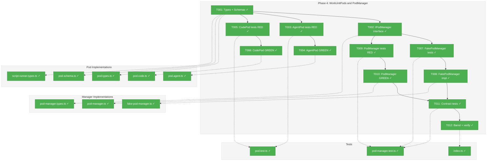
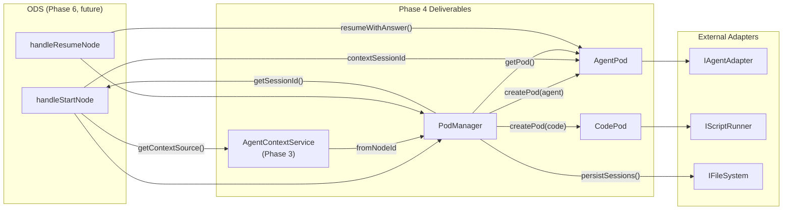
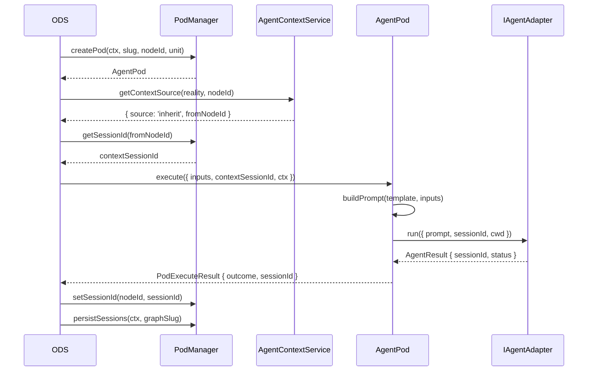

# Phase 4: WorkUnitPods and PodManager — Tasks & Alignment Brief

**Spec**: [positional-orchestrator-spec.md](../../positional-orchestrator-spec.md)
**Plan**: [positional-orchestrator-plan.md](../../positional-orchestrator-plan.md)
**Date**: 2026-02-06

---

## Executive Briefing

### Purpose

This phase creates execution containers (pods) that bridge work unit definitions (what to run) with agent/code adapters (how to run it). Pods manage the runtime lifecycle of a single node's execution — starting agents, running code, handling questions, and tracking session IDs for resumption. The PodManager provides pod lifecycle management and durable session persistence.

### What We're Building

- **IWorkUnitPod interface** with `execute()`, `resumeWithAnswer()`, and `terminate()` methods
- **AgentPod** — wraps `IAgentAdapter.run()` for agent-type work units with prompt construction, session tracking, and question detection
- **CodePod** — wraps `IScriptRunner` for code-type work units with script execution and environment setup
- **IPodManager interface** — pod lifecycle: create, retrieve, destroy, plus session persistence via `loadSessions()`/`persistSessions()`
- **PodManager** — real implementation with in-memory pod registry, session map, and atomic writes to `pod-sessions.json`
- **FakePodManager + FakePod** — test doubles with configurable behaviors, session seeding, and call history tracking
- **IScriptRunner interface** — thin abstraction for child process execution (needed by CodePod)

### User Value

After this phase, the ODS (Phase 6) can create pods for any node type, execute them with proper context inheritance, and rely on session persistence across server restarts. Integration tests can configure pod behaviors deterministically via FakePodManager.

### Example

**Agent pod execution**:
```
ODS: podManager.createPod('spec-builder', agenticUnit, agentAdapter)
     → AgentPod { nodeId: 'spec-builder', unitType: 'agent' }

ODS: pod.execute({ inputs, contextSessionId: 'sess-from-prev', ctx, graphSlug })
     → AgentPod loads node-starter-prompt.md (generic bootstrap prompt)
     → agentAdapter.run({ prompt, sessionId: 'sess-from-prev', cwd })
     → PodExecuteResult { outcome: 'completed', sessionId: 'sess-001' }

ODS: podManager.setSessionId('spec-builder', 'sess-001')
ODS: podManager.persistSessions(ctx, 'my-graph')
     → atomic write to pod-sessions.json
```

---

## Objectives & Scope

### Objective

Implement execution containers for agent and code nodes, with a manager that tracks pod lifecycle and persists session IDs. Satisfies plan acceptance criteria AC-7, AC-8, AC-13.

### Goals

- Define `IWorkUnitPod` interface with `execute()`, `resumeWithAnswer()`, `terminate()`
- Define `PodExecuteResult` as a 4-outcome discriminated type: completed, question, error, terminated
- Implement `AgentPod` wrapping `IAgentAdapter.run()` with prompt construction and session tracking
- Implement `CodePod` wrapping `IScriptRunner` for script execution
- Define `IPodManager` with pod lifecycle and session persistence methods
- Implement real `PodManager` with atomic writes to `pod-sessions.json`
- Implement `FakePodManager` + `FakePod` for deterministic testing
- Define `IScriptRunner` interface + `FakeScriptRunner` for CodePod testing
- Write contract tests proving fake/real PodManager parity
- Validate with Zod schemas for `PodExecuteResult`, `PodQuestion`, `PodError`

### Non-Goals

- DI registration (PodManager is internal collaborator, not in DI — per plan constraints)
- ODS integration (Phase 6 responsibility — ODS consumes these interfaces)
- Real script runner implementation (only the interface + fake; real runner is a follow-on)
- Real agent adapter integration (tests use `FakeAgentAdapter` from `packages/shared`)
- Question detection mechanism in AgentPod (Workshop #4 Q1 deferred — v1 uses convention-based detection via events)
- User-input pod (user-input nodes have no pod; ODS handles them directly per Workshop #4)
- Concurrent pod execution (pods execute sequentially per Workshop #4 Q4)

---

## Pre-Implementation Audit

### Summary

| File | Action | Origin | Modified By | Recommendation |
|------|--------|--------|-------------|----------------|
| `pod.types.ts` | Created | Plan 030, Phase 4 | — | keep-as-is |
| `pod.schema.ts` | Created | Plan 030, Phase 4 | — | keep-as-is |
| `pod-manager.types.ts` | Created | Plan 030, Phase 4 | — | keep-as-is |
| `pod.agent.ts` | Created | Plan 030, Phase 4 | — | keep-as-is |
| `pod.code.ts` | Created | Plan 030, Phase 4 | — | keep-as-is |
| `pod-manager.ts` | Created | Plan 030, Phase 4 | — | keep-as-is |
| `fake-pod-manager.ts` | Created | Plan 030, Phase 4 | — | keep-as-is |
| `script-runner.types.ts` | Created | Plan 030, Phase 4 | — | keep-as-is |
| `node-starter-prompt.md` | Created | Plan 030, Phase 4 | — | keep-as-is (DYK-P4#1, #5) |
| `pod.test.ts` | Created | Plan 030, Phase 4 | — | keep-as-is |
| `pod-manager.test.ts` | Created | Plan 030, Phase 4 | — | keep-as-is |
| `index.ts` | Modified | Plan 030, Phase 1 | Phase 2, Phase 3 | keep-as-is |

### Per-File Detail

#### `pod.types.ts`
- **Duplication check**: No existing `IWorkUnitPod`, `PodExecuteResult`, `PodExecuteOptions`, `PodOutcome`, `PodError`, `PodQuestion` found. None.
- **Compliance**: Plan Project Structure lists separate `pod.interface.ts` + `pod.types.ts`. However, Phase 3 established precedent of co-locating interface in `.types.ts` (`IAgentContextService` in `agent-context.types.ts`). Following the precedent: `IWorkUnitPod` interface lives in `pod.types.ts`. This is acceptable.

#### `pod-manager.types.ts`
- **Duplication check**: No existing `IPodManager` interface found. None.
- **Compliance**: Plan Project Structure says `pod-manager.interface.ts`. Choosing `pod-manager.types.ts` for consistency with `pod.types.ts` pattern and Phase 3 precedent. Acceptable deviation.

#### `pod.agent.ts` / `pod.code.ts`
- **Duplication check**: No existing `AgentPod` or `CodePod` classes found. None.
- **Compliance**: Plan Project Structure says `agent-pod.ts` / `code-pod.ts`. Using `pod.agent.ts` / `pod.code.ts` to match the `reality.builder.ts` / `reality.view.ts` domain-prefix pattern used in Phases 1-3.

#### `script-runner.types.ts`
- **Duplication check**: No existing `IScriptRunner`, `ScriptRunOptions`, `ScriptRunResult` found. None.
- **Note**: Workshop #4 lists this as `script-runner.interface.ts`. Using `.types.ts` for consistency with pod type files.

#### Reusable Utilities
- `atomicWriteFile()` at `packages/positional-graph/src/services/atomic-file.ts` — reuse for PodManager.persistSessions()
- `FakeAgentAdapter` at `packages/shared/src/fakes/fake-agent-adapter.ts` — reuse in AgentPod tests (Finding #13)
- `FakeFileSystem` at `packages/shared/src/fakes/fake-filesystem.ts` — reuse in PodManager persistence tests
- `WorkUnitInstance` union type from `features/029-agentic-work-units/workunit.classes.ts` — consumed by PodManager.createPod()

### Compliance Check

No violations found. All files correctly placed in `features/030-orchestration/` (PlanPak). No DI registration needed (internal collaborator per plan deviation ledger). Naming follows established Phase 1-3 patterns.

---

## Requirements Traceability

### Coverage Matrix

| AC | Description | Flow Summary | Files in Flow | Tasks | Status |
|----|-------------|--------------|---------------|-------|--------|
| AC-7 | Pods manage agent/code execution lifecycle | PodManager creates AgentPod/CodePod by unit type → AgentPod delegates to IAgentAdapter.run() → CodePod delegates to IScriptRunner.run() → returns PodExecuteResult (4 outcomes) → sessionId captured | pod.types.ts, pod.schema.ts, pod-manager.types.ts, pod.agent.ts, pod.code.ts, pod-manager.ts, script-runner.types.ts, pod.test.ts, pod-manager.test.ts | T001-T012 | Complete |
| AC-8 | Pod sessions survive server restarts | PodManager.persistSessions() serializes sessions to pod-sessions.json via atomicWriteFile() → loadSessions() reads back on restart → orchestrator creates pods with persisted sessionId | pod-manager.types.ts, pod-manager.ts, pod-manager.test.ts | T002, T009, T010 | Complete |
| AC-13 | FakePodManager enables deterministic testing | FakePodManager.configurePod() pre-defines FakePod behaviors → seedSession() pre-loads sessions → getCreateHistory() tracks calls → contract tests verify fake/real parity | pod-manager.types.ts, pod.types.ts, fake-pod-manager.ts, pod-manager.test.ts | T002, T007, T008, T011 | Complete |

### Gaps Found

No gaps — all acceptance criteria have complete file coverage. The `IScriptRunner` gap identified during audit has been resolved by adding `script-runner.types.ts` and `FakeScriptRunner` to the task table (bundled in T001 and T005/T006 respectively).

### Orphan Files

None. All files serve at least one AC.

---

## Architecture Map

### Component Diagram

<!-- Status: grey=pending, orange=in-progress, green=completed, red=blocked -->
<!-- Updated by plan-6 during implementation -->



### Task-to-Component Mapping

<!-- Status: ⬜ Pending | 🟧 In Progress | ✅ Complete | 🔴 Blocked -->

| Task | Component(s) | Files | Status | Comment |
|------|-------------|-------|--------|---------|
| T001 | Pod Types + Schemas | pod.types.ts, pod.schema.ts, script-runner.types.ts | ✅ Complete | IWorkUnitPod, PodExecuteResult, IScriptRunner, Zod schemas |
| T002 | Manager Interface | pod-manager.types.ts | ✅ Complete | IPodManager with lifecycle + session methods |
| T003 | AgentPod Tests | pod.test.ts | ✅ Complete | RED: execute, resume, terminate, session capture |
| T004 | AgentPod Impl | pod.agent.ts | ✅ Complete | GREEN: wraps IAgentAdapter.run() |
| T005 | CodePod Tests | pod.test.ts | ✅ Complete | RED: script execution, error, no session |
| T006 | CodePod Impl | pod.code.ts | ✅ Complete | GREEN: wraps IScriptRunner |
| T007 | FakePodManager Tests | pod-manager.test.ts | ✅ Complete | configurePod, seedSession, history tracking |
| T008 | FakePodManager Impl | fake-pod-manager.ts | ✅ Complete | FakePodManager + FakePod |
| T009 | PodManager Tests | pod-manager.test.ts | ✅ Complete | RED: create, persist, load, atomic writes |
| T010 | PodManager Impl | pod-manager.ts | ✅ Complete | GREEN: session persistence via atomicWriteFile |
| T011 | Contract Tests | pod-manager.test.ts | ✅ Complete | Parameterized: fake and real pass same assertions |
| T012 | Barrel + Verify | index.ts | ✅ Complete | Add exports, run just fft |

---

## Tasks

| Status | ID | Task | CS | Type | Dependencies | Absolute Path(s) | Validation | Subtasks | Notes |
|--------|------|------|-----|------|-------------|-------------------|------------|----------|-------|
| [x] | T001 | Define `IWorkUnitPod` interface, `PodExecuteOptions`, `PodExecuteResult`, `PodOutcome`, `PodError`, `PodQuestion`, `PodEvent` types + Zod schemas + `IScriptRunner`/`ScriptRunOptions`/`ScriptRunResult` + `FakeScriptRunner` + minimal `node-starter-prompt.md` | 2 | Setup | – | `/home/jak/substrate/030-positional-orchestrator/packages/positional-graph/src/features/030-orchestration/pod.types.ts`, `/home/jak/substrate/030-positional-orchestrator/packages/positional-graph/src/features/030-orchestration/pod.schema.ts`, `/home/jak/substrate/030-positional-orchestrator/packages/positional-graph/src/features/030-orchestration/script-runner.types.ts`, `/home/jak/substrate/030-positional-orchestrator/packages/positional-graph/src/features/030-orchestration/node-starter-prompt.md` | Schemas validate sample data, types export cleanly, `pnpm build` passes | – | Per Workshop #4; plan-scoped; DYK-P4#1: prompt file is placeholder, real iteration deferred · log#task-t001 [^11] |
| [x] | T002 | Define `IPodManager` interface with `createPod(nodeId, unit, adapter?)`, `getPod()`, `getSessionId()`, `setSessionId()`, `destroyPod()`, `getSessions()`, `loadSessions()`, `persistSessions()` | 1 | Setup | T001 | `/home/jak/substrate/030-positional-orchestrator/packages/positional-graph/src/features/030-orchestration/pod-manager.types.ts` | Interface compiles, types align with Workshop #4; createPod accepts adapter/runner param (DYK-P4#4) | – | Per Workshop #4; plan-scoped; PodManager does NOT resolve adapters — ODS passes them in · log#task-t002 [^11] |
| [x] | T003 | Write tests for `AgentPod.execute()` and `AgentPod.resumeWithAnswer()` | 2 | Test | T001 | `/home/jak/substrate/030-positional-orchestrator/test/unit/positional-graph/features/030-orchestration/pod.test.ts` | Tests cover: successful completion with sessionId, question outcome, error outcome, terminated outcome, session capture from adapter result, contextSessionId passed to adapter, prompt built from template + inputs, resumeWithAnswer formats answer prompt, no-session resume returns error | – | RED phase; uses FakeAgentAdapter (Finding #13) · log#task-t003 [^12] |
| [x] | T004 | Implement `AgentPod` | 3 | Core | T003 | `/home/jak/substrate/030-positional-orchestrator/packages/positional-graph/src/features/030-orchestration/pod.agent.ts` | All tests from T003 pass; delegates to IAgentAdapter.run(); maps AgentResult to PodExecuteResult; owns mutable sessionId (DYK-P4#2) | – | GREEN phase; per Workshop #4; plan-scoped; AgentPod reads generic node-starter-prompt.md (DYK-P4#1), does NOT call unit.getPrompt() · log#task-t004 [^13] |
| [x] | T005 | Write tests for `CodePod.execute()` | 1 | Test | T001 | `/home/jak/substrate/030-positional-orchestrator/test/unit/positional-graph/features/030-orchestration/pod.test.ts` | Tests cover: successful script execution (exit 0), script failure (exit non-zero), no session tracking (sessionId always undefined), resumeWithAnswer returns error, FakeScriptRunner returns configured results | – | RED phase; uses FakeScriptRunner · log#task-t005-t006 [^14] |
| [x] | T006 | Implement `CodePod` | 1 | Core | T005 | `/home/jak/substrate/030-positional-orchestrator/packages/positional-graph/src/features/030-orchestration/pod.code.ts` | All tests from T005 pass; delegates to IScriptRunner.run() | – | GREEN phase; per Workshop #4; plan-scoped · log#task-t005-t006 [^14] |
| [x] | T007 | Write tests for `FakePodManager` and `FakePod` behavior | 2 | Test | T001, T002 | `/home/jak/substrate/030-positional-orchestrator/test/unit/positional-graph/features/030-orchestration/pod-manager.test.ts` | Tests prove: configurePod sets pod results, seedSession pre-loads sessions, getCreateHistory tracks calls, reset clears state, FakePod returns configured results, FakePod tracks wasExecuted/wasResumed/wasTerminated, getPod returns undefined for uncreated, destroyPod retains session | – | plan-scoped · log#task-t007-t009-t011 [^15] |
| [x] | T008 | Implement `FakePodManager` and `FakePod` | 2 | Core | T007 | `/home/jak/substrate/030-positional-orchestrator/packages/positional-graph/src/features/030-orchestration/fake-pod-manager.ts` | All tests from T007 pass; implements IPodManager; FakePod implements IWorkUnitPod | – | plan-scoped · log#task-t008-t010 [^16] |
| [x] | T009 | Write tests for real `PodManager` | 2 | Test | T001, T002 | `/home/jak/substrate/030-positional-orchestrator/test/unit/positional-graph/features/030-orchestration/pod-manager.test.ts` | Tests cover: createPod returns AgentPod for agent unit, createPod returns CodePod for code unit, createPod throws for user-input, getPod returns existing, getPod returns undefined after destroy, setSessionId + getSessionId roundtrip, getSessions returns all, persistSessions writes JSON via atomicWriteFile, loadSessions reads JSON back, loadSessions handles missing file, session roundtrip preserves data | – | RED phase; uses FakeAgentAdapter + FakeScriptRunner + FakeFileSystem · log#task-t007-t009-t011 [^15] |
| [x] | T010 | Implement real `PodManager` with session persistence | 3 | Core | T009 | `/home/jak/substrate/030-positional-orchestrator/packages/positional-graph/src/features/030-orchestration/pod-manager.ts` | All tests from T009 pass; uses atomicWriteFile for persistence; creates AgentPod/CodePod by unit type | – | GREEN phase; reuses atomicWriteFile from services/atomic-file.ts; plan-scoped · log#task-t008-t010 [^16] |
| [x] | T011 | Write contract tests: same assertions on FakePodManager and real PodManager | 2 | Test | T008, T010 | `/home/jak/substrate/030-positional-orchestrator/test/unit/positional-graph/features/030-orchestration/pod-manager.test.ts` | Parameterized test factory: per-implementation setup (different constructor deps), shared assertion block on IPodManager behavioral parity (DYK-P4#3): createPod returns pod, getPod/getSessionId/getSessions work, destroyPod retains session | – | plan-scoped · log#task-t007-t009-t011 [^15] |
| [x] | T012 | Update barrel index + `just fft` | 1 | Setup | T011 | `/home/jak/substrate/030-positional-orchestrator/packages/positional-graph/src/features/030-orchestration/index.ts` | All Phase 4 exports added; `just fft` passes (lint, format, all tests) | – | plan-scoped · log#task-t012 [^17] |

---

## Alignment Brief

### Prior Phases Review

#### Phase 1: PositionalGraphReality Snapshot (COMPLETE)

**Deliverables**: `PositionalGraphReality` immutable snapshot type, `buildPositionalGraphReality()` pure function builder, `PositionalGraphRealityView` lookup wrapper, Zod schemas for leaf types, 47 unit tests.

**Key files**: `reality.types.ts`, `reality.schema.ts`, `reality.builder.ts`, `reality.view.ts`, `reality.test.ts`.

**Dependencies exported to Phase 4**:
- `PositionalGraphReality.podSessions: ReadonlyMap<string, string>` — populated by PodManager's `getSessions()` in Phase 7
- `BuildRealityOptions.podSessions?: Map<string, string>` — accepts PodManager sessions

**Patterns established**: Pure function builder (no DI), composition over re-implementation, `ReadonlyMap` for immutable collections, leaf-level Zod validation only, past-the-end sentinel for `currentLineIndex`.

**Technical discoveries**: `ReadonlyMap` prevents Zod top-level schema (DYK-I4), `unitType` made required on `NodeStatusResult` (DYK-I5), question options normalization is one-way (DYK-I2).

**Test infrastructure**: `makeNodeStatus()`, `makeLineStatus()`, `makeGraphStatus()`, `makeState()` helpers (local to reality.test.ts).

#### Phase 2: OrchestrationRequest Discriminated Union (COMPLETE)

**Deliverables**: 4-variant `OrchestrationRequest` discriminated union with Zod schemas, 6 type guards, `OrchestrationExecuteResult` type, `OrchestrationError` type, 37 unit tests.

**Key files**: `orchestration-request.schema.ts`, `orchestration-request.types.ts`, `orchestration-request.guards.ts`, `orchestration-request.test.ts`.

**Dependencies exported to Phase 4**:
- `OrchestrationExecuteResult` — return type that ODS uses; PodManager does not directly use this but PodExecuteResult maps to it via ODS
- `StartNodeRequest.inputs: InputPack` — flows through to `PodExecuteOptions.inputs`

**Patterns established**: Zod-first with `.schema.ts` / `.types.ts` split, `.strict()` on all variants, `never` exhaustive check, type guards check discriminator only, separation of schema validation and behavioral enforcement.

**Technical discoveries**: `z.unknown()` accepts undefined (DYK-I8), `graphSlug` regex `/^[a-z][a-z0-9-]*$/`, NoActionReason reduced from 5 to 4 per Workshop #2.

#### Phase 3: AgentContextService (COMPLETE)

**Deliverables**: `getContextSource()` pure function (5 positional rules), `ContextSourceResult` 3-variant discriminated union, `AgentContextService` thin class wrapper, `FakeAgentContextService`, 14 unit tests.

**Key files**: `agent-context.schema.ts`, `agent-context.types.ts`, `agent-context.ts`, `fake-agent-context.ts`, `agent-context.test.ts`.

**Dependencies exported to Phase 4**:
- `getContextSource(reality, nodeId): ContextSourceResult` — ODS calls this before `pod.execute()` to determine `contextSessionId`. Phase 4's PodManager provides `getSessionId(fromNodeId)` to resolve the session.
- `InheritContextResult.fromNodeId` — the key PodManager uses to look up a session ID

**Patterns established**: Bare function + thin class wrapper (DYK-I9), walk-back loops in consumer not View, forward-compatible `'field' in obj` guards.

**Technical discoveries**: TypeScript strict mode rejects `as Record<string, unknown>` cast — use `'field' in obj` guard instead.

#### Cumulative Dependencies for Phase 4

| From | What | Used By |
|------|------|---------|
| Phase 1 | `PositionalGraphReality.podSessions` | Phase 7 builds reality with PodManager sessions |
| Phase 1 | `InputPack` (passthrough type) | `PodExecuteOptions.inputs` |
| Phase 2 | `OrchestrationExecuteResult` | ODS maps PodExecuteResult to this (Phase 6) |
| Phase 3 | `getContextSource()` → `fromNodeId` | ODS calls `podManager.getSessionId(fromNodeId)` |
| External | `IAgentAdapter` (packages/shared) | AgentPod wraps this |
| External | `FakeAgentAdapter` (packages/shared/fakes) | AgentPod tests use this |
| External | `FakeFileSystem` (packages/shared/fakes) | PodManager tests use this |
| External | `atomicWriteFile` (services/atomic-file.ts) | PodManager persistence |
| External | `WorkUnitInstance` (features/029) | PodManager.createPod() discriminates on type |

### Critical Findings Affecting This Phase

| Finding | Impact | Affected Tasks |
|---------|--------|----------------|
| **#03**: IAgentAdapter has no DI token — resolved through IAgentManagerService.getAgent() | PodManager does NOT hold or resolve adapters; ODS passes adapter/runner into `createPod()` (DYK-P4#4). ODS/Phase 7 resolves adapter from IAgentManagerService | T002, T004, T009, T010 |
| **#05**: Pod sessions persist via atomic writes (temp-then-rename) | PodManager.persistSessions() must use `atomicWriteFile()` | T009, T010 |
| **#13**: FakeAgentAdapter already exists with configurable responses, session IDs, and call history | Reuse in AgentPod tests; do NOT create a new fake adapter | T003 |
| **#14**: State schema extensions must be optional | `pod-sessions.json` file is optional; loadSessions() handles missing file gracefully | T009, T010 |
| **#15**: Atomic writes use temp-then-rename pattern | Reuse existing `atomicWriteFile` utility | T010 |

### ADR Decision Constraints

- **ADR-0004: DI with useFactory, no decorators**: PodManager is an internal collaborator, NOT registered in DI. ODS (Phase 6) creates it directly. No violation.
- **ADR-0006: CLI-based orchestration — session continuity, CWD binding**: AgentPod must pass consistent `cwd` from `WorkspaceContext.worktreePath` and `sessionId` for resumption. Constrains: T004 (AgentPod.execute passes cwd and sessionId to adapter).

### PlanPak Placement Rules

- All new source files → `packages/positional-graph/src/features/030-orchestration/` (plan-scoped)
- All new test files → `test/unit/positional-graph/features/030-orchestration/` (plan-scoped)
- `index.ts` modification → cross-phase within same plan (plan-scoped)
- No cross-plan edits in Phase 4

### Invariants & Guardrails

- **One pod per node**: PodManager.createPod() returns existing pod if already active
- **Pods are ephemeral**: In-memory only. Sessions survive via persistence; pods do not.
- **Pods don't update state**: ODS reads pod results and calls PositionalGraphService. Pods never touch state.json.
- **User-input has no pod**: PodManager.createPod() throws for `unit.type === 'user-input'`
- **Blocking execution**: pod.execute() resolves when work completes or pauses (question)
- **Session retention on destroy**: destroyPod() removes the active pod but retains the session ID

### Visual Alignment: System Flow



### Visual Alignment: Sequence Diagram — Agent Pod Execute



### Test Plan (Full TDD)

#### AgentPod Tests (T003 — `pod.test.ts`)

| # | Test Name | Fixture | Expected |
|---|-----------|---------|----------|
| 1 | `execute() — successful completion returns completed + sessionId` | FakeAgentAdapter returns `{ status: 'completed', sessionId: 'sess-1' }` | `{ outcome: 'completed', sessionId: 'sess-1' }` |
| 2 | `execute() — question outcome detected` | FakeAgentAdapter returns completed but events contain question tool call | `{ outcome: 'question', question: {...}, sessionId }` |
| 3 | `execute() — error maps to PodExecuteResult error` | FakeAgentAdapter returns `{ status: 'failed', stderr }` | `{ outcome: 'error', error: { code, message } }` |
| 4 | `execute() — terminated status maps correctly` | FakeAgentAdapter returns `{ status: 'killed' }` | `{ outcome: 'terminated' }` |
| 5 | `execute() — captures sessionId from adapter result` | FakeAgentAdapter returns sessionId | `pod.sessionId === returned sessionId` |
| 6 | `execute() — passes contextSessionId to adapter` | options.contextSessionId = 'from-prev' | adapter.run() called with sessionId: 'from-prev' |
| 7 | `execute() — loads node-starter-prompt.md and passes to adapter` | `node-starter-prompt.md` exists in feature folder | adapter.run() called with prompt content matching file (DYK-P4#1) |
| 8 | `execute() — adapter exception returns error outcome` | FakeAgentAdapter throws Error | `{ outcome: 'error', error: { code: 'POD_AGENT_EXECUTION_ERROR' } }` |
| 9 | `resumeWithAnswer() — formats answer and calls adapter with existing session` | sessionId set, answer='Yes' | adapter.run() called with sessionId and answer prompt |
| 10 | `resumeWithAnswer() — no session returns error` | No prior execute (no sessionId) | `{ outcome: 'error', error: { code: 'POD_NO_SESSION' } }` |
| 11 | `terminate() — calls adapter.terminate()` | sessionId set | adapter.terminate(sessionId) called |

#### CodePod Tests (T005 — `pod.test.ts`)

| # | Test Name | Fixture | Expected |
|---|-----------|---------|----------|
| 1 | `execute() — successful script returns completed` | FakeScriptRunner returns exit 0 + outputs | `{ outcome: 'completed', outputs }` |
| 2 | `execute() — script failure returns error` | FakeScriptRunner returns exit 1 + stderr | `{ outcome: 'error', error: { code: 'SCRIPT_FAILED' } }` |
| 3 | `execute() — sessionId is always undefined` | Any result | `pod.sessionId === undefined` |
| 4 | `resumeWithAnswer() — returns not-supported error` | Any | `{ outcome: 'error', error: { code: 'POD_NOT_SUPPORTED' } }` |
| 5 | `execute() — passes inputs as env vars` | inputs with `spec: 'data'` | FakeScriptRunner receives env `INPUT_SPEC: 'data'` |

#### FakePodManager Tests (T007 — `pod-manager.test.ts`)

| # | Test Name | Expected |
|---|-----------|----------|
| 1 | `configurePod + createPod returns FakePod with configured results` | pod.execute() returns configured result |
| 2 | `seedSession + getSessionId` | Returns seeded sessionId |
| 3 | `getCreateHistory tracks createPod calls` | Array contains { graphSlug, nodeId, unitSlug } |
| 4 | `reset clears everything` | History empty, sessions empty, pods empty |
| 5 | `FakePod.wasExecuted/wasResumed/wasTerminated tracking` | Booleans reflect calls |
| 6 | `destroyPod retains session` | getPod returns undefined, getSessionId still returns value |

#### PodManager Tests (T009 — `pod-manager.test.ts`)

| # | Test Name | Fixture | Expected |
|---|-----------|---------|----------|
| 1 | `createPod — agent unit returns AgentPod` | AgenticWorkUnitInstance | pod.unitType === 'agent' |
| 2 | `createPod — code unit returns CodePod` | CodeUnitInstance | pod.unitType === 'code' |
| 3 | `createPod — user-input throws` | UserInputUnitInstance | Error thrown |
| 4 | `createPod — returns existing if active` | Same nodeId twice | Same pod instance |
| 5 | `getPod — undefined after destroy` | create then destroy | undefined |
| 6 | `setSessionId + getSessionId roundtrip` | | value matches |
| 7 | `getSessions returns all` | Set 2 sessions | Map with 2 entries |
| 8 | `persistSessions writes JSON via atomicWriteFile` | FakeFileSystem | File written at expected path |
| 9 | `loadSessions reads back persisted data` | FakeFileSystem with JSON | Sessions populated |
| 10 | `loadSessions handles missing file` | FakeFileSystem with no file | Empty sessions, no error |

#### Contract Tests (T011 — `pod-manager.test.ts`)

Parameterized test factory with per-implementation setup (DYK-P4#3):
- **Setup differs**: Real PodManager constructed with FakeFileSystem; FakePodManager needs no deps. Both receive adapter/runner via `createPod()` param (DYK-P4#4).
- **Shared assertions** (behavioral parity on IPodManager interface):
  - `createPod returns pod with correct unitType`
  - `getPod returns created pod`
  - `getSessionId returns set session`
  - `getSessions includes all sessions`
  - `destroyPod removes pod but retains session`

### Implementation Outline

1. **T001**: Create `pod.types.ts` (IWorkUnitPod, PodExecuteOptions, PodExecuteResult, PodOutcome, PodError, PodQuestion, PodEvent types), `pod.schema.ts` (Zod schemas), `script-runner.types.ts` (IScriptRunner, FakeScriptRunner), `node-starter-prompt.md` (minimal placeholder — DYK-P4#1). Zod-first for serializable types; interfaces for non-serializable.
2. **T002**: Create `pod-manager.types.ts` with IPodManager interface. `createPod(nodeId, unit, adapter?)` accepts adapter/runner as parameter (DYK-P4#4). All methods async where I/O is needed (loadSessions, persistSessions).
3. **T003**: Write AgentPod test cases in `pod.test.ts`. Use FakeAgentAdapter from shared. Tests verify prompt content from `node-starter-prompt.md` (DYK-P4#1). Tests fail (RED).
4. **T004**: Implement AgentPod in `pod.agent.ts`. Reads generic `node-starter-prompt.md` (NOT `unit.getPrompt()` — DYK-P4#1). Owns mutable `private sessionId` set from AgentResult (DYK-P4#2). Delegate to IAgentAdapter. Map results. Tests pass (GREEN).
5. **T005**: Write CodePod test cases in same `pod.test.ts`. Use FakeScriptRunner. Tests fail (RED).
6. **T006**: Implement CodePod in `pod.code.ts`. Delegate to IScriptRunner. No sessions. Tests pass (GREEN).
7. **T007**: Write FakePodManager + FakePod tests in `pod-manager.test.ts`. Tests fail (RED).
8. **T008**: Implement FakePodManager + FakePod in `fake-pod-manager.ts`. Tests pass (GREEN).
9. **T009**: Write PodManager tests in same `pod-manager.test.ts`. `createPod()` receives adapter/runner as param (DYK-P4#4). Use FakeAgentAdapter + FakeScriptRunner + FakeFileSystem. Tests fail (RED).
10. **T010**: Implement PodManager in `pod-manager.ts`. Uses atomicWriteFile for persistence. `createPod()` wires passed-in adapter into pod (DYK-P4#4). Tests pass (GREEN).
11. **T011**: Add contract test block in `pod-manager.test.ts`. Per-implementation setup (different constructor deps), shared assertion block (DYK-P4#3).
12. **T012**: Add all Phase 4 exports to `index.ts`. Run `just fft`.

### Commands to Run

```bash
# Build check
pnpm build

# Run specific tests
pnpm test -- --filter positional-graph test/unit/positional-graph/features/030-orchestration/pod.test.ts
pnpm test -- --filter positional-graph test/unit/positional-graph/features/030-orchestration/pod-manager.test.ts

# Full quality gate
just fft
```

### Risks & Unknowns

| Risk | Severity | Mitigation |
|------|----------|------------|
| AgentPod prompt loading from `node-starter-prompt.md` file | Low | Prompt file is a plan-scoped placeholder; real prompt iteration deferred to real-agent plan (DYK-P4#1) |
| Question detection mechanism in AgentPod is unresolved (Workshop #4 Q1) | Medium | Defer full question detection; v1 returns question only if FakeAgentAdapter is configured to (tests prove the flow; real detection is Phase 6/8) |
| IScriptRunner has no real implementation | Low | Only interface + fake needed for Phase 4; real runner deferred |
| PodManager path resolution for `pod-sessions.json` | Low | Constructor receives `IFileSystem` + path builder function; tests use FakeFileSystem |
| WorkUnitInstance import from 029 feature folder | Low | Cross-feature import within same package; acceptable |

### Ready Check

- [ ] ADR constraints mapped to tasks (ADR-0004: N/A, internal; ADR-0006: T004)
- [ ] Critical findings addressed (Finding #03: T004/T010; #05: T010; #13: T003; #14: T009/T010; #15: T010)
- [ ] All ACs have complete file coverage (AC-7: T001-T012; AC-8: T002/T009/T010; AC-13: T007/T008/T011)
- [ ] IScriptRunner gap resolved (added to T001)
- [ ] FakeScriptRunner gap resolved (added to T001)
- [ ] Reusable utilities identified (atomicWriteFile, FakeAgentAdapter, FakeFileSystem)

---

## Phase Footnote Stubs

| Footnote | Task | Description |
|----------|------|-------------|
| [^11] | T001+T002 | Pod types, schemas, IScriptRunner, IPodManager interface, node-starter-prompt |
| [^12] | T003 | AgentPod tests (RED) |
| [^13] | T004 | AgentPod implementation (GREEN) |
| [^14] | T005+T006 | CodePod tests + implementation |
| [^15] | T007+T009+T011 | FakePodManager, PodManager, and Contract tests (RED) |
| [^16] | T008+T010 | FakePodManager + PodManager implementation (GREEN) |
| [^17] | T012 | Barrel index update with Phase 4 exports |

_Populated by plan-6 during implementation._

---

## Evidence Artifacts

- **Execution log**: `tasks/phase-4-workunitpods-and-podmanager/execution.log.md`
- **Test results**: Output of `just fft` after T012

---

## Discoveries & Learnings

_Populated during implementation by plan-6. Log anything of interest to your future self._

| Date | Task | Type | Discovery | Resolution | References |
|------|------|------|-----------|------------|------------|
| | | | | | |

**Types**: `gotcha` | `research-needed` | `unexpected-behavior` | `workaround` | `decision` | `debt` | `insight`

**What to log**:
- Things that didn't work as expected
- External research that was required
- Implementation troubles and how they were resolved
- Gotchas and edge cases discovered
- Decisions made during implementation
- Technical debt introduced (and why)
- Insights that future phases should know about

_See also: `execution.log.md` for detailed narrative._

---

## Directory Layout

```
docs/plans/030-positional-orchestrator/
  ├── positional-orchestrator-plan.md
  └── tasks/phase-4-workunitpods-and-podmanager/
      ├── tasks.md                  # This file
      ├── tasks.fltplan.md          # Generated by /plan-5b (Flight Plan summary)
      └── execution.log.md          # Created by /plan-6
```

---

## Critical Insights (2026-02-06)

| # | Insight | Decision |
|---|---------|----------|
| DYK-P4#1 | AgentPod prompt construction hides a filesystem dependency — `unit.getPrompt()` is async and reads from disk | AgentPod reads a generic `node-starter-prompt.md` (shared by all nodes), NOT `unit.getPrompt()`. The prompt introduces the workflow, instructs the agent to use CLI commands to discover its task, and emphasizes fail-fast. Phase 4 creates a minimal placeholder; real prompt iteration deferred to real-agent plan. |
| DYK-P4#2 | FakeAgentAdapter is stateless (DYK-02) — it doesn't track session state, so AgentPod must own session tracking | AgentPod holds a mutable `private sessionId: string | undefined`, set from `AgentResult.sessionId` after each `run()` call. Pod enforces the "no session" gate on `resumeWithAnswer()`. |
| DYK-P4#3 | Contract tests can't be fully implementation-agnostic because real PodManager needs adapter/runner deps while FakePodManager doesn't | Contract test factory has per-implementation setup block (different constructor deps), shared assertion block. Tests verify behavioral parity on IPodManager interface, not construction parity. |
| DYK-P4#4 | Finding #03: IAgentAdapter has no DI token and different nodes could need different adapters | `createPod()` accepts `IAgentAdapter` (for agent) or `IScriptRunner` (for code) as an explicit parameter. PodManager doesn't resolve adapters — ODS (Phase 6) does that and passes them in. |
| DYK-P4#5 | The `node-starter-prompt.md` file doesn't exist anywhere in the codebase or file placement manifest | Phase 4 creates a minimal `node-starter-prompt.md` in the feature folder with placeholder content. AgentPod loads it by path. Tests verify adapter receives matching content. Real prompt crafting deferred. |

Action items: T001 updated to include `node-starter-prompt.md`. T002 updated with `createPod(nodeId, unit, adapter?)` signature. T003/T004 updated for prompt file testing. T011 updated for per-impl setup. Implementation outline updated throughout.
