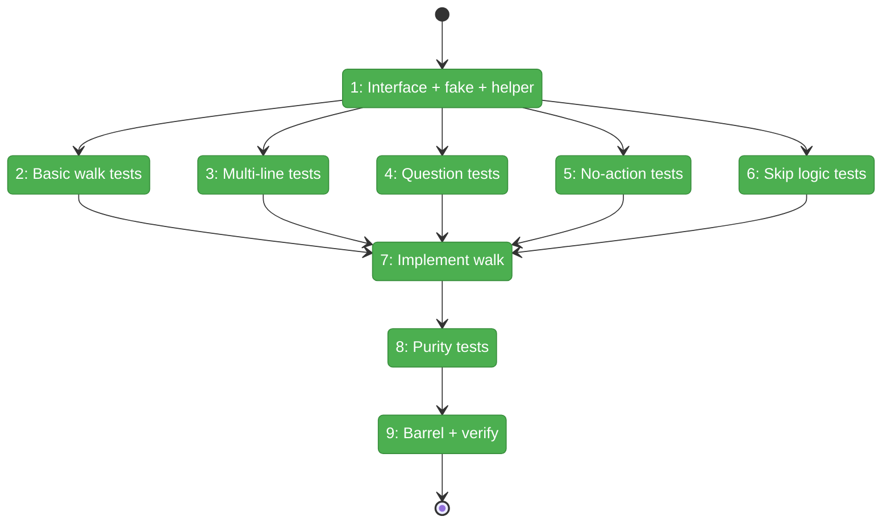
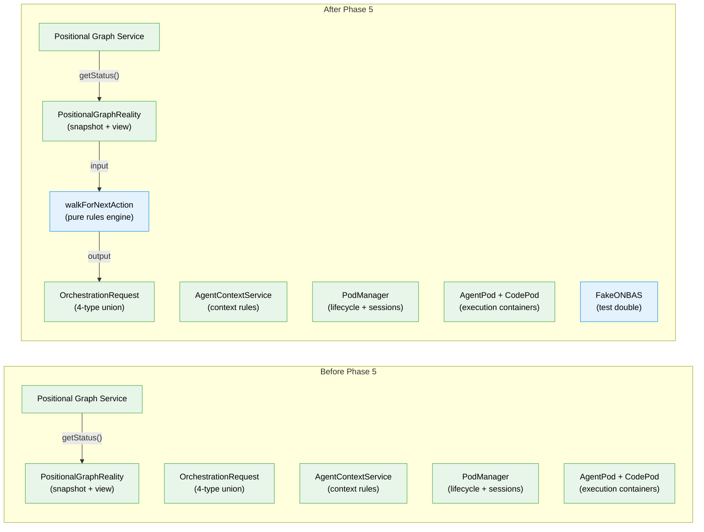

# Flight Plan: Phase 5 — ONBAS Walk Algorithm

**Plan**: [../../positional-orchestrator-plan.md](../../positional-orchestrator-plan.md)
**Phase**: Phase 5: ONBAS Walk Algorithm
**Generated**: 2026-02-06
**Status**: Landed

---

## Departure → Destination

**Where we are**: Phases 1-4 delivered four foundational pieces: an immutable `PositionalGraphReality` snapshot that captures the entire graph state with navigation helpers, a 4-type `OrchestrationRequest` discriminated union defining every possible action the orchestrator can take, a pure `getContextSource()` function for agent context inheritance, and execution containers (AgentPod, CodePod) with a PodManager for lifecycle and session persistence. The system can read graph state, express actions, determine context rules, and execute nodes — but nothing can decide *which* action to take next. There is no decision engine.

**Where we're going**: By the end of this phase, a developer can call `walkForNextAction(reality)` with any graph snapshot and get back the exact next action to take. The function walks lines in order, visits nodes by position, and returns the first actionable request — whether that's starting a ready node, resuming one with an answered question, or surfacing an unsurfaced question. When nothing can be done, it returns `no-action` with a diagnostic reason explaining why. The function is pure, synchronous, and stateless — same input always produces the same output.

---

## Flight Status

<!-- Updated by /plan-6: pending → active → done. Use blocked for problems/input needed. -->

**Legend**: grey = pending | yellow = active | red = blocked/needs input | green = done

---

## Stages

<!-- Updated by /plan-6 during implementation: [ ] → [~] → [x] -->

- [x] **Stage 1: Define IONBAS interface, FakeONBAS, and buildFakeReality helper** — interface with `getNextAction()`, class wrapper, configurable fake, test fixture builder (`onbas.types.ts`, `fake-onbas.ts` — new files)
- [x] **Stage 2: Write basic walk tests** — single ready node, graph-level short circuits (complete, failed), empty graph (`onbas.test.ts` — new file)
- [x] **Stage 3: Write multi-line walk order tests** — positional ordering, cross-line traversal, empty line passthrough, first-match stops walk (`onbas.test.ts`)
- [x] **Stage 4: Write question handling tests** — 3 sub-states: unsurfaced → question-pending, surfaced+unanswered → skip, answered → resume-node (`onbas.test.ts`)
- [x] **Stage 5: Write no-action scenario tests** — all-running, transition-blocked, diagnoseStuckLine, all-blocked (`onbas.test.ts`)
- [x] **Stage 6: Write skip logic tests** — table-driven: running/complete/pending/blocked-error skipped, ready starts (`onbas.test.ts`)
- [x] **Stage 7: Implement walkForNextAction** — pure function with visitNode, visitWaitingQuestion, diagnoseStuckLine (`onbas.ts` — new file)
- [x] **Stage 8: Write purity/determinism tests** — same input → same output, no side effects (AC-4) (`onbas.test.ts`)
- [x] **Stage 9: Update barrel and verify** — add Phase 5 exports to index, run `just fft` (`index.ts`)

---

## Architecture: Before & After

**Legend**: existing (green, unchanged) | changed (orange, modified) | new (blue, created)

---

## Acceptance Criteria

- [x] Walk visits lines in index order, nodes in position order (AC-3)
- [x] Each node status maps to the correct action or skip behavior (AC-3)
- [x] Pure, synchronous, stateless — same input always same output (AC-4)
- [x] Question lifecycle handled correctly for all 3 sub-states
- [x] `just fft` clean

---

## Goals & Non-Goals

**Goals**:
- Define `IONBAS` interface with `getNextAction(reality): OrchestrationRequest`
- Export `walkForNextAction()` as standalone pure function
- Implement `ONBAS` class wrapper for interface injection
- Implement `FakeONBAS` with configurable return values and call tracking
- Provide `buildFakeReality()` test helper
- Handle all 6 node statuses and 3 question sub-states
- Handle graph-level short circuits and line-level transition gates
- Enrich no-action with diagnostic reasons

**Non-Goals**:
- Action execution (Phase 6 ODS)
- Context inheritance (Phase 3 AgentContextService)
- Pod management (Phase 4 PodManager)
- Multiple actions per call
- Async or stateful behavior
- Unit type awareness (ONBAS reads `status` only)
- Infinite loop detection (Phase 7 loop responsibility)

---

## Checklist

- [x] T001: Define `IONBAS` interface + `FakeONBAS` + `buildFakeReality()` (CS-2)
- [x] T002: Write basic walk tests (CS-1)
- [x] T003: Write multi-line walk order tests (CS-2)
- [x] T004: Write question handling tests (CS-2)
- [x] T005: Write no-action scenario tests (CS-2)
- [x] T006: Write skip logic tests (CS-1)
- [x] T007: Implement `walkForNextAction()` (CS-3)
- [x] T008: Write purity/determinism tests (CS-1)
- [x] T009: Update barrel + `just fft` (CS-1)

---

## PlanPak

Active — files organized under `features/030-orchestration/`
