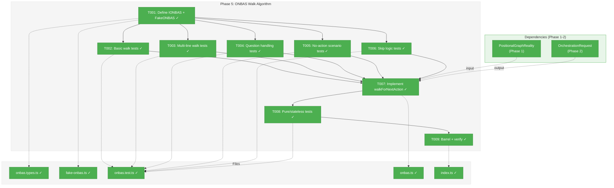
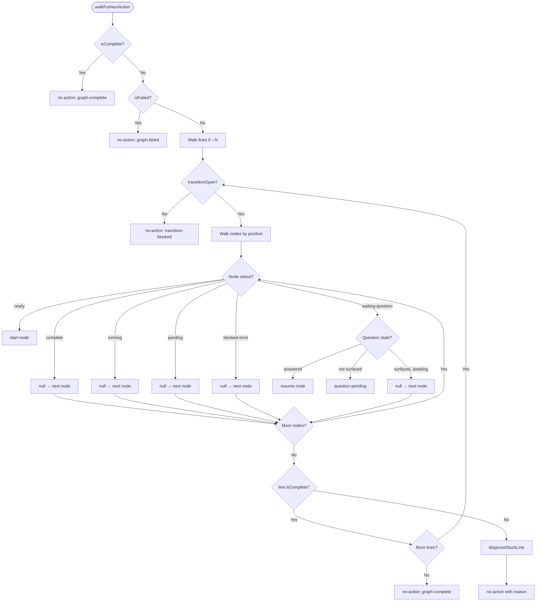

# Phase 5: ONBAS Walk Algorithm — Tasks & Alignment Brief

**Spec**: [../../positional-orchestrator-spec.md](../../positional-orchestrator-spec.md)
**Plan**: [../../positional-orchestrator-plan.md](../../positional-orchestrator-plan.md)
**Date**: 2026-02-06

---

## Executive Briefing

### Purpose

This phase implements ONBAS (OrchestrationNextBestActionService) — the stateless rules engine that examines a graph snapshot and decides "what should happen next?" ONBAS is the brain of the orchestrator: it walks lines and nodes in positional order, finds the first actionable node, and returns an `OrchestrationRequest` telling ODS what to do. Without ONBAS, the orchestration system has data models, context rules, and execution containers but no way to decide what action to take next.

### What We're Building

A pure function `walkForNextAction(reality: PositionalGraphReality): OrchestrationRequest` that:
- Walks lines in index order (0 → N), nodes in position order within each line
- Returns `start-node` when a ready node is found
- Returns `resume-node` when a node has an answered question
- Returns `question-pending` when a node has an unsurfaced question
- Skips running, complete, pending, blocked-error, and surfaced-question nodes
- Returns `no-action` with a diagnostic reason when no action is possible
- Short-circuits on graph-complete and graph-failed before walking
- Is pure, synchronous, stateless, and deterministic — same input always produces the same output

### User Value

A developer calling `walkForNextAction(reality)` gets a definitive answer about what to do next. The function handles all graph states, question sub-states, and edge cases. When the orchestration loop (Phase 7) repeatedly calls ONBAS → ODS → rebuild reality, the graph advances one action at a time from start to completion.

### Example

**Input**: A `PositionalGraphReality` with Line 0 containing node A (complete), node B (ready, parallel)
**Output**: `{ type: 'start-node', graphSlug: 'my-graph', nodeId: 'B', inputs: { ok: true, inputs: {} } }`

**Input**: A `PositionalGraphReality` where all nodes are complete
**Output**: `{ type: 'no-action', graphSlug: 'my-graph', reason: 'graph-complete' }`

---

## Objectives & Scope

### Objective

Implement the ONBAS walk algorithm as specified in Workshop #5 and satisfying acceptance criteria AC-3 (deterministic walk with correct action mapping) and AC-4 (pure, synchronous, stateless function).

### Goals

- Define `IONBAS` interface with `getNextAction(reality): OrchestrationRequest`
- Export `walkForNextAction()` as a standalone pure function
- Implement `ONBAS` class as a thin wrapper over the function (for interface/DI use)
- Implement `FakeONBAS` test double with configurable return values and call tracking
- Handle all 6 node statuses correctly: complete (skip), running (skip), pending (skip), blocked-error (skip), ready (start-node), waiting-question (3 sub-states)
- Handle graph-level short circuits: graph-complete, graph-failed
- Handle line-level gates: transitionOpen, isComplete
- Enrich no-action responses with diagnostic reasons: graph-complete, graph-failed, transition-blocked, all-waiting
- Provide `buildFakeReality()` test helper for constructing test fixtures
- Write comprehensive table-driven tests covering all walk paths

### Non-Goals

- Action execution (Phase 6 ODS responsibility)
- Context inheritance resolution (Phase 3 AgentContextService)
- Pod management (Phase 4 PodManager)
- Multiple actions per call (ONBAS returns exactly one request per invocation)
- Awareness of `unitType` (ONBAS treats all node types the same — it reads `status` only)
- Async behavior (ONBAS is synchronous — no I/O, no adapter calls)
- State between invocations (stateless — each call receives a fresh snapshot)
- Infinite loop detection (Phase 7 orchestration loop responsibility)

---

## Pre-Implementation Audit

### Summary

| File | Action | Origin | Modified By | Recommendation |
|------|--------|--------|-------------|----------------|
| `packages/positional-graph/src/features/030-orchestration/onbas.types.ts` | Create | New | — | proceed |
| `packages/positional-graph/src/features/030-orchestration/onbas.ts` | Create | New | — | proceed |
| `packages/positional-graph/src/features/030-orchestration/fake-onbas.ts` | Create | New | — | proceed |
| `test/unit/positional-graph/features/030-orchestration/onbas.test.ts` | Create | New | — | proceed |
| `packages/positional-graph/src/features/030-orchestration/index.ts` | Modify | Phase 1 | Phase 2, 3, 4 | proceed |

### Compliance Check

No violations found. All files follow kebab-case naming, feature folder placement, and PlanPak plan-scoped classification.

---

## Requirements Traceability

### Coverage Matrix

| AC | Description | Flow Summary | Files in Flow | Tasks | Status |
|----|-------------|-------------|---------------|-------|--------|
| AC-3 | ONBAS walks graph and returns deterministic next action | `walkForNextAction(reality)` walks lines 0→N, nodes by position, returns first actionable as `OrchestrationRequest` | `onbas.types.ts`, `onbas.ts`, `onbas.test.ts`, `index.ts` | T001–T007, T009 | Complete |
| AC-4 | ONBAS is pure, synchronous, stateless | Same input → same output; no side effects, no I/O, no state | `onbas.ts`, `onbas.test.ts` | T007, T008 | Complete |

### Gaps Found

No gaps — all acceptance criteria have complete file coverage.

### Orphan Files

| File | Tasks | Assessment |
|------|-------|------------|
| `fake-onbas.ts` | T001 | Test infrastructure — provides `FakeONBAS` for Phase 6/7 integration testing |

---

## Architecture Map

### Component Diagram

<!-- Status: grey=pending, orange=in-progress, green=completed, red=blocked -->
<!-- Updated by plan-6 during implementation -->



### Task-to-Component Mapping

<!-- Status: ⬜ Pending | 🟧 In Progress | ✅ Complete | 🔴 Blocked -->

| Task | Component(s) | Files | Status | Comment |
|------|-------------|-------|--------|---------|
| T001 | IONBAS interface + FakeONBAS | `onbas.types.ts`, `fake-onbas.ts` | ✅ Complete | Interface + test double following Phase 3 pattern |
| T002 | Test: basic walk | `onbas.test.ts` | ✅ Complete | RED: single ready node, graph-level short circuits |
| T003 | Test: multi-line walk | `onbas.test.ts` | ✅ Complete | RED: positional ordering, cross-line traversal |
| T004 | Test: question handling | `onbas.test.ts` | ✅ Complete | RED: 3 question sub-states per Workshop #5 |
| T005 | Test: no-action scenarios | `onbas.test.ts` | ✅ Complete | RED: graph-complete, graph-failed, transition-blocked, all-waiting |
| T006 | Test: skip logic | `onbas.test.ts` | ✅ Complete | RED: running/complete/pending/blocked-error nodes skipped |
| T007 | walkForNextAction impl | `onbas.ts` | ✅ Complete | GREEN: all tests from T002-T006 pass |
| T008 | Test: pure/stateless proof | `onbas.test.ts` | ✅ Complete | AC-4: determinism and no side effects |
| T009 | Barrel export + verify | `index.ts` | ✅ Complete | Update barrel, `just fft` clean |

---

## Tasks

| Status | ID | Task | CS | Type | Dependencies | Absolute Path(s) | Validation | Subtasks | Notes |
|--------|------|------|-----|------|-------------|-------------------|------------|----------|-------|
| [x] | T001 | Define `IONBAS` interface with `getNextAction(reality): OrchestrationRequest`, `ONBAS` class wrapper, `FakeONBAS` with `setNextAction()`, `setActions()` (queue), `getHistory()`, `reset()` + `buildFakeReality()` test helper | 2 | Setup | – | `/home/jak/substrate/030-positional-orchestrator/packages/positional-graph/src/features/030-orchestration/onbas.types.ts`, `/home/jak/substrate/030-positional-orchestrator/packages/positional-graph/src/features/030-orchestration/fake-onbas.ts` | Interface compiles, FakeONBAS passes basic config/history test, `buildFakeReality()` constructs valid `PositionalGraphReality` | – | Per Workshop #5 §Service Interface; `buildFakeReality` per §Testing Strategy |
| [x] | T002 | Write tests for basic walk: single ready node → `start-node`, graph-complete short circuit, graph-failed short circuit, empty graph | 1 | Test | T001 | `/home/jak/substrate/030-positional-orchestrator/test/unit/positional-graph/features/030-orchestration/onbas.test.ts` | Tests fail with module not found (RED) | – | Plan 5.2 |
| [x] | T003 | Write tests for multi-line walk order: lines visited 0→N, nodes by position, first actionable stops walk, cross-line traversal through complete lines, empty line passthrough | 2 | Test | T001 | `/home/jak/substrate/030-positional-orchestrator/test/unit/positional-graph/features/030-orchestration/onbas.test.ts` | Tests fail (RED) | – | Plan 5.3 |
| [x] | T004 | Write tests for question handling: unsurfaced → `question-pending`, surfaced+unanswered → skip, answered → `resume-node`, multiple questions same line, answered question prioritized over ready node, missing question → skip (defensive) | 2 | Test | T001 | `/home/jak/substrate/030-positional-orchestrator/test/unit/positional-graph/features/030-orchestration/onbas.test.ts` | Tests fail (RED) | – | Plan 5.4; 3 sub-states per Workshop #5 §Question Visit Logic |
| [x] | T005 | Write tests for no-action scenarios: all-running → `all-waiting`, transition-blocked (manual transition not triggered), surfaced-awaiting → `all-waiting`, diagnoseStuckLine with running+waiting → `all-waiting`, blocked-error only → `graph-failed`, pending nodes only → `all-waiting` | 2 | Test | T001 | `/home/jak/substrate/030-positional-orchestrator/test/unit/positional-graph/features/030-orchestration/onbas.test.ts` | Tests fail (RED) | – | Plan 5.5; NoActionReason enrichment per Workshop #5 §Stuck Line Diagnosis |
| [x] | T006 | Write tests for skip logic: running skipped, complete skipped, pending skipped, blocked-error skipped — using table-driven tests per Workshop #5 | 1 | Test | T001 | `/home/jak/substrate/030-positional-orchestrator/test/unit/positional-graph/features/030-orchestration/onbas.test.ts` | Tests fail (RED) | – | Plan 5.6 |
| [x] | T007 | Implement `walkForNextAction()` with `visitNode()`, `visitWaitingQuestion()`, `diagnoseStuckLine()` — pure function, no async, no side effects | 3 | Core | T002, T003, T004, T005, T006 | `/home/jak/substrate/030-positional-orchestrator/packages/positional-graph/src/features/030-orchestration/onbas.ts` | All tests from T002-T006 pass | – | Plan 5.7; GREEN phase; per Workshop #5 §Walk Algorithm |
| [x] | T008 | Write tests proving pure/stateless behavior: same input → same output across N calls, no side effects, verify synchronous (no async) | 1 | Test | T007 | `/home/jak/substrate/030-positional-orchestrator/test/unit/positional-graph/features/030-orchestration/onbas.test.ts` | Determinism tests pass | – | Plan 5.8; AC-4 proof |
| [x] | T009 | Update barrel `index.ts` with Phase 5 exports (`IONBAS`, `walkForNextAction`, `ONBAS`, `FakeONBAS`, `buildFakeReality`) + run `just fft` | 1 | Setup | T007, T008 | `/home/jak/substrate/030-positional-orchestrator/packages/positional-graph/src/features/030-orchestration/index.ts` | `just fft` clean, all tests pass | – | Plan 5.9; plan-scoped |

---

## Alignment Brief

### Prior Phases Review

#### Phase-by-Phase Summary

**Phase 1: PositionalGraphReality Snapshot** — Delivered the immutable snapshot data model (`PositionalGraphReality`) with Zod schemas, a builder function (`buildPositionalGraphReality`), and a view class (`PositionalGraphRealityView`) with 11 navigation methods. Key decisions: pure function builder (no DI), `ReadonlyMap` for immutability, past-the-end sentinel for `currentLineIndex`, no top-level Zod schema (DYK-I4). 47 tests. `unitType` made required on `NodeStatusResult` (DYK-I5).

**Phase 2: OrchestrationRequest Discriminated Union** — Delivered the 4-variant `OrchestrationRequest` type (`start-node`, `resume-node`, `question-pending`, `no-action`) with Zod schemas, type guards, and `OrchestrationExecuteResult`. Key decisions: Zod-first with `z.infer<>` (DYK-I6), two-file split `.schema.ts`/`.types.ts`, `.strict()` on all variants, NoActionReason reduced from 5 to 4 values (Workshop #2 authoritative), exhaustive `never` switch test. 37 tests.

**Phase 3: AgentContextService** — Delivered `getContextSource()` pure function implementing 5 positional context rules, plus `AgentContextService` class wrapper, `FakeAgentContextService`, and Zod-first `ContextSourceResult` type. Key decisions: bare function + thin class (DYK-I9), custom walk-back loops over View extensions, forward-compatible `noContext` guard (DYK-I10/I13). 14 tests.

**Phase 4: WorkUnitPods and PodManager** — Delivered execution containers: `AgentPod` (wraps `IAgentAdapter`), `CodePod` (wraps `IScriptRunner`), `PodManager` (lifecycle + atomic session persistence), `FakePodManager`/`FakePod`. Key decisions: `PodCreateParams` discriminated union for type-safe creation (DYK-P4#4), pod owns session state (DYK-P4#2), prompt caching (DYK-P4#1), configurable fake pattern. 53 tests.

#### Cumulative Deliverables Available to Phase 5

**From Phase 1** (ONBAS input):
- `PositionalGraphReality` — main input to `walkForNextAction()` with `graphSlug`, `graphStatus`, `isComplete`, `isFailed`, `lines`, `nodes`, `questions`, convenience accessors
- `NodeReality` — per-node: `status`, `ready`, `inputPack`, `pendingQuestionId`, `execution`, `positionInLine`, `lineIndex`
- `LineReality` — per-line: `transitionOpen`, `isComplete`, `nodeIds`, `index`
- `QuestionReality` — per-question: `isAnswered`, `isSurfaced`, `answer`, `questionId`, `questionType`, `text`, `options`, `defaultValue`

**From Phase 2** (ONBAS output):
- `OrchestrationRequest` — 4-variant discriminated union
- `StartNodeRequest` — `{ type: 'start-node', graphSlug, nodeId, inputs }`
- `ResumeNodeRequest` — `{ type: 'resume-node', graphSlug, nodeId, questionId, answer }`
- `QuestionPendingRequest` — `{ type: 'question-pending', graphSlug, nodeId, questionId, questionText, questionType, options?, defaultValue? }`
- `NoActionRequest` — `{ type: 'no-action', graphSlug, reason?, lineId? }`
- `NoActionReason` — 4-value enum: `graph-complete`, `transition-blocked`, `all-waiting`, `graph-failed`

**From Phase 3** (not used by ONBAS):
- `getContextSource()` — used by ODS (Phase 6), not ONBAS

**From Phase 4** (not used by ONBAS):
- Pods, PodManager — used by ODS (Phase 6), not ONBAS

#### Test Infrastructure Available

- `FakeAgentAdapter` from `@chainglass/shared`
- `FakeScriptRunner` from `script-runner.types.ts`
- `FakePodManager`, `FakePod` from `fake-pod-manager.ts`
- `FakeAgentContextService` from `fake-agent-context.ts`
- Reality test helpers in `reality.test.ts` (local to test file)

#### Reusable Patterns

- Pure function + thin class wrapper (Phase 3 `getContextSource` / `AgentContextService`)
- Zod-first schema derivation (Phases 1-2)
- Configurable fake pattern: `setXxx()` + `getHistory()` + `reset()` (Phases 3-4)
- Test Doc 5-field comment block (all phases)

### Critical Findings Affecting This Phase

| Finding | Impact | How Addressed |
|---------|--------|---------------|
| **#02**: 4-type union is exhaustive | Critical — ONBAS returns exactly these 4 types | T007 implements exhaustive switch with `never` check for unknown statuses |
| **#04**: ONBAS is pure and synchronous | Critical — core design constraint | T008 proves determinism; T007 implements with no async, no I/O, no DI |
| **#07**: Question lifecycle has 3 states | High — ONBAS detects question sub-states | T004 tests all 3: unsurfaced → question-pending, surfaced+unanswered → skip, answered → resume-node |
| **#08**: Existing canRun gates not replaced | High — ONBAS trusts `status` and `ready` from snapshot | T007 reads `node.status` only; never recomputes gates |

### ADR Decision Constraints

No ADRs directly constrain Phase 5. ONBAS is an internal collaborator not registered in DI (per plan constraints).

### PlanPak Placement Rules

- All source files → `packages/positional-graph/src/features/030-orchestration/` (plan-scoped)
- Test files → `test/unit/positional-graph/features/030-orchestration/` (plan-scoped)
- `index.ts` barrel update → cross-cutting (same file extended across phases)

### Invariants & Guardrails

- **Pure function**: `walkForNextAction()` has no side effects, no I/O, no async
- **Synchronous**: Return type is `OrchestrationRequest`, not `Promise<OrchestrationRequest>`
- **Stateless**: No class fields, no module-level mutable state
- **First-match**: Walk returns immediately on first actionable node
- **Positional order**: Lines by index ascending, nodes by position ascending within line
- **Trust the snapshot**: Never recompute readiness gates — read `status` field only

### Visual Alignment: Flow Diagram



### Visual Alignment: Sequence Diagram (Orchestration Loop Context)

```mermaid
sequenceDiagram
    participant Loop as Orchestration Loop
    participant Builder as Reality Builder
    participant ONBAS as walkForNextAction
    participant ODS as ODS

    Loop->>Builder: buildReality(ctx, graphSlug)
    Builder-->>Loop: PositionalGraphReality
    Loop->>ONBAS: walkForNextAction(reality)
    ONBAS-->>Loop: OrchestrationRequest

    alt start-node or resume-node
        Loop->>ODS: execute(request)
        ODS-->>Loop: OrchestrationExecuteResult
        Note over Loop: State updated → rebuild reality → call ONBAS again
    else question-pending
        Loop->>ODS: execute(request)
        ODS-->>Loop: OrchestrationExecuteResult (question surfaced)
        Note over Loop: Exit loop — wait for user answer
    else no-action
        Note over Loop: Exit loop — nothing to do
    end
```

### Test Plan (Full TDD)

**Testing approach**: ONBAS is a pure function. Testing is straightforward: build a `PositionalGraphReality` with specific node statuses, call `walkForNextAction(reality)`, assert the returned `OrchestrationRequest`. No mocks, no async, no filesystem.

**Test helper**: `buildFakeReality(options)` constructs minimal `PositionalGraphReality` objects from declarative options. Fills in sensible defaults. Defined in test file or separate helper per Workshop #5 §Testing Strategy.

| Test Group | Tests | Task | AC |
|-----------|-------|------|-----|
| Graph-level short circuits | graph-complete → no-action, graph-failed → no-action | T002 | AC-3 |
| Basic walk: single ready | ready node → start-node, empty graph → no-action | T002 | AC-3 |
| Multi-line walk order | lines 0→N, position-order, first-match stops, cross-line traversal, empty line passthrough | T003 | AC-3 |
| Question sub-states | unsurfaced → question-pending, surfaced+unanswered → skip, answered → resume-node, missing question → skip (defensive) | T004 | AC-3 |
| No-action scenarios | all-running → all-waiting, transition-blocked, diagnoseStuckLine reasons, all-blocked → graph-failed | T005 | AC-3 |
| Skip logic (table-driven) | complete → skip, running → skip, pending → skip, blocked-error → skip, ready → start-node | T006 | AC-3 |
| Pure/stateless proof | same input → same output N times, no side effects | T008 | AC-4 |
| Complex multi-line | mixed running/question/ready on same line, questions from earlier lines block later lines | T003, T004 | AC-3 |

**Expected test count**: ~40-50 tests across T002-T008.

### Step-by-Step Implementation Outline

1. **T001**: Define `IONBAS` interface in `onbas.types.ts` + implement `FakeONBAS` in `fake-onbas.ts` + implement `buildFakeReality()` test helper
2. **T002-T006**: Write all RED tests in `onbas.test.ts` — tests import from `onbas.ts` which does not exist yet → all fail with module not found
3. **T007**: Implement `walkForNextAction()`, `visitNode()`, `visitWaitingQuestion()`, `diagnoseStuckLine()` in `onbas.ts` + `ONBAS` class wrapper → all tests from T002-T006 pass
4. **T008**: Add determinism/purity tests — call same function N times, assert identical results
5. **T009**: Add Phase 5 exports to `index.ts`, run `just fft`

### Commands to Run

```bash
# Run just the ONBAS tests during development
pnpm vitest run test/unit/positional-graph/features/030-orchestration/onbas.test.ts

# Full validation before commit
just fft

# Build check
pnpm build
```

### Risks & Unknowns

| Risk | Severity | Mitigation |
|------|----------|------------|
| `QuestionReality` field names differ from Workshop #5 pseudocode | Medium | Verify against actual `reality.types.ts` — fields are `isSurfaced`, `isAnswered`, `answer`, not `surfaced_at`/`answered_at` |
| `NoActionRequest.reason` is optional in schema but ONBAS should always set it | Low | T005 asserts reason is always present in ONBAS output |
| `QuestionPendingRequest.options` expects `string[]` but `QuestionReality.options` is `QuestionOption[]` | Medium | ONBAS must map `QuestionOption[]` to `string[]` (extract `label` field) per DYK-I2 |
| Test helper `buildFakeReality` might diverge from actual `PositionalGraphReality` shape | Low | Build helper using the actual type to get compile-time checks |

### Ready Check

- [x] Prior phases reviewed (Phases 1-4 complete, all deliverables available)
- [x] Critical findings mapped to tasks (#02 → T007, #04 → T008, #07 → T004, #08 → T007)
- [x] ADR constraints mapped to tasks — N/A (no ADRs constrain Phase 5)
- [x] Pre-implementation audit complete (no duplication, no compliance violations)
- [x] Requirements traceability verified (AC-3 and AC-4 fully covered)
- [x] Human GO/NO-GO

---

## Phase Footnote Stubs

_Populated by plan-6 after implementation. Maps plan footnotes to task IDs and FlowSpace node references._

| Footnote | Task(s) | Description |
|----------|---------|-------------|
| [^18] | T001 (5.1) | IONBAS interface + FakeONBAS + buildFakeReality |
| [^19] | T002-T006, T008 (5.2-5.6, 5.8) | All ONBAS tests (RED) |
| [^20] | T007 (5.7) | walkForNextAction implementation (GREEN) |
| [^21] | T009 (5.9) | Barrel index update with Phase 5 exports |

---

## Evidence Artifacts

Implementation will write the execution log to:
- `docs/plans/030-positional-orchestrator/tasks/phase-5-onbas-walk-algorithm/execution.log.md`

---

## Discoveries & Learnings

_Populated during implementation by plan-6. Log anything of interest to your future self._

| Date | Task | Type | Discovery | Resolution | References |
|------|------|------|-----------|------------|------------|
| | | | | | |

**Types**: `gotcha` | `research-needed` | `unexpected-behavior` | `workaround` | `decision` | `debt` | `insight`

**What to log**:
- Things that didn't work as expected
- External research that was required
- Implementation troubles and how they were resolved
- Gotchas and edge cases discovered
- Decisions made during implementation
- Technical debt introduced (and why)
- Insights that future phases should know about

_See also: `execution.log.md` for detailed narrative._

---

## Directory Layout

```
docs/plans/030-positional-orchestrator/
  ├── positional-orchestrator-plan.md
  └── tasks/phase-5-onbas-walk-algorithm/
      ├── tasks.md                  # This file
      ├── tasks.fltplan.md          # Generated by /plan-5b (Flight Plan summary)
      └── execution.log.md          # Created by /plan-6
```

---

## Critical Insights (2026-02-06)

| # | Insight | Decision |
|---|---------|----------|
| 1 | `QuestionReality.options` is `QuestionOption[]` but `QuestionPendingRequest.options` is `string[]` — Workshop #5 pseudocode passes through without mapping | Map with `question.options?.map(o => o.label)` in `visitWaitingQuestion` |
| 2 | `PositionalGraphReality.questions` is an array (not a Map) — `.find()` is O(n) per waiting-question node | Accept `.find()` as-is; graphs won't have hundreds of questions |
| 3 | `NoActionRequest.lineId` is optional on all reasons but only meaningful for `transition-blocked` | Assert `lineId` present only for `transition-blocked`, explicitly verify absent for others |
| 4 | Walk has two paths returning `graph-complete` (short-circuit + fallthrough after all lines complete) — fallthrough is logically unreachable | Keep defensive fallthrough per Workshop #5; harmless redundancy |
| 5 | `buildFakeReality` is needed by Phase 6/7/8 — placement matters for cross-phase imports | Place in `fake-onbas.ts` per T001, export from barrel for reuse |

Action items: None — all insights are implementation guidance for T001-T007
