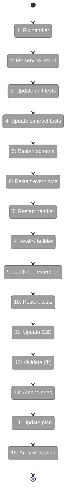
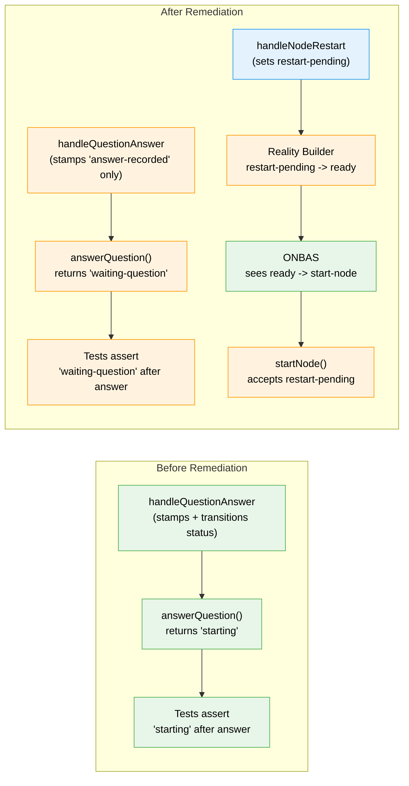

# Flight Plan: Subtask 001 — Concept Drift Remediation

**Plan**: [positional-orchestrator-plan.md](../../positional-orchestrator-plan.md)
**Phase**: Phase 6: ODS Action Handlers (Subtask 001)
**Generated**: 2026-02-09
**Status**: Ready for takeoff

---

## Departure -> Destination

**Where we are**: Phases 1-5 of Plan 030 are complete (reality snapshots,
orchestration requests, agent context, pods, and ONBAS). Plan 032 (Node
Event System) shipped all 8 phases with 3690 tests green. But one event
handler — `handleQuestionAnswer` — crosses the domain boundary by
transitioning node status, which will cause orphan nodes when ODS is built.
The spec and plan documents still describe the pre-032 design.

**Where we're going**: By the end of this subtask, the two-domain boundary
is clean. Event handlers record what happened (stamps only). A new
`node:restart` event (Workshop 10) enables the convention-based contract:
handler sets `restart-pending`, reality builder maps to `ready`, ONBAS
returns `start-node`. ODS stays Q&A-agnostic. All tests pass, the spec and
plan reflect the real architecture, and the stale Phase 6 dossier is
archived so a fresh one can be generated.

---

## Flight Status

<!-- Updated by /plan-6: pending -> active -> done. Use blocked for problems/input needed. -->

**Legend**: grey = pending | yellow = active | red = blocked/needs input | green = done

---

## Stages

<!-- Updated by /plan-6 during implementation: [ ] -> [~] -> [x] -->

- [ ] **Stage 1: Fix the question-answer handler** — remove status transition and `pending_question_id` clear, stamp `answer-recorded` only; fix progress stamp to `progress-recorded` (`event-handlers.ts`)
- [ ] **Stage 2: Fix the service return value** — `answerQuestion()` returns `waiting-question` not `starting`, update the `AnswerQuestionResult` type (`positional-graph-service.interface.ts`, `positional-graph.service.ts`)
- [ ] **Stage 3: Update handler unit tests** — T005 suite: node stays `waiting-question`, stamp is `answer-recorded`; T006/Walkthrough 3: progress stamp is `progress-recorded` (`event-handlers.test.ts`)
- [ ] **Stage 4: Update service contract tests** — assert `waiting-question` status and `answer-recorded` stamp in 2 files (`service-wrapper-contracts.test.ts`, `question-answer.test.ts`)
- [ ] **Stage 5: Add restart-pending status** — extend `NodeExecutionStatusSchema`, both `ExecutionStatus` types, add `NodeRestartPayloadSchema` (`state.schema.ts`, `reality.types.ts`, `interface.ts`, `event-payloads.schema.ts`)
- [ ] **Stage 6: Register node:restart event** — 7th core event type + `VALID_FROM_STATES` entry for `waiting-question`, `blocked-error` (`core-event-types.ts`, `raise-event.ts`)
- [ ] **Stage 7: Implement handleNodeRestart** — sets `restart-pending`, clears `pending_question_id`, stamps `restart-initiated` (`event-handlers.ts`)
- [ ] **Stage 8: Update reality builder** — map stored `restart-pending` to computed `ready` in `getNodeStatus()` (`positional-graph.service.ts`)
- [ ] **Stage 9: Extend startNode** — accept `restart-pending` alongside `pending` as valid from-state (`positional-graph.service.ts`)
- [ ] **Stage 10: Restart unit tests** — handler T007 suite, reality builder mapping, startNode lifecycle (`event-handlers.test.ts`, `reality.test.ts`, `execution-lifecycle.test.ts`)
- [ ] **Stage 11: Update E2E visual test** — Workshop 10 hybrid approach: raise `node:restart`, call `startNode()` in-process to simulate ODS (`node-event-system-visual-e2e.ts`)
- [ ] **Stage 12: Validate** — run `just fft` to confirm all tests pass
- [ ] **Stage 13: Amend spec** — AC-6, AC-9, Settle AC, Goal 4, Non-Goal 5 (`positional-orchestrator-spec.md`)
- [ ] **Stage 14: Update plan document** — Phase 6/7, CF-07, workshops, subtask registry (`positional-orchestrator-plan.md`)
- [ ] **Stage 15: Archive stale dossier** — rename `tasks.md` and `tasks.fltplan.md` with `.archived` suffix

---

## Architecture: Before & After

**Legend**: existing (green, unchanged) | changed (orange, modified) | new (blue, created)

---

## Acceptance Criteria

- [ ] `handleQuestionAnswer` stamps `answer-recorded` only — no status transition, no clearing `pending_question_id`
- [ ] `handleNodeRestart` sets `restart-pending`, clears `pending_question_id`, stamps `restart-initiated`
- [ ] Reality builder maps `restart-pending` to `ready`
- [ ] `startNode()` accepts `restart-pending` as valid from-state
- [ ] All unit tests pass asserting the new behavior (node stays `waiting-question`)
- [ ] `node:restart` unit tests pass (handler, reality mapping, lifecycle)
- [ ] E2E visual test passes (exit 0) using Workshop 10 hybrid approach
- [ ] `answerQuestion()` returns `{ status: 'waiting-question' }`
- [ ] Spec ACs describe the two-domain boundary correctly
- [ ] Plan document reflects Plan 032 completion and Settle-Decide-Act model
- [ ] Stale Phase 6 dossier archived
- [ ] `just fft` passes

## Goals & Non-Goals

**Goals**:
- Fix handler to stamp without transitioning (Category A)
- Update all test files asserting old behavior (Category A)
- Update service return type and implementation (Category A)
- Implement `node:restart` event with full test coverage (Workshop 10)
- Amend spec ACs with stale domain-crossing behavior (Category B)
- Update plan: Phase 6/7 descriptions, CF-07, workshops, subtask registry (Category C)
- Archive stale Phase 6 dossier (Category C)

**Non-Goals**:
- Implementing ODS (Phase 6 proper)
- Implementing the orchestration loop (Phase 7)
- Changing ONBAS code (already handles `ready` naturally)
- Building a new Phase 6 dossier (done after this subtask via `/plan-5`)

---

## Checklist

- [ ] ST001: Fix handleQuestionAnswer + handleProgressUpdate stamps (CS-1)
- [ ] ST002: Update handler unit tests (CS-2)
- [ ] ST003: Update service contract tests (CS-2)
- [ ] ST004: Update E2E visual test — Workshop 10 hybrid approach (CS-3)
- [ ] ST005: Update answerQuestion() return type and implementation (CS-1)
- [ ] ST006: Amend spec ACs (CS-2)
- [ ] ST007: Update plan document (CS-2)
- [ ] ST008: Archive stale Phase 6 dossier (CS-1)
- [ ] ST010: Add restart-pending status + NodeRestartPayloadSchema (CS-2)
- [ ] ST011: Register node:restart event type + VALID_FROM_STATES (CS-2)
- [ ] ST012: Implement handleNodeRestart handler (CS-1)
- [ ] ST013: Update reality builder mapping (CS-2)
- [ ] ST014: Extend startNode() from-states (CS-1)
- [ ] ST015: Unit tests for node:restart mechanics (CS-3)
- [ ] ST009: Validate: just fft (CS-1)

---

## PlanPak

Not active for this plan.
