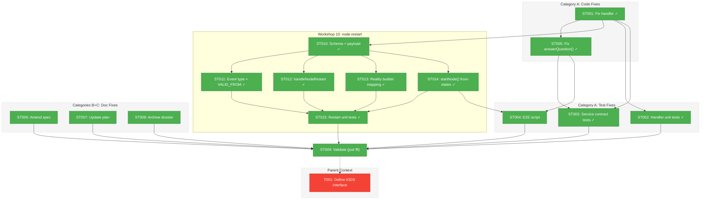
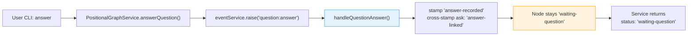
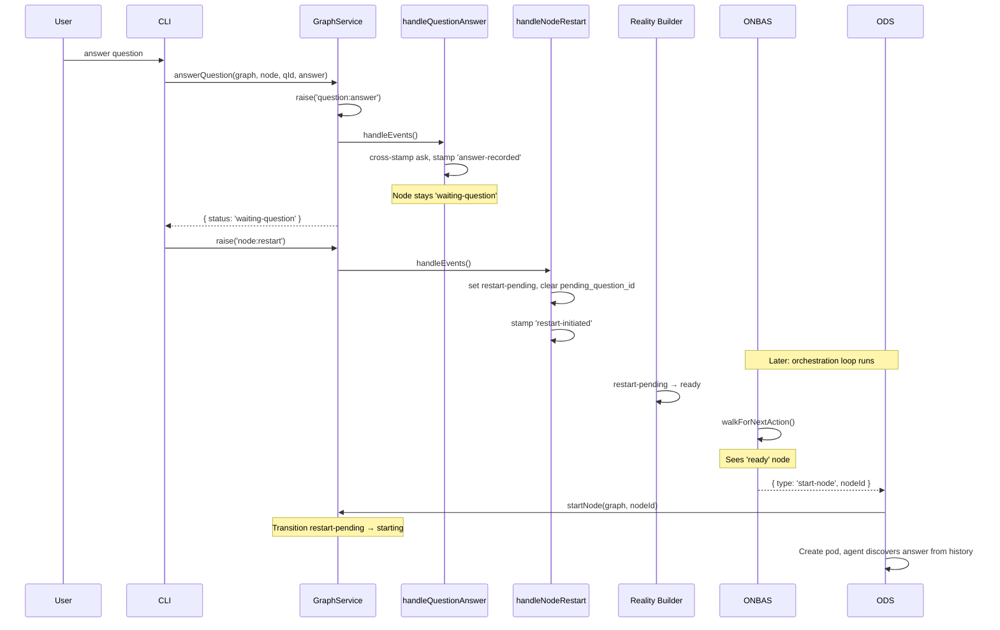

# Subtask 001: Concept Drift Remediation — Align Plan 030/032 Domains Before Phase 6

**Parent Plan:** [positional-orchestrator-plan.md](../../positional-orchestrator-plan.md)
**Parent Phase:** Phase 6: ODS Action Handlers
**Parent Task(s):** T001: Define IODS interface and ODS dependency types
**Spec:** [positional-orchestrator-spec.md](../../positional-orchestrator-spec.md)
**Date:** 2026-02-09
**Status:** Complete

---

## Parent Context

**Parent Plan:** [View Plan](../../positional-orchestrator-plan.md)
**Parent Phase:** Phase 6: ODS Action Handlers
**Parent Task(s):** [T001: Define IODS interface and ODS dependency types](../tasks.md)

**Why This Subtask:**
Plan 032 (Node Event System) completed all 8 phases, introducing a unified event protocol. This revealed concept drift between Plan 030's original design assumptions and Plan 032's actual implementation. Workshop 09 identified 8 violations of the two-domain boundary (Graph Domain vs Event Domain). Before Phase 6 can proceed, we must remediate: fix one handler that crosses the boundary, update tests, amend the spec and plan documents, and archive the stale Phase 6 dossier. Without this, Phase 6 would be built on stale foundations.

---

## Executive Briefing

### Purpose

This subtask remediates concept drift between Plan 030 (Positional Orchestrator) and Plan 032 (Node Event System). The central issue is a single event handler — `handleQuestionAnswer` — that currently makes graph-domain decisions (status transitions) that belong to ONBAS/ODS. Fixing this handler and propagating the change through tests, types, and documentation establishes the clean two-domain boundary that Phase 6 needs.

### What We're Building

Not a feature — a correction. We're:
1. **Fixing one handler** so it stamps events without making graph decisions
2. **Updating tests** across 4 test files to assert the corrected behavior
3. **Updating one service method** and its return type to match
4. **Amending spec and plan** documents to reflect the two-domain boundary
5. **Archiving the stale Phase 6 dossier** so it can be regenerated cleanly

### Unblocks

Phase 6 (ODS Action Handlers) — which will implement the Settle -> Decide -> Act loop. ODS needs the handler to NOT transition status so that ONBAS can detect the answered question and return `resume-node`, which ODS then executes.

### Example

**Before (handler crosses domain boundary):**
```
User answers question via CLI
  -> raiseEvent('question:answer')
  -> handleQuestionAnswer: stamps + sets status='starting' + clears pending_question_id
  -> Node is 'starting' — ONBAS skips it (treats as already active)
  -> ORPHAN: no one re-invokes the agent with the answer
```

**After (clean domain boundary):**
```
User answers question via CLI
  -> raiseEvent('question:answer')
  -> handleQuestionAnswer: stamps 'answer-recorded' only
  -> Node stays 'waiting-question'
  -> raiseEvent('node:restart') [Workshop 10]
  -> handleNodeRestart: sets status='restart-pending', stamps 'restart-initiated'
  -> Reality builder: restart-pending -> ready
  -> ONBAS walks graph, finds ready node -> returns 'start-node'
  -> ODS executes start: transitions status, creates pod, agent discovers answer from history
```

---

## Objectives & Scope

### Objective

Establish the clean two-domain boundary (Graph Domain / Event Domain) identified in Workshop 09, so that Phase 6 ODS implementation operates on correct assumptions.

### Goals

- Fix `handleQuestionAnswer` to stamp without transitioning (Category A)
- Update all test files that assert the old behavior (Category A)
- Update `answerQuestion()` return type and implementation (Category A)
- Amend spec ACs that describe stale domain-crossing behavior (Category B)
- Update plan document: Phase 6/7 descriptions, CF-07, workshops, subtask registry (Category C)
- Archive stale Phase 6 dossier (Category C)
- `just fft` passes (validation)

### Non-Goals

- Implementing ODS (Phase 6 — after this subtask)
- Implementing the orchestration loop (Phase 7 — after Phase 6)
- Changing ONBAS code (already correct per Workshop 09 Category D)
- Changing pod/PodManager code (already correct per Category D)
- Changing reality builder code (already correct per Category D)
- Building a new Phase 6 dossier (done via `/plan-5` after this subtask completes)

---

## Pre-Implementation Audit

### Summary

| # | File | Action | Origin Plan | Modified By | Recommendation |
|---|------|--------|-------------|-------------|----------------|
| 1 | `event-handlers.ts` | MODIFY | Plan 032 Phase 4 | Plan 032 Phase 5 | compliance-warning |
| 2 | `event-handlers.test.ts` | MODIFY | Plan 032 Phase 4 | Plan 032 Phase 5 | compliance-warning |
| 3 | `service-wrapper-contracts.test.ts` | MODIFY | Plan 032 Phase 5 | Plan 032 Phase 5 | compliance-warning |
| 4 | `question-answer.test.ts` | MODIFY | Plan 028 | Plan 032 Phase 8 | compliance-warning |
| 5 | `node-event-system-visual-e2e.ts` | MODIFY | Plan 032 Phase 8 | Plan 032 Phase 8 | compliance-warning |
| 6 | `positional-graph-service.interface.ts` | MODIFY | Plan 026 | Plan 032 Phase 8 | keep-as-is |
| 7 | `positional-graph.service.ts` | MODIFY | Plan 026 | Plan 032 Phase 8 | keep-as-is |
| 8 | `positional-orchestrator-spec.md` | MODIFY | Plan 030 | Plan 030 (initial) | keep-as-is |
| 9 | `positional-orchestrator-plan.md` | MODIFY | Plan 030 | Plan 032 (bookkeeping) | keep-as-is |
| 10 | `tasks.md` (Phase 6 dossier) | ARCHIVE | Plan 030 | Plan 032 (minor) | keep-as-is |

### Compliance Check

| Severity | File | Issue | Detail |
|----------|------|-------|--------|
| CRITICAL | `event-handlers.ts` | Workshop 09 Violation 5 | `handleQuestionAnswer` makes graph-domain decisions (status transition, `pending_question_id` clearing) |
| HIGH | 4 test files | Test accuracy | Assert stale behavior (`starting` after answer, `state-transition` stamp) |
| HIGH | `positional-graph.service.ts` | Cascading impact | `answerQuestion()` hardcodes `status: 'starting'` return at line 2162 |
| MEDIUM | `positional-graph-service.interface.ts` | Type accuracy | `AnswerQuestionResult.status` typed as `'starting'` |
| MEDIUM | `positional-orchestrator-spec.md` | Concept drift | AC-6 references `running` status; AC-9 describes stale ODS behavior |

---

## Requirements Traceability

### Coverage Matrix

| AC | Description | Flow Summary | Files in Flow | Tasks | Status |
|----|-------------|-------------|---------------|-------|--------|
| AC-S1 | Handler stamps only, no status transition | `event-handlers.ts:34-49` | 1 | ST001 | Complete |
| AC-S2 | All handler unit tests pass with new behavior | `event-handlers.test.ts`, `service-wrapper-contracts.test.ts`, `question-answer.test.ts` | 3 | ST002, ST003 | Complete |
| AC-S3 | E2E visual test passes | `node-event-system-visual-e2e.ts` | 1 | ST004 | Complete |
| AC-S4 | `answerQuestion()` returns `waiting-question` | `positional-graph-service.interface.ts`, `positional-graph.service.ts` | 2 | ST005 | Complete |
| AC-S5 | Spec amended | `positional-orchestrator-spec.md` | 1 | ST006 | Complete |
| AC-S6 | Plan updated + stale dossier archived | `positional-orchestrator-plan.md`, `tasks.md` | 2 | ST007, ST008 | Complete |
| AC-S7 | `just fft` passes | All files | 0 | ST009 | Complete |

### Gaps Found

No gaps — initial gaps (2 additional test files: `service-wrapper-contracts.test.ts` and `question-answer.test.ts`) were folded into the task table as ST003.

### Orphan Files

None. All files serve a remediation AC.

---

## Architecture Map

### Component Diagram

<!-- Status: grey=pending, orange=in-progress, green=completed, red=blocked -->
<!-- Updated by plan-6 during implementation -->



### Task-to-Component Mapping

<!-- Status: Pending | In Progress | Complete | Blocked -->

| Task | Component(s) | Files | Status | Comment |
|------|-------------|-------|--------|---------|
| ST001 | Event Handler | `event-handlers.ts` | ✅ Complete | Remove status transition + pending_question_id clear |
| ST002 | Handler Unit Tests | `event-handlers.test.ts` | ✅ Complete | Update T005 suite + walkthrough assertions |
| ST003 | Service Contract Tests | `service-wrapper-contracts.test.ts`, `question-answer.test.ts` | ✅ Complete | Update answer assertions in 2 files |
| ST004 | E2E Visual Test | `node-event-system-visual-e2e.ts` | ✅ Complete | Restructured: Workshop 10 restart flow, 45 steps pass |
| ST005 | Service + Interface | `positional-graph-service.interface.ts`, `positional-graph.service.ts` | ✅ Complete | Return `waiting-question` not `starting` |
| ST006 | Spec | `positional-orchestrator-spec.md` | ✅ Complete | AC-6, AC-9, Goal 4 amended |
| ST007 | Plan | `positional-orchestrator-plan.md` | ✅ Complete | CF-07, workshops, subtask registry, Phase 6/7 updated |
| ST008 | Phase 6 Dossier | `tasks.md`, `tasks.fltplan.md` | ✅ Complete | Renamed to `.archived` suffix |
| ST010 | Status Schema + Payload | `state.schema.ts`, `reality.types.ts`, `interface.ts`, `event-payloads.schema.ts` | ✅ Complete | Add `restart-pending` status and `NodeRestartPayload` |
| ST011 | Event Registration | `core-event-types.ts`, `raise-event.ts` | ✅ Complete | Register `node:restart` as 7th core event type |
| ST012 | Restart Handler | `event-handlers.ts` | ✅ Complete | Implement `handleNodeRestart` |
| ST013 | Reality Builder | `positional-graph.service.ts` | ✅ Complete | Map `restart-pending` → `ready` |
| ST014 | startNode Extension | `positional-graph.service.ts` | ✅ Complete | Accept `restart-pending` as valid from-state |
| ST015 | Restart Unit Tests | `event-handlers.test.ts`, `reality.test.ts`, `execution-lifecycle.test.ts` | ✅ Complete | Test handler, mapping, and lifecycle |
| ST009 | Validation | All | ✅ Complete | 3696 tests pass, lint/format clean |

---

## Tasks

| Status | ID | Task | CS | Type | Dependencies | Absolute Path(s) | Validation | Subtasks | Notes |
|--------|------|------|-----|------|--------------|-------------------|------------|----------|-------|
| [x] | ST001 | Fix `handleQuestionAnswer`: remove status transition and `pending_question_id` clear, stamp `answer-recorded`. Fix `handleProgressUpdate`: change stamp from `state-transition` to `progress-recorded`. Clean up `DYK #1b` comment. | 1 | Core | -- | `/home/jak/substrate/030-positional-orchestrator/packages/positional-graph/src/features/032-node-event-system/event-handlers.ts` | `handleQuestionAnswer` stamps `answer-recorded`, does NOT set `ctx.node.status` or clear `ctx.node.pending_question_id`; `handleProgressUpdate` stamps `progress-recorded`; no stale `DYK #1b` comment | -- | Workshop 09 Violation 5; DYK #1b cleanup; progress stamp fix |
| [x] | ST002 | Update handler unit tests: T005 suite (4 tests) + Walkthrough 2 (2 assertions) to assert new behavior. Update T006 progress stamp assertion (line 400) and Walkthrough 3 (lines 731, 733) from `state-transition` to `progress-recorded`. Clean up `DYK #1b` references in test doc blocks. | 2 | Test | ST001 | `/home/jak/substrate/030-positional-orchestrator/test/unit/positional-graph/features/032-node-event-system/event-handlers.test.ts` | Tests pass; assert node stays `waiting-question`, `pending_question_id` unchanged, stamp action `answer-recorded`; progress stamp assertions expect `progress-recorded`; no stale `DYK #1b` references | -- | Lines 265-368 (T005), 400 (T006 stamp), 519-607 (Walkthrough 2), 731/733 (Walkthrough 3); DYK #1b cleanup |
| [x] | ST003 | Update service contract tests: `service-wrapper-contracts.test.ts` (lines 257-275) and `question-answer.test.ts` (lines 301-325) to assert `waiting-question`. Clean up `DYK #1b` references in test names/doc blocks. | 2 | Test | ST001, ST005 | `/home/jak/substrate/030-positional-orchestrator/test/unit/positional-graph/features/032-node-event-system/service-wrapper-contracts.test.ts`, `/home/jak/substrate/030-positional-orchestrator/test/unit/positional-graph/question-answer.test.ts` | Tests pass; assert `result.status === 'waiting-question'`, node stays `waiting-question`, stamp action `answer-recorded`; no stale `DYK #1b` references | -- | Gap files from requirements flow; DYK #1b cleanup |
| [x] | ST004 | Update E2E visual test: change post-answer assertions (steps 7-8), restructure post-answer lifecycle per Workshop 10 hybrid approach (raise `node:restart`, call `startNode()` in-process to simulate ODS), clean up `DYK #1` comments. Update Vitest wrapper test name to remove hardcoded step count. | 3 | Test | ST001, ST005, ST010-ST014 | `/home/jak/substrate/030-positional-orchestrator/test/e2e/node-event-system-visual-e2e.ts`, `/home/jak/substrate/030-positional-orchestrator/test/integration/positional-graph/node-event-system-e2e.test.ts` | E2E script exits 0; after answer, node is `waiting-question`; post-answer lifecycle uses Workshop 10 hybrid approach; no stale `DYK #1` references; Vitest wrapper test name says "exit 0" not "41 steps" | -- | Workshop 10 § E2E hybrid approach; Lines 596-626; DYK #1 cleanup; Vitest wrapper line 31 |
| [x] | ST005 | Update `answerQuestion()` return value from `starting` to `waiting-question`, update `AnswerQuestionResult` type, clean up `DYK #1b` JSDoc/comments in both files | 1 | Core | ST001 | `/home/jak/substrate/030-positional-orchestrator/packages/positional-graph/src/interfaces/positional-graph-service.interface.ts`, `/home/jak/substrate/030-positional-orchestrator/packages/positional-graph/src/services/positional-graph.service.ts` | `answerQuestion()` returns `{ status: 'waiting-question' }`; `AnswerQuestionResult.status` type includes `'waiting-question'`; no stale `DYK #1b` references | -- | Interface line 426/430, service lines 2079-2083/2162; DYK #1b cleanup |
| [x] | ST006 | Amend spec: AC-6 (remove "updates node status to running"), AC-9 (rewrite question lifecycle to event-based), add Settle AC, update Goal 4, Non-Goal 5 | 2 | Doc | -- | `/home/jak/substrate/030-positional-orchestrator/docs/plans/030-positional-orchestrator/positional-orchestrator-spec.md` | ACs describe the two-domain boundary correctly; no references to "ODS stores questions" or "ODS marks surfaced" or "running" status | -- | Category B from Workshop 09 |
| [x] | ST007 | Update plan: mark Phase 7 IEventHandlerService subtask SUPERSEDED, update Phase 6/7 descriptions for Settle-Decide-Act, rewrite CF-07, add Workshops #8/#9 to list, update Phase 6 unblocked note | 2 | Doc | -- | `/home/jak/substrate/030-positional-orchestrator/docs/plans/030-positional-orchestrator/positional-orchestrator-plan.md` | Plan reflects Plan 032 completion; Phase 7 subtask status correct; CF-07 describes event-based flow; workshop count updated | -- | Category C from Workshop 09 |
| [x] | ST008 | Archive stale Phase 6 dossier: rename `tasks.md` to `tasks.md.archived`, rename `tasks.fltplan.md` to `tasks.fltplan.md.archived` | 1 | Doc | -- | `/home/jak/substrate/030-positional-orchestrator/docs/plans/030-positional-orchestrator/tasks/phase-6-ods-action-handlers/tasks.md`, `/home/jak/substrate/030-positional-orchestrator/docs/plans/030-positional-orchestrator/tasks/phase-6-ods-action-handlers/tasks.fltplan.md` | Stale files renamed with `.archived` suffix; directory ready for fresh `/plan-5` | -- | Category C |
| [x] | ST010 | Add `restart-pending` status and `node:restart` payload schema: extend `NodeExecutionStatusSchema` with `restart-pending`, add to `ExecutionStatus` type in both `reality.types.ts` and `positional-graph-service.interface.ts`, create `NodeRestartPayloadSchema` in `event-payloads.schema.ts` | 2 | Core | ST001 | `/home/jak/substrate/030-positional-orchestrator/packages/positional-graph/src/schemas/state.schema.ts`, `/home/jak/substrate/030-positional-orchestrator/packages/positional-graph/src/features/030-orchestration/reality.types.ts`, `/home/jak/substrate/030-positional-orchestrator/packages/positional-graph/src/interfaces/positional-graph-service.interface.ts`, `/home/jak/substrate/030-positional-orchestrator/packages/positional-graph/src/features/032-node-event-system/event-payloads.schema.ts` | `restart-pending` compiles as valid stored status; `NodeRestartPayload` type exists | -- | Workshop 10 |
| [x] | ST011 | Register `node:restart` as 7th core event type in `core-event-types.ts` and add to `VALID_FROM_STATES` in `raise-event.ts` (valid from `waiting-question`, `blocked-error`) | 2 | Core | ST010 | `/home/jak/substrate/030-positional-orchestrator/packages/positional-graph/src/features/032-node-event-system/core-event-types.ts`, `/home/jak/substrate/030-positional-orchestrator/packages/positional-graph/src/features/032-node-event-system/raise-event.ts` | `node:restart` can be raised from `waiting-question` and `blocked-error`; event registry recognizes the type | -- | Workshop 10 |
| [x] | ST012 | Implement `handleNodeRestart`: sets `ctx.node.status = 'restart-pending'`, clears `pending_question_id`, stamps `restart-initiated`; register in `createEventHandlerRegistry()` | 1 | Core | ST010 | `/home/jak/substrate/030-positional-orchestrator/packages/positional-graph/src/features/032-node-event-system/event-handlers.ts` | Handler registered for `node:restart`; transitions to `restart-pending`; `pending_question_id` cleared; stamp recorded | -- | Workshop 10 |
| [x] | ST013 | Update reality builder: in `getNodeStatus()`, map stored `restart-pending` to computed `ready` so ONBAS naturally returns `start-node` | 2 | Core | ST010 | `/home/jak/substrate/030-positional-orchestrator/packages/positional-graph/src/services/positional-graph.service.ts` | Node with stored `restart-pending` computes to `ready`; ONBAS returns `start-node` for it | -- | Workshop 10 § reality builder; lines 1047-1055 |
| [x] | ST014 | Extend `startNode()` valid from-states to include `restart-pending` alongside `pending` | 1 | Core | ST010 | `/home/jak/substrate/030-positional-orchestrator/packages/positional-graph/src/services/positional-graph.service.ts` | `startNode()` succeeds from `restart-pending`; still rejects from other invalid states | -- | Workshop 10; line 1826 |
| [x] | ST015 | Unit tests for `node:restart` mechanics: handler tests in `event-handlers.test.ts` (T007 suite), reality builder mapping in `reality.test.ts`, `startNode()` from `restart-pending` in `execution-lifecycle.test.ts` | 3 | Test | ST010, ST011, ST012, ST013, ST014 | `/home/jak/substrate/030-positional-orchestrator/test/unit/positional-graph/features/032-node-event-system/event-handlers.test.ts`, `/home/jak/substrate/030-positional-orchestrator/test/unit/positional-graph/features/030-orchestration/reality.test.ts`, `/home/jak/substrate/030-positional-orchestrator/test/unit/positional-graph/execution-lifecycle.test.ts` | All tests pass; handler stamps correctly, reality maps `restart-pending` to `ready`, `startNode()` transitions from `restart-pending` | -- | Workshop 10 |
| [x] | ST009 | Validate: run `just fft` (lint, format, test) | 1 | Validation | ST001-ST008, ST010-ST015 | -- | Exit code 0; all tests green | -- | -- |

---

## Alignment Brief

### Objective Recap

This subtask establishes the clean two-domain boundary before Phase 6 ODS implementation:
- **Graph Domain** (Plan 030): ONBAS decides what's next, ODS executes it. These components move the graph forward.
- **Event Domain** (Plan 032): Event handlers record what happened and maintain consistent state. They never make orchestration decisions.

The one violation is `handleQuestionAnswer` making a graph decision (transitioning to `starting`). Fixing it means ONBAS can naturally detect the answered question and return `resume-node`, which ODS will execute.

### Critical Findings Affecting This Subtask

**CF-07 (Question Protocol)**: The original finding described a "two-phase handshake" where ODS directly managed question lifecycle. Workshop 09 reframed this: event handlers maintain question state, ONBAS reads it, ODS executes graph actions. The finding itself needs rewriting as part of ST007.

### Invariants & Guardrails

- **ONBAS is pure**: No changes to `onbas.ts` — its `visitWaitingQuestion()` already handles the corrected flow
- **Event handlers don't transition arbitrarily**: After ST001, no handler sets `ctx.node.status` except `handleNodeAccepted` (stamps `agent-accepted`) and `handleNodeRestart` (sets `restart-pending`) — both are direct handler responsibilities per Workshop 09/10
- **Cross-stamp preservation**: The `answer-linked` cross-stamp on the original ask event must be preserved (it's the event-domain link between ask and answer)
- **Backward compat**: `state.questions[]` array still gets `answer` and `answered_at` set by `answerQuestion()` service method — this is service-level backward compatibility, not handler domain

### Visual Alignment

#### Flow Diagram: Answer Question (After Remediation)



#### Sequence Diagram: Answer -> Restart -> Resume (Full Cycle, Post-Remediation)



### Test Plan

**Two tracks: fix existing violations (ST001-ST005), then add restart mechanics (ST010-ST015).**

**Track 1 — Remediation (fix handler, update existing tests):**
1. **ST001**: Modify `handleQuestionAnswer` (3 lines changed: remove 2, modify 1); fix `handleProgressUpdate` stamp
2. **ST005**: Update service return type + implementation (2 files, 2 lines each)
3. **ST002**: Update handler unit tests (6 assertions across 2 describe blocks)
   - `it('cross-stamps the original ask event with answer-linked')` — KEEP as-is
   - `it('clears pending_question_id on the node')` — RENAME to `it('preserves pending_question_id on the node')`, assert it remains set
   - `it('transitions node to starting')` — RENAME to `it('keeps node in waiting-question')`, assert `waiting-question`
   - `it('stamps the answer event')` — UPDATE expected action from `state-transition` to `answer-recorded`
   - Walkthrough 2 (lines 592-604) — UPDATE assertions
4. **ST003**: Update service contract tests (2 files, ~4 assertions each)

**Track 2 — Workshop 10 `node:restart` (new capability with tests):**
5. **ST010**: Schema foundation — `restart-pending` status, `NodeRestartPayloadSchema`
6. **ST011**: Event registration — `node:restart` in core types and `VALID_FROM_STATES`
7. **ST012**: Handler — `handleNodeRestart` stamps `restart-initiated`, sets `restart-pending`
8. **ST013**: Reality builder — `restart-pending` → `ready` mapping
9. **ST014**: `startNode()` — accept `restart-pending` as valid from-state
10. **ST015**: Tests — handler (T007 suite in `event-handlers.test.ts`), reality mapping (`reality.test.ts`), lifecycle (`execution-lifecycle.test.ts`)

**Track 3 — E2E + docs:**
11. **ST004**: E2E restructure using Workshop 10 hybrid approach (raise `node:restart`, call `startNode()` in-process)
12. **ST006-ST008**: Doc amendments (no tests)
13. **ST009**: `just fft` validates everything

### Implementation Outline

| Step | Task | Action |
|------|------|--------|
| 1 | ST001 | Edit `event-handlers.ts:34-49` — remove lines 46-47, change stamp from `'state-transition'` to `'answer-recorded'`; change `handleProgressUpdate` stamp to `'progress-recorded'` |
| 2 | ST005 | Edit `positional-graph-service.interface.ts:430` — change `'starting'` to `'waiting-question'`; Edit `positional-graph.service.ts:2162` — change `'starting'` to `'waiting-question'`; Update JSDoc comments |
| 3 | ST002 | Edit `event-handlers.test.ts` — update T005 suite (lines 265-368) and Walkthrough 2 (lines 519-607); update T006 + Walkthrough 3 progress assertions |
| 4 | ST003 | Edit `service-wrapper-contracts.test.ts` (lines 257-275) and `question-answer.test.ts` (lines 301-325) |
| 5 | ST010 | Edit `state.schema.ts:18-24` — add `restart-pending`; Edit `reality.types.ts:15-22` — add to union; Edit `interface.ts:237` — add to type; Add `NodeRestartPayloadSchema` to `event-payloads.schema.ts` |
| 6 | ST011 | Edit `core-event-types.ts` — register `node:restart`; Edit `raise-event.ts:34-41` — add `'node:restart': ['waiting-question', 'blocked-error']` |
| 7 | ST012 | Edit `event-handlers.ts` — add `handleNodeRestart` function + register in `createEventHandlerRegistry()` |
| 8 | ST013 | Edit `positional-graph.service.ts:1047-1055` — add `restart-pending` → `ready` mapping in `getNodeStatus()` |
| 9 | ST014 | Edit `positional-graph.service.ts:1826` — extend from-states to `['pending', 'restart-pending']` |
| 10 | ST015 | Add tests: handler T007 suite, reality builder mapping test, `startNode()` from `restart-pending` test |
| 11 | ST004 | Edit `node-event-system-visual-e2e.ts` — restructure post-answer using Workshop 10 hybrid (raise `node:restart` + `startNode()`) |
| 12 | ST009 | Run `just fft` — verify all tests pass |
| 13 | ST006 | Edit spec — amend AC-6, AC-9, add Settle AC, update Goal 4, Non-Goal 5 |
| 14 | ST007 | Edit plan — update Phase 6/7 descriptions, CF-07, workshop list, subtask registry |
| 15 | ST008 | Rename stale files: `tasks.md` -> `tasks.md.archived`, `tasks.fltplan.md` -> `tasks.fltplan.md.archived` |

### Commands to Run

```bash
# Validate after code changes (steps 1-5)
just fft

# If E2E is slow, run unit tests first
pnpm test --filter=@chainglass/positional-graph

# Full E2E (requires CLI build)
pnpm build --filter=@chainglass/cli && npx tsx test/e2e/node-event-system-visual-e2e.ts
```

### Risks & Unknowns

| Risk | Severity | Mitigation |
|------|----------|------------|
| E2E post-answer restructuring uses Workshop 10 hybrid approach — needs restart mechanics in place | Medium | ST010-ST014 deliver the infrastructure before ST004 touches the E2E |
| Reality builder `restart-pending` → `ready` mapping may interact with other computed status logic | Medium | ST013 + ST015 test the mapping in isolation; `just fft` catches regressions |
| Legacy `workgraph` tests may also fail | Low | Out of scope (separate package); flag if `just fft` catches it |
| 23+ stale `DYK #1b` references across Plan 032 docs, reviews, execution logs | Low | Clean up references in the files we touch; log remaining ~17 in Plan 032 docs as a discovery (out of scope) |

### Ready Check

- [ ] All files identified and audited (16 files across code, tests, docs)
- [ ] Two-domain boundary principle understood (Workshop 09)
- [ ] Convention-based contract understood: handler sets `restart-pending`, reality builder maps to `ready`, ONBAS returns `start-node` (Workshop 10)
- [ ] Cascade chain mapped: handler fix -> service type -> tests -> restart mechanics -> E2E
- [ ] No ADR constraints (remediation + enabling infrastructure)
- [ ] Implementation order clear: fix violations first, add restart mechanics second, E2E third, docs fourth, validate last

---

## Phase Footnote Stubs

_Reserved for plan-6. No footnotes during planning._

| Footnote | Task | Description |
|----------|------|-------------|
| | | |

---

## Evidence Artifacts

- **Execution log**: `001-subtask-concept-drift-remediation.execution.log.md` (created by plan-6)
- **Workshop 09**: `../../workshops/09-concept-drift-remediation.md` (two-domain boundary design)
- **Workshop 10**: `../../workshops/10-node-restart-event.md` (`node:restart` event design)
- **Concept drift audit**: `../../concept-drift-audit-030-vs-032.md` (supporting analysis)

---

## Discoveries & Learnings

_Populated during implementation by plan-6. Log anything of interest to your future self._

| Date | Task | Type | Discovery | Resolution | References |
|------|------|------|-----------|------------|------------|
| 2026-02-09 | ST003 | unexpected-behavior | Duplicate answer now returns E195 (already answered) instead of E177 (not waiting) because node stays `waiting-question` | Correct behavior — event system protects against duplicate answers at the event level; updated test assertion | log#task-st003 |
| 2026-02-09 | ST004 | gotcha | Turbo build cache doesn't detect positional-graph source changes — E2E ran against stale CLI binary | Use `pnpm build --filter=@chainglass/positional-graph --force` before E2E after handler changes | log#task-st004 |
| 2026-02-09 | ST004 | insight | No Vitest wrapper test exists for the E2E — it's a standalone `npx tsx` script with exit code validation | The "update Vitest wrapper" part of ST004 was N/A | log#task-st004 |

**Types**: `gotcha` | `research-needed` | `unexpected-behavior` | `workaround` | `decision` | `debt` | `insight`

**What to log**:
- Things that didn't work as expected
- External research that was required
- Implementation troubles and how they were resolved
- Gotchas and edge cases discovered
- Decisions made during implementation
- Technical debt introduced (and why)
- Insights that future phases should know about

_See also: `001-subtask-concept-drift-remediation.execution.log.md` for detailed narrative._

---

## Critical Insights (2026-02-09)

| # | Insight | Decision |
|---|---------|----------|
| 1 | 23+ stale `DYK #1b` references across the codebase still describe the old `answerQuestion() → 'starting'` behavior | Clean up in the 6 files we touch; log remaining ~17 as discovery |
| 2 | `handleProgressUpdate` stamps `'state-transition'` despite making no state change — inconsistent with other informational handlers | Change stamp to `'progress-recorded'` as part of ST001 |
| 3 | E2E Vitest wrapper hardcodes "41 steps" in test name — will break when step count changes | Remove hardcoded count, use "exit 0" as the only assertion |
| 4 | After handler fix, node stays `waiting-question` with no path back to `starting` — entire E2E post-answer lifecycle breaks | Resolved by Workshop 10: `node:restart` event with `restart-pending` status; E2E uses hybrid approach |
| 5 | E2E hybrid approach requires `node:restart` infrastructure that doesn't exist yet — can't defer to Phase 6 | Implement full `node:restart` mechanics with proper tests in this subtask (ST010-ST015) |

Action items: All incorporated into task table (ST001-ST015).

---

## After Subtask Completion

**This subtask resolves a blocker for:**
- Parent Task: [T001: Define IODS interface and ODS dependency types](../tasks.md)
- The entire Phase 6 dossier (stale — needs regeneration via `/plan-5`)

**When all ST### tasks complete:**

1. **Record completion** in parent execution log:
   ```
   ### Subtask 001-subtask-concept-drift-remediation Complete
   Resolved: Two-domain boundary established — handler fixed, tests updated, spec/plan amended, stale dossier archived.
   See detailed log: [subtask execution log](./001-subtask-concept-drift-remediation.execution.log.md)
   ```

2. **Regenerate Phase 6 dossier:**
   ```bash
   /plan-5 --phase "Phase 6: ODS Action Handlers" --plan "/home/jak/substrate/030-positional-orchestrator/docs/plans/030-positional-orchestrator/positional-orchestrator-plan.md"
   ```
   This creates a fresh `tasks.md` and `tasks.fltplan.md` based on the corrected spec, plan, and workshop.

3. **Resume parent phase work:**
   ```bash
   /plan-6-implement-phase --phase "Phase 6: ODS Action Handlers" \
     --plan "/home/jak/substrate/030-positional-orchestrator/docs/plans/030-positional-orchestrator/positional-orchestrator-plan.md"
   ```

**Quick Links:**
- Parent Dossier: [tasks.md](../tasks.md) (will be archived and replaced)
- Parent Plan: [positional-orchestrator-plan.md](../../positional-orchestrator-plan.md)
- Parent Execution Log: [execution.log.md](../execution.log.md)
- Workshop 09: [09-concept-drift-remediation.md](../../workshops/09-concept-drift-remediation.md)
