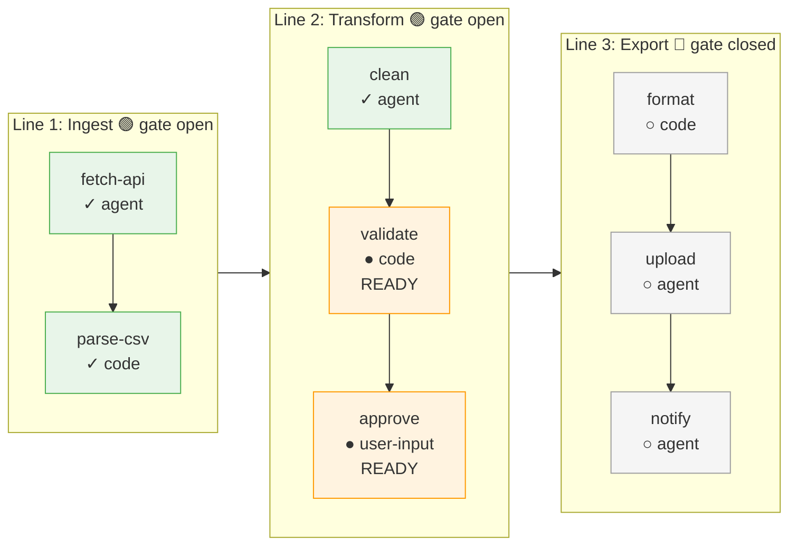
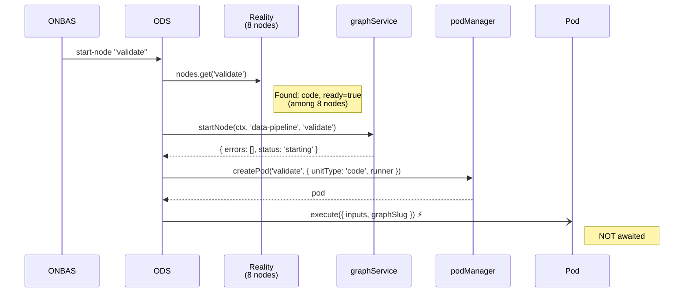
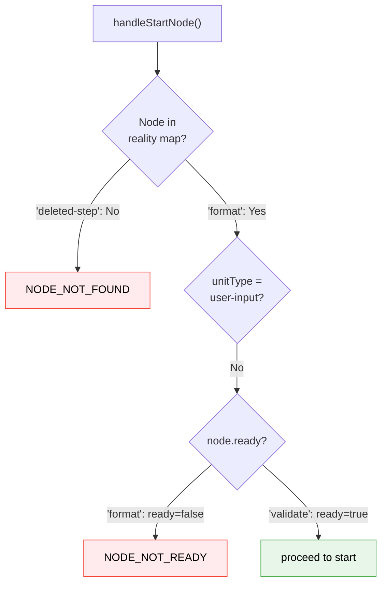
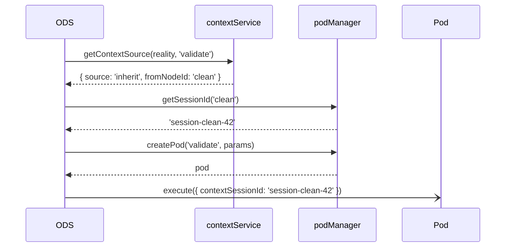

# Worked Example Walkthrough: ODS Dispatch — How the Orchestrator Executes Decisions

> **Script**: [`worked-example-ods-dispatch.ts`](./worked-example-ods-dispatch.ts)
> **Run**: `npx tsx docs/plans/030-positional-orchestrator/tasks/phase-6-ods-action-handlers/examples/worked-example-ods-dispatch.ts`
> **Phase**: Phase 6: ODS Action Handlers

## What This Demonstrates

The ODS (Orchestration Dispatch Service) is the "Act" step in the Settle-Decide-Act loop. This walkthrough uses a realistic 3-line, 8-node data pipeline to show how ODS receives a decision targeting one specific node, validates it against the full graph reality, creates a pod, and fires execution without awaiting. You see it operating in the middle of a live pipeline — not on a toy single-node graph.

---

## The Pipeline

The example uses a data pipeline with three lines representing stages. Each line has a transition gate that controls when the next stage can begin.

**Legend**: green = complete | orange = ready | grey = pending (gate closed)

---

## Section-by-Section

### 1. The Graph Snapshot

The script builds this full pipeline using `buildFakeReality()` with explicit lines and nodes placed at specific line indices and positions. This is the kind of graph state ODS sees on every orchestration tick — not a single node, but a full multi-line graph with nodes in various states. ONBAS has already walked this graph and decided what to do. ODS receives that decision.

The output prints every line with its gate status and every node with its state, then the convenience accessors: `readyNodeIds`, `completedNodeIds`, and which nodes are still pending.

**What to watch in output**: The visual pipeline diagram with gate indicators and node state icons.

---

### 2. Start "validate" (Code Node, Mid-Pipeline)

ONBAS decided `validate` should start — it's the next serial step on Line 2 after `clean` completed. ODS doesn't re-derive this. It receives the request, looks up `validate` in the 8-node reality map, confirms `ready === true`, then proceeds through the full start lifecycle.

The key point: ODS validates against the *full* reality snapshot (8 nodes, 3 lines) but only acts on the one node ONBAS targeted. The rest of the graph is context for validation, not for action.

**What to watch in output**: `unitType=code` in the lookup, pod params showing `unitSlug=validator`.

---

### 3. User-Input "approve" (No-Op)

`approve` is also ready on Line 2, but it's a `user-input` node — a human gate. ODS recognizes this early in `handleStartNode()` and returns immediately. No pod created, no `startNode()` called. The pipeline diagram shows it sitting there waiting for a human to act through the UI.

**What to watch in output**: Pod count stays at 1 (only `validate` was created).

---

### 4. Error Paths

Two error scenarios against the full pipeline:

1. **`format` on Line 3** — the node exists but `ready === false` because Line 3's transition gate is closed. ODS catches this *before* calling `graphService.startNode()`.
2. **`deleted-step`** — not in the reality map at all. ODS returns `NODE_NOT_FOUND` immediately.

**What to watch in output**: Both errors show `ok=false` with distinct codes. `NODE_NOT_READY` includes `nodeId=format`.

---

### 5. The Dispatch Table

A summary view of all four request types ODS handles. The table format makes the pattern clear: only `start-node` does real work. The deprecated types (`resume-node`, `question-pending`) existed in ONBAS before Workshop 11/12 moved question handling to the event system.

| Request Type | What Happens | Error Code |
|---|---|---|
| `start-node` | Validate, reserve, pod, fire | _(none)_ |
| `no-action` | Return `ok: true` immediately | _(none)_ |
| `resume-node` | Defensive error | `UNSUPPORTED_REQUEST_TYPE` |
| `question-pending` | Defensive error | `UNSUPPORTED_REQUEST_TYPE` |

**What to watch in output**: The aligned table with `true`/`false` and error codes.

---

### 6. Context Inheritance

Demonstrates session continuity in the pipeline. `clean` (the first agent on Line 2) already ran and left `session-clean-42`. Now `validate` (shown here as an agent variant) inherits that session so it can continue the conversation — the validating agent has access to everything the cleaning agent discussed.

**What to watch in output**: The session ID `session-clean-42` resolved from the `clean` node.

---

### 7. ODS Footprint

The final section shows what ODS left behind: the pod create history from both the main ODS and the inheritance demo, then a mini pipeline diagram showing the state after all actions. This reinforces the fire-and-forget pattern — ODS created pods and moved on. The pods run in the background; results surface on the next Settle pass via the event system.

**What to watch in output**: The pipeline diagram with `⚡ validate (just started)` showing the one node ODS acted on, while the rest of the 8-node graph is unchanged.

---

## Key Takeaways

| Concept | Why It Matters |
|---------|---------------|
| Full graph context, single node action | ODS validates against the entire reality snapshot (8 nodes, 3 lines) but only acts on the one node ONBAS targeted. |
| Fire-and-forget execution | `pod.execute()` is called without `await`. Results surface via events on the next Settle pass. |
| Transition gates block downstream | Line 3 nodes are `pending` and `ready=false` because the gate is closed. ODS catches this before touching graphService. |
| User-input is a UI concern | No pod, no startNode() — ODS recognizes user-input and exits immediately. |
| Exhaustive dispatch | TypeScript's `never` in the default case catches missing request types at compile time. |
| Defensive dead code paths | `resume-node` and `question-pending` return errors rather than silently succeeding. |
| Context inheritance across pipeline stages | An agent on Line 2 can inherit the session of a completed agent from the same line. |
