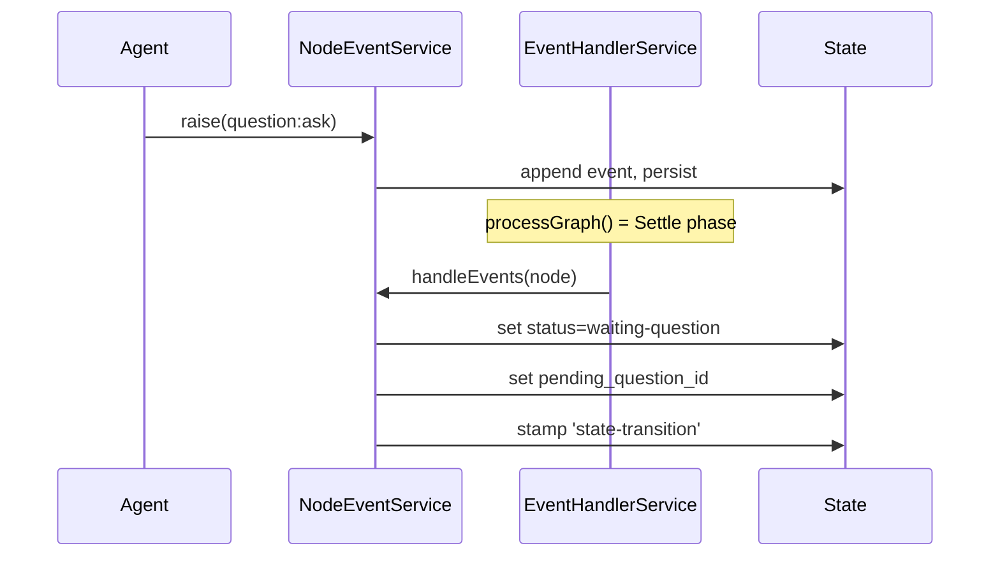
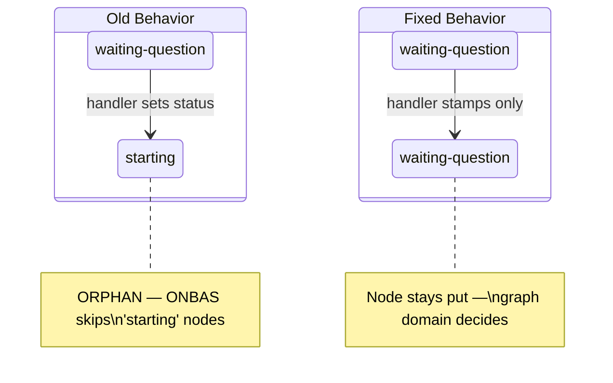
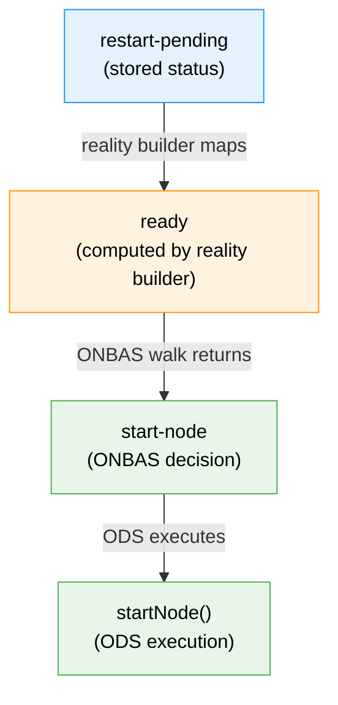
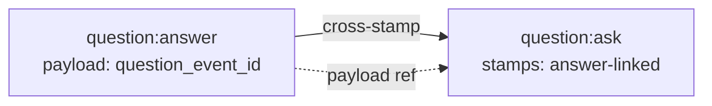

# Worked Example Walkthrough: Two-Domain Boundary

> **Script**: [`worked-example-two-domain-boundary.ts`](./worked-example-two-domain-boundary.ts)
> **Run**: `npx tsx docs/plans/030-positional-orchestrator/tasks/phase-6-ods-action-handlers/examples/worked-example-two-domain-boundary.ts`
> **Phase**: Subtask 001: Concept Drift Remediation (Phase 6 prerequisite)

## What This Demonstrates

The Node Event System has two distinct domains that must never cross boundaries. The **Event Domain** (handlers) records what happened — stamps events and sets handler-owned status fields. The **Graph Domain** (ONBAS/ODS) reads the settled state and makes orchestration decisions. This example walks through a complete question-answer-restart lifecycle to show exactly where each domain's responsibility begins and ends.

---

## High-Level Flow

```mermaid
flowchart LR
    classDef event fill:#E3F2FD,stroke:#2196F3,color:#000
    classDef graphdom fill:#FFF3E0,stroke:#FF9800,color:#000
    classDef state fill:#E8F5E9,stroke:#4CAF50,color:#000

    subgraph ED["Event Domain (Handlers)"]
        direction TB
        E1["question:ask<br/>→ waiting-question"]:::event
        E2["question:answer<br/>→ stamp only"]:::event
        E3["node:restart<br/>→ restart-pending"]:::event
    end

    subgraph GD["Graph Domain (ONBAS/ODS)"]
        direction TB
        G1["Reality Builder<br/>restart-pending → ready"]:::graphdom
        G2["ONBAS Walk<br/>ready → start-node"]:::graphdom
        G3["ODS Execute<br/>startNode + resume"]:::graphdom
    end

    E1 -->|"settle"| E2
    E2 -->|"settle"| E3
    E3 -->|"state read"| G1
    G1 --> G2 --> G3

    S1((agent-accepted)):::state --> E1
    G3 --> S2((starting)):::state
```

---

## Section-by-Section

### 1. Initial State

The example starts with a node in `agent-accepted` status — a running agent that hasn't hit any problems yet. The state object is constructed in-memory with just enough structure to exercise the real services.

**What to watch in output**: The node starts with zero events and undefined `pending_question_id`.

---

### 2. Question Asked

The agent raises a `question:ask` event. This is one of the few handlers that performs a genuine status transition — the agent is actively requesting a pause. The handler sets `waiting-question` and records the `pending_question_id`.

**What to watch in output**: Status changes to `waiting-question`, `pending_question_id` is set to `q-framework`.

---

### 3. Question Answered (The Fix)

This is the central insight of the concept drift remediation. The **old** handler set `status='starting'` and cleared `pending_question_id` — crossing the domain boundary by making graph-level orchestration decisions. The **fixed** handler stamps `answer-recorded` and does nothing else.

Why does this matter? If the handler transitions to `starting`, ONBAS skips the node (it assumes someone else is already handling it). The answer goes unprocessed — an orphaned node. By keeping the node in `waiting-question`, we let the graph domain detect the answered question and orchestrate the restart.

**What to watch in output**: Status remains `waiting-question`. `pending_question_id` is **preserved**, not cleared. The stamp is `answer-recorded`, not `state-transition`.

---

### 4. Restart Initiated

The orchestrator raises `node:restart` — the Workshop 10 convention-based contract. The handler sets `restart-pending` (a stored status that the reality builder will map to computed `ready`) and clears `pending_question_id` (the handler owns this cleanup because the restart means the question cycle is complete).

This is a convention-based contract with zero coupling. The handler doesn't know about ONBAS or ODS. It just sets `restart-pending`. The reality builder maps it to `ready`. ONBAS already handles `ready` nodes by returning `start-node`. ODS already handles `start-node` by calling `startNode()`. No new code needed in the graph domain.

**What to watch in output**: Status is `restart-pending`. `pending_question_id` is now `undefined`.

---

### 5. Event Log

The complete event trail shows three events, each with a subscriber stamp proving it was processed. The stamps are the authoritative record — if a stamp exists, that subscriber has handled the event.

**What to watch in output**: Notice the `question:ask` event shows stamp `answer-linked` (not `state-transition`). That's because the `question:answer` handler cross-stamped the original ask event, replacing the orchestrator's stamp. This cross-stamp creates a forward link from ask to answer.

---

### 6. Cross-Stamp Verification

The `question:answer` handler uses `ctx.stampEvent()` to write an `answer-linked` stamp on the original `question:ask` event. This creates a bidirectional reference: the ask event's stamps prove it was answered, and the answer event's payload contains the `question_event_id` pointing back to the ask.

**What to watch in output**: The ask event has exactly 1 stamp with action `answer-linked`.

---

### 7. Summary

The final section maps the two domains side by side. Everything in sections 1-6 is the Event Domain — handlers recording and stamping. Phase 6 (ODS Action Handlers) will implement the Graph Domain side: ONBAS walking the settled state and ODS executing the actions.

---

## Key Takeaways

| Concept | Why It Matters |
|---------|---------------|
| Handlers stamp, don't orchestrate | Prevents orphaned nodes where no one resumes work after a question answer |
| `restart-pending` → `ready` mapping | Convention-based contract — zero coupling between event handlers and ONBAS |
| Cross-stamping (answer → ask) | Creates bidirectional audit trail without extra bookkeeping |
| Settle → Decide → Act loop | Clean separation: EHS processes events, ONBAS reads state, ODS acts |
| `pending_question_id` ownership | Ask handler sets it, restart handler clears it — answer handler leaves it alone |
