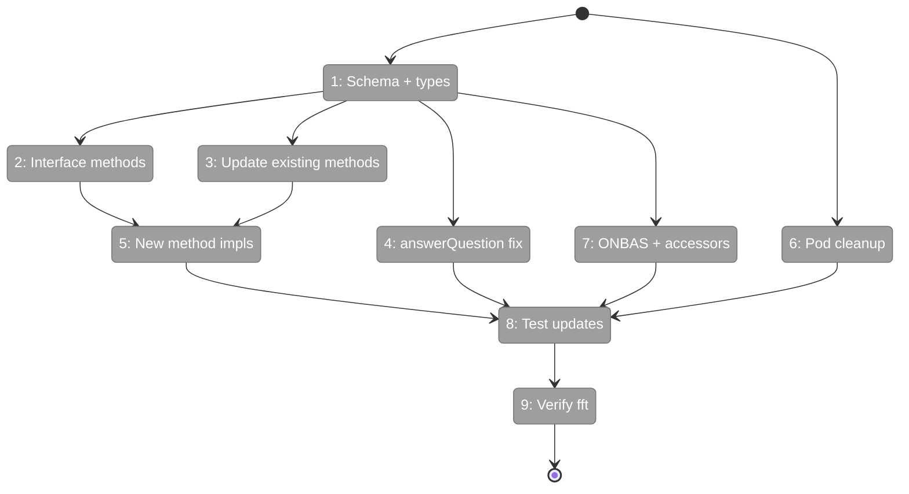
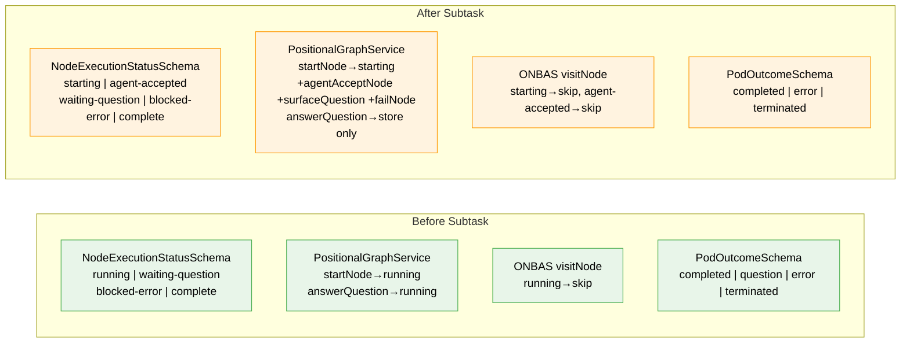

# Flight Plan: Phase 6 Subtask — Two-Phase Handshake Schema Migration

**Plan**: [../../positional-orchestrator-plan.md](../../positional-orchestrator-plan.md)
**Phase**: Phase 6: ODS Action Handlers (Subtask)
**Generated**: 2026-02-06
**Status**: Ready for takeoff

---

## Departure → Destination

**Where we are**: Phases 1-5 delivered five foundational pieces for the orchestration system: an immutable graph snapshot, a 4-type request union, context rules, execution pods, and a walk algorithm. However, Workshop #8 revealed a design conflict — the codebase models a single `running` state but the shared transition ownership model requires two distinct states (`starting` for orchestrator reservation, `agent-accepted` for agent pickup). Additionally, `answerQuestion()` transitions the node out of `waiting-question`, preventing ONBAS from detecting answered questions. The pod schema has a dead `question` outcome that was never produced.

**Where we're going**: By the end of this subtask, all schemas and types use `starting`/`agent-accepted` instead of `running`. Three new methods exist on `IPositionalGraphService` (`agentAcceptNode`, `surfaceQuestion`, `failNode`). `answerQuestion()` only stores the answer without transitioning the node. ONBAS handles both new states. The dead `question` pod outcome is removed. All tests pass against the corrected model. Phase 6 ODS implementation can proceed without fighting incorrect foundational assumptions.

---

## Flight Status

<!-- Updated by /plan-6: pending → active → done. Use blocked for problems/input needed. -->



**Legend**: grey = pending | yellow = active | red = blocked/needs input | green = done

---

## Stages

<!-- Updated by /plan-6 during implementation: [ ] → [~] → [x] -->

- [ ] **Stage 1: Replace `running` in all schemas, types, and interfaces** — update `NodeExecutionStatusSchema`, `ExecutionStatus`, `ExecutionStatusSchema`, result type literals (`StartNodeResult.status`, `AnswerQuestionResult.status`), and rename `runningNodes` → `activeNodes` on `LineStatusResult`/`GraphStatusResult` (`state.schema.ts`, `reality.types.ts`, `reality.schema.ts`, `positional-graph-service.interface.ts`)
- [ ] **Stage 2: Add new methods to graph service interface** — `agentAcceptNode()`, `surfaceQuestion()`, `failNode()` with result types (`positional-graph-service.interface.ts`)
- [ ] **Stage 3: Update existing methods and status infrastructure** — `startNode()` targets `starting`, `endNode()`/`askQuestion()` valid-from `agent-accepted`, `saveOutputData()`/`saveOutputFile()` guards accept `agent-accepted`, rename `runningNodes` → `activeNodes` in `getLineStatus`/`getStatus`, fix `getNodeStatus()` to populate `pendingQuestion` (DYK-SUB#1), rename `nodeNotRunningError`, update CLI `handleNodeStart` to call both `startNode` + `agentAcceptNode` (`positional-graph.service.ts`, `positional-graph-errors.ts`, CLI command files)
- [ ] **Stage 4: Fix answerQuestion to store-only** — remove node transition and `pending_question_id` clearing, keep answer storage (`positional-graph.service.ts`)
- [ ] **Stage 5: Implement three new methods** — `agentAcceptNode` (starting/waiting-question→agent-accepted), `surfaceQuestion` (set surfaced_at), `failNode` (starting/agent-accepted/waiting-question→blocked-error) (`positional-graph.service.ts`)
- [ ] **Stage 6: Remove dead pod question outcome** — drop `question` from `PodOutcomeSchema`, remove `question` field from `PodExecuteResultSchema` (`pod.schema.ts`, `pod.types.ts`)
- [ ] **Stage 7: Update ONBAS and reality accessors** — add `starting`/`agent-accepted` cases to `visitNode`, replace `runningNodeIds` with `startingNodeIds`/`activeNodeIds`, update `reality.builder.ts` to read `activeNodes` from status result, update `fake-onbas.ts` (`onbas.ts`, `reality.builder.ts`, `reality.types.ts`, `fake-onbas.ts`)
- [ ] **Stage 8: Update all tests** — fix 56 references to `running` across 22 test files (4 tiers: positional-graph, integration, e2e, web/CLI/contracts), add tests for new methods and behaviors (multiple test files)
- [ ] **Stage 9: Verify barrel and fft** — ensure exports are correct, run `just fft` to confirm clean state (`index.ts`)

---

## Architecture: Before & After



**Legend**: existing (green, unchanged) | changed (orange, modified)

---

## Command → Method → Transition → Owner Matrix

The full mapping from user-facing CLI command through to state transition and who is responsible.

### State Transitions

| Transition | Service Method | Called By | CLI Command | When |
|---|---|---|---|---|
| pending → `starting` | `startNode()` | **Orchestrator** (ODS) | — (internal) | ODS handles `start-node` request |
| `starting` → `agent-accepted` | `agentAcceptNode()` | **Agent** | `cg wf node start` | Agent picks up work during pod execution |
| `agent-accepted` → `waiting-question` | `askQuestion()` | **Agent** | `cg wf node ask` | Agent needs user input during execution |
| `waiting-question` → `waiting-question` | `answerQuestion()` | **External** (user/UI) | `cg wf node answer` | User provides answer; node stays put |
| `waiting-question` → `agent-accepted` | `agentAcceptNode()` | **Orchestrator** (ODS) | — (internal) | ODS handles `resume-node` request |
| `agent-accepted` → `complete` | `endNode()` | **Agent** | `cg wf node end` | Agent finishes work during execution |
| any → `blocked-error` | `failNode()` | **Orchestrator** (ODS) | — (internal) | ODS detects agent failure post-execute |
| — (question record) | `surfaceQuestion()` | **Orchestrator** (ODS) | — (internal) | ODS handles `question-pending` request |

### CLI Commands

| CLI Command | Service Method(s) Invoked | Owner | State Effect |
|---|---|---|---|
| `cg wf node start` | `startNode()` then `agentAcceptNode()` | **Agent** (via CLI) | pending → `starting` → `agent-accepted` |
| `cg wf node ask` | `askQuestion()` | **Agent** (via CLI) | `agent-accepted` → `waiting-question` + question record |
| `cg wf node answer` | `answerQuestion()` | **External** (user/UI) | Stores answer only; node stays `waiting-question` |
| `cg wf node save-output-data` | `saveOutputData()` | **Agent** (via CLI) | No status change; stores output |
| `cg wf node save-output-file` | `saveOutputFile()` | **Agent** (via CLI) | No status change; stores file |
| `cg wf node end` | `endNode()` | **Agent** (via CLI) | `agent-accepted` → `complete` |

### Service Methods (New + Changed)

| Method | Status | Transition | Valid From | Called By |
|---|---|---|---|---|
| `startNode()` | **Changed** | → `starting` (was `running`) | `pending` | Orchestrator |
| `agentAcceptNode()` | **New** | → `agent-accepted` | `starting`, `waiting-question` | Agent (start), Orchestrator (resume) |
| `endNode()` | **Changed** | → `complete` | `agent-accepted` (was `running`) | Agent |
| `askQuestion()` | **Changed** | → `waiting-question` | `agent-accepted` (was `running`) | Agent |
| `answerQuestion()` | **Changed** | No transition (was → `running`) | `waiting-question` | External |
| `surfaceQuestion()` | **New** | Sets `surfaced_at` on question | `waiting-question` | Orchestrator |
| `failNode()` | **New** | → `blocked-error` | `starting`, `agent-accepted`, `waiting-question` | Orchestrator |

### ONBAS Walk Behavior

| Node Status | ONBAS Action | Meaning |
|---|---|---|
| `pending` | Skip | Not ready (gates not met) |
| `ready` | Return `start-node` | Eligible for orchestrator to reserve |
| `starting` | Skip | Orchestrator reserved, waiting for agent |
| `agent-accepted` | Skip | Agent actively working |
| `waiting-question` (unsurfaced) | Return `question-pending` | Question needs surfacing |
| `waiting-question` (surfaced, unanswered) | Skip | Waiting for external answer |
| `waiting-question` (answered) | Return `resume-node` | Ready for orchestrator to resume agent |
| `blocked-error` | Skip | Failed, needs intervention |
| `complete` | Skip | Done |

### ONBAS Resume-After-Question: Exact State Required

ONBAS produces a `resume-node` request through this exact code path (`onbas.ts`):

```
walkForNextAction(reality)
  → visitNode(reality, node)
      node.status === 'waiting-question'   ← GATE 1: node must be waiting-question
  → visitWaitingQuestion(reality, node)
      node.pendingQuestionId exists         ← GATE 2: node must have a pendingQuestionId
      reality.questions.find(q.questionId === node.pendingQuestionId)
                                            ← GATE 3: question record must exist in reality
      question.isAnswered === true          ← GATE 4: question must have an answer stored
  → returns { type: 'resume-node', nodeId, questionId, answer }
```

**All four gates must pass.** If any one fails, ONBAS skips the node or returns `null` (no action).

#### The data chain (state.json → ONBAS decision)

```
state.json                          Reality Builder                    ONBAS
──────────                          ───────────────                    ─────
nodes[nodeId].status                → NodeReality.status               → GATE 1: === 'waiting-question'
  = 'waiting-question'

nodes[nodeId].pending_question_id   → getNodeStatus().pendingQuestion  → GATE 2: pendingQuestionId exists
  = 'q-123'                           → NodeReality.pendingQuestionId
                                      = 'q-123'

questions[].question_id = 'q-123'   → QuestionReality.questionId       → GATE 3: find() matches
                                      = 'q-123'

questions[].answer = 'TypeScript'   → QuestionReality.answer           → GATE 4: isAnswered = true
questions[].answered_at = '...'       = 'TypeScript'
                                    → QuestionReality.isAnswered
                                      = true (answer !== undefined && answer !== null)
```

#### Why answerQuestion() must be store-only

Current `answerQuestion()` (line 2066-2069) does three things after storing the answer:

```typescript
nodes[nodeId].status = 'running';              // BREAKS GATE 1 — node leaves waiting-question
nodes[nodeId].pending_question_id = undefined;  // BREAKS GATE 2 — pendingQuestionId gone
```

If either of these fires, ONBAS never enters `visitWaitingQuestion` for this node (Gate 1 fails because status is no longer `waiting-question`), or can't find the question (Gate 2 fails because `pendingQuestionId` is cleared). The `resume-node` request is never produced. The orchestration loop stalls forever.

**Fix**: `answerQuestion()` stores the answer + `answered_at` and nothing else. The node stays in `waiting-question` with `pending_question_id` intact. Next ONBAS walk hits all four gates → `resume-node` → ODS resumes the agent.

#### The complete question loop (concrete example)

```
Orchestrator Loop Iteration #1:
  ONBAS: node 'spec-builder' is ready → start-node
  ODS:   startNode() → 'starting', create pod, pod.execute()
  Agent: cg wf node start → 'agent-accepted'
  Agent: cg wf node ask "Which language?" → 'waiting-question', question q-42 created
  Agent: process exits cleanly
  ODS:   re-reads state, sees 'waiting-question' → keeps pod alive, returns

Orchestrator Loop Iteration #2:
  ONBAS: node 'spec-builder' is waiting-question
         pendingQuestionId = 'q-42'
         question q-42 found, isSurfaced = false → question-pending
  ODS:   surfaceQuestion() → sets surfaced_at
         emits 'question-surfaced' event → web UI shows question to user

Orchestrator Loop Iteration #3...N:
  ONBAS: node 'spec-builder' is waiting-question
         question q-42 found, isSurfaced = true, isAnswered = false → skip (null)
  (orchestrator idles or processes other nodes)

User answers via web UI:
  answerQuestion(ctx, slug, 'spec-builder', 'q-42', 'TypeScript')
  → stores answer='TypeScript', answered_at=now
  → node STAYS 'waiting-question', pending_question_id STAYS 'q-42'

Orchestrator Loop Iteration #N+1:
  ONBAS: node 'spec-builder' is waiting-question           ← GATE 1 ✓
         pendingQuestionId = 'q-42'                         ← GATE 2 ✓
         question q-42 found                                ← GATE 3 ✓
         question q-42 isAnswered = true                    ← GATE 4 ✓
         → resume-node { nodeId: 'spec-builder', questionId: 'q-42', answer: 'TypeScript' }
  ODS:   agentAcceptNode() → 'agent-accepted'
         pod.resumeWithAnswer('q-42', 'TypeScript', options)
         → agent re-invoked with answer injected as prompt
         Agent picks up session, reads answer, continues work
```

#### Discovery: pendingQuestion not populated in getNodeStatus()

`getNodeStatus()` (line 1054-1074) returns `NodeStatusResult` but **never sets `pendingQuestion`**. The field exists on the interface (line 269) but the service implementation doesn't populate it from `state.nodes[nodeId].pending_question_id`.

The reality builder reads it at line 67:
```typescript
pendingQuestionId: ns.pendingQuestion?.questionId,  // always undefined in production!
```

This means `NodeReality.pendingQuestionId` is **always undefined** in real (non-test) builds. Gate 2 always fails. The test helper `buildFakeReality` sets `pendingQuestionId` directly (bypassing the real builder), which is why ONBAS unit tests pass.

**This must be fixed in this subtask**: `getNodeStatus()` must read `pending_question_id` from state and populate `pendingQuestion` on the result. Without this fix, the real orchestration loop can never resume after a question.

---

## Acceptance Criteria

- [ ] No reference to `running` as a stored node execution status anywhere in source
- [ ] `startNode()` transitions to `starting`
- [ ] `agentAcceptNode()` transitions `starting` → `agent-accepted` AND `waiting-question` → `agent-accepted`
- [ ] `surfaceQuestion()` sets `surfaced_at` on question record
- [ ] `failNode()` transitions to `blocked-error` with error details
- [ ] `answerQuestion()` stores answer only — node stays in `waiting-question`
- [ ] `saveOutputData()`/`saveOutputFile()` accept `agent-accepted` nodes (not `running`)
- [ ] ONBAS handles `starting` and `agent-accepted` (both skip)
- [ ] `question` removed from `PodOutcomeSchema`
- [ ] `getNodeStatus()` populates `pendingQuestion` from `pending_question_id` in state
- [ ] `runningNodes` renamed to `activeNodes` on `LineStatusResult`, `GraphStatusResult`, and all implementations
- [ ] CLI `handleNodeStart` calls both `startNode()` and `agentAcceptNode()`
- [ ] `just fft` clean

---

## Goals & Non-Goals

**Goals**:
- Replace `running` with `starting` + `agent-accepted` across all schemas, types, and implementations
- Add `agentAcceptNode()`, `surfaceQuestion()`, `failNode()` to graph service
- Fix `answerQuestion()` to not transition node (ONBAS resume-node gap)
- Update `saveOutputData()`/`saveOutputFile()` guards, `runningNodes` → `activeNodes` rename
- Update CLI `handleNodeStart` for non-orchestrated path
- Remove dead `question` pod outcome
- Update ONBAS and all tests (56 refs across 22 files)

**Non-Goals**:
- ODS implementation (Phase 6 proper)
- FakePod `onExecute` callback (Phase 6)
- DI registration
- Web/CLI wiring beyond the `handleNodeStart` fix

---

## Checklist

- [ ] T001: Replace `running` in schemas/types/interfaces including result type literals and `runningNodes` → `activeNodes` (CS-2)
- [ ] T002: Add 3 new methods to `IPositionalGraphService` interface (CS-2)
- [ ] T003: Update existing methods, status infra, error helpers, CLI handlers, and fix `getNodeStatus` DYK-SUB#1 (CS-3)
- [ ] T004: Change `answerQuestion` to store-only (CS-2)
- [ ] T005: Implement `agentAcceptNode` (starting/waiting-question), `surfaceQuestion`, `failNode` (CS-3)
- [ ] T006: Remove `question` from PodOutcome schema (CS-1)
- [ ] T007: Update ONBAS, reality builder, fake-onbas, and accessors (CS-2)
- [ ] T008: Update all tests — 56 refs across 22 files in 4 tiers + new method tests (CS-3)
- [ ] T009: Verify barrel + `just fft` (CS-1)

---

## PlanPak

Active — files organized under `features/030-orchestration/`
