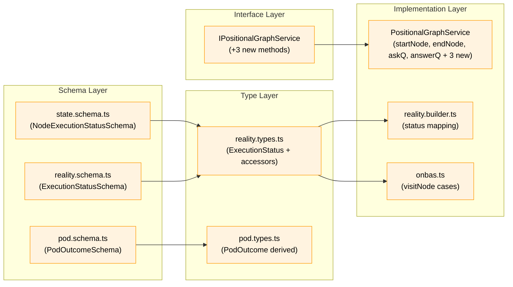

# Subtask: Two-Phase Handshake Schema Migration

**Parent Phase**: [Phase 6: ODS Action Handlers](../tasks.md)
**Plan**: [../../positional-orchestrator-plan.md](../../positional-orchestrator-plan.md)
**Workshop**: [../../workshops/08-ods-orchestrator-agent-handover.md](../../workshops/08-ods-orchestrator-agent-handover.md)
**Status**: Pending
**Testing Approach**: Full TDD (RED-GREEN-REFACTOR)

---

## Executive Briefing

### Purpose

Workshop #8 revealed a fundamental design conflict: the Phase 6 dossier assumed ODS manages all state transitions after pod execution, but the correct model is **shared transition ownership** — the orchestrator, agent, and external actors each own specific state transitions during the node lifecycle. The agent writes its own state changes during execution via CLI commands (`start`, `ask`, `end`, `save-output-data`), while the orchestrator owns reservation (`startNode`), failure detection (`failNode`), question surfacing (`surfaceQuestion`), and resume coordination (`agentAcceptNode` for `waiting-question → agent-accepted`). External actors own answer storage (`answerQuestion`). This requires a **two-phase handshake** where the orchestrator sets `starting` (reservation) and the agent sets `agent-accepted` (acceptance), replacing the single ambiguous `running` state.

For **code work units**, the code executor plays the agent role — it owns the same transitions (`starting → agent-accepted`, `agent-accepted → complete`) but the orchestrator may manage more of the flow since code units are deterministic and don't ask questions.

This subtask performs all schema, type, and behavior changes across completed phases (1, 4, 5) and Plan 028 code, so that Phase 6 implementation can proceed against the correct model.

### What We're Building

| Change | What |
|--------|------|
| **New states** | Replace `running` with `starting` + `agent-accepted` in all schemas/types |
| **New methods** | `agentAcceptNode()`, `surfaceQuestion()`, `failNode()` on `IPositionalGraphService` |
| **Behavior changes** | `startNode()` → `starting`, `endNode()` valid-from `agent-accepted`, `askQuestion()` valid-from `agent-accepted`, `answerQuestion()` stores answer only (no node transition) |
| **ONBAS updates** | Handle `starting` and `agent-accepted` in `visitNode` (both skip) |
| **Pod cleanup** | Remove dead `question` outcome from `PodOutcomeSchema` |
| **Convenience accessors** | Replace `runningNodeIds` with `startingNodeIds` + `activeNodeIds` |
| **Test updates** | All tests referencing `running` updated to new states |

### User Value

After this subtask, the codebase correctly models the orchestrator-agent handover protocol. Phase 6 can implement ODS against the two-phase model without fighting incorrect assumptions in foundational types.

### Example

```typescript
// Before: ambiguous single state
await graphService.startNode(ctx, slug, nodeId); // → 'running' (who set this?)

// After: clear two-phase handshake
await graphService.startNode(ctx, slug, nodeId);        // → 'starting' (orchestrator reserved)
await graphService.agentAcceptNode(ctx, slug, nodeId);   // → 'agent-accepted' (agent accepted)
```

---

## Objectives & Scope

### Goals

- Replace `running` with `starting` and `agent-accepted` in `NodeExecutionStatusSchema` and all derived types
- Add `agentAcceptNode()`, `surfaceQuestion()`, and `failNode()` to `IPositionalGraphService`
- Implement all three new methods on `PositionalGraphService`
- Change `startNode()` to transition to `starting` instead of `running`
- Change `endNode()` to accept `agent-accepted` instead of `running` as valid-from state
- Change `askQuestion()` to accept `agent-accepted` instead of `running` as valid-from state
- Change `saveOutputData()` and `saveOutputFile()` guards to accept `agent-accepted` instead of `running`
- Change `answerQuestion()` to only store the answer (no node status transition, no clearing `pending_question_id`)
- Update ONBAS `visitNode` to handle `starting` and `agent-accepted` (both return null)
- Remove `question` from `PodOutcomeSchema` (dead code — `AgentPod.mapAgentResult()` never produces it)
- Remove `question` field from `PodExecuteResultSchema`
- Update `ExecutionStatus` type and `ExecutionStatusSchema` to use new states
- Update `StartNodeResult.status` type literal (`'running'` → `'starting'`) and `AnswerQuestionResult.status` (`'running'` → `'waiting-question'`)
- Rename `runningNodes` → `activeNodes` on `LineStatusResult`, `GraphStatusResult`, and the `getStatus()`/`getLineStatus()` implementations. Filter by `starting` OR `agent-accepted`. Fix overall graph status computation that depends on this field.
- Replace `runningNodeIds` accessor with `startingNodeIds` and `activeNodeIds` on `PositionalGraphReality`
- Rename `nodeNotRunningError` → `nodeNotActiveError` with updated message text
- Update CLI handler `handleNodeStart` to call `agentAcceptNode()` after `startNode()` for non-orchestrated path (per Workshop #8 lines 201-206)
- Update all tests referencing `running` to use `starting` or `agent-accepted` as appropriate
- `just fft` clean

### Non-Goals

- ODS implementation (Phase 6 proper)
- FakePod `onExecute` callback (Phase 6 — ODS needs it, not this subtask)
- DI registration changes
- Web/CLI wiring (beyond the `handleNodeStart` fix needed for `just fft`)
- Web UI test updates (these reference `running` as a display status — separate concern)

---

## Pre-Implementation Audit

### File Provenance

| Target File | Status | Change Type |
|---|---|---|
| `packages/positional-graph/src/schemas/state.schema.ts` | **Exists** (Plan 028) | Modify enum |
| `packages/positional-graph/src/features/030-orchestration/reality.types.ts` | **Exists** (Phase 1) | Modify type + accessor |
| `packages/positional-graph/src/features/030-orchestration/reality.schema.ts` | **Exists** (Phase 1) | Modify enum |
| `packages/positional-graph/src/features/030-orchestration/onbas.ts` | **Exists** (Phase 5) | Add cases |
| `packages/positional-graph/src/features/030-orchestration/pod.schema.ts` | **Exists** (Phase 4) | Remove enum value + field |
| `packages/positional-graph/src/features/030-orchestration/pod.types.ts` | **Exists** (Phase 4) | Update derived types |
| `packages/positional-graph/src/interfaces/positional-graph-service.interface.ts` | **Exists** (Plan 028) | Add 3 methods + result types |
| `packages/positional-graph/src/services/positional-graph.service.ts` | **Exists** (Plan 028) | Modify 3 methods, add 3 methods |
| `packages/positional-graph/src/features/030-orchestration/reality.builder.ts` | **Exists** (Phase 1) | Update status mapping, `runningNodeIds` → `activeNodeIds` |
| `packages/positional-graph/src/errors/positional-graph-errors.ts` | **Exists** (Plan 028) | Rename `nodeNotRunningError` → `nodeNotActiveError` |
| `apps/cli/src/commands/positional-graph.command.ts` | **Exists** (Plan 028) | Add `agentAcceptNode()` call to `handleNodeStart` |
| `apps/cli/src/commands/workgraph.command.ts` | **Exists** (Plan 028) | Add `agentAcceptNode()` call to `handleNodeStart` |
| `test/unit/positional-graph/features/030-orchestration/onbas.test.ts` | **Exists** (Phase 5) | Update `running` → new states |
| `test/unit/positional-graph/features/030-orchestration/reality.test.ts` | **Exists** (Phase 1) | Update `running` → new states |
| `test/unit/positional-graph/features/030-orchestration/pod.test.ts` | **Exists** (Phase 4) | Update pod outcome tests |
| Various Plan 028 test files | **Exist** | Update `running` refs |

### Compliance

All changes are to existing files. No new files created. File naming follows established patterns.

---

## Architecture Map



### Task-to-Component Mapping

| Task | Component(s) Affected |
|---|---|
| T001 | `state.schema.ts`, `reality.types.ts`, `reality.schema.ts`, `positional-graph-service.interface.ts` (result types + `runningNodes` rename) |
| T002 | `positional-graph-service.interface.ts` (new methods + result types) |
| T003 | `positional-graph.service.ts` (startNode, endNode, askQuestion, saveOutputData, saveOutputFile, getLineStatus, getStatus, getNodeStatus, transitionNodeState), `positional-graph-errors.ts` (rename), CLI handlers (both command files) |
| T004 | `positional-graph.service.ts` (answerQuestion) |
| T005 | `positional-graph.service.ts` (agentAcceptNode, surfaceQuestion, failNode) |
| T006 | `pod.schema.ts`, `pod.types.ts` |
| T007 | `onbas.ts`, `reality.builder.ts`, `reality.types.ts` (accessor), `fake-onbas.ts` |
| T008 | 22 test files across 4 tiers (positional-graph, integration, e2e, web/CLI/contracts) |
| T009 | Barrel, `just fft` |

---

## Tasks

| # | Status | ID | Task | CS | Depends On | Absolute Path(s) |
|---|--------|-----|------|----|------------|-------------------|
| 1 | [ ] | T001 | Replace `running` with `starting` + `agent-accepted` in schemas and types | 2 | — | `packages/positional-graph/src/schemas/state.schema.ts`, `packages/positional-graph/src/features/030-orchestration/reality.types.ts`, `packages/positional-graph/src/features/030-orchestration/reality.schema.ts` |
| 2 | [ ] | T002 | Add 3 new methods to `IPositionalGraphService` interface | 2 | T001 | `packages/positional-graph/src/interfaces/positional-graph-service.interface.ts` |
| 3 | [ ] | T003 | Update existing methods, status infrastructure, error helpers, and CLI handlers for new states | 3 | T001, T002 | `packages/positional-graph/src/services/positional-graph.service.ts`, `packages/positional-graph/src/errors/positional-graph-errors.ts`, `packages/positional-graph/src/errors/index.ts`, `apps/cli/src/commands/positional-graph.command.ts`, `apps/cli/src/commands/workgraph.command.ts` |
| 4 | [ ] | T004 | Change `answerQuestion` to store-only (no node transition) | 2 | T001 | `packages/positional-graph/src/services/positional-graph.service.ts` |
| 5 | [ ] | T005 | Implement `agentAcceptNode`, `surfaceQuestion`, `failNode` | 3 | T002, T003 | `packages/positional-graph/src/services/positional-graph.service.ts` |
| 6 | [ ] | T006 | Remove `question` from PodOutcome schema and types | 1 | — | `packages/positional-graph/src/features/030-orchestration/pod.schema.ts`, `packages/positional-graph/src/features/030-orchestration/pod.types.ts` |
| 7 | [ ] | T007 | Update ONBAS, reality builder, and accessors for new states | 2 | T001 | `packages/positional-graph/src/features/030-orchestration/onbas.ts`, `packages/positional-graph/src/features/030-orchestration/reality.builder.ts`, `packages/positional-graph/src/features/030-orchestration/reality.types.ts` |
| 8 | [ ] | T008 | Update all tests for new states and behaviors | 3 | T001–T007 | `test/unit/positional-graph/` (multiple files) |
| 9 | [ ] | T009 | Verify barrel exports + `just fft` | 1 | T008 | `packages/positional-graph/src/features/030-orchestration/index.ts` |

### Task Details

---

#### T001: Replace `running` with `starting` + `agent-accepted` in schemas and types

**CS**: 2

**Changes**:

1. `state.schema.ts` — `NodeExecutionStatusSchema`:
   ```typescript
   // Before:
   z.enum(['running', 'waiting-question', 'blocked-error', 'complete'])
   // After:
   z.enum(['starting', 'agent-accepted', 'waiting-question', 'blocked-error', 'complete'])
   ```

2. `reality.types.ts` — `ExecutionStatus`:
   ```typescript
   // Before:
   'pending' | 'ready' | 'running' | 'waiting-question' | 'blocked-error' | 'complete'
   // After:
   'pending' | 'ready' | 'starting' | 'agent-accepted' | 'waiting-question' | 'blocked-error' | 'complete'
   ```

3. `reality.schema.ts` — `ExecutionStatusSchema`:
   ```typescript
   // Before:
   z.enum(['pending', 'ready', 'running', ...])
   // After:
   z.enum(['pending', 'ready', 'starting', 'agent-accepted', ...])
   ```

4. `positional-graph-service.interface.ts` — Result type literals:
   ```typescript
   // StartNodeResult (line 386):
   // Before: status?: 'running'
   // After:  status?: 'starting'

   // AnswerQuestionResult (line 428):
   // Before: status?: 'running'
   // After:  status?: 'waiting-question'
   ```

5. `positional-graph-service.interface.ts` — `LineStatusResult` and `GraphStatusResult`:
   ```typescript
   // Before (line 320, 338):
   runningNodes: string[];
   // After:
   activeNodes: string[];
   ```

**Validation**: `pnpm build` — expect type errors in downstream code (normal; fixed by subsequent tasks).

---

#### T002: Add 3 new methods to IPositionalGraphService interface

**CS**: 2

**Add to interface** (`positional-graph-service.interface.ts`):

```typescript
// Node Lifecycle — Orchestration extensions (Plan 030)
agentAcceptNode(ctx: WorkspaceContext, graphSlug: string, nodeId: string): Promise<AgentAcceptNodeResult>;
surfaceQuestion(ctx: WorkspaceContext, graphSlug: string, nodeId: string, questionId: string): Promise<SurfaceQuestionResult>;
failNode(ctx: WorkspaceContext, graphSlug: string, nodeId: string, error: { code: string; message: string }): Promise<FailNodeResult>;
```

**Add result types**:

```typescript
export interface AgentAcceptNodeResult extends BaseResult {
  nodeId?: string;
  status?: 'agent-accepted';
}

export interface SurfaceQuestionResult extends BaseResult {
  questionId?: string;
  surfacedAt?: string;
}

export interface FailNodeResult extends BaseResult {
  nodeId?: string;
  status?: 'blocked-error';
}
```

**Validation**: `pnpm build` — expect errors in service impl (not yet implementing).

---

#### T003: Update existing methods and status infrastructure for new states

**CS**: 3

**Changes**:

1. `startNode()` (line ~1787-1793):
   - Change target status: `'running'` → `'starting'`
   - Return `status: 'starting'` instead of `status: 'running'`
   - Update `transitionNodeState` timestamp logic: set `started_at` for `starting` (not `running`)

2. `endNode()` (line ~1907-1913):
   - Change valid-from: `['running']` → `['agent-accepted']`

3. `askQuestion()` (line ~1962-1963):
   - Change status check: `!== 'running'` → `!== 'agent-accepted'`
   - Update the inline node status fallback (line ~2002): `{ status: 'running' }` → `{ status: 'agent-accepted' }`

4. `transitionNodeState()` (line ~1730):
   - Change timestamp logic: `toStatus === 'running'` → `toStatus === 'starting'` for `started_at`

5. **`saveOutputData()` (line ~1445-1448) and `saveOutputFile()` (line ~1516-1519)**:
   - Change guard: `status !== 'running'` → `status !== 'agent-accepted'`
   - Agents call these via CLI while in `agent-accepted` state — the current `running` guard would reject them

6. **`getLineStatus()` (line ~1146-1173)**:
   - Rename `runningNodes` → `activeNodes`
   - Change filter: `n.status === 'running'` → `n.status === 'starting' || n.status === 'agent-accepted'`
   - Update return object key: `runningNodes` → `activeNodes`

7. **`getStatus()` (line ~1176-1237)**:
   - Rename local `runningNodes` → `activeNodes`
   - Update aggregation: `ls.runningNodes` → `ls.activeNodes`
   - Update overall status computation (lines 1215-1217): `runningNodes.length` → `activeNodes.length`
   - Update return object key: `runningNodes` → `activeNodes`

8. **`nodeNotRunningError`** (`positional-graph-errors.ts` line 238):
   - Rename to `nodeNotActiveError`
   - Update message: `"Node '${nodeId}' is not in running state"` → `"Node '${nodeId}' is not in an active execution state"`
   - Update action text accordingly
   - Update all import sites (service file line 18, errors/index.ts line 19)

9. **`getNodeStatus()` (line ~1054-1074) — CRITICAL FIX (DYK-SUB#1)**:
   - Currently does NOT populate `pendingQuestion` on `NodeStatusResult`
   - The field exists on the interface (line 269) but is never set from `state.nodes[nodeId].pending_question_id`
   - This means `NodeReality.pendingQuestionId` is always `undefined` in production (reality builder reads `ns.pendingQuestion?.questionId`)
   - **Fix**: Read `pending_question_id` from state, look up the question record, and populate `pendingQuestion` on the result:
     ```typescript
     // In getNodeStatus(), after determining status:
     const pendingQId = storedState?.pending_question_id;
     const pendingQ = pendingQId ? state.questions?.find(q => q.question_id === pendingQId) : undefined;
     // ... then in the return:
     pendingQuestion: pendingQ ? {
       questionId: pendingQ.question_id,
       text: pendingQ.text,
       questionType: pendingQ.type,
       options: pendingQ.options?.map(s => ({ key: s, label: s })),
       askedAt: pendingQ.asked_at,
     } : undefined,
     ```
   - Without this fix, the real orchestration loop can never resume after a question (ONBAS Gate 2 always fails)

10. **CLI handlers** (`positional-graph.command.ts` line ~808, `workgraph.command.ts` line ~420):
    - After `service.startNode(ctx, graphSlug, nodeId)`, add `service.agentAcceptNode(ctx, graphSlug, nodeId)`
    - Per Workshop #8 lines 201-206: non-orchestrated CLI path calls both in sequence
    - Without this, `cg wf node start` leaves node in `starting` instead of `agent-accepted`, breaking all CLI-based tests

**Validation**: Compile check — remaining errors from `answerQuestion()` and test files.

---

#### T004: Change answerQuestion to store-only (no node transition)

**CS**: 2

Per Workshop #8 ONBAS Resume-Node Gap resolution: `answerQuestion()` should ONLY store the answer. The node stays in `waiting-question` with `pending_question_id` intact.

**Changes** (`answerQuestion()` lines ~2066-2070):

```typescript
// REMOVE these lines:
nodes[nodeId].status = 'running';
nodes[nodeId].pending_question_id = undefined;

// KEEP these lines:
questions[questionIndex].answer = answer;
questions[questionIndex].answered_at = now;
```

Also update the return type: `status: 'waiting-question'` (node didn't move).

**Rationale**: ONBAS needs the node in `waiting-question` with `pending_question_id` intact to detect answered questions and produce `resume-node` requests. ODS handles the actual state transition during resume.

**Validation**: Compile succeeds. Some tests will fail (expected — updated in T008).

---

#### T005: Implement agentAcceptNode, surfaceQuestion, failNode

**CS**: 3

**agentAcceptNode(ctx, graphSlug, nodeId)**:
- Verify node exists
- Transition to `agent-accepted` via `transitionNodeState()` with valid-from `['starting', 'waiting-question']`
  - `starting` → `agent-accepted`: Agent picks up work for the first time
  - `waiting-question` → `agent-accepted`: ODS resumes agent after answered question (per Workshop #8 lines 183, 576-579)
- When transitioning from `waiting-question`: clear `pending_question_id` (question has been consumed by the resume flow)
- Return `{ nodeId, status: 'agent-accepted', errors: [] }`

**surfaceQuestion(ctx, graphSlug, nodeId, questionId)**:
- Verify node exists
- Load state, find question by ID
- Set `surfaced_at` = `new Date().toISOString()`
- Persist atomically
- Return `{ questionId, surfacedAt, errors: [] }`

**failNode(ctx, graphSlug, nodeId, error)**:
- Verify node exists
- Transition current status → `blocked-error` via `transitionNodeState()` with valid-from `['starting', 'agent-accepted', 'waiting-question']`
- Store error details in node state entry (`error_code`, `error_message`, `error_at`)
- Return `{ nodeId, status: 'blocked-error', errors: [] }`

**Validation**: `pnpm build` succeeds.

---

#### T006: Remove `question` from PodOutcome schema and types

**CS**: 1

**Changes**:

1. `pod.schema.ts`:
   ```typescript
   // Before:
   PodOutcomeSchema = z.enum(['completed', 'question', 'error', 'terminated']);
   // After:
   PodOutcomeSchema = z.enum(['completed', 'error', 'terminated']);
   ```

2. `pod.schema.ts` — Remove `question` field from `PodExecuteResultSchema`:
   ```typescript
   // Remove:
   question: PodQuestionSchema.optional(),
   ```

3. `pod.types.ts` — If `PodQuestion` type is derived from schema, it stays but is unused. Remove if not referenced elsewhere.

4. `PodQuestionSchema` disposition: Check for references before removing. `PodQuestionEvent` or other event types may still reference it. If so, keep the schema but remove it from `PodExecuteResultSchema`. If nothing references it, remove entirely.

**Rationale**: `AgentPod.mapAgentResult()` maps `completed`→`completed`, `failed`→`error`, `killed`→`terminated`. It never produces `question`. The agent asks questions via CLI during execution, not as a pod return value.

**Validation**: `pnpm build` — fix any downstream references.

---

#### T007: Update ONBAS, reality builder, and accessors for new states

**CS**: 2

**ONBAS** (`onbas.ts` `visitNode`):
```typescript
// Add two new cases:
case 'starting':
  return null;  // Orchestrator has reserved, waiting for agent

case 'agent-accepted':
  return null;  // Agent is actively working

// Remove:
case 'running':
  return null;
```

Also update `diagnoseStuckLine` — replace `case 'running'` with `case 'starting'` and `case 'agent-accepted'` (both set `hasRunning = true` — or rename to `hasActive`).

**Reality builder** (`reality.builder.ts`):
- Line 95: `runningNodeIds = statusResult.runningNodes` → `activeNodeIds = statusResult.activeNodes` (matches T003's rename in `getStatus`/`getLineStatus`)
- Update any `running` status mapping to `starting` or `agent-accepted` as appropriate

**Reality types/accessors** (`reality.types.ts`):
- Replace `runningNodeIds` with:
  - `startingNodeIds: readonly string[]` — nodes in `starting` state
  - `activeNodeIds: readonly string[]` — nodes in `starting` OR `agent-accepted` state (composite accessor for "something is happening")

**FakeONBAS** (`fake-onbas.ts`):
- Line ~196-222: `runningNodeIds` computed by filtering `status === 'running'` — update to filter `starting` OR `agent-accepted` and rename to `activeNodeIds`. Add separate `startingNodeIds` filtering.

**Validation**: `pnpm build` — downstream references to `runningNodeIds` need updating.

---

#### T008: Update all tests for new states and behaviors

**CS**: 3

This is the largest task — 56 references to `'running'` across 22 test files. Scope is organized by domain:

**Tier 1: positional-graph unit tests (must update — 9 files, ~29 refs)**:

1. **Phase 1 reality tests** (`reality.test.ts` — 3 refs):
   - Change `running` node fixtures to `starting` or `agent-accepted`
   - Update `runningNodeIds` assertions → `startingNodeIds` / `activeNodeIds`

2. **Phase 4 pod tests** (`pod.test.ts`):
   - Remove/update tests for `question` outcome
   - Verify `PodOutcomeSchema` validates only 3 values

3. **Phase 5 ONBAS tests** (`onbas.test.ts` — 6 refs):
   - Change `running` in test fixtures to `agent-accepted` (the "someone is working" state)
   - Add test cases for `starting` state (skip behavior)
   - Update `diagnoseStuckLine` tests

4. **Plan 028 service tests** (`execution-lifecycle.test.ts` — 3 refs, `execution-errors.test.ts` — 4 refs, `question-answer.test.ts` — 2 refs, `schemas.test.ts` — 6 refs, `status.test.ts` — 1 ref, `can-run.test.ts` — 2 refs, `collate-inputs.test.ts` — 2 refs):
   - `startNode` tests: expect `starting` instead of `running`
   - `endNode` tests: set node to `agent-accepted` before ending (not `running`)
   - `askQuestion` tests: set node to `agent-accepted` before asking (not `running`)
   - `answerQuestion` tests: expect node to stay in `waiting-question` (no transition to `running`)
   - Schema validation tests: update `running` → `starting`/`agent-accepted` in valid/invalid fixtures
   - Status/can-run tests: update `running` refs and `runningNodes` → `activeNodes`

**Tier 2: integration + e2e (must update — 2 files, ~3 refs)**:

5. **Integration test** (`cli-workflow.test.ts` — 2 refs):
   - Update expected states after `handleNodeStart` (now `agent-accepted` via both calls)

6. **E2E test** (`positional-graph-execution-e2e.test.ts` — 1 ref):
   - Update expected status after start

**Tier 3: web/CLI/contract tests (update if `just fft` requires — 11 files, ~24 refs)**:

7. **Web UI tests** (`status-computation.test.ts`, `use-workgraph-flow.test.ts`, `workgraph-node.test.tsx`, `workgraph-ui.instance.test.ts`, `use-flow-state.test.tsx`, `sse-manager.test.ts`, `agent-status-indicator.test.tsx`, `log-entry.test.tsx`):
   - These reference `running` as a display/UI status. Update `runningNodes` → `activeNodes` where the `LineStatusResult`/`GraphStatusResult` interfaces changed. Other references may use `running` as a UI label — check context.

8. **CLI tests** (`runs-command.test.ts` — 2 refs):
   - Update expected CLI output formatting

9. **Contract tests** (`sse-events.contract.test.ts` — 1 ref, `worknode-service.contract.ts` — 2 refs):
   - Update contract expectations for status values

**Tier 4: New tests for new methods**:

10. `agentAcceptNode()`: starting → agent-accepted, waiting-question → agent-accepted, reject invalid states
11. `surfaceQuestion()`: sets surfaced_at, returns correctly, rejects bad questionId
12. `failNode()`: starting/agent-accepted/waiting-question → blocked-error with error details
13. `getNodeStatus()` pendingQuestion: verify populated from state when node is waiting-question (DYK-SUB#1 fix verification)

**Validation**: All tests pass. No test uses `running` as a stored execution state. `just fft` clean.

---

#### T009: Verify barrel exports + just fft

**CS**: 1

- Verify no new exports needed (this subtask modifies existing exports, doesn't add new ones)
- If `startingNodeIds` / `activeNodeIds` are new fields on `PositionalGraphReality`, they're already exported via the type
- Run `just fft` — all tests pass, lint clean, format clean

**Validation**: `just fft` clean.

---

## Alignment Brief

### Cross-Phase Impact

| Phase | What Changes | Risk |
|---|---|---|
| Phase 1 (Reality) | `ExecutionStatus` type, `runningNodeIds` → `activeNodeIds` accessor renamed | Low — mechanical rename |
| Phase 4 (Pods) | `PodOutcomeSchema` loses `question` | Low — dead code removal |
| Phase 5 (ONBAS) | `visitNode` gains 2 cases, loses 1 | Low — `starting`/`agent-accepted` both skip like `running` did |
| Plan 028 (service) | 4 service methods modified, 3 added, error helper renamed, status accessors renamed | Medium — touches stable code outside orchestration feature |
| Plan 028 (CLI) | `handleNodeStart` gains `agentAcceptNode()` call | Low — one-line addition per file |
| Plan 028 (interfaces) | `LineStatusResult.runningNodes` → `activeNodes`, `GraphStatusResult.runningNodes` → `activeNodes`, result type literals | Medium — interface changes ripple to web/CLI consumers |
| Web/CLI tests | `runningNodes` → `activeNodes` in test expectations, `'running'` → new states | Medium — 11 files, 24 refs, may surface display-layer assumptions |

### Backward Compatibility

**State.json compatibility**: Existing graphs with `running` in state.json will fail validation after this change. This is acceptable because:
1. No production graphs exist yet (this is development)
2. The orchestrator feature is new (Plan 030)
3. Existing Plan 028 tests create fresh state for each test

If any persisted state files contain `running`, they will need manual migration. This is flagged but not expected to be an issue.

### answerQuestion Behavior Change Impact

The change to `answerQuestion()` (store-only, no transition) affects the non-orchestrated CLI flow:
- `cg wf node answer` currently transitions node back to `running` and clears `pending_question_id`
- After this change, answering only stores the answer
- For non-orchestrated use, a follow-up command would need to resume the node
- This is acceptable because Plan 030 orchestrator handles the resume flow

---

## Discoveries & Learnings

### DYK-SUB#1: getNodeStatus() never populates pendingQuestion

**Found during**: Pre-implementation audit (tracing ONBAS resume-node data chain)

`getNodeStatus()` (positional-graph.service.ts:1054-1074) returns `NodeStatusResult` but never sets the `pendingQuestion` field. The field is declared on the `NodeStatusResult` interface (line 269) and documented as "Present when status is 'waiting-question'. Populated by execution lifecycle (Phase 6+)."

The reality builder reads it:
```typescript
pendingQuestionId: ns.pendingQuestion?.questionId,  // always undefined!
```

This means in production (non-test) code, `NodeReality.pendingQuestionId` is always `undefined`. ONBAS `visitWaitingQuestion` checks `node.pendingQuestionId` as its first gate — if undefined, it returns `null` (skip). The `resume-node` request is never produced.

Unit tests pass because `buildFakeReality` sets `pendingQuestionId` directly, bypassing the real builder chain.

**Resolution**: Fix `getNodeStatus()` to populate `pendingQuestion` from `state.nodes[nodeId].pending_question_id` + the matching question record in `state.questions[]`. Added to T003.

---

## Phase 6 Concept Drift Report

**CRITICAL**: The Phase 6 parent dossier (`../tasks.md`) was written before Workshop #8 and contains significant concept drift. It must be revised before Phase 6 implementation begins. This subtask fixes the foundations; Phase 6's dossier still describes the wrong ODS behavior.

### Drift Items (Phase 6 dossier vs Workshop #8)

| # | Location | What's Wrong | Workshop #8 Reference |
|---|----------|-------------|----------------------|
| **D1** | Line 58 — "Handle all 4 pod outcomes" | Only 3 outcomes after subtask removes `question` | Lines 264-268: "Remove question from PodOutcomeSchema" |
| **D2** | Line 59 — "ODS calls graphService.askQuestion" for user-input | User-input bypass calls `startNode()` + `agentAcceptNode()`, not `askQuestion()` | Lines 472-479: user-input handler |
| **D3** | Line 75 — Non-Goals "Adding markQuestionSurfaced()" | Resolved by this subtask: `surfaceQuestion()` added to `IPositionalGraphService` | Lines 627-628 |
| **D4** | Line 99 — "Methods ODS Needs: startNode, endNode, askQuestion, answerQuestion" | Missing `agentAcceptNode`, `surfaceQuestion`, `failNode` (added by subtask) | Lines 746-748 |
| **D5** | T003 lines 329-338 — "Pod outcome: completed → calls endNode", "Pod outcome: question → calls askQuestion" | **Wrong model**. ODS does NOT call endNode/askQuestion after pod. Agent already called them during execution. ODS re-reads state and reacts. | Lines 224-231, 322-361: post-execute state read |
| **D6** | T004 lines 386-396 — "Per Workshop #4 lines 926-999" | Workshop #4 is SUPERSEDED by Workshop #8 for ODS handler behavior | Workshop #8 header: "SUPERSEDED by this workshop" |
| **D7** | T005 line 427 — "Calls graphService.answerQuestion before resume" | ODS does NOT call answerQuestion on resume. Answer was already stored by external actor. ODS calls `agentAcceptNode()` to transition `waiting-question → agent-accepted` | Lines 576-579: handleResumeNode |
| **D8** | T006 lines 449-459 — "Per Workshop #4 lines 1002-1061" | Same as D6 — Workshop #4 superseded | Workshop #8 header |
| **D9** | T005/T006 lines 430-433 — "All 4 pod outcomes" with old-model behavior | Post-execute state read, not outcome-based dispatch. 3 outcomes (completed/error/terminated) describe process exit, not graph state | Lines 244-268 |
| **D10** | Lines 594-599 — External Service Dependencies table | Missing `agentAcceptNode`, `surfaceQuestion`, `failNode` | Lines 746-748 |
| **D11** | DYK-P6#1 lines 633-640 — surfaceQuestion framed as open question | Resolved: being added to IPositionalGraphService by this subtask | Lines 627-628 |
| **D12** | ODS execute() signature: `execute(request, ctx)` | Workshop #8 adds `reality` parameter: `execute(request, ctx, reality)` — ODS needs pre-execution reality for node lookup | Lines 302-308: ODS receives both reality + buildReality |

### Transition Ownership Model (Phase 6 must follow)

The Phase 6 dossier implies ODS manages all transitions. The correct model is **shared ownership**:

| Actor | Transitions Owned | Mechanism |
|-------|-------------------|-----------|
| **Orchestrator** (ODS) | pending → `starting` | `startNode()` |
| **Orchestrator** (ODS) | waiting-question → `agent-accepted` | `agentAcceptNode()` (resume) |
| **Orchestrator** (ODS) | any → `blocked-error` | `failNode()` (post-execute detection) |
| **Orchestrator** (ODS) | set `surfaced_at` | `surfaceQuestion()` |
| **Agent** (during execution) | starting → `agent-accepted` | CLI `cg wf node start` → `agentAcceptNode()` |
| **Agent** (during execution) | agent-accepted → `waiting-question` | CLI `cg wf node ask` → `askQuestion()` |
| **Agent** (during execution) | agent-accepted → `complete` | CLI `cg wf node end` → `endNode()` |
| **External** (user/UI) | store answer (no transition) | CLI `cg wf node answer` → `answerQuestion()` |
| **Code executor** (plays agent role) | Same as agent transitions | Programmatic calls, not CLI |

### What Phase 6 Must Change Before Implementation

1. **Rewrite T003/T004** (start-node handler): Replace outcome-based dispatch with post-execute state read pattern from Workshop #8 lines 322-361
2. **Rewrite T005/T006** (resume-node handler): Remove `answerQuestion` call, add `agentAcceptNode()` for waiting-question → agent-accepted, use Workshop #8 lines 569-612
3. **Update T001** (IODS interface): Add `reality` parameter to `execute()`, add new methods to dependency list
4. **Update all outcome references**: Change "4 pod outcomes" → "3 process exit statuses" throughout
5. **Resolve DYK-P6#1**: Mark as resolved — `surfaceQuestion()` exists after this subtask
6. **Add FakePod `onExecute` callback**: Required for testing the post-execute state read pattern — agent must simulate state changes during execution
