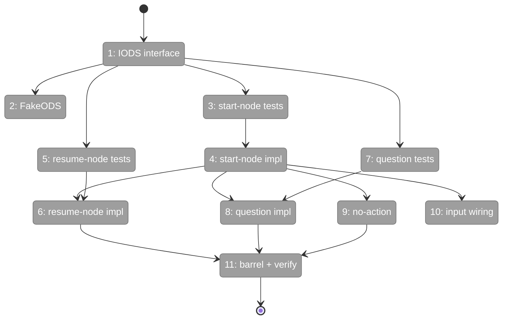
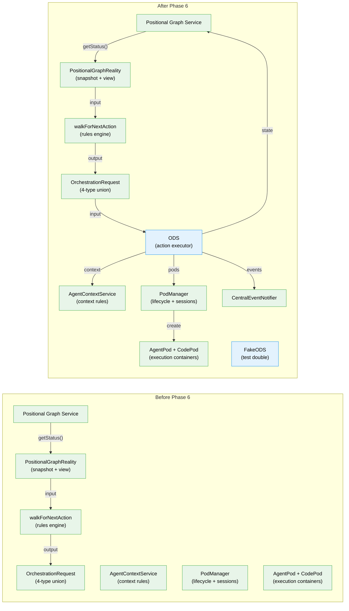

# Flight Plan: Phase 6 — ODS Action Handlers

**Plan**: [../../positional-orchestrator-plan.md](../../positional-orchestrator-plan.md)
**Phase**: Phase 6: ODS Action Handlers
**Generated**: 2026-02-06
**Status**: Ready for takeoff

---

## Departure → Destination

**Where we are**: Phases 1-5 delivered five foundational pieces: an immutable `PositionalGraphReality` snapshot that captures the entire graph state, a 4-type `OrchestrationRequest` discriminated union defining every possible action, a pure `getContextSource()` function for agent context inheritance, execution containers (AgentPod, CodePod) with a PodManager for lifecycle and session persistence, and a pure `walkForNextAction()` rules engine that walks the graph and returns the next best action. The system can read graph state, express actions, determine context rules, manage pods, and decide what to do next — but nothing can *execute* a decision. There is no action executor.

**Where we're going**: By the end of this phase, a developer can call `ods.execute(request, ctx)` with any OrchestrationRequest and have it carried out. A `start-node` request creates a pod, resolves context, executes the agent, and updates state. A `resume-node` request retrieves a pod and resumes it with an answer. A `question-pending` request marks a question as surfaced and emits a domain event. A `no-action` request does nothing. The system handles all four pod outcomes (completed, question, error, terminated) and the complete question lifecycle. Phase 7 can now compose ONBAS + ODS into the orchestration loop.

---

## Flight Status

<!-- Updated by /plan-6: pending → active → done. Use blocked for problems/input needed. -->

**Legend**: grey = pending | yellow = active | red = blocked/needs input | green = done

---

## Stages

<!-- Updated by /plan-6 during implementation: [ ] → [~] → [x] -->

- [ ] **Stage 1: Define IODS interface and ODS types** — single `execute(request, ctx)` method, dependency types for constructor injection (`ods.types.ts` — new file)
- [ ] **Stage 2: Create FakeODS test double** — configurable results, call history, reset method (`fake-ods.ts` — new file)
- [ ] **Stage 3: Write start-node handler tests** — agent/code paths, user-input bypass, all 4 pod outcomes, context inheritance, input passthrough, event emission (`ods.test.ts` — new file)
- [ ] **Stage 4: Implement start-node handler** — dispatch switch, pod creation, context resolution, pod execution, result handling (`ods.ts` — new file)
- [ ] **Stage 5: Write resume-node handler tests** — pod exists/recreated, answer stored, all 4 outcomes, session persistence (`ods.test.ts`)
- [ ] **Stage 6: Implement resume-node handler** — answer question, get/recreate pod, resumeWithAnswer, result handling (`ods.ts`)
- [ ] **Stage 7: Write question-pending handler tests** — surfaced_at set, event emitted, no pod interaction (`ods.test.ts`)
- [ ] **Stage 8: Implement question-pending handler** — mark surfaced, emit event, return ok (`ods.ts`)
- [ ] **Stage 9: Write + implement no-action handler** — trivial pass-through, no side effects (`ods.test.ts`, `ods.ts`)
- [ ] **Stage 10: Write input wiring verification tests** — AC-14 end-to-end InputPack flow from request to pod.execute (`ods.test.ts`)
- [ ] **Stage 11: Update barrel and verify** — add Phase 6 exports to index, run `just fft` (`index.ts`)

---

## Architecture: Before & After

**Legend**: existing (green, unchanged) | changed (orange, modified) | new (blue, created)

---

## Acceptance Criteria

- [ ] Each request type handled correctly (AC-6)
- [ ] `start-node` creates pod, resolves context, executes, handles all 4 outcomes
- [ ] `resume-node` retrieves/recreates pod, resumes with answer, handles all 4 outcomes
- [ ] `question-pending` sets `surfaced_at`, emits domain event
- [ ] `no-action` has no side effects
- [ ] User-input nodes handled without pod (AC-7)
- [ ] Question lifecycle steps 1, 3, 6 handled by ODS (AC-9)
- [ ] Input wiring flows from reality through to pods (AC-14)
- [ ] `just fft` clean

---

## Goals & Non-Goals

**Goals**:
- Define `IODS` interface with `execute(request, ctx): Promise<OrchestrationExecuteResult>`
- Implement ODS class with handlers for all 4 request types
- Handle all 4 pod outcomes (completed, question, error, terminated)
- Handle user-input nodes directly (no pod)
- Resolve agent context for session inheritance
- Create/retrieve/destroy pods via PodManager
- Emit domain events via ICentralEventNotifier
- Pass InputPack from request to pod execution
- Provide FakeODS for Phase 7 testing

**Non-Goals**:
- Orchestration loop coordination (Phase 7)
- DI registration (Phase 7)
- Real agent integration (fake adapters only)
- Web/CLI wiring (out of scope per plan)
- Retry/timeout policies

---

## Checklist

- [ ] T001: Define `IODS` interface + dependency types (CS-1)
- [ ] T002: Create `FakeODS` test double (CS-1)
- [ ] T003: Write `start-node` handler tests (CS-3)
- [ ] T004: Implement `start-node` handler (CS-3)
- [ ] T005: Write `resume-node` handler tests (CS-2)
- [ ] T006: Implement `resume-node` handler (CS-2)
- [ ] T007: Write `question-pending` handler tests (CS-2)
- [ ] T008: Implement `question-pending` handler (CS-1)
- [ ] T009: Write + implement `no-action` handler (CS-1)
- [ ] T010: Write input wiring verification tests (CS-2)
- [ ] T011: Update barrel + `just fft` (CS-1)

---

## PlanPak

Active — files organized under `features/030-orchestration/`
