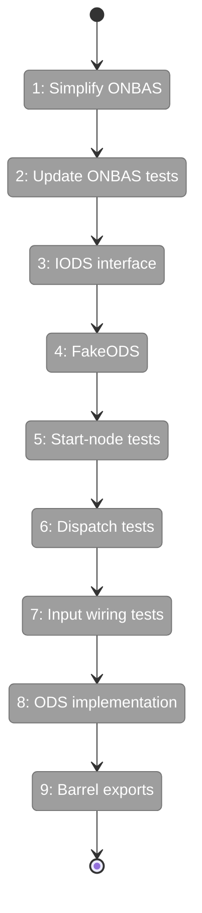
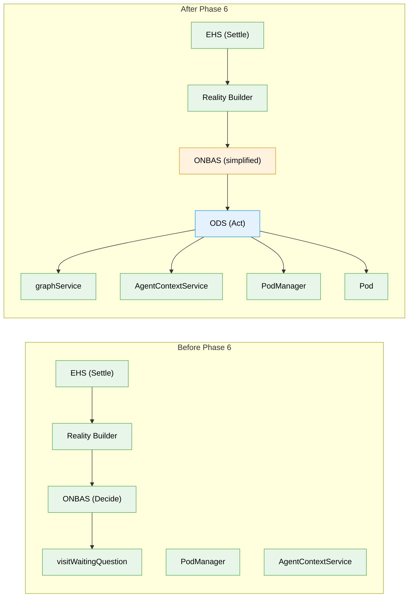

# Flight Plan: Phase 6 — ODS Action Handlers

**Plan**: [positional-orchestrator-plan.md](../../positional-orchestrator-plan.md)
**Phase**: Phase 6: ODS Action Handlers
**Generated**: 2026-02-09
**Status**: Ready for takeoff

---

## Departure -> Destination

**Where we are**: Phases 1-5 delivered the complete data model (reality snapshot, request union), three internal collaborators (AgentContextService, PodManager with pods), and the ONBAS decision engine. The orchestration system can observe a graph and determine the next best action — but it cannot act on that decision. ONBAS still contains `visitWaitingQuestion()` logic that produces `resume-node` and `question-pending` requests, which Workshop 11/12 determined are dead code paths. Subtask 001 (concept drift remediation) aligned the event/graph domain boundary.

**Where we're going**: By the end of this phase, the Orchestration Dispatch Service (ODS) will execute ONBAS decisions. A `start-node` request will create a pod, resolve context inheritance, and fire agent execution. ONBAS will be simplified to only produce `start-node` and `no-action` — the dispatch table will be clean with defensive errors for deprecated request types. A developer can construct an ODS with its dependencies, pass it a `start-node` request, and watch it transition a node from `pending` to `starting` with a pod launched.

---

## Flight Status

<!-- Updated by /plan-6: pending -> active -> done. Use blocked for problems/input needed. -->

**Legend**: grey = pending | yellow = active | red = blocked/needs input | green = done

---

## Stages

<!-- Updated by /plan-6 during implementation: [ ] -> [~] -> [x] -->

- [ ] **Stage 1: Simplify ONBAS walk** — remove `visitWaitingQuestion()`, make `waiting-question` a skip case (`onbas.ts`)
- [ ] **Stage 2: Update ONBAS tests** — remove question-production suites, add skip-behavior test, verify all non-question tests pass (`onbas.test.ts`)
- [ ] **Stage 3: Define IODS interface** — `execute(request, ctx, reality)` signature with `ODSDependencies` type (`ods.types.ts` — new file)
- [ ] **Stage 4: Create FakeODS** — test double with `getHistory()`, `setNextResult()`, `reset()` helpers (`fake-ods.ts` — new file)
- [ ] **Stage 5: Write start-node tests** — agent path, code path, user-input no-op, readiness validation, startNode failure (`ods.test.ts` — new file)
- [ ] **Stage 6: Write dispatch tests** — no-action pass-through, defensive errors for resume-node/question-pending (`ods.test.ts`)
- [ ] **Stage 7: Write input wiring tests** — verify InputPack flows from request to pod.execute() (`ods.test.ts`)
- [ ] **Stage 8: Implement ODS** — dispatch table + `handleStartNode()`, all tests pass (`ods.ts` — new file)
- [ ] **Stage 9: Update barrel exports** — add IODS, ODS, FakeODS to barrel index, run `just fft` (`index.ts`)

---

## Architecture: Before & After

**Legend**: existing (green, unchanged) | changed (orange, modified) | new (blue, created)

---

## Acceptance Criteria

- [ ] Each request type handled correctly (AC-6): `start-node` creates pod and launches, `no-action` is pass-through, `resume-node`/`question-pending` return defensive errors
- [ ] `start-node` validates readiness, transitions state via `startNode()`, resolves context, creates pod, fires execution
- [ ] User-input nodes return ok without pod creation
- [ ] Input wiring flows from request.inputs through to pod.execute() (AC-14)
- [ ] ONBAS only produces `start-node` and `no-action` after simplification (Workshop 11/12)
- [ ] `just fft` clean

## Goals & Non-Goals

**Goals**:
- Implement IODS interface with execute(request, ctx, reality) signature
- Implement handleStartNode for agent and code unit types
- Handle user-input nodes as no-op
- Wire InputPack from request through to pod.execute()
- Create FakeODS with standard test helpers
- Simplify ONBAS: remove visitWaitingQuestion()
- Achieve just fft clean

**Non-Goals**:
- handleResumeNode implementation (dead code, deferred per Workshop 12)
- handleQuestionPending implementation (dead code, deferred per Workshop 12)
- ICentralEventNotifier integration (deferred per Workshop 12)
- DI registration (ODS is internal, Phase 7 constructs it)
- Web/CLI wiring (out of scope for entire plan)

---

## Checklist

- [ ] T001: Remove visitWaitingQuestion from ONBAS (CS-2)
- [ ] T002: Update ONBAS tests for simplified walk (CS-2)
- [ ] T003: Define IODS interface and ODSDependencies (CS-1)
- [ ] T004: Create FakeODS with test helpers (CS-2)
- [ ] T005: Write start-node handler tests (CS-3)
- [ ] T006: Write dispatch + edge case tests (CS-2)
- [ ] T007: Write input wiring tests (CS-2)
- [ ] T008: Implement ODS with dispatch table (CS-3)
- [ ] T009: Update barrel index with ODS exports (CS-1)

---

## PlanPak

Active — files organized under `packages/positional-graph/src/features/030-orchestration/`.
