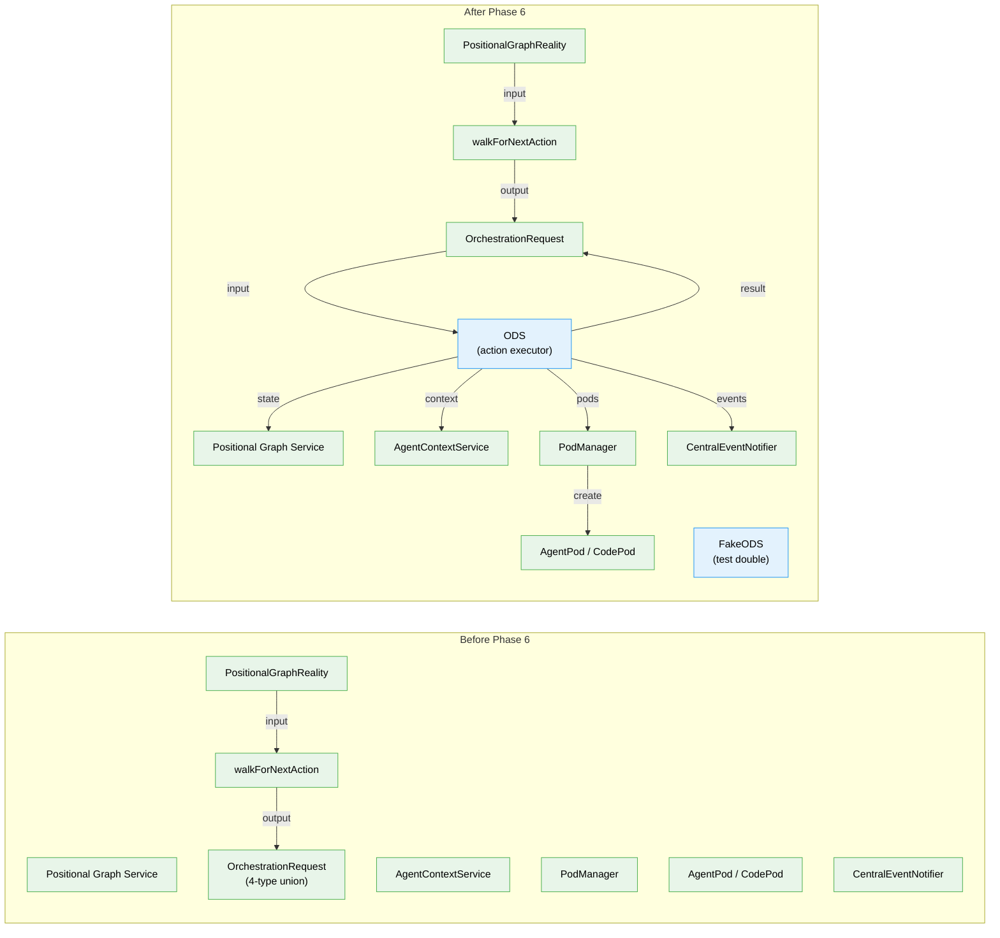

# Phase 6: ODS Action Handlers — Tasks & Alignment Brief

**Plan**: [../../positional-orchestrator-plan.md](../../positional-orchestrator-plan.md)
**Spec**: [../../positional-orchestrator-spec.md](../../positional-orchestrator-spec.md)
**Phase**: Phase 6: ODS Action Handlers
**Status**: **STALE — Pending Archive** (see subtask below)
**Testing Approach**: Full TDD (RED-GREEN-REFACTOR)
**Subtasks**: [001-subtask-concept-drift-remediation](./001-subtask-concept-drift-remediation.md)

> **STALE**: This dossier was written before Workshop #8, Workshop #9, and Plan 032 completion. Every major design assumption crosses the two-domain boundary identified in [Workshop #9](../../workshops/09-concept-drift-remediation.md). The subtask [001-subtask-concept-drift-remediation](./001-subtask-concept-drift-remediation.md) will archive this file and a fresh dossier will be generated via `/plan-5` after remediation completes.

---

## Executive Briefing

### Purpose

Phase 6 delivers the **OrchestrationDoerService (ODS)** — the executor that takes an `OrchestrationRequest` from ONBAS and performs the corresponding side effects: creating pods, starting nodes, surfacing questions, resuming agents with answers, and updating graph state. ONBAS (Phase 5) decides *what* to do; ODS *does it*.

### What We're Building

A single `IODS` interface with one method — `execute(request, ctx)` — that dispatches to four internal handlers based on request type:

| Request Type | Handler | What It Does |
|---|---|---|
| `start-node` | `handleStartNode` | Check user-input → startNode → load unit → create pod → resolve context → execute → handle result |
| `resume-node` | `handleResumeNode` | Answer question → get/recreate pod → resumeWithAnswer → handle result |
| `question-pending` | `handleQuestionPending` | Mark question as surfaced → emit domain event |
| `no-action` | (inline) | Return `{ ok: true, request }` — no side effects |

Plus `FakeODS` for downstream Phase 7 testing.

### User Value

After this phase, the system can take any ONBAS decision and carry it out — advancing nodes through their lifecycle, managing pod execution, and flowing questions to users. The orchestration loop (Phase 7) can call `ods.execute(request)` and trust that state is updated correctly.

### Example

```typescript
// ONBAS decides: start node "spec-builder"
const request: StartNodeRequest = {
  type: 'start-node',
  graphSlug: 'my-graph',
  nodeId: 'spec-builder',
  inputs: { ok: true, inputs: { spec: '...' } },
};

// ODS executes it
const result = await ods.execute(request, ctx);
// result: { ok: true, request, sessionId: 'sess-123', newStatus: 'complete' }
```

---

## Objectives & Scope

### Goals

- Define `IODS` interface with `execute(request, ctx): Promise<OrchestrationExecuteResult>`
- Implement ODS class with handlers for all 4 request types
- Handle all 4 pod outcomes (completed, question, error, terminated) in start-node and resume-node
- Handle user-input nodes directly (no pod — ODS calls graphService.askQuestion)
- Resolve agent context via AgentContextService for session inheritance
- Create/retrieve/destroy pods via PodManager
- Persist pod sessions after execution
- Emit domain events via ICentralEventNotifier
- Handle question surfacing (set surfaced_at timestamp)
- Pass InputPack from request through to pod execution (AC-14)
- Provide FakeODS test double for Phase 7

### Non-Goals

- Orchestration loop coordination (Phase 7 IGraphOrchestration)
- DI registration (Phase 7 registerOrchestrationServices)
- Real agent integration (fake adapters only)
- Web/CLI wiring
- Retry/timeout policies
- Adding `markQuestionSurfaced()` to IPositionalGraphService (ODS updates state directly or via existing methods)

---

## Pre-Implementation Audit

### File Provenance

| Target File | Status | Finding |
|---|---|---|
| `features/030-orchestration/ods.types.ts` | **Does not exist** | Safe to create |
| `features/030-orchestration/ods.ts` | **Does not exist** | Safe to create |
| `features/030-orchestration/fake-ods.ts` | **Does not exist** | Safe to create |
| `test/.../030-orchestration/ods.test.ts` | **Does not exist** | Safe to create |
| `features/030-orchestration/index.ts` | **Exists** | Barrel update only |

### Duplication Check

No existing ODS, OrchestrationDoer, DoerService, or ActionHandler classes/functions found anywhere in the codebase. Design space is clear.

### External Dependencies Verified

| Interface | Location | Methods ODS Needs | Status |
|---|---|---|---|
| `IPositionalGraphService` | `packages/positional-graph/src/interfaces/positional-graph-service.interface.ts` | `startNode`, `endNode`, `askQuestion`, `answerQuestion` | All present |
| `ICentralEventNotifier` | `packages/shared/src/features/027-central-notify-events/central-event-notifier.interface.ts` | `emit(domain, eventType, data)` | Present |
| `IPodManager` | `features/030-orchestration/pod-manager.types.ts` | `createPod`, `getPod`, `getSessionId`, `setSessionId`, `destroyPod`, `persistSessions` | All present |
| `IAgentContextService` | `features/030-orchestration/agent-context.types.ts` | `getContextSource(reality, nodeId)` | Present |
| `IWorkUnitPod` | `features/030-orchestration/pod.types.ts` | `execute(options)`, `resumeWithAnswer(qId, answer, options)`, `terminate()` | All present |

### Missing Interface: markQuestionSurfaced

**Discovery**: `IPositionalGraphService` has no `markQuestionSurfaced()` method. The state schema has `surfaced_at` on questions, and the reality builder maps it to `surfacedAt/isSurfaced`, but there's no service method to set it.

**Resolution**: ODS must handle this by either:
1. Adding a `surfaceQuestion()` method to `IPositionalGraphService` (preferred — follows existing pattern), or
2. Performing a lower-level state update

This is flagged as DYK-P6#1 and must be resolved during T001 (interface definition).

### Compliance

File naming follows established pattern: `{feature}.types.ts` + `{feature}.ts` + `fake-{feature}.ts`. Test location follows `test/unit/positional-graph/features/030-orchestration/ods.test.ts`.

---

## Requirements Traceability

### AC-6: ODS executes each OrchestrationRequest type correctly

| Sub-requirement | Test Task | Impl Task | Coverage |
|---|---|---|---|
| start-node: create pod, resolve context, execute, update state | T003 | T004 | Full |
| start-node: handle all 4 pod outcomes | T003 | T004 | Full |
| start-node: user-input bypass (no pod) | T003 | T004 | Full |
| resume-node: get/recreate pod, resumeWithAnswer, handle result | T005 | T006 | Full |
| question-pending: set surfaced_at, emit event | T007 | T008 | Full |
| no-action: no state changes | T009 | T009 | Full (inline) |
| All state updates via graphService | T003, T005, T007 | T004, T006, T008 | Full |

### AC-7: Pods manage execution lifecycle (ODS portion)

| Sub-requirement | Test Task | Impl Task | Coverage |
|---|---|---|---|
| ODS creates pods via PodManager | T003 | T004 | Full |
| ODS calls pod.execute() | T003 | T004 | Full |
| ODS calls pod.resumeWithAnswer() | T005 | T006 | Full |
| ODS handles completed outcome | T003, T005 | T004, T006 | Full |
| ODS handles question outcome | T003, T005 | T004, T006 | Full |
| ODS handles error outcome | T003, T005 | T004, T006 | Full |
| ODS handles terminated outcome | T003, T005 | T004, T006 | Full |
| CodePod execution (same interface, no context) | T003 | T004 | Full |

### AC-9: Question lifecycle (ODS steps)

| Step | Test Task | Impl Task | Coverage |
|---|---|---|---|
| Step 1: Pod returns question → ODS stores in state | T003 | T004 | Full |
| Step 3: ODS marks question surfaced, emits event | T007 | T008 | Full |
| Step 6: ODS calls pod.resumeWithAnswer() | T005 | T006 | Full |

### AC-14: Input wiring flows through to pods

| Sub-requirement | Test Task | Impl Task | Coverage |
|---|---|---|---|
| InputPack from request reaches pod.execute(options.inputs) | T010 | T004 (inherent) | Full |
| Inputs verified end-to-end in test | T010 | — | Test-only verification |

### Gaps

None. All AC sub-requirements map to specific test and implementation tasks. The `terminated` outcome (flagged by requirements flow) is explicitly included in T003/T005 scope.

---

## Architecture Map



### Task-to-Component Mapping

| Task | Component(s) Affected |
|---|---|
| T001 | `ods.types.ts` (IODS interface) |
| T002 | `fake-ods.ts` (FakeODS test double) |
| T003–T004 | `ods.test.ts`, `ods.ts` (start-node handler) |
| T005–T006 | `ods.test.ts`, `ods.ts` (resume-node handler) |
| T007–T008 | `ods.test.ts`, `ods.ts` (question-pending handler) |
| T009 | `ods.test.ts`, `ods.ts` (no-action handler) |
| T010 | `ods.test.ts` (input wiring verification) |
| T011 | `index.ts` (barrel update) |

---

## Tasks

| # | Status | ID | Task | CS | Depends On | Absolute Path(s) |
|---|--------|-----|------|----|------------|-------------------|
| 1 | [ ] | T001 | Define `IODS` interface and ODS dependency types | 1 | — | `packages/positional-graph/src/features/030-orchestration/ods.types.ts` |
| 2 | [ ] | T002 | Create `FakeODS` test double | 1 | T001 | `packages/positional-graph/src/features/030-orchestration/fake-ods.ts` |
| 3 | [ ] | T003 | Write `start-node` handler tests (RED) | 3 | T001 | `test/unit/positional-graph/features/030-orchestration/ods.test.ts` |
| 4 | [ ] | T004 | Implement `start-node` handler (GREEN) | 3 | T003 | `packages/positional-graph/src/features/030-orchestration/ods.ts` |
| 5 | [ ] | T005 | Write `resume-node` handler tests (RED) | 2 | T001 | `test/unit/positional-graph/features/030-orchestration/ods.test.ts` |
| 6 | [ ] | T006 | Implement `resume-node` handler (GREEN) | 2 | T004, T005 | `packages/positional-graph/src/features/030-orchestration/ods.ts` |
| 7 | [ ] | T007 | Write `question-pending` handler tests (RED) | 2 | T001 | `test/unit/positional-graph/features/030-orchestration/ods.test.ts` |
| 8 | [ ] | T008 | Implement `question-pending` handler (GREEN) | 1 | T004, T007 | `packages/positional-graph/src/features/030-orchestration/ods.ts` |
| 9 | [ ] | T009 | Write + implement `no-action` handler | 1 | T004 | `test/unit/.../ods.test.ts`, `ods.ts` |
| 10 | [ ] | T010 | Write input wiring verification tests (AC-14) | 2 | T004 | `test/unit/positional-graph/features/030-orchestration/ods.test.ts` |
| 11 | [ ] | T011 | Update barrel + `just fft` | 1 | T004, T006, T008, T009 | `packages/positional-graph/src/features/030-orchestration/index.ts` |

### Task Details

---

#### T001: Define IODS interface and ODS dependency types

**Plan Task**: 6.1 | **CS**: 1

**What to create** (`ods.types.ts`):

```typescript
export interface IODS {
  execute(
    request: OrchestrationRequest,
    ctx: { readonly worktreePath: string }
  ): Promise<OrchestrationExecuteResult>;
}
```

**Dependencies to define**: ODS constructor receives these collaborators:
- `graphService: IPositionalGraphService` — state updates (startNode, endNode, askQuestion, answerQuestion)
- `podManager: IPodManager` — pod lifecycle
- `agentContextService: IAgentContextService` — context inheritance resolution
- `eventNotifier: ICentralEventNotifier` — domain event emission
- `buildReality: (ctx, graphSlug) => Promise<PositionalGraphReality>` — reality builder callback (needed for resume-node pod recreation)

**DYK-P6#1 resolution**: Question surfacing has no existing `markQuestionSurfaced()` on IPositionalGraphService. Options:
1. Add method to IPositionalGraphService (requires modifying external interface — may defer to Phase 7 integration)
2. ODS performs state update via existing lower-level mechanism
3. Add a `surfaceQuestion()` method to IODS types for the graph service dependency

Decision: Document the need and resolve during implementation. The IODS interface itself is clean.

**Validation**: `pnpm build` succeeds.

---

#### T002: Create FakeODS test double

**Plan Task**: (new, derived from constitution pattern) | **CS**: 1

**What to create** (`fake-ods.ts`):

```typescript
export class FakeODS implements IODS {
  // setNextResult(result) — canned response
  // setResults(results[]) — queue
  // getHistory() — captured (request, ctx) pairs
  // reset()
  // Default: returns { ok: true, request }
}
```

Per FakeONBAS/FakePodManager pattern: configurable results, call history, reset.

**Validation**: `pnpm build` succeeds.

---

#### T003: Write start-node handler tests (RED)

**Plan Task**: 6.2 | **CS**: 3

**Test groups in `ods.test.ts`** (describe "start-node handler"):

1. **Happy path — agent node**:
   - Creates pod via podManager.createPod with correct PodCreateParams
   - Resolves context via agentContextService.getContextSource
   - Calls pod.execute with correct PodExecuteOptions (inputs, contextSessionId, ctx, graphSlug)
   - Calls graphService.startNode before pod.execute
   - Returns `{ ok: true, request, sessionId, newStatus: 'complete' }` for completed outcome

2. **Happy path — code node**:
   - Creates pod with `{ unitType: 'code', runner }` params
   - Does NOT call agentContextService (code nodes → not-applicable)
   - Calls pod.execute without contextSessionId

3. **User-input bypass**:
   - Node with `unitType: 'user-input'` → no pod created
   - Calls graphService directly (e.g., askQuestion or returns immediately)
   - Returns `{ ok: true, request }`

4. **Pod outcome: completed**:
   - Calls graphService.endNode with outputs
   - Calls podManager.destroyPod
   - Sets sessionId via podManager.setSessionId
   - Persists sessions

5. **Pod outcome: question**:
   - Calls graphService.askQuestion with podResult.question
   - Returns `{ ok: true, request, newStatus: 'waiting-question', sessionId }`
   - Does NOT destroy pod (agent paused, pod stays)

6. **Pod outcome: error**:
   - Calls podManager.destroyPod
   - Returns `{ ok: false, request, error: podResult.error }`

7. **Pod outcome: terminated**:
   - Calls podManager.destroyPod
   - Returns `{ ok: true, request, newStatus: 'blocked-error' }`

8. **Context inheritance**:
   - Agent with `inherit` context → passes contextSessionId from podManager.getSessionId(fromNodeId)
   - Agent with `new` context → passes undefined contextSessionId
   - Agent where source session doesn't exist → passes undefined

9. **Input passthrough (AC-14)**:
   - `request.inputs` passed as `options.inputs` to pod.execute

10. **Event emission**:
    - Emits `node-started` event via eventNotifier

**Test dependencies**: FakePodManager, FakePod (Phase 4), FakeAgentContextService (Phase 3), buildFakeReality (Phase 5). Plus a fake IPositionalGraphService and fake ICentralEventNotifier (simple fakes inline or extracted).

**Validation**: All tests RED (import error or assertion failures — module not yet created).

---

#### T004: Implement start-node handler (GREEN)

**Plan Task**: 6.3 | **CS**: 3

**What to create** (`ods.ts`):

```typescript
export class ODS implements IODS {
  constructor(deps: ODSDependencies) { ... }

  async execute(request, ctx): Promise<OrchestrationExecuteResult> {
    switch (request.type) {
      case 'start-node': return this.handleStartNode(request, ctx);
      case 'resume-node': return this.handleResumeNode(request, ctx);
      case 'question-pending': return this.handleQuestionPending(request, ctx);
      case 'no-action': return { ok: true, request };
      default: { const _: never = request; throw ... }
    }
  }

  private async handleStartNode(request: StartNodeRequest, ctx): Promise<...> {
    // Per Workshop #4 lines 926-999:
    // 1. Build reality for node lookup
    // 2. Check user-input bypass
    // 3. startNode via graphService
    // 4. Create pod via podManager
    // 5. Resolve context via agentContextService
    // 6. Execute pod
    // 7. Handle result (completed/question/error/terminated)
    // 8. Persist session
    // 9. Emit event
  }
}
```

**Implementation notes**:
- Per DYK-P4#4: ODS passes adapter/runner into PodCreateParams. For Phase 6 tests, use fake adapters. Real adapter resolution deferred to Phase 7.
- The `buildReality` callback is needed for resume-node (pod recreation) but also for start-node (node lookup for unitType). Pass as constructor dependency.
- User-input nodes: return `{ ok: true, request }` immediately (user-input flow handled by external CLI, not ODS).

**Validation**: All T003 tests pass. `pnpm build` succeeds.

---

#### T005: Write resume-node handler tests (RED)

**Plan Task**: 6.4 | **CS**: 2

**Test groups** (describe "resume-node handler"):

1. **Happy path — pod exists**:
   - Gets existing pod via podManager.getPod
   - Calls pod.resumeWithAnswer(questionId, answer, options)
   - Returns result based on pod outcome

2. **Pod recreation — pod destroyed (server restart)**:
   - podManager.getPod returns undefined
   - Builds reality to find node
   - Loads work unit, creates new pod
   - Calls pod.resumeWithAnswer with persisted session context

3. **Answer stored in state**:
   - Calls graphService.answerQuestion before resume

4. **All 4 pod outcomes** (same as start-node):
   - completed → endNode + destroyPod
   - question → askQuestion (another question)
   - error → destroyPod + error result
   - terminated → destroyPod + blocked-error

5. **Session persistence**:
   - setSessionId + persistSessions called after execution

6. **Event emission**:
   - Emits `node-resumed` event

**Validation**: All tests RED.

---

#### T006: Implement resume-node handler (GREEN)

**Plan Task**: 6.5 | **CS**: 2

**Implementation** (`handleResumeNode` in `ods.ts`):

Per Workshop #4 lines 1002-1061:
1. Answer question in state via graphService.answerQuestion
2. Get or recreate pod (getPod → if null, buildReality → loadUnit → createPod)
3. Call pod.resumeWithAnswer(questionId, answer, options)
4. Handle result (same 4-outcome switch as handleStartNode)
5. Persist session
6. Emit event

**Note**: `options.inputs` for resumeWithAnswer is `{ ok: true, inputs: {} }` — inputs were consumed on first execute.

**Validation**: All T005 tests pass. `pnpm build` succeeds.

---

#### T007: Write question-pending handler tests (RED)

**Plan Task**: 6.6 | **CS**: 2

**Test groups** (describe "question-pending handler"):

1. **Mark question surfaced**:
   - Sets `surfaced_at` timestamp on the question via state update
   - Verifies graphService method called with correct questionId

2. **Emit domain event**:
   - Calls eventNotifier.emit('workgraphs', 'question-surfaced', { graphSlug, nodeId, questionId, questionText, questionType, options })
   - Event data matches request fields

3. **Return value**:
   - Returns `{ ok: true, request }`

4. **No pod interaction**:
   - Does NOT call podManager.createPod or pod.execute
   - Question surfacing is a state-only operation

**DYK-P6#1 note**: The test will call a `surfaceQuestion` or similar method on graphService. If this method doesn't exist yet, the test fake will define it and the implementation task (T008) will either add it to IPositionalGraphService or use an alternative approach.

**Validation**: All tests RED.

---

#### T008: Implement question-pending handler (GREEN)

**Plan Task**: 6.7 | **CS**: 1

**Implementation** (`handleQuestionPending` in `ods.ts`):

Per Workshop #2 lines 493-513:
1. Mark question as surfaced (set surfaced_at timestamp)
2. Emit `question-surfaced` domain event via eventNotifier
3. Return `{ ok: true, request }`

**DYK-P6#1 resolution**: If `markQuestionSurfaced`/`surfaceQuestion` needs to be added to `IPositionalGraphService`, add it. Alternatively, ODS can use a graph-service method that already supports updating question state. Resolve during implementation based on what the graph service actually supports.

**Validation**: All T007 tests pass. `pnpm build` succeeds.

---

#### T009: Write + implement no-action handler

**Plan Task**: 6.8 + 6.9 | **CS**: 1

**Combined** (trivial handler):

Tests:
- Returns `{ ok: true, request }` for a no-action request
- No graphService calls
- No podManager calls
- No eventNotifier calls

Implementation:
```typescript
case 'no-action':
  return { ok: true, request };
```

**Validation**: Tests pass. `pnpm build` succeeds.

---

#### T010: Write input wiring verification tests (AC-14)

**Plan Task**: 6.10 | **CS**: 2

**Test group** (describe "AC-14: input wiring"):

1. **InputPack flows to pod.execute**:
   - Build reality with node having specific inputPack: `{ ok: true, inputs: { spec: 'data', config: { nested: true } } }`
   - ONBAS produces `start-node` request with those inputs
   - ODS calls pod.execute with `options.inputs` matching the InputPack exactly
   - Assert via FakePod that execute was called with correct inputs

2. **Empty inputs work**:
   - InputPack with `{ ok: true, inputs: {} }` → pod receives empty inputs

3. **Complex nested inputs preserved**:
   - Deeply nested objects, arrays, and primitives all flow through unchanged

4. **Resume-node uses empty inputs**:
   - resumeWithAnswer options.inputs is `{ ok: true, inputs: {} }` (inputs consumed on first execute)

**Validation**: All tests pass (T004 implementation already handles this; these are verification tests).

---

#### T011: Update barrel + just fft

**Plan Task**: 6.11 | **CS**: 1

**What to add to `index.ts`**:

```typescript
// ODS — Interface + types (Phase 6)
export type { IODS } from './ods.types.js';

// ODS — Implementation (Phase 6)
export { ODS } from './ods.js';

// ODS — Fake (Phase 6)
export { FakeODS } from './fake-ods.js';
```

Plus any additional types exported from `ods.types.ts` (e.g., `ODSDependencies` if public).

**Validation**: `just fft` clean — all tests pass, lint clean, format clean.

---

## Alignment Brief

### Cross-Phase Dependencies

| Phase | What ODS Uses | How |
|---|---|---|
| Phase 1 | `PositionalGraphReality`, `NodeReality` | Reality passed to buildReality callback; node lookup for unitType, inputPack |
| Phase 2 | `OrchestrationRequest`, `OrchestrationExecuteResult`, type guards | Input (dispatched by type) and output types |
| Phase 3 | `getContextSource`, `ContextSourceResult` | Called in handleStartNode for agent context inheritance |
| Phase 4 | `IPodManager`, `IWorkUnitPod`, `PodCreateParams`, `PodExecuteResult`, `FakePodManager`, `FakePod` | Pod creation, execution, session management, test doubles |
| Phase 5 | `buildFakeReality`, `FakeONBAS` | Test helpers (not runtime dependency) |

### External Service Dependencies

| Service | Method | Used In |
|---|---|---|
| `IPositionalGraphService` | `startNode(ctx, graphSlug, nodeId)` | handleStartNode |
| `IPositionalGraphService` | `endNode(ctx, graphSlug, nodeId)` | handleStartNode (completed), handleResumeNode (completed) |
| `IPositionalGraphService` | `askQuestion(ctx, graphSlug, nodeId, options)` | handleStartNode (question outcome) |
| `IPositionalGraphService` | `answerQuestion(ctx, graphSlug, nodeId, qId, answer)` | handleResumeNode |
| `ICentralEventNotifier` | `emit(domain, eventType, data)` | handleStartNode (node-started), handleResumeNode (node-resumed), handleQuestionPending (question-surfaced) |

### Fake Strategy

ODS tests use these test doubles (all from prior phases):
- `FakePodManager` + `FakePod` (Phase 4) — configurable pod results, call history
- `FakeAgentContextService` (Phase 3) — configurable context source results
- `buildFakeReality` (Phase 5) — test fixture builder for PositionalGraphReality
- **New**: Inline fakes for `IPositionalGraphService` and `ICentralEventNotifier` (simple call-tracking objects)
- **New**: `FakeODS` (T002) — for Phase 7 downstream testing

No `vi.mock` or `jest.mock` — all fakes are interface implementations per constitution.

### ODS Constructor Pattern

```typescript
interface ODSDependencies {
  readonly graphService: IPositionalGraphService;
  readonly podManager: IPodManager;
  readonly agentContextService: IAgentContextService;
  readonly eventNotifier: ICentralEventNotifier;
  readonly buildReality: (
    ctx: { readonly worktreePath: string },
    graphSlug: string
  ) => Promise<PositionalGraphReality>;
}
```

ODS is NOT in DI. Phase 7's `GraphOrchestration` creates it directly, passing collaborators. This follows the "internal collaborator" pattern established in the plan.

---

## Phase Footnote Stubs

### DYK-P6#1: Missing markQuestionSurfaced method

`IPositionalGraphService` has no method to mark a question as surfaced (set `surfaced_at` timestamp). The state schema supports it (`surfaced_at` field on questions), but no service method exists. ODS must either:
1. Add `surfaceQuestion(ctx, graphSlug, questionId)` to `IPositionalGraphService`
2. Use a lower-level state update mechanism
3. Combine with existing methods

Resolution tracked in T007/T008 implementation.

### DYK-P6#2: Adapter resolution deferred to Phase 7

Per DYK-P4#4, PodManager receives adapters via `PodCreateParams` — it does not resolve them. In Phase 6 tests, fake adapters are passed directly. Real adapter resolution (via `IAgentManagerService`) happens in Phase 7 when `GraphOrchestration` composes ODS with real dependencies.

### DYK-P6#3: buildReality callback pattern

ODS needs to build fresh reality snapshots (for resume-node pod recreation and start-node node lookup). Rather than depending on the full reality builder chain, ODS receives a `buildReality` callback in its constructor. This keeps ODS decoupled from the builder implementation and makes testing trivial (just pass `buildFakeReality`).

### DYK-P6#4: User-input nodes have no pod

Per Workshop #4 and pod.types.ts line 76-77: "User-input nodes have no pod; ODS handles them directly." When `handleStartNode` encounters `unitType: 'user-input'`, it skips pod creation entirely. The user-input flow (saving output data) is handled by external CLI commands, not ODS execution.

### DYK-P6#5: Resume inputs are empty

Per Workshop #4 line 1028: When resuming a pod with an answer, `options.inputs` is `{ ok: true, inputs: {} }` because inputs were already consumed during the first execution. The answer itself is passed as a separate parameter to `resumeWithAnswer`.

---

## Evidence Artifacts

### Prior Phase Summaries

- **Phase 1**: PositionalGraphReality snapshot with builder + view. 47 tests. Provides NodeReality with inputPack, unitType, status, pendingQuestionId.
- **Phase 2**: 4-type OrchestrationRequest union with Zod schemas, type guards, OrchestrationExecuteResult. 31 tests.
- **Phase 3**: getContextSource() pure function with 5 positional rules. AgentContextService class wrapper. FakeAgentContextService. 26 tests.
- **Phase 4**: IPodManager + IWorkUnitPod + AgentPod + CodePod + FakePodManager + FakePod. PodCreateParams discriminated union. Session persistence. 53 tests.
- **Phase 5**: walkForNextAction pure function. ONBAS class wrapper. FakeONBAS + buildFakeReality. 45 tests.

### Critical Research Findings

- **CR-02** (Workshop #2): ODS handler signatures and pseudo-implementations at lines 370-514
- **CR-03** (Workshop #4): Complete ODS integration flows at lines 926-1061 (handleStartNode, handleResumeNode)
- **CR-07** (Workshop #7): ODS composed inside GraphOrchestration, not exposed publicly
- **CR-09** (AC-9): Question lifecycle steps 1/3/6 handled by ODS
- **CR-15** (AC-14): Input wiring chain from reality → ONBAS → ODS → pod

### Test Count Baseline

Current: 228 test files, 3429 tests passed (from Phase 5 `just fft`)

---

## Discoveries & Learnings

*Populated during implementation.*
