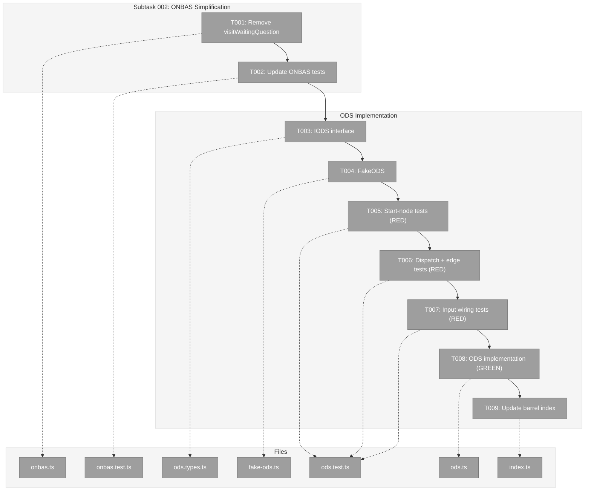
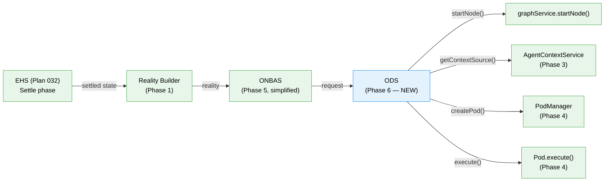

# Phase 6: ODS Action Handlers — Tasks & Alignment Brief

**Spec**: [positional-orchestrator-spec.md](../../positional-orchestrator-spec.md)
**Plan**: [positional-orchestrator-plan.md](../../positional-orchestrator-plan.md)
**Date**: 2026-02-09

---

## Executive Briefing

### Purpose

This phase delivers the Orchestration Dispatch Service (ODS) — the executor that takes decisions from ONBAS and performs the corresponding state changes. Without ODS, the orchestration system can observe the graph and decide what to do next, but cannot act on those decisions. ODS completes the Decide → Act half of the Settle-Decide-Act loop.

### What We're Building

An `ODS` class implementing the `IODS` interface with:
- A dispatch table that routes `OrchestrationRequest` variants to handler methods
- A `handleStartNode` handler that validates readiness, transitions state via `graphService.startNode()`, resolves context, creates a pod, and fires `pod.execute()` (fire-and-forget)
- A `no-action` pass-through that returns immediately
- Defensive error branches for `resume-node` and `question-pending` (dead code — ONBAS never produces these after Subtask 002 simplification)
- A `FakeODS` test double with `getHistory()`, `setNextResult()`, `reset()` helpers

This phase also includes **Subtask 002: ONBAS Question Logic Removal** — a prerequisite that simplifies ONBAS by removing `visitWaitingQuestion()`, ensuring ONBAS only produces `start-node` and `no-action` requests.

### User Value

With ODS in place, the orchestration loop can advance graphs through real work: starting agent nodes, launching code nodes, and correctly wiring inputs from user-input nodes to downstream agents. This is the last internal collaborator before Phase 7 wires everything into the `IOrchestrationService` facade.

### Example

**Input**: ONBAS returns `{ type: 'start-node', graphSlug: 'design-system', nodeId: 'spec-builder', inputs: { inputs: { spec: '...' }, ok: true } }`

**ODS executes**:
1. Validates node is ready via `reality.nodes.get('spec-builder').ready`
2. Calls `graphService.startNode(ctx, 'design-system', 'spec-builder')` → transitions `pending → starting`
3. Resolves context: `contextService.getContextSource(reality, 'spec-builder')` → `{ source: 'inherit', fromNodeId: 'get-spec' }`
4. Creates pod: `podManager.createPod('spec-builder', { unitType: 'agent', adapter })`
5. Fires `pod.execute({ inputs, contextSessionId: 'session-get-spec', ctx, graphSlug })` — fire-and-forget

**Output**: `{ ok: true, request, newStatus: 'starting', sessionId: 'session-spec-builder' }`

---

## Objectives & Scope

### Objective

Implement the ODS executor as specified by Workshop 12 (authoritative reference, supersedes Workshop 08) and align ONBAS with the simplified walk algorithm (Workshop 11 Part 13).

### Goals

- Implement `IODS` interface with `execute(request, ctx, reality)` signature
- Implement `handleStartNode` for agent and code unit types
- Handle user-input nodes as no-op (no pod needed)
- Wire InputPack from request through to `pod.execute()` (AC-14)
- Create `FakeODS` with standard test helpers (ADR-0011)
- Simplify ONBAS: remove `visitWaitingQuestion()`, make `waiting-question` a skip case (Subtask 002)
- Achieve `just fft` clean

### Non-Goals

- `handleResumeNode` implementation (dead code — ONBAS never produces `resume-node` after simplification; Workshop 12 Part 12 explicitly defers)
- `handleQuestionPending` implementation (dead code — `question-pending` is a loop-exit signal, never dispatched to ODS; Workshop 12 Part 12 explicitly defers)
- `ICentralEventNotifier` integration (deferred per Workshop 12 Part 12; ODS does not emit domain events in this phase)
- Post-execute state reading (ODS does not build reality after execution; that's Phase 7's loop responsibility)
- `getNodeStatus()` pendingQuestion population (Workshop 11 ST006 — deferred to Phase 8 prerequisites; ODS tests use `buildFakeReality` which bypasses this)
- DI registration (ODS is internal to the package, constructed by Phase 7's `IOrchestrationService`)
- Web/CLI wiring (out of scope for entire plan)

---

## Pre-Implementation Audit

### Summary

| File | Action | Origin | Modified By | Recommendation |
|------|--------|--------|-------------|----------------|
| `ods.types.ts` | Created | Plan 030 Phase 6 | N/A | keep-as-is |
| `fake-ods.ts` | Created | Plan 030 Phase 6 | N/A | keep-as-is |
| `ods.ts` | Created | Plan 030 Phase 6 | N/A | keep-as-is |
| `ods.test.ts` | Created | Plan 030 Phase 6 | N/A | keep-as-is |
| `onbas.ts` | Modified | Plan 030 Phase 5 | Plan 032 Phase 2 | compliance-warning |
| `onbas.test.ts` | Modified | Plan 030 Phase 5 | (none) | compliance-warning |
| `index.ts` | Modified | Plan 030 Phase 1 | Plan 030 Phases 2,3,4,5 | keep-as-is |

All paths under `packages/positional-graph/src/features/030-orchestration/` (plan-scoped).
Test paths under `test/unit/positional-graph/features/030-orchestration/`.

### Compliance Check

| Severity | File | Rule/ADR/Workshop | Finding | Suggested Fix |
|----------|------|-------------------|---------|---------------|
| HIGH | `onbas.ts` | Workshop 11 Part 13 | `visitWaitingQuestion()` still produces `question-pending` and `resume-node` — must be removed before ODS implementation | T001-T002 (Subtask 002) address this |
| HIGH | `onbas.test.ts` | Workshop 11 Part 13 | ~100+ lines of question-specific tests must be removed/updated | T002 addresses this |
| MEDIUM | Plan vs Workshop 12 | Workshop 12 (authoritative) | Plan task table 6.1-6.11 describes handlers for "all 4 request types" and lists `ICentralEventNotifier`. Workshop 12 reduces scope. | This dossier uses Workshop 12 scope |
| LOW | Naming | Codebase convention | Plan directory tree lists `ods.interface.ts` but convention is `{feature}.types.ts` | Using `ods.types.ts` (matches convention) |

### Duplication Check

No existing ODS-like concepts found. The `IODS` interface, `ODS` class, and `FakeODS` test double are genuinely new with no overlap. `OrchestrationExecuteResult` already exists from Phase 2 and requires no changes.

---

## Requirements Traceability

### Coverage Matrix

| AC | Description | Flow Summary | Files in Flow | Tasks | Status |
|----|-------------|-------------|---------------|-------|--------|
| AC-6 | ODS executes each request type | request → dispatch → startNode/no-op/error | ods.types.ts, ods.ts, ods.test.ts, fake-ods.ts | T003,T004,T005,T006,T007,T008 | Complete |
| AC-9 step 6 | restart-pending → ready → start-node → ODS | reality maps restart-pending → ready, ONBAS returns start-node, ODS calls startNode() | ods.ts, ods.test.ts | T004,T008 | Complete |
| AC-14 | Input wiring flows through ODS to pods | request.inputs → pod.execute(inputs) | ods.ts, ods.test.ts | T006,T008 | Complete |
| Subtask 002 | ONBAS question logic removal | remove visitWaitingQuestion, simplify walk | onbas.ts, onbas.test.ts | T001,T002 | Complete |

### Gaps Found

**Gap 1 — Test stub for `IPositionalGraphService.startNode()`**: ODS tests need a controllable stub for `graphService.startNode()`. Resolution: T004 creates an inline partial stub within `ods.test.ts` typed as `Pick<IPositionalGraphService, 'startNode'>`. No new production file needed.

**Gap 2 — `getNodeStatus()` pendingQuestion population**: Workshop 11 ST006 identified that `getNodeStatus()` never populates `pendingQuestion`. This does NOT block Phase 6 (ODS tests use `buildFakeReality`), but will surface in Phase 8 E2E. Deferred to Phase 8 prerequisites.

### Orphan Files

All task table files map to at least one acceptance criterion.

---

## Architecture Map

### Component Diagram

<!-- Status: grey=pending, orange=in-progress, green=completed, red=blocked -->
<!-- Updated by plan-6 during implementation -->



### Task-to-Component Mapping

<!-- Status: Pending | In Progress | Complete | Blocked -->

| Task | Component(s) | Files | Status | Comment |
|------|-------------|-------|--------|---------|
| T001 | ONBAS Simplification | onbas.ts | Pending | Remove visitWaitingQuestion, simplify waiting-question to skip |
| T002 | ONBAS Tests | onbas.test.ts | Pending | Remove question-specific test suites, verify simplified walk |
| T003 | IODS Interface | ods.types.ts | Pending | Interface + ODSDependencies type |
| T004 | FakeODS | fake-ods.ts | Pending | Test double with getHistory/setNextResult/reset |
| T005 | ODS Tests (start-node) | ods.test.ts | Pending | Agent path, code path, user-input no-op, readiness check |
| T006 | ODS Tests (dispatch) | ods.test.ts | Pending | No-action pass-through, defensive errors, exhaustive check |
| T007 | ODS Tests (inputs) | ods.test.ts | Pending | AC-14 input wiring verification |
| T008 | ODS Implementation | ods.ts | Pending | Dispatch table + handleStartNode |
| T009 | Barrel Exports | index.ts | Pending | Add IODS, ODS, FakeODS exports |

---

## Tasks

| Status | ID | Task | CS | Type | Dependencies | Absolute Path(s) | Validation | Subtasks | Notes |
|--------|------|------|-----|------|--------------|-------------------|------------|----------|-------|
| [ ] | T001 | Remove `visitWaitingQuestion()` from ONBAS — simplify `waiting-question` case to `return null` | 2 | Core | – | `/home/jak/substrate/030-positional-orchestrator/packages/positional-graph/src/features/030-orchestration/onbas.ts` | ONBAS never produces `resume-node` or `question-pending`; `waiting-question` nodes skipped | – | Subtask 002 per Workshop 11 Part 13 |
| [ ] | T002 | Update ONBAS tests — remove question-specific suites, add tests that `waiting-question` is skipped | 2 | Test | T001 | `/home/jak/substrate/030-positional-orchestrator/test/unit/positional-graph/features/030-orchestration/onbas.test.ts` | All existing non-question tests still pass; new test confirms skip behavior; `just fft` clean | – | Subtask 002 per Workshop 11 Part 13 |
| [ ] | T003 | Define `IODS` interface and `ODSDependencies` type | 1 | Setup | T002 | `/home/jak/substrate/030-positional-orchestrator/packages/positional-graph/src/features/030-orchestration/ods.types.ts` | Interface has `execute(request, ctx, reality): Promise<OrchestrationExecuteResult>` | – | Per Workshop 12 Part 2; ADR-0011 |
| [ ] | T004 | Create `FakeODS` with standard test helpers | 2 | Setup | T003 | `/home/jak/substrate/030-positional-orchestrator/packages/positional-graph/src/features/030-orchestration/fake-ods.ts` | FakeODS implements IODS; has `getHistory()`, `setNextResult()`, `reset()` | – | Per ADR-0011 fake pattern |
| [ ] | T005 | Write `start-node` handler tests (agent path, code path, user-input no-op, readiness validation, startNode failure) | 3 | Test | T004 | `/home/jak/substrate/030-positional-orchestrator/test/unit/positional-graph/features/030-orchestration/ods.test.ts` | Tests cover: agent pod creation + execute, code pod creation + execute, user-input returns ok without pod, node.ready=false returns NODE_NOT_READY, startNode() failure returns START_NODE_FAILED | – | RED phase; uses FakePodManager, FakeAgentContextService, inline startNode stub |
| [ ] | T006 | Write dispatch table + edge case tests (no-action, defensive errors, exhaustive check) | 2 | Test | T004 | `/home/jak/substrate/030-positional-orchestrator/test/unit/positional-graph/features/030-orchestration/ods.test.ts` | Tests cover: no-action returns {ok:true}, resume-node returns UNSUPPORTED_REQUEST_TYPE, question-pending returns UNSUPPORTED_REQUEST_TYPE | – | RED phase |
| [ ] | T007 | Write input wiring tests verifying InputPack flows from request to pod.execute() | 2 | Test | T004 | `/home/jak/substrate/030-positional-orchestrator/test/unit/positional-graph/features/030-orchestration/ods.test.ts` | FakePodManager captures pod.execute() call args; inputs match request.inputs (AC-14) | – | RED phase |
| [ ] | T008 | Implement ODS with dispatch table and handleStartNode | 3 | Core | T005, T006, T007 | `/home/jak/substrate/030-positional-orchestrator/packages/positional-graph/src/features/030-orchestration/ods.ts` | All tests from T005-T007 pass; dispatch table handles all 4 request types; fire-and-forget execution | – | GREEN phase; per Workshop 12 Part 8 |
| [ ] | T009 | Update barrel index with ODS exports (IODS, ODS, FakeODS) | 1 | Setup | T008 | `/home/jak/substrate/030-positional-orchestrator/packages/positional-graph/src/features/030-orchestration/index.ts` | Exports accessible from `030-orchestration/index.ts`; `just fft` clean | – | – |

---

## Alignment Brief

### Prior Phases Review

#### Phase-by-Phase Summary

**Phase 1 — PositionalGraphReality Snapshot** (47 tests):
Built the immutable snapshot model (`PositionalGraphReality`) and its builder. Established the `NodeReality` type with `ready`, `unitType`, `status`, `inputPack`, `pendingQuestionId` — all fields ODS reads. Created `buildFakeReality()` helper (in `fake-onbas.ts`) which ODS tests will use extensively. Key deliverables: `reality.types.ts`, `reality.schema.ts`, `reality.builder.ts`, `reality.view.ts`.

**Phase 2 — OrchestrationRequest Discriminated Union** (37 tests):
Defined the 4-variant union (`start-node`, `resume-node`, `question-pending`, `no-action`) with Zod schemas and TypeScript types. Created `OrchestrationExecuteResult` and `OrchestrationError` — the types ODS returns. Established type guards (`isStartNodeRequest`, etc.) and the `NodeLevelRequest` utility union. Key deliverables: `orchestration-request.schema.ts`, `orchestration-request.types.ts`, `orchestration-request.guards.ts`.

**Phase 3 — AgentContextService** (14 tests):
Implemented context inheritance rules as a pure function on `PositionalGraphReality`. ODS calls `contextService.getContextSource(reality, nodeId)` to determine whether an agent inherits a session from a predecessor. Created `FakeAgentContextService` with `setContextSource()`, `getHistory()`. Key deliverables: `agent-context.types.ts`, `agent-context.ts`, `fake-agent-context.ts`.

**Phase 4 — WorkUnitPods and PodManager** (53 tests):
Built the execution containers: `AgentPod` (wraps `IAgentAdapter.run()`), `CodePod` (wraps `IScriptRunner`), and `PodManager` (lifecycle + session persistence). `FakePodManager` enables deterministic testing with `configurePod()`, `seedSession()`, `getCreateHistory()`. ODS constructs pods via `podManager.createPod(nodeId, params)` and fires `pod.execute()`. Key deliverables: `pod.types.ts`, `pod.agent.ts`, `pod.code.ts`, `pod-manager.types.ts`, `pod-manager.ts`, `fake-pod-manager.ts`.

**Phase 5 — ONBAS Walk Algorithm** (45 tests):
Implemented the pure, synchronous, stateless rules engine. `walkForNextAction(reality)` walks lines and nodes in positional order, returning the first actionable request. Currently includes `visitWaitingQuestion()` which produces `resume-node` and `question-pending` — this is the code T001 will remove. Created `FakeONBAS` with `setNextAction()`, `getCallHistory()`. Key deliverables: `onbas.types.ts`, `onbas.ts`, `fake-onbas.ts`.

#### Cumulative Dependencies Available to Phase 6

| From Phase | What ODS Uses | How |
|------------|--------------|-----|
| Phase 1 | `PositionalGraphReality`, `NodeReality`, `ExecutionStatus` | ODS receives `reality` parameter, reads `reality.nodes.get(nodeId)` for readiness/unitType |
| Phase 1 | `buildFakeReality()` | Test helper for constructing deterministic snapshots |
| Phase 2 | `OrchestrationRequest`, `StartNodeRequest`, `OrchestrationExecuteResult`, `OrchestrationError` | ODS receives request, returns result |
| Phase 3 | `IAgentContextService`, `FakeAgentContextService` | ODS calls `getContextSource()` to resolve session inheritance |
| Phase 4 | `IPodManager`, `FakePodManager`, `IWorkUnitPod`, `PodCreateParams`, `PodExecuteOptions` | ODS creates pods and fires execution |
| Phase 5 | `IONBAS`, `FakeONBAS` | Not directly used by ODS, but ONBAS produces requests ODS consumes |
| External | `IPositionalGraphService.startNode()` | ODS calls for state transitions (`pending/restart-pending → starting`) |

#### Recurring Patterns

- **Interface → Fake → Tests → Implementation → Contract tests**: Every phase follows this exact sequence. Phase 6 continues it.
- **`buildFakeReality()` as test backbone**: All phases that read `PositionalGraphReality` use this helper. ODS tests will too.
- **FakeXxx with standard helpers**: `addXxx`, `setErrors/setNextResult`, `getHistory/getCallHistory`, `reset`. FakeODS follows the same contract.
- **Fire-and-forget execution**: Workshop 12 is explicit — ODS calls `pod.execute()` and returns immediately. No blocking.

#### Reusable Test Infrastructure

- `buildFakeReality(overrides)` — from `fake-onbas.ts`
- `FakePodManager` — from `fake-pod-manager.ts` (with `configurePod()`, `seedSession()`, `getCreateHistory()`)
- `FakeAgentContextService` — from `fake-agent-context.ts` (with `setContextSource()`, `getHistory()`)
- `FakeONBAS` — from `fake-onbas.ts` (not used by ODS directly but available)

### Critical Findings Affecting This Phase

| # | Finding | Constraint | Tasks |
|---|---------|-----------|-------|
| 02 | Four-Type Discriminated Union is Exhaustive | ODS dispatch must handle all 4 types with TypeScript `never` in default | T006, T008 |
| 03 | IAgentAdapter Has No DI Token | ODS must receive adapter factories, not inject adapters directly | T003 (interface design), T008 (implementation) |
| 07 | Question Lifecycle Is Event-Based | `resume-node` and `question-pending` are dead code in ODS; handler sets status, not ODS | T001 (ONBAS simplification), T006 (defensive errors) |
| 08 | Existing `canRun` Gates Must Not Be Replaced | ODS validates `node.ready` from reality — does not re-implement gate logic | T005, T008 |

### ADR Decision Constraints

- **ADR-0004** (DI Container): ODS is internal — no public DI token. But MUST use `useFactory` if registered. Tests use child containers for isolation. Constrains: T003 (interface design). Addressed by: T003, T008.
- **ADR-0006** (CLI Agent Invocation): Agent invocation is via subprocess. ODS creates pods which encapsulate this. Constrains: T008 (ODS delegates to pod, does not call agents directly). Addressed by: T008.
- **ADR-0010** (Central Events): `ICentralEventNotifier` integration explicitly deferred per Workshop 12. Constrains: nothing in Phase 6. Addressed by: Phase 7.
- **ADR-0011** (First-Class Domain Concepts): ODS must be a first-class service with interface + fake + test helpers. Constrains: T003 (IODS interface), T004 (FakeODS). Addressed by: T003, T004.

### PlanPak Placement Rules

- Plan-scoped files → `packages/positional-graph/src/features/030-orchestration/` (flat, descriptive names)
- Tests → `test/unit/positional-graph/features/030-orchestration/`
- No cross-plan edits in this phase
- No shared files created

### Invariants & Guardrails

- ODS is fire-and-forget: `execute()` returns after launching pod, does not wait for completion
- ODS validates `node.ready` itself — does NOT blindly trust ONBAS
- ODS owns only two state transitions: `pending → starting` and `restart-pending → starting`
- ODS never modifies `PositionalGraphReality` — it's immutable
- No `vi.mock()` or `jest.mock()` — fakes only

### Visual Alignment: System Flow



### Visual Alignment: ODS Dispatch Sequence

```mermaid
sequenceDiagram
    participant Loop as Phase 7 Loop
    participant ODS
    participant GS as graphService
    participant ACS as AgentContextService
    participant PM as PodManager
    participant Pod as IWorkUnitPod

    Loop->>ODS: execute(start-node, ctx, reality)
    ODS->>ODS: lookup node in reality
    ODS->>ODS: check unitType (user-input? → return ok)
    ODS->>ODS: check node.ready (false? → return error)
    ODS->>GS: startNode(ctx, graphSlug, nodeId)
    GS-->>ODS: StartNodeResult
    ODS->>ACS: getContextSource(reality, nodeId)
    ACS-->>ODS: ContextSourceResult
    ODS->>PM: createPod(nodeId, params)
    PM-->>ODS: pod
    ODS->>Pod: execute(inputs, contextSessionId, ctx, graphSlug)
    Note over ODS,Pod: Fire-and-forget — ODS returns immediately
    ODS-->>Loop: { ok: true, newStatus: 'starting' }
```

### Test Plan (TDD, Fakes Over Mocks)

**Test file**: `test/unit/positional-graph/features/030-orchestration/ods.test.ts`

**Test infrastructure**:
- `buildFakeReality()` from `fake-onbas.ts` — constructs deterministic snapshots
- `FakePodManager` from `fake-pod-manager.ts` — tracks pod creation and execution
- `FakeAgentContextService` from `fake-agent-context.ts` — returns configured context source
- Inline stub for `IPositionalGraphService.startNode()` — typed as `Pick<IPositionalGraphService, 'startNode'>` with configurable return

**Test suites**:

| Suite | Tests | Rationale |
|-------|-------|-----------|
| `start-node: agent` | Creates pod with agent adapter, calls pod.execute with inputs and contextSessionId, returns ok with newStatus 'starting' | Core happy path — AC-6 |
| `start-node: code` | Creates pod with script runner, calls pod.execute with inputs, returns ok | Code unit type variant |
| `start-node: user-input` | Returns ok immediately without creating pod | User-input nodes have no pod — ODS handles directly |
| `start-node: not ready` | Returns ok:false with NODE_NOT_READY error code | ODS validates readiness itself |
| `start-node: startNode fails` | Returns ok:false with START_NODE_FAILED when graphService returns errors | Error path for state transition failure |
| `start-node: context inheritance` | When contextSource is 'inherit', passes contextSessionId from predecessor | AC-9 step 6 restart path |
| `no-action` | Returns ok:true, no state changes | Pass-through — AC-6 |
| `resume-node` | Returns ok:false with UNSUPPORTED_REQUEST_TYPE | Defensive — dead code path |
| `question-pending` | Returns ok:false with UNSUPPORTED_REQUEST_TYPE | Defensive — dead code path |
| `input wiring` | InputPack from request.inputs reaches pod.execute() args | AC-14 |
| `FakeODS contract` | FakeODS.execute returns configured results, getHistory tracks calls | Contract verification for Phase 7 consumers |

**ONBAS tests update** (T002):
- Remove: `question-pending` production suites, `resume-node` production suites, `visitWaitingQuestion` suites
- Add: `waiting-question nodes are skipped` test
- Keep: All non-question tests unchanged

### Step-by-Step Implementation Outline

1. **T001**: Open `onbas.ts`, delete `visitWaitingQuestion()` (lines 111-155), change `case 'waiting-question':` to `return null` (line 87-88)
2. **T002**: Open `onbas.test.ts`, remove question-production tests (~100 lines), add skip-behavior test, run `pnpm test`
3. **T003**: Create `ods.types.ts` with `IODS` interface (`execute(request, ctx, reality): Promise<OrchestrationExecuteResult>`) and `ODSDependencies` type
4. **T004**: Create `fake-ods.ts` with `FakeODS implements IODS` — `getHistory()`, `setNextResult()`, `reset()`
5. **T005**: Write RED tests for `start-node` handler (agent, code, user-input, readiness, failure paths)
6. **T006**: Write RED tests for dispatch table (no-action, defensive errors, exhaustive check)
7. **T007**: Write RED tests for input wiring (AC-14)
8. **T008**: Create `ods.ts` with `ODS implements IODS` — dispatch table + `handleStartNode()`. Run all tests GREEN.
9. **T009**: Update `index.ts` with ODS exports. Run `just fft`.

### Commands to Run

```bash
# Run all tests
pnpm test

# Run only ODS tests
pnpm test -- --testPathPattern="ods.test"

# Run only ONBAS tests (after T001-T002)
pnpm test -- --testPathPattern="onbas.test"

# Full quality check before commit
just fft
```

### Risks & Unknowns

| Risk | Severity | Mitigation |
|------|----------|------------|
| `graphService.startNode()` may not accept `restart-pending` status | Medium | Verify in implementation; `startNode` checks for `['pending', 'restart-pending']` per reality builder |
| `FakePodManager.configurePod()` may not capture execute args | Low | Read `fake-pod-manager.ts` during T005 to verify capabilities |
| ONBAS test removal may break unrelated tests via shared fixtures | Low | Run full test suite after T002, before proceeding |

### Ready Check

- [ ] ADR constraints mapped to tasks (ADR-0004 → T003/T008, ADR-0006 → T008, ADR-0011 → T003/T004)
- [ ] Workshop 12 is authoritative reference (supersedes Workshop 08 and plan task table 6.1-6.11)
- [ ] Subtask 002 (T001-T002) executes before ODS implementation (T003-T009)
- [ ] All prior phase deliverables reviewed and dependencies identified
- [ ] Test plan uses fakes only — no vi.mock/jest.mock
- [ ] `just fft` will be run before commit

---

## Phase Footnote Stubs

_No footnotes yet. Plan-6 will add entries post-implementation._

| Footnote | Phase Task | Description | File References |
|----------|-----------|-------------|-----------------|
| | | | |

---

## Evidence Artifacts

- **Execution log**: `docs/plans/030-positional-orchestrator/tasks/phase-6-ods-action-handlers/execution.log.md`
- **Subtask 001 log**: `docs/plans/030-positional-orchestrator/tasks/phase-6-ods-action-handlers/001-subtask-concept-drift-remediation.execution.log.md` (complete)
- **Worked example**: `docs/plans/030-positional-orchestrator/tasks/phase-6-ods-action-handlers/examples/worked-example-two-domain-boundary.ts`

---

## Discoveries & Learnings

_Populated during implementation by plan-6. Log anything of interest to your future self._

| Date | Task | Type | Discovery | Resolution | References |
|------|------|------|-----------|------------|------------|
| | | | | | |

**Types**: `gotcha` | `research-needed` | `unexpected-behavior` | `workaround` | `decision` | `debt` | `insight`

**What to log**:
- Things that didn't work as expected
- External research that was required
- Implementation troubles and how they were resolved
- Gotchas and edge cases discovered
- Decisions made during implementation
- Technical debt introduced (and why)
- Insights that future phases should know about

_See also: `execution.log.md` for detailed narrative._

---

## Directory Layout

```
docs/plans/030-positional-orchestrator/
  ├── positional-orchestrator-plan.md
  ├── positional-orchestrator-spec.md
  └── tasks/phase-6-ods-action-handlers/
      ├── tasks.md                    # this file
      ├── tasks.fltplan.md            # generated by /plan-5b
      ├── execution.log.md            # created by /plan-6
      ├── 001-subtask-concept-drift-remediation.md          # complete
      ├── 001-subtask-concept-drift-remediation.execution.log.md  # complete
      ├── 001-subtask-concept-drift-remediation.fltplan.md  # complete
      └── examples/
          ├── worked-example-two-domain-boundary.ts
          └── worked-example-two-domain-boundary.walkthrough.md
```
