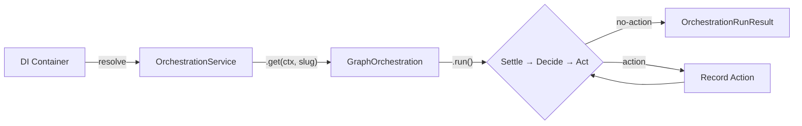
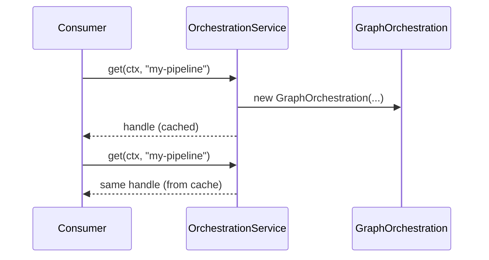
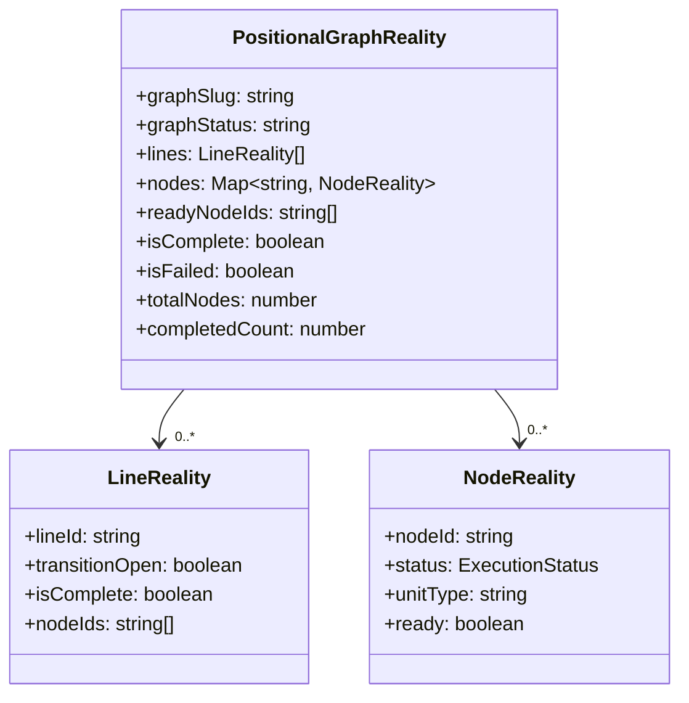
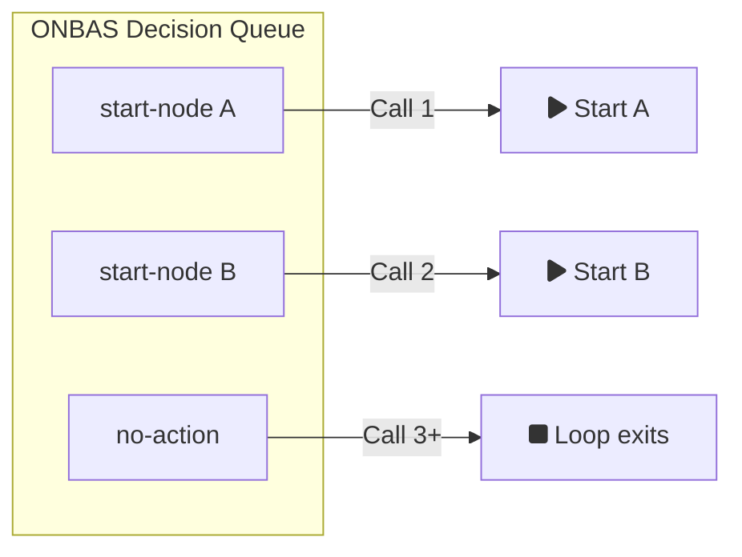
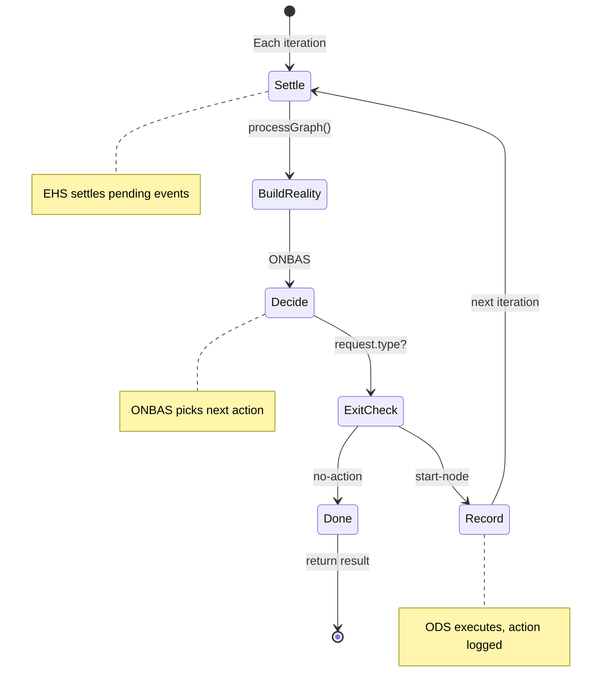
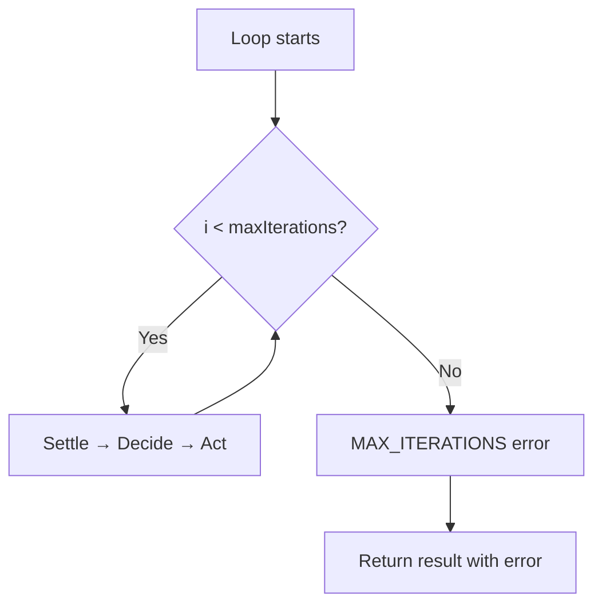
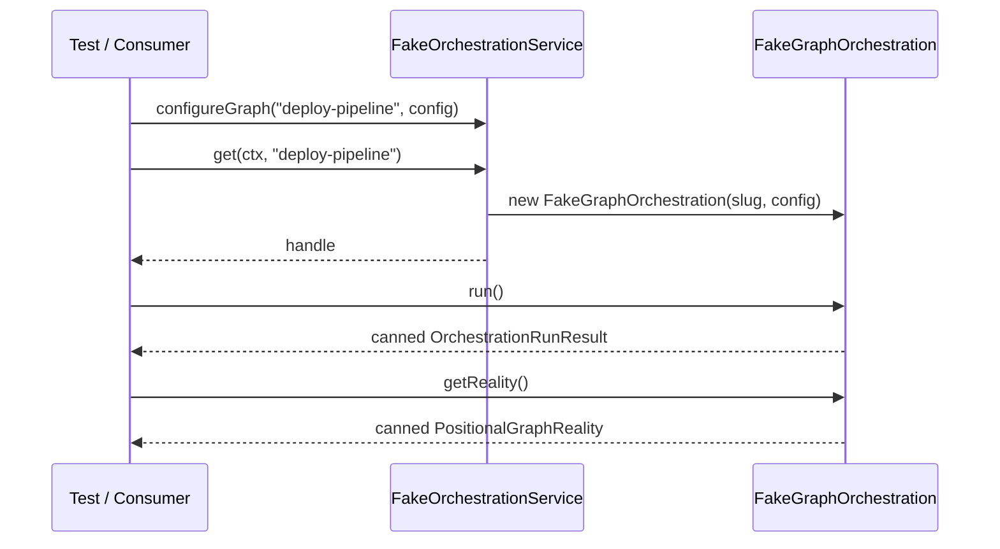

# Worked Example Walkthrough: Orchestration Entry Point

> **Script**: [`worked-example.ts`](./worked-example.ts)
> **Run**: `npx tsx docs/plans/030-positional-orchestrator/tasks/phase-7-orchestration-entry-point/examples/worked-example.ts`
> **Phase**: Phase 7: Orchestration Entry Point

## What This Demonstrates

Phase 7 composes six internal collaborators (EHS, Reality Builder, ONBAS, ODS, PodManager, AgentContextService) into a unified developer-facing facade. A consumer resolves one DI token, calls `.get(ctx, slug)`, and calls `.run()` to advance orchestration. This walkthrough shows the two-level pattern, the loop mechanics, stop reason propagation, and the safety guard — all using the real fakes from the test suite.

---

## High-Level Flow

---

## Section-by-Section

### 1. The Two-Level Pattern: Service → Handle

OrchestrationService is a singleton registered in the DI container. When you call `get(ctx, graphSlug)`, it creates a `GraphOrchestration` handle for that graph and caches it. Subsequent calls with the same slug return the exact same handle object — this prevents duplicate wiring and ensures per-graph state is shared.

**What to watch in output**: Both `handle1` and `handle2` have the same `graphSlug`, and the `Same handle (cached)?` line shows `true`.

---

### 2. Building a Reality Snapshot

Before the loop can make decisions, it needs a `PositionalGraphReality` — an immutable snapshot of the entire graph's state. The reality contains lines (execution lanes), nodes (work units), questions, and convenience accessors like `readyNodeIds` and `isComplete`. The `buildFakeReality()` helper fills in defaults so tests only specify what matters.

**What to watch in output**: Node `B` appears in `readyNodeIds` (it's the only node with status `ready`), and line-001 is blocked because its `transitionOpen` is `false`.

---

### 3. ONBAS Decision Queue

ONBAS (Observation-based Next Best Action Selector) decides what the orchestrator should do at each step. FakeONBAS holds a FIFO queue of decisions — call 1 gets the first decision, call 2 gets the second, and the last decision repeats indefinitely. This "last repeats" behavior is critical: it means the loop naturally converges once ONBAS says "no-action".

**What to watch in output**: Calls 1 and 2 return `start-node` for nodes A and B. Call 3 returns `no-action`. Call 4 also returns `no-action` — the last repeats.

---

### 4. The Full Loop — Settle → Decide → Act → Record → Repeat

This is the core of Phase 7. `GraphOrchestration.run()` executes a loop:

1. **Settle**: Call `eventHandlerService.processGraph()` to process pending events into state changes
2. **Build**: Construct a fresh `PositionalGraphReality` from the current graph state
3. **Decide**: Ask ONBAS `getNextAction(reality)` for the next move
4. **Exit check**: If ONBAS says `no-action`, stop and return the result
5. **Act**: Hand the request to ODS for execution (fire-and-forget pod creation)
6. **Record**: Save the action with its timestamp
7. **Repeat**

**What to watch in output**: 3 iterations, 2 actions (both `start-node`), and the EHS was called 3 times (once per iteration, including the final one that exits). The ODS was called only 2 times (the exit iteration doesn't reach ODS).

---

### 5. Stop Reason Mapping

ONBAS returns a `NoActionRequest` with a `reason` field drawn from `NoActionReason`: `graph-complete`, `graph-failed`, `all-waiting`, or `transition-blocked`. The loop maps these to three `OrchestrationStopReason` values:

| ONBAS reason | OrchestrationStopReason |
|---|---|
| `graph-complete` | `graph-complete` |
| `graph-failed` | `graph-failed` |
| `all-waiting` | `no-action` |
| `transition-blocked` | `no-action` |

The `no-action` catch-all covers all "nothing to do right now" situations — whether nodes are running, blocked by transitions, or in any other non-terminal state.

**What to watch in output**: Each scenario shows the ONBAS reason mapping to the expected stop reason with a checkmark.

---

### 6. Safety Guard — Max Iteration Protection

If ONBAS has a bug and never returns `no-action`, the loop would spin forever. The `maxIterations` parameter (default 100) prevents this — when the guard triggers, the result includes a `MAX_ITERATIONS` error and a `no-action` stop reason. The actions collected so far are still returned.

**What to watch in output**: With `maxIterations: 3`, the loop runs exactly 3 iterations, takes 3 actions, and returns with a `MAX_ITERATIONS` error code.

---

### 7. FakeOrchestrationService for Downstream Consumers

Downstream code that depends on `IOrchestrationService` doesn't need to know about ONBAS, ODS, or the loop. `FakeOrchestrationService` lets you configure canned run results and reality snapshots per graph slug — just like the other fakes in the codebase (FakeFileSystem, FakeAgentAdapter, etc.).

**What to watch in output**: The fake returns the pre-configured result without any loop execution. The second `run()` call returns the same result — last repeats, just like FakeONBAS.

---

## Key Takeaways

| Concept | Why It Matters |
|---------|---------------|
| Two-level pattern (Service → Handle) | One DI token, cached per-graph handles, clean API surface |
| Settle → Decide → Act loop | Composable iteration over EHS, ONBAS, ODS without caller managing sequencing |
| Stop reason mapping | Simple 3-value API hides ONBAS's richer NoActionReason taxonomy |
| Max iteration guard | Safety net prevents infinite loops from ONBAS bugs |
| Fakes with FIFO queues | "Last repeats" pattern makes loop convergence natural to test |
| Internal collaborators hidden | ONBAS, ODS, PodManager, AgentContextService are wired inside the factory — never exposed via DI |
