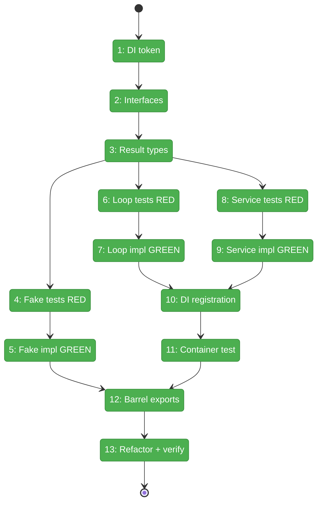
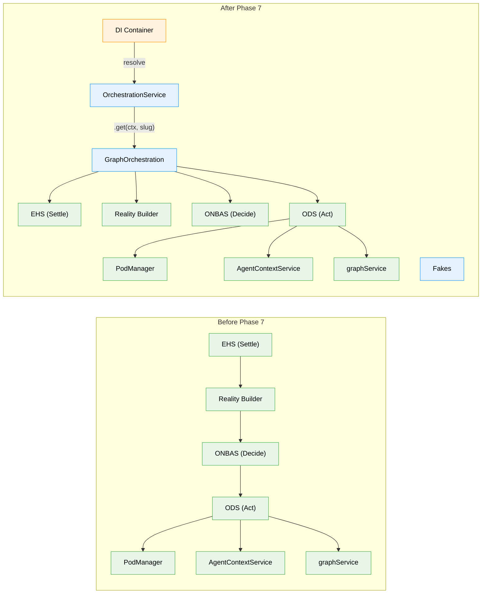

# Flight Plan: Phase 7 — Orchestration Entry Point

**Plan**: [positional-orchestrator-plan.md](../../positional-orchestrator-plan.md)
**Phase**: Phase 7: Orchestration Entry Point
**Generated**: 2026-02-09
**Status**: Landed

---

## Departure -> Destination

**Where we are**: Phases 1-6 delivered six internal collaborators — the reality snapshot model, orchestration request union, agent context service, pod manager with execution pods, the ONBAS decision engine, and the ODS dispatch service. The system can observe a graph's full state, decide which node to start next, and execute that decision by creating a pod and firing it. But there is no unified entry point. A consumer must manually wire ONBAS, ODS, PodManager, AgentContextService, and the reality builder together, knowing their construction order and dependency graph.

**Where we're going**: By the end of this phase, a developer resolves one DI token (`ORCHESTRATION_DI_TOKENS.ORCHESTRATION_SERVICE`), calls `.get(ctx, 'my-pipeline')` to get a per-graph handle, and calls `.run()` to advance orchestration through as many iterations as needed. The handle caches by graph slug, the loop runs in-process (settle events, build reality, ONBAS decides, ODS executes, record action, repeat), and the result tells the caller what happened and why it stopped. A developer can write `const result = await graph.run()` and get back actions taken, stop reason, and final graph state.

---

## Flight Status

<!-- Updated by /plan-6: pending -> active -> done. Use blocked for problems/input needed. -->

**Legend**: grey = pending | yellow = active | red = blocked/needs input | green = done

---

## Stages

<!-- Updated by /plan-6 during implementation: [ ] -> [~] -> [x] -->

- [x] **Stage 1: Add DI token** — add `ORCHESTRATION_DI_TOKENS` to shared di-tokens (`di-tokens.ts`)
- [x] **Stage 2: Define interfaces** — `IOrchestrationService` and `IGraphOrchestration` with `get()`, `run()`, `getReality()` (`orchestration-service.types.ts` — new file)
- [x] **Stage 3: Define result types** — `OrchestrationRunResult`, `OrchestrationAction`, `OrchestrationStopReason` (`orchestration-service.types.ts`)
- [x] **Stage 4: Write fake tests (RED)** — prove `FakeOrchestrationService` and `FakeGraphOrchestration` behaviors (`fake-orchestration-service.test.ts` — new file)
- [x] **Stage 5: Implement fakes (GREEN)** — `FakeOrchestrationService` + `FakeGraphOrchestration` with queued results and history (`fake-orchestration-service.ts` — new file)
- [x] **Stage 6: Write loop tests (RED)** — all `run()` scenarios: single/multi iteration, stop reasons, max iteration guard (`graph-orchestration.test.ts` — new file)
- [x] **Stage 7: Implement loop (GREEN)** — `GraphOrchestration.run()`: settle events -> reality -> ONBAS -> exit check -> ODS -> record -> repeat (`graph-orchestration.ts` — new file)
- [x] **Stage 8: Write service tests (RED)** — handle caching: same slug returns same handle, different slug returns different (`orchestration-service.test.ts` — new file)
- [x] **Stage 9: Implement service (GREEN)** — `OrchestrationService.get()` with `Map<string, IGraphOrchestration>` registry (`orchestration-service.ts` — new file)
- [x] **Stage 10: DI registration** — `registerOrchestrationServices()` wiring all deps via `useFactory` (`container.ts`)
- [x] **Stage 11: Container integration test** — resolve service, get handle, run loop end-to-end with fakes (`container-orchestration.test.ts` — new file)
- [x] **Stage 12: Barrel exports** — add all Phase 7 types, classes, and fakes to barrel index (`index.ts`)
- [x] **Stage 13: Refactor and verify** — `just fft` clean across all Phase 7 files

---

## Architecture: Before & After

**Legend**: existing (green, unchanged) | changed (orange, modified) | new (blue, created)

---

## Acceptance Criteria

- [ ] Two-level pattern: `IOrchestrationService` (singleton) resolves from DI, `.get(ctx, slug)` returns `IGraphOrchestration` (per-graph handle) with caching (AC-10)
- [ ] Orchestration loop runs in-process: settle events then multiple iterations per `run()`, stops on `no-action`, `graph-complete`, or `graph-failed` (AC-11)
- [ ] `FakeOrchestrationService` and `FakeGraphOrchestration` enable downstream testing without real collaborators (AC-10)
- [ ] Internal collaborators (ONBAS, ODS, PodManager, AgentContextService) are hidden behind the facade (AC-10)
- [ ] Input wiring flows from reality through ONBAS decision to ODS execution to pod (AC-14, orchestrates existing flow)
- [ ] `just fft` clean

## Goals & Non-Goals

**Goals**:
- Define `IOrchestrationService` and `IGraphOrchestration` interfaces per Workshop #7
- Define `OrchestrationRunResult`, `OrchestrationAction`, `OrchestrationStopReason` types
- Implement the orchestration loop: settle events (EHS) -> build reality -> ONBAS -> exit check -> ODS -> record -> repeat
- Implement handle caching (same `graphSlug` returns same handle within process lifetime)
- Add `ORCHESTRATION_DI_TOKENS.ORCHESTRATION_SERVICE` to `di-tokens.ts`
- Add `registerOrchestrationServices()` to `container.ts`
- Create `FakeOrchestrationService` and `FakeGraphOrchestration` with test helpers
- Achieve `just fft` clean

**Non-Goals**:
- Web server or CLI orchestration wiring (out of scope for entire plan)
- Real agent integration (fake agents only throughout this plan)
- `ICentralEventNotifier` domain event emission from the loop (deferred per Workshop 12)
- `handleResumeNode` or `handleQuestionPending` implementation (dead code per Workshop 11/12)
- `IEventHandlerService` implementation (delivered by Plan 032, used as-is)
- E2E testing (Phase 8)
- Performance optimization of the loop

---

## Checklist

- [x] T001: Add `ORCHESTRATION_DI_TOKENS` to di-tokens.ts (CS-1)
- [x] T002: Define `IOrchestrationService` and `IGraphOrchestration` interfaces (CS-2)
- [x] T003: Define `OrchestrationRunResult`, `OrchestrationAction`, `OrchestrationStopReason` types (CS-2)
- [x] T004: Write tests for fakes — RED (CS-2)
- [x] T005: Implement `FakeOrchestrationService` and `FakeGraphOrchestration` — GREEN (CS-2)
- [x] T006: Write tests for `GraphOrchestration.run()` loop — RED (CS-3)
- [x] T007: Implement `GraphOrchestration.run()` loop — GREEN (CS-3)
- [x] T008: Write tests for `OrchestrationService.get()` caching — RED (CS-2)
- [x] T009: Implement `OrchestrationService.get()` with handle caching — GREEN (CS-2)
- [x] T010: Add `registerOrchestrationServices()` to container (CS-2)
- [x] T011: Write container integration test (CS-2)
- [x] T012: Update barrel index with Phase 7 exports (CS-1)
- [x] T013: Refactor and verify `just fft` clean (CS-1)

---

## PlanPak

Active — files organized under `packages/positional-graph/src/features/030-orchestration/`.
