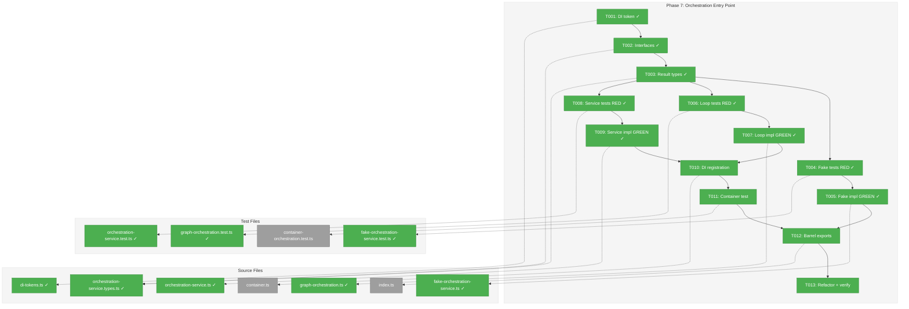
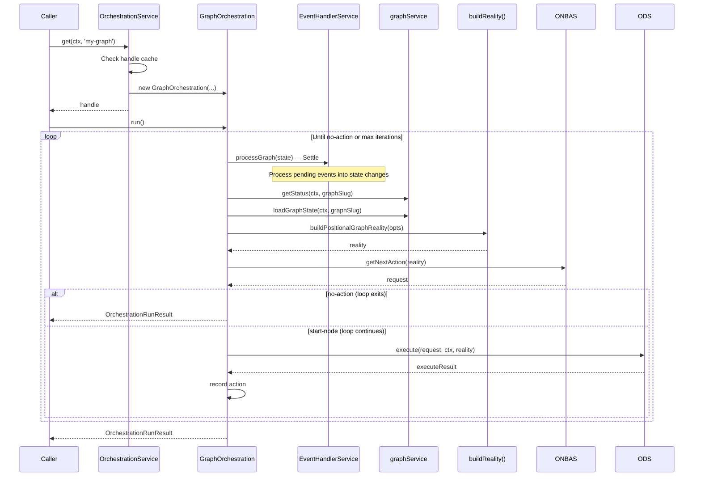

# Phase 7: Orchestration Entry Point – Tasks & Alignment Brief

**Spec**: [positional-orchestrator-spec.md](../../positional-orchestrator-spec.md)
**Plan**: [positional-orchestrator-plan.md](../../positional-orchestrator-plan.md)
**Date**: 2026-02-09

## Executive Briefing

### Purpose
This phase composes all six internal collaborators from Phases 1-6 into a single developer-facing facade — the orchestration entry point. Without this, consumers must manually wire ONBAS, ODS, PodManager, AgentContextService, and the reality builder themselves. After this phase, a developer resolves one service, gets one object, calls one method.

### What We're Building
A two-level orchestration entry point:
- **`IOrchestrationService`** — DI-registered singleton factory. Resolves from the container.
- **`IGraphOrchestration`** — Per-graph handle with identity. Carries `graphSlug`, exposes `run()` (advance orchestration) and `getReality()` (read-only state).
- The `run()` loop: **settle events** → build reality → ONBAS decides → check exit → ODS executes → record action → repeat.
- `FakeOrchestrationService` and `FakeGraphOrchestration` for downstream testing.
- DI registration via `registerOrchestrationServices()` per ADR-0009.

### User Value
A web page server action or CLI command resolves the service, calls `.get(ctx, graphSlug)` to get a handle, then calls `.run()` or `.getReality()`. No knowledge of ONBAS, ODS, PodManager, or AgentContextService required.

### Example
```typescript
const service = container.resolve<IOrchestrationService>(
  ORCHESTRATION_DI_TOKENS.ORCHESTRATION_SERVICE
);
const graph = await service.get(ctx, 'my-pipeline');
const result = await graph.run();
// result.actions       — what happened (OrchestrationAction[])
// result.stopReason    — why we stopped ('no-action' | 'graph-complete' | 'graph-failed')
// result.finalReality  — graph state after all actions
```

---

## Objectives & Scope

### Objective
Create the two-level entry point (singleton service + per-graph handle) that composes all internal collaborators into a single developer UX, satisfying AC-10 and AC-11.

### Goals

- ✅ Define `IOrchestrationService` and `IGraphOrchestration` interfaces per Workshop #7
- ✅ Define `OrchestrationRunResult`, `OrchestrationAction`, `OrchestrationStopReason` types
- ✅ Implement the orchestration loop: settle events (EHS) → build reality → ONBAS → exit check → ODS → record → repeat
- ✅ Implement handle caching (same `graphSlug` returns same handle within process lifetime)
- ✅ Add `ORCHESTRATION_DI_TOKENS.ORCHESTRATION_SERVICE` to `packages/shared/src/di-tokens.ts`
- ✅ Add `registerOrchestrationServices()` to `packages/positional-graph/src/container.ts`
- ✅ Create `FakeOrchestrationService` and `FakeGraphOrchestration` with test helpers
- ✅ Achieve `just fft` clean

### Non-Goals

- ❌ Web server or CLI orchestration wiring (out of scope for entire plan)
- ❌ Real agent integration (fake agents only throughout this plan)
- ❌ `ICentralEventNotifier` domain event emission from the loop (deferred per Workshop 12)
- ❌ `handleResumeNode` or `handleQuestionPending` implementation (dead code per Workshop 11/12)
- ❌ `question-pending` as an `OrchestrationStopReason` (dead code — ONBAS never produces it after Workshop 11/12 alignment)
- ❌ `IEventHandlerService` implementation (delivered by Plan 032, used as-is)
- ❌ E2E testing (Phase 8)
- ❌ `pendingQuestion` gap fix in `getNodeStatus()` (deferred to Phase 8 prerequisites)
- ❌ Performance optimization of the loop (single-process, synchronous iteration is sufficient)

---

## Pre-Implementation Audit

### Summary
| File | Action | Origin | Modified By | Recommendation |
|------|--------|--------|-------------|----------------|
| `orchestration-service.types.ts` | Created | — | — | keep-as-is |
| `orchestration-service.ts` | Created | — | — | keep-as-is |
| `graph-orchestration.ts` | Created | — | — | keep-as-is |
| `fake-orchestration-service.ts` | Created | — | — | keep-as-is |
| `orchestration-service.test.ts` | Created | — | — | keep-as-is |
| `graph-orchestration.test.ts` | Created | — | — | keep-as-is |
| `fake-orchestration-service.test.ts` | Created | — | — | keep-as-is |
| `container-orchestration.test.ts` | Created | — | — | keep-as-is |
| `di-tokens.ts` | Modified | Plan 007/010/011/012 | Plans 026, 027, 029 | cross-plan-edit |
| `container.ts` | Modified | Plan 026 | Plan 029 | keep-as-is |
| `index.ts` (030-orchestration barrel) | Modified | Plan 030 Phase 1 | Plan 030 Phases 2-6 | keep-as-is |

### Compliance Check
No violations found. All files follow naming conventions (kebab-case, `I` prefix, `Fake` prefix), ADR-0004 (useFactory), ADR-0009 (module registration), and PlanPak placement in `features/030-orchestration/`.

---

## Requirements Traceability

### Coverage Matrix
| AC | Description | Flow Summary | Files in Flow | Tasks | Status |
|----|-------------|-------------|---------------|-------|--------|
| AC-10 | Two-level pattern: service → handle | di-tokens → container → service.get() → handle | 10 | T001-T005,T008-T010,T012,T013 | ✅ Complete |
| AC-11 | Orchestration loop in-process | handle.run() → EHS settle → reality → ONBAS → ODS → repeat | 5 | T003,T006,T007,T011,T013 | ✅ Complete |
| AC-14 | Input wiring flows through | reality.inputPack → ONBAS → ODS → pod (Phases 1-6) | 1 (implicit) | T007 | ✅ Complete (orchestrates existing flow) |

### Gaps Found
No gaps — all acceptance criteria have complete file coverage in the task table.

### Orphan Files
All task table files map to at least one acceptance criterion.

---

## Architecture Map

### Component Diagram
<!-- Status: grey=pending, orange=in-progress, green=completed, red=blocked -->
<!-- Updated by plan-6 during implementation -->



### Task-to-Component Mapping

<!-- Status: ⬜ Pending | 🟧 In Progress | ✅ Complete | 🔴 Blocked -->

| Task | Component(s) | Files | Status | Comment |
|------|-------------|-------|--------|---------|
| T001 | DI Tokens | di-tokens.ts | ✅ Complete | Cross-cutting; must complete first |
| T002 | Service + Handle interfaces | orchestration-service.types.ts | ✅ Complete | IOrchestrationService, IGraphOrchestration |
| T003 | Result types | orchestration-service.types.ts | ✅ Complete | OrchestrationRunResult, Action, StopReason |
| T004 | Fake tests | fake-orchestration-service.test.ts | ✅ Complete | RED: prove fake behaviors |
| T005 | Fake implementation | fake-orchestration-service.ts | ✅ Complete | GREEN: FakeOrchestrationService + FakeGraphOrchestration |
| T006 | Loop tests | graph-orchestration.test.ts | ✅ Complete | RED: run() loop scenarios |
| T007 | Loop implementation | graph-orchestration.ts | ✅ Complete | GREEN: GraphOrchestration.run() loop |
| T008 | Service tests | orchestration-service.test.ts | ✅ Complete | RED: get() caching scenarios |
| T009 | Service implementation | orchestration-service.ts | ✅ Complete | GREEN: OrchestrationService.get() + caching |
| T010 | DI Registration | container.ts | ✅ Complete | registerOrchestrationServices() |
| T011 | Container test | container-orchestration.test.ts | ✅ Complete | Integration: resolve → get → run |
| T012 | Barrel exports | index.ts | ✅ Complete | Add Phase 7 exports |
| T013 | Refactor + verify | all files | ✅ Complete | `just fft` clean |

---

## Tasks

| Status | ID | Task | CS | Type | Dependencies | Absolute Path(s) | Validation | Subtasks | Notes |
|--------|------|------|-----|------|-------------|-------------------|-----------|----------|-------|
| [x] | T001 | Add `ORCHESTRATION_DI_TOKENS` to di-tokens.ts | 1 | Setup | – | `/home/jak/substrate/030-positional-orchestrator/packages/shared/src/di-tokens.ts` | Token exists, exports correctly, value is `'IOrchestrationService'` per ADR-0004 IMP-006 | – | Cross-cutting; **must complete before T002-T013**. Per Finding #11, ADR-0009 |
| [x] | T002 | Define `IOrchestrationService` and `IGraphOrchestration` interfaces | 2 | Core | T001 | `/home/jak/substrate/030-positional-orchestrator/packages/positional-graph/src/features/030-orchestration/orchestration-service.types.ts` | Interfaces compile; `get(ctx, graphSlug)` returns `Promise<IGraphOrchestration>`; handle has `run()`, `getReality()`, `graphSlug` | – | Per Workshop #7, plan-scoped |
| [x] | T003 | Define `OrchestrationRunResult`, `OrchestrationAction`, `OrchestrationStopReason` types | 2 | Core | T001 | `/home/jak/substrate/030-positional-orchestrator/packages/positional-graph/src/features/030-orchestration/orchestration-service.types.ts` | Types compile; `OrchestrationRunResult extends BaseResult`; stop reason covers 3 values (`no-action`, `graph-complete`, `graph-failed`); `OrchestrationAction` carries request + result + timestamp | – | Per Workshop #7, plan-scoped |
| [x] | T004 | Write tests for `FakeOrchestrationService` and `FakeGraphOrchestration` — RED | 2 | Test | T002, T003 | `/home/jak/substrate/030-positional-orchestrator/test/unit/positional-graph/features/030-orchestration/fake-orchestration-service.test.ts` | Tests prove: `configureGraph()`, `run()` returns queued results, `getReality()` returns configured state, `getGetHistory()` tracked, unconfigured graph throws, `reset()` clears state | – | plan-scoped |
| [x] | T005 | Implement `FakeOrchestrationService` and `FakeGraphOrchestration` — GREEN | 2 | Core | T004 | `/home/jak/substrate/030-positional-orchestrator/packages/positional-graph/src/features/030-orchestration/fake-orchestration-service.ts` | All T004 tests pass | – | Per Workshop #7 fake design, plan-scoped |
| [x] | T006 | Write tests for `IGraphOrchestration.run()` loop — RED | 3 | Test | T002, T003 | `/home/jak/substrate/030-positional-orchestrator/test/unit/positional-graph/features/030-orchestration/graph-orchestration.test.ts` | Tests cover: single iteration (start 1 node), multi-iteration (start 2 nodes in one pass), stops on no-action, stops on graph-complete, stops on graph-failed, NoActionReason→StopReason mapping (all-running→no-action, graph-complete→graph-complete, graph-failed→graph-failed), max iteration guard, records actions with timestamps, EHS settle called each iteration, `getReality()` returns fresh snapshot | – | Uses FakeONBAS + FakeODS + FakePodManager, plan-scoped |
| [x] | T007 | Implement `GraphOrchestration.run()` loop — GREEN | 3 | Core | T006 | `/home/jak/substrate/030-positional-orchestrator/packages/positional-graph/src/features/030-orchestration/graph-orchestration.ts` | All T006 tests pass; loop: EHS settle → build reality → ONBAS → exit check → ODS → record → repeat | – | Fire-and-forget; max iterations default 100, plan-scoped. EHS.processGraph() called at start of each iteration (Settle step per Workshop 12). Exit condition maps `NoActionReason` → `OrchestrationStopReason`: `graph-complete`→`graph-complete`, `graph-failed`→`graph-failed`, all others→`no-action`. |
| [x] | T008 | Write tests for `IOrchestrationService.get()` handle caching — RED | 2 | Test | T002 | `/home/jak/substrate/030-positional-orchestrator/test/unit/positional-graph/features/030-orchestration/orchestration-service.test.ts` | Tests prove: same slug returns same handle, different slug returns different handles, handle has correct graphSlug | – | Per Finding #10, plan-scoped |
| [x] | T009 | Implement `OrchestrationService.get()` with handle caching — GREEN | 2 | Core | T008, T007 | `/home/jak/substrate/030-positional-orchestrator/packages/positional-graph/src/features/030-orchestration/orchestration-service.ts` | All T008 tests pass; `Map<string, IGraphOrchestration>` registry | – | Constructor takes graphService + agentAdapter + scriptRunner, plan-scoped |
| [x] | T010 | Add `registerOrchestrationServices()` to container — GREEN | 2 | Core | T007, T009 | `/home/jak/substrate/030-positional-orchestrator/packages/positional-graph/src/container.ts` | DI registration resolves `IOrchestrationService` correctly; uses `useFactory`; all deps resolved from container (graphService, agentAdapter, scriptRunner, eventHandlerService); prerequisite tokens documented in JSDoc | – | Per ADR-0009, Finding #09. **Workshop #7 constructor signature is outdated** — trust ODSDependencies (Phase 6) and EHS (Plan 032) as source of truth, not Workshop examples. cross-cutting |
| [x] | T011 | Write container integration test | 2 | Test | T010 | `/home/jak/substrate/030-positional-orchestrator/test/unit/positional-graph/features/030-orchestration/container-orchestration.test.ts` | Container resolves service; `.get()` returns handle with correct graphSlug; `.run()` returns OrchestrationRunResult | – | Uses real container with fakes for adapters/filesystem, plan-scoped |
| [x] | T012 | Update barrel index with Phase 7 exports | 1 | Setup | T005, T011 | `/home/jak/substrate/030-positional-orchestrator/packages/positional-graph/src/features/030-orchestration/index.ts` | All Phase 7 types, classes, and fakes exported; tsc clean | – | plan-scoped |
| [x] | T013 | Refactor and verify | 1 | Setup | T012 | All Phase 7 files | `just fft` clean | – | – |

---

## Alignment Brief

### Prior Phases Review

#### Phase-by-Phase Summary

**Phase 1 (PositionalGraphReality Snapshot)**: Built the immutable snapshot model. Key deliverables: `buildPositionalGraphReality()` pure function, `PositionalGraphRealityView` with 11 lookup methods, 8 types (NodeReality, LineReality, QuestionReality, ExecutionStatus, etc.), 47 tests. Key discoveries: Workshop pseudocode `inferUnitType()` doesn't exist (DYK-I1), `currentLineIndex` returns `lines.length` as past-the-end sentinel when all lines complete (DYK-I3), top-level Zod schema impossible due to ReadonlyMap (DYK-I4).

**Phase 2 (OrchestrationRequest Discriminated Union)**: Defined the ONBAS→ODS contract. Key deliverables: 4-variant discriminated union (`start-node`, `resume-node`, `question-pending`, `no-action`), `NoActionReason` (4 values), type guards, `OrchestrationExecuteResult`, 37 tests. Key discovery: Zod-first split pattern — `.schema.ts` for Zod-derived types, `.types.ts` for non-schema types (DYK-I6).

**Phase 3 (AgentContextService)**: Implemented context inheritance rules. Key deliverables: `getContextSource()` pure function + `AgentContextService` class wrapper, 3-variant `ContextSourceResult` union (`inherit`/`new`/`not-applicable`), `FakeAgentContextService`, 14 tests. Established bare function + thin class wrapper pattern (DYK-I9). Deferred: `noContext` field on NodeReality is dead code until schema extension.

**Phase 4 (WorkUnitPods + PodManager)**: Built execution containers. Key deliverables: `AgentPod`, `CodePod`, `PodManager` (real + fake), `IScriptRunner` + `FakeScriptRunner`, `PodCreateParams` discriminated union, 53 tests. Critical discovery: `PodCreateParams` must carry adapter/runner explicitly (DYK-P4#4) — PodManager doesn't resolve adapters, ODS does. Contract tests prove fake/real parity.

**Phase 5 (ONBAS Walk Algorithm)**: Implemented the decision engine. Key deliverables: `walkForNextAction()` pure function + `ONBAS` class wrapper, `FakeONBAS`, `buildFakeReality()` test helper (reused in all subsequent phases), 45 tests (later reduced to 39 in Phase 6). Key fact: ONBAS in practice only produces `start-node` and `no-action` — question-related paths are dead code.

**Phase 6 (ODS Action Handlers)**: Built the executor. Key deliverables: `ODS` dispatch table with `handleStartNode()`, `FakeODS`, 12 tests. Prerequisites: Subtask 001 (concept drift remediation) established two-domain boundary (event handlers record, ONBAS decides, ODS acts) and added `node:restart` event. Critical discovery: ODSDependencies needs 5 deps not 3 (DYK from execution log). Workshop 12 superseded Workshop 08 entirely — fire-and-forget model replaced blocking model.

#### Cumulative Deliverables Available to Phase 7

| Component | Phase | Key Signature | Used By Phase 7 |
|-----------|-------|---------------|-----------------|
| `buildPositionalGraphReality(options)` | 1 | `(BuildRealityOptions) → PositionalGraphReality` | Loop: start of each iteration |
| `PositionalGraphRealityView` | 1 | 11 lookup methods | Via AgentContextService |
| `OrchestrationRequest` union | 2 | 4 variants | Loop: ONBAS output, ODS input |
| Type guards | 2 | `isNoActionRequest()`, etc. | Loop: exit condition checks |
| `OrchestrationExecuteResult` | 2 | `{ ok, error?, request }` | Loop: action recording |
| `getContextSource()` / `AgentContextService` | 3 | `(reality, nodeId) → ContextSourceResult` | Wired into ODS deps |
| `PodManager` / `FakePodManager` | 4 | `IPodManager` (8 methods) | Per-graph handle creation |
| `PodCreateParams` | 4 | Discriminated union on unitType | ODS construction |
| `walkForNextAction()` / `ONBAS` | 5 | `(reality) → OrchestrationRequest` | Loop: decide step |
| `FakeONBAS` | 5 | Configurable return values | Loop tests |
| `buildFakeReality(options)` | 5 | Constructs test fixtures | All Phase 7 tests |
| `ODS` / `FakeODS` | 6 | `execute(request, ctx, reality) → Promise<Result>` | Loop: act step |
| `ODSDependencies` | 6 | 5 deps: graphService, podManager, contextService, agentAdapter, scriptRunner | ODS construction |

#### Cross-Phase Architectural Patterns

1. **Pure function + thin class wrapper**: Phases 1, 3, 5 all follow this. Phase 7's `GraphOrchestration` is the first component with real state (handle caching, PodManager instance).
2. **Zod-first type derivation**: Established in Phase 1, continued in Phase 2. Phase 7 result types (`OrchestrationRunResult`) extend `BaseResult` from `@chainglass/shared` rather than using Zod — consistent with `OrchestrationExecuteResult` from Phase 2.
3. **Fire-and-forget execution**: ODS calls `pod.execute()` without await (Phase 6). Phase 7's loop discovers results via reality rebuild on next iteration.
4. **Two-domain boundary**: Event Domain (handlers record/stamp) vs Graph Domain (ONBAS decides, ODS acts). Phase 7 orchestrates this boundary.
5. **Fakes over mocks**: Every interface has a `FakeXxx` test double. No `vi.mock` ever.

#### Reusable Test Infrastructure

- `buildFakeReality(options)` — Phase 5, exported from barrel
- `FakeONBAS` — Phase 5, configurable return values + call history
- `FakeODS` — Phase 6, configurable results + call history
- `FakePodManager` + `FakePod` — Phase 4, configurable pod behaviors
- `FakeAgentContextService` — Phase 3, configurable overrides
- `FakeAgentAdapter` — `@chainglass/shared`, pre-existing
- `FakeScriptRunner` — Phase 4
- `makeNodeStatus()`, `makeLineStatus()`, `makeGraphStatus()` — Phase 1 test fixtures

### Critical Findings Affecting This Phase

| Finding | Impact | Tasks |
|---------|--------|-------|
| #09: ICentralEventNotifier token is `WORKSPACE_DI_TOKENS.CENTRAL_EVENT_NOTIFIER` | Use correct token in registration; Workshop #7 example uses wrong token | T010 |
| #10: Handle caching by slug | `Map<string, IGraphOrchestration>` in service; same slug returns same handle | T008, T009 |
| #11: Module registration follows ADR-0009 | Export `registerOrchestrationServices()` function | T010 |

### ADR Decision Constraints

- **ADR-0004** (Decorator-Free DI): All DI registration uses `useFactory` pattern. No `@injectable()`. Constrains: T010. Addressed by: T010.
- **ADR-0009** (Module Registration Function): `registerOrchestrationServices(container)` exported from container.ts. Prerequisite tokens documented in JSDoc. Constrains: T010. Addressed by: T010.
- **ADR-0010** (Central Event Notification): Token location is `WORKSPACE_DI_TOKENS.CENTRAL_EVENT_NOTIFIER`. Constrains: T010 (registration). Addressed by: T010.

### PlanPak Placement Rules

- Plan-scoped files → `features/030-orchestration/` (flat, descriptive names)
- Cross-cutting files → traditional shared location (`di-tokens.ts`, `container.ts`)
- Test location: `test/unit/positional-graph/features/030-orchestration/`

### Invariants & Guardrails

- Max iteration ceiling: default 100, configurable. Prevents infinite loops if ONBAS has a bug.
- Handle caching: same `graphSlug` → same `IGraphOrchestration` within process lifetime.
- Internal collaborators private: ONBAS, ODS, PodManager, AgentContextService never exposed to consumers.
- `OrchestrationRunResult extends BaseResult` (from `@chainglass/shared`).

### Visual Alignment: Flow Diagram

```mermaid
flowchart LR
    subgraph Entry["Entry Point"]
        Container["DI Container"]
        Service["IOrchestrationService"]
        Handle["IGraphOrchestration"]
    end

    subgraph Loop["run() Loop"]
        Reality["Build Reality"]
        ONBAS["ONBAS: Decide"]
        ExitCheck{"Exit?"}
        ODS["ODS: Execute"]
        Record["Record Action"]
    end

    Container -->|resolve| Service
    Service -->|.get(ctx, slug)| Handle
    Handle -->|.run()| Settle["EHS: Settle Events"]
    Settle --> Reality
    Reality --> ONBAS
    ONBAS --> ExitCheck
    ExitCheck -->|no-action| Return["Return Result"]
    ExitCheck -->|start-node| ODS
    ODS --> Record
    Record -->|loop back| Reality
```

### Visual Alignment: Sequence Diagram



### Test Plan (Full TDD)

| Test | Rationale | Fixture | Expected |
|------|-----------|---------|----------|
| Fake: `configureGraph()` + `.get()` returns configured handle | Prove fake setup pattern | Pre-built `FakeGraphConfig` with runResults + reality | Handle has correct graphSlug |
| Fake: `.run()` returns queued results in order | Prove result queuing | 3 queued `OrchestrationRunResult` values | Results returned in FIFO order |
| Fake: `.getReality()` returns configured reality | Prove snapshot passthrough | `buildFakeReality()` fixture | Exact match |
| Fake: `getGetHistory()` tracks calls | Prove call tracking | Two `.get()` calls | History length 2, slugs match |
| Fake: unconfigured graph throws | Prove defensive behavior | No config for slug | Error thrown |
| Loop: single iteration start-node | Prove basic loop | FakeONBAS returns start-node then no-action | 1 action, stopReason 'no-action' |
| Loop: multi-iteration (2 nodes) | Prove loop continues | FakeONBAS returns start-node, start-node, no-action | 2 actions |
| Loop: stops on no-action | Prove exit condition | FakeONBAS returns no-action immediately | 0 actions, stopReason maps to reason |
| Loop: stops on graph-complete | Prove stop reason mapping | FakeONBAS returns no-action with reason 'graph-complete' | stopReason 'graph-complete' |
| Loop: stops on graph-failed | Prove stop reason mapping | FakeONBAS returns no-action with reason 'graph-failed' | stopReason 'graph-failed' |
| Loop: all-running maps to no-action | Prove non-terminal reasons stay generic | FakeONBAS returns no-action with reason 'all-running' | stopReason 'no-action' |
| Loop: max iteration guard | Prove safety ceiling | FakeONBAS always returns start-node | Stops at 100 (or configured max) |
| Loop: actions have timestamps | Prove recording | FakeONBAS returns start-node | action.timestamp is ISO 8601 |
| Loop: getReality() returns fresh snapshot | Prove read-only path | Configure graphService | Returns PositionalGraphReality |
| Service: same slug returns same handle | Prove caching | Two `.get()` calls, same slug | Same object reference |
| Service: different slug returns different handle | Prove isolation | Two `.get()` calls, different slugs | Different object references |
| Container: resolve → get → run works | Prove DI wiring | Real container + fakes | OrchestrationRunResult returned |

### Implementation Outline

1. **T001**: Add `ORCHESTRATION_DI_TOKENS = { ORCHESTRATION_SERVICE: 'IOrchestrationService' } as const` to `di-tokens.ts` alongside existing token groups.
2. **T002**: Create `orchestration-service.types.ts`. Define `IOrchestrationService` with `get(ctx, graphSlug): Promise<IGraphOrchestration>`. Define `IGraphOrchestration` with `graphSlug`, `run()`, `getReality()`.
3. **T003**: In same file, define `OrchestrationRunResult extends BaseResult`, `OrchestrationStopReason` (3-value union: `no-action`, `graph-complete`, `graph-failed`), `OrchestrationAction` (request + result + timestamp), `FakeGraphConfig`.
4. **T004**: Write RED tests for `FakeOrchestrationService` and `FakeGraphOrchestration` per Workshop #7 fake design.
5. **T005**: Implement fakes in `fake-orchestration-service.ts`. All T004 tests GREEN.
6. **T006**: Write RED tests for `GraphOrchestration.run()` loop using FakeONBAS + FakeODS. Cover all scenarios from test plan.
7. **T007**: Implement `GraphOrchestration` in `graph-orchestration.ts`. Constructor takes all internal deps including `IEventHandlerService`. `run()` implements the loop: EHS settle → build reality → ONBAS → exit check → ODS → record → repeat. `getReality()` builds and returns snapshot. All T006 tests GREEN.
8. **T008**: Write RED tests for `OrchestrationService.get()` caching.
9. **T009**: Implement `OrchestrationService` in `orchestration-service.ts`. `Map<string, IGraphOrchestration>` handle registry. `get()` creates or returns cached handle. Constructor takes all deps resolved from DI (not manually constructed). All T008 tests GREEN.
10. **T010**: Add `registerOrchestrationServices(container)` to `container.ts`. `useFactory` resolves all deps from container: `IPositionalGraphService`, `IAgentAdapter`, `IScriptRunner`, `IEventHandlerService`. OrchestrationService internally wires ONBAS (no deps), AgentContextService (no deps), ODS (graphService + podManager + contextService + agentAdapter + scriptRunner), PodManager (per-graph). **Workshop #7 constructor signature is outdated** — trust implemented code (ODSDependencies, EHS) as source of truth.
11. **T011**: Write container integration test. Set up full container with fakes, resolve service, call `get()` and `run()`.
12. **T012**: Add Phase 7 exports to `index.ts` barrel.
13. **T013**: Run `just fft`. Fix any lint/format/type issues.

### Commands to Run

```bash
# Run specific test file during development
pnpm test -- test/unit/positional-graph/features/030-orchestration/fake-orchestration-service.test.ts
pnpm test -- test/unit/positional-graph/features/030-orchestration/graph-orchestration.test.ts
pnpm test -- test/unit/positional-graph/features/030-orchestration/orchestration-service.test.ts
pnpm test -- test/unit/positional-graph/features/030-orchestration/container-orchestration.test.ts

# Run all 030-orchestration tests
pnpm test -- test/unit/positional-graph/features/030-orchestration/

# Full quality check before commit
just fft
```

### Risks & Unknowns

| Risk | Severity | Mitigation |
|------|----------|------------|
| `registerOrchestrationServices()` depends on tokens that may not be registered in test containers | Medium | Document prerequisites in JSDoc; integration test verifies full wiring |
| Workshop #7 example uses wrong `ICentralEventNotifier` token (`SHARED_DI_TOKENS.EVENT_NOTIFIER`) | Low | Finding #09 identifies correct token: `WORKSPACE_DI_TOKENS.CENTRAL_EVENT_NOTIFIER` |
| Workshop #7 constructor signature outdated (shows graphService + workUnitService + eventNotifier; real deps are graphService + agentAdapter + scriptRunner + eventHandlerService) | Low | Resolved: all deps via DI useFactory; ODSDependencies (Phase 6) and EHS (Plan 032) are source of truth, not Workshop examples |
| Plan 032 flaky test (`event-id.test.ts` uniqueness) may cause `just fft` failure | Low | Unrelated to Phase 7; retry if flaky test triggers |

### Ready Check

- [ ] ADR constraints mapped to tasks (ADR-0004 → T010, ADR-0009 → T010, ADR-0010 → T010)
- [ ] Critical findings mapped (Finding #09 → T010, #10 → T008/T009, #11 → T010)
- [ ] All prior phase deliverables documented
- [ ] Test plan covers all acceptance criteria
- [ ] Non-goals explicitly stated to prevent scope creep

---

## Phase Footnote Stubs

_Populated by plan-6 during implementation._

| Footnote | Phase | Task | Files |
|----------|-------|------|-------|
| | | | |

---

## Evidence Artifacts

- **Execution log**: `docs/plans/030-positional-orchestrator/tasks/phase-7-orchestration-entry-point/execution.log.md`
- **Worked examples**: `docs/plans/030-positional-orchestrator/tasks/phase-7-orchestration-entry-point/examples/`

---

## Discoveries & Learnings

_Populated during implementation by plan-6. Log anything of interest to your future self._

| Date | Task | Type | Discovery | Resolution | References |
|------|------|------|-----------|------------|------------|
| | | | | | |

**Types**: `gotcha` | `research-needed` | `unexpected-behavior` | `workaround` | `decision` | `debt` | `insight`

**What to log**:
- Things that didn't work as expected
- External research that was required
- Implementation troubles and how they were resolved
- Gotchas and edge cases discovered
- Decisions made during implementation
- Technical debt introduced (and why)
- Insights that future phases should know about

_See also: `execution.log.md` for detailed narrative._

---

## Directory Layout

```
docs/plans/030-positional-orchestrator/
  ├── positional-orchestrator-plan.md
  ├── positional-orchestrator-spec.md
  └── tasks/phase-7-orchestration-entry-point/
      ├── tasks.md              # This file
      ├── tasks.fltplan.md      # Generated by /plan-5b (Flight Plan summary)
      ├── execution.log.md      # Created by /plan-6
      └── examples/             # Worked examples (created by /plan-6b)
```

---

## Critical Insights (2026-02-09)

| # | Insight | Decision |
|---|---------|----------|
| 1 | Loop omitted EHS Settle step — ONBAS would read stale pre-event state | Added EHS.processGraph() as first step in each loop iteration |
| 2 | Workshop #7 DI constructor signature outdated (3 deps vs real 5+) | All deps via DI useFactory; Workshop signatures flagged as unreliable |
| 3 | `question-pending` StopReason is dead code (ONBAS never produces it) | Removed entirely — now 3-value union: no-action, graph-complete, graph-failed |
| 4 | NoActionReason→StopReason mapping was implicit | Added explicit mapping + test: graph-complete/failed promoted, all others→no-action |
| 5 | Handle needs ctx to build reality but run() takes no args | Confirmed: one handle = one graph = one ctx, captured at .get() time |

Action items: None — all changes applied inline to tasks.md
