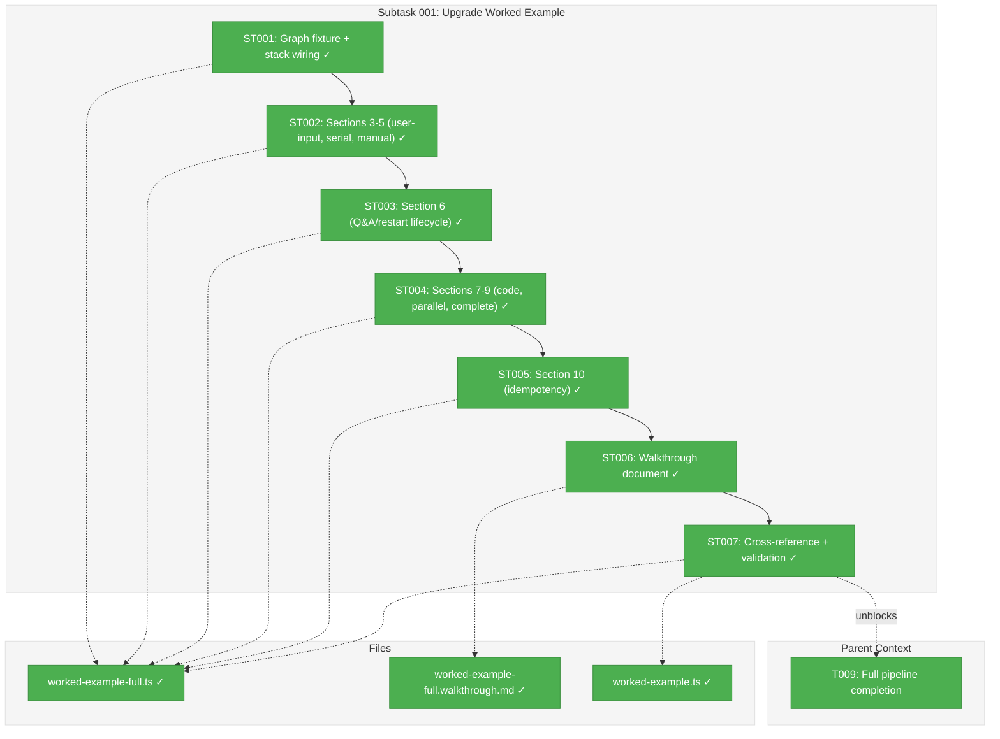
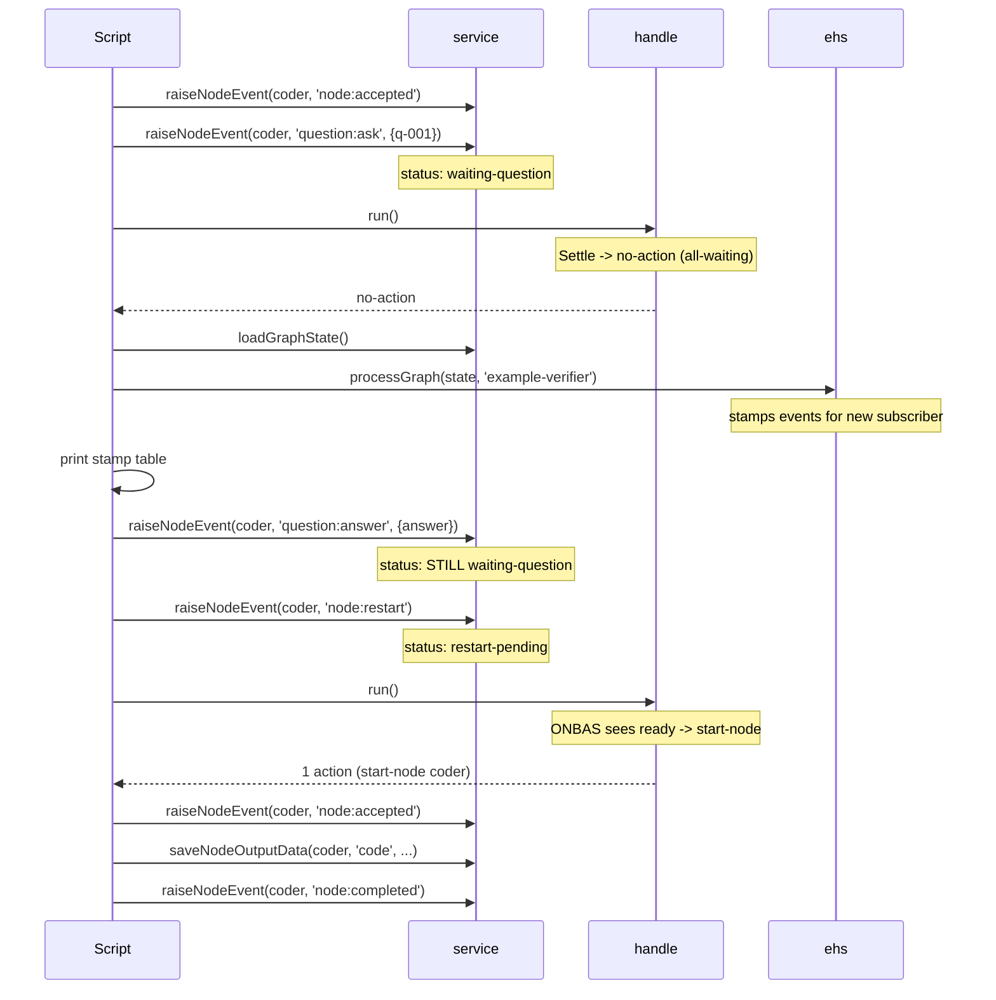

# Subtask 001: Upgrade Worked Example to Cover All Orchestration Patterns

**Spec**: [positional-orchestrator-spec.md](../../positional-orchestrator-spec.md)
**Plan**: [positional-orchestrator-plan.md](../../positional-orchestrator-plan.md)
**Workshop**: [14-worked-example-upgrade.md](../../workshops/14-worked-example-upgrade.md)
**Date**: 2026-02-10

---

## Parent Context

**Parent Plan:** [View Plan](../../positional-orchestrator-plan.md)
**Parent Phase:** Phase 8: E2E and Integration Testing
**Parent Task(s):** [T009: Full pipeline completion](./tasks.md)

**Why This Subtask:**
Workshop 14 gap analysis identified 10 high/medium gaps in the current worked example (`worked-example.ts`): it only demonstrates 2 serial agent nodes (happy path) but omits question/answer/restart lifecycle, parallel execution, manual transitions, user-input/code node types, input wiring, event stamp visibility, and processGraph transparency. This subtask creates a comprehensive companion example (`worked-example-full.ts`) that closes all 10 gaps while preserving the original as a quick-start introduction.

---

## Executive Briefing

### Purpose

The current worked example is a 300-line, 7-section quick-start that demonstrates the settle-decide-act loop with 2 serial agent nodes. It serves as a first introduction but leaves all advanced orchestration patterns undocumented. This subtask creates a comprehensive companion example that exercises every orchestration pattern in-process, serving as the definitive reference for how the system works.

### What We're Building

A `worked-example-full.ts` script (~500-800 lines) with 10 progressive sections that:
- Wires the full orchestration stack (7 collaborators, 2 fakes)
- Creates a 4-line, 8-node graph with 5 input wirings
- Demonstrates user-input nodes, serial agents, manual transitions, question/answer/restart lifecycle, code nodes, parallel execution, and graph completion
- Makes event stamps and processGraph settlement visible via console output
- Includes a companion walkthrough document with Mermaid diagrams

### Unblocks

Closes the 10 high/medium gaps identified in Workshop 14, giving developers a single runnable script that demonstrates every orchestration pattern without needing to read the 1114-line E2E test or build the CLI.

### Example

**Before**: Developer reads `worked-example.ts` and sees 2 nodes, happy path only. Questions about Q&A lifecycle, parallel execution, or manual gates require reading the E2E test source.

**After**: Developer runs `npx tsx worked-example-full.ts` and sees all 10 sections, including event stamp tables and processGraph results, with clear console narration of each pattern.

---

## Objectives & Scope

### Objective

Create `worked-example-full.ts` and `worked-example-full.walkthrough.md` following Workshop 14's design (10 sections, 4 lines, 8 nodes, 5 input wirings) to close all 10 gaps identified in the workshop comparison.

### Goals

- Create `worked-example-full.ts` with Sections 1-10 per Workshop 14
- Create `worked-example-full.walkthrough.md` with architecture, sequence, state machine, and stamp diagrams
- Add cross-reference note to existing `worked-example.ts`
- Verify `npx tsx` runs clean (exit 0)
- Run `just fft` to confirm no regressions

### Non-Goals

- Modifying any production code (this is a documentation/teaching artifact only)
- Adding `node:error` recovery section (OQ-2 left open — E2E test ACT E covers it)
- Adding `progress:update` event (no new pattern taught)
- Replacing the existing simple worked example (it remains as quick-start)
- Adding Vitest wrapper (standalone script, not a test)

---

## Pre-Implementation Audit

### Summary

| File | Action | Origin | Modified By | Recommendation |
|------|--------|--------|-------------|----------------|
| `.../examples/worked-example-full.ts` | Create | New (Workshop 14) | — | keep-as-is |
| `.../examples/worked-example-full.walkthrough.md` | Create | New (Workshop 14) | — | keep-as-is |
| `.../examples/worked-example.ts` | Modify | Phase 8 (commit 0fceb79) | — | add-reference-note |

### Compliance Check

No violations found. Files follow established naming conventions (kebab-case, `.ts`/`.walkthrough.md` suffixes), are co-located with existing examples, and use real services + fakes (no mocking). All imports resolve to existing production code.

---

## Requirements Traceability

### Coverage Matrix

| SAC | Description | Section | Status |
|-----|-------------|---------|--------|
| SAC-1 | Question/answer/restart lifecycle (G1, G2) | Section 6 | Required |
| SAC-2 | All 6+ event types exercised (G3) | Section 6 | Required |
| SAC-3 | Parallel execution (G4) | Section 8 | Required |
| SAC-4 | Manual transition gate (G5) | Section 5 | Required |
| SAC-5 | User-input and code node types (G6) | Sections 3, 7 | Required |
| SAC-6 | Input wiring with saveNodeOutputData (G7) | Sections 2, 3, 4 | Required |
| SAC-7 | Event stamps visible in console (G8) | Section 6 | Required |
| SAC-8 | processGraph settlement visible (G9) | Section 6, 10 | Required |
| SAC-9 | restart-pending -> starting ODS path (G10) | Section 6 | Required |

### Gaps Found

No gaps. All 14 imports resolve to existing classes/functions. All 7 service methods exist with correct signatures. The script imports production code without modifying it.

---

## Architecture Map

### Component Diagram

<!-- Status: grey=pending, orange=in-progress, green=completed, red=blocked -->
<!-- Updated by plan-6 during implementation -->



### Task-to-Component Mapping

<!-- Status: Pending | In Progress | Complete | Blocked -->

| Task | Component(s) | Files | Status | Comment |
|------|-------------|-------|--------|---------|
| ST001 | Stack wiring + graph fixture | worked-example-full.ts | ✅ Complete | Sections 1-2: wire 7 collaborators, create 4-line 8-node graph, 5 input wirings |
| ST002 | User-input, serial, manual gate | worked-example-full.ts | ✅ Complete | Sections 3-5: ONBAS skip, serial chain, transition gate |
| ST003 | Question/answer/restart lifecycle | worked-example-full.ts | ✅ Complete | Section 6: 8-step mega-lifecycle, stamp visibility, processGraph |
| ST004 | Code node, parallel, graph-complete | worked-example-full.ts | ✅ Complete | Sections 7-9: CodePod, parallel actions, final reality |
| ST005 | Settlement idempotency proof | worked-example-full.ts | ✅ Complete | Section 10: double processGraph call |
| ST006 | Walkthrough documentation | worked-example-full.walkthrough.md | ✅ Complete | 5 diagrams, comparison table |
| ST007 | Cross-reference + validation | worked-example.ts, worked-example-full.ts | ✅ Complete | Add note to simple example, run npx tsx, just fft |

---

## Tasks

| Status | ID | Task | CS | Type | Dependencies | Absolute Path(s) | Validation | Subtasks | Notes |
|--------|------|------|-----|------|-------------|-------------------|------------|----------|-------|
| [x] | ST001 | Create worked-example-full.ts with Sections 1-2: wire full orchestration stack (OrchestrationService, ONBAS, ODS, PodManager, AgentContextService, EventHandlerService, NodeEventService + FakeAgentAdapter + FakeScriptRunner), create 4-line 8-node graph with inline work unit YAMLs, wire 5 input connections via setInput(), wrap in try/finally cleanup | 3 | Core | – | `/home/jak/substrate/030-positional-orchestrator/docs/plans/030-positional-orchestrator/tasks/phase-8-e2e-and-integration-testing/examples/worked-example-full.ts` | File created; Sections 1-2 print graph topology; imports compile | – | Supports T009; per Workshop 14 Parts 1-3 |
| [x] | ST002 | Add Sections 3-5: Section 3 (user-input — ONBAS skip, startNode, accept, saveOutputData, complete), Section 4 (serial agents — researcher starts with input wiring, completes, reviewer starts as successor), Section 5 (manual transition — run() returns no-action, triggerTransition, run() starts coder) | 2 | Core | ST001 | `/home/jak/substrate/030-positional-orchestrator/docs/plans/030-positional-orchestrator/tasks/phase-8-e2e-and-integration-testing/examples/worked-example-full.ts` | Sections 3-5 execute without error; console output matches Workshop 14 design | – | Supports T009; per Workshop 14 Parts 4.3-4.5 |
| [x] | ST003 | Add Section 6: question/answer/restart lifecycle — coder accepts, question:ask (waiting-question), run() returns no-action, explicit processGraph with 'example-verifier' subscriber, inspect event stamps, question:answer (no status change), node:restart (restart-pending), run() restarts coder (restart-pending -> starting), re-accept and complete with saveOutputData | 3 | Core | ST002 | `/home/jak/substrate/030-positional-orchestrator/docs/plans/030-positional-orchestrator/tasks/phase-8-e2e-and-integration-testing/examples/worked-example-full.ts` | Section 6 exercises all 6 event types; stamp table printed; processGraph result printed; coder restarts successfully | – | Supports T009; per Workshop 14 Parts 4.6, 6, 7; SAC-1 through SAC-9 |
| [x] | ST004 | Add Sections 7-9: Section 7 (code node — tester starts, FakeScriptRunner, complete), Section 8 (parallel — par-a and par-b start in one run(), final waits, complete both, final starts), Section 9 (graph complete — run() returns graph-complete, full reality table with 8 nodes) | 2 | Core | ST003 | `/home/jak/substrate/030-positional-orchestrator/docs/plans/030-positional-orchestrator/tasks/phase-8-e2e-and-integration-testing/examples/worked-example-full.ts` | Sections 7-9 execute; reality shows 8/8 complete; agent adapter called 7 times, script runner called 1 time | – | Supports T009; per Workshop 14 Parts 4.7-4.9 |
| [x] | ST005 | Add Section 10: settlement idempotency proof — processGraph with new subscriber (events processed > 0), persistGraphState, processGraph again same subscriber (eventsProcessed === 0), print proof | 1 | Core | ST004 | `/home/jak/substrate/030-positional-orchestrator/docs/plans/030-positional-orchestrator/tasks/phase-8-e2e-and-integration-testing/examples/worked-example-full.ts` | Section 10 prints idempotency proof; second call shows eventsProcessed: 0 | – | Supports T009; per Workshop 14 Part 4.10 |
| [x] | ST006 | Create worked-example-full.walkthrough.md: architecture diagram (8 nodes, 4 lines), sequence diagram (question/answer/restart lifecycle), state machine diagram (full node lifecycle with restart-pending), event stamp table (multi-subscriber), comparison table (section to workshop mapping), expected output | 2 | Doc | ST005 | `/home/jak/substrate/030-positional-orchestrator/docs/plans/030-positional-orchestrator/tasks/phase-8-e2e-and-integration-testing/examples/worked-example-full.walkthrough.md` | Walkthrough contains 4+ Mermaid diagrams; references worked-example-full.ts sections | – | Supports T009; per Workshop 14 Part 10 |
| [x] | ST007 | Add cross-reference note to worked-example.ts JSDoc pointing to worked-example-full.ts; run `npx tsx worked-example-full.ts` (exit 0); run `just fft` (all tests pass, lint clean) | 1 | Validation | ST005,ST006 | `/home/jak/substrate/030-positional-orchestrator/docs/plans/030-positional-orchestrator/tasks/phase-8-e2e-and-integration-testing/examples/worked-example-full.ts`, `/home/jak/substrate/030-positional-orchestrator/docs/plans/030-positional-orchestrator/tasks/phase-8-e2e-and-integration-testing/examples/worked-example.ts` | Exit code 0 from npx tsx; just fft clean; cross-reference visible in simple example | – | Supports T009 |

---

## Alignment Brief

### Objective Recap

This subtask delivers the comprehensive worked example designed in Workshop 14. The parent task T009 validated the full pipeline via the E2E test; this subtask creates a teaching artifact that makes the same patterns accessible without CLI dependencies or test framework overhead.

### Workshop 14 Design Decisions

Three key decisions from Workshop 14 govern the implementation:

1. **D1 (New File)**: Create `worked-example-full.ts` alongside the existing `worked-example.ts`. The simple example stays as a 5-minute quick-start; the full example is the 30-minute deep dive.

2. **D2 (All In-Process)**: Use `service.raiseNodeEvent()` for all event operations. No CLI subprocesses. This matches the real CLI code path (both call `raiseNodeEvent()`) but removes the build dependency.

3. **D3 (Progressive Sections)**: Numbered sections 1-10, each introducing one new pattern. Section 6 is the largest (question/answer/restart lifecycle — the most complex pattern).

### Graph Fixture

```
Line 0 (auto):     [get-spec]                     user-input
Line 1 (manual):   [researcher] → [reviewer]      serial agents
Line 2 (auto):     [coder] → [tester]             agent + code
Line 3 (auto):     [par-a] [par-b] → [final]      parallel + serial
```

5 input wirings: get-spec→researcher, researcher→reviewer, researcher→coder, coder→tester, coder→par-a.

### Section-to-Gap Mapping

| Section | Title | Gaps Closed |
|---------|-------|-------------|
| 1 | Wire the Full Stack | — (same as current) |
| 2 | Create the Graph | G7 (input wiring) |
| 3 | User-Input Node | G6 (user-input type) |
| 4 | Serial Agents + Wiring | G7 (input resolution) |
| 5 | Manual Transition Gate | G5 |
| 6 | Question/Answer/Restart | G1, G2, G3, G8, G9, G10 |
| 7 | Code Node | G6 (code type) |
| 8 | Parallel + Serial Gate | G4 |
| 9 | Graph Complete | — (expanded from current) |
| 10 | Settlement Idempotency | G9 |

### Critical API Surface

The script uses these service methods (all verified to exist):
- `service.create()`, `service.addLine()`, `service.addNode()` — graph setup
- `service.setInput()` — input wiring (5 calls)
- `service.startNode()` — manual user-input start
- `service.raiseNodeEvent()` — all event operations
- `service.saveNodeOutputData()` — output data for downstream wiring
- `service.triggerTransition()` — manual gate trigger
- `service.loadGraphState()`, `service.persistGraphState()` — state inspection
- `handle.run()`, `handle.getReality()` — orchestration loop
- `ehs.processGraph()` — explicit settlement inspection

### Key Implementation Notes

1. **`saveNodeOutputData` is required**: Without it, downstream nodes fail Gate 4 (inputs unavailable). Call it for get-spec, researcher, coder, tester, par-a, par-b — every node whose outputs are wired downstream.

2. **`question:answer` does NOT transition status**: The node stays in `waiting-question`. Only `node:restart` transitions to `restart-pending`. This is a key teaching point.

3. **Three-layer restart convention**: Handler sets `restart-pending`, reality builder maps to `ready`, `startNode()` accepts `restart-pending` as valid from-state.

4. **Parallel nodes bypass Gate 3**: ONBAS iterates — one action per call, loop starts node, re-asks. Two ready parallel nodes yield two iterations in one `run()` call.

5. **Event stamps are per-subscriber**: `'cli'` (from `raiseNodeEvent` inline), `'orchestrator'` (from `handle.run()` settle), `'example-verifier'` (from explicit `processGraph`). Events raised after the last `run()` only have `'cli'` stamps.

### Visual Alignment: Section 6 Lifecycle



### Test Plan

No formal tests — this is a standalone script validated by running it:

| Validation | Command | Expected |
|-----------|---------|----------|
| Script runs clean | `npx tsx .../worked-example-full.ts` | Exit code 0, all 10 sections print |
| No regressions | `just fft` | All tests pass, lint clean |
| Simple example unchanged | `npx tsx .../worked-example.ts` | Exit code 0 (still works) |

### Implementation Outline

| Step | Task | Action |
|------|------|--------|
| 1 | ST001 | Create file, Sections 1-2 (stack wiring + graph fixture) |
| 2 | ST002 | Add Sections 3-5 (user-input, serial agents, manual gate) |
| 3 | ST003 | Add Section 6 (Q&A/restart — most complex section) |
| 4 | ST004 | Add Sections 7-9 (code node, parallel, graph-complete) |
| 5 | ST005 | Add Section 10 (idempotency proof) |
| 6 | ST006 | Create walkthrough with diagrams |
| 7 | ST007 | Cross-reference note + npx tsx + just fft |

### Commands to Run

```bash
# Run comprehensive example
npx tsx docs/plans/030-positional-orchestrator/tasks/phase-8-e2e-and-integration-testing/examples/worked-example-full.ts

# Run simple example (verify still works)
npx tsx docs/plans/030-positional-orchestrator/tasks/phase-8-e2e-and-integration-testing/examples/worked-example.ts

# Full validation
just fft
```

### Risks & Unknowns

| Risk | Severity | Mitigation |
|------|----------|------------|
| Graph API shape mismatch (addLine, addNode signatures) | Medium | Follow current worked-example.ts patterns; consult E2E test for 4-line setup |
| processGraph subscriber/source params unclear | Low | Verified: `processGraph(state, subscriber, source)` — subscriber is the stamp name |
| Section 6 complexity (8 steps, 6 event types) | Low | Workshop 14 provides exact pseudocode for each step |
| File size (~800 lines) | Low | Progressive sections keep readability; users read one section at a time |

### Ready Check

- [x] Workshop 14 design complete (11 parts, 10 sections, graph fixture specified)
- [x] All imports verified (14 classes/functions exist in production)
- [x] All service methods verified (7 methods with correct signatures)
- [x] Pre-implementation audit passed (no duplication, no compliance issues)
- [x] Requirements flow passed (all 9 SACs mapped to sections)
- [x] Current worked-example.ts read and understood (patterns to follow)
- [x] E2E test read and understood (API usage reference)
- [ ] Human GO received

---

## Phase Footnote Stubs

_Reserved for plan-6. No footnotes during planning._

| Footnote | Task | Description |
|----------|------|-------------|
| | | |

---

## Evidence Artifacts

- **Execution log**: `001-subtask-upgrade-worked-example.execution.log.md` (created by plan-6)
- **Workshop 14**: `../../workshops/14-worked-example-upgrade.md` (design authority)
- **Current worked example**: `./examples/worked-example.ts` (pattern reference)
- **E2E test**: `test/e2e/positional-graph-orchestration-e2e.ts` (API usage reference)

---

## Discoveries & Learnings

_Populated during implementation by plan-6. Log anything of interest to your future self._

| Date | Task | Type | Discovery | Resolution | References |
|------|------|------|-----------|------------|------------|
| 2026-02-10 | ST001 | decision | Workshop 14 design precise enough to write all 10 sections at once — no iterative approach needed | Wrote complete file in one pass, all sections verified by single `npx tsx` run | log#task-st001 |
| 2026-02-10 | ST001 | insight | Method is `saveOutputData` (not `saveNodeOutputData`) — dossier and workshop used wrong name | Verified from IPositionalGraphService interface; param is `value: unknown` | Critical Insight #2 |
| 2026-02-10 | ST001 | insight | `processGraph` reports nodesVisited=4 (only nodes with state entries), not 8 (total graph nodes) | This is because nodes without state entries (pending) are skipped; only nodes in state.nodes are visited | log#tasks-st002-st005 |
| 2026-02-10 | ST007 | gotcha | Biome formatter reformats long type annotations and collapses short multi-line calls | Run `biome check --write` before committing | log#task-st007 |

**Types**: `gotcha` | `research-needed` | `unexpected-behavior` | `workaround` | `decision` | `debt` | `insight`

_See also: `001-subtask-upgrade-worked-example.execution.log.md` for detailed narrative._

---

## After Subtask Completion

**This subtask resolves a blocker for:**
- Parent Task: [T009: Full pipeline completion](./tasks.md)

**When all ST### tasks complete:**

1. **Record completion** in parent execution log:
    ```
    ### Subtask 001-subtask-upgrade-worked-example Complete
    Resolved: Comprehensive worked example created covering all 10 orchestration patterns
    See detailed log: [subtask execution log](./001-subtask-upgrade-worked-example.execution.log.md)
    ```

2. **Update parent task** (if it was blocked):
    - Open: [`tasks.md`](./tasks.md)
    - Find: T009
    - Update Subtasks column: Add `001-subtask-upgrade-worked-example`

3. **Resume parent phase work:**
    ```bash
    /plan-6-implement-phase --phase "Phase 8: E2E and Integration Testing" \
      --plan "/home/jak/substrate/030-positional-orchestrator/docs/plans/030-positional-orchestrator/positional-orchestrator-plan.md"
    ```

**Quick Links:**
- Parent Dossier: [tasks.md](./tasks.md)
- Parent Plan: [positional-orchestrator-plan.md](../../positional-orchestrator-plan.md)
- Parent Execution Log: [execution.log.md](./execution.log.md)

---

## Directory Layout

```
docs/plans/030-positional-orchestrator/
  ├── positional-orchestrator-plan.md
  ├── workshops/
  │   └── 14-worked-example-upgrade.md
  └── tasks/phase-8-e2e-and-integration-testing/
      ├── tasks.md
      ├── tasks.fltplan.md
      ├── execution.log.md
      ├── 001-subtask-upgrade-worked-example.md              # this file
      ├── 001-subtask-upgrade-worked-example.execution.log.md # created by plan-6
      └── examples/
          ├── worked-example.ts                               # existing (cross-ref added)
          ├── worked-example.walkthrough.md                   # existing (unchanged)
          ├── worked-example-full.ts                          # NEW (comprehensive)
          └── worked-example-full.walkthrough.md              # NEW (companion)
```

---

## Critical Insights (2026-02-10)

| # | Insight | Decision |
|---|---------|----------|
| 1 | Workshop pseudocode for `service.create()` doesn't show line 0 return pattern | Follow E2E test: `create().lineId` for line 0, `addLine()` for lines 1-3 |
| 2 | `saveNodeOutputData` has never been called in-process (only via CLI) | Verify method signature from interface before first call |
| 3 | `restart-pending` is invisible in reality snapshots (remapped to `ready`) | Keep it simple: show observable behavior only, skip raw state inspection |
| 4 | Inline work unit loader returns `agent` for all slugs by default | Use Workshop 14's `units` map so loader returns correct type per slug |
| 5 | `processGraph()` mutates state in place, stamps lost without persist | Always follow load -> processGraph -> persist pattern |

Action items: All 5 are implementation guidance — no doc changes needed, applied during plan-6.
