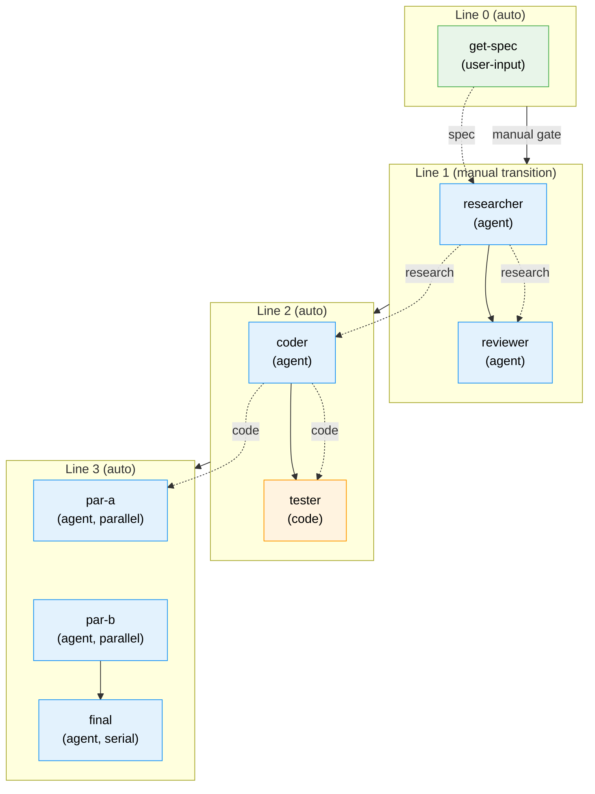
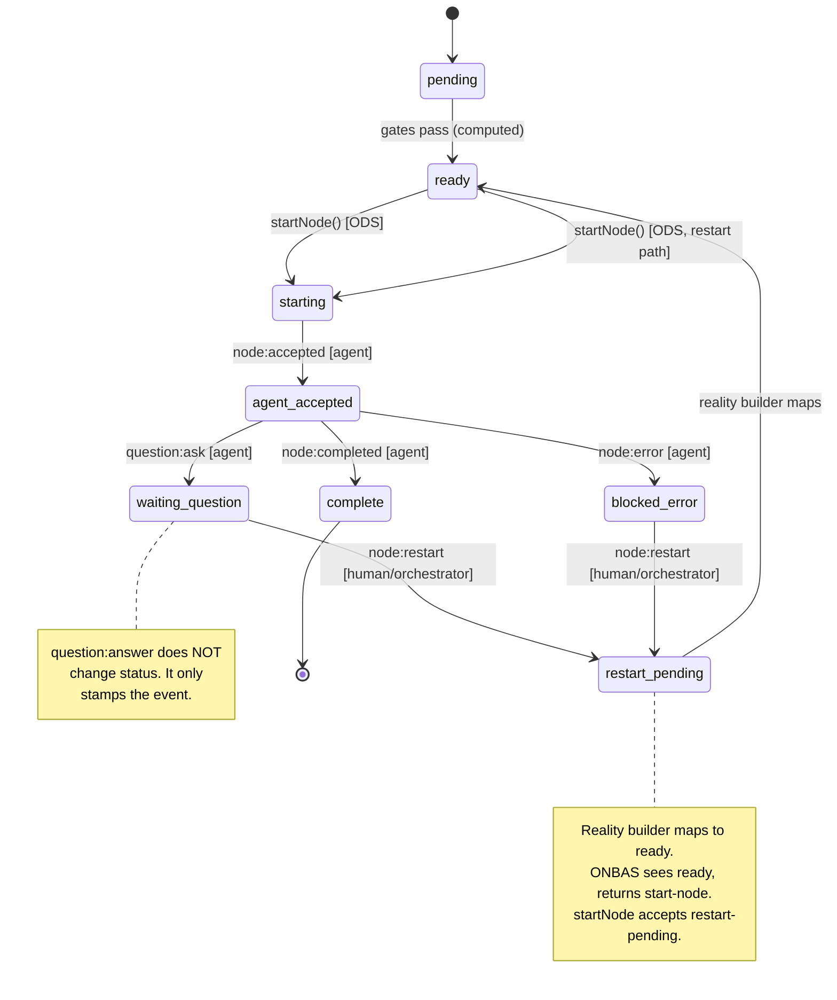
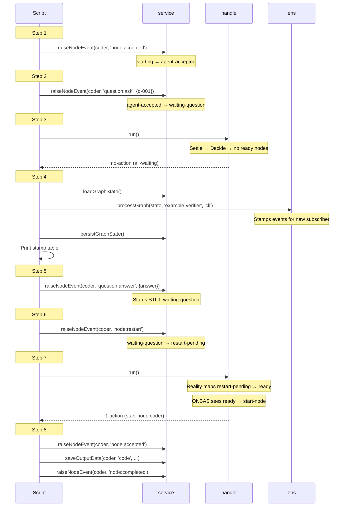

# Worked Example Walkthrough: All Orchestration Patterns

**Script**: [worked-example-full.ts](./worked-example-full.ts)
**Simple version**: [worked-example.ts](./worked-example.ts) (2-node quick-start)

This walkthrough explains the comprehensive worked example that drives a 4-line, 8-node graph through every orchestration pattern.

---

## Graph Architecture

**Legend**: Green = user-input | Blue = agent | Orange = code. Solid arrows = serial order. Dotted arrows = input wiring.

---

## Node Lifecycle State Machine

Every node follows this state machine. The question/answer/restart path (Section 6) exercises the full cycle including the restart loop.

---

## Question/Answer/Restart Sequence (Section 6)

This is the most complex pattern — the 8-step lifecycle demonstrated in Section 6.

---

## Multi-Subscriber Event Stamps

Each event has per-subscriber stamps. Three subscribers appear in the example:

| Subscriber | Created By | When |
|------------|-----------|------|
| `'cli'` | `service.raiseNodeEvent()` (inline settlement) | Every event raise |
| `'orchestrator'` | `handle.run()` settle phase | Every orchestration loop |
| `'example-verifier'` | Explicit `ehs.processGraph()` in Section 6 | Manual inspection |

Events raised after the last `handle.run()` only have the `'cli'` stamp. The `'orchestrator'` stamp gets added by the next `run()` call. This asymmetry is instructive — it shows each subscriber processes events at its own pace.

---

## Section-to-Pattern Mapping

| Section | Title | Patterns | Workshop Source |
|---------|-------|----------|---------------|
| 1 | Wire the Full Stack | Stack wiring (7 real + 2 fakes) | Workshop 14 Part 1 |
| 2 | Create the Graph | 4 lines, 8 nodes, 5 input wirings | Workshop 14 Part 3 |
| 3 | User-Input Node | ONBAS skip, manual completion | Workshop 14 Part 4.3 |
| 4 | Serial Agents + Wiring | Input resolution (Gate 4), serial chain | Workshop 14 Part 4.4 |
| 5 | Manual Transition Gate | Line-level blocking, trigger | Workshop 14 Part 4.5 |
| 6 | Question/Answer/Restart | Full Q&A lifecycle, stamps, settlement | Workshop 14 Parts 4.6, 6, 7 |
| 7 | Code Node | CodePod, FakeScriptRunner | Workshop 14 Part 4.7 |
| 8 | Parallel + Serial Gate | 2 parallel starts, serial successor | Workshop 14 Part 4.8 |
| 9 | Graph Complete | Reality snapshot, 8/8 complete | Workshop 14 Part 4.9 |
| 10 | Idempotency Proof | Per-subscriber processGraph | Workshop 14 Part 4.10 |

---

## Comparison with Other Test Artifacts

| Artifact | Scope | Uses CLI? | Nodes | Purpose |
|----------|-------|-----------|-------|---------|
| `worked-example.ts` | Loop mechanics intro | No | 2 | 5-minute quick-start |
| **`worked-example-full.ts`** | **All patterns** | **No** | **8** | **30-minute deep dive** |
| `test/e2e/...orchestration-e2e.ts` | Full validation | Yes (hybrid) | 8 | CI validation |
| `test/e2e/...node-event-system-e2e.ts` | Event system | Yes (CLI) | 2 | Event system proof |

---

## Key Teaching Points

1. **ONBAS skips user-input nodes**: User-input nodes pass all gates (they're `ready`) but ONBAS returns `null` — the user must complete them manually.

2. **Input wiring feeds Gate 4**: A node cannot become `ready` until all its required inputs have saved output data from their source nodes.

3. **`question:answer` does NOT transition status**: The node stays in `waiting-question`. Only `node:restart` moves to `restart-pending`. This separation keeps "data events" (answer) distinct from "control events" (restart).

4. **Three-layer restart convention**: Handler writes `restart-pending` → reality builder maps to `ready` → `startNode()` accepts `restart-pending` as valid from-state. Each layer has a clear responsibility.

5. **Parallel nodes yield multiple actions per run()**: ONBAS iterates — one action per call, the loop starts a node, re-settles, and asks again. Two ready parallel nodes produce two iterations in one `run()`.

6. **Settlement is per-subscriber and idempotent**: Each subscriber sees every event exactly once. Calling `processGraph` twice with the same subscriber returns 0 events the second time.

7. **Code vs Agent distinction lives in ODS**: ONBAS treats all node types the same (ready → start-node). ODS checks `unitType` and picks CodePod (FakeScriptRunner) or AgentPod (FakeAgentAdapter).
