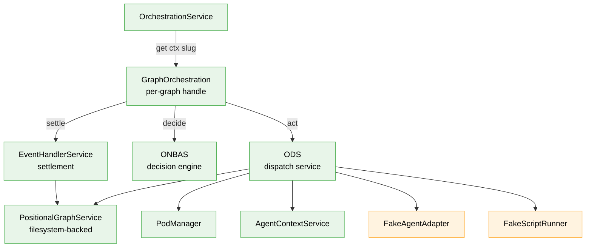
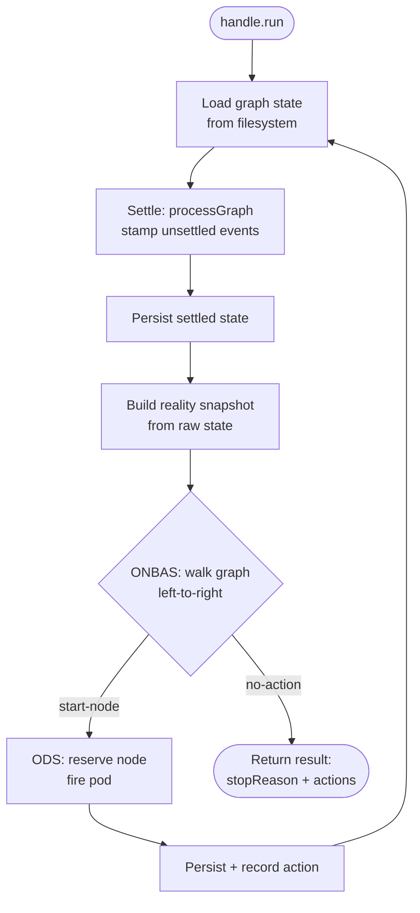
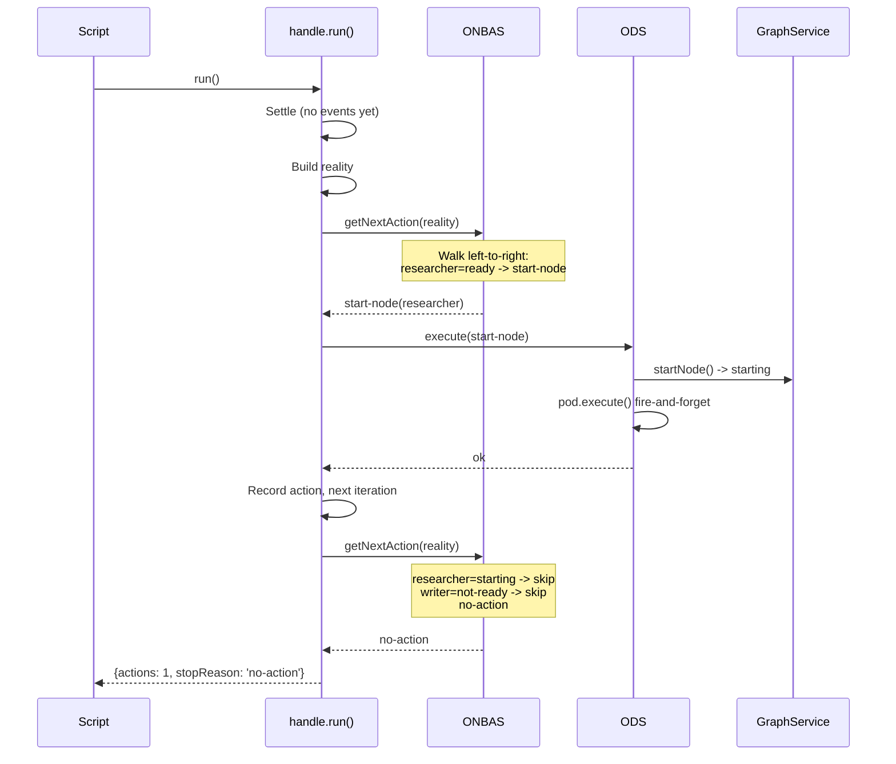
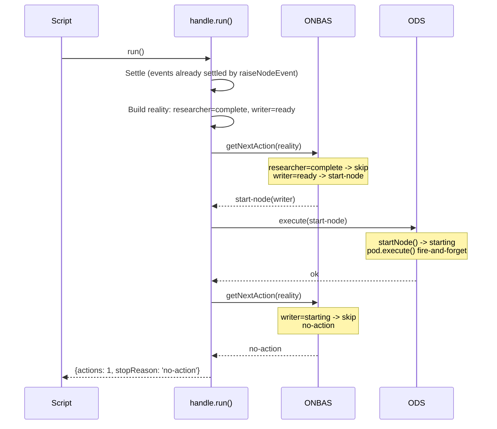
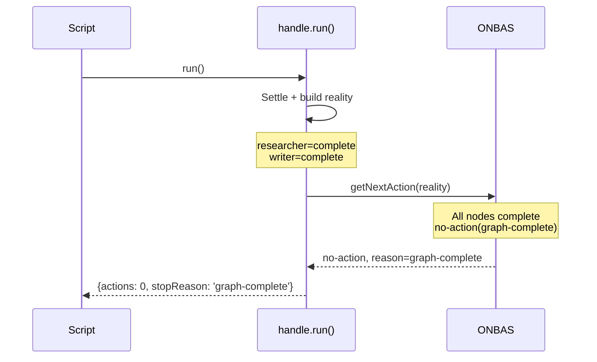

# Worked Example Walkthrough: The Settle-Decide-Act Loop

**Phase**: Phase 8 — E2E and Integration Testing
**Plan**: Plan 030 — Positional Orchestrator
**Script**: [`worked-example.ts`](./worked-example.ts)
**Run**: `npx tsx docs/plans/030-positional-orchestrator/tasks/phase-8-e2e-and-integration-testing/examples/worked-example.ts`

---

## What This Demonstrates

The script drives a 2-node graph (researcher -> writer) through the complete orchestration lifecycle using **real implementations** of every component except the agent adapter and script runner. It shows:

1. How the orchestration stack is wired (7 collaborators)
2. How `handle.run()` executes the Settle-Decide-Act loop
3. How ONBAS walks the graph and picks the next ready node
4. How events flow through `raiseNodeEvent()` (record + settle inline)
5. How the reality snapshot captures full graph state

---

## Architecture: What Gets Wired



**Legend**: green = real implementation | orange = fake (test double)

The two-level pattern: `OrchestrationService` (singleton) creates `GraphOrchestration` handles (per-graph). The handle owns the loop.

---

## The Loop: Settle -> Decide -> Act

Each call to `handle.run()` executes this loop until ONBAS returns `no-action`:



The loop runs synchronously. Each iteration processes at most one action. ONBAS is pure and stateless — it reads the reality snapshot and returns the single best action.

---

## Section-by-Section Walkthrough

### Section 1: Wire the Stack

Creates the full orchestration dependency tree in-process. The key insight: the orchestration stack's `EventHandlerService` and the `PositionalGraphService`'s internal event system both read/write the **same filesystem state**. When we call `service.raiseNodeEvent()`, it settles events via the service's own internal handlers. When `handle.run()` later calls `processGraph()`, it finds those events already stamped by subscriber `'cli'` and processes them for subscriber `'orchestrator'` (idempotent state mutations, new stamps).

### Section 2: Create a Graph

```
Line 0:  researcher (pos=0, serial) --> writer (pos=1, serial)
```

One line, two nodes, serial execution. The researcher must complete before the writer becomes ready.

### Section 3: First run() — Start Researcher



ONBAS finds the researcher ready and tells ODS to start it. ODS calls `startNode()` (pending -> starting) and fires the pod (fire-and-forget via FakeAgentAdapter). On the next iteration, ONBAS sees the researcher is `starting` (skip) and the writer is not yet ready (serial successor, predecessor not complete). Returns `no-action`.

### Section 4: Agent Events

In the real system, a CLI agent in a subprocess calls:
- `cg wf node accept` -> raises `node:accepted` (starting -> agent-accepted)
- `cg wf node end` -> raises `node:completed` (agent-accepted -> complete)

Both CLI commands call `service.raiseNodeEvent()`, which:
1. Validates the event (type exists, payload valid, source allowed, node in valid state)
2. Records the event (appends to node's events array)
3. Settles inline (runs handler, which mutates node status)
4. Persists state to filesystem

The worked example calls the same service method directly — same behavior, no subprocess.

**Why not `nes.raise()`?** The low-level `NodeEventService.raise()` is **record-only** — it validates and appends the event but does NOT run handlers. Settlement is deferred to `processGraph()`. If you raise `node:accepted` via `nes.raise()`, the node stays in `starting` (handler hasn't run), so `node:completed` validation fails (requires `agent-accepted`). The service-level `raiseNodeEvent()` settles inline, matching the real CLI path.

### Section 5: Second run() — Start Writer



The researcher's events were already settled in Section 4. The settle phase finds them pre-stamped for `'cli'` and stamps them for `'orchestrator'` (idempotent). The reality snapshot shows researcher=complete, writer=ready. ONBAS picks the writer.

### Section 6: Graph Complete

After completing the writer's events (same pattern as Section 4), the final `handle.run()`:



ONBAS walks the graph and finds every node complete. It returns `no-action` with reason `graph-complete`. The loop exits immediately.

### Section 7: Reality Snapshot

The reality snapshot is the central data structure. Every component reads from it:

| Field | Researcher | Writer |
|-------|-----------|--------|
| status | complete | complete |
| lineIndex | 1 | 1 |
| positionInLine | 0 | 1 |
| unitType | agent | agent |
| ready | true | true |
| execution | serial | serial |

Graph-level fields: `graphStatus=complete`, `totalNodes=2`, `completedCount=2`, `isComplete=true`, `currentLineIndex=2` (past-the-end sentinel — all lines processed).

---

## Key Architectural Insights

### Two Event System Instances

The system has two `INodeEventService` instances that share the same filesystem:

1. **Service-internal** (inside `PositionalGraphService`): Created by `createEventService()`. Used by `raiseNodeEvent()`, `endNode()`, etc. Settles events inline.

2. **Orchestration-external** (the `nes`/`ehs` wired to `OrchestrationService`): Used by `processGraph()` during the Settle phase. Processes events for subscriber `'orchestrator'`.

Both read/write the same state files. The service-internal instance stamps events as subscriber `'cli'`. The orchestration-external instance stamps as `'orchestrator'`. Handlers are idempotent — running them twice with different subscriber names produces the same state mutations but different stamps.

### Multi-Subscriber Event Model

From Workshop 13: events have per-subscriber stamps. The same event gets processed by both `'cli'` (inline during raise) and `'orchestrator'` (during the Settle phase). This is the extension seam — a future orchestrator-specific handler could detect questions and notify a UI, while the CLI handler does its record-keeping independently.

### ONBAS is Pure and Stateless

ONBAS receives a reality snapshot and returns one action. It has no memory, no side effects, no filesystem access. This makes it trivially testable and deterministic — given the same snapshot, it always returns the same action.

### ODS is Fire-and-Forget

ODS calls `startNode()` to reserve the node (pending -> starting), then fires `pod.execute()` without awaiting. The pod runs in the background (or, with FakeAgentAdapter, resolves immediately). Control returns to the loop, which discovers the node is now `starting` and skips it.

---

## Expected Output

```
━━━ Section 1: Orchestration Stack ━━━
→ Graph service:     real (filesystem-backed in temp dir)
→ ONBAS:             real (pure, synchronous decision engine)
→ ODS:               real (dispatches start-node, fire-and-forget)
→ Event system:      real (7 core event types registered)
→ Agent adapter:     FAKE (resolves immediately, records calls)
→ Script runner:     FAKE (returns exit 0)

━━━ Section 2: Graph Created ━━━
→ Graph slug:  example-graph
→ Line:        line-XXX
→ Node 1:      researcher-XXX (researcher, serial position 0)
→ Node 2:      writer-XXX (writer, serial position 1)

━━━ Section 3: First run() — Start Researcher ━━━
→ Actions:     1 (ONBAS found 1 ready node)
→ Action type: start-node
→ Node:        researcher-XXX
→ Stop reason: no-action (no more ready nodes)
→ Iterations:  2 (start + exit check)

━━━ Section 4: Agent Events Raised ━━━
→ Raised node:accepted for researcher-XXX (ok=true)
→ Raised node:completed for researcher-XXX (ok=true)
→ Events were raised AND settled inline (status transitions already applied)

━━━ Section 5: Second run() — Start Writer ━━━
→ Actions:     1
→ Action type: start-node
→ Node:        writer-XXX
→ Stop reason: no-action
→ Researcher already complete (settled in Section 4), writer now ready

━━━ Section 6: Graph Complete ━━━
→ Stop reason:      graph-complete
→ Actions:          0 (nothing to start)
→ Graph status:     complete
→ Total nodes:      2
→ Completed:        2
→ isComplete:       true
→ Current line idx: 2 (past-the-end sentinel)

━━━ Section 7: Reality Snapshot ━━━
→ researcher (researcher-XXX):
    status=complete  line=1  pos=0  type=agent
    ready=true  execution=serial
→ writer (writer-XXX):
    status=complete  line=1  pos=1  type=agent
    ready=true  execution=serial

→ Agent adapter was called 2 time(s) (fire-and-forget)

━━━ Done ━━━
✓ Walked through the full orchestration lifecycle:
    Wire stack → Create graph → run() → Events → run() → Events → run() → graph-complete
✓ All objects above are real instances from the actual Plan 030 implementation
✓ Only 2 fakes used: FakeAgentAdapter and FakeScriptRunner
```

(Node IDs are generated at runtime and will vary between runs.)

---

## Source Files

| Component | File | What it does |
|-----------|------|-------------|
| OrchestrationService | `packages/positional-graph/src/features/030-orchestration/orchestration-service.ts` | Singleton factory, creates per-graph handles |
| GraphOrchestration | `packages/positional-graph/src/features/030-orchestration/graph-orchestration.ts` | The Settle-Decide-Act loop |
| ONBAS | `packages/positional-graph/src/features/030-orchestration/onbas.ts` | Pure walk algorithm |
| ODS | `packages/positional-graph/src/features/030-orchestration/ods.ts` | Dispatch service |
| PodManager | `packages/positional-graph/src/features/030-orchestration/pod-manager.ts` | Pod lifecycle |
| AgentContextService | `packages/positional-graph/src/features/030-orchestration/agent-context-service.ts` | Session context |
| EventHandlerService | `packages/positional-graph/src/features/032-node-event-system/event-handler-service.ts` | Event settlement |
| NodeEventService | `packages/positional-graph/src/features/032-node-event-system/node-event-service.ts` | Event recording |
| PositionalGraphService | `packages/positional-graph/src/services/positional-graph.service.ts` | Graph CRUD + raiseNodeEvent |
| FakeAgentAdapter | `packages/shared/src/fakes/fake-agent-adapter.ts` | Resolves immediately |
| FakeScriptRunner | `packages/positional-graph/src/features/030-orchestration/fake-script-runner.ts` | Returns exit 0 |
